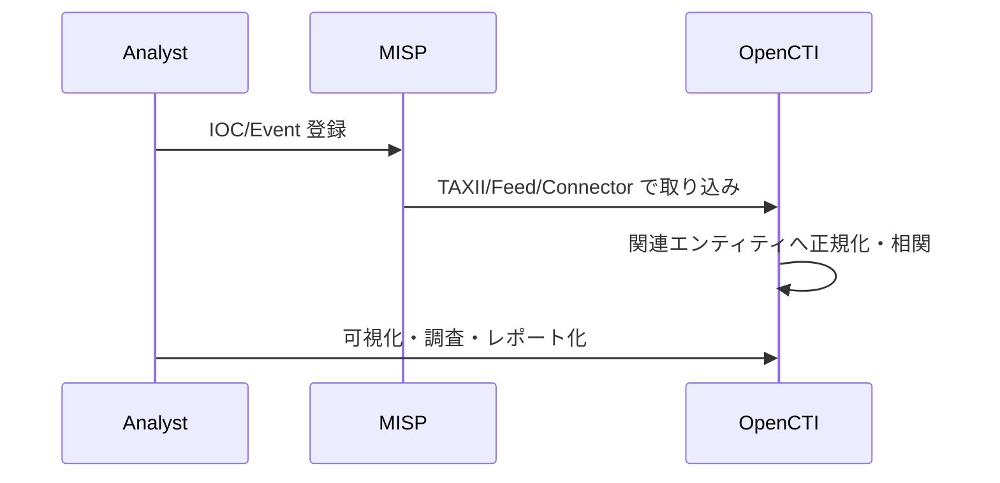

## TL;DR

- **MISP** は IOC 管理・共有の中核
- **OpenCTI** はナレッジグラフと分析の中核
- まずは Docker で別々に安定稼働させ、あとから TAXII / Feed / Connector で連携するのが安全です

---

## 今回の構成（検証環境）

今回の検証では、MISP と OpenCTI を同一セグメント上の別サービスとして立て、段階的に連携しました。

- `MISP`：イベント、属性、タグ、warninglist 運用
- `OpenCTI`：エンティティ相関、可視化、ワークベンチ分析
- `Redis / RabbitMQ / Elasticsearch / MinIO`：OpenCTI 側の依存サービス

---

## 軽い手順（最短版）

### 1) 先に MISP を起動

- 先に MISP の初期管理者ログインが成功する状態を作る
- URL・TLS・メール設定（最低限）を確認する

### 2) 次に OpenCTI を起動

- OpenCTI は依存サービスが多いので、まずは単体でヘルスチェック
- UI ログイン、ワーカー起動、ジョブキュー消化を確認

### 3) 連携は段階的に

1. OpenCTI から MISP API へ到達確認
2. 小さなテスト Event を MISP で作成
3. OpenCTI でテスト取り込み
4. 重複・タグ・TLP の取り扱いを調整

---

## 今有効化しているコネクター一覧（この環境）

> 下記は「今回の検証環境」で常時有効化しているコネクターです。

| コネクター | 役割 | 主な用途 |
|---|---|---|
| MISP Connector | MISP 連携 | MISP の Event/Attribute 取り込み |
| TAXII 2 Connector | TAXII 取得 | TAXII サーバーから STIX データ取得 |
| CISA KEV Connector | 外部フィード取得 | Known Exploited Vulnerabilities の定期取得 |
| AlienVault OTX Connector | 外部フィード取得 | OTX パルスの IOC 取り込み |
| URLhaus Connector | 外部フィード取得 | 悪性 URL/ドメインの取り込み |
| VirusTotal Live Stream Connector | 外部フィード取得 | 追加 IOC の拡張取得（契約範囲内） |

**運用メモ**
- まずは `MISP Connector` と `TAXII 2 Connector` のみ有効化し、安定後に外部フィードを増やす
- 取り込み頻度は短くしすぎると重複・ノイズが増えるため、最初は低頻度から調整する

---

## つまずきやすいポイント

- **時刻同期（NTP）**：時刻ズレは取り込み失敗や証明書エラーの原因
- **メモリ不足**：OpenCTI + Elastic でメモリ圧迫しやすい
- **権限分離不足**：管理者APIキーを常用しない
- **いきなり大量投入**：最初は小規模データでマッピング確認

---

## 運用メモ（最初に決めると楽）

- TLP / PAP / Tag の命名規約
- IOC の寿命管理（expire / false-positive）
- 連携方向（MISP → OpenCTI を主にするか、双方向にするか）
- 監査ログの保存期間

---

## 公式ドキュメント案内

構築・運用時は以下の一次情報を必ず参照してください。

- [MISP 公式ドキュメント](https://www.misp-project.org/documentation/)
- [MISP GitHub](https://github.com/MISP/MISP)
- [OpenCTI 公式ドキュメント](https://docs.opencti.io/latest/)
- [OpenCTI GitHub](https://github.com/OpenCTI-Platform/opencti)
- [TAXII 2.1 仕様（OASIS）](https://docs.oasis-open.org/cti/taxii/v2.1/)

---

## まとめ

- まずは **MISP と OpenCTI を個別に安定稼働** させる
- 連携は **小さいテストデータ** から段階的に行う
- 実運用前に **タグ規約・権限分離・監査設計** を固める

この順序にすると、構築直後のトラブル切り分けがかなり楽になります。
