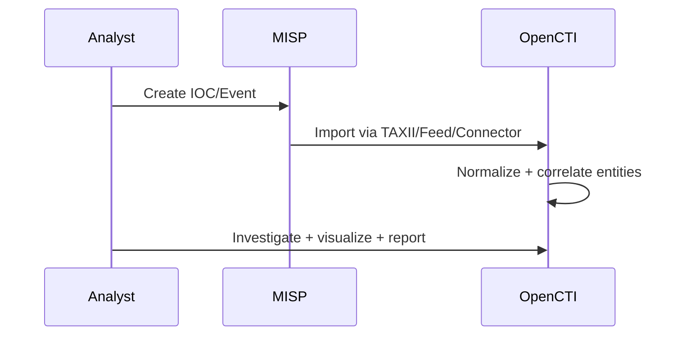

## TL;DR

- **MISP** is best as your IOC sharing/management hub.
- **OpenCTI** is best as your graph-centric analysis hub.
- Stabilize them separately first, then integrate via TAXII/feeds/connectors.

---

## Lab architecture used

In this lab, we deployed MISP and OpenCTI as separate services in the same segment and integrated them in phases.

- `MISP`: events, attributes, tags, warninglists
- `OpenCTI`: entity correlation, graph analysis, reporting
- `Redis / RabbitMQ / Elasticsearch / MinIO`: core OpenCTI dependencies

---

## Light setup procedure

### 1) Bring up MISP first

- Ensure initial admin login works
- Validate URL/TLS/mail base settings

### 2) Bring up OpenCTI second

- Verify dependencies and health checks first
- Confirm UI login, workers, and queue processing

### 3) Integrate in small phases

1. Check OpenCTI reachability to MISP API
2. Create a small test event in MISP
3. Import into OpenCTI
4. Tune dedup/tag/TLP handling

---

## Currently enabled connectors (this lab)

> The table below reflects the connectors currently enabled in this lab environment.

| Connector | Role | Primary use |
|---|---|---|
| MISP Connector | MISP integration | Import events/attributes from MISP |
| TAXII 2 Connector | TAXII ingestion | Pull STIX data from TAXII servers |
| CISA KEV Connector | External feed | Periodic ingest of Known Exploited Vulnerabilities |
| AlienVault OTX Connector | External feed | Ingest OTX pulse IOCs |
| URLhaus Connector | External feed | Import malicious URL/domain intelligence |
| VirusTotal Live Stream Connector | External feed | Extended IOC enrichment (within license scope) |

**Ops notes**
- Start with `MISP Connector` and `TAXII 2 Connector` first, then add external feeds after baseline stability.
- If ingestion runs too frequently, duplicates/noise increase quickly; start conservative and tune.

---

## Common pitfalls

- **Time sync (NTP)** issues break ingest/cert validation
- **Memory pressure** (especially OpenCTI + Elasticsearch)
- **Weak privilege separation** (avoid daily use of admin API keys)
- **Bulk ingest too early** before mapping validation

---

## Operational decisions to make early

- TLP / PAP / tag naming conventions
- IOC lifecycle handling (expire / false positive)
- Integration direction (mainly MISP → OpenCTI vs bidirectional)
- Audit log retention policy

---

## Official documentation

Use primary sources while building and operating:

- [MISP Documentation](https://www.misp-project.org/documentation/)
- [MISP GitHub](https://github.com/MISP/MISP)
- [OpenCTI Documentation](https://docs.opencti.io/latest/)
- [OpenCTI GitHub](https://github.com/OpenCTI-Platform/opencti)
- [TAXII 2.1 Spec (OASIS)](https://docs.oasis-open.org/cti/taxii/v2.1/)

---

## Conclusion

- Stabilize **MISP and OpenCTI independently** first
- Integrate gradually with **small test datasets**
- Finalize **governance (tags, roles, audit)** before production use

This order significantly reduces troubleshooting overhead in early deployment.
