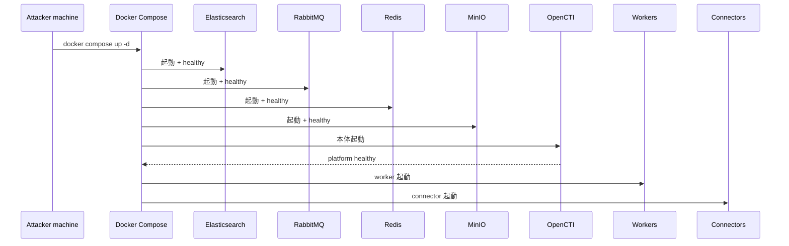
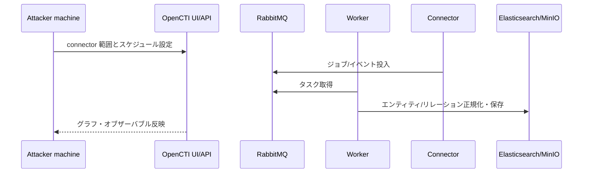

## TL;DR

OpenCTI は単一コンテナではなく、`opencti` 本体、`worker`、各種 connector、`elasticsearch`、`redis`、`rabbitmq`、`minio` を含むスタック運用です。起動順とヘルスを段階確認し、最初はコネクタを絞ることで安定運用に入りやすくなります。

---

## 構成概要

| コンポーネント | 役割 | 主なポート |
|---|---|---|
| `opencti` | Web UI / API バックエンド | `8800` |
| `worker` | バックグラウンド処理 | 内部 |
| connectors | フィード取込・出力処理 | 内部 |
| `elasticsearch` | 検索/ドキュメントストア | 内部 `9200` |
| `redis` | キャッシュ・キュー補助 | 内部 `6379` |
| `rabbitmq` | メッセージブローカー | `5672`, 管理 `15672` |
| `minio` | オブジェクトストレージ | `9000` |



---

## 事前準備

- Docker Engine + Docker Compose plugin
- 例: `/opt/threat-intelligence/opencti` の作業ディレクトリ
- Elasticsearch を考慮した十分なメモリ/ディスク
- コネクタを段階的に有効化する運用方針

---

## Step 1: `.env` を設定する

まず `.env` の管理者情報とベースURLを定義します。

```bash
cd /opt/threat-intelligence/opencti
```

最低限設定すべき項目:

```env
OPENCTI_ADMIN_EMAIL=admin@admin.test
OPENCTI_ADMIN_PASSWORD=<STRONG_PASSWORD>
OPENCTI_ADMIN_TOKEN=<RANDOM_UUID>
OPENCTI_BASE_URL=http://<YOUR_SERVER_IP>:8800
```

`8800` で公開するなら、`OPENCTI_BASE_URL` も同じURLに揃えるのが重要です。

---

## Step 2: スタック全体を起動する

```bash
docker compose up -d
```

初回は起動に時間がかかるので、段階的に状態を見ます。

```bash
docker compose ps
```

期待する順序:

1. `elasticsearch` / `rabbitmq` / `redis` / `minio` が `healthy`
2. `opencti` が `healthy`
3. workers / connectors が `Up`

---

## Step 3: UI の到達確認

```bash
curl -I http://127.0.0.1:8800
```

`200` 系応答なら UI は到達可能です。

---

## 初回ログイン

- URL: `http://<SERVER_IP>:8800`
- ユーザー: `OPENCTI_ADMIN_EMAIL`
- パスワード: `OPENCTI_ADMIN_PASSWORD`

ログイン後の推奨初動:

1. 管理者パスワードとトークン運用の見直し
2. 管理者共有を避け、役割別ユーザーを作成
3. connector の権限・実行周期を見直し

---

## コネクタ初期運用の考え方

最初から大量コネクタを有効化すると、取り込み負荷とノイズログが増えがちです。まずは MITRE + 少数の主要フィードで品質と負荷を見て、段階的に拡張する運用が安定します。



---

## よくある落とし穴

### 1) アクセスポート間違い

`8800` に公開しているのに `8080` へアクセスすると接続できません。`docker compose ps` で公開ポートを確認します。

### 2) Base URL 不一致

`OPENCTI_BASE_URL` が実際の公開URLと違うと、セッションやリンク動作が不安定になります。

### 3) 初期同期時のコネクタ警告

初回同期では一時的な警告が出ることがあります。継続的な失敗かどうかをログで切り分けて判断します。

---

## 運用前ハードニングチェック

- UI/API のアクセス元制限
- `.env` をGit管理外に保つ
- Elasticsearch/MinIO 含むバックアップ設計
- worker/connector の継続監視
- イメージバージョン固定とロールバック手順

---

## 参考

- [OpenCTI Platform (official)](https://github.com/OpenCTI-Platform/opencti)
- [OpenCTI Documentation](https://docs.opencti.io/)
