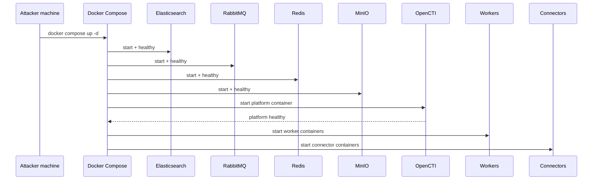
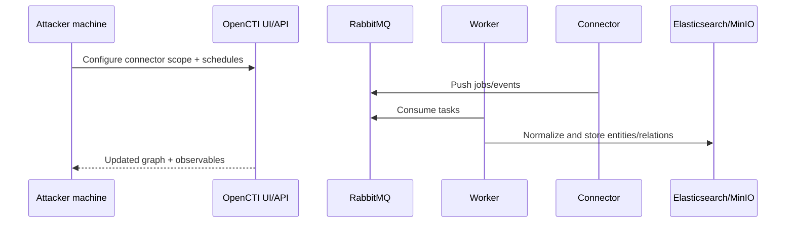

## TL;DR

OpenCTI deployment is not just one container. You must launch and monitor a full stack: `opencti`, `worker`, connectors, `elasticsearch`, `redis`, `rabbitmq`, and `minio`. Keep startup observable, validate health in order, and control connector scope early to avoid noisy unstable ingestion.

---

## Target Architecture

| Component | Role | Typical Port |
|---|---|---|
| `opencti` | Web UI + API backend | `8800` |
| `worker` | Background jobs and task execution | internal |
| Connectors | External feed ingestion/export jobs | internal |
| `elasticsearch` | Main search/document store | internal `9200` |
| `redis` | Cache and queue helper | internal `6379` |
| `rabbitmq` | Message broker | `5672`, mgmt `15672` |
| `minio` | Object storage | `9000` |



---

## Prerequisites

- Docker Engine + Docker Compose plugin
- Directory such as `/opt/threat-intelligence/opencti`
- Adequate memory and disk for Elasticsearch-heavy workloads
- A plan for connector scope (do not enable everything blindly in production)

---

## Step 1: Configure `.env`

Create and edit `.env` with explicit admin and base URL settings.

```bash
cd /opt/threat-intelligence/opencti
```

Essential fields:

```env
OPENCTI_ADMIN_EMAIL=admin@admin.test
OPENCTI_ADMIN_PASSWORD=<STRONG_PASSWORD>
OPENCTI_ADMIN_TOKEN=<RANDOM_UUID>
OPENCTI_BASE_URL=http://<YOUR_SERVER_IP>:8800
```

If you expose on `8800`, make sure `OPENCTI_BASE_URL` matches that endpoint to avoid callback/session issues.

---

## Step 2: Start Full Stack

```bash
docker compose up -d
```

Check status repeatedly during first boot:

```bash
docker compose ps
```

Expected order:

1. `elasticsearch`, `rabbitmq`, `redis`, `minio` become `healthy`
2. `opencti` becomes `healthy`
3. workers/connectors transition to `Up`

---

## Step 3: Verify UI Reachability

```bash
curl -I http://127.0.0.1:8800
```

`HTTP/1.1 200 OK` (or equivalent success) confirms the UI endpoint is live.

---

## First Login

- URL: `http://<SERVER_IP>:8800`
- Username: `OPENCTI_ADMIN_EMAIL`
- Password: `OPENCTI_ADMIN_PASSWORD`

After login, immediately:

1. Rotate admin password and token policy.
2. Create role-based users instead of sharing admin account.
3. Audit connector permissions and schedules.

---

## Connector Strategy for Stable Start

Many default connectors can produce heavy ingestion and noisy warning logs from day one. Start with a minimal set (for example MITRE + one or two curated feeds), validate data quality and performance, then scale gradually.



---

## Common Pitfalls

### 1) Wrong access port

If you mapped OpenCTI to `8800`, `8080` will fail. Confirm with `docker compose ps` and use the mapped host port.

### 2) Base URL mismatch

If `OPENCTI_BASE_URL` points to a different host/port, UI flows and links can break. Keep it aligned with real access URL.

### 3) Connector noise during bootstrap

Some feeds are high-volume and may generate transient warnings while dependencies warm up. This is common at initial sync, but watch for sustained failures.

---

## Hardening Checklist

- Restrict UI/API access by source IP where possible.
- Keep secrets out of Git (`.env` must stay private).
- Back up OpenCTI data stores (especially Elasticsearch and MinIO).
- Monitor worker and connector health continuously.
- Pin image versions and upgrade with rollback plan.

---

## References

- [OpenCTI Platform (official)](https://github.com/OpenCTI-Platform/opencti)
- [OpenCTI Documentation](https://docs.opencti.io/)
